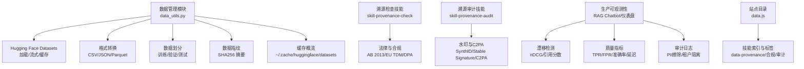
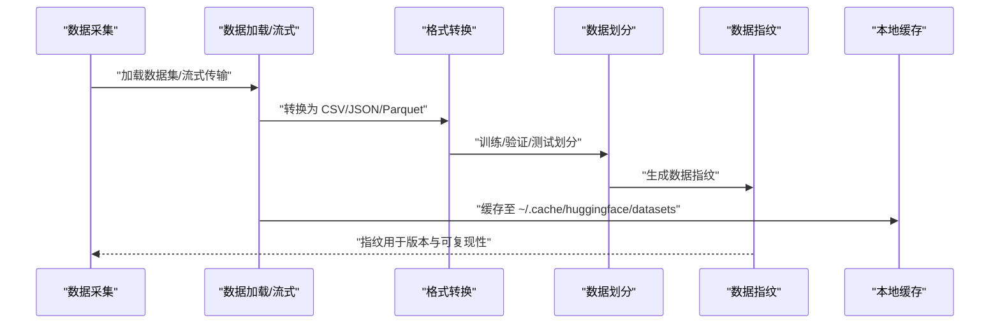
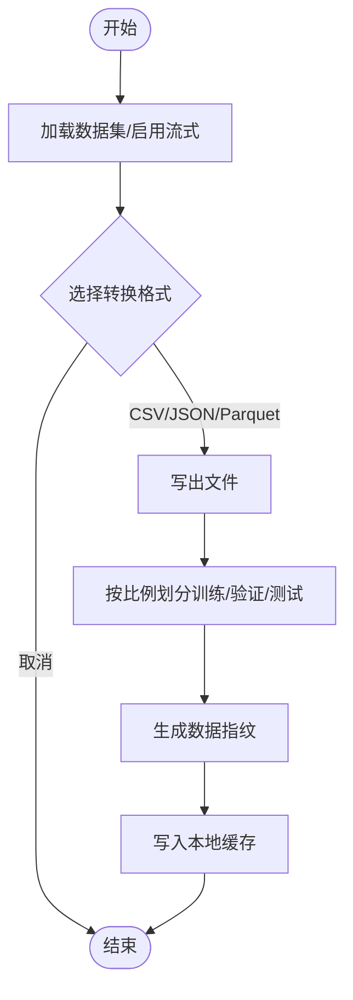
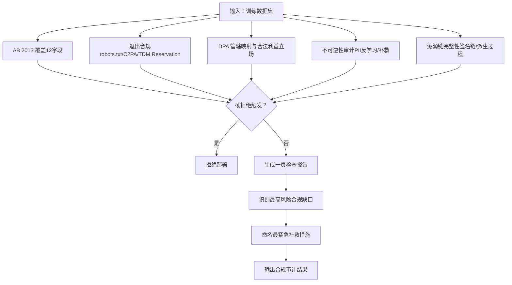
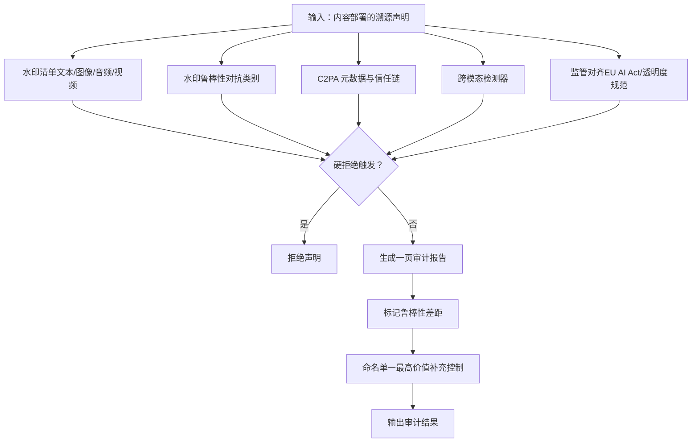
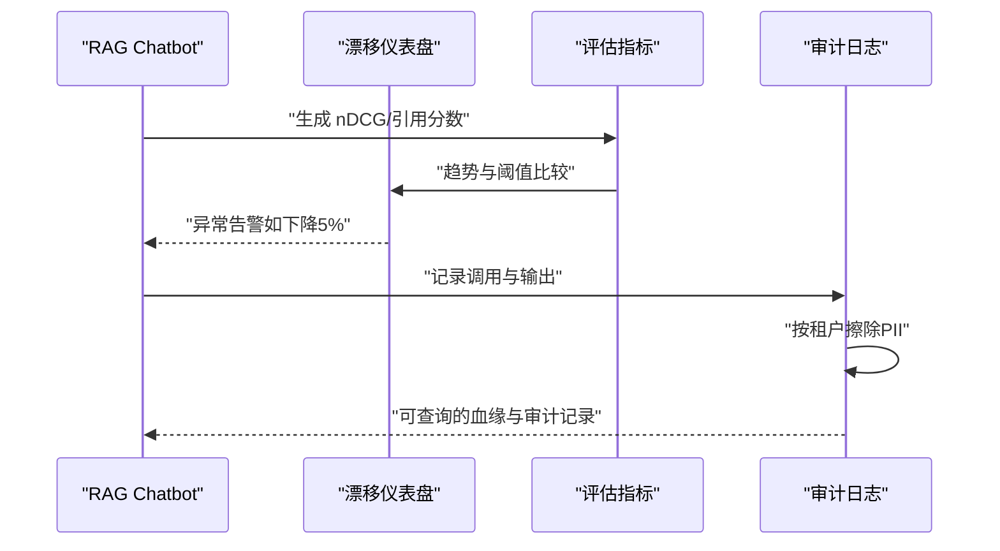
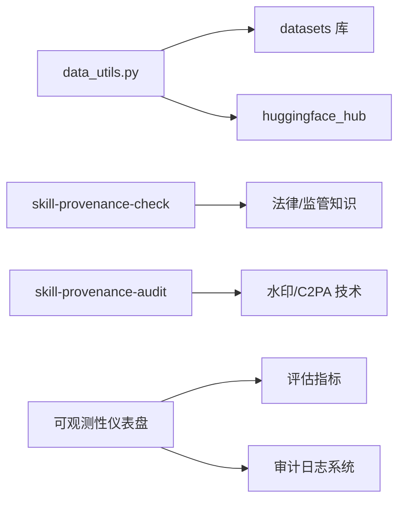

# 数据溯源治理

<cite>
**本文档引用的文件**
- [data_utils.py](file://phases/00-setup-and-tooling/09-data-management/code/data_utils.py)
- [数据管理（中文）](file://phases/00-setup-and-tooling/09-data-management/docs/zh.md)
- [数据管理（英文）](file://phases/00-setup-and-tooling/09-data-management/docs/en.md)
- [技能：溯源检查（英文）](file://phases/18-ethics-safety-alignment/27-data-provenance-training-governance/outputs/skill-provenance-check.md)
- [技能：溯源检查（中文）](file://phases/18-ethics-safety-alignment/27-data-provenance-training-governance/outputs/skill-provenance-check.zh.md)
- [技能：溯源审计（英文）](file://phases/18-ethics-safety-alignment/23-watermarking-synthid-stable-signature-c2pa/outputs/skill-provenance-audit.md)
- [技能：溯源审计（中文）](file://phases/18-ethics-safety-alignment/23-watermarking-synthid-stable-signature-c2pa/outputs/skill-provenance-audit.zh.md)
- [基准评估（中文）](file://phases/19-capstone-projects/08-production-rag-chatbot/quiz.zh.json)
- [基准评估（英文）](file://phases/19-capstone-projects/08-production-rag-chatbot/quiz.json)
- [可观测性仪表盘（英文）](file://phases/19-capstone-projects/11-llm-observability-dashboard/quiz.json)
- [数据管理工具（中文）](file://phases/00-setup-and-tooling/09-data-management/code/data_utils.py)
- [站点目录（数据）](file://site/data.js)
- [基准评估（中文）](file://phases/19-capstone-projects/13-mcp-server-with-registry/quiz.json)
</cite>

## 目录
1. [简介](#简介)
2. [项目结构](#项目结构)
3. [核心组件](#核心组件)
4. [架构总览](#架构总览)
5. [详细组件分析](#详细组件分析)
6. [依赖关系分析](#依赖关系分析)
7. [性能考量](#性能考量)
8. [故障排查指南](#故障排查指南)
9. [结论](#结论)
10. [附录](#附录)

## 简介
本技术文档围绕“数据溯源治理”主题，结合仓库中的数据管理、合规与审计实践，系统阐述数据溯源的概念、重要性与实施策略，覆盖训练数据治理的全流程（采集、标注、清洗、验证），并给出数据血缘追踪、元数据管理、版本控制、变更记录、质量评估与监控、合规性检查与审计跟踪的可操作方案。文档同时提供可视化图示与流程图，帮助读者快速理解与落地。

## 项目结构
本仓库中与数据溯源治理直接相关的核心模块包括：
- 数据管理与格式转换：提供数据加载、流式传输、格式转换、划分、指纹与缓存概览等能力
- 合规与审计技能：面向训练数据与内容部署的溯源检查与审计
- 生产级可观测性与质量监控：涵盖漂移检测、延迟与准确率评估、审计日志与隐私保护
- 站点目录：提供与合规、溯源、审计相关的技能索引与标签体系

**图表来源**
- [data_utils.py:22-152](file://phases/00-setup-and-tooling/09-data-management/code/data_utils.py#L22-L152)
- [技能：溯源检查（英文）:10-29](file://phases/18-ethics-safety-alignment/27-data-provenance-training-governance/outputs/skill-provenance-check.md#L10-L29)
- [技能：溯源审计（英文）:10-29](file://phases/18-ethics-safety-alignment/23-watermarking-synthid-stable-signature-c2pa/outputs/skill-provenance-audit.md#L10-L29)
- [基准评估（英文）:55-62](file://phases/19-capstone-projects/08-production-rag-chatbot/quiz.json#L55-L62)
- [可观测性仪表盘（英文）:43-49](file://phases/19-capstone-projects/11-llm-observability-dashboard/quiz.json#L43-L49)
- [站点目录（数据）:18520-18563](file://site/data.js#L18520-L18563)

**章节来源**
- [数据管理（中文）:1-53](file://phases/00-setup-and-tooling/09-data-management/docs/zh.md#L1-L53)
- [数据管理（英文）:23-31](file://phases/00-setup-and-tooling/09-data-management/docs/en.md#L23-L31)

## 核心组件
- 数据管理与格式转换：提供数据加载、流式传输、格式转换（CSV/JSON/Parquet）、划分（训练/验证/测试）、指纹计算与缓存概览，支撑数据生命周期的可复现与可追溯
- 训练数据溯源检查：面向法律与合规要求（如加州 AB 2013、欧盟 TDM 退出义务、DPA 合法利益立场），形成五项检查清单与硬拒绝/拒绝规则
- 内容溯源审计：面向水印与 C2PA 元数据的审计，覆盖水印清单、鲁棒性、C2PA 覆盖、跨模态检测器与监管对齐
- 生产可观测性与质量监控：包含漂移检测（nDCG/引用分数）、质量指标（TPR/FPR/准确率/延迟）、审计日志（PII 擦除与租户隔离）

**章节来源**
- [data_utils.py:22-152](file://phases/00-setup-and-tooling/09-data-management/code/data_utils.py#L22-L152)
- [技能：溯源检查（英文）:10-29](file://phases/18-ethics-safety-alignment/27-data-provenance-training-governance/outputs/skill-provenance-check.md#L10-L29)
- [技能：溯源审计（英文）:10-29](file://phases/18-ethics-safety-alignment/23-watermarking-synthid-stable-signature-c2pa/outputs/skill-provenance-audit.md#L10-L29)
- [基准评估（英文）:55-62](file://phases/19-capstone-projects/08-production-rag-chatbot/quiz.json#L55-L62)
- [可观测性仪表盘（英文）:43-49](file://phases/19-capstone-projects/11-llm-observability-dashboard/quiz.json#L43-L49)

## 架构总览
下图展示从数据采集到合规审计与可观测性的整体流程，强调数据血缘、元数据与版本控制在各环节的衔接。

**图表来源**
- [data_utils.py:22-152](file://phases/00-setup-and-tooling/09-data-management/code/data_utils.py#L22-L152)

## 详细组件分析

### 数据管理与格式转换（数据采集与血缘基础）
- 数据加载与流式传输：支持远程数据集的按需加载与流式读取，避免全量下载带来的资源压力
- 格式转换：在 CSV/JSON/Parquet 间转换，便于不同阶段与工具链的对接
- 数据划分：固定随机种子确保划分可复现，保障实验可比性
- 指纹与缓存：通过哈希指纹与本地缓存，建立数据版本与血缘的基础标识

**图表来源**
- [data_utils.py:22-152](file://phases/00-setup-and-tooling/09-data-management/code/data_utils.py#L22-L152)

**章节来源**
- [data_utils.py:22-152](file://phases/00-setup-and-tooling/09-data-management/code/data_utils.py#L22-L152)
- [数据管理（中文）:208-242](file://phases/00-setup-and-tooling/09-data-management/docs/zh.md#L208-L242)
- [数据管理（英文）:55-91](file://phases/00-setup-and-tooling/09-data-management/docs/en.md#L55-L91)

### 训练数据溯源检查（合规与审计）
- 检查清单：AB 2013 覆盖、退出合规、DPA 管辖映射、不可逆性审计、溯源链完整性
- 硬拒绝与拒绝规则：明确不可接受的部署行为与通用合规策略的边界
- 输出：一页检查报告，识别最高风险合规缺口与最紧急补救措施

**图表来源**
- [技能：溯源检查（英文）:10-29](file://phases/18-ethics-safety-alignment/27-data-provenance-training-governance/outputs/skill-provenance-check.md#L10-L29)

**章节来源**
- [技能：溯源检查（英文）:10-29](file://phases/18-ethics-safety-alignment/27-data-provenance-training-governance/outputs/skill-provenance-check.md#L10-L29)
- [技能：溯源检查（中文）:10-29](file://phases/18-ethics-safety-alignment/27-data-provenance-training-governance/outputs/skill-provenance-check.zh.md#L10-L29)

### 内容溯源审计（水印与C2PA）
- 审计清单：水印清单、鲁棒性、C2PA 覆盖、跨模态检测器、监管对齐
- 硬拒绝与拒绝规则：针对无机制/无检测器/仅基于缺失水印的真实性声明等情形
- 输出：一页审计报告，标记模态鲁棒性差距并提出单一最高价值补充控制

**图表来源**
- [技能：溯源审计（英文）:10-29](file://phases/18-ethics-safety-alignment/23-watermarking-synthid-stable-signature-c2pa/outputs/skill-provenance-audit.md#L10-L29)

**章节来源**
- [技能：溯源审计（英文）:10-29](file://phases/18-ethics-safety-alignment/23-watermarking-synthid-stable-signature-c2pa/outputs/skill-provenance-audit.md#L10-L29)
- [技能：溯源审计（中文）:10-29](file://phases/18-ethics-safety-alignment/23-watermarking-synthid-stable-signature-c2pa/outputs/skill-provenance-audit.zh.md#L10-L29)

### 生产可观测性与质量监控（漂移与审计日志）
- 漂移检测：基于检索质量指标（如 nDCG、引用分数）的周环比变化
- 质量指标：TPR/FPR、准确率、延迟等，用于评估与回归检测
- 审计日志：在持久化前按租户维度进行 PII 擦除，满足企业安全要求并保持逐调用血缘可查询

**图表来源**
- [基准评估（英文）:55-62](file://phases/19-capstone-projects/08-production-rag-chatbot/quiz.json#L55-L62)
- [基准评估（中文）:55-62](file://phases/19-capstone-projects/08-production-rag-chatbot/quiz.zh.json#L55-L62)
- [可观测性仪表盘（英文）:43-49](file://phases/19-capstone-projects/11-llm-observability-dashboard/quiz.json#L43-L49)
- [基准评估（英文）:79-86](file://phases/19-capstone-projects/13-mcp-server-with-registry/quiz.json#L79-L86)

**章节来源**
- [基准评估（英文）:55-62](file://phases/19-capstone-projects/08-production-rag-chatbot/quiz.json#L55-L62)
- [基准评估（中文）:55-62](file://phases/19-capstone-projects/08-production-rag-chatbot/quiz.zh.json#L55-L62)
- [可观测性仪表盘（英文）:43-49](file://phases/19-capstone-projects/11-llm-observability-dashboard/quiz.json#L43-L49)
- [基准评估（英文）:79-86](file://phases/19-capstone-projects/13-mcp-server-with-registry/quiz.json#L79-L86)

## 依赖关系分析
- 数据管理模块依赖 Hugging Face Datasets 与 huggingface_hub，负责数据加载、缓存与下载
- 合规与审计技能依赖法律与监管知识，形成标准化检查与审计清单
- 生产可观测性依赖评估指标与日志系统，实现漂移检测与审计日志的自动化

**图表来源**
- [data_utils.py:6-16](file://phases/00-setup-and-tooling/09-data-management/code/data_utils.py#L6-L16)
- [技能：溯源检查（英文）:10-29](file://phases/18-ethics-safety-alignment/27-data-provenance-training-governance/outputs/skill-provenance-check.md#L10-L29)
- [技能：溯源审计（英文）:10-29](file://phases/18-ethics-safety-alignment/23-watermarking-synthid-stable-signature-c2pa/outputs/skill-provenance-audit.md#L10-L29)
- [可观测性仪表盘（英文）:43-49](file://phases/19-capstone-projects/11-llm-observability-dashboard/quiz.json#L43-L49)

**章节来源**
- [data_utils.py:6-16](file://phases/00-setup-and-tooling/09-data-management/code/data_utils.py#L6-L16)

## 性能考量
- 流式加载与缓存：通过流式传输与本地缓存减少内存占用与重复下载
- 格式选择：Parquet 相比 CSV/JSON 更节省存储与提升读取速度，适合大规模数据分析与训练
- 划分与指纹：固定随机种子与数据指纹确保划分可复现与版本可追踪，降低实验偏差

**章节来源**
- [数据管理（英文）:70-91](file://phases/00-setup-and-tooling/09-data-management/docs/en.md#L70-L91)
- [data_utils.py:80-99](file://phases/00-setup-and-tooling/09-data-management/code/data_utils.py#L80-L99)
- [data_utils.py:147-152](file://phases/00-setup-and-tooling/09-data-management/code/data_utils.py#L147-L152)

## 故障排查指南
- 数据加载失败：确认网络与认证配置，检查缓存目录权限与空间
- 格式转换异常：确认目标格式依赖（如 Parquet 写入权限），核对列结构一致性
- 划分比例错误：检查训练/验证/测试比例之和是否小于等于 1，固定随机种子是否一致
- 指纹不一致：确认采样行数与序列化方式，避免列顺序或编码差异导致哈希变化
- 合规检查拒签：对照硬拒绝与拒绝规则，补齐 AB 2013 摘要、退出信号过滤、DPA 映射与溯源链签名
- 审计日志 PII 泄露：确认擦除策略与租户隔离逻辑，核查日志持久化前的预处理

**章节来源**
- [data_utils.py:111-127](file://phases/00-setup-and-tooling/09-data-management/code/data_utils.py#L111-L127)
- [技能：溯源检查（英文）:20-29](file://phases/18-ethics-safety-alignment/27-data-provenance-training-governance/outputs/skill-provenance-check.md#L20-L29)
- [基准评估（英文）:79-86](file://phases/19-capstone-projects/13-mcp-server-with-registry/quiz.json#L79-L86)

## 结论
本技术文档基于仓库中的数据管理、合规与审计实践，给出了数据溯源治理的端到端方案：以数据管理模块为基础，建立数据血缘与版本控制；以合规与审计技能为准则，确保训练数据与内容部署满足法律与监管要求；以生产可观测性与质量监控为抓手，持续监测漂移与质量，完善审计日志与隐私保护。通过可视化流程与可操作清单，读者可在实际工程中高效落地数据溯源治理。

## 附录
- 站点目录中的技能索引与标签可用于检索与关联数据溯源、合规与审计相关内容
- 建议在团队内推广使用固定随机种子、格式转换与指纹等最佳实践，确保数据治理的可复现与可追溯

**章节来源**
- [站点目录（数据）:18520-18563](file://site/data.js#L18520-L18563)