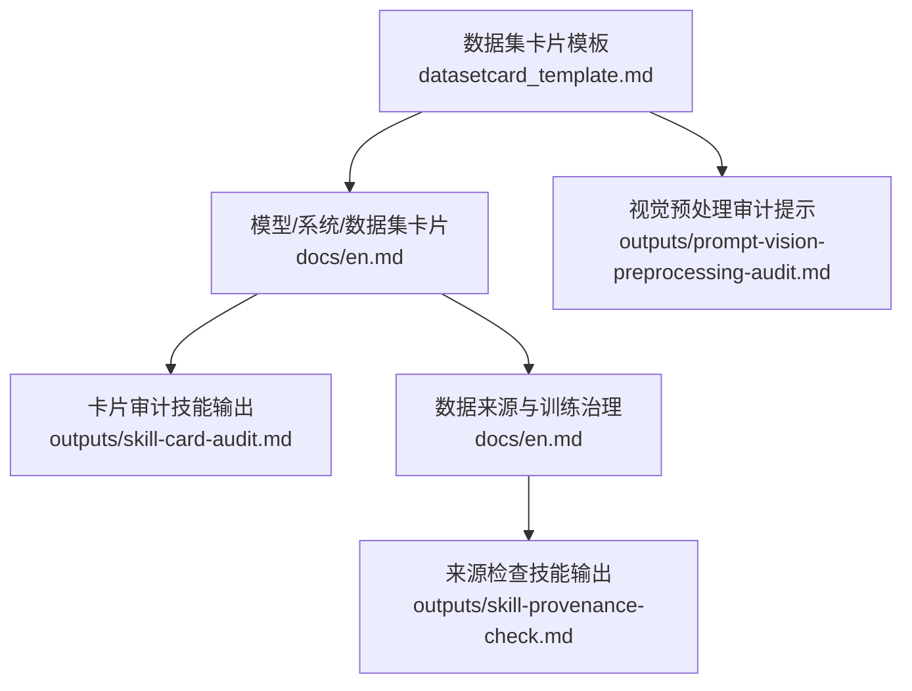
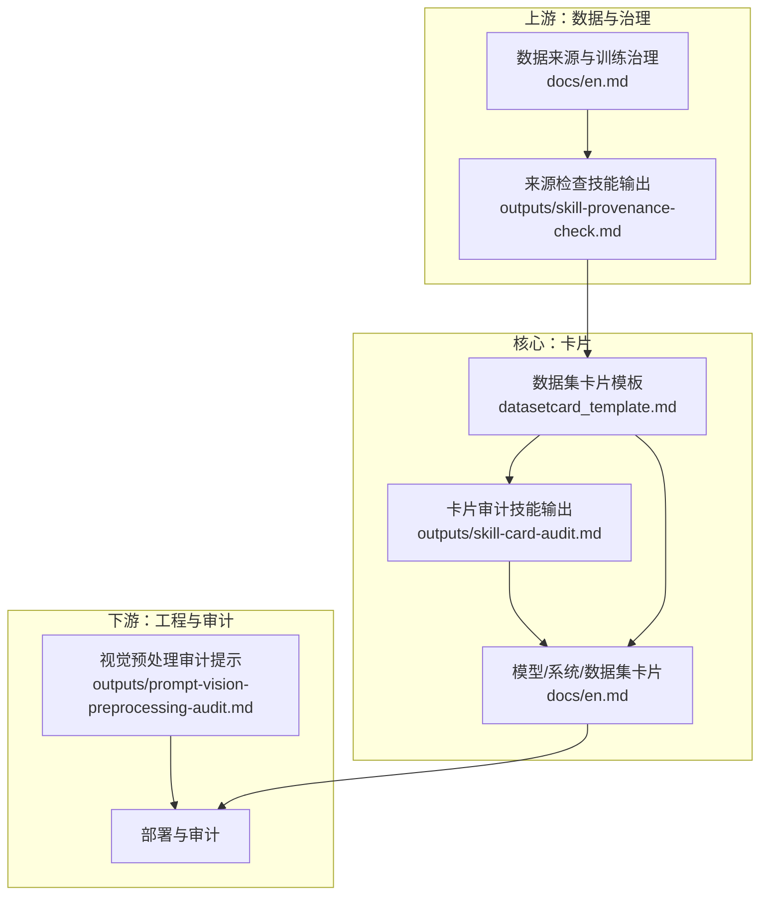
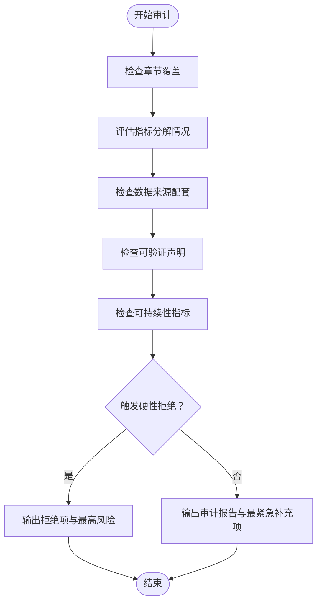
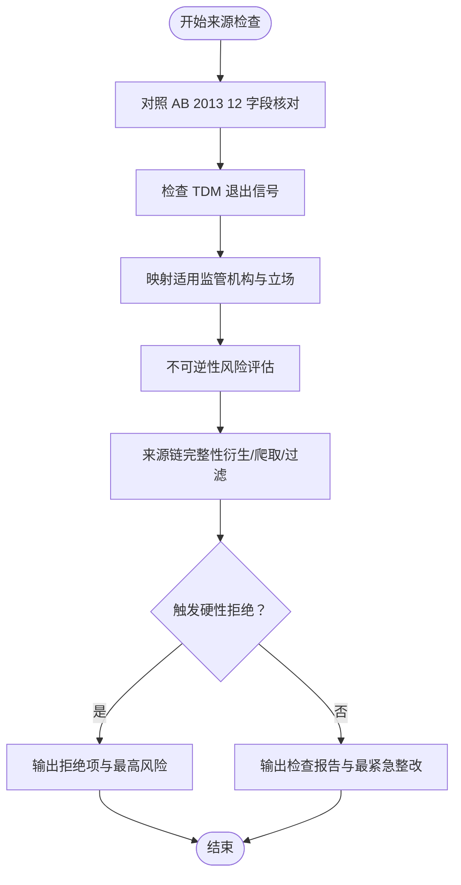
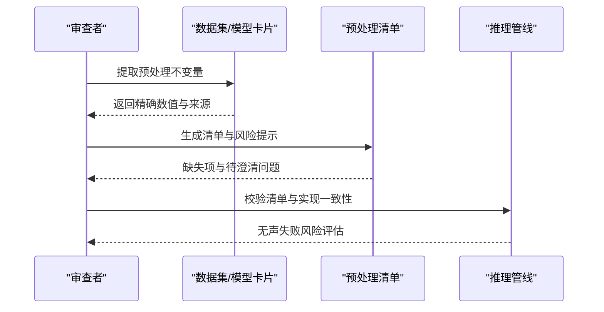
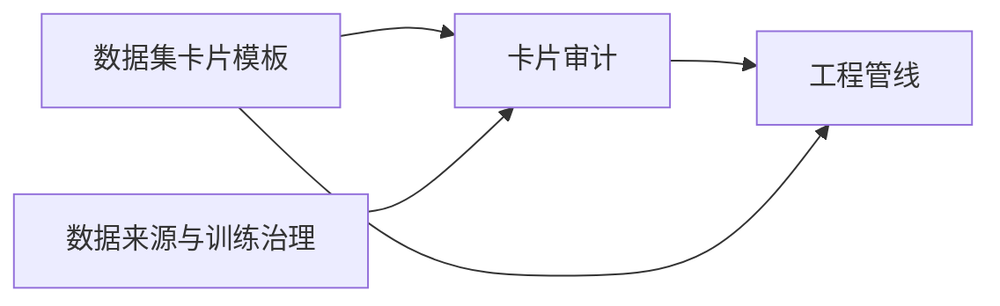

# 数据集卡片标准

<cite>
**本文引用的文件**
- [数据集卡片模板](file://venv/lib/python3.14/site-packages/huggingface_hub/templates/datasetcard_template.md)
- [模型/系统/数据集卡片（英文）](file://phases/18-ethics-safety-alignment/26-model-system-dataset-cards/docs/en.md)
- [数据集卡片审计（英文）](file://phases/18-ethics-safety-alignment/26-model-system-dataset-cards/outputs/skill-card-audit.md)
- [数据来源与训练治理（英文）](file://phases/18-ethics-safety-alignment/27-data-provenance-training-governance/docs/en.md)
- [数据来源与训练治理检查（英文）](file://phases/18-ethics-safety-alignment/27-data-provenance-training-governance/outputs/skill-provenance-check.md)
- [视觉预处理审计提示（英文）](file://phases/04-computer-vision/01-image-fundamentals/outputs/prompt-vision-preprocessing-audit.md)
</cite>

## 目录
1. 引言
2. 项目结构
3. 核心组件
4. 架构总览
5. 详细组件分析
6. 依赖关系分析
7. 性能考量
8. 故障排查指南
9. 结论
10. 附录

## 引言
本文件面向模型工程与合规团队，系统化阐述“数据集卡片”标准与实践方法，覆盖字段定义、填写规范、质量评估与合规校验要点，以及在模型开发、部署与审计中的作用与价值。文档以“数据集卡片”为核心对象，结合“模型/系统卡片”与“数据来源与训练治理”的上游要求，形成端到端的透明度与可追溯性体系。

## 项目结构
围绕数据集卡片主题，仓库内相关材料主要分布在以下位置：
- 规范模板：HuggingFace 官方数据集卡片模板，提供标准化字段与章节组织
- 教学文档：模型/系统/数据集卡片与数据来源与训练治理两篇教学文档
- 输出脚本：卡片审计与数据来源检查两个技能输出文件，用于自动化检查与合规核验
- 实践参考：视觉预处理审计提示，体现卡片在工程落地中的具体应用

**图示来源**
- [数据集卡片模板:1-144](file://venv/lib/python3.14/site-packages/huggingface_hub/templates/datasetcard_template.md#L1-L144)
- [模型/系统/数据集卡片（英文）:1-121](file://phases/18-ethics-safety-alignment/26-model-system-dataset-cards/docs/en.md#L1-L121)
- [数据集卡片审计（英文）:1-30](file://phases/18-ethics-safety-alignment/26-model-system-dataset-cards/outputs/skill-card-audit.md#L1-L30)
- [数据来源与训练治理（英文）:1-112](file://phases/18-ethics-safety-alignment/27-data-provenance-training-governance/docs/en.md#L1-L112)
- [数据来源与训练治理检查（英文）:1-30](file://phases/18-ethics-safety-alignment/27-data-provenance-training-governance/outputs/skill-provenance-check.md#L1-L30)
- [视觉预处理审计提示（英文）:1-41](file://phases/04-computer-vision/01-image-fundamentals/outputs/prompt-vision-preprocessing-audit.md#L1-L41)

**章节来源**
- [数据集卡片模板:1-144](file://venv/lib/python3.14/site-packages/huggingface_hub/templates/datasetcard_template.md#L1-L144)
- [模型/系统/数据集卡片（英文）:1-121](file://phases/18-ethics-safety-alignment/26-model-system-dataset-cards/docs/en.md#L1-L121)
- [数据集卡片审计（英文）:1-30](file://phases/18-ethics-safety-alignment/26-model-system-dataset-cards/outputs/skill-card-audit.md#L1-L30)
- [数据来源与训练治理（英文）:1-112](file://phases/18-ethics-safety-alignment/27-data-provenance-training-governance/docs/en.md#L1-L112)
- [数据来源与训练治理检查（英文）:1-30](file://phases/18-ethics-safety-alignment/27-data-provenance-training-governance/outputs/skill-provenance-check.md#L1-L30)
- [视觉预处理审计提示（英文）:1-41](file://phases/04-computer-vision/01-image-fundamentals/outputs/prompt-vision-preprocessing-audit.md#L1-L41)

## 核心组件
- 数据集卡片模板：提供标准化字段与章节，确保“动机、组成、采集、标注、用途、分发、维护”等关键信息齐备
- 模型/系统/数据集卡片教学：明确三类卡片的边界与侧重点，强调可验证性、可持续性与系统级安全能力
- 卡片审计技能：从完整性、数值分解、数据来源配套、可验证声明、可持续性五个维度进行硬性拒绝与拒绝规则
- 数据来源与训练治理：定义加州 AB 2013 12 字段清单、欧盟 TDM 合规、合法性基础与不可逆性风险
- 来源检查技能：按 AB 2013 与 TDM 合规、管辖地映射、不可逆性审计、来源链完整性进行检查
- 视觉预处理审计提示：将卡片中的预处理不变量转化为工程管线的可执行清单，降低无声失败风险

**章节来源**
- [数据集卡片模板:1-144](file://venv/lib/python3.14/site-packages/huggingface_hub/templates/datasetcard_template.md#L1-L144)
- [模型/系统/数据集卡片（英文）:23-78](file://phases/18-ethics-safety-alignment/26-model-system-dataset-cards/docs/en.md#L23-L78)
- [数据集卡片审计（英文）:10-29](file://phases/18-ethics-safety-alignment/26-model-system-dataset-cards/outputs/skill-card-audit.md#L10-L29)
- [数据来源与训练治理（英文）:23-68](file://phases/18-ethics-safety-alignment/27-data-provenance-training-governance/docs/en.md#L23-L68)
- [数据来源与训练治理检查（英文）:10-29](file://phases/18-ethics-safety-alignment/27-data-provenance-training-governance/outputs/skill-provenance-check.md#L10-L29)
- [视觉预处理审计提示（英文）:8-40](file://phases/04-computer-vision/01-image-fundamentals/outputs/prompt-vision-preprocessing-audit.md#L8-L40)

## 架构总览
下图展示了数据集卡片在模型生命周期中的位置与上下游关系：数据集卡片是模型卡片的上游；数据来源与训练治理为数据集卡片提供合规与可追溯性支撑；卡片审计与来源检查作为质量门禁，贯穿开发与发布流程。

**图示来源**
- [数据来源与训练治理（英文）:1-112](file://phases/18-ethics-safety-alignment/27-data-provenance-training-governance/docs/en.md#L1-L112)
- [数据来源与训练治理检查（英文）:1-30](file://phases/18-ethics-safety-alignment/27-data-provenance-training-governance/outputs/skill-provenance-check.md#L1-L30)
- [数据集卡片模板:1-144](file://venv/lib/python3.14/site-packages/huggingface_hub/templates/datasetcard_template.md#L1-L144)
- [数据集卡片审计（英文）:1-30](file://phases/18-ethics-safety-alignment/26-model-system-dataset-cards/outputs/skill-card-audit.md#L1-L30)
- [模型/系统/数据集卡片（英文）:1-121](file://phases/18-ethics-safety-alignment/26-model-system-dataset-cards/docs/en.md#L1-L121)
- [视觉预处理审计提示（英文）:1-41](file://phases/04-computer-vision/01-image-fundamentals/outputs/prompt-vision-preprocessing-audit.md#L1-L41)

## 详细组件分析

### 数据集卡片模板与字段定义
- 模板提供标准化章节与占位符，建议优先填充“数据集描述、数据来源、数据结构、创建过程、标注、个人与敏感信息、偏见/风险/局限、推荐、引文、术语表、更多信息、作者、联系人”等
- 建议在“数据来源”中明确仓库、论文、演示链接；在“创建过程”中记录筛选、清洗、归一化、工具与库；在“标注”中记录标注工具、指南、一致性统计、验证流程
- “个人与敏感信息”需明确是否包含 PII/PHI 及去标识化策略；“偏见、风险与局限”需结合任务与人群进行技术与社会技术层面分析

**章节来源**
- [数据集卡片模板:1-144](file://venv/lib/python3.14/site-packages/huggingface_hub/templates/datasetcard_template.md#L1-L144)

### 卡片审计流程（完整性、分解、可验证性）
- 完整性：逐项检查标准章节是否填满；伦理考虑常被忽略，需强制补齐
- 数值分解：评估指标是否按人群/任务因素进行分解；仅聚合指标可能掩盖分配与代表性伤害
- 数据来源配套：若引用训练数据，必须配套数据集“数据来源与训练治理”文档
- 可验证声明：是否具备可验证背书（如密码学签名）或第三方验证
- 可持续性：是否报告碳/水足迹等可持续性指标

**图示来源**
- [数据集卡片审计（英文）:10-29](file://phases/18-ethics-safety-alignment/26-model-system-dataset-cards/outputs/skill-card-audit.md#L10-L29)

**章节来源**
- [数据集卡片审计（英文）:10-29](file://phases/18-ethics-safety-alignment/26-model-system-dataset-cards/outputs/skill-card-audit.md#L10-L29)

### 数据来源与训练治理（合规与可追溯）
- 加州 AB 2013 12 字段清单：数据来源/拥有者、用途说明、数据点数量、数据类型、版权/商标/专利状态、购买/许可、是否含个人信息、是否含聚合消费者信息、开发者清洗/处理目的、采集时间段、首次使用日期、是否使用合成数据
- 欧盟 TDM 合规：尊重机器可读的“退出信号”，如 robots.txt、C2PA “禁止AI训练”、TDM.Reservation
- 合法性基础：2025 年多处监管机构趋同于“合法利益”可支持对公开内容的训练，但需满足可识别主体、可退出、保障措施等条件
- 不可逆性风险：一旦进入权重，无法手术式移除；需制定“退化/影响函数定位/微调抑制”等缓解方案

**图示来源**
- [数据来源与训练治理（英文）:23-68](file://phases/18-ethics-safety-alignment/27-data-provenance-training-governance/docs/en.md#L23-L68)
- [数据来源与训练治理检查（英文）:10-29](file://phases/18-ethics-safety-alignment/27-data-provenance-training-governance/outputs/skill-provenance-check.md#L10-L29)

**章节来源**
- [数据来源与训练治理（英文）:23-68](file://phases/18-ethics-safety-alignment/27-data-provenance-training-governance/docs/en.md#L23-L68)
- [数据来源与训练治理检查（英文）:10-29](file://phases/18-ethics-safety-alignment/27-data-provenance-training-governance/outputs/skill-provenance-check.md#L10-L29)

### 视觉预处理审计（工程落地）
- 将卡片中的预处理不变量转化为工程清单：输入尺寸、通道顺序、数据类型、像素范围、标准化、缩放策略、颜色空间、轴布局
- 对每项输出来源与风险，缺失项标记“未指定”，并列出“待澄清问题”
- 严格引用精确数值，避免模糊默认

**图示来源**
- [视觉预处理审计提示（英文）:8-40](file://phases/04-computer-vision/01-image-fundamentals/outputs/prompt-vision-preprocessing-audit.md#L8-L40)

**章节来源**
- [视觉预处理审计提示（英文）:8-40](file://phases/04-computer-vision/01-image-fundamentals/outputs/prompt-vision-preprocessing-audit.md#L8-L40)

## 依赖关系分析
- 数据集卡片模板是“数据来源与训练治理”与“卡片审计”的共同输入
- “卡片审计”依赖“数据来源与训练治理”的配套文档，否则触发硬性拒绝
- “视觉预处理审计提示”依赖卡片中的预处理不变量，确保工程实现与卡片一致

**图示来源**
- [数据集卡片模板:1-144](file://venv/lib/python3.14/site-packages/huggingface_hub/templates/datasetcard_template.md#L1-L144)
- [数据集卡片审计（英文）:10-29](file://phases/18-ethics-safety-alignment/26-model-system-dataset-cards/outputs/skill-card-audit.md#L10-L29)
- [数据来源与训练治理（英文）:1-112](file://phases/18-ethics-safety-alignment/27-data-provenance-training-governance/docs/en.md#L1-L112)

**章节来源**
- [数据集卡片模板:1-144](file://venv/lib/python3.14/site-packages/huggingface_hub/templates/datasetcard_template.md#L1-L144)
- [数据集卡片审计（英文）:10-29](file://phases/18-ethics-safety-alignment/26-model-system-dataset-cards/outputs/skill-card-audit.md#L10-L29)
- [数据来源与训练治理（英文）:1-112](file://phases/18-ethics-safety-alignment/27-data-provenance-training-governance/docs/en.md#L1-L112)

## 性能考量
- 卡片完整性与分解质量直接影响模型在不同人群/任务上的公平性与稳健性，间接影响部署阶段的召回与误报表现
- 合规检查前置可减少后期回溯成本，避免因“伦理考虑缺失”“无数据来源配套”导致的发布延迟
- 可持续性指标纳入卡片有助于长期运营成本与环境影响的量化与优化

## 故障排查指南
- 常见问题
  - 伦理考虑缺失：触发硬性拒绝，需补齐伦理影响与缓解措施
  - 无数据来源配套：引用训练数据时必须附带“数据来源与训练治理”摘要
  - 仅报告“偏见已测试”而无分解指标：需提供按因素分解的评估结果
  - 未尊重 TDM 退出信号：需在采集阶段建立机器可读过滤
  - 预处理不变量缺失：导致推理管线无声失败，需补全并标注风险

- 排查步骤
  - 使用“卡片审计”技能输出逐项核对
  - 使用“来源检查”技能输出对照 AB 2013 与 TDM 合规
  - 使用“视觉预处理审计提示”核对工程实现与卡片一致

**章节来源**
- [数据集卡片审计（英文）:20-27](file://phases/18-ethics-safety-alignment/26-model-system-dataset-cards/outputs/skill-card-audit.md#L20-L27)
- [数据来源与训练治理检查（英文）:20-27](file://phases/18-ethics-safety-alignment/27-data-provenance-training-governance/outputs/skill-provenance-check.md#L20-L27)
- [视觉预处理审计提示（英文）:34-40](file://phases/04-computer-vision/01-image-fundamentals/outputs/prompt-vision-preprocessing-audit.md#L34-L40)

## 结论
数据集卡片是模型透明度与可追溯性的基石。通过标准化模板、严格的审计与来源治理，以及工程落地的预处理不变量核对，可在模型开发、部署与审计全生命周期中显著降低无声失败、合规风险与伦理隐患，提升系统的可信度与可维护性。

## 附录

### 数据集卡片模板与填写示例（路径指引）
- 模板字段与章节组织：[数据集卡片模板:1-144](file://venv/lib/python3.14/site-packages/huggingface_hub/templates/datasetcard_template.md#L1-L144)
- 示例字段建议
  - 数据集描述：简述数据集目标、规模、领域
  - 数据来源：仓库、论文、演示链接
  - 数据结构：字段说明、划分策略、关系
  - 创建过程：筛选/清洗/归一化、工具与库
  - 标注：工具、指南、一致性统计、验证
  - 个人与敏感信息：是否包含 PII/PHI、去标识化策略
  - 偏见/风险/局限：技术与社会技术层面分析
  - 推荐：使用建议与注意事项
  - 引文：BibTeX/APA
  - 术语表：帮助理解的术语与计算
  - 更多信息：联系方式、作者

**章节来源**
- [数据集卡片模板:1-144](file://venv/lib/python3.14/site-packages/huggingface_hub/templates/datasetcard_template.md#L1-L144)

### 卡片审计与来源检查（路径指引）
- 卡片审计技能输出：[数据集卡片审计（英文）:1-30](file://phases/18-ethics-safety-alignment/26-model-system-dataset-cards/outputs/skill-card-audit.md#L1-L30)
- 来源检查技能输出：[数据来源与训练治理检查（英文）:1-30](file://phases/18-ethics-safety-alignment/27-data-provenance-training-governance/outputs/skill-provenance-check.md#L1-L30)

**章节来源**
- [数据集卡片审计（英文）:1-30](file://phases/18-ethics-safety-alignment/26-model-system-dataset-cards/outputs/skill-card-audit.md#L1-L30)
- [数据来源与训练治理检查（英文）:1-30](file://phases/18-ethics-safety-alignment/27-data-provenance-training-governance/outputs/skill-provenance-check.md#L1-L30)

### 视觉预处理审计（路径指引）
- 审计提示：[视觉预处理审计提示（英文）:1-41](file://phases/04-computer-vision/01-image-fundamentals/outputs/prompt-vision-preprocessing-audit.md#L1-L41)

**章节来源**
- [视觉预处理审计提示（英文）:1-41](file://phases/04-computer-vision/01-image-fundamentals/outputs/prompt-vision-preprocessing-audit.md#L1-L41)