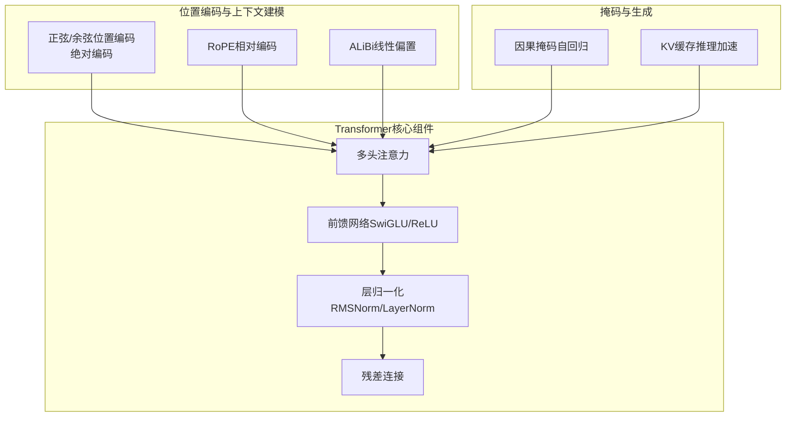
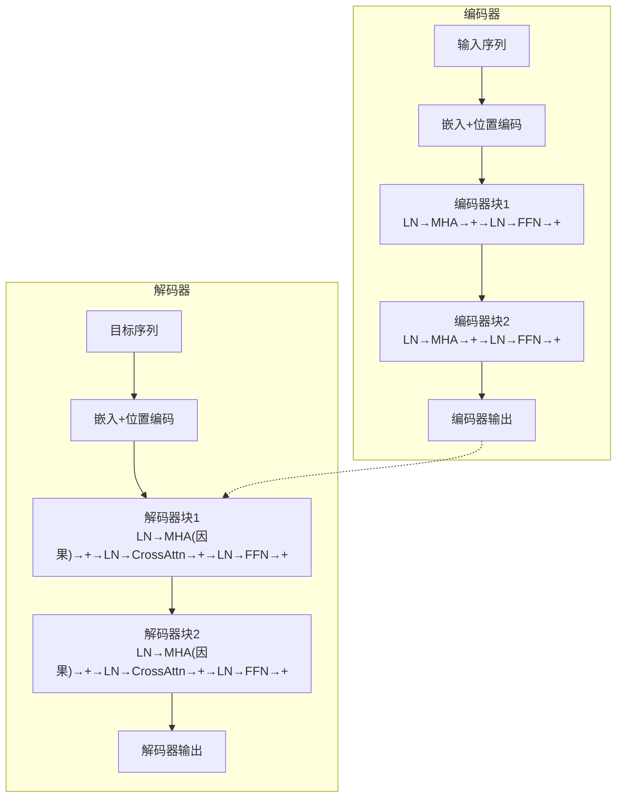
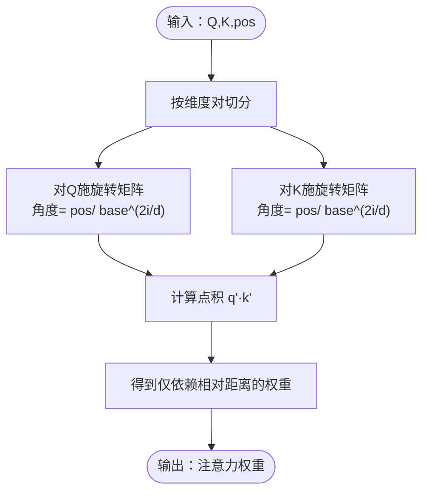
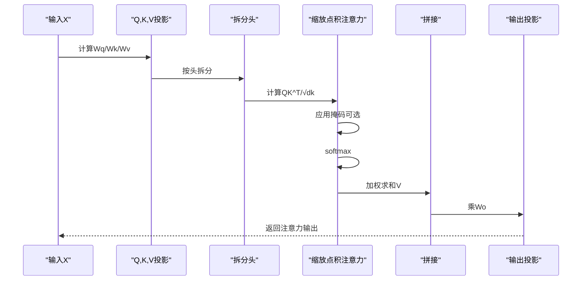
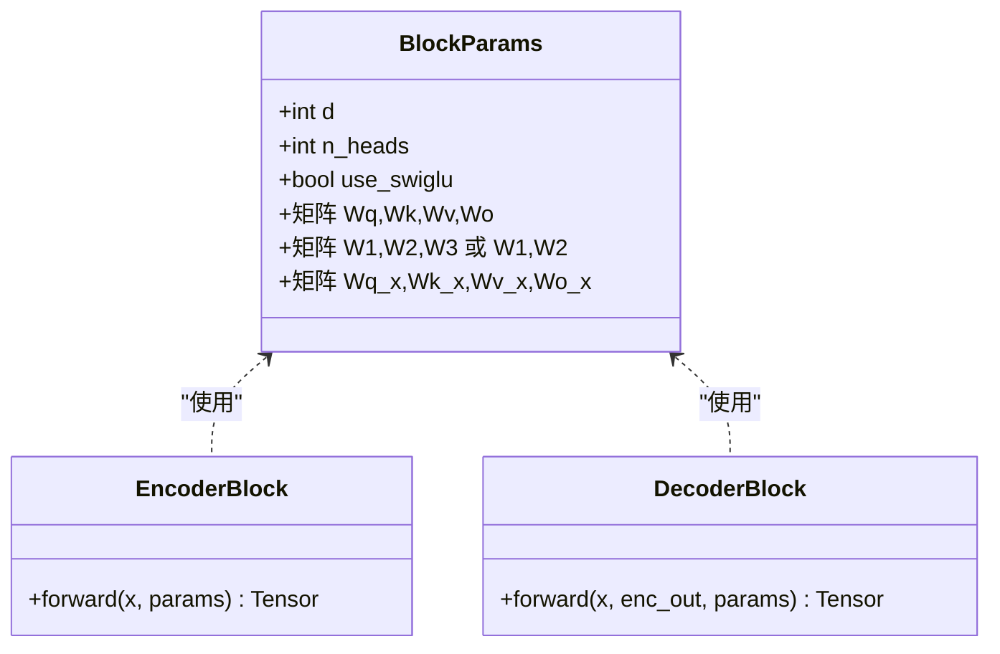
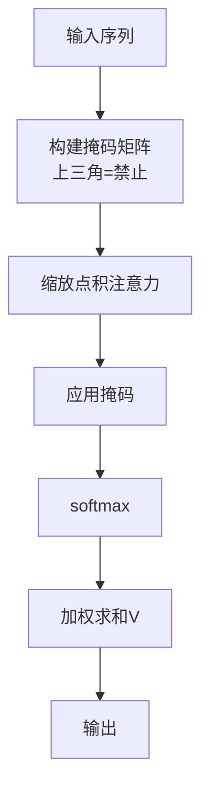
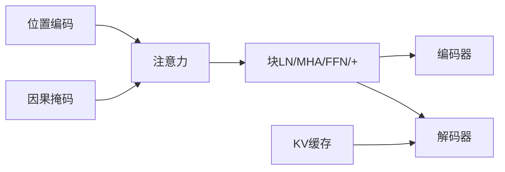

# 位置信息与上下文建模

<cite>
**本文引用的文件**
- [phases/07-transformers-deep-dive/04-positional-encoding/code/main.py](file://phases/07-transformers-deep-dive/04-positional-encoding/code/main.py)
- [phases/07-transformers-deep-dive/04-positional-encoding/docs/en.md](file://phases/07-transformers-deep-dive/04-positional-encoding/docs/en.md)
- [phases/07-transformers-deep-dive/05-full-transformer/code/main.py](file://phases/07-transformers-deep-dive/05-full-transformer/code/main.py)
- [phases/07-transformers-deep-dive/05-full-transformer/docs/en.md](file://phases/07-transformers-deep-dive/05-full-transformer/docs/en.md)
- [phases/07-transformers-deep-dive/03-multi-head-attention/code/main.py](file://phases/07-transformers-deep-dive/03-multi-head-attention/code/main.py)
- [site/figures-transformers.js](file://site/figures-transformers.js)
- [site/figures.js](file://site/figures.js)
- [site/figures-llms2.js](file://site/figures-llms2.js)
- [site/data.js](file://site/data.js)
- [glossary/terms.zh.md](file://glossary/terms.zh.md)
</cite>

## 目录
1. [引言](#引言)
2. [项目结构](#项目结构)
3. [核心组件](#核心组件)
4. [架构总览](#架构总览)
5. [详细组件分析](#详细组件分析)
6. [依赖关系分析](#依赖关系分析)
7. [性能考量](#性能考量)
8. [故障排查指南](#故障排查指南)
9. [结论](#结论)
10. [附录](#附录)

## 引言
本课程围绕“位置信息与上下文建模”展开，系统讲解Transformer如何处理序列的位置信息，包括绝对位置编码（正弦/余弦）与相对位置编码（RoPE）的设计原理；深入剖析正弦/余弦位置编码的数学构造与周期性特性；完整实现Transformer编码器-解码器架构，覆盖多头注意力、前馈网络、残差连接、层归一化等关键模块；解释掩码机制在训练与推理中的作用，尤其是因果掩码在自回归生成中的应用；最后给出前向传播与反向传播的关键步骤说明与可视化流程。

## 项目结构
本仓库中与本课程直接相关的核心实现位于“transformers深度探索”阶段的两门构建课：
- 位置编码：正弦/余弦、RoPE、ALiBi 的实现与演示
- 完整Transformer：编码器-解码器块的纯Python实现

此外，网站前端包含大量交互式图示，直观展示因果掩码、注意力缩放、残差流等概念；词典术语帮助理解关键术语。

**章节来源**
- [site/data.js:1344-1360](file://site/data.js#L1344-L1360)

## 核心组件
- 绝对位置编码（正弦/余弦）
  - 数学构造：以不同频率的sin/cos叠加到嵌入向量上，形成随位置变化的相位模式
  - 周期性特性：维度越高，波长越长；绝对位置通过相位差体现
  - 外推能力：训练长度之外表现较差
- 相对位置编码（RoPE）
  - 将Q/K按维度对进行二维旋转，旋转角度与位置成比例
  - 关键性质：点积仅依赖相对距离，天然具备相对位置不变性
  - 长上下文扩展：通过增大base或采用NTK/YaRN/LongRoPE等策略延长可用上下文
- ALiBi
  - 不使用嵌入，直接在注意力分数上加入基于距离的线性惩罚项
  - 每个头具有不同斜率，越远惩罚越大，外推能力强
- 多头注意力
  - 将d_model等分为若干head，每头独立计算注意力，再拼接并投影
  - 支持分组查询注意力（GQA）降低KV缓存开销
- 前馈网络
  - SwiGLU（Swish与旁路乘）优于ReLU/GELU；参数匹配下仍保持容量
- 层归一化
  - RMSNorm（去均值）与LayerNorm（中心化+归一化）对比
- 残差连接
  - 每个子层输出与输入相加，缓解梯度消失，支持深层堆叠
- 掩码机制
  - 因果掩码：屏蔽未来位置，确保自回归生成时不“偷看”
  - KV缓存：解码阶段复用历史K/V，避免重复计算

**章节来源**
- [phases/07-transformers-deep-dive/04-positional-encoding/code/main.py:11-126](file://phases/07-transformers-deep-dive/04-positional-encoding/code/main.py#L11-L126)
- [phases/07-transformers-deep-dive/05-full-transformer/code/main.py:15-255](file://phases/07-transformers-deep-dive/05-full-transformer/code/main.py#L15-L255)
- [phases/07-transformers-deep-dive/03-multi-head-attention/code/main.py:13-210](file://phases/07-transformers-deep-dive/03-multi-head-attention/code/main.py#L13-L210)
- [site/figures-transformers.js:103-184](file://site/figures-transformers.js#L103-L184)
- [site/figures-llms2.js:37-61](file://site/figures-llms2.js#L37-L61)

## 架构总览
下图展示了编码器-解码器的整体数据流：嵌入+位置编码进入各层块，块内包含预归一化、多头注意力、前馈网络与残差；解码器额外包含跨注意力（来自编码器输出）。

**图表来源**
- [phases/07-transformers-deep-dive/05-full-transformer/docs/en.md:37-54](file://phases/07-transformers-deep-dive/05-full-transformer/docs/en.md#L37-L54)
- [phases/07-transformers-deep-dive/05-full-transformer/code/main.py:187-211](file://phases/07-transformers-deep-dive/05-full-transformer/code/main.py#L187-L211)

**章节来源**
- [phases/07-transformers-deep-dive/05-full-transformer/docs/en.md:18-72](file://phases/07-transformers-deep-dive/05-full-transformer/docs/en.md#L18-L72)
- [phases/07-transformers-deep-dive/05-full-transformer/code/main.py:187-211](file://phases/07-transformers-deep-dive/05-full-transformer/code/main.py#L187-L211)

## 详细组件分析

### 组件A：位置编码与相对位置建模（RoPE）
- 正弦/余弦编码
  - 实现要点：按维度对填充sin/cos，频率由base控制；高维波长长，低维波动快
  - 可视化：相位随位置平移，不同维度呈现不同周期
- RoPE（旋转位置编码）
  - 实现要点：对Q/K按维度对施加二维旋转矩阵，角度与位置成比例
  - 关键性质：点积仅含相对距离因子，具备相对位置不变性
  - 长上下文扩展：增大base或采用NTK/YaRN/LongRoPE
- ALiBi（注意力线性偏置）
  - 实现要点：为每个头定义斜率，按距离引入线性惩罚；因果掩码可选
  - 优点：无需嵌入，外推能力强

**图表来源**
- [phases/07-transformers-deep-dive/04-positional-encoding/code/main.py:21-33](file://phases/07-transformers-deep-dive/04-positional-encoding/code/main.py#L21-L33)
- [phases/07-transformers-deep-dive/04-positional-encoding/docs/en.md:39-52](file://phases/07-transformers-deep-dive/04-positional-encoding/docs/en.md#L39-L52)

**章节来源**
- [phases/07-transformers-deep-dive/04-positional-encoding/code/main.py:11-126](file://phases/07-transformers-deep-dive/04-positional-encoding/code/main.py#L11-L126)
- [phases/07-transformers-deep-dive/04-positional-encoding/docs/en.md:10-74](file://phases/07-transformers-deep-dive/04-positional-encoding/docs/en.md#L10-L74)

### 组件B：多头注意力与缩放
- 多头拆分与合并
  - 将d_model等分为n_heads，每头d_head；拼接后经输出投影Wo
- 缩放点积注意力
  - 分数缩放：除以sqrt(dk)，防止softmax饱和
  - 掩码：可选因果掩码屏蔽未来位置
- GQA（分组查询注意力）
  - K/V头数少于Q头，重复映射以匹配Q；显著降低KV缓存

**图表来源**
- [phases/07-transformers-deep-dive/03-multi-head-attention/code/main.py:116-131](file://phases/07-transformers-deep-dive/03-multi-head-attention/code/main.py#L116-L131)
- [phases/07-transformers-deep-dive/05-full-transformer/code/main.py:142-159](file://phases/07-transformers-deep-dive/05-full-transformer/code/main.py#L142-L159)

**章节来源**
- [phases/07-transformers-deep-dive/03-multi-head-attention/code/main.py:80-150](file://phases/07-transformers-deep-dive/03-multi-head-attention/code/main.py#L80-L150)
- [site/figures-transformers.js:140-184](file://site/figures-transformers.js#L140-L184)

### 组件C：编码器-解码器块与残差流
- 编码器块（双向）
  - 预归一化：LN→MHA→+→LN→FFN→+
  - 无因果掩码，所有位置可见
- 解码器块（自回归）
  - 预归一化：LN→MHA(因果)→+→LN→CrossAttn(来自编码器)→+→LN→FFN→+
  - 跨注意力：Q来自解码器，K/V来自编码器输出
- 归一化与激活
  - RMSNorm：去均值，计算更快；LayerNorm：中心化+归一化
  - SwiGLU：优于ReLU/GELU；FFN扩展比通常为4（LayerNorm）或约2.6（SwiGLU）

**图表来源**
- [phases/07-transformers-deep-dive/05-full-transformer/code/main.py:162-185](file://phases/07-transformers-deep-dive/05-full-transformer/code/main.py#L162-L185)
- [phases/07-transformers-deep-dive/05-full-transformer/code/main.py:187-211](file://phases/07-transformers-deep-dive/05-full-transformer/code/main.py#L187-L211)

**章节来源**
- [phases/07-transformers-deep-dive/05-full-transformer/code/main.py:187-211](file://phases/07-transformers-deep-dive/05-full-transformer/code/main.py#L187-L211)
- [site/figures.js:619-641](file://site/figures.js#L619-L641)

### 组件D：掩码机制与自回归生成
- 因果掩码
  - 上三角设为负无穷，softmax后未来权重趋近0
  - 确保每个位置仅关注自身及之前位置
- KV缓存
  - 解码阶段复用历史K/V，避免重复计算
  - 与因果掩码配合，实现高效自回归生成

**图表来源**
- [site/figures-transformers.js:103-138](file://site/figures-transformers.js#L103-L138)
- [phases/07-transformers-deep-dive/05-full-transformer/code/main.py:129-139](file://phases/07-transformers-deep-dive/05-full-transformer/code/main.py#L129-L139)

**章节来源**
- [site/figures-transformers.js:103-138](file://site/figures-transformers.js#L103-L138)
- [glossary/terms.zh.md:90-92](file://glossary/terms.zh.md#L90-L92)

## 依赖关系分析
- 位置编码与注意力
  - 绝对编码：作为嵌入的前置信号注入
  - RoPE：直接作用于Q/K，改变点积结构
  - ALiBi：直接作用于注意力分数
- 注意力与块结构
  - 多头注意力是块内的核心子层之一
  - 预归一化+残差+FFN构成标准块骨架
- 掩码与KV缓存
  - 因果掩码保证自回归；KV缓存提升解码效率

**图表来源**
- [phases/07-transformers-deep-dive/04-positional-encoding/code/main.py:11-126](file://phases/07-transformers-deep-dive/04-positional-encoding/code/main.py#L11-L126)
- [phases/07-transformers-deep-dive/05-full-transformer/code/main.py:142-211](file://phases/07-transformers-deep-dive/05-full-transformer/code/main.py#L142-L211)

**章节来源**
- [phases/07-transformers-deep-dive/04-positional-encoding/docs/en.md:16-22](file://phases/07-transformers-deep-dive/04-positional-encoding/docs/en.md#L16-L22)
- [phases/07-transformers-deep-dive/05-full-transformer/docs/en.md:56-72](file://phases/07-transformers-deep-dive/05-full-transformer/docs/en.md#L56-L72)

## 性能考量
- 注意力复杂度
  - 标准注意力：O(N^2·d)，KV矩阵显式存储
  - FlashAttention：按tile计算，内存O(N)，适合长上下文
- 归一化与激活
  - RMSNorm较LayerNorm少一次均值减法，节省计算
  - SwiGLU在参数匹配下仍具容量优势
- KV缓存
  - GQA减少KV头数，显著降低KV缓存占用
- 缩放与数值稳定
  - 除以sqrt(dk)避免softmax饱和，提升梯度稳定性

**章节来源**
- [site/figures-transformers.js:439-445](file://site/figures-transformers.js#L439-L445)
- [site/figures-llms2.js:37-61](file://site/figures-llms2.js#L37-L61)
- [phases/07-transformers-deep-dive/03-multi-head-attention/code/main.py:80-88](file://phases/07-transformers-deep-dive/03-multi-head-attention/code/main.py#L80-L88)

## 故障排查指南
- 形状不匹配
  - d_model必须能被n_heads整除；否则拆分失败
  - GQA中n_kv_heads需满足n_heads % n_kv_heads == 0
- 归一化选择
  - 若使用RMSNorm，注意其不中心化，某些任务可能需要额外校准
- 掩码应用
  - 自回归生成务必启用因果掩码；否则会“偷看”未来
- 梯度问题
  - 深层堆叠建议使用预归一化与残差，避免梯度爆炸/消失
  - 使用梯度裁剪与合适的优化器超参

**章节来源**
- [phases/07-transformers-deep-dive/03-multi-head-attention/code/main.py:91-101](file://phases/07-transformers-deep-dive/03-multi-head-attention/code/main.py#L91-L101)
- [phases/07-transformers-deep-dive/05-full-transformer/code/main.py:86-105](file://phases/07-transformers-deep-dive/05-full-transformer/code/main.py#L86-L105)

## 结论
本课程系统梳理了Transformer中位置信息与上下文建模的关键技术：从绝对与相对位置编码的数学构造，到多头注意力、前馈网络、残差与归一化的现代块设计；再到掩码与KV缓存在训练与推理中的作用。通过纯Python实现与可视化图示，读者可以深入理解Transformer如何在不改变架构的前提下，以不同的位置信号与注意力变体实现强大的序列建模能力，并为后续的长上下文扩展与工程优化打下坚实基础。

## 附录
- 关键术语
  - 位置编码：向嵌入或注意力中注入顺序信息的信号
  - RoPE：将位置信息编码为旋转角度，使点积仅依赖相对距离
  - ALiBi：在注意力分数上加入基于距离的线性偏置
  - 预归一化：在子层前先归一化，提升深层训练稳定性
  - SwiGLU：Swish与旁路乘结合的前馈激活，优于ReLU/GELU
  - 因果掩码：屏蔽未来位置，保障自回归生成
  - KV缓存：复用历史K/V，加速解码阶段

**章节来源**
- [glossary/terms.zh.md:76-100](file://glossary/terms.zh.md#L76-L100)
- [phases/07-transformers-deep-dive/05-full-transformer/docs/en.md:155-166](file://phases/07-transformers-deep-dive/05-full-transformer/docs/en.md#L155-L166)