# 变换器深度解析

<cite>
**本文引用的文件**
- [phases/07-transformers-deep-dive/README.md](file://phases/07-transformers-deep-dive/README.md)
- [phases/07-transformers-deep-dive/01-why-transformers/docs/en.md](file://phases/07-transformers-deep-dive/01-why-transformers/docs/en.md)
- [phases/07-transformers-deep-dive/02-self-attention-from-scratch/docs/en.md](file://phases/07-transformers-deep-dive/02-self-attention-from-scratch/docs/en.md)
- [phases/07-transformers-deep-dive/03-multi-head-attention/docs/en.md](file://phases/07-transformers-deep-dive/03-multi-head-attention/docs/en.md)
- [phases/07-transformers-deep-dive/04-positional-encoding/docs/en.md](file://phases/07-transformers-deep-dive/04-positional-encoding/docs/en.md)
- [phases/07-transformers-deep-dive/05-full-transformer/docs/en.md](file://phases/07-transformers-deep-dive/05-full-transformer/docs/en.md)
- [phases/07-transformers-deep-dive/06-bert-masked-language-modeling/docs/en.md](file://phases/07-transformers-deep-dive/06-bert-masked-language-modeling/docs/en.md)
- [phases/07-transformers-deep-dive/07-gpt-causal-language-modeling/docs/en.md](file://phases/07-transformers-deep-dive/07-gpt-causal-language-modeling/docs/en.md)
- [phases/07-transformers-deep-dive/08-t5-bart-encoder-decoder/docs/en.md](file://phases/07-transformers-deep-dive/08-t5-bart-encoder-decoder/docs/en.md)
- [phases/07-transformers-deep-dive/11-mixture-of-experts/docs/en.md](file://phases/07-transformers-deep-dive/11-mixture-of-experts/docs/en.md)
- [phases/07-transformers-deep-dive/12-kv-cache-flash-attention/docs/en.md](file://phases/07-transformers-deep-dive/12-kv-cache-flash-attention/docs/en.md)
- [phases/07-transformers-deep-dive/15-attention-variants/docs/en.md](file://phases/07-transformers-deep-dive/15-attention-variants/docs/en.md)
- [phases/07-transformers-deep-dive/16-speculative-decoding/docs/en.md](file://phases/07-transformers-deep-dive/16-speculative-decoding/docs/en.md)
- [phases/10-llms-from-scratch/16-differential-attention-v2/docs/en.md](file://phases/10-llms-from-scratch/16-differential-attention-v2/docs/en.md)
- [phases/19-capstone-projects/33-multihead-self-attention/code/tests/test_attention.py](file://phases/19-capstone-projects/33-multihead-self-attention/code/tests/test_attention.py)
</cite>

## 目录
1. [引言](#引言)
2. [项目结构](#项目结构)
3. [核心组件](#核心组件)
4. [架构总览](#架构总览)
5. [详细组件分析](#详细组件分析)
6. [依赖关系分析](#依赖关系分析)
7. [性能考量](#性能考量)
8. [故障排查指南](#故障排查指南)
9. [结论](#结论)
10. [附录](#附录)

## 引言
本课程围绕“变换器”展开，系统讲解注意力机制的原理、发展历程与现代实现，对比RNN的局限性，逐步引入自注意力、多头注意力、位置编码、掩码策略，并深入剖析BERT（掩码语言建模）、GPT（因果语言建模）与T5/BART（编码器-解码器）等经典模型的架构与训练范式。同时覆盖推理优化技术（KV缓存、Flash Attention）、MoE混合专家、稀疏注意力等前沿方向，最终以可运行的完整变换器实现作为学习成果，帮助读者掌握现代大语言模型的核心技术。

## 项目结构
本课程位于“变换器深度解析”阶段，配套有大量可动手实践的代码、可视化图示与练习题，便于从零构建并理解注意力与变换器的关键模块。

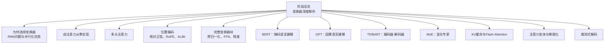

图表来源
- [phases/07-transformers-deep-dive/README.md:1-6](file://phases/07-transformers-deep-dive/README.md#L1-L6)
- [phases/07-transformers-deep-dive/01-why-transformers/docs/en.md:1-108](file://phases/07-transformers-deep-dive/01-why-transformers/docs/en.md#L1-L108)
- [phases/07-transformers-deep-dive/02-self-attention-from-scratch/docs/en.md:1-335](file://phases/07-transformers-deep-dive/02-self-attention-from-scratch/docs/en.md#L1-L335)
- [phases/07-transformers-deep-dive/03-multi-head-attention/docs/en.md:1-164](file://phases/07-transformers-deep-dive/03-multi-head-attention/docs/en.md#L1-L164)
- [phases/07-transformers-deep-dive/04-positional-encoding/docs/en.md:1-186](file://phases/07-transformers-deep-dive/04-positional-encoding/docs/en.md#L1-L186)
- [phases/07-transformers-deep-dive/05-full-transformer/docs/en.md:1-175](file://phases/07-transformers-deep-dive/05-full-transformer/docs/en.md#L1-L175)
- [phases/07-transformers-deep-dive/06-bert-masked-language-modeling/docs/en.md:1-163](file://phases/07-transformers-deep-dive/06-bert-masked-language-modeling/docs/en.md#L1-L163)
- [phases/07-transformers-deep-dive/07-gpt-causal-language-modeling/docs/en.md:1-164](file://phases/07-transformers-deep-dive/07-gpt-causal-language-modeling/docs/en.md#L1-L164)
- [phases/07-transformers-deep-dive/08-t5-bart-encoder-decoder/docs/en.md:1-165](file://phases/07-transformers-deep-dive/08-t5-bart-encoder-decoder/docs/en.md#L1-L165)
- [phases/07-transformers-deep-dive/11-mixture-of-experts/docs/en.md:1-169](file://phases/07-transformers-deep-dive/11-mixture-of-experts/docs/en.md#L1-L169)
- [phases/07-transformers-deep-dive/12-kv-cache-flash-attention/docs/en.md:1-180](file://phases/07-transformers-deep-dive/12-kv-cache-flash-attention/docs/en.md#L1-L180)
- [phases/07-transformers-deep-dive/15-attention-variants/docs/en.md:1-200](file://phases/07-transformers-deep-dive/15-attention-variants/docs/en.md#L1-L200)
- [phases/07-transformers-deep-dive/16-speculative-decoding/docs/en.md:1-160](file://phases/07-transformers-deep-dive/16-speculative-decoding/docs/en.md#L1-L160)

章节来源
- [phases/07-transformers-deep-dive/README.md:1-6](file://phases/07-transformers-deep-dive/README.md#L1-L6)

## 核心组件
- 自注意力与缩放点积注意力：从查询/键/值投影到注意力权重计算，再到加权求和输出，包含数值稳定性的softmax与缩放因子。
- 多头注意力：将嵌入空间拆分为多个子空间，各头并行计算后拼接并经输出投影，支持GQA/MLA等变体。
- 位置编码：绝对正弦编码、RoPE旋转位置编码、ALiBi线性偏置，分别强调绝对位置、相对位置与无嵌入偏差的长程外推。
- 完整变换器块：预归一化、残差连接、前馈网络（SwiGLU）、交叉注意力（仅解码器），形成可堆叠的模块骨架。
- 训练范式：BERT掩码语言建模、GPT因果语言建模、T5/BART编码器-解码器文本到文本任务。
- 推理优化：KV缓存复用、Flash Attention分块/内核融合；MoE专家路由与负载均衡；稀疏注意力与变体（Differential Attention等）。
- 解码采样：贪心、温度采样、Top-k、Top-p（核采样）、Min-p等策略及推测式解码。

章节来源
- [phases/07-transformers-deep-dive/02-self-attention-from-scratch/docs/en.md:10-335](file://phases/07-transformers-deep-dive/02-self-attention-from-scratch/docs/en.md#L10-L335)
- [phases/07-transformers-deep-dive/03-multi-head-attention/docs/en.md:10-164](file://phases/07-transformers-deep-dive/03-multi-head-attention/docs/en.md#L10-L164)
- [phases/07-transformers-deep-dive/04-positional-encoding/docs/en.md:10-186](file://phases/07-transformers-deep-dive/04-positional-encoding/docs/en.md#L10-L186)
- [phases/07-transformers-deep-dive/05-full-transformer/docs/en.md:18-175](file://phases/07-transformers-deep-dive/05-full-transformer/docs/en.md#L18-L175)
- [phases/07-transformers-deep-dive/06-bert-masked-language-modeling/docs/en.md:10-163](file://phases/07-transformers-deep-dive/06-bert-masked-language-modeling/docs/en.md#L10-L163)
- [phases/07-transformers-deep-dive/07-gpt-causal-language-modeling/docs/en.md:10-164](file://phases/07-transformers-deep-dive/07-gpt-causal-language-modeling/docs/en.md#L10-L164)
- [phases/07-transformers-deep-dive/08-t5-bart-encoder-decoder/docs/en.md:10-165](file://phases/07-transformers-deep-dive/08-t5-bart-encoder-decoder/docs/en.md#L10-L165)
- [phases/07-transformers-deep-dive/11-mixture-of-experts/docs/en.md:10-169](file://phases/07-transformers-deep-dive/11-mixture-of-experts/docs/en.md#L10-L169)
- [phases/07-transformers-deep-dive/12-kv-cache-flash-attention/docs/en.md:10-180](file://phases/07-transformers-deep-dive/12-kv-cache-flash-attention/docs/en.md#L10-L180)
- [phases/07-transformers-deep-dive/15-attention-variants/docs/en.md:10-200](file://phases/07-transformers-deep-dive/15-attention-variants/docs/en.md#L10-L200)
- [phases/07-transformers-deep-dive/16-speculative-decoding/docs/en.md:10-160](file://phases/07-transformers-deep-dive/16-speculative-decoding/docs/en.md#L10-L160)

## 架构总览
下图展示从RNN到变换器的演进路径，以及注意力如何通过并行化带来训练效率提升，并在现代模型中进一步发展为多头、位置编码、掩码与推理优化。

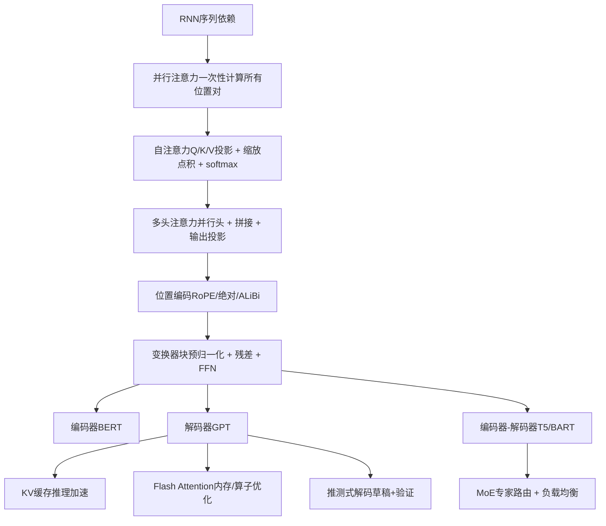

图表来源
- [phases/07-transformers-deep-dive/01-why-transformers/docs/en.md:24-37](file://phases/07-transformers-deep-dive/01-why-transformers/docs/en.md#L24-L37)
- [phases/07-transformers-deep-dive/02-self-attention-from-scratch/docs/en.md:146-168](file://phases/07-transformers-deep-dive/02-self-attention-from-scratch/docs/en.md#L146-L168)
- [phases/07-transformers-deep-dive/03-multi-head-attention/docs/en.md:20-44](file://phases/07-transformers-deep-dive/03-multi-head-attention/docs/en.md#L20-L44)
- [phases/07-transformers-deep-dive/04-positional-encoding/docs/en.md:24-79](file://phases/07-transformers-deep-dive/04-positional-encoding/docs/en.md#L24-L79)
- [phases/07-transformers-deep-dive/05-full-transformer/docs/en.md:22-72](file://phases/07-transformers-deep-dive/05-full-transformer/docs/en.md#L22-L72)
- [phases/07-transformers-deep-dive/06-bert-masked-language-modeling/docs/en.md:20-79](file://phases/07-transformers-deep-dive/06-bert-masked-language-modeling/docs/en.md#L20-L79)
- [phases/07-transformers-deep-dive/07-gpt-causal-language-modeling/docs/en.md:20-82](file://phases/07-transformers-deep-dive/07-gpt-causal-language-modeling/docs/en.md#L20-L82)
- [phases/07-transformers-deep-dive/08-t5-bart-encoder-decoder/docs/en.md:35-93](file://phases/07-transformers-deep-dive/08-t5-bart-encoder-decoder/docs/en.md#L35-L93)
- [phases/07-transformers-deep-dive/11-mixture-of-experts/docs/en.md:18-76](file://phases/07-transformers-deep-dive/11-mixture-of-experts/docs/en.md#L18-L76)
- [phases/07-transformers-deep-dive/12-kv-cache-flash-attention/docs/en.md:10-120](file://phases/07-transformers-deep-dive/12-kv-cache-flash-attention/docs/en.md#L10-L120)
- [phases/07-transformers-deep-dive/16-speculative-decoding/docs/en.md:10-66](file://phases/07-transformers-deep-dive/16-speculative-decoding/docs/en.md#L10-L66)

## 详细组件分析

### 自注意力机制（从零实现）
- 关键流程：输入嵌入经Wq/Wk/Wv投影得到Q/K/V；计算缩放点积注意力得分并softmax；按权重对V加权求和得到输出。
- 数值稳定性：通过除以sqrt(dk)避免高维点积导致softmax饱和。
- 可视化：注意力矩阵每行代表一个token对其余token的关注分布，体现“谁在看谁”。

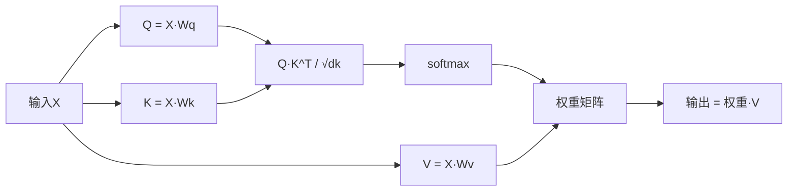

图表来源
- [phases/07-transformers-deep-dive/02-self-attention-from-scratch/docs/en.md:146-168](file://phases/07-transformers-deep-dive/02-self-attention-from-scratch/docs/en.md#L146-L168)

章节来源
- [phases/07-transformers-deep-dive/02-self-attention-from-scratch/docs/en.md:10-335](file://phases/07-transformers-deep-dive/02-self-attention-from-scratch/docs/en.md#L10-L335)

### 多头注意力与变体
- 并行头：将d_model拆分为n_heads个子空间，每个头独立计算注意力，随后拼接并通过Wo投影。
- 变体：MQA（单KV头）、GQA（分组KV头）、MLA（低秩潜变量压缩）。
- 现状：GQA是主流，MLA在存储与质量间取得更好平衡。

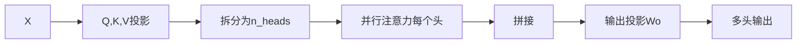

图表来源
- [phases/07-transformers-deep-dive/03-multi-head-attention/docs/en.md:20-44](file://phases/07-transformers-deep-dive/03-multi-head-attention/docs/en.md#L20-L44)

章节来源
- [phases/07-transformers-deep-dive/03-multi-head-attention/docs/en.md:10-164](file://phases/07-transformers-deep-dive/03-multi-head-attention/docs/en.md#L10-L164)

### 位置编码：绝对、RoPE与ALiBi
- 绝对正弦编码：在嵌入上叠加不同频率的sin/cos，简单但外推能力差。
- RoPE：对Q/K进行基于位置的角度旋转，使点积仅依赖相对距离，适合长上下文扩展。
- ALiBi：直接在注意力分数上加入与距离成比例的负偏置，无需额外嵌入，外推效果佳。

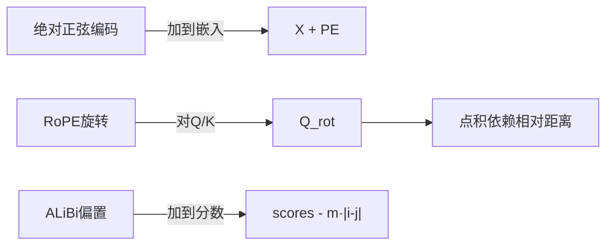

图表来源
- [phases/07-transformers-deep-dive/04-positional-encoding/docs/en.md:24-79](file://phases/07-transformers-deep-dive/04-positional-encoding/docs/en.md#L24-L79)

章节来源
- [phases/07-transformers-deep-dive/04-positional-encoding/docs/en.md:10-186](file://phases/07-transformers-deep-dive/04-positional-encoding/docs/en.md#L10-L186)

### 完整变换器块（预归一化、残差、FFN、交叉注意力）
- 预归一化（RMSNorm/SwiGLU）：更稳定的深层训练；SwiGLU优于ReLU/GELU。
- 残差连接：缓解梯度消失，允许深度堆叠。
- 交叉注意力：解码器中由Q来自自身，K/V来自编码器输出。

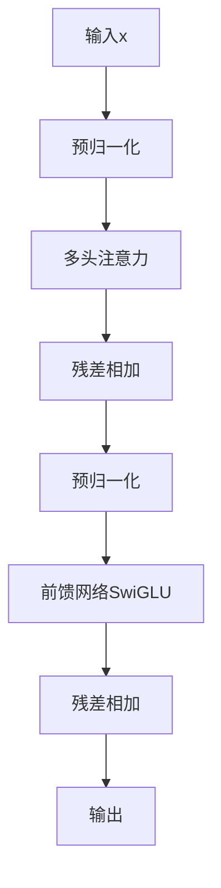

图表来源
- [phases/07-transformers-deep-dive/05-full-transformer/docs/en.md:22-72](file://phases/07-transformers-deep-dive/05-full-transformer/docs/en.md#L22-L72)

章节来源
- [phases/07-transformers-deep-dive/05-full-transformer/docs/en.md:18-175](file://phases/07-transformers-deep-dive/05-full-transformer/docs/en.md#L18-L175)

### BERT：掩码语言建模
- 训练信号：随机遮蔽15%的token，其中80%替换为[MASK]，10%替换为随机token，10%保持原词。
- 特点：双向上下文，适合抽取式问答、分类、命名实体识别等任务。
- 现代化：RoPE、GeGLU、交替局部+全局注意力、8K上下文。

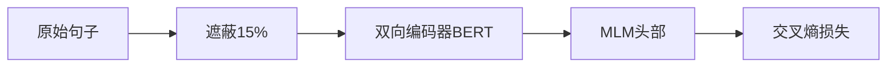

图表来源
- [phases/07-transformers-deep-dive/06-bert-masked-language-modeling/docs/en.md:24-79](file://phases/07-transformers-deep-dive/06-bert-masked-language-modeling/docs/en.md#L24-L79)

章节来源
- [phases/07-transformers-deep-dive/06-bert-masked-language-modeling/docs/en.md:10-163](file://phases/07-transformers-deep-dive/06-bert-masked-language-modeling/docs/en.md#L10-L163)

### GPT：因果语言建模
- 训练信号：给定前t-1个token预测第t个token，使用下三角掩码确保自回归。
- 推理：贪心、温度采样、Top-k、Top-p、Min-p；推测式解码显著降低延迟。
- 采样策略：温度控制多样性，Top-p自适应截断，Min-p抑制长尾。

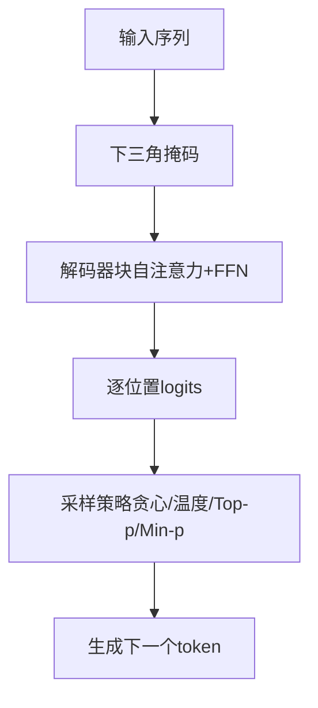

图表来源
- [phases/07-transformers-deep-dive/07-gpt-causal-language-modeling/docs/en.md:24-82](file://phases/07-transformers-deep-dive/07-gpt-causal-language-modeling/docs/en.md#L24-L82)

章节来源
- [phases/07-transformers-deep-dive/07-gpt-causal-language-modeling/docs/en.md:10-164](file://phases/07-transformers-deep-dive/07-gpt-causal-language-modeling/docs/en.md#L10-L164)

### T5/BART：编码器-解码器
- T5：将所有任务统一为“文本到文本”，采用span corruption预训练。
- BART：多噪声去噪目标（遮蔽、删除、填充、置换、轮转），解码器重建原文。
- 推理：与GPT类似，但跨注意力将源表示注入目标生成过程。

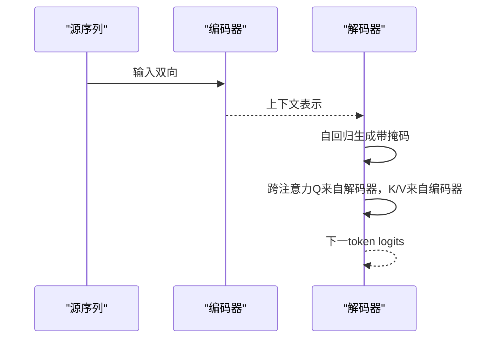

图表来源
- [phases/07-transformers-deep-dive/08-t5-bart-encoder-decoder/docs/en.md:39-93](file://phases/07-transformers-deep-dive/08-t5-bart-encoder-decoder/docs/en.md#L39-L93)

章节来源
- [phases/07-transformers-deep-dive/08-t5-bart-encoder-decoder/docs/en.md:10-165](file://phases/07-transformers-deep-dive/08-t5-bart-encoder-decoder/docs/en.md#L10-L165)

### MoE：混合专家
- 思想：将FFN替换为E个专家，每token仅激活k个专家，参数总量E×FFN_size，活跃FLOPs≈k×FFN_size。
- 路由：softmax归一化的门控权重；辅助损失自由的负载均衡（DeepSeek-V3）通过专家偏置调节选择。
- 存储与通信：所有专家权重常驻显存，专家并行（跨GPU路由）主导延迟。

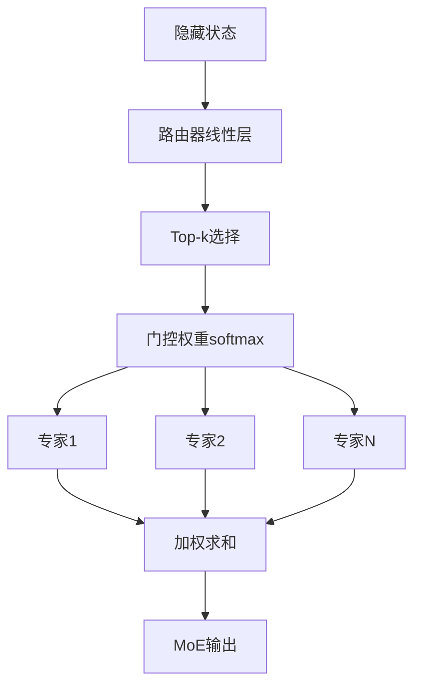

图表来源
- [phases/07-transformers-deep-dive/11-mixture-of-experts/docs/en.md:22-76](file://phases/07-transformers-deep-dive/11-mixture-of-experts/docs/en.md#L22-L76)

章节来源
- [phases/07-transformers-deep-dive/11-mixture-of-experts/docs/en.md:10-169](file://phases/07-transformers-deep-dive/11-mixture-of-experts/docs/en.md#L10-L169)

### KV缓存与Flash Attention
- KV缓存：在自回归解码时缓存历史键值，避免重复计算，显著降低推理延迟。
- Flash Attention：通过内核融合、分块与内存访问优化，降低注意力的内存峰值与算子开销。

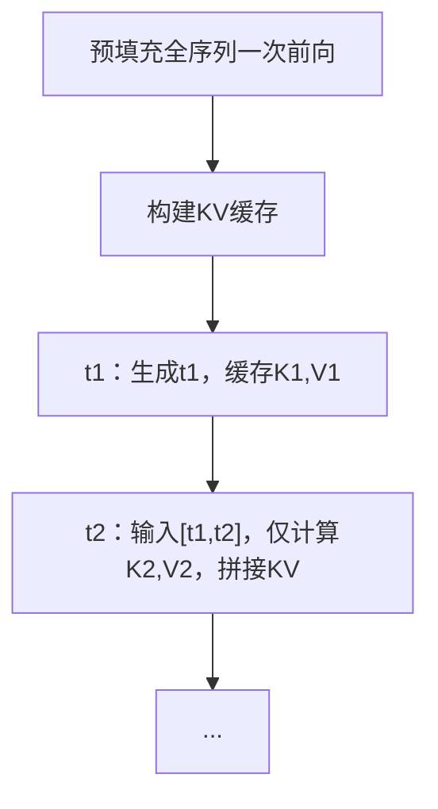

图表来源
- [phases/07-transformers-deep-dive/12-kv-cache-flash-attention/docs/en.md:10-120](file://phases/07-transformers-deep-dive/12-kv-cache-flash-attention/docs/en.md#L10-L120)

章节来源
- [phases/07-transformers-deep-dive/12-kv-cache-flash-attention/docs/en.md:10-180](file://phases/07-transformers-deep-dive/12-kv-cache-flash-attention/docs/en.md#L10-L180)

### 注意力变体与稀疏化
- 差分注意力（Differential Attention v2）：在连续时间或流形上定义注意力，适用于长序列与非网格数据。
- 其他稀疏注意力：滑动窗口、固定模式、结构化稀疏等，用于缓解O(N^2)内存瓶颈。

章节来源
- [phases/10-llms-from-scratch/16-differential-attention-v2/docs/en.md:1-200](file://phases/10-llms-from-scratch/16-differential-attention-v2/docs/en.md#L1-L200)
- [phases/07-transformers-deep-dive/15-attention-variants/docs/en.md:10-200](file://phases/07-transformers-deep-dive/15-attention-variants/docs/en.md#L10-L200)

### 推测式解码
- 草稿模型快速生成候选token序列，主模型并行验证，显著减少端到端延迟。
- 在相同质量下获得2–3倍速度增益。

章节来源
- [phases/07-transformers-deep-dive/16-speculative-decoding/docs/en.md:10-160](file://phases/07-transformers-deep-dive/16-speculative-decoding/docs/en.md#L10-L160)

## 依赖关系分析
- 层级依赖：自注意力 → 多头注意力 → 位置编码 → 变换器块 → 模型（BERT/GPT/T5/BART）→ 推理优化（KV缓存/Flash Attention/MoE/推测式解码）。
- 实现耦合：多头注意力依赖自注意力；位置编码可插拔（RoPE为主流）；解码采样与KV缓存强耦合；MoE与专家并行通信成为瓶颈。

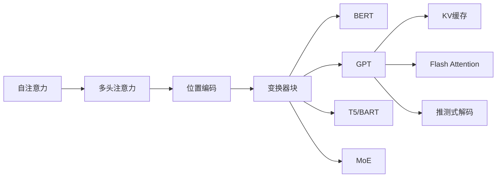

图表来源
- [phases/07-transformers-deep-dive/02-self-attention-from-scratch/docs/en.md:146-168](file://phases/07-transformers-deep-dive/02-self-attention-from-scratch/docs/en.md#L146-L168)
- [phases/07-transformers-deep-dive/03-multi-head-attention/docs/en.md:20-44](file://phases/07-transformers-deep-dive/03-multi-head-attention/docs/en.md#L20-L44)
- [phases/07-transformers-deep-dive/04-positional-encoding/docs/en.md:24-79](file://phases/07-transformers-deep-dive/04-positional-encoding/docs/en.md#L24-L79)
- [phases/07-transformers-deep-dive/05-full-transformer/docs/en.md:22-72](file://phases/07-transformers-deep-dive/05-full-transformer/docs/en.md#L22-L72)
- [phases/07-transformers-deep-dive/06-bert-masked-language-modeling/docs/en.md:24-79](file://phases/07-transformers-deep-dive/06-bert-masked-language-modeling/docs/en.md#L24-L79)
- [phases/07-transformers-deep-dive/07-gpt-causal-language-modeling/docs/en.md:24-82](file://phases/07-transformers-deep-dive/07-gpt-causal-language-modeling/docs/en.md#L24-L82)
- [phases/07-transformers-deep-dive/08-t5-bart-encoder-decoder/docs/en.md:39-93](file://phases/07-transformers-deep-dive/08-t5-bart-encoder-decoder/docs/en.md#L39-L93)
- [phases/07-transformers-deep-dive/11-mixture-of-experts/docs/en.md:22-76](file://phases/07-transformers-deep-dive/11-mixture-of-experts/docs/en.md#L22-L76)
- [phases/07-transformers-deep-dive/12-kv-cache-flash-attention/docs/en.md:10-120](file://phases/07-transformers-deep-dive/12-kv-cache-flash-attention/docs/en.md#L10-L120)
- [phases/07-transformers-deep-dive/16-speculative-decoding/docs/en.md:10-66](file://phases/07-transformers-deep-dive/16-speculative-decoding/docs/en.md#L10-L66)

## 性能考量
- 时间复杂度：自注意力一次批处理矩阵乘法，远超RNN串行深度；随序列长度增长，注意力内存成本为O(N^2）。
- 内存优化：滑动窗口、RoPE外推、Flash Attention分块与内核融合。
- 推理瓶颈：自回归解码的串行深度，KV缓存与推测式解码可显著降低延迟。
- 扩展性：MoE通过稀疏激活降低每token的活跃FLOPs，专家并行带来通信开销。
- 训练稳定性：预归一化、RMSNorm、SwiGLU、RoPE等现代化组件提升深层收敛与泛化。

## 故障排查指南
- 注意力权重异常
  - 症状：注意力权重集中在少数位置或全均匀。
  - 排查：检查缩放因子是否正确、softmax是否数值稳定、Q/K/V初始化是否合理。
  - 参考：自注意力实现与缩放点积公式。
- 多头注意力形状错误
  - 症状：拼接维度不匹配或输出形状异常。
  - 排查：确认拆分/合并头的reshape与transpose顺序、d_model与n_heads的关系。
  - 参考：多头注意力拆分与拼接逻辑。
- 位置编码不生效
  - 症状：模型无法区分顺序或外推失败。
  - 排查：RoPE旋转是否按绝对位置应用、ALiBi偏置是否加到正确位置。
  - 参考：位置编码实现与相对距离性质验证。
- 解码采样不稳定
  - 症状：输出过于保守或过于发散。
  - 排查：温度、Top-p、Min-p参数设置；推测式解码的草稿模型质量。
  - 参考：采样策略与推测式解码。
- MoE负载不均衡
  - 症状：部分专家过载，整体吞吐下降。
  - 排查：是否启用辅助损失自由的专家偏置更新、top-k选择是否稳定。
  - 参考：MoE路由与负载均衡。

章节来源
- [phases/07-transformers-deep-dive/02-self-attention-from-scratch/docs/en.md:170-335](file://phases/07-transformers-deep-dive/02-self-attention-from-scratch/docs/en.md#L170-L335)
- [phases/07-transformers-deep-dive/03-multi-head-attention/docs/en.md:45-164](file://phases/07-transformers-deep-dive/03-multi-head-attention/docs/en.md#L45-L164)
- [phases/07-transformers-deep-dive/04-positional-encoding/docs/en.md:80-186](file://phases/07-transformers-deep-dive/04-positional-encoding/docs/en.md#L80-L186)
- [phases/07-transformers-deep-dive/07-gpt-causal-language-modeling/docs/en.md:54-164](file://phases/07-transformers-deep-dive/07-gpt-causal-language-modeling/docs/en.md#L54-L164)
- [phases/07-transformers-deep-dive/11-mixture-of-experts/docs/en.md:44-169](file://phases/07-transformers-deep-dive/11-mixture-of-experts/docs/en.md#L44-L169)

## 结论
本课程从RNN的局限出发，系统梳理了注意力机制的数学本质与工程实现，贯通自注意力、多头注意力、位置编码、掩码策略与完整变换器块，并以BERT、GPT、T5/BART为例说明不同训练范式的适用场景。在此基础上，课程进一步覆盖KV缓存、Flash Attention、MoE与稀疏注意力等推理与扩展关键技术，最终以可运行的完整变换器实现作为学习成果，帮助读者建立对现代大语言模型核心技术的系统认知与实操能力。

## 附录
- 练习与测试
  - 自注意力与多头注意力的单元测试与可视化热图可用于验证实现正确性与注意力模式。
- 进一步阅读
  - 原始论文与现代化实现参考见各章节“进一步阅读”。

章节来源
- [phases/19-capstone-projects/33-multihead-self-attention/code/tests/test_attention.py](file://phases/19-capstone-projects/33-multihead-self-attention/code/tests/test_attention.py)