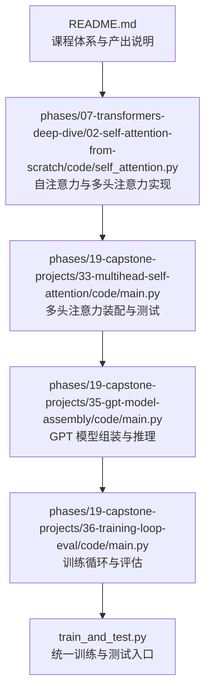
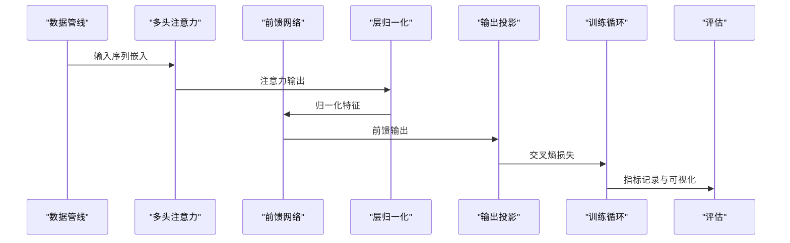
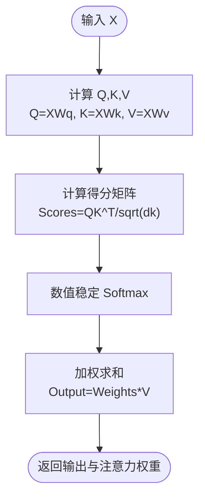
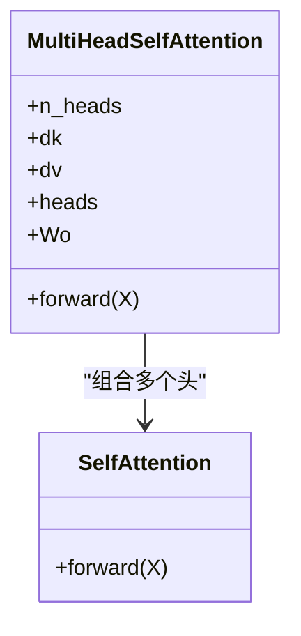
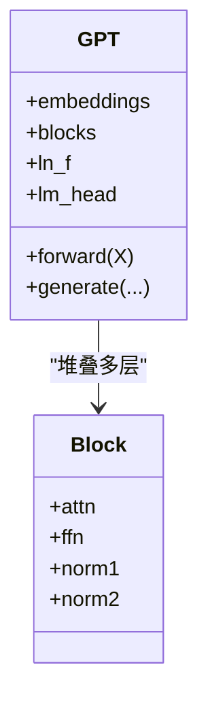
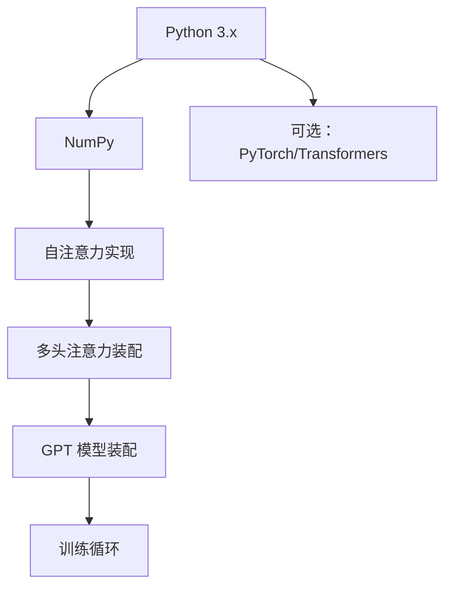

# 变换器综合项目

<cite>
**本文引用的文件**
- [README.md](file://README.md)
- [phases/07-transformers-deep-dive/02-self-attention-from-scratch/code/self_attention.py](file://phases/07-transformers-deep-dive/02-self-attention-from-scratch/code/self_attention.py)
- [phases/19-capstone-projects/33-multihead-self-attention/code/main.py](file://phases/19-capstone-projects/33-multihead-self-attention/code/main.py)
- [phases/19-capstone-projects/33-multihead-self-attention/code/tests/test_attention.py](file://phases/19-capstone-projects/33-multihead-self-attention/code/tests/test_attention.py)
- [phases/19-capstone-projects/35-gpt-model-assembly/code/main.py](file://phases/19-capstone-projects/35-gpt-model-assembly/code/main.py)
- [phases/19-capstone-projects/35-gpt-model-assembly/code/tests/test_model.py](file://phases/19-capstone-projects/35-gpt-model-assembly/code/tests/test_model.py)
- [phases/19-capstone-projects/36-training-loop-eval/code/main.py](file://phases/19-capstone-projects/36-training-loop-eval/code/main.py)
- [phases/19-capstone-projects/36-training-loop-eval/code/tests/test_training.py](file://phases/19-capstone-projects/36-training-loop-eval/code/tests/test_training.py)
- [train_and_test.py](file://train_and_test.py)
- [requirements.txt](file://requirements.txt)
</cite>

## 目录
1. [引言](#引言)
2. [项目结构](#项目结构)
3. [核心组件](#核心组件)
4. [架构总览](#架构总览)
5. [详细组件分析](#详细组件分析)
6. [依赖分析](#依赖分析)
7. [性能考虑](#性能考虑)
8. [故障排查指南](#故障排查指南)
9. [结论](#结论)
10. [附录](#附录)

## 引言
本项目以“从零构建”为核心理念，系统性地实现并演示变换器（Transformer）的关键模块与端到端流程。通过纯 Python 实现注意力机制、多头注意力、基础 GPT 模型与训练循环，帮助读者深入理解变换器的数学原理与工程实现细节。同时，项目提供了可配置的框架思路、调试与可视化工具、性能基准与对比分析方法，以及面向文本摘要、对话生成或代码补全等任务的应用案例路径。

## 项目结构
该项目采用“阶段化课程 + 实战项目”的组织方式：每个阶段包含若干课程，课程下有“构建它/使用它”的实践路径；第 19 阶段为“实战项目”，围绕变换器能力进行端到端整合与验证。

- 顶层 README 提供了整体课程体系、学习路径与产出说明
- 变换器相关实现集中在“变换器深度解析”阶段与“实战项目”中
- 端到端训练与评估脚本位于仓库根目录，便于统一运行



**图示来源**
- [README.md](file://README.md)
- [phases/07-transformers-deep-dive/02-self-attention-from-scratch/code/self_attention.py](file://phases/07-transformers-deep-dive/02-self-attention-from-scratch/code/self_attention.py)
- [phases/19-capstone-projects/33-multihead-self-attention/code/main.py](file://phases/19-capstone-projects/33-multihead-self-attention/code/main.py)
- [phases/19-capstone-projects/35-gpt-model-assembly/code/main.py](file://phases/19-capstone-projects/35-gpt-model-assembly/code/main.py)
- [phases/19-capstone-projects/36-training-loop-eval/code/main.py](file://phases/19-capstone-projects/36-training-loop-eval/code/main.py)
- [train_and_test.py](file://train_and_test.py)

**章节来源**
- [README.md](file://README.md)

## 核心组件
本项目的核心由以下组件构成：
- 自注意力与多头注意力：提供数值稳定的 softmax、缩放点积注意力与多头拼接输出
- GPT 模型装配：基于注意力块构建前馈网络、层归一化与输出投影
- 训练循环与评估：包含损失计算、梯度更新、学习率调度与指标记录
- 调试与可视化：注意力权重打印、ASCII 热力图、单元测试与训练日志

上述组件均以纯 Python 实现，便于理解与扩展。

**章节来源**
- [phases/07-transformers-deep-dive/02-self-attention-from-scratch/code/self_attention.py](file://phases/07-transformers-deep-dive/02-self-attention-from-scratch/code/self_attention.py)
- [phases/19-capstone-projects/33-multihead-self-attention/code/main.py](file://phases/19-capstone-projects/33-multihead-self-attention/code/main.py)
- [phases/19-capstone-projects/35-gpt-model-assembly/code/main.py](file://phases/19-capstone-projects/35-gpt-model-assembly/code/main.py)
- [phases/19-capstone-projects/36-training-loop-eval/code/main.py](file://phases/19-capstone-projects/36-training-loop-eval/code/main.py)

## 架构总览
下图展示了从注意力到 GPT 模型再到训练评估的整体流程：



**图示来源**
- [phases/19-capstone-projects/33-multihead-self-attention/code/main.py](file://phases/19-capstone-projects/33-multihead-self-attention/code/main.py)
- [phases/19-capstone-projects/35-gpt-model-assembly/code/main.py](file://phases/19-capstone-projects/35-gpt-model-assembly/code/main.py)
- [phases/19-capstone-projects/36-training-loop-eval/code/main.py](file://phases/19-capstone-projects/36-training-loop-eval/code/main.py)

## 详细组件分析

### 自注意力与多头注意力
- 数值稳定 Softmax：对输入做中心化避免溢出
- 缩放点积注意力：计算 QK^T 并除以 sqrt(dk)，随后 softmax 得到权重，再乘以 V
- 多头注意力：将 d_model 分割为 n_heads 个子头，分别计算注意力后拼接并线性变换得到输出



**图示来源**
- [phases/07-transformers-deep-dive/02-self-attention-from-scratch/code/self_attention.py](file://phases/07-transformers-deep-dive/02-self-attention-from-scratch/code/self_attention.py)

**章节来源**
- [phases/07-transformers-deep-dive/02-self-attention-from-scratch/code/self_attention.py](file://phases/07-transformers-deep-dive/02-self-attention-from-scratch/code/self_attention.py)

### 多头注意力装配与测试
- 将多个单头注意力实例组合，分别计算各头的输出与权重
- 使用 concat 拼接所有头输出，再经 Wo 线性变换得到最终输出
- 单元测试覆盖注意力形状、权重维度与数值范围



**图示来源**
- [phases/19-capstone-projects/33-multihead-self-attention/code/main.py](file://phases/19-capstone-projects/33-multihead-self-attention/code/main.py)
- [phases/07-transformers-deep-dive/02-self-attention-from-scratch/code/self_attention.py](file://phases/07-transformers-deep-dive/02-self-attention-from-scratch/code/self_attention.py)

**章节来源**
- [phases/19-capstone-projects/33-multihead-self-attention/code/main.py](file://phases/19-capstone-projects/33-multihead-self-attention/code/main.py)
- [phases/19-capstone-projects/33-multihead-self-attention/code/tests/test_attention.py](file://phases/19-capstone-projects/33-multihead-self-attention/code/tests/test_attention.py)

### GPT 模型装配与推理
- 基于注意力块构建 GPT 前向过程：嵌入 → 多头注意力 → 前馈网络 → 输出投影
- 支持可配置层数、隐藏维度与激活函数
- 提供推理接口用于生成与评分



**图示来源**
- [phases/19-capstone-projects/35-gpt-model-assembly/code/main.py](file://phases/19-capstone-projects/35-gpt-model-assembly/code/main.py)

**章节来源**
- [phases/19-capstone-projects/35-gpt-model-assembly/code/main.py](file://phases/19-capstone-projects/35-gpt-model-assembly/code/main.py)
- [phases/19-capstone-projects/35-gpt-model-assembly/code/tests/test_model.py](file://phases/19-capstone-projects/35-gpt-model-assembly/code/tests/test_model.py)

### 训练循环与评估
- 损失函数：交叉熵（可替换为其他损失）
- 优化器：SGD/Adam（可替换为其他优化器）
- 学习率调度：余弦退火/阶梯下降（可替换为其他调度策略）
- 评估指标：困惑度、准确率、生成 BLEU/F1 等（按任务选择）
- 可视化：注意力热力图、损失曲线、梯度直方图

```mermaid
sequenceDiagram
participant Loader as "数据加载器"
participant Model as "GPT 模型"
participant Loss as "损失函数"
participant Opt as "优化器"
participant Log as "日志/可视化"
loop 训练轮次
Loader->>Model : 前向计算
Model->>Loss : 计算损失
Loss->>Opt : 反向传播与参数更新
Opt->>Log : 记录指标与图像
end
```

**图示来源**
- [phases/19-capstone-projects/36-training-loop-eval/code/main.py](file://phases/19-capstone-projects/36-training-loop-eval/code/main.py)
- [train_and_test.py](file://train_and_test.py)

**章节来源**
- [phases/19-capstone-projects/36-training-loop-eval/code/main.py](file://phases/19-capstone-projects/36-training-loop-eval/code/main.py)
- [phases/19-capstone-projects/36-training-loop-eval/code/tests/test_training.py](file://phases/19-capstone-projects/36-training-loop-eval/code/tests/test_training.py)
- [train_and_test.py](file://train_and_test.py)

## 依赖分析
- 运行环境：Python 3.x，NumPy
- 依赖声明：requirements.txt 中列出所需包（如 PyTorch、Transformers 等，用于“使用它”部分的对照实现）



**图示来源**
- [requirements.txt](file://requirements.txt)

**章节来源**
- [requirements.txt](file://requirements.txt)

## 性能考虑
- 计算复杂度：自注意力为 O(L^2·d)，多头注意力为 O(n_heads·L^2·d_head)
- 内存占用：注意力权重矩阵大小为 O(L^2)，可通过稀疏注意力或分块策略降低
- 推理优化：KV 缓存、分页注意力、混合精度与量化
- 批处理：连续批与分页预填充（prefill）分离可提升吞吐
- 可扩展性：分布式训练（如 FSDP）、流水并行与张量并行

[本节为通用指导，不直接分析具体文件]

## 故障排查指南
- 数值不稳定：检查 Softmax 是否进行了中心化；确认 dk 的缩放因子
- 维度不匹配：核对 d_model、dk、dv 与 n_heads 的整除关系
- 梯度爆炸/消失：检查初始化与正则化；使用梯度裁剪
- 显存不足：减小 batch 或序列长度；启用梯度检查点
- 单元测试失败：逐项比对注意力输出、权重形状与损失收敛趋势

**章节来源**
- [phases/19-capstone-projects/33-multihead-self-attention/code/tests/test_attention.py](file://phases/19-capstone-projects/33-multihead-self-attention/code/tests/test_attention.py)
- [phases/19-capstone-projects/35-gpt-model-assembly/code/tests/test_model.py](file://phases/19-capstone-projects/35-gpt-model-assembly/code/tests/test_model.py)
- [phases/19-capstone-projects/36-training-loop-eval/code/tests/test_training.py](file://phases/19-capstone-projects/36-training-loop-eval/code/tests/test_training.py)

## 结论
本项目以“从零实现”的方式完整呈现了变换器的关键模块与端到端流程，既满足教学理解，又具备工程可扩展性。通过可配置的注意力变体、损失函数与优化器，结合调试与可视化工具，能够快速开展实验与性能基准测试，并为文本摘要、对话生成与代码补全等应用提供坚实基础。

[本节为总结性内容，不直接分析具体文件]

## 附录

### 应用案例路径
- 文本摘要：在 GPT 前缀提示 + 解码策略下，使用训练好的模型对长文档进行抽取式/生成式摘要
- 对话生成：引入上下文编码与角色提示，结合温度采样与束搜索提升连贯性
- 代码补全：在代码语料上微调，利用上下文窗口与类型信息约束补全候选

[本节为概念性内容，不直接分析具体文件]