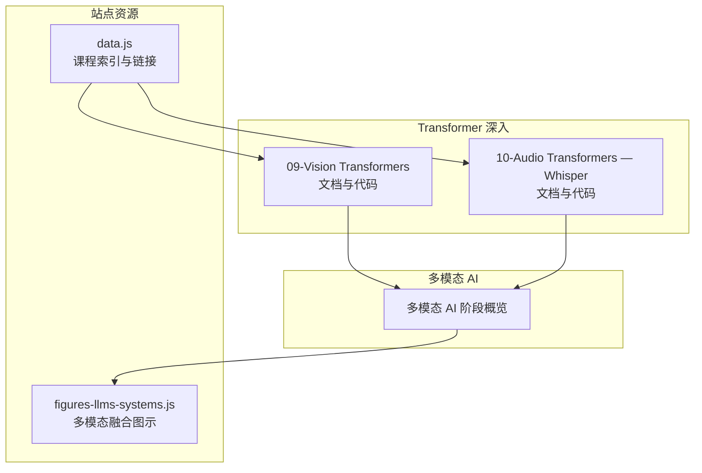
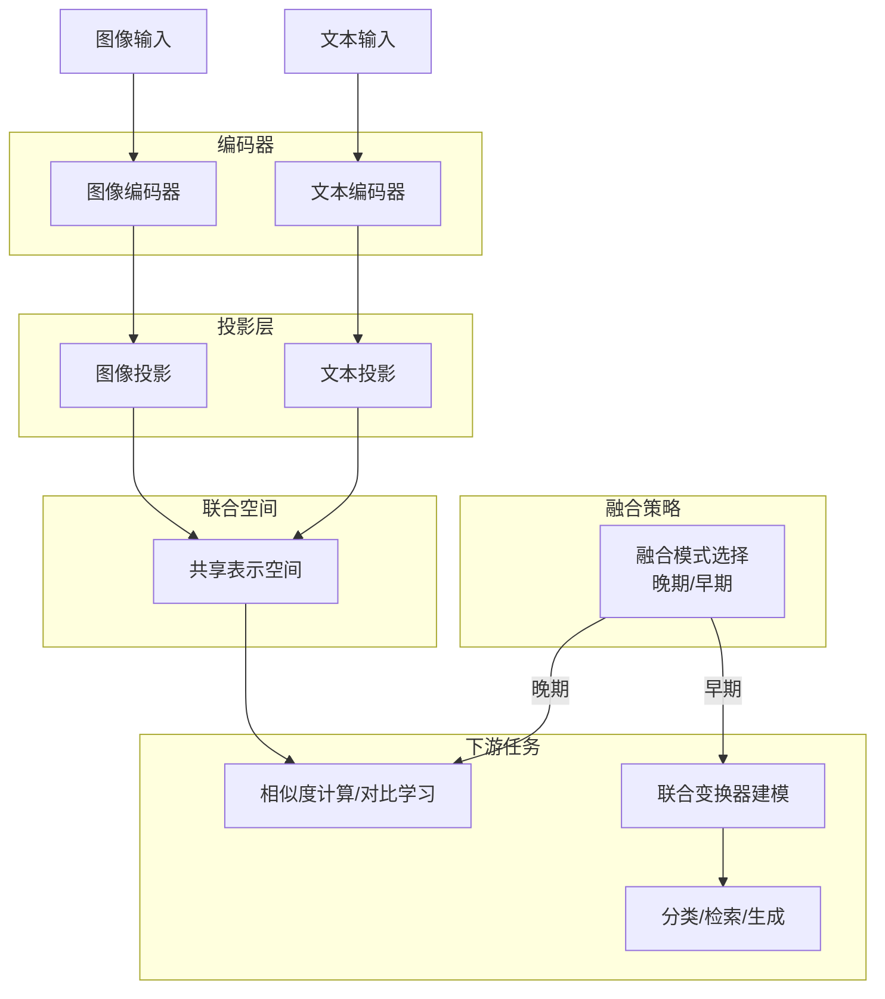
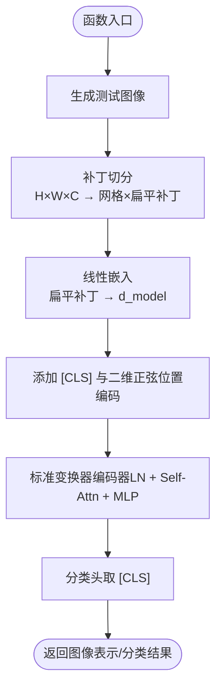
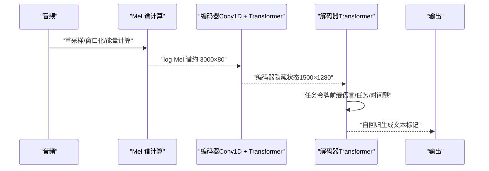
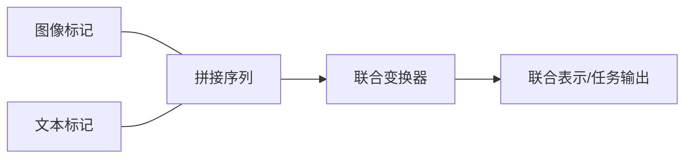
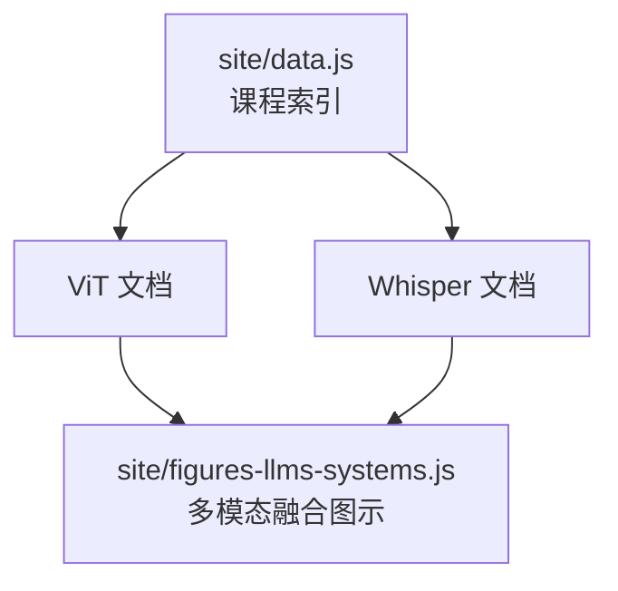

# 多模态变换器

<cite>
**本文引用的文件**
- [phases/07-transformers-deep-dive/09-vision-transformers/docs/en.md](file://phases/07-transformers-deep-dive/09-vision-transformers/docs/en.md)
- [phases/07-transformers-deep-dive/09-vision-transformers/code/main.py](file://phases/07-transformers-deep-dive/09-vision-transformers/code/main.py)
- [phases/07-transformers-deep-dive/09-vision-transformers/outputs/skill-vit-configurator.md](file://phases/07-transformers-deep-dive/09-vision-transformers/outputs/skill-vit-configurator.md)
- [phases/07-transformers-deep-dive/10-audio-transformers-whisper/docs/en.md](file://phases/07-transformers-deep-dive/10-audio-transformers-whisper/docs/en.md)
- [site/figures-llms-systems.js](file://site/figures-llms-systems.js)
- [site/data.js](file://site/data.js)
</cite>

## 目录
1. [引言](#引言)
2. [项目结构](#项目结构)
3. [核心组件](#核心组件)
4. [架构总览](#架构总览)
5. [详细组件分析](#详细组件分析)
6. [依赖关系分析](#依赖关系分析)
7. [性能考量](#性能考量)
8. [故障排查指南](#故障排查指南)
9. [结论](#结论)
10. [附录](#附录)

## 引言
本文件围绕“多模态变换器”主题，系统梳理并讲解以下内容：
- 视觉变换器（ViT）如何将图像切分为补丁并通过自注意力进行特征提取，重点覆盖补丁嵌入与位置编码设计；
- 音频/自动语音识别（ASR）中的变换器应用，以 Whisper 为例说明音频的时频表示（Mel 谱）与跨模态注意力机制；
- 多模态融合的变换器架构：模态特定嵌入层、跨模态注意力与联合表示学习；
- 提供完整多模态模型实现思路，覆盖图像分类、语音识别等任务；
- 讨论多模态预训练与微调策略。

## 项目结构
本仓库在“Transformer 深入”阶段提供了 ViT 的构建与理解材料，在“多模态 AI”阶段提供了多模态融合的概念图示与课程索引；同时，站点脚本中包含多模态融合的可视化图示，便于直观理解早期/晚期融合策略。

**图表来源**
- [phases/07-transformers-deep-dive/09-vision-transformers/docs/en.md](file://phases/07-transformers-deep-dive/09-vision-transformers/docs/en.md)
- [phases/07-transformers-deep-dive/10-audio-transformers-whisper/docs/en.md](file://phases/07-transformers-deep-dive/10-audio-transformers-whisper/docs/en.md)
- [site/figures-llms-systems.js](file://site/figures-llms-systems.js)
- [site/data.js](file://site/data.js)

**章节来源**
- [phases/12-multimodal-ai/README.md](file://phases/12-multimodal-ai/README.md)
- [site/data.js](file://site/data.js)

## 核心组件
- 视觉前端（ViT 前端）：负责将图像切分为补丁、线性嵌入、添加 [CLS] 与位置编码，并输出序列化特征。
- 音频前端（Whisper）：将音频转换为 Mel 谱，作为“图像”输入到编码器，再由解码器生成文本。
- 多模态融合：通过“晚期融合”（各自编码后投影到统一空间）或“早期融合”（拼接为单一序列联合建模）实现跨模态对齐与推理。

**章节来源**
- [phases/07-transformers-deep-dive/09-vision-transformers/docs/en.md](file://phases/07-transformers-deep-dive/09-vision-transformers/docs/en.md)
- [phases/07-transformers-deep-dive/10-audio-transformers-whisper/docs/en.md](file://phases/07-transformers-deep-dive/10-audio-transformers-whisper/docs/en.md)
- [site/figures-llms-systems.js](file://site/figures-llms-systems.js)

## 架构总览
下图展示了多模态融合的两种主流范式：晚期融合与早期融合。晚期融合强调模态独立编码与投影，最终在统一空间比较相似度；早期融合则将不同模态的标记拼接为一个序列，由单一变换器联合建模。

**图表来源**
- [site/figures-llms-systems.js](file://site/figures-llms-systems.js)

## 详细组件分析

### 视觉变换器（ViT）：补丁嵌入与位置编码
- 补丁切分（patchify）：将 H×W×C 图像按固定大小 P×P 切分为 N 个平铺的补丁序列，典型尺寸如 224×224、16×16 补丁，得到 196 个补丁向量。
- 线性嵌入（patch embedding）：用可学习矩阵将每个扁平补丁映射到 d_model 维空间，等价于以步幅 P 的卷积核进行投影。
- [CLS] 与位置编码：在序列前添加可学习的 [CLS] 标记，其最终隐藏状态用于分类；随后加入二维正弦位置编码或 RoPE 扩展。
- 变换器编码器：堆叠标准的 LN → 自注意力 → 前馈网络（MLP）模块，不引入视觉专用算子。
- 分类头：取 [CLS] 的隐藏状态经线性层与 softmax 得到类别概率。

**图表来源**
- [phases/07-transformers-deep-dive/09-vision-transformers/code/main.py](file://phases/07-transformers-deep-dive/09-vision-transformers/code/main.py)

**章节来源**
- [phases/07-transformers-deep-dive/09-vision-transformers/docs/en.md](file://phases/07-transformers-deep-dive/09-vision-transformers/docs/en.md)
- [phases/07-transformers-deep-dive/09-vision-transformers/code/main.py](file://phases/07-transformers-deep-dive/09-vision-transformers/code/main.py)
- [phases/07-transformers-deep-dive/09-vision-transformers/outputs/skill-vit-configurator.md](file://phases/07-transformers-deep-dive/09-vision-transformers/outputs/skill-vit-configurator.md)

### 音频/ASR：Whisper 的时频表示与跨模态注意力
- 音频到“图像”的映射：将 16 kHz 音频裁剪/填充至 30 秒，计算对数 Mel 谱（80 个 Mel 桶，10 ms 步长），形成约 3000×80 的“图像”输入。
- 编码器（Conv1D 前干 + Transformer 编码器）：两层 Conv1D 将序列长度减半，随后 24 层编码器（Sinusoidal 位置编码 + 自注意力 + 前馈网络）输出 1500×1280 的隐藏状态。
- 解码器（Transformer 解码器）：基于 BPE 词汇表（扩展版 GPT-2 词汇）自回归生成文本标记，支持转写、翻译、语言识别、时间戳等任务。
- 任务控制令牌（Task Tokens）：解码器提示以特殊控制令牌开头，如语言、任务类型、是否输出时间戳等，实现“指令式语音”。
- 输出：束搜索（宽度 5）+ 对数阈值，若未禁用时间戳则每 0.02 秒预测一次。

**图表来源**
- [phases/07-transformers-deep-dive/10-audio-transformers-whisper/docs/en.md](file://phases/07-transformers-deep-dive/10-audio-transformers-whisper/docs/en.md)

**章节来源**
- [phases/07-transformers-deep-dive/10-audio-transformers-whisper/docs/en.md](file://phases/07-transformers-deep-dive/10-audio-transformers-whisper/docs/en.md)

### 多模态融合：跨模态注意力与联合表示学习
- 晚期融合（Late Fusion）：图像与文本分别经独立编码器，随后投影到统一空间，最后通过余弦相似度或对比损失进行对齐与学习。该范式适合 CLIP 等对比学习。
- 早期融合（Early Fusion）：将图像与文本标记拼接为单一序列，由同一变换器联合建模，适用于图文生成、对话等任务。
- 跨模态注意力：在早期融合中，图像与文本之间可引入交叉注意力，使彼此在表示层面相互增强；在晚期融合中，通过投影后的向量比较实现跨模态对齐。

**图表来源**
- [site/figures-llms-systems.js](file://site/figures-llms-systems.js)

**章节来源**
- [site/figures-llms-systems.js](file://site/figures-llms-systems.js)

### 完整多模态模型实现（图像分类与语音识别）
- 图像分类（ViT）：使用纯 Python 实现补丁切分、线性嵌入、[CLS] 与二维正弦位置编码，验证序列长度与参数规模估算方法；可结合 DINOv2 等自监督特征进行下游线性探测或微调。
- 语音识别（Whisper）：实现 Mel 谱的简化管线与任务令牌格式化，掌握解码流程与实时/流式推理要点；可结合 faster-whisper 进行生产级加速与部署。

**章节来源**
- [phases/07-transformers-deep-dive/09-vision-transformers/code/main.py](file://phases/07-transformers-deep-dive/09-vision-transformers/code/main.py)
- [phases/07-transformers-deep-dive/10-audio-transformers-whisper/docs/en.md](file://phases/07-transformers-deep-dive/10-audio-transformers-whisper/docs/en.md)

## 依赖关系分析
- 数据与工具链：ViT 与 Whisper 的实现依赖于标准库与常见科学计算库；Whisper 的生产部署常配合 CTranslate2、VAD 等外部组件。
- 课程索引：站点数据脚本维护了多模态相关课程的索引与链接，便于导航与选课。

**图表来源**
- [site/data.js](file://site/data.js)
- [site/figures-llms-systems.js](file://site/figures-llms-systems.js)

**章节来源**
- [site/data.js](file://site/data.js)

## 性能考量
- ViT 参数规模与序列长度：补丁尺寸越大，序列越短，注意力复杂度 O(N^2) 下降；但分辨率降低可能影响精度。需根据任务与硬件预算权衡。
- Whisper 推理速度：Large-v3-turbo 将解码器层数降至 4，显著提升解码速度；在实时语音助手场景中优先考虑。
- 早期/晚期融合的选择：晚期融合通常更易扩展与对齐，早期融合在联合生成任务上更具表达力；需结合任务目标与资源约束评估。

## 故障排查指南
- ViT 参数计数与形状校验：确保补丁数量等于 (H/P)×(W/P)，扁平补丁维度等于 P×P×C；[CLS] 嵌入与位置编码应正确叠加。
- Whisper 输入长度与窗口：音频需裁剪/填充至 30 秒，Mel 谱帧数应与步长匹配；任务令牌前缀需与模型训练约定一致。
- 多模态融合一致性：晚期融合需保证投影维度一致与归一化策略；早期融合需注意拼接顺序与填充策略，避免信息泄露。

**章节来源**
- [phases/07-transformers-deep-dive/09-vision-transformers/code/main.py](file://phases/07-transformers-deep-dive/09-vision-transformers/code/main.py)
- [phases/07-transformers-deep-dive/10-audio-transformers-whisper/docs/en.md](file://phases/07-transformers-deep-dive/10-audio-transformers-whisper/docs/en.md)

## 结论
- ViT 将图像视为“补丁网格”，沿用标准变换器编码器即可获得强大的视觉表征，关键在于补丁嵌入与位置编码设计。
- Whisper 将音频映射为 Mel 谱，采用编码器-解码器结构完成多任务语音处理，任务令牌提供灵活的指令控制。
- 多模态融合可通过晚期或早期策略实现，前者强调跨模态对齐，后者强调联合建模；实际应用中需综合任务需求与资源约束进行选择。

## 附录
- 术语速查：补丁、Mel 谱、任务令牌、VAD、CTC、Whisper-turbo、faster-whisper 等概念与含义参见对应文档与图示。

**章节来源**
- [phases/07-transformers-deep-dive/09-vision-transformers/docs/en.md](file://phases/07-transformers-deep-dive/09-vision-transformers/docs/en.md)
- [phases/07-transformers-deep-dive/10-audio-transformers-whisper/docs/en.md](file://phases/07-transformers-deep-dive/10-audio-transformers-whisper/docs/en.md)
- [site/figures-llms-systems.js](file://site/figures-llms-systems.js)