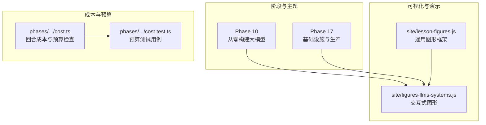
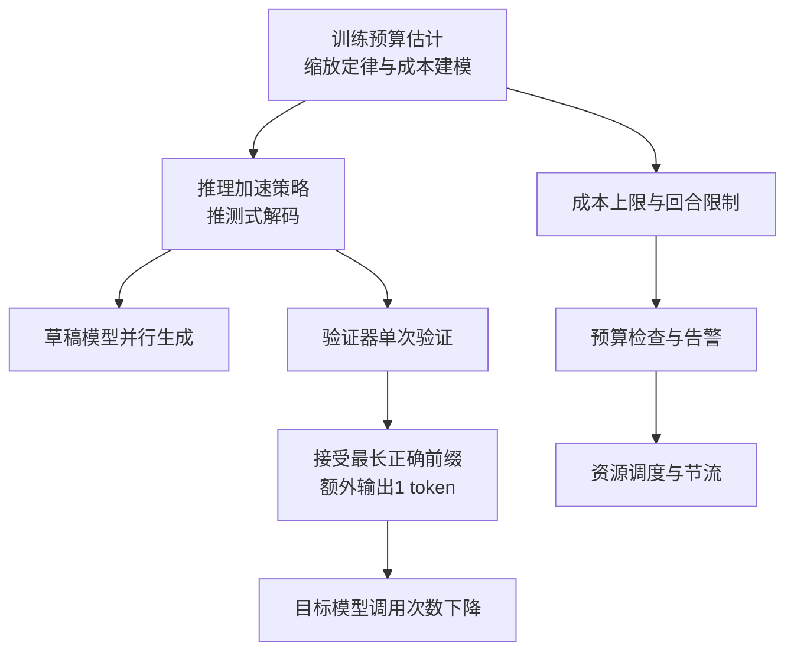
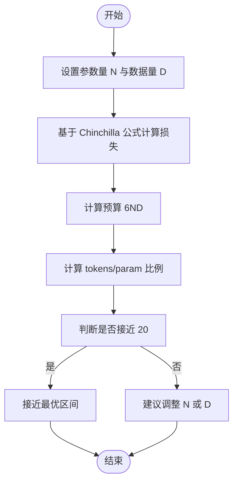
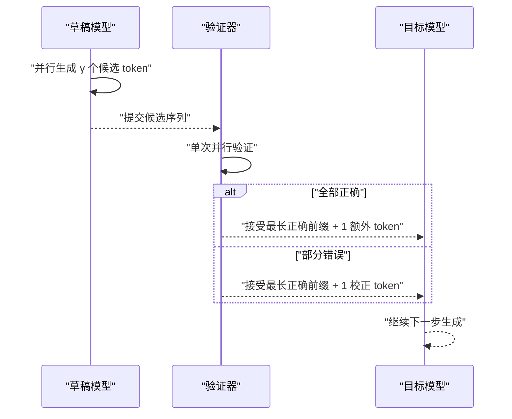
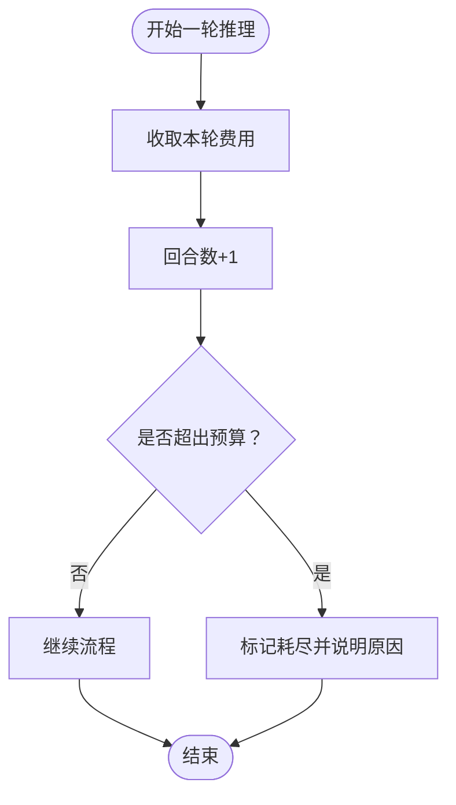
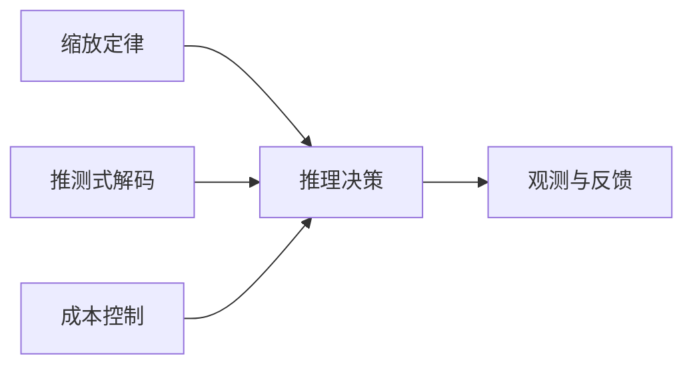

# 扩展性与推理优化

<cite>
**本文引用的文件**
- [site/figures-llms-systems.js](file://site/figures-llms-systems.js)
- [site/lesson-figures.js](file://site/lesson-figures.js)
- [phases/17-infrastructure-and-production/README.md](file://phases/17-infrastructure-and-production/README.md)
- [phases/10-llms-from-scratch/README.md](file://phases/10-llms-from-scratch/README.md)
- [phases/19-capstone-projects/09-code-migration-agent/code/ts/src/cost.ts](file://phases/19-capstone-projects/09-code-migration-agent/code/ts/src/cost.ts)
- [phases/19-capstone-projects/09-code-migration-agent/code/ts/tests/cost.test.ts](file://phases/19-capstone-projects/09-code-migration-agent/code/ts/tests/cost.test.ts)
</cite>

## 目录
1. [引言](#引言)
2. [项目结构](#项目结构)
3. [核心组件](#核心组件)
4. [架构总览](#架构总览)
5. [详细组件分析](#详细组件分析)
6. [依赖关系分析](#依赖关系分析)
7. [性能考量](#性能考量)
8. [故障排查指南](#故障排查指南)
9. [结论](#结论)
10. [附录](#附录)

## 引言
本课程围绕“扩展性与推理优化”展开，目标是帮助读者建立从数学基础到工程实践的完整知识体系：理解模型规模扩展的幂律定律（参数量、计算量与性能的关系）、掌握训练预算估计与成本效益分析方法论；深入研究推测式解码的技术原理与实现流程（草稿模型与验证器的协同机制、token 级并行生成与拒绝采样策略）；并提供面向生产的推理加速综合方案，覆盖硬件、软件与系统级优化。

## 项目结构
该仓库以“阶段化学习路径”组织内容，与本课程直接相关的核心模块包括：
- Phase 10：从零构建大模型（包含缩放定律、解码策略等）
- Phase 17：基础设施与生产（包含推理平台、成本度量、观测与优化）
- Site 图形化演示：交互式可视化工具，直观呈现关键概念（如推测式解码、缩放定律）

图表来源
- [site/figures-llms-systems.js:1-578](file://site/figures-llms-systems.js#L1-L578)
- [site/lesson-figures.js:388-419](file://site/lesson-figures.js#L388-L419)
- [phases/17-infrastructure-and-production/README.md:1-6](file://phases/17-infrastructure-and-production/README.md#L1-L6)
- [phases/10-llms-from-scratch/README.md:1-6](file://phases/10-llms-from-scratch/README.md#L1-L6)
- [phases/19-capstone-projects/09-code-migration-agent/code/ts/src/cost.ts:1-28](file://phases/19-capstone-projects/09-code-migration-agent/code/ts/src/cost.ts#L1-L28)
- [phases/19-capstone-projects/09-code-migration-agent/code/ts/tests/cost.test.ts:1-41](file://phases/19-capstone-projects/09-code-migration-agent/code/ts/tests/cost.test.ts#L1-L41)

章节来源
- [phases/10-llms-from-scratch/README.md:1-6](file://phases/10-llms-from-scratch/README.md#L1-L6)
- [phases/17-infrastructure-and-production/README.md:1-6](file://phases/17-infrastructure-and-production/README.md#L1-L6)

## 核心组件
- 缩放定律与训练预算估计：通过 Chinchilla 拟合与“每参数约 20 个 token”的经验规则，量化参数量、数据量与损失之间的关系，并据此估算计算预算与成本。
- 推测式解码：草稿模型并行生成多步候选，验证器在单次验证中接受最长正确前缀，并额外输出一个校正/奖励 token，从而显著减少目标模型调用次数。
- 成本与预算控制：以回合数与美元预算为约束，动态评估每次推理的成本消耗，避免超支并指导资源分配。

章节来源
- [site/lesson-figures.js:388-419](file://site/lesson-figures.js#L388-L419)
- [site/figures-llms-systems.js:73-120](file://site/figures-llms-systems.js#L73-L120)
- [phases/19-capstone-projects/09-code-migration-agent/code/ts/src/cost.ts:1-28](file://phases/19-capstone-projects/09-code-migration-agent/code/ts/src/cost.ts#L1-L28)

## 架构总览
下图展示了从“训练预算估计”到“推理加速”的端到端思路：先用缩放定律确定最优的参数-数据配比与计算预算，再以推测式解码降低目标模型的调用频次，最终结合成本控制与观测指标完成闭环优化。

图表来源
- [site/lesson-figures.js:388-419](file://site/lesson-figures.js#L388-L419)
- [site/figures-llms-systems.js:73-120](file://site/figures-llms-systems.js#L73-L120)
- [phases/19-capstone-projects/09-code-migration-agent/code/ts/src/cost.ts:1-28](file://phases/19-capstone-projects/09-code-migration-agent/code/ts/src/cost.ts#L1-L28)

## 详细组件分析

### 组件A：缩放定律与训练预算估计
- 数学基础：Chinchilla 拟合给出损失随参数量与数据量的变化趋势，计算预算近似为 6ND（N 为参数量，D 为 token 数），并以“tokens/param≈20”作为经验最优区间。
- 实践应用：给定固定计算预算，优先在“接近 20 tokens/param”的区域平衡 N 与 D，避免过度参数化或数据不足导致的欠拟合/过拟合。
- 可视化：通过滑动条调节参数量与数据量，实时显示损失、计算预算与比例状态，辅助做“成本-性能权衡”。

图表来源
- [site/lesson-figures.js:388-419](file://site/lesson-figures.js#L388-L419)

章节来源
- [site/lesson-figures.js:388-419](file://site/lesson-figures.js#L388-L419)

### 组件B：推测式解码（草稿-验证器协同）
- 技术原理：草稿模型并行生成 γ 个候选 token；验证器在一次并行验证中接受最长正确前缀，并额外输出一个 token（校正或奖励）。若全部 γ 个都正确，还可获得“额外 +1 token”的收益。
- 性能增益：期望接受长度 expAcc 决定了每次验证可替代的顺序目标模型步数；接受率 α 越高，expAcc 越长，整体吞吐提升越明显。
- 可视化：交互式展示 γ 与 α 对期望接受长度、全通过概率与吞吐增益的影响，直观理解“草稿长度与接受率”的权衡。

图表来源
- [site/figures-llms-systems.js:73-120](file://site/figures-llms-systems.js#L73-L120)

章节来源
- [site/figures-llms-systems.js:73-120](file://site/figures-llms-systems.js#L73-L120)

### 组件C：成本与预算控制（回合数与美元预算）
- 功能要点：每次推理按随机区间计费，累计回合数与总花费；当达到最大回合数或预算上限时返回“耗尽”并标注原因（回合/成本）。
- 应用场景：在代理或自动化流程中，对每次“思考-行动-评估”的循环进行成本控制，防止无界开销。

图表来源
- [phases/19-capstone-projects/09-code-migration-agent/code/ts/src/cost.ts:1-28](file://phases/19-capstone-projects/09-code-migration-agent/code/ts/src/cost.ts#L1-L28)
- [phases/19-capstone-projects/09-code-migration-agent/code/ts/tests/cost.test.ts:1-41](file://phases/19-capstone-projects/09-code-migration-agent/code/ts/tests/cost.test.ts#L1-L41)

章节来源
- [phases/19-capstone-projects/09-code-migration-agent/code/ts/src/cost.ts:1-28](file://phases/19-capstone-projects/09-code-migration-agent/code/ts/src/cost.ts#L1-L28)
- [phases/19-capstone-projects/09-code-migration-agent/code/ts/tests/cost.test.ts:1-41](file://phases/19-capstone-projects/09-code-migration-agent/code/ts/tests/cost.test.ts#L1-L41)

## 依赖关系分析
- 缩放定律依赖于参数量与数据量的输入，输出损失与计算预算，为后续推理策略提供“成本-性能”基线。
- 推测式解码依赖于草稿模型与验证器的协同，其性能增益由接受率与草稿长度共同决定。
- 成本控制模块独立于上述两个模块，但可作为全局策略的一部分，用于在不同策略间进行资源分配与节流。

图表来源
- [site/lesson-figures.js:388-419](file://site/lesson-figures.js#L388-L419)
- [site/figures-llms-systems.js:73-120](file://site/figures-llms-systems.js#L73-L120)
- [phases/19-capstone-projects/09-code-migration-agent/code/ts/src/cost.ts:1-28](file://phases/19-capstone-projects/09-code-migration-agent/code/ts/src/cost.ts#L1-L28)

章节来源
- [site/lesson-figures.js:388-419](file://site/lesson-figures.js#L388-L419)
- [site/figures-llms-systems.js:73-120](file://site/figures-llms-systems.js#L73-L120)
- [phases/19-capstone-projects/09-code-migration-agent/code/ts/src/cost.ts:1-28](file://phases/19-capstone-projects/09-code-migration-agent/code/ts/src/cost.ts#L1-L28)

## 性能考量
- 训练阶段：遵循“接近 20 tokens/param”的经验区间，平衡参数量与数据量，避免过度训练或欠训练带来的损失上升。
- 推理阶段：优先提升验证器的接受率（α），其次适度增加草稿长度（γ），以最大化每次验证替代的目标模型步数。
- 成本控制：设定最大回合数与预算上限，结合随机费用模型，确保长期运行的稳定性与可预测性。

## 故障排查指南
- 预算超支：检查回合数与总花费是否超过阈值，确认“原因”字段（回合/成本），必要时降低 γ 或提高 α。
- 吞吐不达预期：检查草稿模型与验证器的负载是否均衡，验证器的接受率是否偏低，考虑优化草稿模型质量或调整验证策略。
- 观测缺失：在关键节点记录请求 ID、预处理/生成/后处理阶段的信号与延迟，便于定位瓶颈与异常。

章节来源
- [phases/19-capstone-projects/09-code-migration-agent/code/ts/src/cost.ts:1-28](file://phases/19-capstone-projects/09-code-migration-agent/code/ts/src/cost.ts#L1-L28)
- [phases/19-capstone-projects/09-code-migration-agent/code/ts/tests/cost.test.ts:1-41](file://phases/19-capstone-projects/09-code-migration-agent/code/ts/tests/cost.test.ts#L1-L41)

## 结论
通过将“缩放定律”“推测式解码”与“成本控制”三者结合，可以在保证模型性能的前提下显著提升推理效率并稳定成本。实际落地时应以可视化工具辅助做“成本-性能”权衡，以预算模块保障长期运行的可控性，并以观测与告警形成闭环优化。

## 附录
- 进一步阅读建议：结合 Phase 10 与 Phase 17 的课程内容，深入理解从训练到生产的完整链路。
- 工具使用：利用 site 中的交互式图形，拖动参数观察缩放定律与推测式解码的效果变化。

章节来源
- [phases/10-llms-from-scratch/README.md:1-6](file://phases/10-llms-from-scratch/README.md#L1-L6)
- [phases/17-infrastructure-and-production/README.md:1-6](file://phases/17-infrastructure-and-production/README.md#L1-L6)