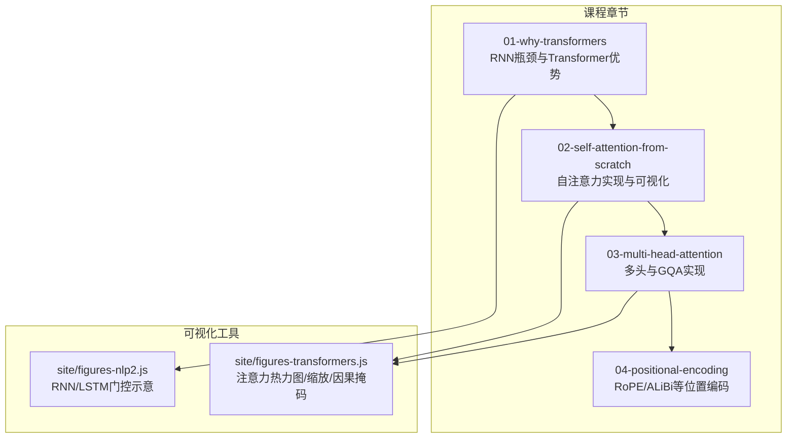
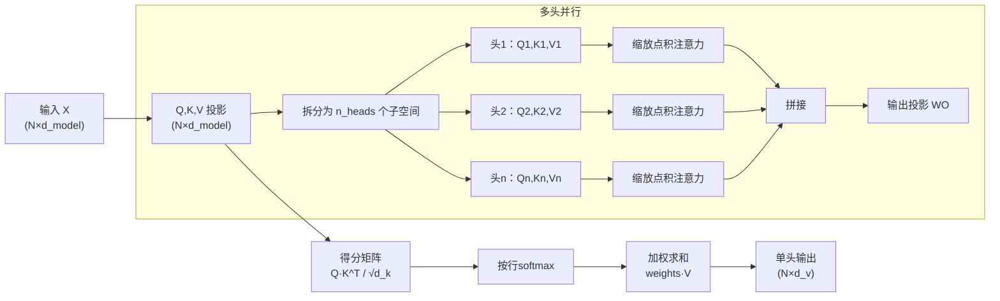
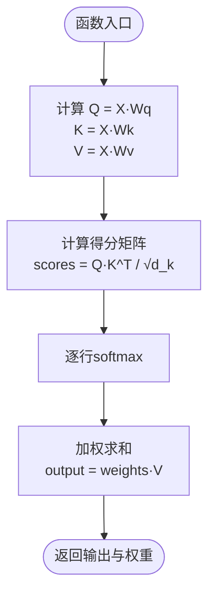
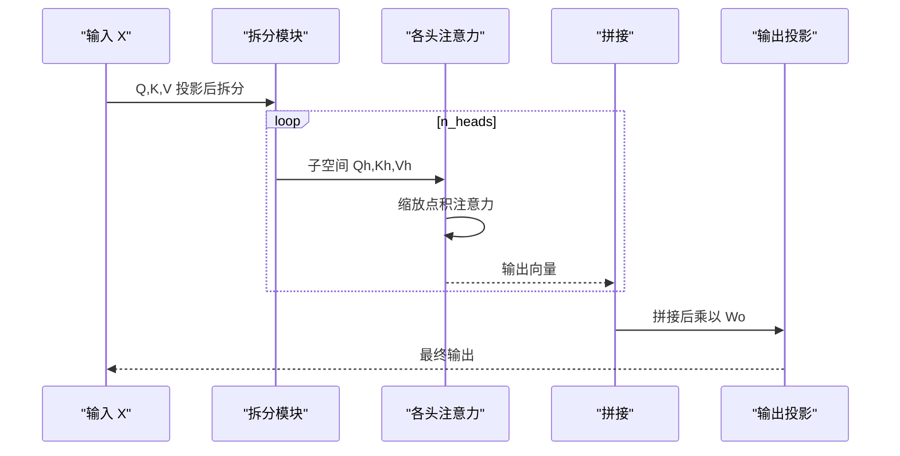
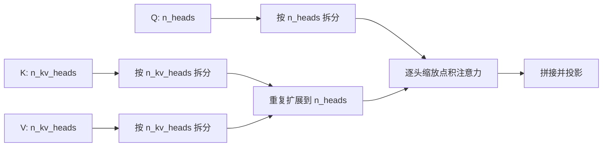
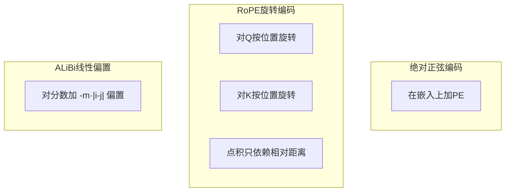
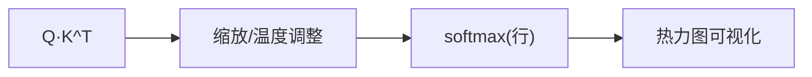
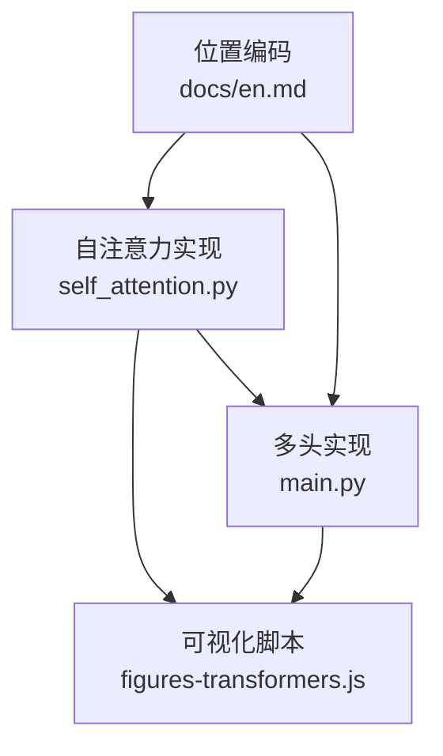

# 注意力机制基础

<cite>
**本文引用的文件**
- [phases/07-transformers-deep-dive/01-why-transformers/docs/en.md](file://phases/07-transformers-deep-dive/01-why-transformers/docs/en.md)
- [phases/07-transformers-deep-dive/02-self-attention-from-scratch/docs/en.md](file://phases/07-transformers-deep-dive/02-self-attention-from-scratch/docs/en.md)
- [phases/07-transformers-deep-dive/02-self-attention-from-scratch/code/self_attention.py](file://phases/07-transformers-deep-dive/02-self-attention-from-scratch/code/self_attention.py)
- [phases/07-transformers-deep-dive/03-multi-head-attention/docs/en.md](file://phases/07-transformers-deep-dive/03-multi-head-attention/docs/en.md)
- [phases/07-transformers-deep-dive/03-multi-head-attention/code/main.py](file://phases/07-transformers-deep-dive/03-multi-head-attention/code/main.py)
- [phases/07-transformers-deep-dive/04-positional-encoding/docs/en.md](file://phases/07-transformers-deep-dive/04-positional-encoding/docs/en.md)
- [site/figures-transformers.js](file://site/figures-transformers.js)
- [site/figures-nlp2.js](file://site/figures-nlp2.js)
</cite>

## 目录
1. 引言
2. 项目结构
3. 核心组件
4. 架构总览
5. 组件详解
6. 依赖关系分析
7. 性能考量
8. 故障排查指南
9. 结论
10. 附录

## 引言
本课程围绕“注意力机制基础”展开，系统讲解为何RNN/LSTM难以有效建模长序列依赖，以及Transformer如何以自注意力机制替代递归、实现并行计算与更强的表达能力。我们将从数学原理入手，逐步推导自注意力的Q、K、V投影、注意力分数、softmax归一化与加权求和；随后进入多头注意力，解释如何在不同表示子空间并行学习不同类型的语义关系，并给出完整可运行的实现与可视化示例。

## 项目结构
本课程内容分布在“Transformer深度解析”阶段的多个小节中，配套有文档、代码与交互式可视化图示：
- 01-why-transformers：阐述RNN/LSTM的瓶颈与Transformer的优势
- 02-self-attention-from-scratch：自注意力从零实现（含softmax、缩放点积、权重热力图）
- 03-multi-head-attention：多头注意力与分组查询注意力（GQA）的实现与可视化
- 04-positional-encoding：绝对正弦编码、RoPE旋转位置编码与ALiBi线性偏置
- site/figures-*：浏览器端交互式图示，直观展示注意力热力图、因果掩码、缩放稳定性等

**图表来源**
- [phases/07-transformers-deep-dive/01-why-transformers/docs/en.md:1-108](file://phases/07-transformers-deep-dive/01-why-transformers/docs/en.md#L1-L108)
- [phases/07-transformers-deep-dive/02-self-attention-from-scratch/docs/en.md:1-335](file://phases/07-transformers-deep-dive/02-self-attention-from-scratch/docs/en.md#L1-L335)
- [phases/07-transformers-deep-dive/03-multi-head-attention/docs/en.md:1-164](file://phases/07-transformers-deep-dive/03-multi-head-attention/docs/en.md#L1-L164)
- [phases/07-transformers-deep-dive/04-positional-encoding/docs/en.md:1-186](file://phases/07-transformers-deep-dive/04-positional-encoding/docs/en.md#L1-L186)
- [site/figures-transformers.js:1-200](file://site/figures-transformers.js#L1-L200)
- [site/figures-nlp2.js:68-147](file://site/figures-nlp2.js#L68-L147)

**章节来源**
- [phases/07-transformers-deep-dive/01-why-transformers/docs/en.md:1-108](file://phases/07-transformers-deep-dive/01-why-transformers/docs/en.md#L1-L108)
- [phases/07-transformers-deep-dive/02-self-attention-from-scratch/docs/en.md:1-335](file://phases/07-transformers-deep-dive/02-self-attention-from-scratch/docs/en.md#L1-L335)
- [phases/07-transformers-deep-dive/03-multi-head-attention/docs/en.md:1-164](file://phases/07-transformers-deep-dive/03-multi-head-attention/docs/en.md#L1-L164)
- [phases/07-transformers-deep-dive/04-positional-encoding/docs/en.md:1-186](file://phases/07-transformers-deep-dive/04-positional-encoding/docs/en.md#L1-L186)
- [site/figures-transformers.js:1-200](file://site/figures-transformers.js#L1-L200)
- [site/figures-nlp2.js:68-147](file://site/figures-nlp2.js#L68-L147)

## 核心组件
- 自注意力模块：实现缩放点积注意力、softmax归一化与加权求和，支持输出注意力权重矩阵用于可视化
- 多头注意力模块：将模型维度均分为若干子空间，每头独立计算注意力，最后拼接并通过输出投影矩阵融合
- 位置编码模块：提供绝对正弦编码、RoPE旋转位置编码与ALiBi线性偏置三种方案
- 可视化工具：交互式热力图、因果掩码、温度/缩放参数调节，帮助理解注意力分布与数值稳定性

**章节来源**
- [phases/07-transformers-deep-dive/02-self-attention-from-scratch/code/self_attention.py:10-33](file://phases/07-transformers-deep-dive/02-self-attention-from-scratch/code/self_attention.py#L10-L33)
- [phases/07-transformers-deep-dive/03-multi-head-attention/code/main.py:116-131](file://phases/07-transformers-deep-dive/03-multi-head-attention/code/main.py#L116-L131)
- [phases/07-transformers-deep-dive/04-positional-encoding/docs/en.md:28-78](file://phases/07-transformers-deep-dive/04-positional-encoding/docs/en.md#L28-L78)
- [site/figures-transformers.js:19-60](file://site/figures-transformers.js#L19-L60)

## 架构总览
下图展示了从输入到注意力输出的关键路径，以及多头注意力的拆分与合并流程。

**图表来源**
- [phases/07-transformers-deep-dive/02-self-attention-from-scratch/docs/en.md:147-168](file://phases/07-transformers-deep-dive/02-self-attention-from-scratch/docs/en.md#L147-L168)
- [phases/07-transformers-deep-dive/03-multi-head-attention/docs/en.md:45-84](file://phases/07-transformers-deep-dive/03-multi-head-attention/docs/en.md#L45-L84)
- [site/figures-transformers.js:62-101](file://site/figures-transformers.js#L62-L101)

## 组件详解

### 自注意力：数学原理与实现要点
- Q、K、V计算：每个输入向量经由学习的投影矩阵得到查询、键与值
- 注意力分数：Q与K转置相乘得到N×N的原始分数矩阵
- 缩放因子：除以sqrt(dk)，防止高维下点积过大导致softmax饱和
- 归一化：对每一行做softmax，得到注意力权重分布
- 加权求和：权重与V相乘，得到该位置的上下文向量

**图表来源**
- [phases/07-transformers-deep-dive/02-self-attention-from-scratch/code/self_attention.py:10-15](file://phases/07-transformers-deep-dive/02-self-attention-from-scratch/code/self_attention.py#L10-L15)
- [phases/07-transformers-deep-dive/02-self-attention-from-scratch/docs/en.md:170-201](file://phases/07-transformers-deep-dive/02-self-attention-from-scratch/docs/en.md#L170-L201)

**章节来源**
- [phases/07-transformers-deep-dive/02-self-attention-from-scratch/code/self_attention.py:10-33](file://phases/07-transformers-deep-dive/02-self-attention-from-scratch/code/self_attention.py#L10-L33)
- [phases/07-transformers-deep-dive/02-self-attention-from-scratch/docs/en.md:170-201](file://phases/07-transformers-deep-dive/02-self-attention-from-scratch/docs/en.md#L170-L201)

### 多头注意力：并行子空间与融合
- 拆分：将Q、K、V在模型维度上均匀切分为n_heads份，每头维度为d_head = d_model/n_heads
- 并行计算：每头独立执行缩放点积注意力，得到各自上下文向量
- 拼接与投影：将各头输出沿模型维度拼接，再乘以输出投影矩阵Wo，恢复到d_model维度

**图表来源**
- [phases/07-transformers-deep-dive/03-multi-head-attention/code/main.py:116-131](file://phases/07-transformers-deep-dive/03-multi-head-attention/code/main.py#L116-L131)
- [phases/07-transformers-deep-dive/03-multi-head-attention/docs/en.md:45-84](file://phases/07-transformers-deep-dive/03-multi-head-attention/docs/en.md#L45-L84)

**章节来源**
- [phases/07-transformers-deep-dive/03-multi-head-attention/code/main.py:116-131](file://phases/07-transformers-deep-dive/03-multi-head-attention/code/main.py#L116-L131)
- [phases/07-transformers-deep-dive/03-multi-head-attention/docs/en.md:45-84](file://phases/07-transformers-deep-dive/03-multi-head-attention/docs/en.md#L45-L84)

### 分组查询注意力（GQA）：KV缓存优化
- 核心思想：Q按n_heads拆分，K、V仅按n_kv_heads拆分并重复扩展至匹配Q的数量
- 推理时显著降低KV缓存占用：KV缓存元素数量约为全MHA的n_heads/n_kv_heads倍
- 在保持质量的同时减少内存占用，是现代大模型（如Llama系列）的主流做法

**图表来源**
- [phases/07-transformers-deep-dive/03-multi-head-attention/code/main.py:133-149](file://phases/07-transformers-deep-dive/03-multi-head-attention/code/main.py#L133-L149)
- [phases/07-transformers-deep-dive/03-multi-head-attention/docs/en.md:85-97](file://phases/07-transformers-deep-dive/03-multi-head-attention/docs/en.md#L85-L97)

**章节来源**
- [phases/07-transformers-deep-dive/03-multi-head-attention/code/main.py:133-149](file://phases/07-transformers-deep-dive/03-multi-head-attention/code/main.py#L133-L149)
- [phases/07-transformers-deep-dive/03-multi-head-attention/docs/en.md:85-97](file://phases/07-transformers-deep-dive/03-multi-head-attention/docs/en.md#L85-L97)

### 位置编码：相对/绝对/线性偏置
- 绝对正弦编码：在嵌入上叠加固定频率的sin/cos信号，简单但外推能力差
- RoPE旋转位置编码：对Q、K进行基于位置的角度旋转，使点积仅依赖相对距离，外推能力强
- ALiBi线性偏置：直接在注意力分数上加入与距离成比例的负偏置，无需额外嵌入

**图表来源**
- [phases/07-transformers-deep-dive/04-positional-encoding/docs/en.md:28-78](file://phases/07-transformers-deep-dive/04-positional-encoding/docs/en.md#L28-L78)
- [site/figures-transformers.js:103-138](file://site/figures-transformers.js#L103-L138)

**章节来源**
- [phases/07-transformers-deep-dive/04-positional-encoding/docs/en.md:28-78](file://phases/07-transformers-deep-dive/04-positional-encoding/docs/en.md#L28-L78)
- [site/figures-transformers.js:103-138](file://site/figures-transformers.js#L103-L138)

### 数值稳定性与可视化：温度与缩放
- 温度/缩放参数：通过调节温度或缩放因子控制softmax分布的尖锐程度，避免过度稀疏或过于分散
- 交互式热力图：用不同深浅的矩形单元表示注意力权重，便于观察关注焦点随参数变化

**图表来源**
- [site/figures-transformers.js:19-60](file://site/figures-transformers.js#L19-L60)
- [site/figures-transformers.js:140-184](file://site/figures-transformers.js#L140-L184)

**章节来源**
- [site/figures-transformers.js:19-60](file://site/figures-transformers.js#L19-L60)
- [site/figures-transformers.js:140-184](file://site/figures-transformers.js#L140-L184)

## 依赖关系分析
- 自注意力依赖于线性代数运算（矩阵乘法、转置、softmax），并在实现中使用NumPy或纯Python矩阵类
- 多头注意力在自注意力基础上增加拆分、并行计算与拼接投影
- 位置编码作为预处理模块插入到注意力之前，不影响注意力内部计算逻辑
- 可视化脚本与教学文档相互配合，形成“理论—实现—可视化”的闭环

**图表来源**
- [phases/07-transformers-deep-dive/02-self-attention-from-scratch/code/self_attention.py:10-33](file://phases/07-transformers-deep-dive/02-self-attention-from-scratch/code/self_attention.py#L10-L33)
- [phases/07-transformers-deep-dive/03-multi-head-attention/code/main.py:116-131](file://phases/07-transformers-deep-dive/03-multi-head-attention/code/main.py#L116-L131)
- [site/figures-transformers.js:19-60](file://site/figures-transformers.js#L19-L60)

**章节来源**
- [phases/07-transformers-deep-dive/02-self-attention-from-scratch/code/self_attention.py:10-33](file://phases/07-transformers-deep-dive/02-self-attention-from-scratch/code/self_attention.py#L10-L33)
- [phases/07-transformers-deep-dive/03-multi-head-attention/code/main.py:116-131](file://phases/07-transformers-deep-dive/03-multi-head-attention/code/main.py#L116-L131)
- [site/figures-transformers.js:19-60](file://site/figures-transformers.js#L19-L60)

## 性能考量
- 计算复杂度：单头自注意力为O(N^2·d)，其中N为序列长度，d为维度；多头并行可在硬件层面提升吞吐
- 内存开销：注意力矩阵为O(N^2)，在长上下文场景需结合滑动窗口、RoPE外推、Flash Attention等技术缓解
- 参数规模：多头不改变总参数，但带来更高的表达能力；d_head通常取64或128以平衡“小而专”的收益
- KV缓存：推理阶段K、V缓存占用与头数和序列长度相关；GQA通过减少KV头数显著降低缓存

[本节为通用性能讨论，不直接分析具体文件]

## 故障排查指南
- softmax饱和：当dk较大且未缩放时，softmax会集中在少数token上，梯度消失。可通过除以sqrt(dk)缓解
- 形状不匹配：多头拆分要求d_model能被n_heads整除；否则会出现维度错误
- KV缓存不一致：GQA中K、V的头数应与n_kv_heads一致，扩展策略需与推理阶段保持一致
- 可视化异常：热力图颜色映射依赖最大权重归一化，若权重全为0或NaN，需检查注意力分数与softmax实现

**章节来源**
- [phases/07-transformers-deep-dive/02-self-attention-from-scratch/docs/en.md:110-118](file://phases/07-transformers-deep-dive/02-self-attention-from-scratch/docs/en.md#L110-L118)
- [phases/07-transformers-deep-dive/03-multi-head-attention/docs/en.md:85-97](file://phases/07-transformers-deep-dive/03-multi-head-attention/docs/en.md#L85-L97)
- [site/figures-transformers.js:19-60](file://site/figures-transformers.js#L19-L60)

## 结论
本课程从RNN/LSTM的局限出发，系统讲解了自注意力与多头注意力的数学本质与实现细节，并通过可视化工具加深理解。掌握这些核心概念与实现，有助于进一步探索位置编码、因果掩码、KV缓存优化与更先进的注意力变体（如GQA、MLA等）。

[本节为总结性内容，不直接分析具体文件]

## 附录

### 实现清单与参考路径
- 自注意力核心函数与类定义：[self_attention.py:10-33](file://phases/07-transformers-deep-dive/02-self-attention-from-scratch/code/self_attention.py#L10-L33)
- 多头注意力主流程与GQA实现：[main.py:116-149](file://phases/07-transformers-deep-dive/03-multi-head-attention/code/main.py#L116-L149)
- 文档中的公式与流程图：[自注意力文档:147-168](file://phases/07-transformers-deep-dive/02-self-attention-from-scratch/docs/en.md#L147-L168)、[多头文档:45-84](file://phases/07-transformers-deep-dive/03-multi-head-attention/docs/en.md#L45-L84)
- 位置编码与可视化脚本：[位置编码文档:28-78](file://phases/07-transformers-deep-dive/04-positional-encoding/docs/en.md#L28-L78)、[figures-transformers.js:19-60](file://site/figures-transformers.js#L19-L60)