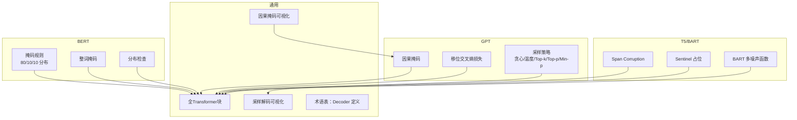
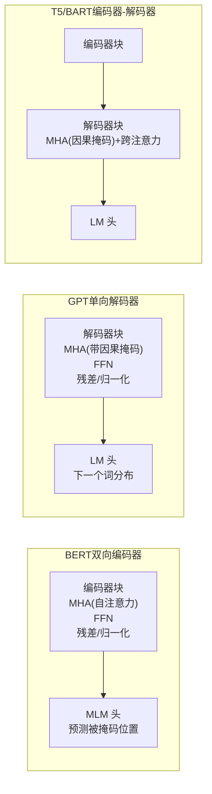
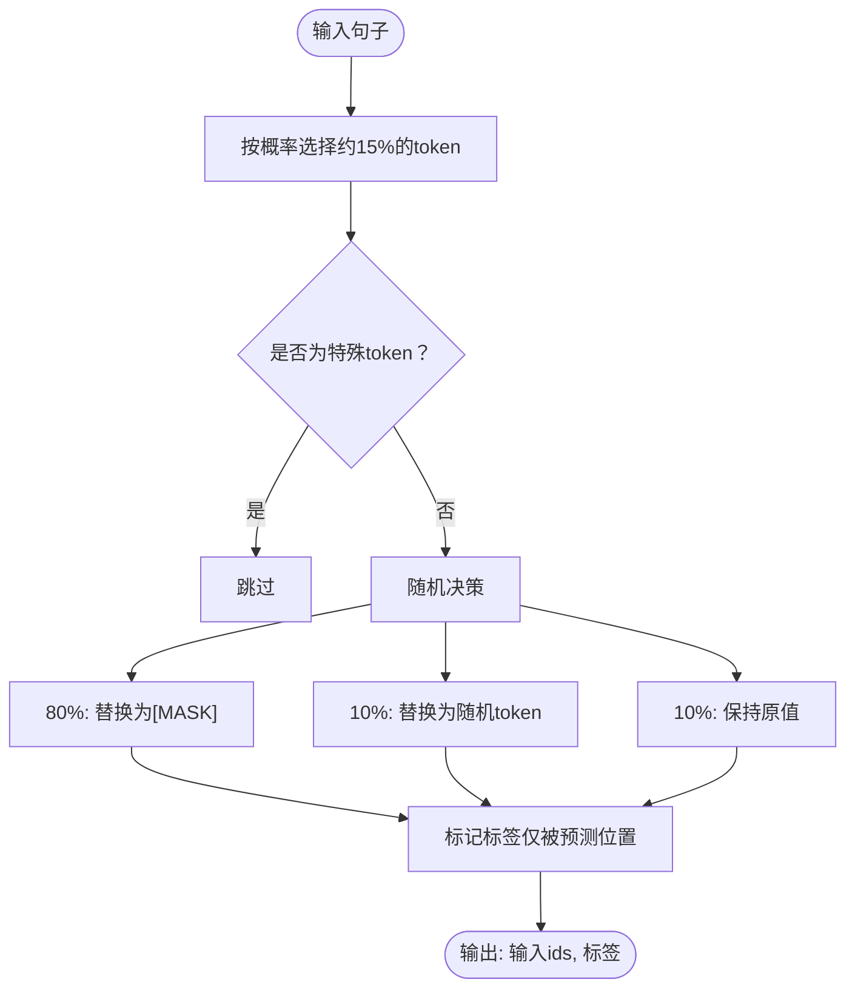
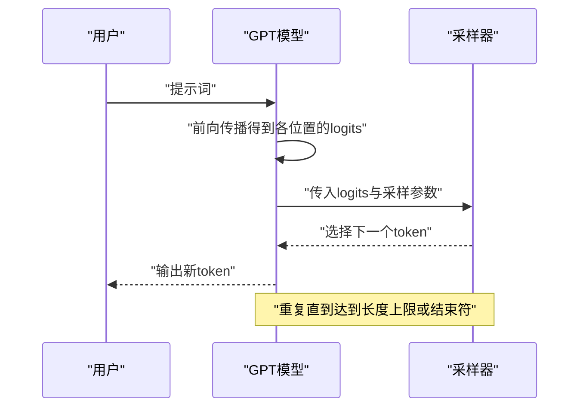
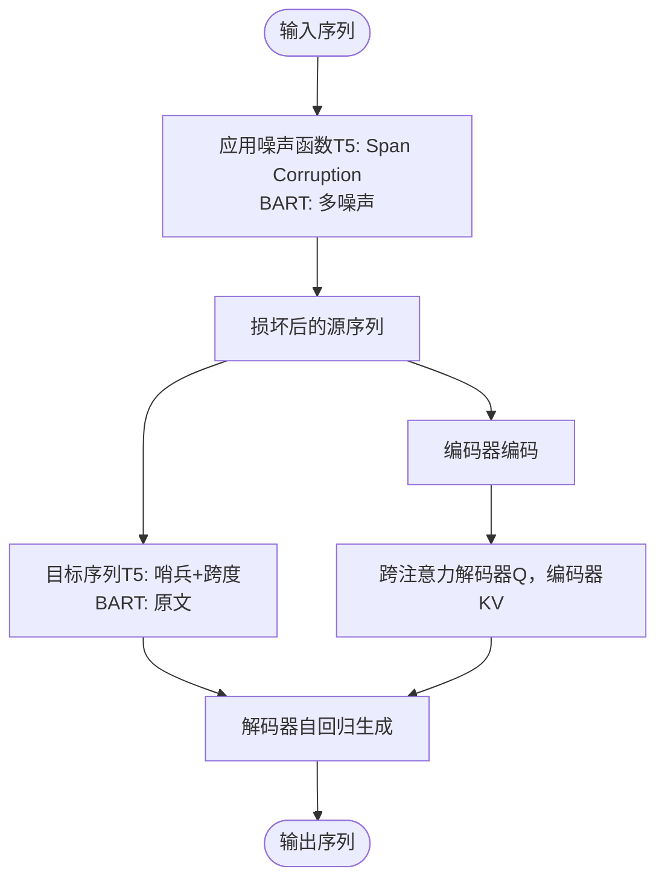
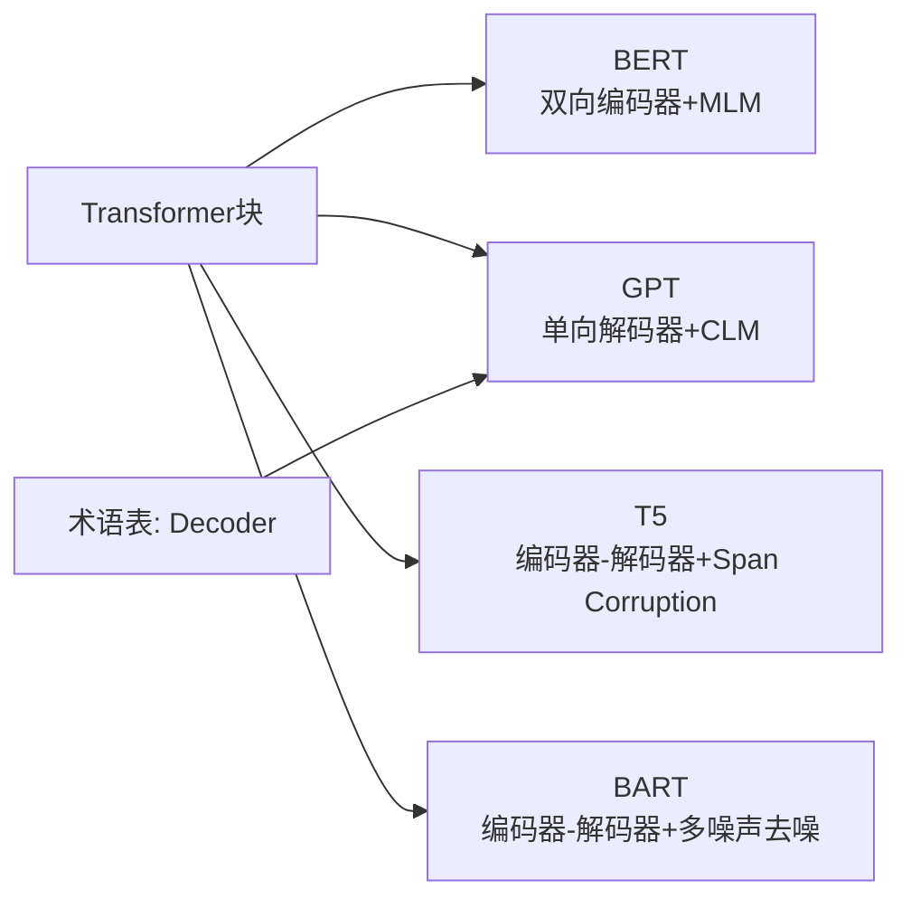

# 经典模型架构

<cite>
**本文引用的文件**
- [BERT 掩码语言建模代码](file://phases/07-transformers-deep-dive/06-bert-masked-language-modeling/code/main.py)
- [BERT 掩码语言建模文档](file://phases/07-transformers-deep-dive/06-bert-masked-language-modeling/docs/en.md)
- [GPT 因果语言建模代码](file://phases/07-transformers-deep-dive/07-gpt-causal-language-modeling/code/main.py)
- [GPT 因果语言建模文档](file://phases/07-transformers-deep-dive/07-gpt-causal-language-modeling/docs/en.md)
- [T5 与 BART 编码器-解码器代码](file://phases/07-transformers-deep-dive/08-t5-bart-encoder-decoder/code/main.py)
- [T5 与 BART 编码器-解码器文档](file://phases/07-transformers-deep-dive/08-t5-bart-encoder-decoder/docs/en.md)
- [全Transformer 架构文档](file://phases/07-transformers-deep-dive/05-full-transformer/docs/en.md)
- [LoRA 微调示例（训练）](file://train_and_test.py)
- [LoRA 微调示例（仅适配器加载）](file://finetune.py)
- [采样解码可视化脚本](file://site/lesson-figures.js)
- [因果掩码可视化脚本](file://site/figures-transformers.js)
- [术语表（含 Decoder 定义）](file://glossary/terms.md)
</cite>

## 目录
1. [引言](#引言)
2. [项目结构](#项目结构)
3. [核心组件](#核心组件)
4. [架构总览](#架构总览)
5. [详细组件分析](#详细组件分析)
6. [依赖关系分析](#依赖关系分析)
7. [性能考量](#性能考量)
8. [故障排查指南](#故障排查指南)
9. [结论](#结论)
10. [附录](#附录)

## 引言
本文件面向“经典模型架构”课程，系统梳理并讲解三类主流Transformer架构及其预训练策略与推理优化：
- BERT：双向编码器 + 掩码语言建模（MLM），解释 NSP 任务的历史与现状。
- GPT：单向解码器 + 因果语言建模（CLM），详解自回归生成与采样策略。
- T5 与 BART：文本到文本（Text-to-Text）范式下的编码器-解码器架构，对比不同预训练噪声函数。

同时，结合仓库中的教学代码与文档，给出可运行的实现要点、数据流与处理逻辑，并提供微调与推理优化的实践参考。

## 项目结构
围绕经典模型架构的教学与实现，本仓库在“Transformer 深入”阶段提供了三组核心文件：
- BERT：掩码语言建模的规则与整体流程演示
- GPT：因果掩码、损失移位与多种采样策略
- T5/BART：Span Corruption 与多噪声去噪范式

此外，还有全Transformer块的架构说明、采样与因果掩码的可视化脚本，以及术语表中对“Decoder”的定义，便于建立统一概念基础。



图示来源
- [BERT 掩码语言建模代码:18-94](file://phases/07-transformers-deep-dive/06-bert-masked-language-modeling/code/main.py#L18-L94)
- [GPT 因果语言建模代码:20-114](file://phases/07-transformers-deep-dive/07-gpt-causal-language-modeling/code/main.py#L20-L114)
- [T5 与 BART 编码器-解码器代码:14-127](file://phases/07-transformers-deep-dive/08-t5-bart-encoder-decoder/code/main.py#L14-L127)
- [全Transformer 架构文档:37-54](file://phases/07-transformers-deep-dive/05-full-transformer/docs/en.md#L37-L54)
- [采样解码可视化脚本:341-365](file://site/lesson-figures.js#L341-L365)
- [因果掩码可视化脚本:131-138](file://site/figures-transformers.js#L131-L138)
- [术语表（含 Decoder 定义）:90-92](file://glossary/terms.md#L90-L92)

章节来源
- [BERT 掩码语言建模代码:1-148](file://phases/07-transformers-deep-dive/06-bert-masked-language-modeling/code/main.py#L1-L148)
- [GPT 因果语言建模代码:1-179](file://phases/07-transformers-deep-dive/07-gpt-causal-language-modeling/code/main.py#L1-L179)
- [T5 与 BART 编码器-解码器代码:1-193](file://phases/07-transformers-deep-dive/08-t5-bart-encoder-decoder/code/main.py#L1-L193)
- [全Transformer 架构文档:1-175](file://phases/07-transformers-deep-dive/05-full-transformer/docs/en.md#L1-L175)
- [采样解码可视化脚本:341-365](file://site/lesson-figures.js#L341-L365)
- [因果掩码可视化脚本:131-138](file://site/figures-transformers.js#L131-L138)
- [术语表（含 Decoder 定义）:90-92](file://glossary/terms.md#L90-L92)

## 核心组件
- BERT 掩码语言建模（MLM）与整词掩码（Whole-Word Masking），验证 80/10/10 分布与掩码统计。
- GPT 因果掩码、移位交叉熵损失与多种采样策略（贪心、温度、Top-k、Top-p、Min-p）。
- T5 Span Corruption 与 BART 多噪声函数（Token Mask、Delete、Text Infill、Sentence Permute、Document Rotate）。
- 全Transformer块：编码器、解码器与跨注意力的骨架结构，以及现代改进（RMSNorm、SwiGLU、RoPE 等）。

章节来源
- [BERT 掩码语言建模文档:20-78](file://phases/07-transformers-deep-dive/06-bert-masked-language-modeling/docs/en.md#L20-L78)
- [GPT 因果语言建模文档:20-81](file://phases/07-transformers-deep-dive/07-gpt-causal-language-modeling/docs/en.md#L20-L81)
- [T5 与 BART 编码器-解码器文档:35-92](file://phases/07-transformers-deep-dive/08-t5-bart-encoder-decoder/docs/en.md#L35-L92)
- [全Transformer 架构文档:22-72](file://phases/07-transformers-deep-dive/05-full-transformer/docs/en.md#L22-L72)

## 架构总览
下图展示三类模型的核心差异：BERT（双向编码器）、GPT（单向解码器）、T5/BART（编码器-解码器）。



图示来源
- [全Transformer 架构文档:37-54](file://phases/07-transformers-deep-dive/05-full-transformer/docs/en.md#L37-L54)
- [BERT 掩码语言建模文档:20-36](file://phases/07-transformers-deep-dive/06-bert-masked-language-modeling/docs/en.md#L20-L36)
- [GPT 因果语言建模文档:20-52](file://phases/07-transformers-deep-dive/07-gpt-causal-language-modeling/docs/en.md#L20-L52)
- [T5 与 BART 编码器-解码器文档:39-50](file://phases/07-transformers-deep-dive/08-t5-bart-encoder-decoder/docs/en.md#L39-L50)

## 详细组件分析

### BERT：双向编码器与掩码语言建模
- 掩码策略与分布校验：随机选择 15% 的 token 进行预测，其中 80% 替换为 [MASK]，10% 替换为随机 token，10% 保持原值，以缓解分布偏移。
- 整词掩码：对子词切分的单词进行整组掩码，提升语义一致性。
- NSP（下一句预测）：BERT 原始论文包含该任务，但后续工作（如 RoBERTa）表明其收益有限甚至有害，现代编码器已普遍弃用。



图示来源
- [BERT 掩码语言建模代码:18-42](file://phases/07-transformers-deep-dive/06-bert-masked-language-modeling/code/main.py#L18-L42)
- [BERT 掩码语言建模代码:45-74](file://phases/07-transformers-deep-dive/06-bert-masked-language-modeling/code/main.py#L45-L74)
- [BERT 掩码语言建模文档:37-49](file://phases/07-transformers-deep-dive/06-bert-masked-language-modeling/docs/en.md#L37-L49)

章节来源
- [BERT 掩码语言建模代码:18-94](file://phases/07-transformers-deep-dive/06-bert-masked-language-modeling/code/main.py#L18-L94)
- [BERT 掩码语言建模文档:20-78](file://phases/07-transformers-deep-dive/06-bert-masked-language-modeling/docs/en.md#L20-L78)

### GPT：因果语言模型与自回归生成
- 因果掩码：通过在注意力分数上加负无穷实现三角掩码，确保每个位置只能看到自身及之前的上下文。
- 移位交叉熵损失：输入序列与目标序列右移一位，逐位置计算交叉熵，形成端到端并行训练。
- 采样策略：贪心、温度采样、Top-k、Top-p（核采样）、Min-p，分别用于确定性任务、创意生成与长尾控制。



图示来源
- [GPT 因果语言建模代码:20-47](file://phases/07-transformers-deep-dive/07-gpt-causal-language-modeling/code/main.py#L20-L47)
- [GPT 因果语言建模代码:50-114](file://phases/07-transformers-deep-dive/07-gpt-causal-language-modeling/code/main.py#L50-L114)
- [采样解码可视化脚本:341-365](file://site/lesson-figures.js#L341-L365)
- [因果掩码可视化脚本:131-138](file://site/figures-transformers.js#L131-L138)

章节来源
- [GPT 因果语言建模代码:20-114](file://phases/07-transformers-deep-dive/07-gpt-causal-language-modeling/code/main.py#L20-L114)
- [GPT 因果语言建模文档:20-81](file://phases/07-transformers-deep-dive/07-gpt-causal-language-modeling/docs/en.md#L20-L81)

### T5 与 BART：文本到文本转换与编码器-解码器
- T5：Span Corruption 将输入中的若干随机跨度替换为唯一哨兵占位符，解码器仅输出对应跨度内容，形成“输入→跨度”的监督信号。
- BART：多噪声去噪范式，尝试五种噪声函数（掩码、删除、文本填充、句子重排、文档旋转），解码器重建原文，信号更密集但计算更高。
- 推理：与 GPT 类似采用自回归生成，常用贪心或宽度为 4–5 的束搜索。



图示来源
- [T5 与 BART 编码器-解码器代码:14-127](file://phases/07-transformers-deep-dive/08-t5-bart-encoder-decoder/code/main.py#L14-L127)
- [T5 与 BART 编码器-解码器文档:54-76](file://phases/07-transformers-deep-dive/08-t5-bart-encoder-decoder/docs/en.md#L54-L76)

章节来源
- [T5 与 BART 编码器-解码器代码:14-127](file://phases/07-transformers-deep-dive/08-t5-bart-encoder-decoder/code/main.py#L14-L127)
- [T5 与 BART 编码器-解码器文档:35-92](file://phases/07-transformers-deep-dive/08-t5-bart-encoder-decoder/docs/en.md#L35-L92)

### 全Transformer块与现代改进
- 结构：嵌入+位置编码 → 自注意力 → 残差 → 归一化（现代倾向预归一化） → 前馈网络（现代多用 SwiGLU） → 输出。
- 解码器特有跨注意力：解码器的 Q 来自自身，K/V 来自编码器输出。
- 现代化：RMSNorm、RoPE、GQA/MLA、无偏置线性层等。

```mermaid
classDiagram
class 编码器块 {
"+LN"
"+MHA(自注意力)"
"+残差"
"+FFN"
"+输出"
}
class 解码器块 {
"+LN"
"+MHA(因果掩码)"
"+残差"
"+跨注意力(Q来自解码器,KV来自编码器)"
"+残差"
"+FFN"
"+输出"
}
编码器块 <.. 解码器块 : "共享FFN/归一化模式"
```

图示来源
- [全Transformer 架构文档:37-54](file://phases/07-transformers-deep-dive/05-full-transformer/docs/en.md#L37-L54)

章节来源
- [全Transformer 架构文档:22-72](file://phases/07-transformers-deep-dive/05-full-transformer/docs/en.md#L22-L72)

## 依赖关系分析
- BERT 与 GPT、T5/BART 共享相同的Transformer块骨架，差异主要体现在：
  - 注意力掩码：BERT 无掩码，GPT 使用因果掩码，T5/BART 解码器使用因果掩码且引入跨注意力。
  - 预训练目标：BERT 为 MLM，GPT 为 CLM，T5 为 Span Corruption，BART 为多噪声去噪。
- 术语层面，“Decoder”在术语表中明确定义为“使用因果掩码自注意力的输出部分”，与 GPT 的单向解码器一致。



图示来源
- [全Transformer 架构文档:37-54](file://phases/07-transformers-deep-dive/05-full-transformer/docs/en.md#L37-L54)
- [术语表（含 Decoder 定义）:90-92](file://glossary/terms.md#L90-L92)

章节来源
- [术语表（含 Decoder 定义）:90-92](file://glossary/terms.md#L90-L92)

## 性能考量
- 训练并行性：GPT 的移位损失允许对整个序列并行计算 N 个位置的损失，适合大规模数据并行。
- 推理延迟：自回归生成导致推理深度与输出长度成正比，KV 缓存、Speculative Decoding 等技术可显著降低时延。
- 现代化堆栈：RMSNorm、SwiGLU、RoPE、GQA/MLA 等可提升稳定性与效率，减少参数量与计算开销。
- 采样策略：Top-p（核采样）与 Min-p 在多样性与稳定性之间取得平衡，是 2026 广泛采用的默认策略之一。

## 故障排查指南
- 掩码分布异常（BERT）：若 15% 或 80/10/10 不符合预期，检查掩码决策分支与特殊 token 跳过逻辑。
- 因果掩码失效（GPT）：确认在 softmax 前正确叠加负无穷掩码，且行和应为合法概率分布。
- 采样结果过于保守或发散：调整温度与 Top-p/Top-k 参数，必要时启用 Min-p 控制长尾。
- T5 Span Corruption 重建失败：检查哨兵占位与目标拼接顺序，确保 round-trip 可逆。
- BART 多噪声函数组合：注意不同噪声的组合顺序与副作用，优先选择文本填充+句子重排的组合。

章节来源
- [BERT 掩码语言建模代码:18-94](file://phases/07-transformers-deep-dive/06-bert-masked-language-modeling/code/main.py#L18-L94)
- [GPT 因果语言建模代码:20-114](file://phases/07-transformers-deep-dive/07-gpt-causal-language-modeling/code/main.py#L20-L114)
- [T5 与 BART 编码器-解码器代码:14-127](file://phases/07-transformers-deep-dive/08-t5-bart-encoder-decoder/code/main.py#L14-L127)

## 结论
- BERT 通过双向编码与 MLM 实现强大的上下文理解，适用于分类、检索与抽取等任务；NSP 已不再作为标准预训练信号。
- GPT 以因果掩码与 CLM 实现高效并行训练与稳定自回归生成，采样策略直接影响生成质量与多样性。
- T5/BART 将多样任务统一为“文本到文本”范式，Span Corruption 与多噪声去噪分别在信号效率与重建强度上取得平衡。
- 现代Transformer 块在归一化、激活与位置编码等方面持续演进，带来更好的稳定性与效率。

## 附录
- 微调与推理优化参考
  - LoRA 微调：在解码器型模型上注入低秩适配器，仅训练少量参数即可获得良好效果。
  - 推理优化：KV 缓存、连续批处理、Speculative Decoding 等技术可显著降低推理时延。
  - 采样策略：根据任务特性选择合适的温度、Top-p/Top-k 与 Min-p 设置。

章节来源
- [LoRA 微调示例（训练）:10-78](file://train_and_test.py#L10-L78)
- [LoRA 微调示例（仅适配器加载）:1-67](file://finetune.py#L1-L67)
- [GPT 因果语言建模文档:54-67](file://phases/07-transformers-deep-dive/07-gpt-causal-language-modeling/docs/en.md#L54-L67)