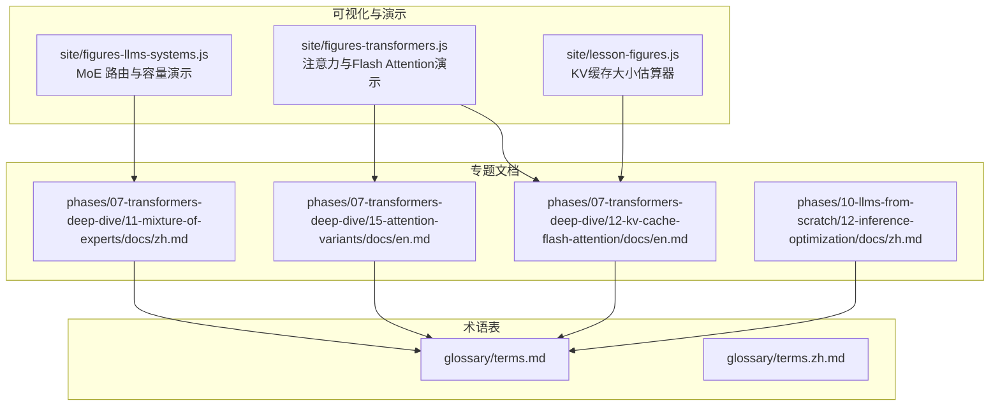
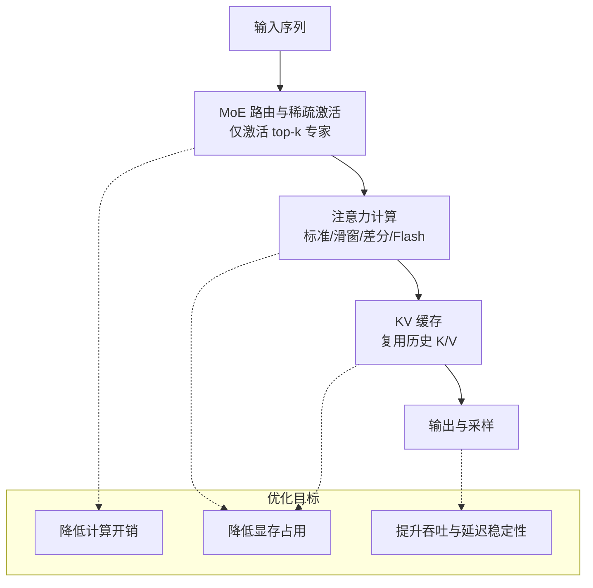
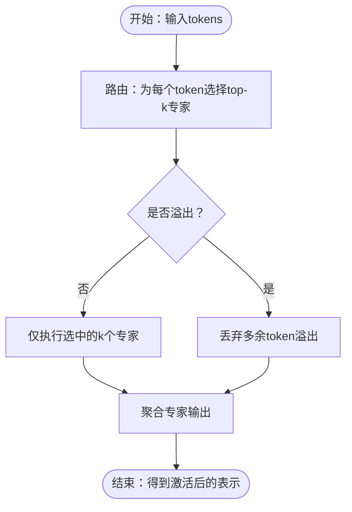
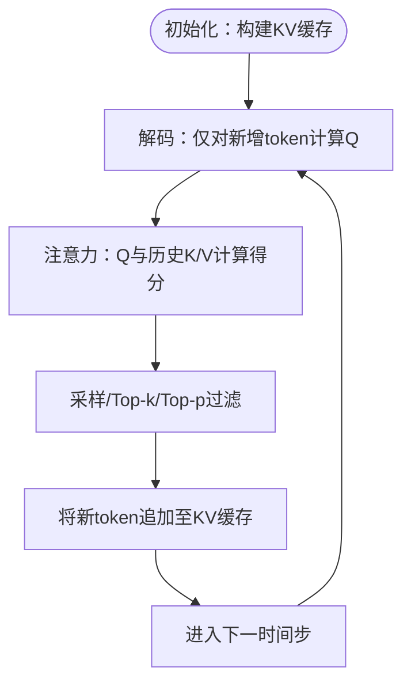
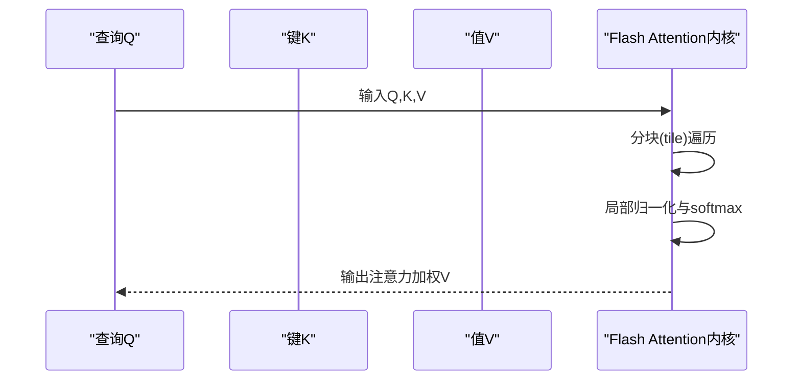
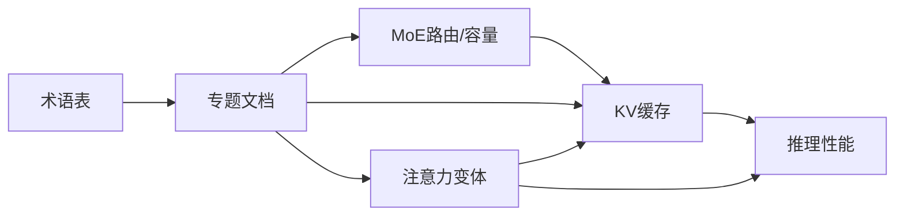

# 高级技术与优化

<cite>
**本文引用的文件**
- [site/figures-llms-systems.js](file://site/figures-llms-systems.js)
- [site/figures-transformers.js](file://site/figures-transformers.js)
- [site/lesson-figures.js](file://site/lesson-figures.js)
- [phases/07-transformers-deep-dive/11-mixture-of-experts/docs/zh.md](file://phases/07-transformers-deep-dive/11-mixture-of-experts/docs/zh.md)
- [phases/07-transformers-deep-dive/12-kv-cache-flash-attention/docs/en.md](file://phases/07-transformers-deep-dive/12-kv-cache-flash-attention/docs/en.md)
- [phases/07-transformers-deep-dive/15-attention-variants/docs/en.md](file://phases/07-transformers-deep-dive/15-attention-variants/docs/en.md)
- [phases/10-llms-from-scratch/12-inference-optimization/docs/zh.md](file://phases/10-llms-from-scratch/12-inference-optimization/docs/zh.md)
- [glossary/terms.md](file://glossary/terms.md)
- [glossary/terms.zh.md](file://glossary/terms.zh.md)
</cite>

## 目录
1. 引言
2. 项目结构
3. 核心组件
4. 架构总览
5. 详细组件分析
6. 依赖分析
7. 性能考量
8. 故障排查指南
9. 结论
10. 附录

## 引言
本课程面向“高级技术与优化”，围绕以下主题展开系统化讲解与实操：
- Mixture of Experts（MoE）的稀疏专家激活机制：路由策略、负载均衡与容量控制
- KV缓存的推理优化：如何降低重复计算与显存占用
- 注意力变体：稀疏注意力、滑动窗口注意力、差分注意力等高效实现
- Flash Attention等内存高效注意力计算：在长上下文场景下的应用价值
- 性能优化最佳实践与基准测试方法

本课程配套有丰富的可视化演示与交互式教学材料，便于从直观到抽象逐步掌握。

## 项目结构
本仓库包含多阶段课程内容与配套可视化脚本。与本课程目标直接相关的模块如下：
- 可视化与演示：site/figures-llms-systems.js、site/figures-transformers.js、site/lesson-figures.js
- 专题文档：phases/07-transformers-deep-dive/11-mixture-of-experts/docs/zh.md、phases/07-transformers-deep-dive/12-kv-cache-flash-attention/docs/en.md、phases/07-transformers-deep-dive/15-attention-variants/docs/en.md、phases/10-llms-from-scratch/12-inference-optimization/docs/zh.md
- 术语表：glossary/terms.md、glossary/terms.zh.md

**图示来源**
- [site/figures-llms-systems.js:122-186](file://site/figures-llms-systems.js#L122-L186)
- [site/figures-transformers.js:406-458](file://site/figures-transformers.js#L406-L458)
- [site/lesson-figures.js:96-144](file://site/lesson-figures.js#L96-L144)
- [phases/07-transformers-deep-dive/11-mixture-of-experts/docs/zh.md](file://phases/07-transformers-deep-dive/11-mixture-of-experts/docs/zh.md)
- [phases/07-transformers-deep-dive/12-kv-cache-flash-attention/docs/en.md](file://phases/07-transformers-deep-dive/12-kv-cache-flash-attention/docs/en.md)
- [phases/07-transformers-deep-dive/15-attention-variants/docs/en.md](file://phases/07-transformers-deep-dive/15-attention-variants/docs/en.md)
- [phases/10-llms-from-scratch/12-inference-optimization/docs/zh.md](file://phases/10-llms-from-scratch/12-inference-optimization/docs/zh.md)
- [glossary/terms.md](file://glossary/terms.md)
- [glossary/terms.zh.md](file://glossary/terms.zh.md)

**章节来源**
- [site/figures-llms-systems.js:122-186](file://site/figures-llms-systems.js#L122-L186)
- [site/figures-transformers.js:406-458](file://site/figures-transformers.js#L406-L458)
- [site/lesson-figures.js:96-144](file://site/lesson-figures.js#L96-L144)
- [phases/07-transformers-deep-dive/11-mixture-of-experts/docs/zh.md](file://phases/07-transformers-deep-dive/11-mixture-of-experts/docs/zh.md)
- [phases/07-transformers-deep-dive/12-kv-cache-flash-attention/docs/en.md](file://phases/07-transformers-deep-dive/12-kv-cache-flash-attention/docs/en.md)
- [phases/07-transformers-deep-dive/15-attention-variants/docs/en.md](file://phases/07-transformers-deep-dive/15-attention-variants/docs/en.md)
- [phases/10-llms-from-scratch/12-inference-optimization/docs/zh.md](file://phases/10-llms-from-scratch/12-inference-optimization/docs/zh.md)
- [glossary/terms.md](file://glossary/terms.md)
- [glossary/terms.zh.md](file://glossary/terms.zh.md)

## 核心组件
- MoE稀疏激活与路由：通过可视化演示展示“每token仅激活k/E专家”的工作原理，并说明负载均衡的重要性
- KV缓存与推理优化：通过交互式KV缓存计算器估算显存占用，理解序列长度、头数、维度与数据类型对显存的影响
- 注意力变体：标准注意力、滑动窗口注意力、差分注意力等；重点讲解Flash Attention的内存高效计算思想
- 推理优化综合实践：结合MoE、KV缓存与注意力变体，给出端到端的优化策略与基准测试建议

**章节来源**
- [site/figures-llms-systems.js:122-186](file://site/figures-llms-systems.js#L122-L186)
- [site/lesson-figures.js:96-144](file://site/lesson-figures.js#L96-L144)
- [site/figures-transformers.js:406-458](file://site/figures-transformers.js#L406-L458)
- [phases/07-transformers-deep-dive/11-mixture-of-experts/docs/zh.md](file://phases/07-transformers-deep-dive/11-mixture-of-experts/docs/zh.md)
- [phases/07-transformers-deep-dive/12-kv-cache-flash-attention/docs/en.md](file://phases/07-transformers-deep-dive/12-kv-cache-flash-attention/docs/en.md)
- [phases/07-transformers-deep-dive/15-attention-variants/docs/en.md](file://phases/07-transformers-deep-dive/15-attention-variants/docs/en.md)
- [phases/10-llms-from-scratch/12-inference-optimization/docs/zh.md](file://phases/10-llms-from-scratch/12-inference-optimization/docs/zh.md)

## 架构总览
下图展示了MoE、KV缓存与注意力优化三者在推理链路中的协同关系：MoE通过稀疏激活降低计算；KV缓存复用历史键值避免重复计算；注意力变体（尤其是Flash Attention）在长上下文下显著降低内存压力。

**图示来源**
- [site/figures-llms-systems.js:122-186](file://site/figures-llms-systems.js#L122-L186)
- [site/lesson-figures.js:96-144](file://site/lesson-figures.js#L96-L144)
- [site/figures-transformers.js:406-458](file://site/figures-transformers.js#L406-L458)

## 详细组件分析

### 组件A：Mixture of Experts（MoE）稀疏专家激活
- 路由策略：每token选择top-k专家，k远小于专家总数E，从而实现“仅激活少量参数”的稀疏激活
- 计算与参数分离：总参数量不变，但活跃计算比例为k/E；当路由不均衡时，部分专家过载，需引入负载均衡损失
- 容量控制：每个专家固定容量槽位，容量因子过高会闲置，过低会丢弃溢出token，需调优以平衡二者

**图示来源**
- [site/figures-llms-systems.js:122-186](file://site/figures-llms-systems.js#L122-L186)
- [site/figures-llms-systems.js:320-331](file://site/figures-llms-systems.js#L320-L331)

**章节来源**
- [site/figures-llms-systems.js:122-186](file://site/figures-llms-systems.js#L122-L186)
- [site/figures-llms-systems.js:320-331](file://site/figures-llms-systems.js#L320-L331)
- [phases/07-transformers-deep-dive/11-mixture-of-experts/docs/zh.md](file://phases/07-transformers-deep-dive/11-mixture-of-experts/docs/zh.md)

### 组件B：KV缓存与推理优化
- KV缓存的作用：保存历史token的Key与Value，解码阶段无需重算，显著降低重复计算与显存写放大
- 显存估算公式：与层数、kv头数、头维、序列长度、批量大小、数据类型成正比
- 优化要点：长上下文+高batch是显存瓶颈的主要来源；可通过降低head-dim、使用更低精度、GQA、KV缓存复用等手段缓解

**图示来源**
- [site/lesson-figures.js:96-144](file://site/lesson-figures.js#L96-L144)

**章节来源**
- [site/lesson-figures.js:96-144](file://site/lesson-figures.js#L96-L144)
- [phases/07-transformers-deep-dive/12-kv-cache-flash-attention/docs/en.md](file://phases/07-transformers-deep-dive/12-kv-cache-flash-attention/docs/en.md)

### 组件C：注意力变体与高效实现
- 标准注意力：显存O(N^2)，在长上下文下很快成为瓶颈
- 滑动窗口注意力：仅关注近邻范围，将显存降至O(N·W)，适合长上下文且强调局部依赖的任务
- 差分注意力：两套softmax相减，抑制公共噪声，突出真实信号峰值，提高判别性
- Flash Attention：按块（tile）计算，不显式存储N×N分数矩阵，显存降为O(N)，在长上下文下收益巨大

**图示来源**
- [site/figures-transformers.js:406-458](file://site/figures-transformers.js#L406-L458)
- [site/figures-transformers.js:333-427](file://site/figures-transformers.js#L333-L427)

**章节来源**
- [site/figures-transformers.js:406-458](file://site/figures-transformers.js#L406-L458)
- [site/figures-transformers.js:333-427](file://site/figures-transformers.js#L333-L427)
- [phases/07-transformers-deep-dive/15-attention-variants/docs/en.md](file://phases/07-transformers-deep-dive/15-attention-variants/docs/en.md)

### 组件D：综合优化与推理管线
- 端到端优化路径：MoE稀疏激活 → KV缓存复用 → 注意力变体（优先Flash Attention） → 量化/混合精度 → 批量与序列长度调参
- 基准测试建议：固定任务、统一prompt长度、覆盖不同batch与context长度，记录吞吐、P50/P95延迟与显存占用
- 术语与概念：混合精度、MoE、MCP等关键术语有助于准确沟通与复现

**章节来源**
- [phases/10-llms-from-scratch/12-inference-optimization/docs/zh.md](file://phases/10-llms-from-scratch/12-inference-optimization/docs/zh.md)
- [glossary/terms.md](file://glossary/terms.md)
- [glossary/terms.zh.md](file://glossary/terms.zh.md)

## 依赖分析
- 可视化脚本依赖于浏览器DOM与SVG绘制，用于直观呈现MoE路由、KV缓存显存估算与注意力内存曲线
- 文档模块之间存在概念依赖：MoE路由与容量控制为推理优化奠定基础；KV缓存与注意力变体共同决定显存与吞吐
- 术语表为所有组件提供统一的概念定义，确保跨模块一致性

**图示来源**
- [site/figures-llms-systems.js:122-186](file://site/figures-llms-systems.js#L122-L186)
- [site/lesson-figures.js:96-144](file://site/lesson-figures.js#L96-L144)
- [site/figures-transformers.js:406-458](file://site/figures-transformers.js#L406-L458)
- [phases/07-transformers-deep-dive/11-mixture-of-experts/docs/zh.md](file://phases/07-transformers-deep-dive/11-mixture-of-experts/docs/zh.md)
- [phases/07-transformers-deep-dive/12-kv-cache-flash-attention/docs/en.md](file://phases/07-transformers-deep-dive/12-kv-cache-flash-attention/docs/en.md)
- [phases/07-transformers-deep-dive/15-attention-variants/docs/en.md](file://phases/07-transformers-deep-dive/15-attention-variants/docs/en.md)
- [phases/10-llms-from-scratch/12-inference-optimization/docs/zh.md](file://phases/10-llms-from-scratch/12-inference-optimization/docs/zh.md)
- [glossary/terms.md](file://glossary/terms.md)
- [glossary/terms.zh.md](file://glossary/terms.zh.md)

**章节来源**
- [site/figures-llms-systems.js:122-186](file://site/figures-llms-systems.js#L122-L186)
- [site/lesson-figures.js:96-144](file://site/lesson-figures.js#L96-L144)
- [site/figures-transformers.js:406-458](file://site/figures-transformers.js#L406-L458)
- [phases/07-transformers-deep-dive/11-mixture-of-experts/docs/zh.md](file://phases/07-transformers-deep-dive/11-mixture-of-experts/docs/zh.md)
- [phases/07-transformers-deep-dive/12-kv-cache-flash-attention/docs/en.md](file://phases/07-transformers-deep-dive/12-kv-cache-flash-attention/docs/en.md)
- [phases/07-transformers-deep-dive/15-attention-variants/docs/en.md](file://phases/07-transformers-deep-dive/15-attention-variants/docs/en.md)
- [phases/10-llms-from-scratch/12-inference-optimization/docs/zh.md](file://phases/10-llms-from-scratch/12-inference-optimization/docs/zh.md)
- [glossary/terms.md](file://glossary/terms.md)
- [glossary/terms.zh.md](file://glossary/terms.zh.md)

## 性能考量
- 显存与带宽：Roofline模型指出算术强度（FLOPs/Byte）决定是内存受限还是计算受限，应通过重用与算法优化提升AI
- 注意力内存复杂度：标准注意力O(N^2)，Flash Attention O(N)，在长上下文场景下差异显著
- KV缓存与序列长度：KV缓存与序列长度线性相关，长上下文+高batch是显存瓶颈主因
- 采样策略：温度、Top-k、Top-p三段式过滤影响生成质量与速度，需结合任务调参

**章节来源**
- [site/figures-transformers.js:406-458](file://site/figures-transformers.js#L406-L458)
- [site/lesson-figures.js:96-144](file://site/lesson-figures.js#L96-L144)
- [site/figures-frontier.js:391-428](file://site/figures-frontier.js#L391-L428)
- [site/lesson-figures.js:382-386](file://site/lesson-figures.js#L382-L386)

## 故障排查指南
- NaN与梯度爆炸：注意检查学习率、归一化与数值稳定性，避免除零与log(0)
- 显存不足：优先降低序列长度或batch，启用KV缓存与更低精度；评估是否需要拆分注意力或采用稀疏注意力
- 路由不平衡：增大top-k或引入负载均衡损失，避免少数专家过载
- 采样退化：调整温度与Top-k/Top-p阈值，必要时加入核采样或约束解码

**章节来源**
- [glossary/terms.md:214-230](file://glossary/terms.md#L214-L230)
- [glossary/terms.zh.md:214-240](file://glossary/terms.zh.md#L214-L240)

## 结论
本课程通过可视化与专题文档相结合的方式，系统阐述了MoE稀疏激活、KV缓存推理优化与注意力变体（尤其是Flash Attention）在大规模模型中的应用价值。结合性能建模与基准测试方法，可形成从理论到实践的闭环优化路径。

## 附录
- 关键术语速查：混合精度、MoE、MCP、Roofline、Flash Attention、滑动窗口注意力、差分注意力
- 实践清单：调优MoE容量因子、启用KV缓存、切换Flash Attention、评估不同注意力变体、建立基准测试流程