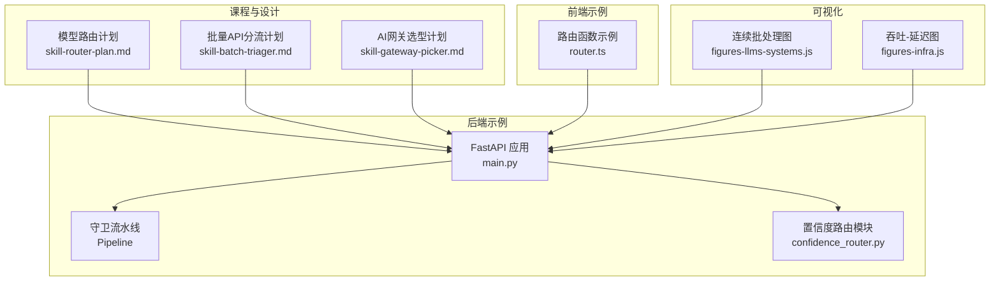
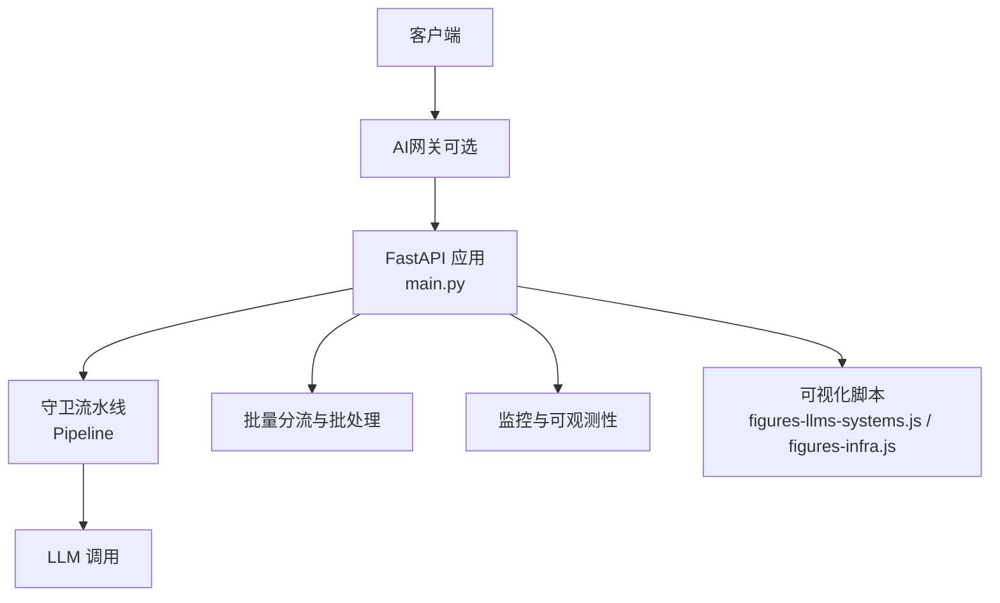
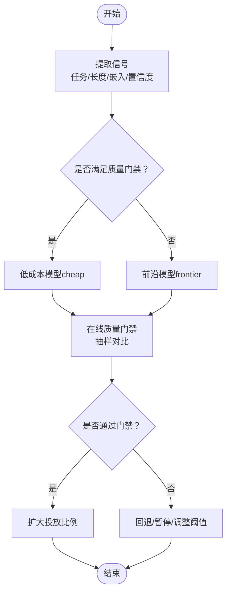
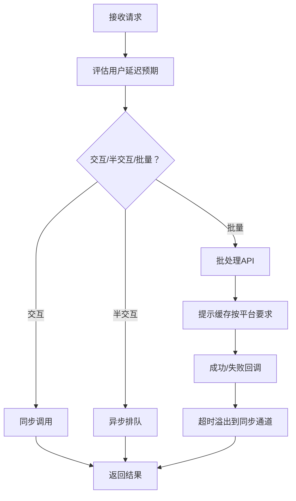
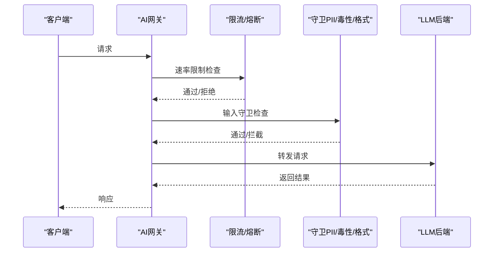
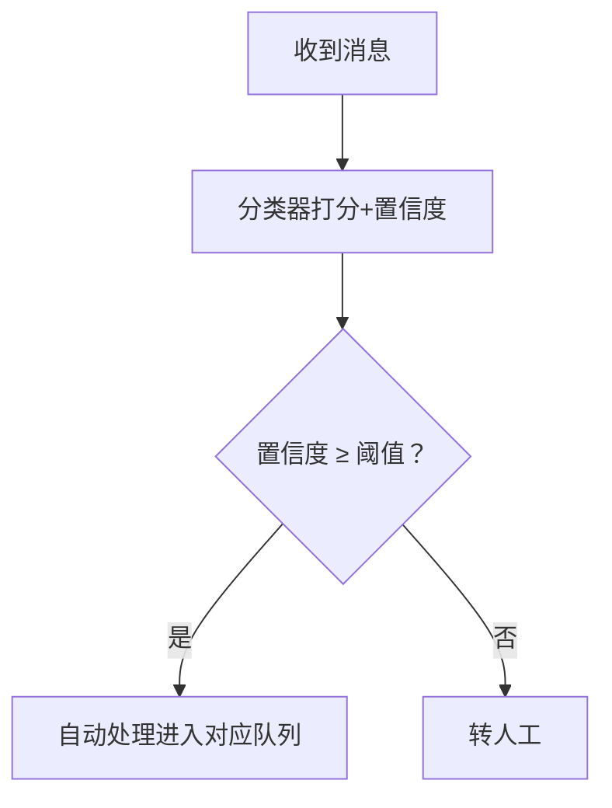
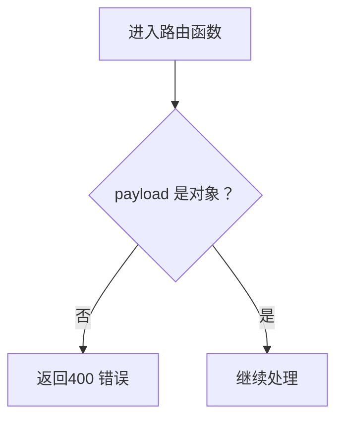
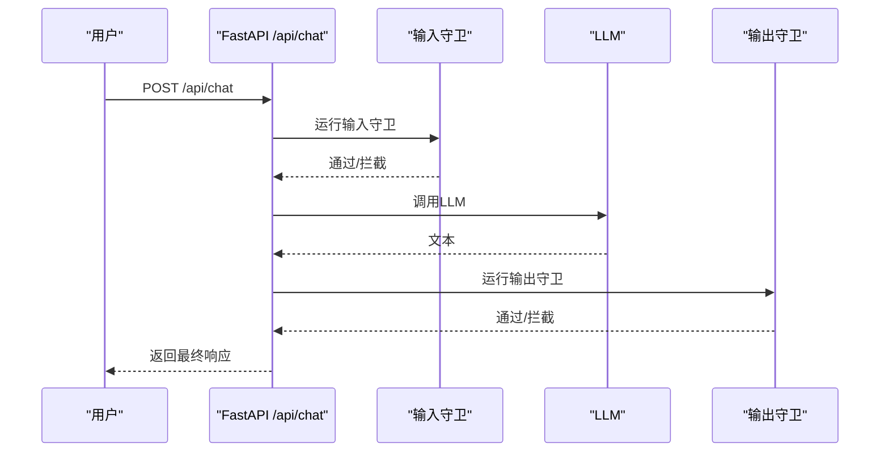
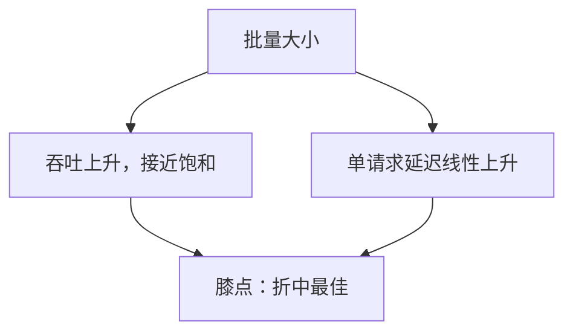
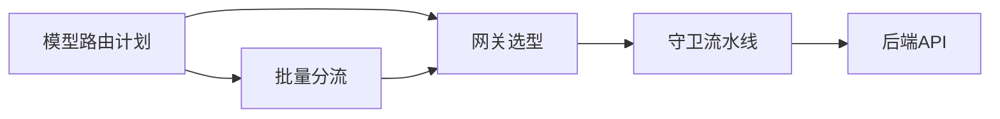

# API路由与批量处理

<cite>
**本文引用的文件**
- [test_api.py](file://test_api.py)
- [main.py](file://guardrails-sandbox/backend/main.py)
- [confidence_router.py](file://guardrails-sandbox/backend/playground/modules/confidence_router.py)
- [router.ts](file://phases/19-capstone-projects/16-github-issue-to-pr-agent/code/ts/src/router.ts)
- [skill-router-plan.md](file://phases/17-infrastructure-and-production/16-model-routing/outputs/skill-router-plan.md)
- [skill-batch-triager.md](file://phases/17-infrastructure-and-production/15-batch-apis/outputs/skill-batch-triager.md)
- [skill-gateway-picker.md](file://phases/17-infrastructure-and-production/19-ai-gateways/outputs/skill-gateway-picker.md)
- [figures-llms-systems.js](file://site/figures-llms-systems.js)
- [figures-infra.js](file://site/figures-infra.js)
</cite>

## 目录
1. [引言](#引言)
2. [项目结构](#项目结构)
3. [核心组件](#核心组件)
4. [架构总览](#架构总览)
5. [详细组件分析](#详细组件分析)
6. [依赖关系分析](#依赖关系分析)
7. [性能考量](#性能考量)
8. [故障排查指南](#故障排查指南)
9. [结论](#结论)
10. [附录](#附录)

## 引言
本文件面向“API路由与批量处理”主题，结合仓库中的课程材料与示例代码，系统阐述以下内容：
- API路由的实现原理：请求分发、负载均衡、熔断降级、质量门禁与灰度发布策略
- 模型路由策略：预路由、级联路由、集成路由、信号选择（任务类型、长度、嵌入相似度、置信度）、成本与性能权衡
- 批量API设计与实现：工作负载分流、请求合并、异步批处理、结果聚合与可观测性
- 网关与流量管理：AI网关选型、限流策略、守卫（Guardrails）、可观测性与迁移路径
- 高并发下的稳定性保障与性能优化建议，并提供可操作的配置与监控指标

## 项目结构
围绕API路由与批量处理的相关资源分布在以下位置：
- 课程计划与设计文档：模型路由、批量API、AI网关等
- 示例后端：FastAPI服务、守卫流水线、置信度路由模块
- 前端路由示例：TypeScript路由函数
- 可视化脚本：连续批处理、吞吐-延迟曲线等

**图表来源**
- [skill-router-plan.md](file://phases/17-infrastructure-and-production/16-model-routing/outputs/skill-router-plan.md)
- [skill-batch-triager.md](file://phases/17-infrastructure-and-production/15-batch-apis/outputs/skill-batch-triager.md)
- [skill-gateway-picker.md](file://phases/17-infrastructure-and-production/19-ai-gateways/outputs/skill-gateway-picker.md)
- [main.py](file://guardrails-sandbox/backend/main.py)
- [confidence_router.py](file://guardrails-sandbox/backend/playground/modules/confidence_router.py)
- [router.ts](file://phases/19-capstone-projects/16-github-issue-to-pr-agent/code/ts/src/router.ts)
- [figures-llms-systems.js](file://site/figures-llms-systems.js)
- [figures-infra.js](file://site/figures-infra.js)

**章节来源**
- [skill-router-plan.md](file://phases/17-infrastructure-and-production/16-model-routing/outputs/skill-router-plan.md)
- [skill-batch-triager.md](file://phases/17-infrastructure-and-production/15-batch-apis/outputs/skill-batch-triager.md)
- [skill-gateway-picker.md](file://phases/17-infrastructure-and-production/19-ai-gateways/outputs/skill-gateway-picker.md)
- [main.py](file://guardrails-sandbox/backend/main.py)
- [confidence_router.py](file://guardrails-sandbox/backend/playground/modules/confidence_router.py)
- [router.ts](file://phases/19-capstone-projects/16-github-issue-to-pr-agent/code/ts/src/router.ts)
- [figures-llms-systems.js](file://site/figures-llms-systems.js)
- [figures-infra.js](file://site/figures-infra.js)

## 核心组件
- 模型路由计划：定义路由模式（预路由/级联/集成）、信号组合、质量门禁、上线策略与成本节省评估
- 批量API分流：根据用户期望延迟、流量规模与共享提示结构，将工作负载分流至交互、半交互或批量通道，并计算叠加折扣与迁移步骤
- AI网关选型：基于RPS、延迟预算、合规与守卫需求，推荐主网关、回退链路、限流策略与可观测性
- 守卫流水线：在输入/输出阶段进行注入检测、PII识别、毒性过滤、格式校验等，形成统一的流量治理
- 置信度阈值路由：以置信度为信号进行自动/人工分流，支撑质量门禁与降级策略
- 前端路由示例：演示请求参数校验与路由分发的基本流程

**章节来源**
- [skill-router-plan.md](file://phases/17-infrastructure-and-production/16-model-routing/outputs/skill-router-plan.md)
- [skill-batch-triager.md](file://phases/17-infrastructure-and-production/15-batch-apis/outputs/skill-batch-triager.md)
- [skill-gateway-picker.md](file://phases/17-infrastructure-and-production/19-ai-gateways/outputs/skill-gateway-picker.md)
- [main.py](file://guardrails-sandbox/backend/main.py)
- [confidence_router.py](file://guardrails-sandbox/backend/playground/modules/confidence_router.py)
- [router.ts](file://phases/19-capstone-projects/16-github-issue-to-pr-agent/code/ts/src/router.ts)

## 架构总览
下图展示了从客户端到守卫流水线与LLM调用的整体链路，以及与批量分流、网关与可视化工具的关系。

**图表来源**
- [main.py](file://guardrails-sandbox/backend/main.py)
- [skill-gateway-picker.md](file://phases/17-infrastructure-and-production/19-ai-gateways/outputs/skill-gateway-picker.md)
- [skill-batch-triager.md](file://phases/17-infrastructure-and-production/15-batch-apis/outputs/skill-batch-triager.md)
- [figures-llms-systems.js](file://site/figures-llms-systems.js)
- [figures-infra.js](file://site/figures-infra.js)

## 详细组件分析

### 组件A：模型路由策略
- 路由模式
  - 预路由：快速分类器驱动，适合高吞吐、低延迟场景
  - 级联路由：在低成本模型无法满足质量时，自动降级到前沿模型
  - 集成路由：对部分特性进行A/B测试，采样评估
- 信号组合
  - 任务分类、提示长度、嵌入相似度、自评置信度等，通常组合2-3个信号
- 成本与性能
  - 通过成本曲线与能力矩阵选择“便宜+前沿”组合，计算混合成本与月度节省
- 在线质量门禁
  - 对两条路由进行抽样对比，前沿模型作为仲裁者；若劣化幅度超过阈值则触发告警与回退
- 上线策略
  - 影子路由离线评估、按用户群体制定金丝雀比例、通过门禁后逐步扩大

**图表来源**
- [skill-router-plan.md](file://phases/17-infrastructure-and-production/16-model-routing/outputs/skill-router-plan.md)

**章节来源**
- [skill-router-plan.md](file://phases/17-infrastructure-and-production/16-model-routing/outputs/skill-router-plan.md)

### 组件B：批量API分流与批处理
- 工作负载分流
  - 交互（TTFT受限，同步）、半交互（分钟级，异步队列）、批量（次日可达，批处理API）
- 成本优化
  - 批量折扣与提示缓存叠加；明确缓存启用方式（如Anthropic需显式cache_control）
- 风险与可观测性
  - 若P99批处理时延达20小时，下游系统行为（邮件投递、同步溢出）需评估
  - 关注批作业完成时延P95，超阈即告警
- 迁移步骤
  - 提供OpenAI/Anthropic等平台的迁移指引与Webhook配置

**图表来源**
- [skill-batch-triager.md](file://phases/17-infrastructure-and-production/15-batch-apis/outputs/skill-batch-triager.md)

**章节来源**
- [skill-batch-triager.md](file://phases/17-infrastructure-and-production/15-batch-apis/outputs/skill-batch-triager.md)

### 组件C：AI网关与流量管理
- 网关选型
  - 基于RPS上限、开销与功能匹配度选择主网关；提供三段回退链路（如OpenAI→Anthropic→自托管）
- 限流策略
  - 500+ RPS推荐滑动窗口；否则令牌桶；按租户分级
- 守卫与合规
  - PII/越狱检测优先考虑Portkey；需要规模化与守卫时考虑Kong；开发阶段可用LiteLLM
- 迁移与可观测性
  - 从应用侧集成迁移到网关侧，采用1%金丝雀；确保OTel GenAI规范透传

**图表来源**
- [skill-gateway-picker.md](file://phases/17-infrastructure-and-production/19-ai-gateways/outputs/skill-gateway-picker.md)
- [main.py](file://guardrails-sandbox/backend/main.py)

**章节来源**
- [skill-gateway-picker.md](file://phases/17-infrastructure-and-production/19-ai-gateways/outputs/skill-gateway-picker.md)
- [main.py](file://guardrails-sandbox/backend/main.py)

### 组件D：置信度阈值路由（质量门禁原型）
- 思路
  - 分类器给出类别与置信度；低于阈值则转人工，避免LLM“自信地错”
- 实践要点
  - 生产中更依赖嵌入+小分类模型的置信度，而非LLM自报
  - 分层：规则→小模型→LLM→人工
- 与模型路由的关系
  - 可作为质量门禁的一部分，用于判定是否需要前沿模型兜底

**图表来源**
- [confidence_router.py](file://guardrails-sandbox/backend/playground/modules/confidence_router.py)

**章节来源**
- [confidence_router.py](file://guardrails-sandbox/backend/playground/modules/confidence_router.py)

### 组件E：前端路由示例（请求参数校验）
- 功能
  - 校验payload必须为JSON对象；非对象直接返回400
- 价值
  - 作为API入口的第一道“流量治理”，降低无效请求进入后端

**图表来源**
- [router.ts](file://phases/19-capstone-projects/16-github-issue-to-pr-agent/code/ts/src/router.ts)

**章节来源**
- [router.ts](file://phases/19-capstone-projects/16-github-issue-to-pr-agent/code/ts/src/router.ts)

### 组件F：后端API路由与守卫流水线
- API路由
  - 提供守卫清单、树形结构、拦截历史查询接口
  - 支持开关某个守卫、重置统计、基准测试
- 守卫流水线
  - 输入守卫：注入检测、PII识别、长度检查、话题分类、格式校验等
  - 输出守卫：毒性过滤、事实性分类、上下文一致性、输出清洗等
- 性能与稳定性
  - 记录总延迟与LLM延迟；异常时返回拦截信息与原因

**图表来源**
- [main.py](file://guardrails-sandbox/backend/main.py)

**章节来源**
- [main.py](file://guardrails-sandbox/backend/main.py)

### 组件G：可视化与性能洞察
- 连续批处理
  - 展示GPU槽位静态/连续填充的占用情况，说明连续批处理提升利用率
- 吞吐-延迟
  - 展示批量大小对吞吐与单请求延迟的影响，强调“膝点”附近平衡吞吐与延迟

**图表来源**
- [figures-llms-systems.js](file://site/figures-llms-systems.js)
- [figures-infra.js](file://site/figures-infra.js)

**章节来源**
- [figures-llms-systems.js](file://site/figures-llms-systems.js)
- [figures-infra.js](file://site/figures-infra.js)

## 依赖关系分析
- 模型路由计划依赖批量分流与网关选型的约束条件，共同决定路由模式与信号组合
- 批量分流依赖平台的批处理API与提示缓存能力，同时需要可观测性指标与Webhook
- 网关选型影响守卫部署与限流策略，进而影响整体延迟与稳定性
- 守卫流水线与前置路由共同构成“质量门禁”，保障SLA与合规

**图表来源**
- [skill-router-plan.md](file://phases/17-infrastructure-and-production/16-model-routing/outputs/skill-router-plan.md)
- [skill-batch-triager.md](file://phases/17-infrastructure-and-production/15-batch-apis/outputs/skill-batch-triager.md)
- [skill-gateway-picker.md](file://phases/17-infrastructure-and-production/19-ai-gateways/outputs/skill-gateway-picker.md)
- [main.py](file://guardrails-sandbox/backend/main.py)

**章节来源**
- [skill-router-plan.md](file://phases/17-infrastructure-and-production/16-model-routing/outputs/skill-router-plan.md)
- [skill-batch-triager.md](file://phases/17-infrastructure-and-production/15-batch-apis/outputs/skill-batch-triager.md)
- [skill-gateway-picker.md](file://phases/17-infrastructure-and-production/19-ai-gateways/outputs/skill-gateway-picker.md)
- [main.py](file://guardrails-sandbox/backend/main.py)

## 性能考量
- 批处理与缓存
  - 选择合适的批量大小，使吞吐最大化且延迟可控；利用提示缓存减少重复计算
- 连续批处理
  - 采用连续填充策略，提高GPU槽位利用率，缩短空闲时间
- 质量门禁与降级
  - 通过在线门禁及时发现质量劣化，必要时降级到前沿模型或回退到人工
- 网关与限流
  - 按RPS与延迟预算选择限流算法（滑动窗口/令牌桶），并实施租户级分级

[本节为通用指导，无需特定文件来源]

## 故障排查指南
- 前端路由
  - payload非对象导致400错误：检查请求体格式，确保为JSON对象
- 守卫拦截
  - 查看拦截阶段与原因，定位输入/输出守卫的触发点；必要时临时关闭某守卫进行对比
- LLM调用失败
  - 检查异常信息与总延迟/LLM延迟，确认网络与上游可用性
- 批量作业异常
  - 关注批作业完成时延P95，超阈即告警；检查Webhook与溢出到同步通道的逻辑

**章节来源**
- [router.ts](file://phases/19-capstone-projects/16-github-issue-to-pr-agent/code/ts/src/router.ts)
- [main.py](file://guardrails-sandbox/backend/main.py)
- [skill-batch-triager.md](file://phases/17-infrastructure-and-production/15-batch-apis/outputs/skill-batch-triager.md)

## 结论
本文件将课程计划与示例代码整合为一套可落地的API路由与批量处理实践框架：以模型路由为核心，结合批量分流与AI网关，辅以守卫流水线与质量门禁，形成从入口治理、流量调度到性能优化的完整闭环。通过可视化与可观测性指标，可在高并发场景下持续优化吞吐与延迟，保障服务稳定性与用户体验。

[本节为总结，无需特定文件来源]

## 附录
- 示例后端与守卫流水线
  - 使用FastAPI提供统一API入口，集成多种守卫适配器，支持开关与统计重置
- 置信度阈值路由
  - 以置信度为信号进行自动/人工分流，支撑质量门禁与降级策略
- 前端路由示例
  - 展示基础请求参数校验与错误处理

**章节来源**
- [main.py](file://guardrails-sandbox/backend/main.py)
- [confidence_router.py](file://guardrails-sandbox/backend/playground/modules/confidence_router.py)
- [router.ts](file://phases/19-capstone-projects/16-github-issue-to-pr-agent/code/ts/src/router.ts)