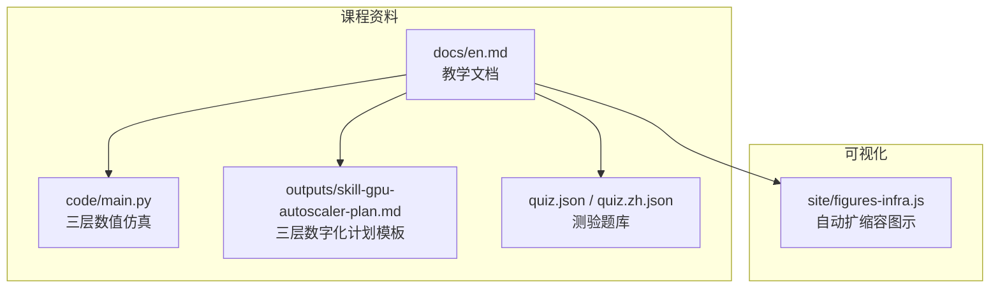
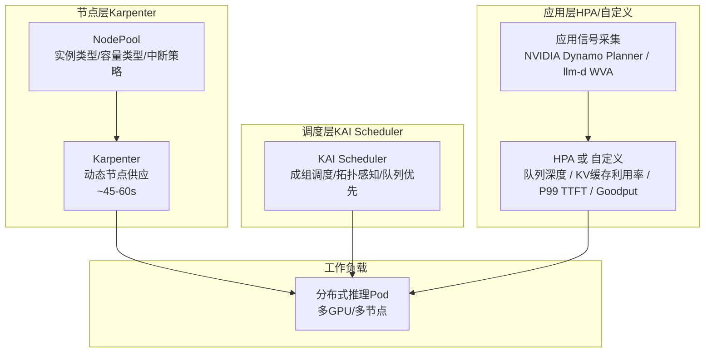
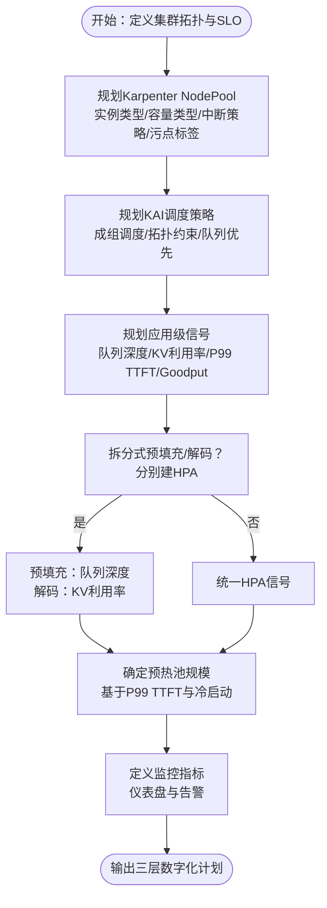
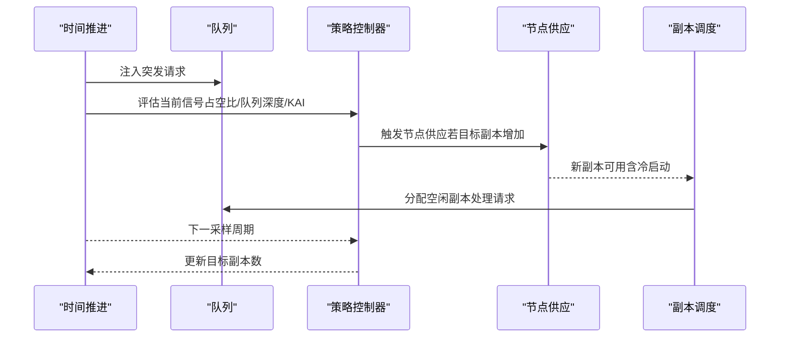
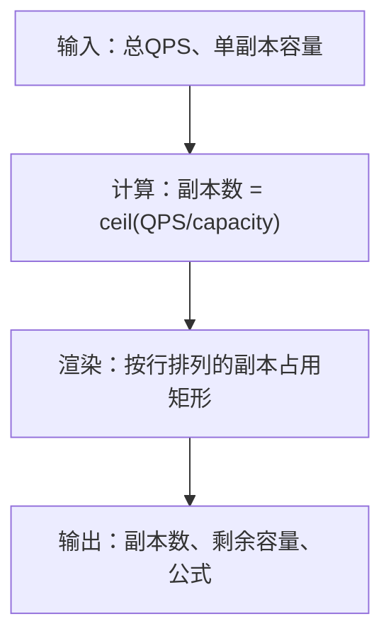
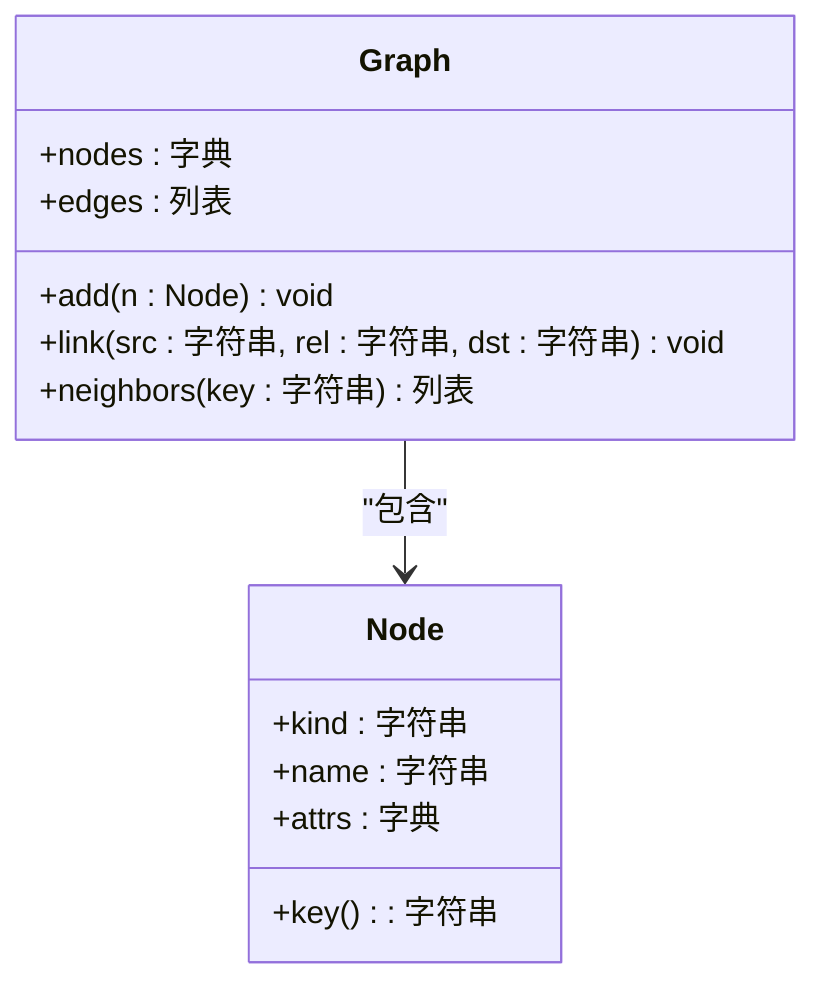
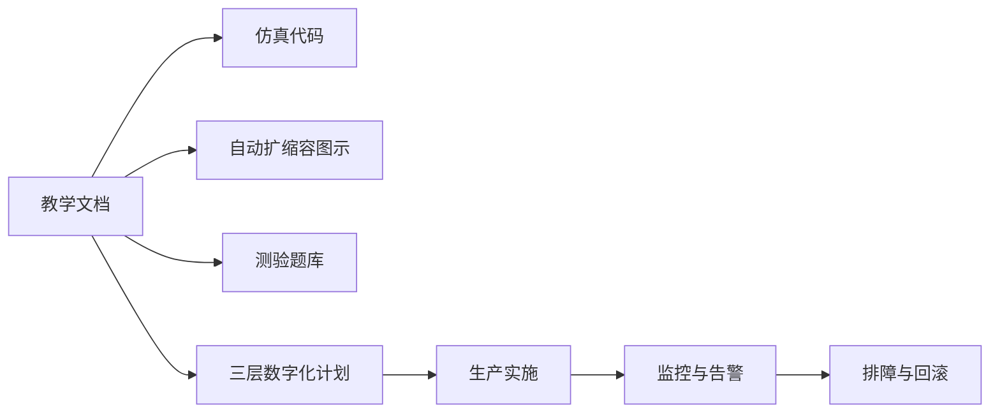

# GPU自动扩缩容与Kubernetes

<cite>
**本文档引用的文件**
- [phases/17-infrastructure-and-production/03-gpu-autoscaling-kubernetes/docs/en.md](file://phases/17-infrastructure-and-production/03-gpu-autoscaling-kubernetes/docs/en.md)
- [phases/17-infrastructure-and-production/03-gpu-autoscaling-kubernetes/code/main.py](file://phases/17-infrastructure-and-production/03-gpu-autoscaling-kubernetes/code/main.py)
- [phases/17-infrastructure-and-production/03-gpu-autoscaling-kubernetes/outputs/skill-gpu-autoscaler-plan.md](file://phases/17-infrastructure-and-production/03-gpu-autoscaling-kubernetes/outputs/skill-gpu-autoscaler-plan.md)
- [site/figures-infra.js](file://site/figures-infra.js)
- [phases/17-infrastructure-and-production/03-gpu-autoscaling-kubernetes/quiz.json](file://phases/17-infrastructure-and-production/03-gpu-autoscaling-kubernetes/quiz.json)
- [phases/17-infrastructure-and-production/03-gpu-autoscaling-kubernetes/quiz.zh.json](file://phases/17-infrastructure-and-production/03-gpu-autoscaling-kubernetes/quiz.zh.json)
- [phases/19-capstone-projects/06-devops-troubleshooting-agent/code/main.py](file://phases/19-capstone-projects/06-devops-troubleshooting-agent/code/main.py)
</cite>

## 目录
1. [引言](#引言)
2. [项目结构](#项目结构)
3. [核心组件](#核心组件)
4. [架构概览](#架构概览)
5. [详细组件分析](#详细组件分析)
6. [依赖关系分析](#依赖关系分析)
7. [性能考量](#性能考量)
8. [故障排查指南](#故障排查指南)
9. [结论](#结论)
10. [附录](#附录)

## 引言
本课程围绕“GPU自动扩缩容与Kubernetes”展开，目标是帮助读者掌握在Kubernetes集群中实现智能GPU资源管理与成本控制的方法论与实操路径。课程强调三层次组合策略：节点层面的动态供应（Karpenter）、多GPU作业的成组调度（KAI Scheduler）以及应用级信号驱动的扩缩容（NVIDIA Dynamo Planner、llm-d Workload Variant Autoscaler）。通过对传统HPA（基于CPU或DCGM GPU利用率）陷阱的剖析，结合模拟器对比不同策略的效果，最终形成可落地的三层数字化计划。

## 项目结构
本课程位于“基础设施与生产”阶段的第3课，配套有教学文档、仿真代码、输出计划与测验题库；同时站点脚本中包含可视化自动扩缩容图示，便于直观理解策略差异。

图表来源
- [phases/17-infrastructure-and-production/03-gpu-autoscaling-kubernetes/docs/en.md:1-140](file://phases/17-infrastructure-and-production/03-gpu-autoscaling-kubernetes/docs/en.md#L1-L140)
- [phases/17-infrastructure-and-production/03-gpu-autoscaling-kubernetes/code/main.py:1-179](file://phases/17-infrastructure-and-production/03-gpu-autoscaling-kubernetes/code/main.py#L1-L179)
- [phases/17-infrastructure-and-production/03-gpu-autoscaling-kubernetes/outputs/skill-gpu-autoscaler-plan.md:1-32](file://phases/17-infrastructure-and-production/03-gpu-autoscaling-kubernetes/outputs/skill-gpu-autoscaler-plan.md#L1-L32)
- [site/figures-infra.js:310-358](file://site/figures-infra.js#L310-L358)

章节来源
- [phases/17-infrastructure-and-production/03-gpu-autoscaling-kubernetes/docs/en.md:1-140](file://phases/17-infrastructure-and-production/03-gpu-autoscaling-kubernetes/docs/en.md#L1-L140)

## 核心组件
- 三层数字化计划模板：明确Karpenter节点池、KAI调度策略与应用级信号，覆盖拆分式预填充/解码场景、预热池与监控指标。
- 三层数值仿真器：对比“占空比HPA”“队列深度HPA”“KAI成组调度”三种策略在突发工作负载下的丢请求数、空闲GPU分钟数与综合评分。
- 教学文档：系统阐述Karpenter、KAI Scheduler与应用级autoscaler的职责边界与最佳实践，指出传统HPA陷阱与安全替代方案。
- 可视化图示：自动扩缩容示意，帮助理解副本数与容量的关系及策略差异。
- 测验题库：覆盖默认HPA信号陷阱、成组调度的作用、Karpenter整合策略的安全性等关键知识点。

章节来源
- [phases/17-infrastructure-and-production/03-gpu-autoscaling-kubernetes/outputs/skill-gpu-autoscaler-plan.md:10-32](file://phases/17-infrastructure-and-production/03-gpu-autoscaling-kubernetes/outputs/skill-gpu-autoscaler-plan.md#L10-L32)
- [phases/17-infrastructure-and-production/03-gpu-autoscaling-kubernetes/code/main.py:55-179](file://phases/17-infrastructure-and-production/03-gpu-autoscaling-kubernetes/code/main.py#L55-L179)
- [site/figures-infra.js:310-358](file://site/figures-infra.js#L310-L358)
- [phases/17-infrastructure-and-production/03-gpu-autoscaling-kubernetes/quiz.json:1-79](file://phases/17-infrastructure-and-production/03-gpu-autoscaling-kubernetes/quiz.json#L1-L79)

## 架构概览
课程提出的三层数字化GPU自动扩缩容体系如下：

图表来源
- [phases/17-infrastructure-and-production/03-gpu-autoscaling-kubernetes/docs/en.md:29-81](file://phases/17-infrastructure-and-production/03-gpu-autoscaling-kubernetes/docs/en.md#L29-L81)
- [phases/17-infrastructure-and-production/03-gpu-autoscaling-kubernetes/code/main.py:55-179](file://phases/17-infrastructure-and-production/03-gpu-autoscaling-kubernetes/code/main.py#L55-L179)

## 详细组件分析

### 组件A：三层数字化计划模板
该模板面向生产集群，要求在三层分别给出明确配置与决策依据，确保在高并发与长尾延迟场景下稳定达成SLA并控制成本。

- 节点层（Karpenter NodePool）
  - 实例类型与容量类型（按需/Spot/预留）的选择应匹配模型与吞吐需求。
  - 中断策略：推理GPU池禁止使用WhenEmptyOrUnderutilized，推荐WhenEmpty+consolidateAfter: 1h，避免驱逐运行中的推理任务。
  - 节点污点与标签：隔离非GPU工作负载，保障推理节点稳定性。
- 调度层（KAI Scheduler）
  - 成组调度：对张量并行/流水线并行大于1的工作负载强制启用，避免7-of-8部分分配陷阱。
  - 拓扑感知：考虑NVLink域、机架与网络互联，确保跨节点通信开销可控。
  - 队列优先：为生产与训练设定抢占规则与配额。
- 应用层（HPA/自定义）
  - 信号选择：优先队列深度（预填充瓶颈）、KV缓存利用率（解码瓶颈）、P99 TTFT或Goodput复合信号。
  - 禁止使用DCGM GPU利用率（占空比）作为HPA信号，因其无法反映实际排队压力。
  - 拆分式预填充/解码：分别建立HPA，预填充用队列深度，解码用KV利用率。
- 预热池与监控
  - 预热池：根据P99 TTFT约束与冷启动时间确定最小就绪副本数。
  - 监控仪表盘：每副本队列深度、每副本KV利用率、节点供应等待时间、成组调度延后次数、Karpenter整合事件。

图表来源
- [phases/17-infrastructure-and-production/03-gpu-autoscaling-kubernetes/outputs/skill-gpu-autoscaler-plan.md:14-19](file://phases/17-infrastructure-and-production/03-gpu-autoscaling-kubernetes/outputs/skill-gpu-autoscaler-plan.md#L14-L19)

章节来源
- [phases/17-infrastructure-and-production/03-gpu-autoscaling-kubernetes/outputs/skill-gpu-autoscaler-plan.md:10-32](file://phases/17-infrastructure-and-production/03-gpu-autoscaling-kubernetes/outputs/skill-gpu-autoscaler-plan.md#L10-L32)

### 组件B：三层数值仿真器（策略对比）
该仿真器通过数值模拟对比三种策略在突发GPU工作负载下的表现，直观展示传统HPA陷阱与正确信号的价值。

- 关键参数
  - 节点供应时间：约50秒（Karpenter）
  - 集群自动伸缩时间：约110秒（对比项）
  - 模型加载时间：约45秒（70B权重+引擎初始化）
  - 请求预填充/解码时长：分别为0.6s与1.8s
  - 最小/最大副本数：1/16
  - HPA采样周期：15秒
  - 目标GPU占空比：70%
- 策略对比
  - 占空比HPA（DUTY_CYCLE）：错误地以GPU占空比为信号，高峰时段盲目维持满负载，导致大量请求超时丢弃。
  - 队列深度HPA（QUEUE_DEPTH）：以实际排队压力为信号，能及时响应突发并降低丢请求率。
  - KAI成组调度（KAI_GANG）：在多GPU场景下避免部分分配浪费，提升资源利用率，减少空闲GPU分钟数。
- 输出指标
  - 总请求数、完成数、丢弃数、平均等待时间、空闲GPU分钟数、峰值副本数与综合评分。

图表来源
- [phases/17-infrastructure-and-production/03-gpu-autoscaling-kubernetes/code/main.py:55-149](file://phases/17-infrastructure-and-production/03-gpu-autoscaling-kubernetes/code/main.py#L55-L149)

章节来源
- [phases/17-infrastructure-and-production/03-gpu-autoscaling-kubernetes/code/main.py:1-179](file://phases/17-infrastructure-and-production/03-gpu-autoscaling-kubernetes/code/main.py#L1-L179)

### 组件C：可视化自动扩缩容图示
站点脚本中的自动扩缩容图示展示了副本数与容量之间的关系，直观说明“副本数=ceil(总负载/单副本容量)”的策略思想，以及在负载变化时副本数的增减如何影响延迟与成本。

图表来源
- [site/figures-infra.js:310-358](file://site/figures-infra.js#L310-L358)

章节来源
- [site/figures-infra.js:310-358](file://site/figures-infra.js#L310-L358)

### 组件D：K8s知识图谱与故障排查（DevOps辅助）
课程配套的DevOps排障代理示例展示了如何构建K8s知识图谱，从告警对象出发，沿着对象关系链路（如Deployment→ReplicaSet→Pod→Node）关联遥测数据，形成根因假设并提供可审计的处置建议。该能力可直接复用到GPU推理服务的排障流程中。

图表来源
- [phases/19-capstone-projects/06-devops-troubleshooting-agent/code/main.py:24-49](file://phases/19-capstone-projects/06-devops-troubleshooting-agent/code/main.py#L24-L49)

章节来源
- [phases/19-capstone-projects/06-devops-troubleshooting-agent/code/main.py:1-146](file://phases/19-capstone-projects/06-devops-troubleshooting-agent/code/main.py#L1-L146)

## 依赖关系分析
- 文档与仿真代码的耦合：教学文档定义策略边界，仿真代码验证策略效果，二者共同指导三层数字化计划的制定。
- 可视化与教学文档的耦合：自动扩缩容图示用于解释策略思想，强化对“副本数与容量关系”的理解。
- 测验题库与教学文档的耦合：题库覆盖关键概念与陷阱，帮助巩固对默认HPA信号、成组调度与Karpenter整合策略的理解。
- DevOps知识图谱与GPU推理服务：通过对象关系与遥测关联，支撑GPU推理服务的快速根因定位与处置。

图表来源
- [phases/17-infrastructure-and-production/03-gpu-autoscaling-kubernetes/docs/en.md:1-140](file://phases/17-infrastructure-and-production/03-gpu-autoscaling-kubernetes/docs/en.md#L1-L140)
- [phases/17-infrastructure-and-production/03-gpu-autoscaling-kubernetes/code/main.py:1-179](file://phases/17-infrastructure-and-production/03-gpu-autoscaling-kubernetes/code/main.py#L1-L179)
- [site/figures-infra.js:310-358](file://site/figures-infra.js#L310-L358)
- [phases/17-infrastructure-and-production/03-gpu-autoscaling-kubernetes/quiz.json:1-79](file://phases/17-infrastructure-and-production/03-gpu-autoscaling-kubernetes/quiz.json#L1-L79)
- [phases/17-infrastructure-and-production/03-gpu-autoscaling-kubernetes/outputs/skill-gpu-autoscaler-plan.md:1-32](file://phases/17-infrastructure-and-production/03-gpu-autoscaling-kubernetes/outputs/skill-gpu-autoscaler-plan.md#L1-L32)

章节来源
- [phases/17-infrastructure-and-production/03-gpu-autoscaling-kubernetes/docs/en.md:1-140](file://phases/17-infrastructure-and-production/03-gpu-autoscaling-kubernetes/docs/en.md#L1-L140)
- [phases/17-infrastructure-and-production/03-gpu-autoscaling-kubernetes/quiz.json:1-79](file://phases/17-infrastructure-and-production/03-gpu-autoscaling-kubernetes/quiz.json#L1-L79)

## 性能考量
- 节点供应速度：Karpenter在GPU节点上的供应时间显著优于传统集群自动伸缩，有助于缩短首次请求的冷启动时间。
- 成组调度收益：避免7-of-8部分分配陷阱，减少空闲GPU分钟数，提升整体吞吐与成本效率。
- 信号选择影响：以队列深度或KV利用率作为HPA信号，能更准确反映推理瓶颈，避免占空比带来的误判。
- 冷启动与预热：结合预热池与应用层检查点技术，可在关键路径上降低P99 TTFT，改善用户体验。
- 监控与告警：通过仪表盘持续观测关键指标，配合自动化回滚机制，确保在策略变更时可快速恢复。

## 故障排查指南
- 诊断“GPU可用但Pod Pending”
  - Karpenter侧：检查NodePool约束、实例类型是否满足GPU需求、中断策略是否导致节点被回收。
  - 调度侧：确认是否启用了KAI Scheduler的成组调度，以及拓扑约束是否允许跨节点放置。
  - 资源侧：核对Pod的资源请求与节点可用资源，是否存在资源配额或限额限制。
- 诊断“HPA不触发或过度触发”
  - 若使用DCGM GPU利用率，应改为队列深度或KV利用率；若为拆分式预填充/解码，需分别建立HPA并采用不同信号。
- 诊断“推理延迟升高”
  - 检查节点供应等待时间、KAI调度延后次数与冷启动时间；必要时增大预热池规模或优化模型加载策略。
- 安全回滚
  - 在策略变更后若出现P99 TTFT突破，应立即回滚至上一次已知稳定的自动扩缩容状态。

章节来源
- [phases/17-infrastructure-and-production/03-gpu-autoscaling-kubernetes/docs/en.md:117-140](file://phases/17-infrastructure-and-production/03-gpu-autoscaling-kubernetes/docs/en.md#L117-L140)
- [phases/17-infrastructure-and-production/03-gpu-autoscaling-kubernetes/quiz.json:1-79](file://phases/17-infrastructure-and-production/03-gpu-autoscaling-kubernetes/quiz.json#L1-L79)

## 结论
本课程通过“三层数字化计划模板+数值仿真+可视化+测验”的组合，系统化解构了Kubernetes上GPU自动扩缩容的关键矛盾：默认HPA信号陷阱、节点供应延迟与多GPU成组调度缺失。实践证明，以队列深度/KV利用率等应用级信号替代占空比，辅以Karpenter与KAI Scheduler的协同，能够在保证SLA的同时显著降低成本与资源浪费。配套的监控与回滚机制则为生产环境提供了稳健的运营保障。

## 附录
- 术语对照
  - Karpenter：节点自动伸缩器，具备子分钟级GPU节点供应能力。
  - KAI Scheduler：二次调度器，负责成组调度、拓扑感知与队列优先。
  - 成组调度：多GPU/多节点推理Pod原子性调度，避免部分分配陷阱。
  - DCGM_FI_DEV_GPU_UTIL：GPU占空比，不适合作为LLM推理的HPA信号。
  - 队列深度：预填充瓶颈场景下的正确HPA信号。
  - KV缓存利用率：解码瓶颈场景下的正确HPA信号。
  - WhenEmpty + 1h：Karpenter在推理GPU池中的安全整合策略。

章节来源
- [phases/17-infrastructure-and-production/03-gpu-autoscaling-kubernetes/docs/en.md:117-140](file://phases/17-infrastructure-and-production/03-gpu-autoscaling-kubernetes/docs/en.md#L117-L140)