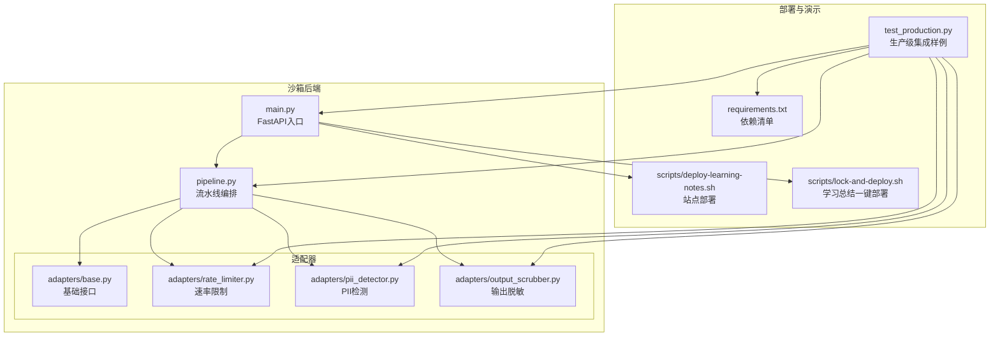
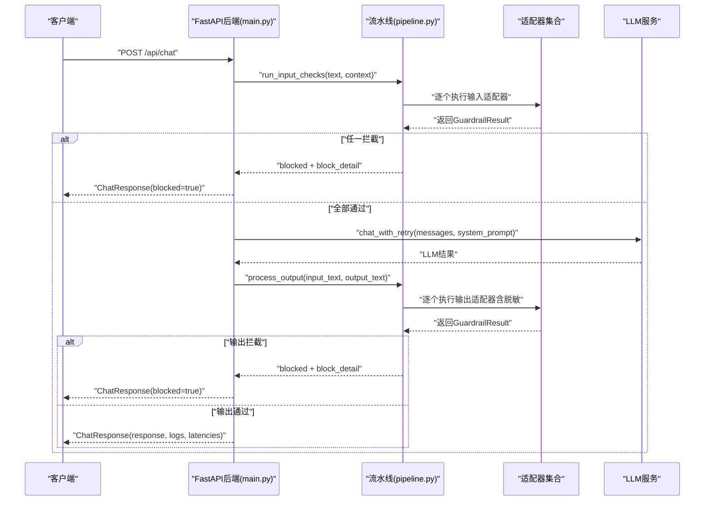
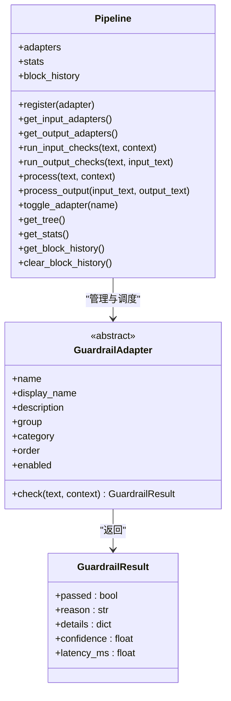
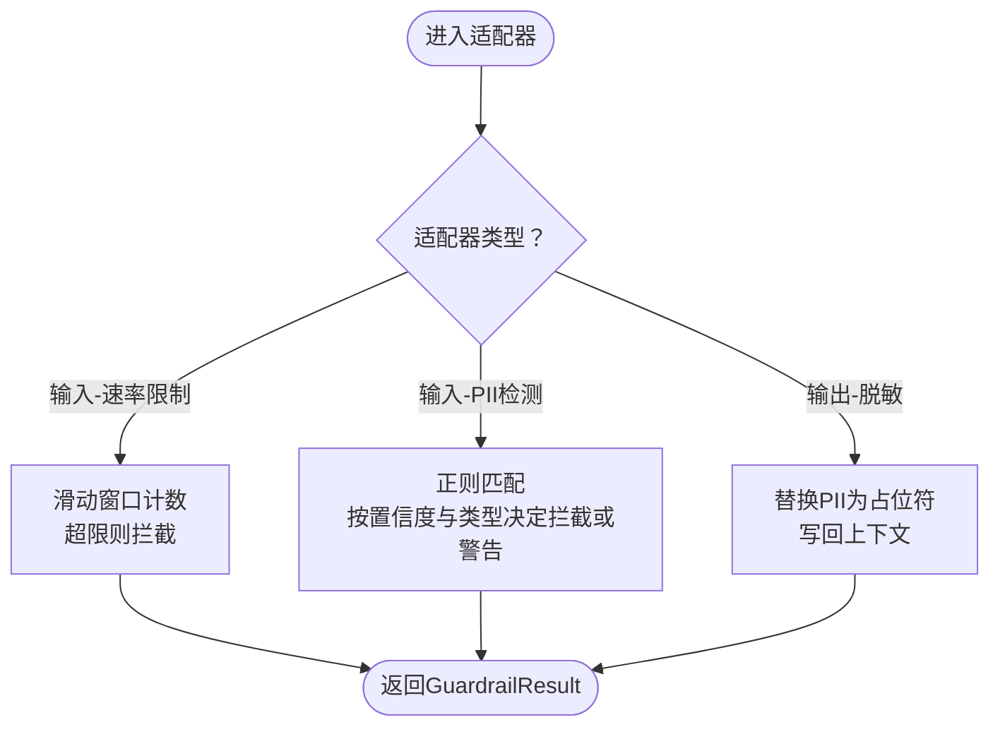
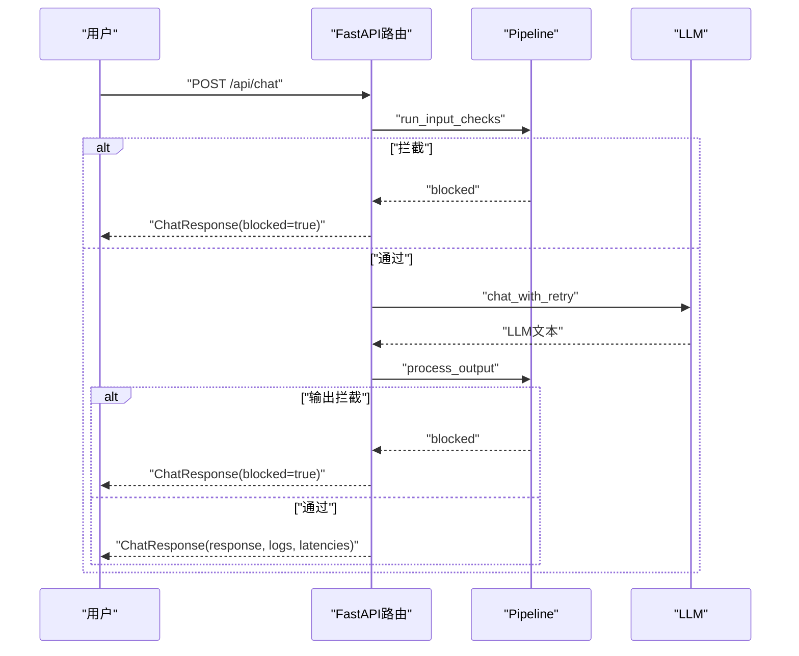
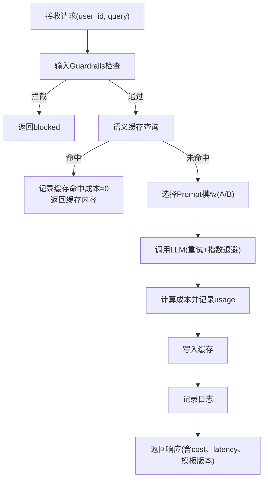
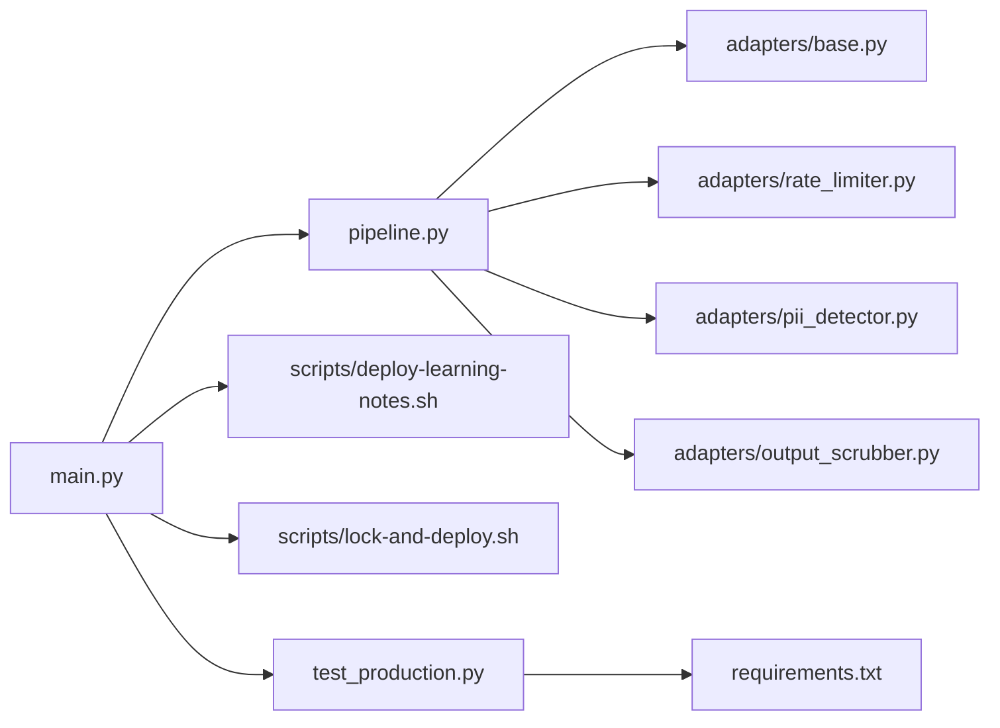
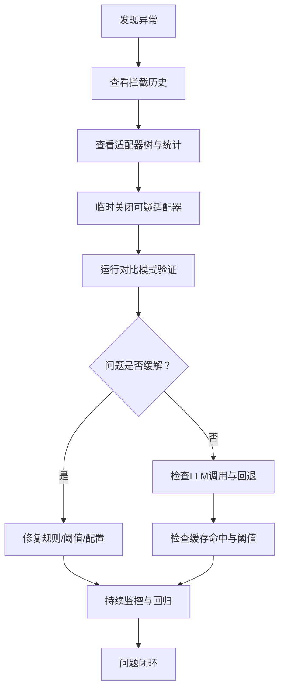

# SRE、安全与合规

<cite>
**本文引用的文件**   
- [guardrails-sandbox/backend/main.py](file://guardrails-sandbox/backend/main.py)
- [guardrails-sandbox/backend/pipeline.py](file://guardrails-sandbox/backend/pipeline.py)
- [guardrails-sandbox/backend/adapters/base.py](file://guardrails-sandbox/backend/adapters/base.py)
- [guardrails-sandbox/backend/adapters/rate_limiter.py](file://guardrails-sandbox/backend/adapters/rate_limiter.py)
- [guardrails-sandbox/backend/adapters/pii_detector.py](file://guardrails-sandbox/backend/adapters/pii_detector.py)
- [guardrails-sandbox/backend/adapters/output_scrubber.py](file://guardrails-sandbox/backend/adapters/output_scrubber.py)
- [scripts/deploy-learning-notes.sh](file://scripts/deploy-learning-notes.sh)
- [scripts/lock-and-deploy.sh](file://scripts/lock-and-deploy.sh)
- [test_production.py](file://test_production.py)
- [requirements.txt](file://requirements.txt)
</cite>

## 目录
1. [简介](#简介)
2. [项目结构](#项目结构)
3. [核心组件](#核心组件)
4. [架构总览](#架构总览)
5. [详细组件分析](#详细组件分析)
6. [依赖分析](#依赖分析)
7. [性能考量](#性能考量)
8. [故障排查指南](#故障排查指南)
9. [结论](#结论)
10. [附录](#附录)

## 简介
本文件面向SRE、安全与合规工程师，围绕AI系统的运维与安全部署，结合仓库中的沙箱与生产级集成样例，系统阐述以下主题：
- SRE最佳实践：SLI/SLO定义、故障响应流程、容量规划、变更管理
- 混沌工程在LLM系统中的应用：故障注入、韧性测试、系统加固
- 安全审计与密钥管理：敏感信息保护、访问控制、安全扫描
- 合规框架要求与实施：数据保护法规、行业标准、审计流程
- 运维手册与应急预案：帮助开发者构建安全可靠的AI生产系统

## 项目结构
本项目包含一个可交互的Guardrails沙箱后端（FastAPI）、适配器集合与流水线编排，以及若干部署与演示脚本。下图展示与SRE/安全/合规相关的关键模块与文件：

**图表来源**
- [guardrails-sandbox/backend/main.py:1-421](file://guardrails-sandbox/backend/main.py#L1-L421)
- [guardrails-sandbox/backend/pipeline.py:1-285](file://guardrails-sandbox/backend/pipeline.py#L1-L285)
- [guardrails-sandbox/backend/adapters/base.py:1-34](file://guardrails-sandbox/backend/adapters/base.py#L1-L34)
- [guardrails-sandbox/backend/adapters/rate_limiter.py:1-56](file://guardrails-sandbox/backend/adapters/rate_limiter.py#L1-L56)
- [guardrails-sandbox/backend/adapters/pii_detector.py:1-54](file://guardrails-sandbox/backend/adapters/pii_detector.py#L1-L54)
- [guardrails-sandbox/backend/adapters/output_scrubber.py:1-56](file://guardrails-sandbox/backend/adapters/output_scrubber.py#L1-L56)
- [scripts/deploy-learning-notes.sh:1-47](file://scripts/deploy-learning-notes.sh#L1-L47)
- [scripts/lock-and-deploy.sh:1-96](file://scripts/lock-and-deploy.sh#L1-L96)
- [test_production.py:1-521](file://test_production.py#L1-L521)
- [requirements.txt:1-19](file://requirements.txt#L1-L19)

**章节来源**
- [guardrails-sandbox/backend/main.py:1-421](file://guardrails-sandbox/backend/main.py#L1-L421)
- [guardrails-sandbox/backend/pipeline.py:1-285](file://guardrails-sandbox/backend/pipeline.py#L1-L285)
- [guardrails-sandbox/backend/adapters/base.py:1-34](file://guardrails-sandbox/backend/adapters/base.py#L1-L34)
- [guardrails-sandbox/backend/adapters/rate_limiter.py:1-56](file://guardrails-sandbox/backend/adapters/rate_limiter.py#L1-L56)
- [guardrails-sandbox/backend/adapters/pii_detector.py:1-54](file://guardrails-sandbox/backend/adapters/pii_detector.py#L1-L54)
- [guardrails-sandbox/backend/adapters/output_scrubber.py:1-56](file://guardrails-sandbox/backend/adapters/output_scrubber.py#L1-L56)
- [scripts/deploy-learning-notes.sh:1-47](file://scripts/deploy-learning-notes.sh#L1-L47)
- [scripts/lock-and-deploy.sh:1-96](file://scripts/lock-and-deploy.sh#L1-L96)
- [test_production.py:1-521](file://test_production.py#L1-L521)
- [requirements.txt:1-19](file://requirements.txt#L1-L19)

## 核心组件
- 流水线编排（Pipeline）：负责注册、排序与执行Guardrail适配器；支持输入/输出阶段短路、统计与拦截历史记录。
- 适配器体系（Adapters）：统一的GuardrailResult与GuardrailAdapter接口；内置速率限制、PII检测、输出脱敏等适配器。
- FastAPI后端（main.py）：提供聊天接口、对比模式、基准测试、MCP工具调用、实验模块与检查点数据库查看等能力。
- 生产级集成样例（test_production.py）：整合Prompt模板管理、语义缓存、Guardrails、重试与指数退避、计费追踪、请求日志与健康检查。

**章节来源**
- [guardrails-sandbox/backend/pipeline.py:1-285](file://guardrails-sandbox/backend/pipeline.py#L1-L285)
- [guardrails-sandbox/backend/adapters/base.py:1-34](file://guardrails-sandbox/backend/adapters/base.py#L1-L34)
- [guardrails-sandbox/backend/adapters/rate_limiter.py:1-56](file://guardrails-sandbox/backend/adapters/rate_limiter.py#L1-L56)
- [guardrails-sandbox/backend/adapters/pii_detector.py:1-54](file://guardrails-sandbox/backend/adapters/pii_detector.py#L1-L54)
- [guardrails-sandbox/backend/adapters/output_scrubber.py:1-56](file://guardrails-sandbox/backend/adapters/output_scrubber.py#L1-L56)
- [guardrails-sandbox/backend/main.py:1-421](file://guardrails-sandbox/backend/main.py#L1-L421)
- [test_production.py:1-521](file://test_production.py#L1-L521)

## 架构总览
下图展示从客户端到LLM调用的端到端流程，以及Guardrails在输入/输出阶段的介入点：

**图表来源**
- [guardrails-sandbox/backend/main.py:155-221](file://guardrails-sandbox/backend/main.py#L155-L221)
- [guardrails-sandbox/backend/pipeline.py:31-84](file://guardrails-sandbox/backend/pipeline.py#L31-L84)
- [guardrails-sandbox/backend/pipeline.py:129-160](file://guardrails-sandbox/backend/pipeline.py#L129-L160)

**章节来源**
- [guardrails-sandbox/backend/main.py:155-221](file://guardrails-sandbox/backend/main.py#L155-L221)
- [guardrails-sandbox/backend/pipeline.py:31-84](file://guardrails-sandbox/backend/pipeline.py#L31-L84)
- [guardrails-sandbox/backend/pipeline.py:129-160](file://guardrails-sandbox/backend/pipeline.py#L129-L160)

## 详细组件分析

### 组件A：流水线编排（Pipeline）
- 职责：注册适配器、按组/分类/顺序组织、短路拦截、统计与拦截历史、启用/禁用切换。
- 关键点：
  - 输入/输出适配器分别过滤与排序，确保执行顺序可控。
  - 拦截即短路，避免后续昂贵检查；记录block_history便于审计。
  - 提供树形结构视图，便于可视化治理。

**图表来源**
- [guardrails-sandbox/backend/pipeline.py:12-285](file://guardrails-sandbox/backend/pipeline.py#L12-L285)
- [guardrails-sandbox/backend/adapters/base.py:5-34](file://guardrails-sandbox/backend/adapters/base.py#L5-L34)

**章节来源**
- [guardrails-sandbox/backend/pipeline.py:12-285](file://guardrails-sandbox/backend/pipeline.py#L12-L285)
- [guardrails-sandbox/backend/adapters/base.py:5-34](file://guardrails-sandbox/backend/adapters/base.py#L5-L34)

### 组件B：适配器（RateLimiter/PII检测/输出脱敏）
- 速率限制（RateLimiter）：基于滑动窗口的RPM限制，按用户等级（free/pro/enterprise）配置阈值，超限即拦截。
- PII检测（PiiDetector）：正则识别手机号、邮箱、身份证、信用卡、IP地址等，部分类型仅警告（降低误报）。
- 输出脱敏（OutputScrubber）：对LLM输出进行PII替换，不阻断，但写回上下文供后续使用。

**图表来源**
- [guardrails-sandbox/backend/adapters/rate_limiter.py:22-55](file://guardrails-sandbox/backend/adapters/rate_limiter.py#L22-L55)
- [guardrails-sandbox/backend/adapters/pii_detector.py:28-53](file://guardrails-sandbox/backend/adapters/pii_detector.py#L28-L53)
- [guardrails-sandbox/backend/adapters/output_scrubber.py:25-55](file://guardrails-sandbox/backend/adapters/output_scrubber.py#L25-L55)

**章节来源**
- [guardrails-sandbox/backend/adapters/rate_limiter.py:1-56](file://guardrails-sandbox/backend/adapters/rate_limiter.py#L1-L56)
- [guardrails-sandbox/backend/adapters/pii_detector.py:1-54](file://guardrails-sandbox/backend/adapters/pii_detector.py#L1-L54)
- [guardrails-sandbox/backend/adapters/output_scrubber.py:1-56](file://guardrails-sandbox/backend/adapters/output_scrubber.py#L1-L56)

### 组件C：FastAPI后端（main.py）
- 路由与数据模型：提供获取适配器树、开关适配器、聊天接口、对比模式、基准测试、MCP工具调用、实验模块与检查点数据库查看。
- 关键流程：输入Guardrails短路、LLM调用（带重试/异常处理）、输出Guardrails与脱敏、聚合日志与延迟统计。
- 预加载：启动前预热语义模型，规避异步环境连接问题。

**图表来源**
- [guardrails-sandbox/backend/main.py:155-221](file://guardrails-sandbox/backend/main.py#L155-L221)
- [guardrails-sandbox/backend/pipeline.py:31-84](file://guardrails-sandbox/backend/pipeline.py#L31-L84)
- [guardrails-sandbox/backend/pipeline.py:129-160](file://guardrails-sandbox/backend/pipeline.py#L129-L160)

**章节来源**
- [guardrails-sandbox/backend/main.py:1-421](file://guardrails-sandbox/backend/main.py#L1-L421)

### 组件D：生产级集成样例（test_production.py）
- Prompt模板管理与A/B测试：基于用户ID哈希的稳定分流，控制/实验版本流量占比。
- 语义缓存：向量相似度匹配，命中即返回，显著降低成本与延迟。
- Guardrails：注入攻击检测与PII告警（非拦截），保障输入质量。
- LLM调用：带重试与指数退避，失败时回退文案，记录usage并估算成本。
- 计费追踪：累计输入/输出token与费用，支持缓存命中率统计。
- 健康检查：返回缓存与成本摘要、总请求数与运行状态。

**图表来源**
- [test_production.py:329-389](file://test_production.py#L329-L389)
- [test_production.py:210-275](file://test_production.py#L210-L275)
- [test_production.py:87-142](file://test_production.py#L87-L142)
- [test_production.py:163-188](file://test_production.py#L163-L188)

**章节来源**
- [test_production.py:1-521](file://test_production.py#L1-L521)

## 依赖分析
- 后端依赖：FastAPI、CORSMiddleware、Pydantic、sentence-transformers（用于语义模型离线加载）。
- 适配器依赖：正则表达式、时间与哈希（用于PII哈希与延迟统计）。
- 部署脚本：npm构建Vue应用、git subtree split发布到gh-pages分支。
- 生产样例：anthropic/openai客户端、向量嵌入模型、重试与指数退避逻辑。

**图表来源**
- [guardrails-sandbox/backend/main.py:1-421](file://guardrails-sandbox/backend/main.py#L1-L421)
- [guardrails-sandbox/backend/pipeline.py:1-285](file://guardrails-sandbox/backend/pipeline.py#L1-L285)
- [guardrails-sandbox/backend/adapters/base.py:1-34](file://guardrails-sandbox/backend/adapters/base.py#L1-L34)
- [guardrails-sandbox/backend/adapters/rate_limiter.py:1-56](file://guardrails-sandbox/backend/adapters/rate_limiter.py#L1-L56)
- [guardrails-sandbox/backend/adapters/pii_detector.py:1-54](file://guardrails-sandbox/backend/adapters/pii_detector.py#L1-L54)
- [guardrails-sandbox/backend/adapters/output_scrubber.py:1-56](file://guardrails-sandbox/backend/adapters/output_scrubber.py#L1-L56)
- [scripts/deploy-learning-notes.sh:1-47](file://scripts/deploy-learning-notes.sh#L1-L47)
- [scripts/lock-and-deploy.sh:1-96](file://scripts/lock-and-deploy.sh#L1-L96)
- [test_production.py:1-521](file://test_production.py#L1-L521)
- [requirements.txt:1-19](file://requirements.txt#L1-L19)

**章节来源**
- [guardrails-sandbox/backend/main.py:1-421](file://guardrails-sandbox/backend/main.py#L1-L421)
- [guardrails-sandbox/backend/pipeline.py:1-285](file://guardrails-sandbox/backend/pipeline.py#L1-L285)
- [guardrails-sandbox/backend/adapters/base.py:1-34](file://guardrails-sandbox/backend/adapters/base.py#L1-L34)
- [guardrails-sandbox/backend/adapters/rate_limiter.py:1-56](file://guardrails-sandbox/backend/adapters/rate_limiter.py#L1-L56)
- [guardrails-sandbox/backend/adapters/pii_detector.py:1-54](file://guardrails-sandbox/backend/adapters/pii_detector.py#L1-L54)
- [guardrails-sandbox/backend/adapters/output_scrubber.py:1-56](file://guardrails-sandbox/backend/adapters/output_scrubber.py#L1-L56)
- [scripts/deploy-learning-notes.sh:1-47](file://scripts/deploy-learning-notes.sh#L1-L47)
- [scripts/lock-and-deploy.sh:1-96](file://scripts/lock-and-deploy.sh#L1-L96)
- [test_production.py:1-521](file://test_production.py#L1-L521)
- [requirements.txt:1-19](file://requirements.txt#L1-L19)

## 性能考量
- 延迟与吞吐：
  - 适配器内部均记录latency_ms，便于定位瓶颈。
  - 语义缓存命中可显著降低延迟与token消耗。
  - LLM调用采用指数退避与回退文案，提升稳定性。
- 资源与容量：
  - 速率限制按用户等级差异化配置，防止滥用。
  - 预加载语义模型减少冷启动开销。
- 成本控制：
  - 通过Prompt模板版本与缓存命中率统计，指导优化。
  - 估算成本与用量，支撑FinOps指标。

**章节来源**
- [guardrails-sandbox/backend/adapters/rate_limiter.py:38-55](file://guardrails-sandbox/backend/adapters/rate_limiter.py#L38-L55)
- [guardrails-sandbox/backend/adapters/pii_detector.py:45-53](file://guardrails-sandbox/backend/adapters/pii_detector.py#L45-L53)
- [guardrails-sandbox/backend/adapters/output_scrubber.py:41-55](file://guardrails-sandbox/backend/adapters/output_scrubber.py#L41-L55)
- [test_production.py:87-142](file://test_production.py#L87-L142)
- [test_production.py:210-275](file://test_production.py#L210-L275)
- [test_production.py:280-305](file://test_production.py#L280-L305)

## 故障排查指南
- 快速定位：
  - 使用“拦截历史”与“适配器树”查看最近被拦截的触发点与统计。
  - 对比模式（/api/chat/compare）快速评估Guardrails影响。
- 常见问题：
  - LLM调用失败：检查重试与回退路径，确认错误信息与总延迟。
  - PII误报：调整正则置信度或类型白名单，必要时降级为警告。
  - 缓存未命中：检查阈值与TTL，评估相似度计算与命中率。
- 运维工具：
  - 开关单个适配器以隔离问题。
  - 重置统计与拦截历史，避免历史数据干扰。

**图表来源**
- [guardrails-sandbox/backend/main.py:147-153](file://guardrails-sandbox/backend/main.py#L147-L153)
- [guardrails-sandbox/backend/main.py:223-257](file://guardrails-sandbox/backend/main.py#L223-L257)
- [guardrails-sandbox/backend/pipeline.py:264-285](file://guardrails-sandbox/backend/pipeline.py#L264-L285)
- [guardrails-sandbox/backend/pipeline.py:188-235](file://guardrails-sandbox/backend/pipeline.py#L188-L235)

**章节来源**
- [guardrails-sandbox/backend/main.py:147-153](file://guardrails-sandbox/backend/main.py#L147-L153)
- [guardrails-sandbox/backend/main.py:223-257](file://guardrails-sandbox/backend/main.py#L223-L257)
- [guardrails-sandbox/backend/pipeline.py:264-285](file://guardrails-sandbox/backend/pipeline.py#L264-L285)
- [guardrails-sandbox/backend/pipeline.py:188-235](file://guardrails-sandbox/backend/pipeline.py#L188-L235)

## 结论
本项目提供了从沙箱到生产级集成的完整参考实现，覆盖SRE可观测性、安全护栏与合规治理的关键要素。通过可插拔的适配器体系、严格的短路拦截与统计、以及可验证的部署与演示脚本，能够帮助团队建立稳健的AI生产系统。

## 附录

### SLI/SLO建议（结合现有实现）
- SLI
  - 请求成功率：Pipeline统计blocked/passed与block_rate_pct。
  - 延迟：适配器与LLM调用的latency_ms，总延迟total_latency_ms。
  - 缓存命中率：语义缓存命中/未命中计数与命中率。
  - 成本：累计input/output token与费用。
- SLO
  - 输入拦截率 < X%
  - 输出拦截率 < Y%
  - 95分位延迟 < Z ms
  - 缓存命中率 > W%
  - 日成本增长率 < Δ%

**章节来源**
- [guardrails-sandbox/backend/pipeline.py:247-262](file://guardrails-sandbox/backend/pipeline.py#L247-L262)
- [guardrails-sandbox/backend/main.py:155-221](file://guardrails-sandbox/backend/main.py#L155-L221)
- [test_production.py:87-142](file://test_production.py#L87-L142)
- [test_production.py:280-305](file://test_production.py#L280-L305)

### 故障响应流程（结合现有实现）
- 触发：告警（如延迟/拦截率/成本异常）
- 诊断：查看拦截历史、适配器树、最近日志
- 处置：临时关闭高风险适配器、回滚模板版本、扩容/降级
- 复盘：RCA与回归测试，更新SLO与规则

**章节来源**
- [guardrails-sandbox/backend/main.py:147-153](file://guardrails-sandbox/backend/main.py#L147-L153)
- [guardrails-sandbox/backend/pipeline.py:264-285](file://guardrails-sandbox/backend/pipeline.py#L264-L285)
- [test_production.py:407-419](file://test_production.py#L407-L419)

### 容量规划（结合现有实现）
- 依据SLI/SLO目标，结合缓存命中率与LLM用量估算峰值QPS与成本。
- 速率限制参数随业务增长动态调整。
- 预热与冷启动优化（语义模型预加载）。

**章节来源**
- [guardrails-sandbox/backend/main.py:62-76](file://guardrails-sandbox/backend/main.py#L62-L76)
- [test_production.py:87-142](file://test_production.py#L87-L142)
- [guardrails-sandbox/backend/adapters/rate_limiter.py:16-28](file://guardrails-sandbox/backend/adapters/rate_limiter.py#L16-L28)

### 变更管理（结合现有实现）
- 通过对比模式（/api/chat/compare）验证变更影响。
- A/B测试模板版本，基于用户ID哈希保证一致性。
- 部署脚本自动化：构建、提交、推送至gh-pages。

**章节来源**
- [guardrails-sandbox/backend/main.py:223-257](file://guardrails-sandbox/backend/main.py#L223-L257)
- [test_production.py:56-77](file://test_production.py#L56-L77)
- [scripts/deploy-learning-notes.sh:21-47](file://scripts/deploy-learning-notes.sh#L21-L47)

### 混沌工程在LLM系统中的应用
- 故障注入：在LLM调用前/后注入延迟、错误、超时，观察Guardrails与回退行为。
- 韧性测试：模拟GPU/CPU资源不足、网络抖动、模型服务不可用，评估降级策略。
- 系统加固：增加熔断、限流、重试与指数退避，完善健康检查与告警。

**章节来源**
- [test_production.py:210-275](file://test_production.py#L210-L275)
- [guardrails-sandbox/backend/main.py:180-195](file://guardrails-sandbox/backend/main.py#L180-L195)

### 安全审计与密钥管理策略
- 敏感信息保护：输出脱敏（PII替换）、输入PII检测与告警。
- 访问控制：速率限制按等级区分、CORS中间件配置。
- 安全扫描：定期扫描配置文件与日志中的敏感信息，结合拦截历史审计。

**章节来源**
- [guardrails-sandbox/backend/adapters/output_scrubber.py:25-55](file://guardrails-sandbox/backend/adapters/output_scrubber.py#L25-L55)
- [guardrails-sandbox/backend/adapters/pii_detector.py:28-53](file://guardrails-sandbox/backend/adapters/pii_detector.py#L28-L53)
- [guardrails-sandbox/backend/adapters/rate_limiter.py:16-28](file://guardrails-sandbox/backend/adapters/rate_limiter.py#L16-L28)
- [guardrails-sandbox/backend/main.py:80-85](file://guardrails-sandbox/backend/main.py#L80-L85)

### 合规框架要求与实施
- 数据保护法规：GDPR、CCPA等要求PII最小化与可擦除权，输出脱敏与拦截历史可追溯。
- 行业标准：SOC 2、ISO 27001/42001，通过访问控制、审计日志与变更管理满足控制项。
- 审计流程：保留拦截历史、日志与统计，支持外部审计与内审。

**章节来源**
- [guardrails-sandbox/backend/pipeline.py:264-285](file://guardrails-sandbox/backend/pipeline.py#L264-L285)
- [guardrails-sandbox/backend/main.py:121-129](file://guardrails-sandbox/backend/main.py#L121-L129)

### 运维手册与应急预案
- 运维手册
  - 启动与预热：语义模型预加载、端口监听、静态文件服务。
  - 监控与告警：拦截率、延迟、成本、缓存命中率阈值。
  - 配置管理：适配器开关、速率限制阈值、模板版本。
- 应急预案
  - LLM服务不可用：启用回退文案，记录错误与成本。
  - PII泄露风险：立即关闭相关适配器，审查拦截历史与日志。
  - 高峰流量：启用更高阈值的速率限制与缓存策略。

**章节来源**
- [guardrails-sandbox/backend/main.py:413-421](file://guardrails-sandbox/backend/main.py#L413-L421)
- [test_production.py:260-275](file://test_production.py#L260-L275)
- [guardrails-sandbox/backend/main.py:147-153](file://guardrails-sandbox/backend/main.py#L147-L153)