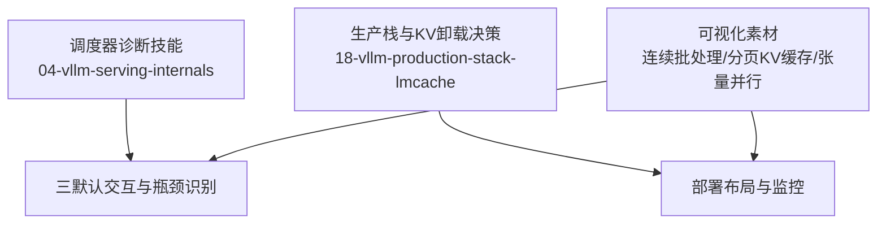
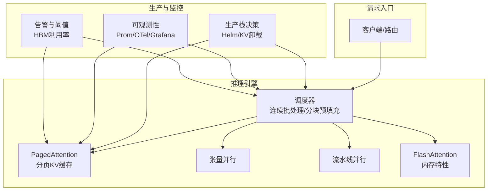
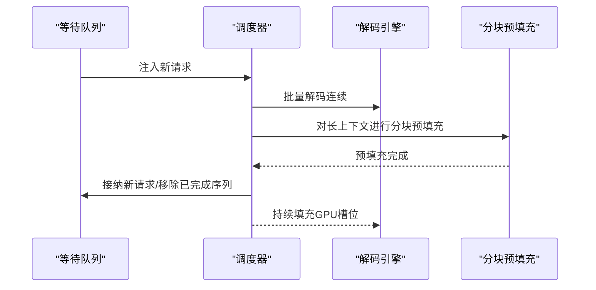
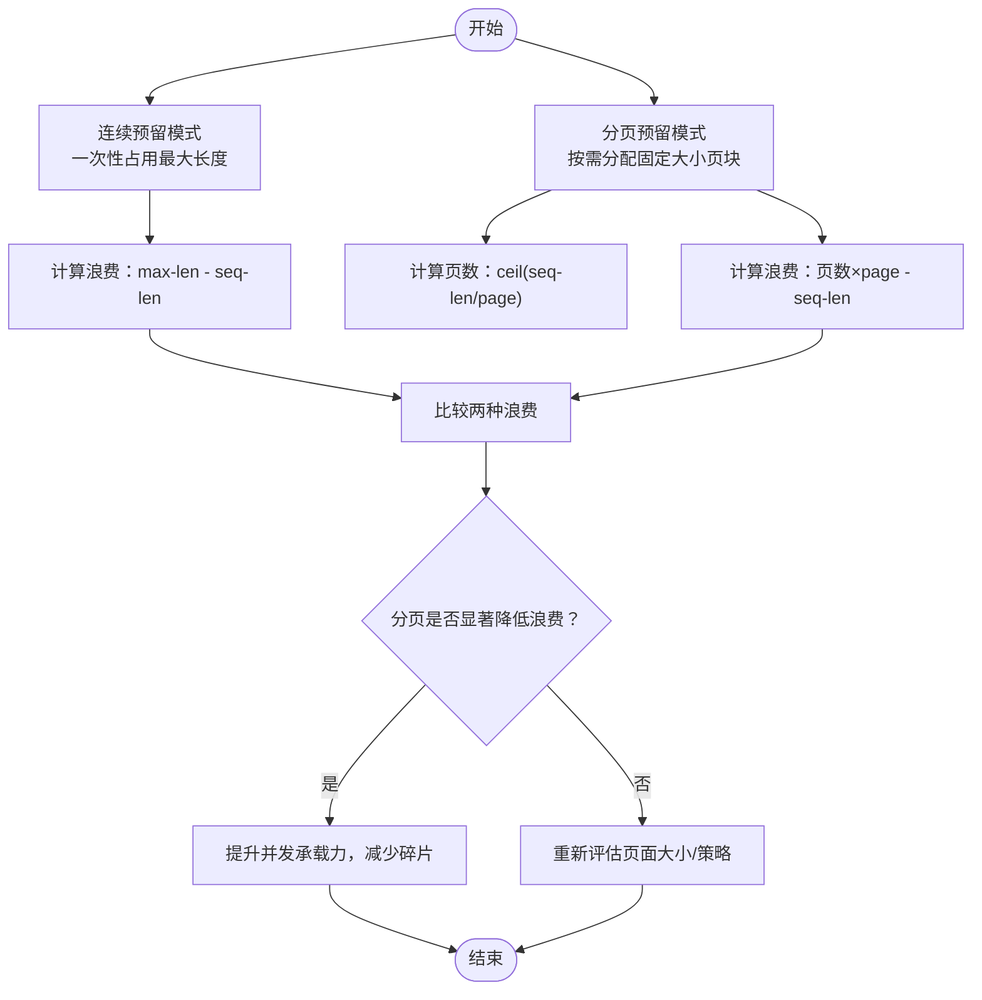
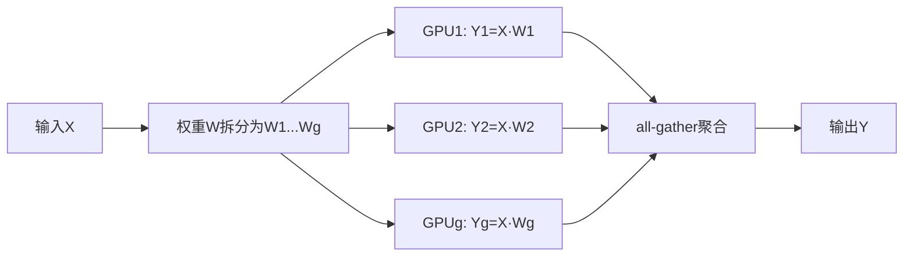
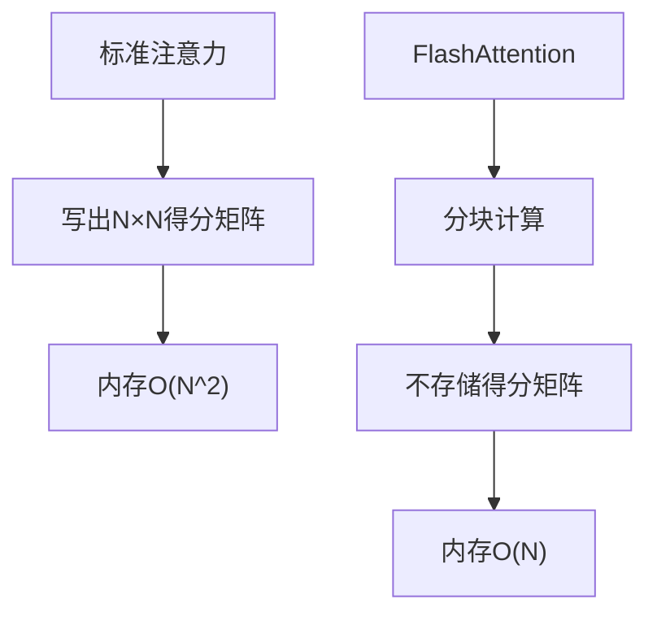
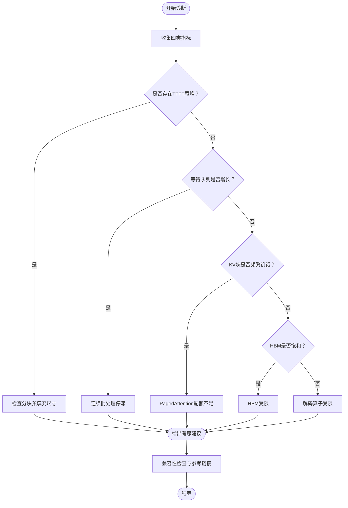
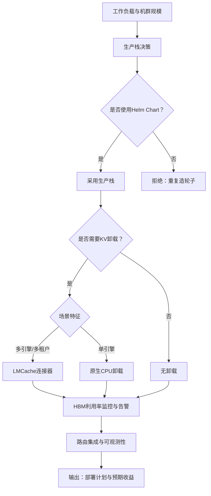
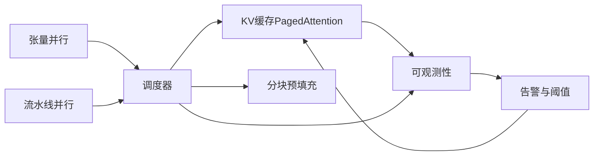
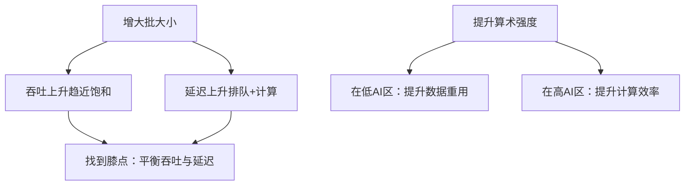

# vLLM服务内部机制

<cite>
**本文引用的文件**
- [skill-vllm-scheduler-reader.md](file://phases/17-infrastructure-and-production/04-vllm-serving-internals/outputs/skill-vllm-scheduler-reader.md)
- [quiz-vllm-serving-internals.json](file://phases/17-infrastructure-and-production/04-vllm-serving-internals/quiz.json)
- [skill-vllm-stack-decider.md](file://phases/17-infrastructure-and-production/18-vllm-production-stack-lmcache/outputs/skill-vllm-stack-decider.md)
- [figures-llms-systems.js](file://site/figures-llms-systems.js)
- [figures-llms2.js](file://site/figures-llms2.js)
- [figures-infra.js](file://site/figures-infra.js)
- [figures-transformers.js](file://site/figures-transformers.js)
- [throughput-latency.svg:267-308](file://site/figures-infra.js#L267-L308)
- [tensor-parallel.svg:69-110](file://site/figures-infra.js#L69-L110)
- [paged-kv-cache.svg:217-279](file://site/figures-llms2.js#L217-L279)
- [continuous-batching.svg:278-308](file://site/figures-llms-systems.js#L278-L308)
- [flash-attention-memory.svg:439-444](file://site/figures-transformers.js#L439-L444)
</cite>

## 目录
1. [引言](#引言)
2. [项目结构](#项目结构)
3. [核心组件](#核心组件)
4. [架构总览](#架构总览)
5. [详细组件分析](#详细组件分析)
6. [依赖关系分析](#依赖关系分析)
7. [性能考量](#性能考量)
8. [故障排查指南](#故障排查指南)
9. [结论](#结论)
10. [附录](#附录)

## 引言
本文件面向希望深入理解vLLM服务内部机制的工程师与运维人员，系统化梳理其异步推理引擎、连续批处理、内存管理（尤其是分页注意力KV缓存）、张量并行与流水线并行等关键能力，并结合仓库内可视化素材与诊断技能，给出可操作的调度器瓶颈定位方法、生产部署决策与可观测性建议。内容以仓库现有资料为基础，辅以概念性图示帮助非专业读者建立整体认知。

## 项目结构
仓库中与vLLM服务内部机制直接相关的知识主要分布在以下位置：
- 面向调度器的诊断技能与测验：用于识别PagedAttention、连续批处理、分块预填充等三默认配置的瓶颈与调优路径
- 生产栈与KV卸载决策：指导在多引擎、多租户场景下选择合适的部署布局与KV缓存策略
- 可视化素材：连续批处理、分页KV缓存、张量并行、FlashAttention内存特性等直观图解

**章节来源**
- [skill-vllm-scheduler-reader.md:1-31](file://phases/17-infrastructure-and-production/04-vllm-serving-internals/outputs/skill-vllm-scheduler-reader.md#L1-L31)
- [skill-vllm-stack-decider.md:1-35](file://phases/17-infrastructure-and-production/18-vllm-production-stack-lmcache/outputs/skill-vllm-stack-decider.md#L1-L35)

## 核心组件
- 异步推理引擎与调度器
  - 连续批处理：调度器在每次解码迭代时运行，动态接纳已完成的序列并注入新请求，避免静态批处理对最慢序列的阻滞
  - 分块预填充（Chunked Prefill）：在长上下文预填充阶段降低尾部TTFT抖动，提升P99 ITL稳定性
  - PagedAttention：以固定大小页块按需分配KV缓存，显著降低碎片率与显存占用
- 内存管理
  - 分页KV缓存：对比连续预留与分页预留的浪费模型，解释为何分页能容纳更多并发序列
  - 显存利用阈值与告警：建议设置GPU内存利用率阈值并进行预抢占预警
- 并行与加速
  - 张量并行：列切分权重矩阵并在GPU间聚合部分输出，降低单卡参数占用
  - 流水线并行：在训练/推理中将层或算子分布到不同设备，提升吞吐
  - FlashAttention内存特性：通过分块计算避免显式存储N×N得分矩阵，线性增长内存

**章节来源**
- [quiz-vllm-serving-internals.json:1-79](file://phases/17-infrastructure-and-production/04-vllm-serving-internals/quiz.json#L1-L79)
- [figures-llms-systems.js:278-308](file://site/figures-llms-systems.js#L278-L308)
- [figures-llms2.js:217-279](file://site/figures-llms2.js#L217-L279)
- [figures-infra.js:69-110](file://site/figures-infra.js#L69-L110)
- [figures-transformers.js:439-444](file://site/figures-transformers.js#L439-L444)

## 架构总览
下图展示了vLLM服务在生产环境中的关键交互：调度器驱动连续批处理与分块预填充；PagedAttention管理KV缓存；并行策略（张量/流水线）提升计算效率；观测与告警保障稳定性。

**图表来源**
- [figures-llms-systems.js:278-308](file://site/figures-llms-systems.js#L278-L308)
- [figures-llms2.js:217-279](file://site/figures-llms2.js#L217-L279)
- [figures-infra.js:69-110](file://site/figures-infra.js#L69-L110)
- [figures-transformers.js:439-444](file://site/figures-transformers.js#L439-L444)

## 详细组件分析

### 组件A：调度器与连续批处理
- 连续批处理的不变式：调度器在每个解码迭代周期运行，动态接纳完成序列并注入等待队列中的新请求，从而保持GPU槽位持续被填满
- 等待队列深度与TTFT尾部抖动：当等待队列增长时，通常意味着连续批处理停滞，需要检查是否因KV块饥饿、显存压力或调度参数不当导致
- 分块预填充的作用：在长上下文预填充阶段分块执行，降低P99 ITL尾峰，提升端到端体验

**图表来源**
- [figures-llms-systems.js:278-308](file://site/figures-llms-systems.js#L278-L308)
- [quiz-vllm-serving-internals.json:29-40](file://phases/17-infrastructure-and-production/04-vllm-serving-internals/quiz.json#L29-L40)

**章节来源**
- [quiz-vllm-serving-internals.json:29-40](file://phases/17-infrastructure-and-production/04-vllm-serving-internals/quiz.json#L29-L40)
- [figures-llms-systems.js:278-308](file://site/figures-llms-systems.js#L278-L308)

### 组件B：分页KV缓存（PagedAttention）
- 连续预留与分页预留的浪费对比：连续预留一次性占用最大长度，空闲空间巨大；分页按需分配，仅最后一页部分空闲，内部浪费远小于连续预留
- 页面大小与碎片率：页面越小，页数越多但碎片更可控；默认页面大小通常为16个token，能将碎片率从60%-80%降至不足4%
- 并发序列承载力：由于内部浪费大幅下降，分页缓存可在相同显存上承载更多并发序列，提升吞吐

**图表来源**
- [figures-llms2.js:217-279](file://site/figures-llms2.js#L217-L279)

**章节来源**
- [quiz-vllm-serving-internals.json:18-28](file://phases/17-infrastructure-and-production/04-vllm-serving-internals/quiz.json#L18-L28)
- [figures-llms2.js:217-279](file://site/figures-llms2.js#L217-L279)

### 组件C：张量并行与流水线并行
- 张量并行：将权重矩阵按列切分至多个GPU，每卡计算X·W_i，再通过all-gather聚合结果，降低单卡参数占用
- 流水线并行：将模型层或算子分布到不同设备，前一设备完成部分计算后流水推进，提升整体吞吐

**图表来源**
- [figures-infra.js:69-110](file://site/figures-infra.js#L69-L110)

**章节来源**
- [figures-infra.js:69-110](file://site/figures-infra.js#L69-L110)

### 组件D：FlashAttention内存特性
- 标准注意力需要显式写出N×N得分矩阵，内存随序列长度平方增长；FlashAttention采用分块计算，避免存储该矩阵，内存线性增长
- 在长上下文场景下，内存节省可达数量级差异，显著缓解显存压力

**图表来源**
- [figures-transformers.js:439-444](file://site/figures-transformers.js#L439-L444)

**章节来源**
- [figures-transformers.js:439-444](file://site/figures-transformers.js#L439-L444)

### 组件E：调度器瓶颈诊断与调优
- 诊断步骤
  - 读取配置：明确各调度器开关（如分块预填充、推测式解码）及其默认行为
  - 瓶颈分类：KV块饥饿、连续批处理停滞、分块预填充尺寸不当、解码算子受限、HBM不足
  - 建议顺序：优先调整调度器参数，再考虑硬件扩容
  - 兼容性：v0.18.0中“启用分块预填充”与“草稿模型推测式解码”存在硬不兼容，需遵循替代方案
- 关键指标
  - TTFT均值/P99、ITL均值/P99、吞吐（tok/s）、并发度
  - 避免将GPU利用率（Duty Cycle）误判为扩展信号（预分配KV导致误导）

**图表来源**
- [skill-vllm-scheduler-reader.md:10-31](file://phases/17-infrastructure-and-production/04-vllm-serving-internals/outputs/skill-vllm-scheduler-reader.md#L10-L31)

**章节来源**
- [skill-vllm-scheduler-reader.md:10-31](file://phases/17-infrastructure-and-production/04-vllm-serving-internals/outputs/skill-vllm-scheduler-reader.md#L10-L31)
- [quiz-vllm-serving-internals.json:54-76](file://phases/17-infrastructure-and-production/04-vllm-serving-internals/quiz.json#L54-L76)

### 组件F：生产栈与KV卸载决策
- 栈选择：优先使用vLLM生产栈Helm Chart（新部署推荐），明确适用Operator/CRD
- KV卸载策略：
  - 无卸载：短提示、低并发场景，开销大于收益
  - 原生CPU卸载：单引擎HBM压力大时，简单易用
  - LMCache连接器：跨引擎前缀复用、抢占频繁或多租户共享提示
- 监控与告警：设置GPU内存利用率阈值并预警，建议在92%以上作为预抢占信号
- 路由集成：缓存感知路由，确认KV事件通道已配置
- 期望收益：在KV占用超过HBM时，LMCache可带来显著吞吐增益

**图表来源**
- [skill-vllm-stack-decider.md:10-35](file://phases/17-infrastructure-and-production/18-vllm-production-stack-lmcache/outputs/skill-vllm-stack-decider.md#L10-L35)

**章节来源**
- [skill-vllm-stack-decider.md:10-35](file://phases/17-infrastructure-and-production/18-vllm-production-stack-lmcache/outputs/skill-vllm-stack-decider.md#L10-L35)

## 依赖关系分析
- 调度器与KV缓存：调度器的连续批处理与分块预填充直接影响KV缓存的分配与回收节奏，进而影响碎片率与并发承载
- 并行策略与内存：张量并行降低单卡参数占用，但需注意all-gather通信开销；流水线并行提升吞吐，但引入流水洞问题
- 观测与告警：Prometheus抓取引擎指标，OpenTelemetry生成GenAI属性，Grafana仪表盘模板来自生产栈，形成闭环

**图表来源**
- [figures-llms-systems.js:278-308](file://site/figures-llms-systems.js#L278-L308)
- [figures-llms2.js:217-279](file://site/figures-llms2.js#L217-L279)
- [figures-infra.js:69-110](file://site/figures-infra.js#L69-L110)

**章节来源**
- [figures-llms-systems.js:278-308](file://site/figures-llms-systems.js#L278-L308)
- [figures-llms2.js:217-279](file://site/figures-llms2.js#L217-L279)
- [figures-infra.js:69-110](file://site/figures-infra.js#L69-L110)

## 性能考量
- 批大小与吞吐/延迟权衡：增大批大小可提升吞吐（趋近饱和），但会增加每请求延迟（排队+计算），最佳点位于“膝点”
- 算术强度与 Roofline：在低算术强度区域，性能受带宽限制；在高算术强度区域，性能受计算限制；应通过数据重用来提升AI，而非单纯追求更快芯片
- FlashAttention内存曲线：长上下文下，避免显式N×N矩阵可显著降低内存峰值，缓解HBM压力

**图表来源**
- [throughput-latency.svg:267-308](file://site/figures-infra.js#L267-L308)
- [roofline.svg:428-437](file://site/figures-infra.js#L428-L437)

**章节来源**
- [figures-infra.js:267-308](file://site/figures-infra.js#L267-L308)
- [figures-transformers.js:439-444](file://site/figures-transformers.js#L439-L444)

## 故障排查指南
- 调度器层面
  - 若吞吐过低且GPU利用率偏低：检查是否过度限制了调度器参数，优先调整而非盲目扩容
  - 若TTFT尾峰严重：核查分块预填充尺寸与是否与推测式解码配置冲突（v0.18.0特定组合不兼容）
  - 若等待队列持续增长：连续批处理停滞，需优化批次注入策略或释放已完成序列
- 内存层面
  - 若HBM利用率长期接近上限：启用LMCache或原生CPU卸载，同时设置92%预警阈值
  - 若碎片率高：确认页面大小与序列长度匹配，避免过大页面导致内部浪费
- 并行与通信
  - 若all-gather成为瓶颈：评估GPU数量与拓扑，避免跨节点通信过多
  - 若流水线出现气泡：缩短层间等待，或调整流水并行粒度

**章节来源**
- [skill-vllm-scheduler-reader.md:20-31](file://phases/17-infrastructure-and-production/04-vllm-serving-internals/outputs/skill-vllm-scheduler-reader.md#L20-L31)
- [skill-vllm-stack-decider.md:24-35](file://phases/17-infrastructure-and-production/18-vllm-production-stack-lmcache/outputs/skill-vllm-stack-decider.md#L24-L35)

## 结论
vLLM在2026年的三大默认优化（PagedAttention、连续批处理、分块预填充）协同作用，构成了高效推理的关键基石。结合调度器诊断技能与生产栈决策，可在多引擎、多租户场景下实现稳定、可观测、可扩展的部署。通过合理的批大小、并行策略与内存管理，可最大化吞吐并控制延迟尾峰；借助监控与告警体系，可提前发现并处置潜在瓶颈。

## 附录
- 参考可视化素材
  - 连续批处理示意：[continuous-batching.svg:278-308](file://site/figures-llms-systems.js#L278-L308)
  - 分页KV缓存示意：[paged-kv-cache.svg:217-279](file://site/figures-llms2.js#L217-L279)
  - 张量并行示意：[tensor-parallel.svg:69-110](file://site/figures-infra.js#L69-L110)
  - FlashAttention内存特性：[flash-attention-memory.svg:439-444](file://site/figures-transformers.js#L439-L444)
  - 吞吐/延迟权衡与Roofline：[throughput-latency.svg:267-308](file://site/figures-infra.js#L267-L308)