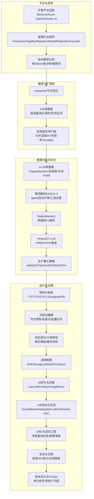
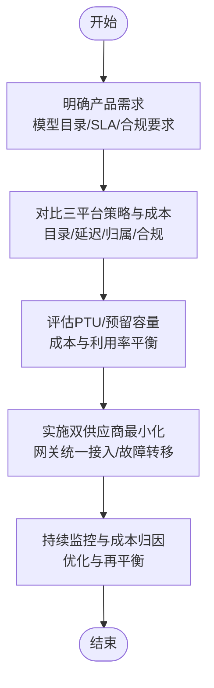
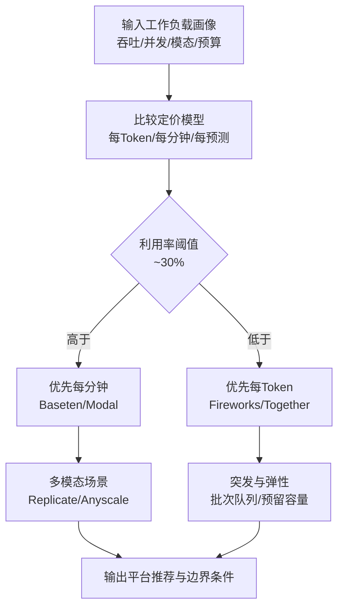
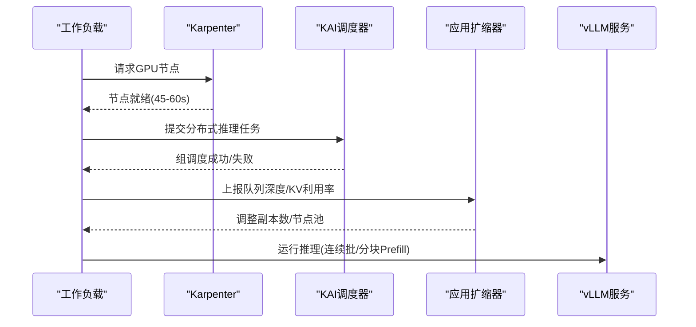
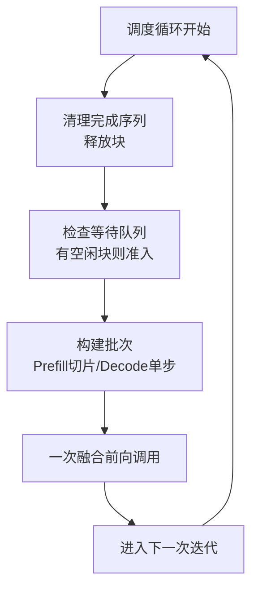
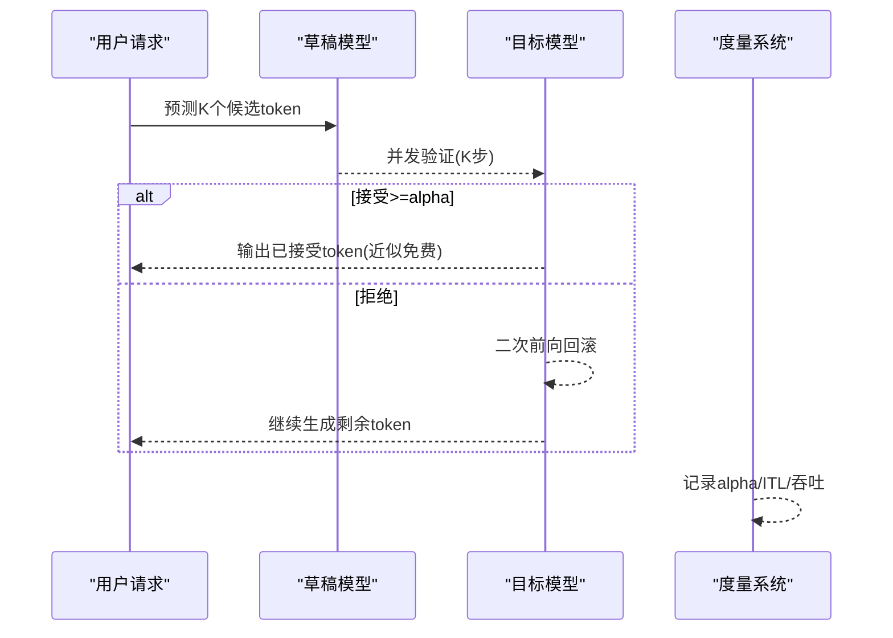

# 基础设施与生产

<cite>
**本文引用的文件**
- [README.md](file://README.md)
- [managed-llm-platforms/docs/en.md](file://phases/17-infrastructure-and-production/01-managed-llm-platforms/docs/en.md)
- [inference-platform-economics/docs/en.md](file://phases/17-infrastructure-and-production/02-inference-platform-economics/docs/en.md)
- [gpu-autoscaling-kubernetes/docs/en.md](file://phases/17-infrastructure-and-production/03-gpu-autoscaling-kubernetes/docs/en.md)
- [vllm-serving-internals/docs/en.md](file://phases/17-infrastructure-and-production/04-vllm-serving-internals/docs/en.md)
- [eagle3-speculative-decoding/docs/en.md](file://phases/17-infrastructure-and-production/05-eagle3-speculative-decoding/docs/en.md)
</cite>

## 目录
1. [引言](#引言)
2. [项目结构](#项目结构)
3. [核心组件](#核心组件)
4. [架构总览](#架构总览)
5. [详细组件分析](#详细组件分析)
6. [依赖关系分析](#依赖关系分析)
7. [性能考量](#性能考量)
8. [故障排查指南](#故障排查指南)
9. [结论](#结论)
10. [附录](#附录)

## 引言
本课程面向“基础设施与生产”阶段，系统讲解AI系统的部署、运维与优化，覆盖托管LLM平台选型（Bedrock、Azure OpenAI、Vertex AI）、推理平台经济学、GPU自动扩缩容、vLLM服务内部机制、推测解码（EAGLE-3）与RadixAttention、TensorRT-LLM、冷启动缓解、边缘推理、可观测性、AI网关、A/B测试与负载测试、安全合规与成本优化、SRE等工程实践。目标是帮助读者建立从开发到生产的完整技术栈与最佳实践。

## 项目结构
本仓库采用“阶段-课程”的组织方式，基础设施与生产阶段包含28门课程，围绕“平台选择—成本模型—调度—内核—优化—观测—安全合规—运营”主线展开。课程以“构建—使用—交付”闭环推进，既提供可运行示例，也给出可复用的技能与提示词资产。

```mermaid
graph TB
subgraph "基础设施与生产阶段"
A["托管LLM平台<br/>Bedrock/Azure OpenAI/Vertex AI"]
B["推理平台经济学<br/>Fireworks/Together/Baseten/Modal/Replicate/Anyscale"]
C["Kubernetes GPU自动扩缩容<br/>Karpenter/KAI Scheduler/应用层信号"]
D["vLLM服务内部机制<br/>PagedAttention/连续批处理/分块Prefill"]
E["推测解码EAGLE-3<br/>接受率alpha/验证开销/上线流程"]
F["RadixAttention与前缀重用<br/>前缀树KV缓存加速"]
G["TensorRT-LLM与黑体计算<br/>FP8/NVFP4/硬件原生内核"]
H["推理指标与度量<br/>TTFT/TPOT/ITL/Goodput/P99"]
I["生产量化策略<br/>AWQ/GPTQ/GGUF/FP8/NVFP4"]
J["冷启动缓解<br/>节点预热/检查点/批量队列"]
K["多区域与KV局部性<br/>跨区域路由/缓存亲和"]
L["边缘推理<br/>ANE/Hexagon/WebGPU/Jetson"]
M["可观测性栈选择<br/>链路/指标/日志/告警"]
N["提示词与语义缓存<br/>经济性与命中率"]
O["批式API与路由<br/>统一入口/按需路由"]
P["vLLM生产栈与LMCache<br/>KV离线/异构资源编排"]
Q["AI网关与灰度发布<br/>LiteLLM/Portkey/Kong/Bifrost"]
R["A/B测试与压测<br/>GrowthBook/Statsig/k6/LLMPerf/GenAI-Perf"]
S["SRE与混沌工程<br/>多智能体应急/故障演练"]
T["安全与合规<br/>密钥审计/PII清洗/合规框架"]
U["成本优化与财务运营<br/>单元经济/多租户归因"]
V["自托管选型对比<br/>llama.cpp/Ollama/TGI/vLLM/SGLang"]
end
A --> B --> C --> D --> E --> F --> G --> H --> I --> J --> K --> L --> M --> N --> O --> P --> Q --> R --> S --> T --> U --> V
```

章节来源
- [README.md:243-820](file://README.md#L243-L820)

## 核心组件
- 托管LLM平台：理解三巨头（AWS Bedrock、Azure OpenAI、Google Vertex AI）的产品策略、容量模型、计费与归属面、合规能力与锁仓风险，形成“双供应商最小化”策略。
- 推理平台经济学：区分定制芯片、GPU平台与API市场三种阵营，掌握不同定价模型（每Token/每分钟/每预测）在不同场景下的优劣与交叉点。
- GPU自动扩缩容：分三层设计（节点供应层、GPU组调度层、应用信号层），避免错误指标导致的扩缩失败与运行中断。
- vLLM内部机制：PagedAttention、连续批处理、分块Prefill三大默认组合如何协同提升吞吐与尾延迟。
- 推测解码EAGLE-3：以接受率alpha为核心度量，结合验证开销与并发，制定可验证的上线流程。
- 观测性与指标：TTFT、TPOT、ITL、Goodput、P99等关键指标的定义与监控策略。
- 安全与合规：密钥管理、PII清洗、审计日志、合规框架（SOC 2、HIPAA、GDPR、EU AI Act、ISO 42001）。
- 成本优化与财务运营：单位经济、多租户归因、FinOps方法论。

章节来源
- [managed-llm-platforms/docs/en.md:1-119](file://phases/17-infrastructure-and-production/01-managed-llm-platforms/docs/en.md#L1-L119)
- [inference-platform-economics/docs/en.md:1-136](file://phases/17-infrastructure-and-production/02-inference-platform-economics/docs/en.md#L1-L136)
- [gpu-autoscaling-kubernetes/docs/en.md:1-140](file://phases/17-infrastructure-and-production/03-gpu-autoscaling-kubernetes/docs/en.md#L1-L140)
- [vllm-serving-internals/docs/en.md:1-144](file://phases/17-infrastructure-and-production/04-vllm-serving-internals/docs/en.md#L1-L144)
- [eagle3-speculative-decoding/docs/en.md:1-111](file://phases/17-infrastructure-and-production/05-eagle3-speculative-decoding/docs/en.md#L1-L111)

## 架构总览
下图展示从“平台选择—成本建模—集群编排—推理引擎—优化—观测—安全合规—运营”的端到端生产路径。

图表来源
- [managed-llm-platforms/docs/en.md:1-119](file://phases/17-infrastructure-and-production/01-managed-llm-platforms/docs/en.md#L1-L119)
- [inference-platform-economics/docs/en.md:1-136](file://phases/17-infrastructure-and-production/02-inference-platform-economics/docs/en.md#L1-L136)
- [gpu-autoscaling-kubernetes/docs/en.md:1-140](file://phases/17-infrastructure-and-production/03-gpu-autoscaling-kubernetes/docs/en.md#L1-L140)
- [vllm-serving-internals/docs/en.md:1-144](file://phases/17-infrastructure-and-production/04-vllm-serving-internals/docs/en.md#L1-L144)
- [eagle3-speculative-decoding/docs/en.md:1-111](file://phases/17-infrastructure-and-production/05-eagle3-speculative-decoding/docs/en.md#L1-L111)

## 详细组件分析

### 组件A：托管LLM平台选型（Bedrock/Azure OpenAI/Vertex AI）
- 产品策略差异：市场目录型（Bedrock）、独占合作型（Azure OpenAI）、Gemini优先型（Vertex AI）。
- 容量模型与延迟：PTU/预留容量显著降低TTFT方差；共享容量存在竞争抖动。
- 计费与归属：Bedrock应用推理配置文件最细粒度；Vertex通过BigQuery灵活分析；Azure需额外标注或网关实现细粒度归属。
- 锁仓风险：建议“双供应商最小化”，避免错过前沿模型迭代。
- 合规与数据驻留：BAAs、HIPAA、SOC 2、GDPR、区域数据驻留等能力差异。

图表来源
- [managed-llm-platforms/docs/en.md:27-79](file://phases/17-infrastructure-and-production/01-managed-llm-platforms/docs/en.md#L27-L79)

章节来源
- [managed-llm-platforms/docs/en.md:1-119](file://phases/17-infrastructure-and-production/01-managed-llm-platforms/docs/en.md#L1-L119)

### 组件B：推理平台经济学（Fireworks/Together/Baseten/Modal/Replicate/Anyscale）
- 三大阵营：定制芯片（低延迟）、GPU平台（生态与企业化）、API市场（多模态广度）。
- 定价模型：每Token（弹性和突发）、每分钟（高稳定利用率）、每预测（图像/视频为主）。
- 交叉点：当GPU利用率超过约30%时，每分钟通常优于每Token；多模态场景优先API市场。
- 企业化能力：Truss、SOC 2、HIPAA就绪、开发者体验等差异化优势。

图表来源
- [inference-platform-economics/docs/en.md:74-91](file://phases/17-infrastructure-and-production/02-inference-platform-economics/docs/en.md#L74-L91)

章节来源
- [inference-platform-economics/docs/en.md:1-136](file://phases/17-infrastructure-and-production/02-inference-platform-economics/docs/en.md#L1-L136)

### 组件C：Kubernetes GPU自动扩缩容（Karpenter/KAI Scheduler/应用层信号）
- 分层设计：节点供应（Karpenter）、组调度（KAI）、应用信号（队列深度/KV利用率/Goodput）。
- 关键陷阱：HPA使用GPU利用率（DCGM_FI_DEV_GPU_UTIL）作为信号无效；vLLM预分配KV缓存导致内存不降反升。
- 安全策略：禁用WhenEmptyOrUnderutilized，改用WhenEmpty+延时合并；避免终止正在推理的节点。
- 混合场景：分发式推理（拆分Prefill/Decode）需要分别设置扩缩信号。

图表来源
- [gpu-autoscaling-kubernetes/docs/en.md:29-81](file://phases/17-infrastructure-and-production/03-gpu-autoscaling-kubernetes/docs/en.md#L29-L81)

章节来源
- [gpu-autoscaling-kubernetes/docs/en.md:1-140](file://phases/17-infrastructure-and-production/03-gpu-autoscaling-kubernetes/docs/en.md#L1-L140)

### 组件D：vLLM服务内部机制（PagedAttention/连续批/分块Prefill）
- PagedAttention：固定块KV分配器，碎片率<4%，与调度器精细资源配合。
- 连续批处理：每次解码迭代动态准入/释放，避免慢请求拖累。
- 分块Prefill：长提示切片与解码交错，显著降低P99 ITL，保护TTFT尾延迟。
- 版本兼容：v0.18.0中启用分块Prefill与草稿模型推测解码互斥，需谨慎选择。

图表来源
- [vllm-serving-internals/docs/en.md:72-92](file://phases/17-infrastructure-and-production/04-vllm-serving-internals/docs/en.md#L72-L92)

章节来源
- [vllm-serving-internals/docs/en.md:1-144](file://phases/17-infrastructure-and-production/04-vllm-serving-internals/docs/en.md#L1-L144)

### 组件E：推测解码EAGLE-3（接受率alpha/验证开销/上线流程）
- 核心收益：以草稿模型K步预测+目标模型一次性验证，有效token成本下降。
- 关键度量：接受率alpha，决定是否带来净增益；高并发下验证开销上升，实际break-even约0.55。
- 上线流程：先基线，再开启配置，测量alpha，若<0.55则关闭或训练领域专用草稿头，最后在生产并发下确认P99 ITL未恶化。

图表来源
- [eagle3-speculative-decoding/docs/en.md:29-57](file://phases/17-infrastructure-and-production/05-eagle3-speculative-decoding/docs/en.md#L29-L57)

章节来源
- [eagle3-speculative-decoding/docs/en.md:1-111](file://phases/17-infrastructure-and-production/05-eagle3-speculative-decoding/docs/en.md#L1-L111)

### 组件F：RadixAttention与前缀重用
- 思想：利用前缀树（Radix）对公共前缀进行KV缓存复用，减少重复计算与带宽压力。
- 场景：前缀重用密集的工作负载（如对话历史、检索增强、RAG）收益显著。
- 与vLLM：可与PagedAttention配合，在调度器层面引入前缀缓存策略，进一步降低KV碎片与带宽占用。

[本节为概念性说明，不直接分析具体源文件]

### 组件G：TensorRT-LLM与黑体计算（FP8/NVFP4）
- 硬件原生内核：针对Blackwell等新架构的FP8/NVFP4精度路径，降低显存占用与功耗。
- 适用场景：对延迟与能效敏感的在线推理，结合KV缓存与分块Prefill获得更好性价比。
- 与vLLM：可作为后端推理引擎，与vLLM的调度器形成“调度+内核”的分工。

[本节为概念性说明，不直接分析具体源文件]

### 组件H：推理指标与度量（TTFT/TPOT/ITL/Goodput/P99）
- TTFT：首Token时间，长提示主导；关注P99尾延迟。
- ITL：连续Token间隔，受批大小与内存带宽限制。
- Goodput：满足SLO的吞吐，衡量真实用户体验。
- P99：在高并发下尤为关键，避免均值掩盖尾部退化。

[本节为概念性说明，不直接分析具体源文件]

### 组件I：生产量化策略（AWQ/GPTQ/GGUF/FP8/NVFP4）
- 量化目标：在精度与性能之间找到业务可接受的折中，降低存储与传输成本。
- 适配路径：结合硬件支持（如FP8/NVFP4）与推理引擎（vLLM/TensorRT-LLM）进行端到端验证。

[本节为概念性说明，不直接分析具体源文件]

### 组件J：冷启动缓解（节点预热/检查点/批量队列）
- 节点预热：保持少量常驻工作节点，缩短首次调度等待。
- 应用层检查点：模型加载与状态持久化，减少重启成本。
- 批量队列：将突发请求合并，提高GPU利用率与吞吐。

[本节为概念性说明，不直接分析具体源文件]

### 组件K：多区域与KV局部性（跨区路由/缓存亲和）
- 路由策略：根据用户位置与可用性选择最近区域，同时考虑KV缓存亲和以减少重复计算。
- 影响因素：网络时延、区域容量、合规与数据驻留约束。

[本节为概念性说明，不直接分析具体源文件]

### 组件L：边缘推理（ANE/Hexagon/WebGPU/Jetson）
- 设备特性：移动/嵌入式设备的算力与能耗约束，需结合量化与内核裁剪。
- 典型路径：在边缘侧做轻量推理或预处理，云端做复杂生成与重排序。

[本节为概念性说明，不直接分析具体源文件]

### 组件M：可观测性栈选择（链路/指标/日志/告警）
- 链路追踪：端到端时延分解（网络/排队/预填/解码）。
- 指标体系：TTFT/ITL/Goodput/P99/利用率/错误率。
- 日志与审计：PII清洗、合规审计、异常溯源。
- 告警策略：基于SLO的阈值与聚合维度，避免噪声与漏报。

[本节为概念性说明，不直接分析具体源文件]

### 组件N：提示词与语义缓存（经济性与命中率）
- 缓存策略：对重复或高度相似的提示词进行缓存，降低预填与KV写入成本。
- 经济性：结合命中率与存储成本，权衡缓存带来的吞吐增益。

[本节为概念性说明，不直接分析具体源文件]

### 组件O：批式API与路由（统一入口/按需路由）
- 批式API：在非实时场景下提供折扣价格与更高吞吐。
- 路由策略：按模型、区域、SLA、成本进行动态路由，实现最优路径。

[本节为概念性说明，不直接分析具体源文件]

### 组件P：vLLM生产栈与LMCache（KV离线/异构资源编排）
- LMCache：将热点KV缓存离线至CPU/SSD，降低GPU显存压力。
- 异构编排：结合CPU/GPU/存储资源，实现成本与性能的平衡。

[本节为概念性说明，不直接分析具体源文件]

### 组件Q：AI网关与灰度发布（LiteLLM/Portkey/Kong/Bifrost）
- 网关能力：统一鉴权、限流、熔断、路由、故障转移。
- 灰度发布：影子流量、金丝雀、渐进式放量，结合A/B测试验证收益。

[本节为概念性说明，不直接分析具体源文件]

### 组件R：A/B测试与压测（GrowthBook/Statsig/k6/LLMPerf/GenAI-Perf）
- A/B测试：以SLO为指标，评估功能变更对用户体验与成本的影响。
- 压测工具：模拟真实流量，识别瓶颈与回归点。

[本节为概念性说明，不直接分析具体源文件]

### 组件S：SRE与混沌工程（多智能体应急/故障演练）
- 多智能体应急：自动化故障隔离、切换与恢复。
- 混沌工程：主动注入故障，验证系统韧性与恢复能力。

[本节为概念性说明，不直接分析具体源文件]

### 组件T：安全与合规（密钥/PII/审计/合规框架）
- 密钥与机密：轮换、最小权限、访问审计。
- 数据保护：PII清洗、脱敏、加密与销毁。
- 合规框架：SOC 2、HIPAA、GDPR、ISO 42001、EU AI Act。

[本节为概念性说明，不直接分析具体源文件]

### 组件U：成本优化与财务运营（单元经济/多租户归因）
- 单元经济：以请求/Token为单位的成本核算与优化。
- 多租户归因：按团队/产品/特性维度拆分成本，驱动精细化运营。

[本节为概念性说明，不直接分析具体源文件]

### 组件V：自托管选型对比（llama.cpp/Ollama/TGI/vLLM/SGLang）
- 选型维度：易用性、性能、扩展性、生态与社区支持。
- 生产建议：结合团队能力与业务规模，选择合适的自托管方案。

[本节为概念性说明，不直接分析具体源文件]

## 依赖关系分析
- 平台选择依赖于业务对模型目录、SLA、合规与成本的权衡。
- 推理平台经济学决定节点供应与扩缩策略的边界条件。
- vLLM内核与推测解码依赖于正确的指标与上线流程，避免P99退化。
- 观测性与安全合规贯穿全链路，是生产稳定性的基础。

图表来源
- [managed-llm-platforms/docs/en.md:1-119](file://phases/17-infrastructure-and-production/01-managed-llm-platforms/docs/en.md#L1-L119)
- [inference-platform-economics/docs/en.md:1-136](file://phases/17-infrastructure-and-production/02-inference-platform-economics/docs/en.md#L1-L136)
- [gpu-autoscaling-kubernetes/docs/en.md:1-140](file://phases/17-infrastructure-and-production/03-gpu-autoscaling-kubernetes/docs/en.md#L1-L140)
- [vllm-serving-internals/docs/en.md:1-144](file://phases/17-infrastructure-and-production/04-vllm-serving-internals/docs/en.md#L1-L144)
- [eagle3-speculative-decoding/docs/en.md:1-111](file://phases/17-infrastructure-and-production/05-eagle3-speculative-decoding/docs/en.md#L1-L111)

## 性能考量
- 以指标为导向：优先关注P99 ITL与TTFT尾延迟，而非平均吞吐。
- 以信号为准绳：使用队列深度、KV利用率、Goodput等更贴近推理的信号替代GPU利用率。
- 以组合为王：PagedAttention、连续批处理、分块Prefill三者协同，避免单点优化导致的副作用。
- 以度量为纲：推测解码以alpha为核心，确保在目标并发下不恶化尾延迟。

[本节为通用指导，不直接分析具体源文件]

## 故障排查指南
- 冷启动问题：检查节点预热策略与应用层检查点；观察从零到首Token的时间分布。
- 扩缩失败：确认HPA信号是否为GPU利用率；改为队列深度/KV利用率；调整Karpenter合并策略。
- 推测解码退化：测量alpha与P99 ITL；必要时关闭或训练领域专用草稿头。
- 观测缺失：完善链路追踪与指标采集，确保关键SLO可视化与告警。

章节来源
- [gpu-autoscaling-kubernetes/docs/en.md:17-26](file://phases/17-infrastructure-and-production/03-gpu-autoscaling-kubernetes/docs/en.md#L17-L26)
- [eagle3-speculative-decoding/docs/en.md:54-57](file://phases/17-infrastructure-and-production/05-eagle3-speculative-decoding/docs/en.md#L54-L57)

## 结论
基础设施与生产阶段的核心在于“以平台与成本为前提，以编排与内核为手段，以度量与治理为保障”。通过双供应商最小化、三层扩缩策略、vLLM三大默认组合与EAGLE-3的alpha驱动上线流程，辅以完善的观测、安全与成本运营，可实现稳定、高效且可持续的AI推理系统。

## 附录
- 参考阅读与定价页面链接见各课程文档末尾的“Further Reading”。