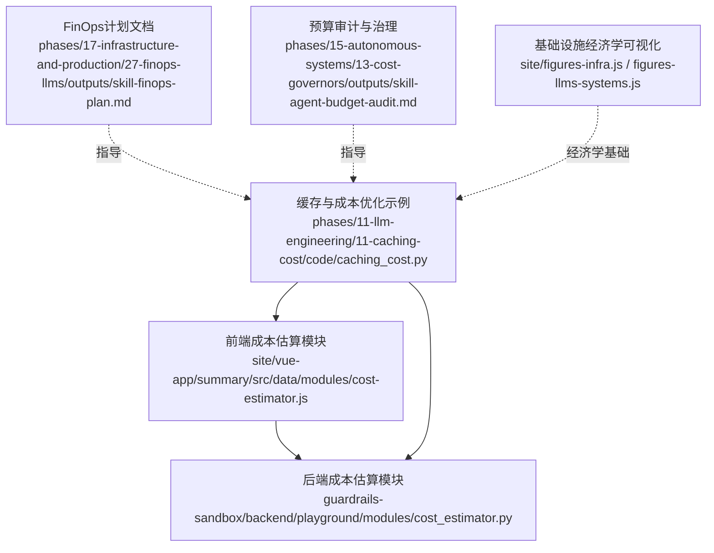
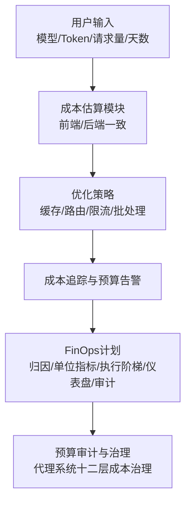
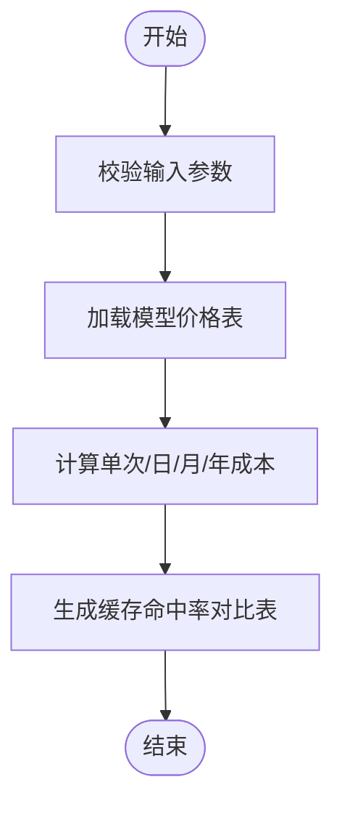
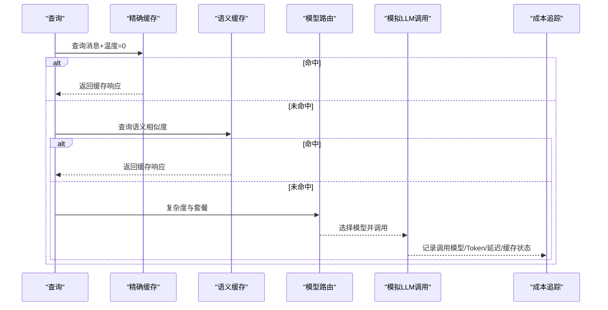
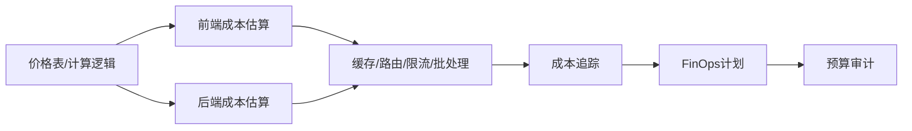

# 成本优化与财务运营

<cite>
**本文引用的文件**   
- [cost-estimator.js](file://site/vue-app/summary/src/data/modules/cost-estimator.js)
- [cost_estimator.py](file://guardrails-sandbox/backend/playground/modules/cost_estimator.py)
- [caching_cost.py](file://phases/11-llm-engineering/11-caching-cost/code/caching_cost.py)
- [skill-finops-plan.md](file://phases/17-infrastructure-and-production/27-finops-llms/outputs/skill-finops-plan.md)
- [skill-agent-budget-audit.md](file://phases/15-autonomous-systems/13-cost-governors/outputs/skill-agent-budget-audit.md)
- [cost.ts](file://phases/19-capstone-projects/09-code-migration-agent/code/ts/src/cost.ts)
- [index-CrTox38F.js](file://site/summary/assets/index-CrTox38F.js)
- [figures-infra.js](file://site/figures-infra.js)
- [figures-llms-systems.js](file://site/figures-llms-systems.js)
</cite>

## 目录
1. [引言](#引言)
2. [项目结构](#项目结构)
3. [核心组件](#核心组件)
4. [架构总览](#架构总览)
5. [详细组件分析](#详细组件分析)
6. [依赖关系分析](#依赖关系分析)
7. [性能考量](#性能考量)
8. [故障排查指南](#故障排查指南)
9. [结论](#结论)
10. [附录](#附录)

## 引言
本文件面向AI项目的财务运营（FinOps）与成本优化，系统梳理从“成本归集、预算控制、ROI分析”到“自托管LLM引擎选型”的完整方法论与实践工具。仓库中提供了多处与成本估算、缓存与路由优化、速率限制、预算审计与告警、以及基础设施经济学相关的实现与文档，能够直接支撑团队建立可落地的成本核算体系与预算规划流程。

## 项目结构
围绕成本优化与FinOps的关键模块分布如下：
- 前端成本估算模块：基于统一价格表进行月度/年度成本计算与缓存节省对比
- 后端成本估算模块：与前端逻辑一致，便于在服务端复用
- 缓存与成本优化示例：精确缓存、语义缓存、速率限制、模型路由、成本追踪与预算告警
- FinOps计划文档：定义归因、单位指标、三级执行阶梯、仪表盘与优化审计
- 预算审计与治理：针对代理系统的十二层成本治理栈
- 资本支出与基础设施经济学：通过可视化工具解释GPU单价与吞吐对“每Token成本”的影响
- 持续批处理与吞吐优化：连续批处理示意，体现吞吐提升对单位成本的直接影响

**图表来源**
- [cost-estimator.js:1-73](file://site/vue-app/summary/src/data/modules/cost-estimator.js#L1-L73)
- [cost_estimator.py:1-86](file://guardrails-sandbox/backend/playground/modules/cost_estimator.py#L1-L86)
- [caching_cost.py:1-511](file://phases/11-llm-engineering/11-caching-cost/code/caching_cost.py#L1-L511)
- [skill-finops-plan.md:1-32](file://phases/17-infrastructure-and-production/27-finops-llms/outputs/skill-finops-plan.md#L1-L32)
- [skill-agent-budget-audit.md:1-41](file://phases/15-autonomous-systems/13-cost-governors/outputs/skill-agent-budget-audit.md#L1-L41)
- [figures-infra.js:380-389](file://site/figures-infra.js#L380-L389)
- [figures-llms-systems.js:278-308](file://site/figures-llms-systems.js#L278-L308)

**章节来源**
- [cost-estimator.js:1-73](file://site/vue-app/summary/src/data/modules/cost-estimator.js#L1-L73)
- [cost_estimator.py:1-86](file://guardrails-sandbox/backend/playground/modules/cost_estimator.py#L1-L86)
- [caching_cost.py:1-511](file://phases/11-llm-engineering/11-caching-cost/code/caching_cost.py#L1-L511)
- [skill-finops-plan.md:1-32](file://phases/17-infrastructure-and-production/27-finops-llms/outputs/skill-finops-plan.md#L1-L32)
- [skill-agent-budget-audit.md:1-41](file://phases/15-autonomous-systems/13-cost-governors/outputs/skill-agent-budget-audit.md#L1-L41)
- [figures-infra.js:380-389](file://site/figures-infra.js#L380-L389)
- [figures-llms-systems.js:278-308](file://site/figures-llms-systems.js#L278-L308)

## 核心组件
- 成本估算（前后端一致）
  - 输入：模型、输入/输出token、日请求量、月天数
  - 输出：单次成本、日/月/年成本、缓存命中率对比表格
  - 价值：快速评估不同工作负载下的成本规模，指导容量与缓存策略
- 缓存与成本优化
  - 精确缓存：完全相同的输入消息命中，避免重复计费
  - 语义缓存：相似查询命中，降低输入token成本
  - 速率限制：按用户/套餐分层的令牌桶限流，防止突发超支
  - 模型路由：依据复杂度与套餐选择合适模型，平衡成本与质量
  - 成本追踪与预算告警：记录每次调用并按阈值触发预警
- FinOps计划
  - 归因：用户/任务/路由/租户四层token统计
  - 单位指标：如“每工件成本”或“每会话成本”
  - 执行阶梯：日峰值×2~3、日预算×1.5~3、z-score超限时关停
  - 仪表盘：租户/任务/用户/缓存命中率/模型路由拆分
  - 审计：检查缓存/批处理/路由/网关等优化是否到位
- 预算审计与治理（代理系统）
  - 十二层成本治理：请求级封顶、任务token/美元预算、工具调用封顶、迭代次数、滚动限额、速度限制、分级路由、提示缓存、上下文窗口、人工介入、关停开关
  - 失败场景覆盖：循环、缓慢泄漏、错误发布、合法流量洪峰
  - 杀开关外部化，明确触发与恢复流程
- 基础设施经济学
  - GPU小时单价与吞吐决定“每Token成本”，提升吞吐可直接摊薄单位成本
  - 连续批处理示意：提升GPU槽位利用率，降低空闲成本

**章节来源**
- [cost-estimator.js:1-73](file://site/vue-app/summary/src/data/modules/cost-estimator.js#L1-L73)
- [cost_estimator.py:1-86](file://guardrails-sandbox/backend/playground/modules/cost_estimator.py#L1-L86)
- [caching_cost.py:25-43](file://phases/11-llm-engineering/11-caching-cost/code/caching_cost.py#L25-L43)
- [caching_cost.py:46-94](file://phases/11-llm-engineering/11-caching-cost/code/caching_cost.py#L46-L94)
- [caching_cost.py:115-163](file://phases/11-llm-engineering/11-caching-cost/code/caching_cost.py#L115-L163)
- [caching_cost.py:165-228](file://phases/11-llm-engineering/11-caching-cost/code/caching_cost.py#L165-L228)
- [caching_cost.py:230-304](file://phases/11-llm-engineering/11-caching-cost/code/caching_cost.py#L230-L304)
- [caching_cost.py:320-328](file://phases/11-llm-engineering/11-caching-cost/code/caching_cost.py#L320-L328)
- [caching_cost.py:331-341](file://phases/11-llm-engineering/11-caching-cost/code/caching_cost.py#L331-L341)
- [caching_cost.py:344-506](file://phases/11-llm-engineering/11-caching-cost/code/caching_cost.py#L344-L506)
- [skill-finops-plan.md:10-31](file://phases/17-infrastructure-and-production/27-finops-llms/outputs/skill-finops-plan.md#L10-L31)
- [skill-agent-budget-audit.md:10-41](file://phases/15-autonomous-systems/13-cost-governors/outputs/skill-agent-budget-audit.md#L10-L41)
- [figures-infra.js:380-389](file://site/figures-infra.js#L380-L389)
- [figures-llms-systems.js:278-308](file://site/figures-llms-systems.js#L278-L308)

## 架构总览
下图展示了从“输入参数”到“成本估算/优化建议”的端到端流程，以及与FinOps治理的衔接：

**图表来源**
- [cost-estimator.js:11-54](file://site/vue-app/summary/src/data/modules/cost-estimator.js#L11-L54)
- [cost_estimator.py:38-85](file://guardrails-sandbox/backend/playground/modules/cost_estimator.py#L38-L85)
- [caching_cost.py:230-304](file://phases/11-llm-engineering/11-caching-cost/code/caching_cost.py#L230-L304)
- [skill-finops-plan.md:10-31](file://phases/17-infrastructure-and-production/27-finops-llms/outputs/skill-finops-plan.md#L10-L31)
- [skill-agent-budget-audit.md:10-41](file://phases/15-autonomous-systems/13-cost-governors/outputs/skill-agent-budget-audit.md#L10-L41)

## 详细组件分析

### 成本估算模块（前端与后端）
- 功能要点
  - 统一价格表：按模型区分输入/输出单价
  - 计算口径：单次成本、日/月/年成本
  - 缓存节省对比：按命中率展示有效成本与节省金额
- 使用建议
  - 将该模块嵌入产品定价与容量规划流程
  - 结合历史请求量与增长预测，设定月度/年度预算

**图表来源**
- [cost-estimator.js:11-54](file://site/vue-app/summary/src/data/modules/cost-estimator.js#L11-L54)
- [cost_estimator.py:38-85](file://guardrails-sandbox/backend/playground/modules/cost_estimator.py#L38-L85)

**章节来源**
- [cost-estimator.js:1-73](file://site/vue-app/summary/src/data/modules/cost-estimator.js#L1-L73)
- [cost_estimator.py:1-86](file://guardrails-sandbox/backend/playground/modules/cost_estimator.py#L1-L86)

### 缓存与成本优化（精确缓存、语义缓存、速率限制、模型路由、成本追踪）
- 精确缓存
  - 命中条件：完全相同的消息与温度为0
  - 统计指标：命中/未命中、命中率、缓存大小
- 语义缓存
  - 命中条件：查询向量相似度达到阈值
  - 统计指标：命中/未命中、命中率、缓存大小
- 速率限制
  - 分层配置：免费/专业/企业三档
  - 控制维度：令牌桶容量、补充速率、每分钟最大请求数
- 模型路由
  - 依据查询复杂度与套餐等级，自动选择合适模型
- 成本追踪与预算告警
  - 记录每次调用的模型、token、延迟、缓存状态
  - 按月度预算阈值触发预警（70%/85%/95%）

**图表来源**
- [caching_cost.py:58-93](file://phases/11-llm-engineering/11-caching-cost/code/caching_cost.py#L58-L93)
- [caching_cost.py:124-162](file://phases/11-llm-engineering/11-caching-cost/code/caching_cost.py#L124-L162)
- [caching_cost.py:320-328](file://phases/11-llm-engineering/11-caching-cost/code/caching_cost.py#L320-L328)
- [caching_cost.py:331-341](file://phases/11-llm-engineering/11-caching-cost/code/caching_cost.py#L331-L341)
- [caching_cost.py:230-304](file://phases/11-llm-engineering/11-caching-cost/code/caching_cost.py#L230-L304)

**章节来源**
- [caching_cost.py:46-94](file://phases/11-llm-engineering/11-caching-cost/code/caching_cost.py#L46-L94)
- [caching_cost.py:115-163](file://phases/11-llm-engineering/11-caching-cost/code/caching_cost.py#L115-L163)
- [caching_cost.py:165-228](file://phases/11-llm-engineering/11-caching-cost/code/caching_cost.py#L165-L228)
- [caching_cost.py:320-328](file://phases/11-llm-engineering/11-caching-cost/code/caching_cost.py#L320-L328)
- [caching_cost.py:331-341](file://phases/11-llm-engineering/11-caching-cost/code/caching_cost.py#L331-L341)
- [caching_cost.py:230-304](file://phases/11-llm-engineering/11-caching-cost/code/caching_cost.py#L230-L304)

### FinOps计划（归因、单位指标、执行阶梯、仪表盘、审计）
- 归因模式：用户/任务/路由/租户四层token统计
- 单位指标：每工件/每会话/每任务成本，与计费模型挂钩
- 执行阶梯：日峰值×2~3、日预算×1.5~3、z-score超限关停
- 仪表盘视图：租户当日花费、任务成本/产出、用户分布、缓存命中率、模型路由拆分
- 审计清单：确认缓存/批处理/路由/网关等优化均已启用

**章节来源**
- [skill-finops-plan.md:10-31](file://phases/17-infrastructure-and-production/27-finops-llms/outputs/skill-finops-plan.md#L10-L31)

### 预算审计与治理（代理系统十二层成本治理）
- 十二层治理：请求级封顶、任务token/美元预算、工具调用封顶、迭代次数、滚动限额、速度限制、分级路由、提示缓存、上下文窗口、人工介入、关停开关
- 失败场景覆盖：循环、缓慢泄漏、错误发布、合法流量洪峰
- 杀开关外部化与恢复流程
- 硬性拒绝与放宽规则，确保治理完备

**章节来源**
- [skill-agent-budget-audit.md:10-41](file://phases/15-autonomous-systems/13-cost-governors/outputs/skill-agent-budget-audit.md#L10-L41)

### 基础设施经济学与吞吐优化
- GPU小时单价与吞吐决定“每Token成本”，提升吞吐可直接摊薄单位成本
- 连续批处理示意：提升GPU槽位利用率，降低空闲成本

**章节来源**
- [figures-infra.js:380-389](file://site/figures-infra.js#L380-L389)
- [figures-llms-systems.js:278-308](file://site/figures-llms-systems.js#L278-L308)

## 依赖关系分析
- 前后端一致性：前端与后端成本估算模块共享同一价格表与计算逻辑，保证预算与成本数据一致
- 优化链路闭环：成本估算 → 缓存/路由/限流 → 成本追踪 → FinOps计划 → 预算审计
- 经济学基础：基础设施可视化工具为优化决策提供量化依据

**图表来源**
- [cost-estimator.js:4-9](file://site/vue-app/summary/src/data/modules/cost-estimator.js#L4-L9)
- [cost_estimator.py:13-18](file://guardrails-sandbox/backend/playground/modules/cost_estimator.py#L13-L18)
- [caching_cost.py:25-43](file://phases/11-llm-engineering/11-caching-cost/code/caching_cost.py#L25-L43)
- [skill-finops-plan.md:10-31](file://phases/17-infrastructure-and-production/27-finops-llms/outputs/skill-finops-plan.md#L10-L31)
- [skill-agent-budget-audit.md:10-41](file://phases/15-autonomous-systems/13-cost-governors/outputs/skill-agent-budget-audit.md#L10-L41)

**章节来源**
- [cost-estimator.js:1-73](file://site/vue-app/summary/src/data/modules/cost-estimator.js#L1-L73)
- [cost_estimator.py:1-86](file://guardrails-sandbox/backend/playground/modules/cost_estimator.py#L1-L86)
- [caching_cost.py:1-511](file://phases/11-llm-engineering/11-caching-cost/code/caching_cost.py#L1-L511)
- [skill-finops-plan.md:1-32](file://phases/17-infrastructure-and-production/27-finops-llms/outputs/skill-finops-plan.md#L1-L32)
- [skill-agent-budget-audit.md:1-41](file://phases/15-autonomous-systems/13-cost-governors/outputs/skill-agent-budget-audit.md#L1-L41)

## 性能考量
- 吞吐优先：提升GPU吞吐可显著降低“每Token成本”，适合在批处理、量化、内核优化上持续投入
- 缓存收益：高命中率可大幅减少输入token成本；结合精确缓存与语义缓存，最大化节省
- 路由与限流：按复杂度与套餐智能路由，配合速率限制，避免突发超支与资源争用
- 可观测性：通过成本追踪与预算告警，及时发现异常波动并回溯到具体模型/用户/任务

[本节为通用指导，无需特定文件引用]

## 故障排查指南
- 成本估算异常
  - 检查模型名称是否在价格表中，输入token/请求量是否为整数
  - 对比前后端模块输出，确保价格表与计算逻辑一致
- 缓存命中率低
  - 确认查询是否满足精确缓存的温度要求（需为0）
  - 调整语义缓存相似度阈值与最大容量
- 速率限制频繁触发
  - 检查用户层级配置与补充速率，必要时提高容量或降低峰值
- 预算超支
  - 查看成本追踪摘要中的预算使用率与告警级别
  - 结合模型拆分与缓存策略进行优化

**章节来源**
- [cost_estimator.py:40-53](file://guardrails-sandbox/backend/playground/modules/cost_estimator.py#L40-L53)
- [cost-estimator.js:13-26](file://site/vue-app/summary/src/data/modules/cost-estimator.js#L13-L26)
- [caching_cost.py:58-71](file://phases/11-llm-engineering/11-caching-cost/code/caching_cost.py#L58-L71)
- [caching_cost.py:124-141](file://phases/11-llm-engineering/11-caching-cost/code/caching_cost.py#L124-L141)
- [caching_cost.py:197-208](file://phases/11-llm-engineering/11-caching-cost/code/caching_cost.py#L197-L208)
- [caching_cost.py:253-261](file://phases/11-llm-engineering/11-caching-cost/code/caching_cost.py#L253-L261)
- [caching_cost.py:288-304](file://phases/11-llm-engineering/11-caching-cost/code/caching_cost.py#L288-L304)

## 结论
通过统一的价格表与成本估算、完善的缓存与路由策略、严格的速率限制与预算告警，以及可落地的FinOps计划与预算审计，团队可以建立起从“成本归集”到“预算控制”再到“持续优化”的闭环机制。结合基础设施经济学视角，持续提升吞吐与批处理效率，将显著摊薄单位成本，支撑更大规模的AI应用。

[本节为总结性内容，无需特定文件引用]

## 附录

### 成本核算模板与预算规划工具清单
- 成本估算工具
  - 前端：[cost-estimator.js:56-72](file://site/vue-app/summary/src/data/modules/cost-estimator.js#L56-L72)
  - 后端：[cost_estimator.py:21-36](file://guardrails-sandbox/backend/playground/modules/cost_estimator.py#L21-L36)
- 缓存与成本优化示例
  - [caching_cost.py:25-43](file://phases/11-llm-engineering/11-caching-cost/code/caching_cost.py#L25-L43)
  - [caching_cost.py:46-94](file://phases/11-llm-engineering/11-caching-cost/code/caching_cost.py#L46-L94)
  - [caching_cost.py:115-163](file://phases/11-llm-engineering/11-caching-cost/code/caching_cost.py#L115-L163)
  - [caching_cost.py:165-228](file://phases/11-llm-engineering/11-caching-cost/code/caching_cost.py#L165-L228)
  - [caching_cost.py:230-304](file://phases/11-llm-engineering/11-caching-cost/code/caching_cost.py#L230-L304)
- FinOps计划
  - [skill-finops-plan.md:10-31](file://phases/17-infrastructure-and-production/27-finops-llms/outputs/skill-finops-plan.md#L10-L31)
- 预算审计与治理
  - [skill-agent-budget-audit.md:10-41](file://phases/15-autonomous-systems/13-cost-governors/outputs/skill-agent-budget-audit.md#L10-L41)
- 基础设施经济学
  - [figures-infra.js:380-389](file://site/figures-infra.js#L380-L389)
  - [figures-llms-systems.js:278-308](file://site/figures-llms-systems.js#L278-L308)
- Capstone项目预算示例
  - [cost.ts:3-28](file://phases/19-capstone-projects/09-code-migration-agent/code/ts/src/cost.ts#L3-L28)

**章节来源**
- [cost-estimator.js:1-73](file://site/vue-app/summary/src/data/modules/cost-estimator.js#L1-L73)
- [cost_estimator.py:1-86](file://guardrails-sandbox/backend/playground/modules/cost_estimator.py#L1-L86)
- [caching_cost.py:1-511](file://phases/11-llm-engineering/11-caching-cost/code/caching_cost.py#L1-L511)
- [skill-finops-plan.md:1-32](file://phases/17-infrastructure-and-production/27-finops-llms/outputs/skill-finops-plan.md#L1-L32)
- [skill-agent-budget-audit.md:1-41](file://phases/15-autonomous-systems/13-cost-governors/outputs/skill-agent-budget-audit.md#L1-L41)
- [figures-infra.js:380-389](file://site/figures-infra.js#L380-L389)
- [figures-llms-systems.js:278-308](file://site/figures-llms-systems.js#L278-L308)
- [cost.ts:1-29](file://phases/19-capstone-projects/09-code-migration-agent/code/ts/src/cost.ts#L1-L29)