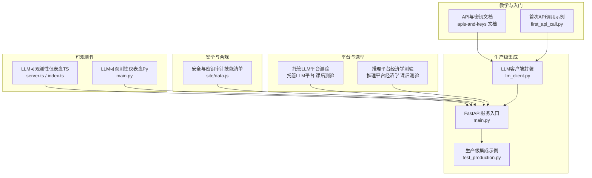
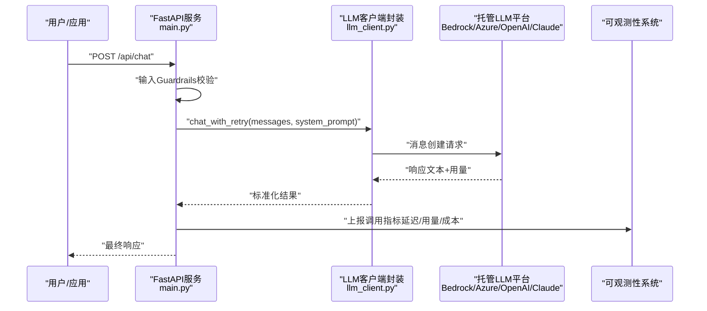
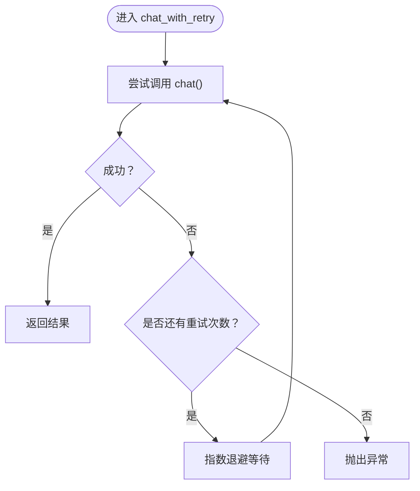
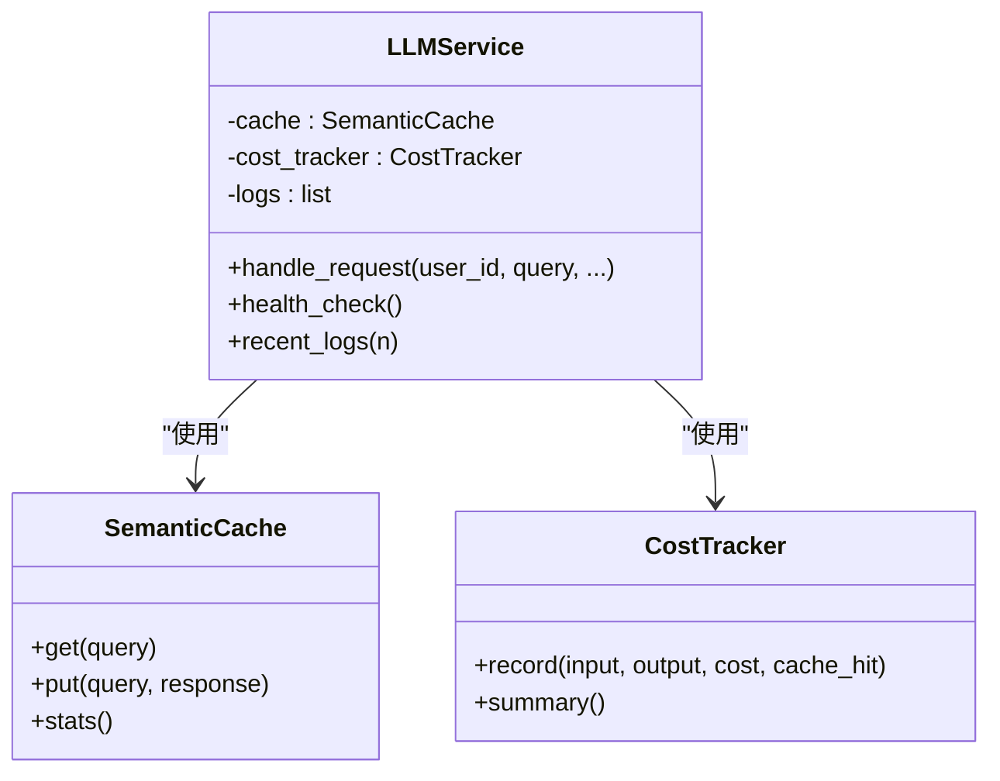
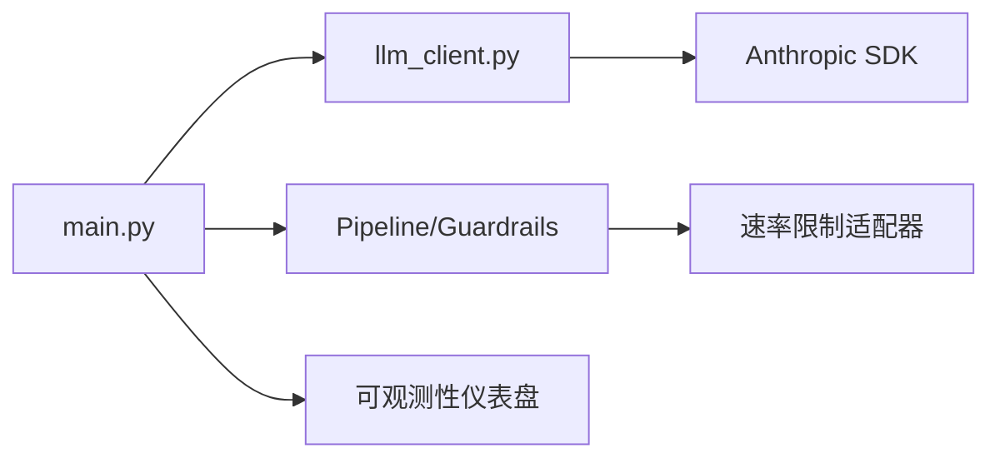

# 托管LLM平台

<cite>
**本文引用的文件**
- [llm_client.py](file://guardrails-sandbox/backend/llm_client.py)
- [main.py](file://guardrails-sandbox/backend/main.py)
- [test_production.py](file://test_production.py)
- [first_api_call.py](file://phases/00-setup-and-tooling/04-apis-and-keys/code/first_api_call.py)
- [apis-and-keys 文档](file://phases/00-setup-and-tooling/04-apis-and-keys/docs/en.md)
- [托管LLM平台 课后测验](file://phases/17-infrastructure-and-production/01-managed-llm-platforms/quiz.json)
- [托管LLM平台 课后测验（中文）](file://phases/17-infrastructure-and-production/01-managed-llm-platforms/quiz.zh.json)
- [推理平台经济学 课后测验](file://phases/17-infrastructure-and-production/02-inference-platform-economics/quiz.json)
- [推理平台经济学 课后测验（中文）](file://phases/17-infrastructure-and-production/02-inference-platform-economics/quiz.zh.json)
- [安全与密钥审计 技能清单](file://site/data.js)
- [LLM 可观测性仪表盘（TypeScript）](file://phases/19-capstone-projects/11-llm-observability-dashboard/code/ts/src/server.ts)
- [LLM 可观测性仪表盘（TypeScript）索引](file://phases/19-capstone-projects/11-llm-observability-dashboard/code/ts/src/index.ts)
- [LLM 可观测性仪表盘（Python）](file://phases/19-capstone-projects/11-llm-observability-dashboard/code/main.py)
- [速率限制适配器](file://guardrails-sandbox/backend/adapters/rate_limiter.py)
</cite>

## 目录
1. [简介](#简介)
2. [项目结构](#项目结构)
3. [核心组件](#核心组件)
4. [架构总览](#架构总览)
5. [详细组件分析](#详细组件分析)
6. [依赖分析](#依赖分析)
7. [性能考虑](#性能考虑)
8. [故障排查指南](#故障排查指南)
9. [结论](#结论)
10. [附录](#附录)

## 简介
本技术文档围绕“托管LLM平台”主题，结合仓库中的生产级示例、沙箱与教学材料，系统阐述如何在 AWS Bedrock、Azure OpenAI、Google Cloud AI（Vertex AI）、Anthropic Claude 等主流托管平台上进行架构设计、定价建模、调用集成、安全与合规、成本优化与运维落地。文档同时提供平台选择决策矩阵、迁移策略建议，并以代码路径形式给出可复用的实现参考。

## 项目结构
本仓库包含面向教学与实战的多个阶段内容，其中与托管LLM平台密切相关的部分包括：
- 教学与入门：API与密钥管理、首次调用示例
- 生产级集成：统一LLM客户端、重试与指数退避、成本追踪、语义缓存、输入输出Guardrails
- 平台经济与选择：托管平台与推理平台的经济学与选型测验
- 安全与合规：密钥与审计、合规矩阵技能
- 可观测性：LLM可观测性仪表盘（HTTP接口与聚合）

**图表来源**
- [apis-and-keys 文档](file://phases/00-setup-and-tooling/04-apis-and-keys/docs/en.md)
- [first_api_call.py](file://phases/00-setup-and-tooling/04-apis-and-keys/code/first_api_call.py)
- [llm_client.py](file://guardrails-sandbox/backend/llm_client.py)
- [main.py](file://guardrails-sandbox/backend/main.py)
- [test_production.py](file://test_production.py)
- [托管LLM平台 课后测验](file://phases/17-infrastructure-and-production/01-managed-llm-platforms/quiz.json)
- [推理平台经济学 课后测验](file://phases/17-infrastructure-and-production/02-inference-platform-economics/quiz.json)
- [安全与密钥审计 技能清单](file://site/data.js)
- [LLM 可观测性仪表盘（TypeScript）](file://phases/19-capstone-projects/11-llm-observability-dashboard/code/ts/src/server.ts)
- [LLM 可观测性仪表盘（TypeScript）索引](file://phases/19-capstone-projects/11-llm-observability-dashboard/code/ts/src/index.ts)
- [LLM 可观测性仪表盘（Python）](file://phases/19-capstone-projects/11-llm-observability-dashboard/code/main.py)

**章节来源**
- [apis-and-keys 文档](file://phases/00-setup-and-tooling/04-apis-and-keys/docs/en.md)
- [first_api_call.py](file://phases/00-setup-and-tooling/04-apis-and-keys/code/first_api_call.py)
- [llm_client.py](file://guardrails-sandbox/backend/llm_client.py)
- [main.py](file://guardrails-sandbox/backend/main.py)
- [test_production.py](file://test_production.py)
- [托管LLM平台 课后测验](file://phases/17-infrastructure-and-production/01-managed-llm-platforms/quiz.json)
- [推理平台经济学 课后测验](file://phases/17-infrastructure-and-production/02-inference-platform-economics/quiz.json)
- [安全与密钥审计 技能清单](file://site/data.js)
- [LLM 可观测性仪表盘（TypeScript）](file://phases/19-capstone-projects/11-llm-observability-dashboard/code/ts/src/server.ts)
- [LLM 可观测性仪表盘（Python）](file://phases/19-capstone-projects/11-llm-observability-dashboard/code/main.py)

## 核心组件
- 统一LLM客户端封装：提供带重试与指数退避的调用、消息格式化、基础URL与密钥管理占位
- 生产级服务管线：整合Prompt模板、语义缓存、输入/输出Guardrails、重试/Fallback、成本追踪、健康检查
- API与密钥管理：教学文档与示例脚本，演示SDK与Raw HTTP两种调用方式
- 平台选型与经济学：托管平台与推理平台的测验，覆盖延迟、成本归因、FinOps表面、利用率阈值等
- 安全与合规：密钥与审计技能清单，覆盖密钥库、PII清洗、出口白名单、审计日志与零信任
- 可观测性：LLM可观测性仪表盘，支持HTTP上报、聚合统计与可视化

**章节来源**
- [llm_client.py](file://guardrails-sandbox/backend/llm_client.py)
- [test_production.py](file://test_production.py)
- [apis-and-keys 文档](file://phases/00-setup-and-tooling/04-apis-and-keys/docs/en.md)
- [托管LLM平台 课后测验](file://phases/17-infrastructure-and-production/01-managed-llm-platforms/quiz.json)
- [推理平台经济学 课后测验](file://phases/17-infrastructure-and-production/02-inference-platform-economics/quiz.json)
- [安全与密钥审计 技能清单](file://site/data.js)
- [LLM 可观测性仪表盘（TypeScript）](file://phases/19-capstone-projects/11-llm-observability-dashboard/code/ts/src/server.ts)

## 架构总览
下图展示了从客户端到LLM平台的典型调用链路，以及在生产环境中加入的重试、指数退避、成本追踪与可观测性组件。

**图表来源**
- [main.py](file://guardrails-sandbox/backend/main.py)
- [llm_client.py](file://guardrails-sandbox/backend/llm_client.py)
- [LLM 可观测性仪表盘（TypeScript）](file://phases/19-capstone-projects/11-llm-observability-dashboard/code/ts/src/server.ts)

## 详细组件分析

### 组件A：统一LLM客户端封装（llm_client.py）
- 功能要点
  - 从环境变量读取API密钥与基础URL，支持自定义模型名
  - 提供消息格式化工具，将历史对话与当前查询拼装为标准messages
  - 对LLM调用封装，提取文本内容与用量字段
  - 带指数退避的重试机制，提升稳定性
- 关键路径
  - 客户端初始化与调用：[llm_client.py](file://guardrails-sandbox/backend/llm_client.py)
  - 重试逻辑：[llm_client.py](file://guardrails-sandbox/backend/llm_client.py)
  - 消息格式化：[llm_client.py](file://guardrails-sandbox/backend/llm_client.py)

**图表来源**
- [llm_client.py](file://guardrails-sandbox/backend/llm_client.py)

**章节来源**
- [llm_client.py](file://guardrails-sandbox/backend/llm_client.py)

### 组件B：生产级服务管线（test_production.py + main.py）
- 功能要点
  - Prompt模板管理与A/B测试分流
  - 语义缓存：基于向量相似度的命中与统计
  - 输入Guardrails：注入攻击与PII检测
  - LLM调用：重试与Fallback
  - 成本追踪：按token估算与累计
  - 健康检查：缓存与成本摘要
- 关键路径
  - 服务类与处理流程：[test_production.py](file://test_production.py)
  - FastAPI路由与Guardrails集成：[main.py](file://guardrails-sandbox/backend/main.py)
  - 速率限制适配器（Guardrails子集）：[速率限制适配器](file://guardrails-sandbox/backend/adapters/rate_limiter.py)

**图表来源**
- [test_production.py](file://test_production.py)

**章节来源**
- [test_production.py](file://test_production.py)
- [main.py](file://guardrails-sandbox/backend/main.py)
- [速率限制适配器](file://guardrails-sandbox/backend/adapters/rate_limiter.py)

### 组件C：API与密钥管理（apis-and-keys 文档 + first_api_call.py）
- 功能要点
  - 使用环境变量存储密钥，避免硬编码
  - SDK与Raw HTTP两种调用方式，便于调试与兼容
  - 提供常见错误诊断与排障清单
- 关键路径
  - 教学文档与示例脚本：[apis-and-keys 文档](file://phases/00-setup-and-tooling/04-apis-and-keys/docs/en.md)
  - 示例脚本（SDK与Raw HTTP）：[first_api_call.py](file://phases/00-setup-and-tooling/04-apis-and-keys/code/first_api_call.py)

**章节来源**
- [apis-and-keys 文档](file://phases/00-setup-and-tooling/04-apis-and-keys/docs/en.md)
- [first_api_call.py](file://phases/00-setup-and-tooling/04-apis-and-keys/code/first_api_call.py)

### 组件D：平台选型与经济学（托管LLM平台测验 + 推理平台经济学测验）
- 内容要点
  - 托管平台测验：Bedrock、Azure OpenAI、Vertex AI 的特性、成本归因、FinOps表面、TTFT差异、PTU盈亏平衡等
  - 推理平台测验：2026年推理供应商的三大市场细分、按分钟与按token计费切换点、平台能力差异（如Python原生Serverless、冷启动）
- 关键路径
  - 托管平台测验（英文/中文）：[托管LLM平台 课后测验](file://phases/17-infrastructure-and-production/01-managed-llm-platforms/quiz.json)、[托管LLM平台 课后测验（中文）](file://phases/17-infrastructure-and-production/01-managed-llm-platforms/quiz.zh.json)
  - 推理平台经济学测验（英文/中文）：[推理平台经济学 课后测验](file://phases/17-infrastructure-and-production/02-inference-platform-economics/quiz.json)、[推理平台经济学 课后测验（中文）](file://phases/17-infrastructure-and-production/02-inference-platform-economics/quiz.zh.json)

**章节来源**
- [托管LLM平台 课后测验](file://phases/17-infrastructure-and-production/01-managed-llm-platforms/quiz.json)
- [托管LLM平台 课后测验（中文）](file://phases/17-infrastructure-and-production/01-managed-llm-platforms/quiz.zh.json)
- [推理平台经济学 课后测验](file://phases/17-infrastructure-and-production/02-inference-platform-economics/quiz.json)
- [推理平台经济学 课后测验（中文）](file://phases/17-infrastructure-and-production/02-inference-platform-economics/quiz.zh.json)

### 组件E：安全与合规（密钥与审计技能清单）
- 内容要点
  - 生成LLM安全计划：密钥库、一致化令牌化PII清洗、网络出口白名单、审计日志保留、零信任安全姿态
  - 合规矩阵：映射SOC 2、HIPAA、GDPR、PCI-DSS、EU AI Act、Colorado AI Act、ISO 42001等
- 关键路径
  - 技能清单（英文/中文）：[安全与密钥审计 技能清单](file://site/data.js)

**章节来源**
- [安全与密钥审计 技能清单](file://site/data.js)

### 组件F：可观测性（LLM可观测性仪表盘）
- 功能要点
  - HTTP接口接收遥测（/trace），聚合统计（计数、错误、Token、成本、延迟分位）
  - 可视化仪表盘（HTML表格），支持滚动聚合与健康检查端点
- 关键路径
  - TypeScript服务端与路由：[LLM 可观测性仪表盘（TypeScript）](file://phases/19-capstone-projects/11-llm-observability-dashboard/code/ts/src/server.ts)
  - TS主程序与服务启动：[LLM 可观测性仪表盘（TypeScript）索引](file://phases/19-capstone-projects/11-llm-observability-dashboard/code/ts/src/index.ts)
  - Python可观测性示例（对照）：[LLM 可观测性仪表盘（Python）](file://phases/19-capstone-projects/11-llm-observability-dashboard/code/main.py)

**章节来源**
- [LLM 可观测性仪表盘（TypeScript）](file://phases/19-capstone-projects/11-llm-observability-dashboard/code/ts/src/server.ts)
- [LLM 可观测性仪表盘（TypeScript）索引](file://phases/19-capstone-projects/11-llm-observability-dashboard/code/ts/src/index.ts)
- [LLM 可观测性仪表盘（Python）](file://phases/19-capstone-projects/11-llm-observability-dashboard/code/main.py)

## 依赖分析
- 组件耦合
  - main.py 依赖 llm_client.py 进行LLM调用；test_production.py 提供生产级服务类与管线，可在本地或沙箱中复用
  - 速率限制适配器作为Guardrails子集，与main.py的Pipeline协同工作
  - 可观测性组件独立于业务逻辑，通过HTTP接口接入
- 外部依赖
  - Anthropic SDK（示例与教学）
  - FastAPI、uvicorn（服务）
  - HuggingFace离线模式（语义模型加载）

**图表来源**
- [main.py](file://guardrails-sandbox/backend/main.py)
- [llm_client.py](file://guardrails-sandbox/backend/llm_client.py)
- [速率限制适配器](file://guardrails-sandbox/backend/adapters/rate_limiter.py)
- [LLM 可观测性仪表盘（TypeScript）](file://phases/19-capstone-projects/11-llm-observability-dashboard/code/ts/src/server.ts)

**章节来源**
- [main.py](file://guardrails-sandbox/backend/main.py)
- [llm_client.py](file://guardrails-sandbox/backend/llm_client.py)
- [速率限制适配器](file://guardrails-sandbox/backend/adapters/rate_limiter.py)
- [LLM 可观测性仪表盘（TypeScript）](file://phases/19-capstone-projects/11-llm-observability-dashboard/code/ts/src/server.ts)

## 性能考虑
- 延迟与吞吐
  - 测验显示Azure PTU在中等利用率（~40-60%）下较按需更具成本优势；Bedrock与Azure在TTFT方面存在差距
- 成本优化
  - 语义缓存命中可显著降低token用量与成本；按分钟计费在高利用率场景下优于按token计费
- 可靠性
  - 指数退避与重试可提升失败恢复能力；Fallback兜底保障用户体验

**章节来源**
- [托管LLM平台 课后测验](file://phases/17-infrastructure-and-production/01-managed-llm-platforms/quiz.json)
- [推理平台经济学 课后测验](file://phases/17-infrastructure-and-production/02-inference-platform-economics/quiz.json)
- [test_production.py](file://test_production.py)

## 故障排查指南
- 密钥与认证
  - 确认环境变量设置正确；优先使用SDK进行调用，必要时回退到Raw HTTP定位问题
- 速率限制
  - 通过速率限制适配器与Guardrails日志定位限流原因与重试时机
- 成本与用量
  - 使用成本追踪与可观测性仪表盘核对用量与费用，识别异常波动
- 健康检查
  - 通过服务健康端点快速判断缓存与成本状态

**章节来源**
- [apis-and-keys 文档](file://phases/00-setup-and-tooling/04-apis-and-keys/docs/en.md)
- [速率限制适配器](file://guardrails-sandbox/backend/adapters/rate_limiter.py)
- [test_production.py](file://test_production.py)
- [LLM 可观测性仪表盘（TypeScript）](file://phases/19-capstone-projects/11-llm-observability-dashboard/code/ts/src/server.ts)

## 结论
本仓库提供了从API密钥管理、首次调用、生产级集成到平台选型与成本优化的完整实践路径。通过统一LLM客户端封装、生产级服务管线、Guardrails与可观测性体系，可有效支撑从开发到生产的端到端落地。平台侧建议采用双供应商策略以规避前沿模型轮换风险，并结合FinOps归因与预算控制实现可持续的成本治理。

## 附录

### 平台选择决策矩阵（基于测验与实践）
- 选型维度
  - 模型生态：是否支持Claude、Llama、Cohere等多模型统一API
  - 成本归因：CloudWatch原生、BigQuery灵活性、或需外部Instrumentation
  - FinOps表面：原生清晰度、可扩展性与审计友好性
  - TTFT与SLA：按需与PTU的延迟差异与稳定性
  - 合规与安全：SOC 2、HIPAA、GDPR、AI法案等合规能力
- 参考依据
  - 托管平台测验（英文/中文）：[托管LLM平台 课后测验](file://phases/17-infrastructure-and-production/01-managed-llm-platforms/quiz.json)、[托管LLM平台 课后测验（中文）](file://phases/17-infrastructure-and-production/01-managed-llm-platforms/quiz.zh.json)
  - 推理平台经济学测验（英文/中文）：[推理平台经济学 课后测验](file://phases/17-infrastructure-and-production/02-inference-platform-economics/quiz.json)、[推理平台经济学 课后测验（中文）](file://phases/17-infrastructure-and-production/02-inference-platform-economics/quiz.zh.json)

**章节来源**
- [托管LLM平台 课后测验](file://phases/17-infrastructure-and-production/01-managed-llm-platforms/quiz.json)
- [托管LLM平台 课后测验（中文）](file://phases/17-infrastructure-and-production/01-managed-llm-platforms/quiz.zh.json)
- [推理平台经济学 课后测验](file://phases/17-infrastructure-and-production/02-inference-platform-economics/quiz.json)
- [推理平台经济学 课后测验（中文）](file://phases/17-infrastructure-and-production/02-inference-platform-economics/quiz.zh.json)

### 迁移策略建议
- 分阶段迁移
  - 开发/测试：使用本地或沙箱（llm_client.py + main.py）
  - 预生产：启用语义缓存与成本追踪（test_production.py）
  - 生产：引入Guardrails、可观测性与双供应商策略
- 风险控制
  - 保持SDK与Raw HTTP双通道，便于排障
  - 通过A/B测试与容量规划验证平台切换影响

**章节来源**
- [llm_client.py](file://guardrails-sandbox/backend/llm_client.py)
- [main.py](file://guardrails-sandbox/backend/main.py)
- [test_production.py](file://test_production.py)

### 实际代码示例（路径指引）
- 首次调用（SDK与Raw HTTP）
  - [apis-and-keys 文档](file://phases/00-setup-and-tooling/04-apis-and-keys/docs/en.md)
  - [first_api_call.py](file://phases/00-setup-and-tooling/04-apis-and-keys/code/first_api_call.py)
- 统一LLM客户端封装
  - [llm_client.py](file://guardrails-sandbox/backend/llm_client.py)
- 生产级服务管线
  - [test_production.py](file://test_production.py)
- 可观测性仪表盘
  - [LLM 可观测性仪表盘（TypeScript）](file://phases/19-capstone-projects/11-llm-observability-dashboard/code/ts/src/server.ts)
  - [LLM 可观测性仪表盘（TypeScript）索引](file://phases/19-capstone-projects/11-llm-observability-dashboard/code/ts/src/index.ts)
  - [LLM 可观测性仪表盘（Python）](file://phases/19-capstone-projects/11-llm-observability-dashboard/code/main.py)