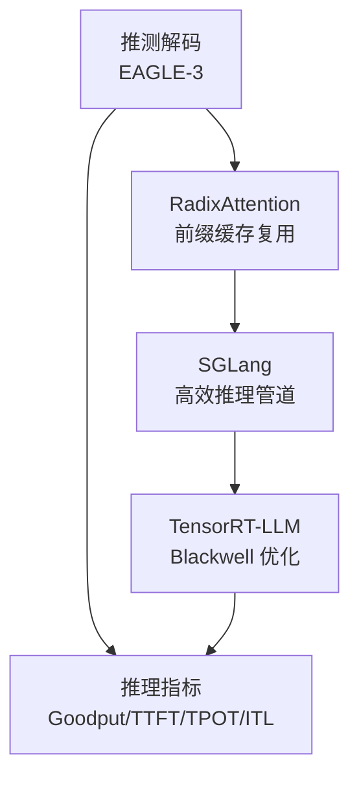
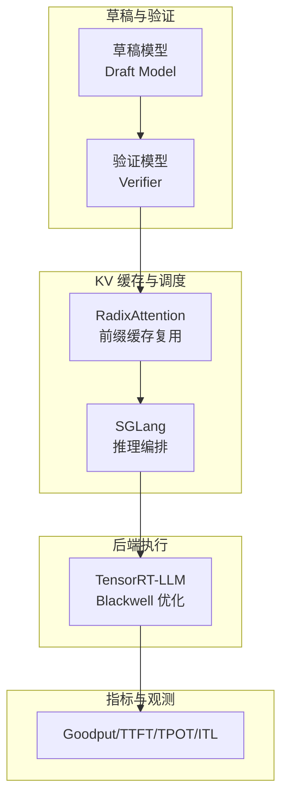
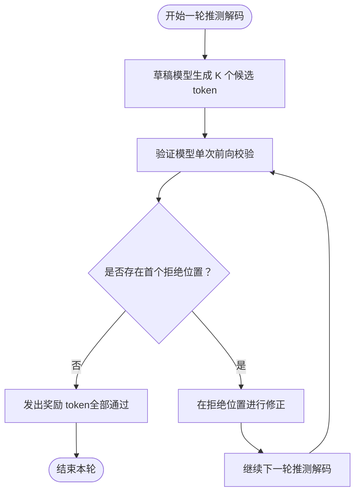
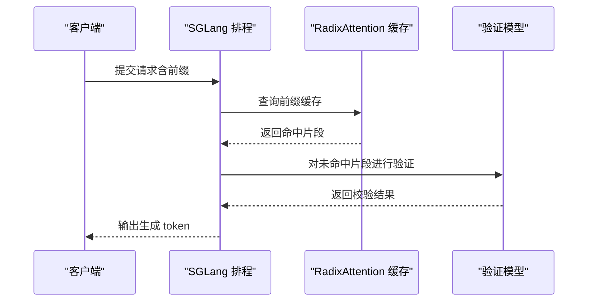
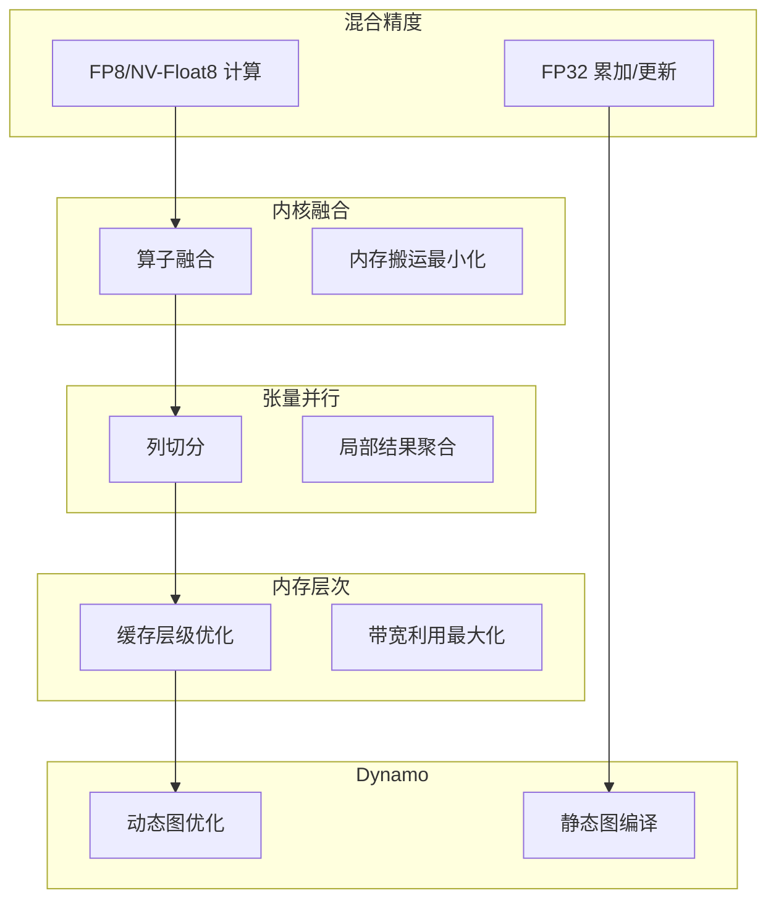
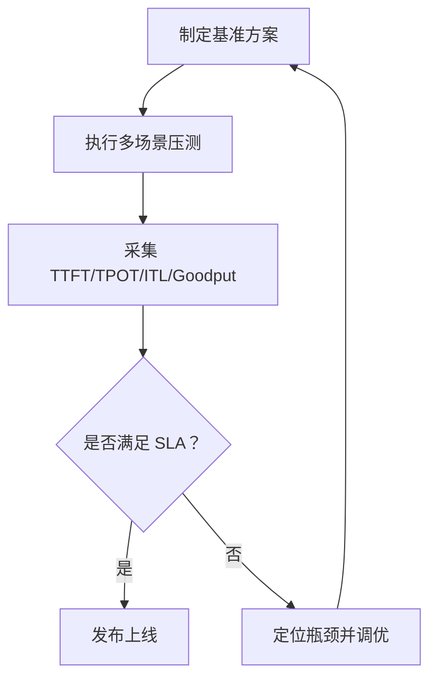
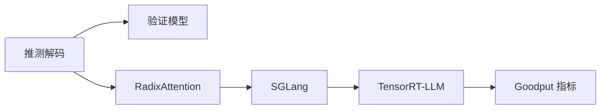

# 推测解码与推理优化

<cite>
**本文引用的文件**
- [site/data.js](file://site/data.js)
- [site/figures-llms-systems.js](file://site/figures-llms-systems.js)
- [site/figures-transformers.js](file://site/figures-transformers.js)
- [phases/17-infrastructure-and-production/05-eagle3-speculative-decoding/docs](file://phases/17-infrastructure-and-production/05-eagle3-speculative-decoding/docs)
- [phases/17-infrastructure-and-production/06-sglang-radixattention/docs](file://phases/17-infrastructure-and-production/06-sglang-radixattention/docs)
- [phases/17-infrastructure-and-production/07-tensorrt-llm-blackwell/docs](file://phases/17-infrastructure-and-production/07-tensorrt-llm-blackwell/docs)
- [phases/17-infrastructure-and-production/08-inference-metrics-goodput/docs](file://phases/17-infrastructure-and-production/08-inference-metrics-goodput/docs)
- [glossary/terms.md](file://glossary/terms.md)
</cite>

## 目录
1. [引言](#引言)
2. [项目结构](#项目结构)
3. [核心组件](#核心组件)
4. [架构总览](#架构总览)
5. [详细组件分析](#详细组件分析)
6. [依赖关系分析](#依赖关系分析)
7. [性能考量](#性能考量)
8. [故障排查指南](#故障排查指南)
9. [结论](#结论)
10. [附录](#附录)

## 引言
本文件面向“推测解码与推理优化”课程，系统梳理并解读仓库中关于推测解码（Speculative Decoding）、RadixAttention 内存优化、SGLang 高效推理管道以及 TensorRT-LLM 在 NVIDIA Blackwell 架构上的优化策略。通过对仓库内教学资料与可视化脚本的分析，我们构建了从原理到实践、从概念到代码级流程的完整知识图谱，并提供可操作的性能基准与调优建议。

## 项目结构
该仓库以“阶段-主题”的方式组织内容，其中第 17 阶段聚焦基础设施与生产化，包含多篇关于推理优化与系统工程的深度文档与可视化素材。本次文档重点涉及以下四个模块：
- 推测解码：EAGLE-3 实战与 alpha 测量
- RadixAttention：前缀缓存复用与内存优化
- SGLang：高效推理流水线与调度
- TensorRT-LLM：Blackwell 架构下的混合精度、内核融合与内存层次优化
- 推理指标：Goodput 与端到端时延指标体系

**章节来源**
- [site/data.js:3415-3421](file://site/data.js#L3415-L3421)
- [site/data.js:16977-17017](file://site/data.js#L16977-L17017)

## 核心组件
- 推测解码（Speculative Decoding）
  - 草稿模型（Draft Model）与验证模型（Verifier）协同：草稿模型一次性生成 K 个候选 token，验证模型以单次前向校验接受序列；未通过的首个位置触发修正，后续继续迭代。
  - 关键度量：草稿长度 γ、接受率 α；期望被接受的前缀长度决定整体吞吐增益。
- RadixAttention
  - 基于前缀树（Radix Tree）的 KV 缓存复用，显著降低重复前缀带来的内存与带宽压力，适合长上下文与高重叠请求场景。
- SGLang
  - 面向长上下文与高并发的推理编排框架，结合 RadixAttention 可实现更高效的前缀缓存命中与流水线调度。
- TensorRT-LLM（NVIDIA Blackwell）
  - 混合精度（FP8/NV-Float8 等）、内核融合、张量并行、内存层次优化与 Dynamo 集成，针对 Blackwell 架构的高带宽与高算力特性进行深度适配。
- 推理指标（Goodput）
  - 以“有效吞吐”为核心指标，关注 TTFT、TPOT、ITL 等端到端时延，强调对真实业务 SLA 的保障能力。

**章节来源**
- [site/figures-llms-systems.js:73-98](file://site/figures-llms-systems.js#L73-L98)
- [site/figures-transformers.js:439-443](file://site/figures-transformers.js#L439-L443)
- [site/data.js:16977-17017](file://site/data.js#L16977-L17017)
- [glossary/terms.md:220-222](file://glossary/terms.md#L220-L222)

## 架构总览
下图展示了从草稿模型到验证模型，再到 RadixAttention 缓存与 SGLang 推理管线，最终由 TensorRT-LLM 在 Blackwell 上落地的端到端优化链路。同时，Goodput 指标贯穿始终，用于衡量真实业务价值。

**图表来源**
- [site/figures-llms-systems.js:73-98](file://site/figures-llms-systems.js#L73-L98)
- [site/data.js:16977-17017](file://site/data.js#L16977-L17017)

## 详细组件分析

### 组件一：推测解码（EAGLE-3）
- 工作原理
  - 草稿模型一次性生成 K 个候选 token；验证模型以单次前向校验接受序列；首个拒绝位置触发修正，随后继续迭代。
  - 期望被接受的前缀长度受草稿长度 γ 与接受率 α 共同影响，整体吞吐近似与每轮验证所替代的序列步数成正比。
- 性能优势
  - 显著减少目标模型的计算步数，提升吞吐；在高接受率场景下收益尤为明显。
- 生产落地要点
  - 需要在真实流量上测量接受率 α，制定分阶段上线策略，确保对业务 SLA 的正向贡献。

**图表来源**
- [site/figures-llms-systems.js:73-98](file://site/figures-llms-systems.js#L73-L98)

**章节来源**
- [site/figures-llms-systems.js:73-98](file://site/figures-llms-systems.js#L73-L98)
- [site/data.js:3415-3421](file://site/data.js#L3415-L3421)

### 组件二：RadixAttention 与 SGLang
- RadixAttention
  - 通过前缀树缓存共享，避免重复计算与传输，显著降低 KV 缓存占用与带宽压力，适合高重叠请求与长上下文场景。
- SGLang
  - 提供面向长上下文与高并发的推理编排能力，结合 RadixAttention 可实现更高效的前缀缓存命中与流水线调度。
- 协同机制
  - SGLang 将请求按前缀排序与批处理，RadixAttention 复用公共前缀，二者配合可获得更高的缓存命中率与更低的时延。

**图表来源**
- [site/data.js:16977-17017](file://site/data.js#L16977-L17017)

**章节来源**
- [site/data.js:16977-17017](file://site/data.js#L16977-L17017)

### 组件三：TensorRT-LLM 在 NVIDIA Blackwell 上的优化
- 混合精度
  - 使用 FP8/NV-Float8 等低精度执行，结合 FP32 梯度累积与权重更新，兼顾速度与稳定性。
- 内核融合与张量并行
  - 将多个算子融合为单一内核，减少内存搬运与同步开销；张量并行拆分矩阵乘法列，跨 GPU 收集局部结果。
- 内存层次优化
  - 针对 Blackwell 的高带宽与高算力特性，优化显存访问模式与缓存层级，最大化内存与计算利用率。
- Dynamo 集成
  - 通过动态图优化与静态图编译，进一步降低运行时开销，提升端到端吞吐。

**图表来源**
- [site/data.js:16977-17017](file://site/data.js#L16977-L17017)
- [glossary/terms.md:220-222](file://glossary/terms.md#L220-L222)

**章节来源**
- [site/data.js:16977-17017](file://site/data.js#L16977-L17017)
- [glossary/terms.md:220-222](file://glossary/terms.md#L220-L222)

### 组件四：推理指标与 Goodput
- 指标体系
  - Goodput：以“有效吞吐”为核心，关注端到端时延（TTFT、TPOT、ITL）与百分位表现（P50/P90/P99），确保对真实业务 SLA 的保障。
- 基准方法
  - 在部署流水线上集成 Goodput 指标门禁，结合持续集成/部署流程，形成可审计的性能回归与发布策略。

**图表来源**
- [site/data.js:17002-17017](file://site/data.js#L17002-L17017)

**章节来源**
- [site/data.js:17002-17017](file://site/data.js#L17002-L17017)

## 依赖关系分析
- 组件耦合
  - 推测解码依赖验证模型的快速校验能力；RadixAttention 依赖 SGLang 的请求排序与批处理；SGLang 依赖 TensorRT-LLM 的高性能执行后端。
- 外部依赖
  - TensorRT-LLM 与 NVIDIA Blackwell 架构紧密耦合，需考虑硬件特性与驱动版本；混合精度与内核融合策略需与具体算子实现匹配。
- 潜在环路
  - 文档与可视化脚本之间无直接循环依赖；推理指标作为门禁贯穿各组件，不构成控制环路。

**图表来源**
- [site/figures-llms-systems.js:73-98](file://site/figures-llms-systems.js#L73-L98)
- [site/data.js:16977-17017](file://site/data.js#L16977-L17017)
- [site/data.js:17002-17017](file://site/data.js#L17002-L17017)

## 性能考量
- 推测解码
  - 选择合适的草稿长度 γ 与高接受率 α 是关键；在高并发场景下，需评估草稿模型与验证模型的资源占用与延迟权衡。
- RadixAttention 与 SGLang
  - 请求前缀排序与批处理策略直接影响缓存命中率；需结合业务特征（如长上下文、高重叠）进行参数调优。
- TensorRT-LLM（Blackwell）
  - 混合精度与内核融合策略需与硬件带宽与算力相匹配；张量并行规模需考虑拓扑与通信开销。
- 指标与回归
  - 以 Goodput 为核心的指标门禁可有效避免“看似高速但业务无感”的陷阱；建议在 CI/CD 中强制执行。

[本节为通用指导，无需列出章节来源]

## 故障排查指南
- 调试 AI/ML 代码的难点
  - AI 错误通常不会崩溃，而是产生“看起来正确但实际错误”的输出；应通过可视化与指标监控定位问题。
- 性能分析器的作用
  - 关注函数级时间与内存消耗、GPU 利用率与带宽使用情况，识别瓶颈并制定优化策略。
- 推测解码上线风险
  - 在真实流量上测量接受率 α，制定分阶段 rollout 计划，避免对 SLA 造成负面影响。

**章节来源**
- [phases/00-setup-and-tooling/12-debugging-and-profiling/quiz.json:1-19](file://phases/00-setup-and-tooling/12-debugging-and-profiling/quiz.json#L1-L19)
- [phases/00-setup-and-tooling/12-debugging-and-profiling/quiz.zh.json:1-21](file://phases/00-setup-and-tooling/12-debugging-and-profiling/quiz.zh.json#L1-L21)

## 结论
本课程围绕“推测解码—RadixAttention—SGLang—TensorRT-LLM—Goodput 指标”构建了完整的推理优化知识体系。通过可视化脚本与实战文档的结合，既提供了高层理解，也给出了可操作的落地路径。建议在真实业务中以 Goodput 为导向，分阶段引入推测解码与 RadixAttention，并在 Blackwell 平台上结合混合精度与内核融合实现极致性能。

[本节为总结性内容，无需列出章节来源]

## 附录
- 相关术语
  - 混合精度：在保证数值稳定性的前提下，使用低精度执行以提升吞吐与节省显存。
- 参考路径
  - 推测解码与 EAGLE-3：见“phases/17-infrastructure-and-production/05-eagle3-speculative-decoding”
  - RadixAttention 与 SGLang：见“phases/17-infrastructure-and-production/06-sglang-radixattention”
  - TensorRT-LLM 与 Blackwell：见“phases/17-infrastructure-and-production/07-tensorrt-llm-blackwell”
  - 推理指标与 Goodput：见“phases/17-infrastructure-and-production/08-inference-metrics-goodput”

**章节来源**
- [glossary/terms.md:220-222](file://glossary/terms.md#L220-L222)
- [site/data.js:3415-3421](file://site/data.js#L3415-L3421)
- [site/data.js:16977-17017](file://site/data.js#L16977-L17017)
- [site/data.js:17002-17017](file://site/data.js#L17002-L17017)