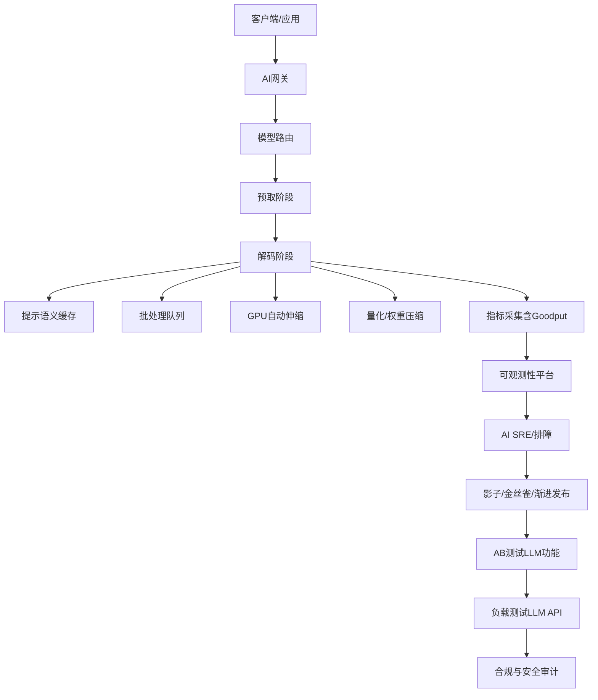
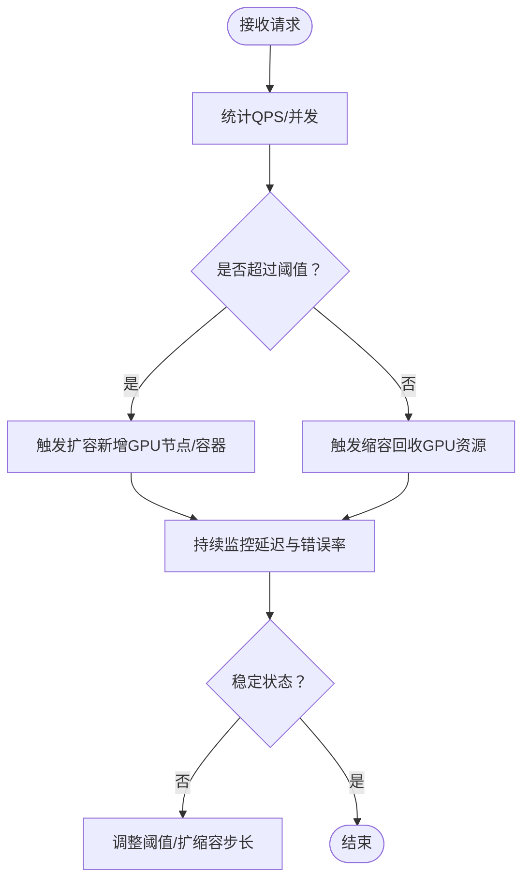
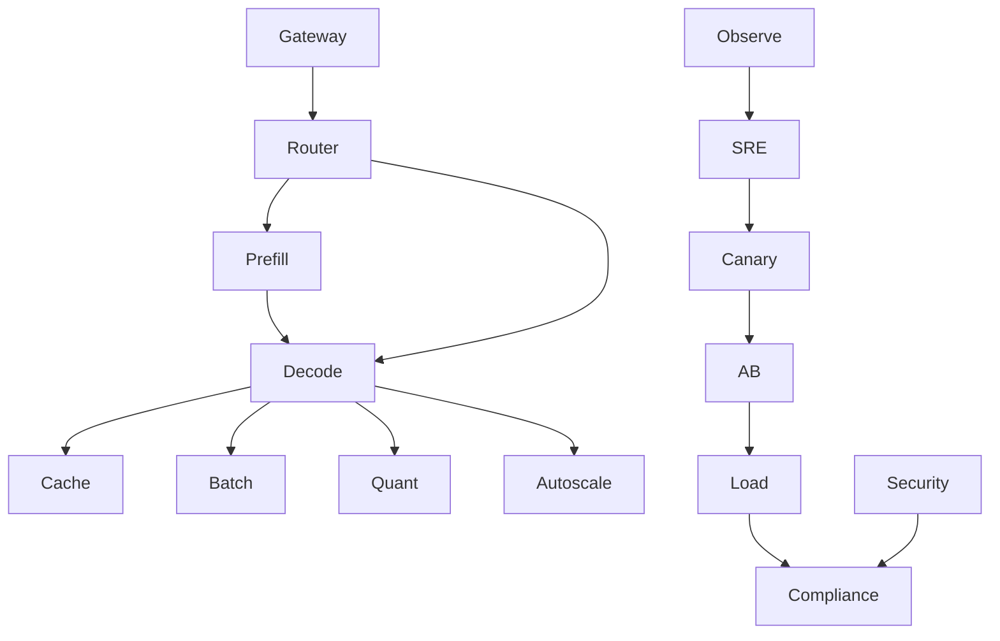

# 推理平台经济学

<cite>
**本文引用的文件**
- [phases/17-infrastructure-and-production/README.md](file://phases/17-infrastructure-and-production/README.md)
- [phases/17-infrastructure-and-production/02-inference-platform-economics/docs/README.md](file://phases/17-infrastructure-and-production/02-inference-platform-economics/docs/README.md)
- [phases/17-infrastructure-and-production/02-inference-platform-economics/code/README.md](file://phases/17-infrastructure-and-production/02-inference-platform-economics/code/README.md)
- [phases/17-infrastructure-and-production/03-gpu-autoscaling-kubernetes/docs/README.md](file://phases/17-infrastructure-and-production/03-gpu-autoscaling-kubernetes/docs/README.md)
- [phases/17-infrastructure-and-production/04-vllm-serving-internals/docs/README.md](file://phases/17-infrastructure-and-production/04-vllm-serving-internals/docs/README.md)
- [phases/17-infrastructure-and-production/08-inference-metrics-goodput/docs/README.md](file://phases/17-infrastructure-and-production/08-inference-metrics-goodput/docs/README.md)
- [phases/17-infrastructure-and-production/09-production-quantization/docs/README.md](file://phases/17-infrastructure-and-production/09-production-quantization/docs/README.md)
- [phases/17-infrastructure-and-production/14-prompt-semantic-caching/docs/README.md](file://phases/17-infrastructure-and-production/14-prompt-semantic-caching/docs/README.md)
- [phases/17-infrastructure-and-production/15-batch-apis/docs/README.md](file://phases/17-infrastructure-and-production/15-batch-apis/docs/README.md)
- [phases/17-infrastructure-and-production/17-disaggregated-prefill-decode/docs/README.md](file://phases/17-infrastructure-and-production/17-disaggregated-prefill-decode/docs/README.md)
- [phases/17-infrastructure-and-production/27-finops-llms/docs/README.md](file://phases/17-infrastructure-and-production/27-finops-llms/docs/README.md)
- [phases/17-infrastructure-and-production/28-self-hosted-serving-selection/docs/README.md](file://phases/17-infrastructure-and-production/28-self-hosted-serving-selection/docs/README.md)
- [phases/17-infrastructure-and-production/01-managed-llm-platforms/docs/README.md](file://phases/17-infrastructure-and-production/01-managed-llm-platforms/docs/README.md)
- [phases/17-infrastructure-and-production/05-eagle3-speculative-decoding/docs/README.md](file://phases/17-infrastructure-and-production/05-eagle3-speculative-decoding/docs/README.md)
- [phases/17-infrastructure-and-production/06-sglang-radixattention/docs/README.md](file://phases/17-infrastructure-and-production/06-sglang-radixattention/docs/README.md)
- [phases/17-infrastructure-and-production/10-cold-start-mitigation/docs/README.md](file://phases/17-infrastructure-and-production/10-cold-start-mitigation/docs/README.md)
- [phases/17-infrastructure-and-production/11-multi-region-kv-locality/docs/README.md](file://phases/17-infrastructure-and-production/11-multi-region-kv-locality/docs/README.md)
- [phases/17-infrastructure-and-production/12-edge-inference/docs/README.md](file://phases/17-infrastructure-and-production/12-edge-inference/docs/README.md)
- [phases/17-infrastructure-and-production/13-llm-observability/docs/README.md](file://phases/17-infrastructure-and-production/13-llm-observability/docs/README.md)
- [phases/17-infrastructure-and-production/16-model-routing/docs/README.md](file://phases/17-infrastructure-and-production/16-model-routing/docs/README.md)
- [phases/17-infrastructure-and-production/18-vllm-production-stack-lmcache/docs/README.md](file://phases/17-infrastructure-and-production/18-vllm-production-stack-lmcache/docs/README.md)
- [phases/17-infrastructure-and-production/19-ai-gateways/docs/README.md](file://phases/17-infrastructure-and-production/19-ai-gateways/docs/README.md)
- [phases/17-infrastructure-and-production/20-shadow-canary-progressive/docs/README.md](file://phases/17-infrastructure-and-production/20-shadow-canary-progressive/docs/README.md)
- [phases/17-infrastructure-and-production/21-ab-testing-llm-features/docs/README.md](file://phases/17-infrastructure-and-production/21-ab-testing-llm-features/docs/README.md)
- [phases/17-infrastructure-and-production/22-load-testing-llm-apis/docs/README.md](file://phases/17-infrastructure-and-production/22-load-testing-llm-apis/docs/README.md)
- [phases/17-infrastructure-and-production/23-sre-for-ai/docs/README.md](file://phases/17-infrastructure-and-production/23-sre-for-ai/docs/README.md)
- [phases/17-infrastructure-and-production/24-chaos-engineering-llm/docs/README.md](file://phases/17-infrastructure-and-production/24-chaos-engineering-llm/docs/README.md)
- [phases/17-infrastructure-and-production/25-security-secrets-audit/docs/README.md](file://phases/17-infrastructure-and-production/25-security-secrets-audit/docs/README.md)
- [phases/17-infrastructure-and-production/26-compliance-frameworks/docs/README.md](file://phases/17-infrastructure-and-production/26-compliance-frameworks/docs/README.md)
</cite>

## 目录
1. [引言](#引言)
2. [项目结构](#项目结构)
3. [核心组件](#核心组件)
4. [架构总览](#架构总览)
5. [详细组件分析](#详细组件分析)
6. [依赖关系分析](#依赖关系分析)
7. [性能考量](#性能考量)
8. [故障排查指南](#故障排查指南)
9. [结论](#结论)
10. [附录](#附录)

## 引言
本文件面向推理平台的经济学与工程化落地，系统梳理推理服务的成本构成（硬件、能耗、人工、运维）与优化路径，结合仓库中“基础设施与生产”阶段的相关主题，构建从技术到经济的闭环知识体系。内容覆盖：
- 成本构成与核算：硬件、能耗、人工、运维四类成本的量化与分摊方法
- 价格趋势与定价模型：GPU/TPU市场动态与云服务计费模式
- 部署方案选择：托管平台、自托管、边缘与多区域部署的成本效益分析框架
- 降本技术手段：弹性伸缩、缓存、批量处理、预取/解码分离、量化、观测与治理
- ROI与预算规划：以指标驱动的成本控制与投入产出评估

## 项目结构
该仓库围绕“AI工程从零到一”的完整路径组织，其中“基础设施与生产”阶段提供了推理平台经济学与工程实现的系统性素材。本节聚焦与推理平台成本与性能直接相关的章节与文档。

```mermaid
graph TB
Root["基础设施与生产阶段<br/>推理平台经济学"] --> Econ["推理平台经济学<br/>成本与定价"]
Root --> Autoscale["GPU自动伸缩与Kubernetes"]
Root --> Serving["推理服务内部原理"]
Root --> Metrics["推理指标与Goodput"]
Root --> Quant["生产级量化"]
Root --> Cache["提示语义缓存"]
Root --> Batch["批处理API"]
Root --> PrefillDecode["预取/解码分离"]
Root --> FinOps["LLM财务运营FinOps"]
Root --> SelfHost["自托管服务选型"]
Root --> Managed["托管LLM平台"]
Root --> SpecDec["Eagle3推测式解码"]
Root --> Radix["SGLang基数树注意力"]
Root --> Cold["冷启动缓解"]
Root --> RegionKV["多区域KV局部性"]
Root --> Edge["边缘推理"]
Root --> Observe["LLM可观测性"]
Root --> Route["模型路由"]
Root --> Stack["VLLM生产栈与LMCache"]
Root --> Gateway["AI网关"]
Root --> Canary["影子/金丝雀/渐进发布"]
Root --> AB["AB测试LLM功能"]
Root --> Load["负载测试LLM API"]
Root --> SRE["AI SRE"]
Root --> Chaos["混沌工程LLM"]
Root --> Security["安全与密钥审计"]
Root --> Compliance["合规框架"]
```

图示来源
- [phases/17-infrastructure-and-production/README.md:1-6](file://phases/17-infrastructure-and-production/README.md#L1-L6)

章节来源
- [phases/17-infrastructure-and-production/README.md:1-6](file://phases/17-infrastructure-and-production/README.md#L1-L6)

## 核心组件
本节从经济学视角拆解推理平台的关键成本与收益要素，并映射到仓库中的技术实现主题。

- 硬件成本
  - GPU/TPU采购与折旧：按设备单价、生命周期、利用率分摊到每推理请求或每Token
  - 存储与网络：NVMe、RDMA、高速互联对吞吐与延迟的影响
- 能耗成本
  - 功率曲线与PUE：机架功率、冷却、UPS效率
  - 动态功耗与空闲节能：通过调度与休眠降低单位算力能耗
- 人工成本
  - 工程师、SRE、数据科学家在模型训练、推理优化、监控与排障上的工时分摊
- 运维成本
  - 平台维护、版本升级、安全补丁、容量规划与应急响应

章节来源
- [phases/17-infrastructure-and-production/02-inference-platform-economics/docs/README.md](file://phases/17-infrastructure-and-production/02-inference-platform-economics/docs/README.md)
- [phases/17-infrastructure-and-production/27-finops-llms/docs/README.md](file://phases/17-infrastructure-and-production/27-finops-llms/docs/README.md)

## 架构总览
下图展示推理平台从“请求接入—模型执行—结果返回”的端到端流程，以及与成本控制相关的优化点（弹性、缓存、批量、路由、观测）。

图示来源
- [phases/17-infrastructure-and-production/19-ai-gateways/docs/README.md](file://phases/17-infrastructure-and-production/19-ai-gateways/docs/README.md)
- [phases/17-infrastructure-and-production/16-model-routing/docs/README.md](file://phases/17-infrastructure-and-production/16-model-routing/docs/README.md)
- [phases/17-infrastructure-and-production/17-disaggregated-prefill-decode/docs/README.md](file://phases/17-infrastructure-and-production/17-disaggregated-prefill-decode/docs/README.md)
- [phases/17-infrastructure-and-production/14-prompt-semantic-caching/docs/README.md](file://phases/17-infrastructure-and-production/14-prompt-semantic-caching/docs/README.md)
- [phases/17-infrastructure-and-production/15-batch-apis/docs/README.md](file://phases/17-infrastructure-and-production/15-batch-apis/docs/README.md)
- [phases/17-infrastructure-and-production/03-gpu-autoscaling-kubernetes/docs/README.md](file://phases/17-infrastructure-and-production/03-gpu-autoscaling-kubernetes/docs/README.md)
- [phases/17-infrastructure-and-production/09-production-quantization/docs/README.md](file://phases/17-infrastructure-and-production/09-production-quantization/docs/README.md)
- [phases/17-infrastructure-and-production/08-inference-metrics-goodput/docs/README.md](file://phases/17-infrastructure-and-production/08-inference-metrics-goodput/docs/README.md)
- [phases/17-infrastructure-and-production/13-llm-observability/docs/README.md](file://phases/17-infrastructure-and-production/13-llm-observability/docs/README.md)
- [phases/17-infrastructure-and-production/20-shadow-canary-progressive/docs/README.md](file://phases/17-infrastructure-and-production/20-shadow-canary-progressive/docs/README.md)
- [phases/17-infrastructure-and-production/21-ab-testing-llm-features/docs/README.md](file://phases/17-infrastructure-and-production/21-ab-testing-llm-features/docs/README.md)
- [phases/17-infrastructure-and-production/22-load-testing-llm-apis/docs/README.md](file://phases/17-infrastructure-and-production/22-load-testing-llm-apis/docs/README.md)
- [phases/17-infrastructure-and-production/23-sre-for-ai/docs/README.md](file://phases/17-infrastructure-and-production/23-sre-for-ai/docs/README.md)
- [phases/17-infrastructure-and-production/25-security-secrets-audit/docs/README.md](file://phases/17-infrastructure-and-production/25-security-secrets-audit/docs/README.md)
- [phases/17-infrastructure-and-production/26-compliance-frameworks/docs/README.md](file://phases/17-infrastructure-and-production/26-compliance-frameworks/docs/README.md)

## 详细组件分析

### 经济学与成本核算（推理平台经济学）
- 成本分类与分摊
  - 硬件：按设备折旧、上电功耗、冷却与PUE分摊到每核时/每Token
  - 能耗：基于实测PUE与机架功耗，估算单位算力能耗成本
  - 人工：工程师工时按功能域（训练/推理/运维）分摊
  - 运维：平台维护、升级、安全与应急响应的人力与资源成本
- 定价模型
  - 按调用次数、按Token数、按vCPU/内存小时、按GPU分钟等
  - 包月/包年折扣与预留实例（RI）节省
- ROI与预算规划
  - 以“每Token成本”“每请求延迟”“可用性”“吞吐”为KPI，建立成本-性能-可靠性权衡矩阵

章节来源
- [phases/17-infrastructure-and-production/02-inference-platform-economics/docs/README.md](file://phases/17-infrastructure-and-production/02-inference-platform-economics/docs/README.md)
- [phases/17-infrastructure-and-production/27-finops-llms/docs/README.md](file://phases/17-infrastructure-and-production/27-finops-llms/docs/README.md)

### 弹性伸缩与Kubernetes（GPU自动伸缩）
- 目标：根据QPS/并发请求动态增减GPU实例，避免过度配置导致的闲置成本
- 关键点：HPA/自定义指标、GPU节点池、Pod优先级与抢占、PDB与SLA保障
- 成本影响：提升资源利用率，降低峰值成本；需平衡扩缩容抖动与延迟

图示来源
- [phases/17-infrastructure-and-production/03-gpu-autoscaling-kubernetes/docs/README.md](file://phases/17-infrastructure-and-production/03-gpu-autoscaling-kubernetes/docs/README.md)

章节来源
- [phases/17-infrastructure-and-production/03-gpu-autoscaling-kubernetes/docs/README.md](file://phases/17-infrastructure-and-production/03-gpu-autoscaling-kubernetes/docs/README.md)

### 推理服务内部原理（VLLM服务内部机制）
- 关注点：KV缓存、注意力计算、批处理与流水线并行、前向/解码阶段的资源占用
- 成本意义：理解瓶颈有助于决定是否采用预取/解码分离、批处理、量化等优化手段

章节来源
- [phases/17-infrastructure-and-production/04-vllm-serving-internals/docs/README.md](file://phases/17-infrastructure-and-production/04-vllm-serving-internals/docs/README.md)

### 推测式解码（Eagle3）
- 通过提前预测多步输出减少解码等待时间，提高吞吐与降低每Token延迟
- 成本意义：在相同硬件条件下提升吞吐，摊薄单位成本；需权衡预测错误带来的重算成本

章节来源
- [phases/17-infrastructure-and-production/05-eagle3-speculative-decoding/docs/README.md](file://phases/17-infrastructure-and-production/05-eagle3-speculative-decoding/docs/README.md)

### 基数树注意力（SGLang）
- 通过高效的数据结构与注意力实现加速，降低显存占用与计算开销
- 成本意义：在有限显存约束下提升并发与吞吐，减少GPU数量需求

章节来源
- [phases/17-infrastructure-and-production/06-sglang-radixattention/docs/README.md](file://phases/17-infrastructure-and-production/06-sglang-radixattention/docs/README.md)

### 预取/解码分离（Disaggregated Prefill/Decode）
- 将长上下文预取与KV缓存与后续解码阶段解耦，提升整体吞吐
- 成本意义：在高并发场景下显著降低尾延迟与资源空置，提高GPU利用率

章节来源
- [phases/17-infrastructure-and-production/17-disaggregated-prefill-decode/docs/README.md](file://phases/17-infrastructure-and-production/17-disaggregated-prefill-decode/docs/README.md)

### 生产级量化（Production Quantization）
- 通过INT8/混合精度/蒸馏等手段降低显存占用与计算量
- 成本意义：在满足精度要求前提下减少GPU规格与数量，直接降低硬件与能耗成本

章节来源
- [phases/17-infrastructure-and-production/09-production-quantization/docs/README.md](file://phases/17-infrastructure-and-production/09-production-quantization/docs/README.md)

### 提示语义缓存（Prompt Semantic Caching）
- 对重复或相似提示命中缓存，避免重复计算
- 成本意义：显著降低重复请求的显存与计算消耗，提升性价比

章节来源
- [phases/17-infrastructure-and-production/14-prompt-semantic-caching/docs/README.md](file://phases/17-infrastructure-and-production/14-prompt-semantic-caching/docs/README.md)

### 批处理API（Batch APIs）
- 将多个小请求合并为批次，提升GPU/MIG利用率
- 成本意义：在延迟可接受范围内最大化吞吐，摊薄固定成本

章节来源
- [phases/17-infrastructure-and-production/15-batch-apis/docs/README.md](file://phases/17-infrastructure-and-production/15-batch-apis/docs/README.md)

### 冷启动缓解（Cold Start Mitigation）
- 通过预热、常驻实例、热点模型驻留等手段降低首次请求延迟
- 成本意义：改善用户体验与SLA达标率，间接降低失败重试与回退成本

章节来源
- [phases/17-infrastructure-and-production/10-cold-start-mitigation/docs/README.md](file://phases/17-infrastructure-and-production/10-cold-start-mitigation/docs/README.md)

### 多区域KV局部性（Multi-Region KV Locality）
- 在多区域部署中保持KV缓存的局部性，减少跨区域网络开销
- 成本意义：降低带宽与延迟成本，提升全球用户一致性体验

章节来源
- [phases/17-infrastructure-and-production/11-multi-region-kv-locality/docs/README.md](file://phases/17-infrastructure-and-production/11-multi-region-kv-locality/docs/README.md)

### 边缘推理（Edge Inference）
- 将部分推理下沉至边缘节点，降低中心云成本与延迟
- 成本意义：在特定场景下降低网络与中心云成本，但需考虑边缘设备的能耗与维护

章节来源
- [phases/17-infrastructure-and-production/12-edge-inference/docs/README.md](file://phases/17-infrastructure-and-production/12-edge-inference/docs/README.md)

### LLM可观测性（LLM Observability）
- 指标采集、链路追踪、日志聚合与告警，支撑成本与质量双监控
- 成本意义：通过早期发现与根因定位降低排障成本与停机损失

章节来源
- [phases/17-infrastructure-and-production/13-llm-observability/docs/README.md](file://phases/17-infrastructure-and-production/13-llm-observability/docs/README.md)

### 模型路由（Model Routing）
- 将不同规模/精度模型按请求特征路由，实现成本与质量的动态平衡
- 成本意义：在满足SLA前提下选择更低成本的模型路径

章节来源
- [phases/17-infrastructure-and-production/16-model-routing/docs/README.md](file://phases/17-infrastructure-and-production/16-model-routing/docs/README.md)

### VLLM生产栈与LMCache（VLLM生产栈与LMCache）
- 结合LMCache等缓存组件与VLLM服务栈，形成高吞吐低延迟的生产环境
- 成本意义：通过成熟的工程化组合提升稳定性与资源利用率

章节来源
- [phases/17-infrastructure-and-production/18-vllm-production-stack-lmcache/docs/README.md](file://phases/17-infrastructure-and-production/18-vllm-production-stack-lmcache/docs/README.md)

### AI网关（AI Gateways）
- 作为统一入口，负责限流、鉴权、路由与可观测性埋点
- 成本意义：集中治理与成本归集，便于精细化计费与成本分摊

章节来源
- [phases/17-infrastructure-and-production/19-ai-gateways/docs/README.md](file://phases/17-infrastructure-and-production/19-ai-gateways/docs/README.md)

### 影子/金丝雀/渐进发布（Shadow/Canary/Progressive Delivery）
- 通过小流量验证新版本/新参数，降低变更风险与回滚成本
- 成本意义：在保证SLA前提下快速迭代，减少大规模失败带来的损失

章节来源
- [phases/17-infrastructure-and-production/20-shadow-canary-progressive/docs/README.md](file://phases/17-infrastructure-and-production/20-shadow-canary-progressive/docs/README.md)

### AB测试LLM功能（AB Testing LLM Features）
- 对提示词工程、后处理逻辑、路由策略等进行A/B对比，指导成本优化决策
- 成本意义：数据驱动的优化，避免主观猜测导致的无效投入

章节来源
- [phases/17-infrastructure-and-production/21-ab-testing-llm-features/docs/README.md](file://phases/17-infrastructure-and-production/21-ab-testing-llm-features/docs/README.md)

### 负载测试LLM API（Load Testing LLM APIs）
- 识别容量瓶颈与性能拐点，支撑容量规划与成本预算
- 成本意义：提前发现扩展边界，避免高峰期超支与SLA违约

章节来源
- [phases/17-infrastructure-and-production/22-load-testing-llm-apis/docs/README.md](file://phases/17-infrastructure-and-production/22-load-testing-llm-apis/docs/README.md)

### AI SRE（SRE for AI）
- 将传统SRE方法论应用于AI系统，确保稳定性与可恢复性
- 成本意义：降低故障频率与修复成本，提升长期ROI

章节来源
- [phases/17-infrastructure-and-production/23-sre-for-ai/docs/README.md](file://phases/17-infrastructure-and-production/23-sre-for-ai/docs/README.md)

### 混沌工程LLM（Chaos Engineering for LLM）
- 通过有计划的故障注入，暴露系统脆弱点并完善容错
- 成本意义：在可控范围内暴露风险，避免更大范围事故造成的成本放大

章节来源
- [phases/17-infrastructure-and-production/24-chaos-engineering-llm/docs/README.md](file://phases/17-infrastructure-and-production/24-chaos-engineering-llm/docs/README.md)

### 安全与密钥审计（Security & Secrets Audit）
- 保护敏感数据与API密钥，防止泄露导致的合规与声誉成本
- 成本意义：降低安全事件概率与潜在赔偿成本

章节来源
- [phases/17-infrastructure-and-production/25-security-secrets-audit/docs/README.md](file://phases/17-infrastructure-and-production/25-security-secrets-audit/docs/README.md)

### 合规框架（Compliance Frameworks）
- 建立数据治理、隐私保护与审计机制，规避监管罚款
- 成本意义：合规前置，避免事后整改的高昂代价

章节来源
- [phases/17-infrastructure-and-production/26-compliance-frameworks/docs/README.md](file://phases/17-infrastructure-and-production/26-compliance-frameworks/docs/README.md)

## 依赖关系分析
下图展示推理平台各组件之间的依赖与交互，以及对成本的影响路径。

图示来源
- [phases/17-infrastructure-and-production/16-model-routing/docs/README.md](file://phases/17-infrastructure-and-production/16-model-routing/docs/README.md)
- [phases/17-infrastructure-and-production/17-disaggregated-prefill-decode/docs/README.md](file://phases/17-infrastructure-and-production/17-disaggregated-prefill-decode/docs/README.md)
- [phases/17-infrastructure-and-production/14-prompt-semantic-caching/docs/README.md](file://phases/17-infrastructure-and-production/14-prompt-semantic-caching/docs/README.md)
- [phases/17-infrastructure-and-production/15-batch-apis/docs/README.md](file://phases/17-infrastructure-and-production/15-batch-apis/docs/README.md)
- [phases/17-infrastructure-and-production/09-production-quantization/docs/README.md](file://phases/17-infrastructure-and-production/09-production-quantization/docs/README.md)
- [phases/17-infrastructure-and-production/03-gpu-autoscaling-kubernetes/docs/README.md](file://phases/17-infrastructure-and-production/03-gpu-autoscaling-kubernetes/docs/README.md)
- [phases/17-infrastructure-and-production/19-ai-gateways/docs/README.md](file://phases/17-infrastructure-and-production/19-ai-gateways/docs/README.md)
- [phases/17-infrastructure-and-production/13-llm-observability/docs/README.md](file://phases/17-infrastructure-and-production/13-llm-observability/docs/README.md)
- [phases/17-infrastructure-and-production/20-shadow-canary-progressive/docs/README.md](file://phases/17-infrastructure-and-production/20-shadow-canary-progressive/docs/README.md)
- [phases/17-infrastructure-and-production/21-ab-testing-llm-features/docs/README.md](file://phases/17-infrastructure-and-production/21-ab-testing-llm-features/docs/README.md)
- [phases/17-infrastructure-and-production/22-load-testing-llm-apis/docs/README.md](file://phases/17-infrastructure-and-production/22-load-testing-llm-apis/docs/README.md)
- [phases/17-infrastructure-and-production/23-sre-for-ai/docs/README.md](file://phases/17-infrastructure-and-production/23-sre-for-ai/docs/README.md)
- [phases/17-infrastructure-and-production/25-security-secrets-audit/docs/README.md](file://phases/17-infrastructure-and-production/25-security-secrets-audit/docs/README.md)
- [phases/17-infrastructure-and-production/26-compliance-frameworks/docs/README.md](file://phases/17-infrastructure-and-production/26-compliance-frameworks/docs/README.md)

## 性能考量
- 吞吐与延迟的权衡：通过批处理、预取/解码分离、量化与缓存提升吞吐，同时控制尾延迟
- 资源利用率：弹性伸缩与GPU池化管理，避免闲置与拥塞
- 可观测性：以指标驱动的容量规划与成本归集，支撑预算与ROI评估
- 安全与合规：前置治理与审计，降低风险成本

## 故障排查指南
- 快速定位：利用可观测性平台的链路追踪与指标面板，锁定异常模块（路由/缓存/批处理/伸缩）
- 回滚与灰度：通过金丝雀与渐进发布降低变更风险
- 应急预案：混沌工程演练与SRE流程，缩短恢复时间与成本

章节来源
- [phases/17-infrastructure-and-production/13-llm-observability/docs/README.md](file://phases/17-infrastructure-and-production/13-llm-observability/docs/README.md)
- [phases/17-infrastructure-and-production/20-shadow-canary-progressive/docs/README.md](file://phases/17-infrastructure-and-production/20-shadow-canary-progressive/docs/README.md)
- [phases/17-infrastructure-and-production/23-sre-for-ai/docs/README.md](file://phases/17-infrastructure-and-production/23-sre-for-ai/docs/README.md)
- [phases/17-infrastructure-and-production/24-chaos-engineering-llm/docs/README.md](file://phases/17-infrastructure-and-production/24-chaos-engineering-llm/docs/README.md)

## 结论
推理平台经济学的核心在于“以技术手段降低单位成本”，并通过可观测性与工程化流程实现可持续的投入产出平衡。结合本仓库提供的主题，建议从以下路径推进：
- 以“每Token成本”“每请求延迟”“可用性”为KPI，建立成本-性能-可靠性的权衡矩阵
- 优先实施弹性伸缩、批处理、提示语义缓存、预取/解码分离与生产级量化
- 通过AI网关与模型路由实现成本与质量的动态平衡
- 借助可观测性、SRE与合规框架，将成本控制纳入自动化流程

## 附录
- 自托管服务选型：结合硬件成本、能耗与运维能力，评估自建与托管的ROI
- 托管LLM平台：比较不同厂商的定价模型与能力边界，选择适配业务规模的方案

章节来源
- [phases/17-infrastructure-and-production/28-self-hosted-serving-selection/docs/README.md](file://phases/17-infrastructure-and-production/28-self-hosted-serving-selection/docs/README.md)
- [phases/17-infrastructure-and-production/01-managed-llm-platforms/docs/README.md](file://phases/17-infrastructure-and-production/01-managed-llm-platforms/docs/README.md)