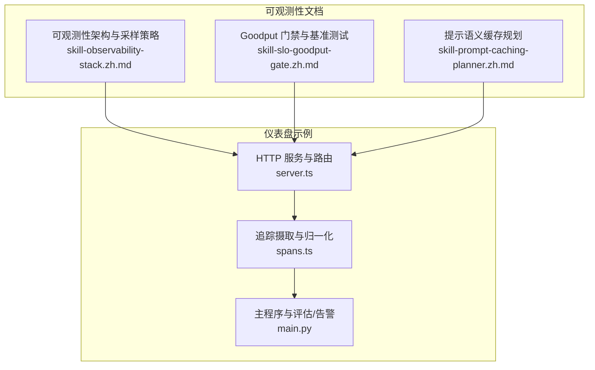
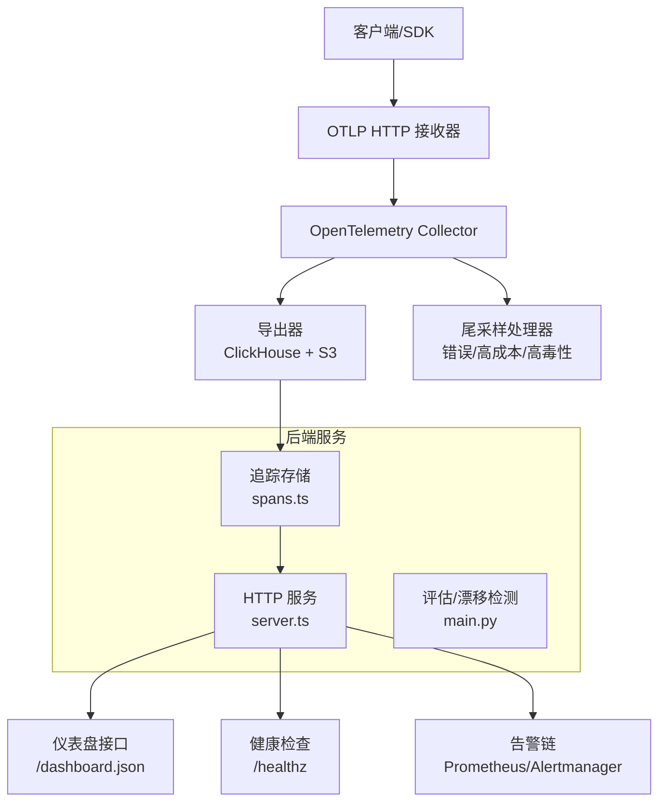
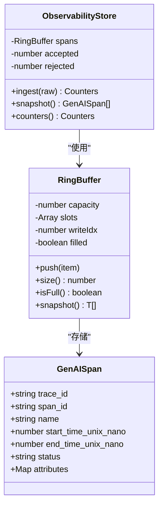
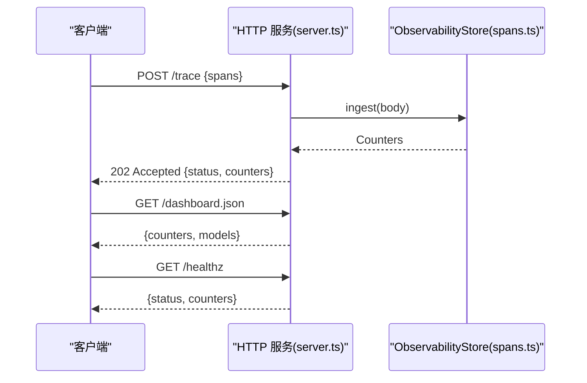
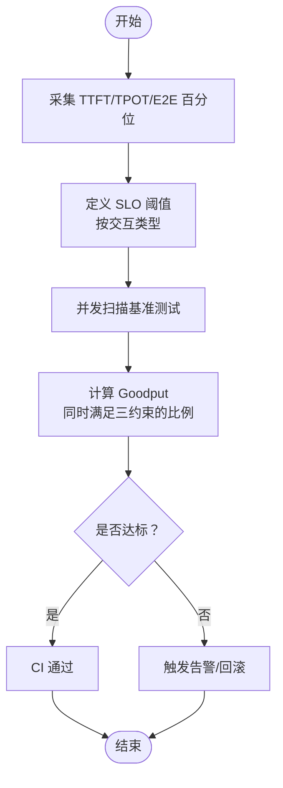
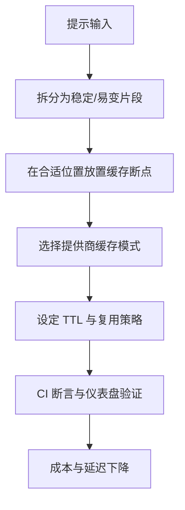
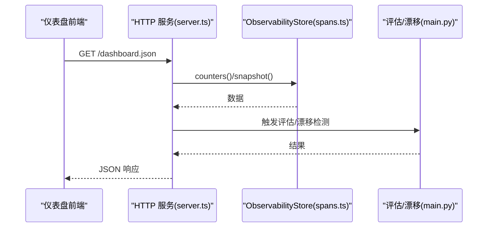
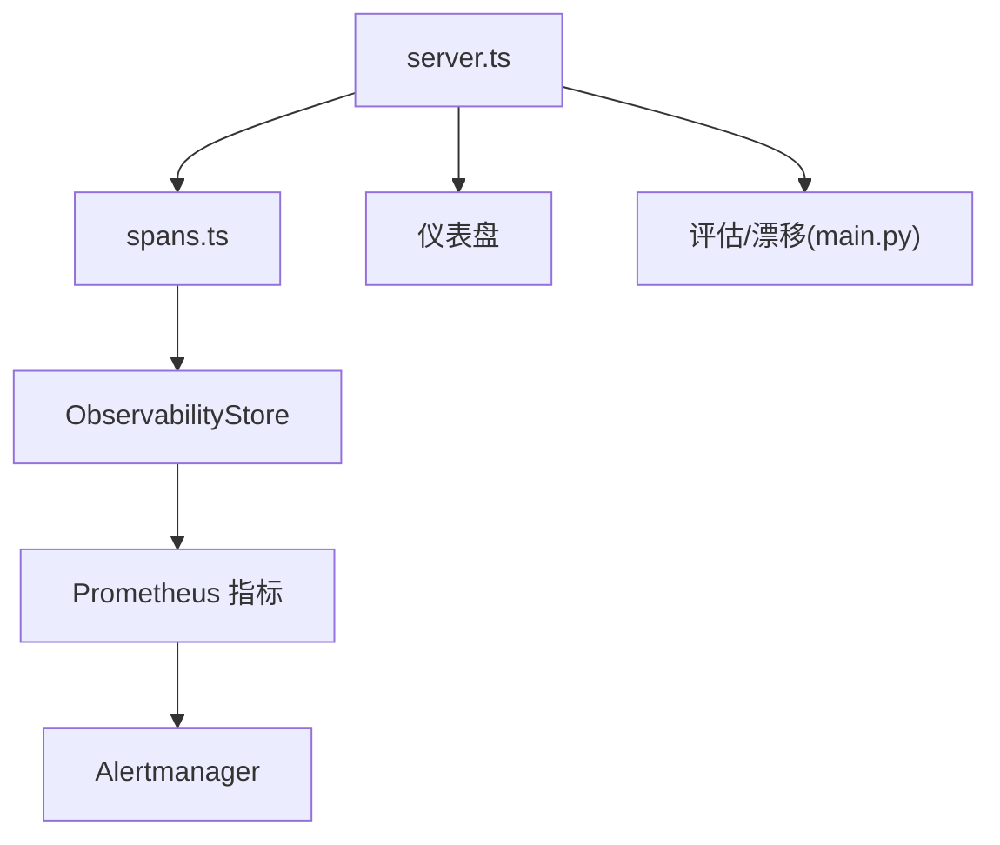
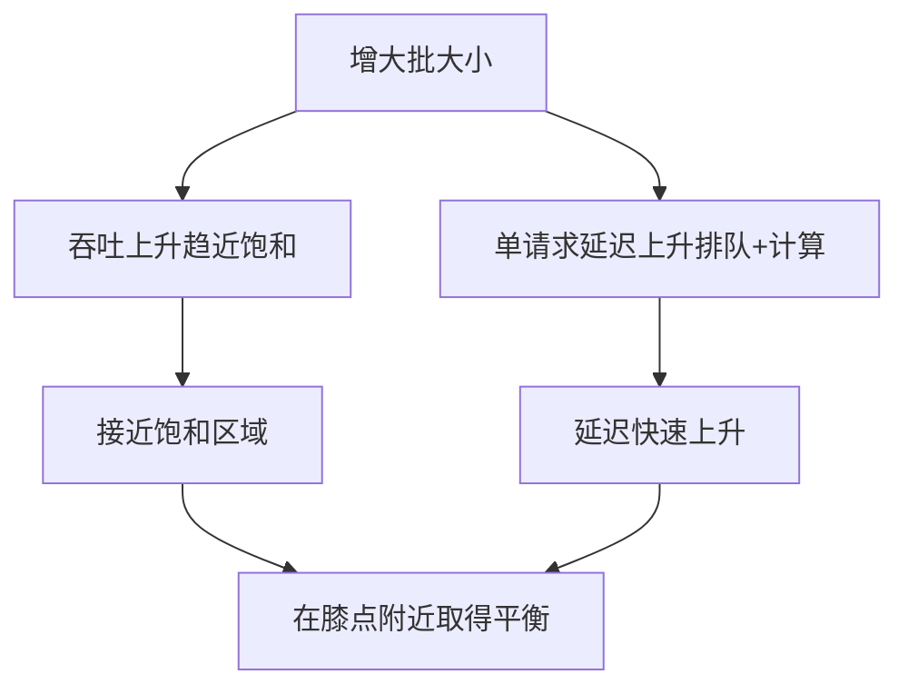

# 生产指标与可观测性

<cite>
**本文引用的文件**
- [phases/17-infrastructure-and-production/13-llm-observability/outputs/skill-observability-stack.zh.md](file://phases/17-infrastructure-and-production/13-llm-observability/outputs/skill-observability-stack.zh.md)
- [phases/17-infrastructure-and-production/08-inference-metrics-goodput/outputs/skill-slo-goodput-gate.zh.md](file://phases/17-infrastructure-and-production/08-inference-metrics-goodput/outputs/skill-slo-goodput-gate.zh.md)
- [phases/11-llm-engineering/15-prompt-caching/outputs/skill-prompt-caching-planner.zh.md](file://phases/11-llm-engineering/15-prompt-caching/outputs/skill-prompt-caching-planner.zh.md)
- [phases/19-capstone-projects/11-llm-observability-dashboard/code/ts/src/server.ts](file://phases/19-capstone-projects/11-llm-observability-dashboard/code/ts/src/server.ts)
- [phases/19-capstone-projects/11-llm-observability-dashboard/code/ts/src/spans.ts](file://phases/19-capstone-projects/11-llm-observability-dashboard/code/ts/src/spans.ts)
- [phases/19-capstone-projects/11-llm-observability-dashboard/code/main.py](file://phases/19-capstone-projects/11-llm-observability-dashboard/code/main.py)
- [site/figures-infra.js](file://site/figures-infra.js)
</cite>

## 目录
1. [引言](#引言)
2. [项目结构](#项目结构)
3. [核心组件](#核心组件)
4. [架构总览](#架构总览)
5. [详细组件分析](#详细组件分析)
6. [依赖关系分析](#依赖关系分析)
7. [性能考量](#性能考量)
8. [故障排查指南](#故障排查指南)
9. [结论](#结论)
10. [附录](#附录)

## 引言
本文件面向生产级 LLM 服务的指标与可观测性，围绕以下主题展开：关键性能指标（吞吐量、延迟、错误率、资源利用率）的定义与计算；Goodput（有效吞吐量）的概念、测量方法与优化路径；可观测性架构（分布式追踪、日志聚合、指标监控、告警系统）的设计与落地；提示语义缓存的原理、实现与收益；以及监控仪表板设计、告警规则配置与故障诊断流程的实战指南。

## 项目结构
本仓库提供了多个与生产可观测性直接相关的模块与文档，包括：
- 可观测性架构与采样策略：用于指导技术栈选择、属性约定、采样与告警
- Goodput 门禁与基准测试：定义 SLO 与门禁逻辑，确保以用户体验为中心的性能门槛
- 提示语义缓存规划：针对不同提供商的缓存模式与布局建议
- 自托管可观测性仪表盘：包含 OTLP 接收、存储、评估与告警的端到端示例

**图表来源**
- [phases/17-infrastructure-and-production/13-llm-observability/outputs/skill-observability-stack.zh.md:1-32](file://phases/17-infrastructure-and-production/13-llm-observability/outputs/skill-observability-stack.zh.md#L1-L32)
- [phases/17-infrastructure-and-production/08-inference-metrics-goodput/outputs/skill-slo-goodput-gate.zh.md:1-33](file://phases/17-infrastructure-and-production/08-inference-metrics-goodput/outputs/skill-slo-goodput-gate.zh.md#L1-L33)
- [phases/11-llm-engineering/15-prompt-caching/outputs/skill-prompt-caching-planner.zh.md:1-19](file://phases/11-llm-engineering/15-prompt-caching/outputs/skill-prompt-caching-planner.zh.md#L1-L19)
- [phases/19-capstone-projects/11-llm-observability-dashboard/code/ts/src/server.ts:1-42](file://phases/19-capstone-projects/11-llm-observability-dashboard/code/ts/src/server.ts#L1-L42)
- [phases/19-capstone-projects/11-llm-observability-dashboard/code/ts/src/spans.ts:1-136](file://phases/19-capstone-projects/11-llm-observability-dashboard/code/ts/src/spans.ts#L1-L136)
- [phases/19-capstone-projects/11-llm-observability-dashboard/code/main.py:238-257](file://phases/19-capstone-projects/11-llm-observability-dashboard/code/main.py#L238-L257)

**章节来源**
- [phases/17-infrastructure-and-production/13-llm-observability/outputs/skill-observability-stack.zh.md:1-32](file://phases/17-infrastructure-and-production/13-llm-observability/outputs/skill-observability-stack.zh.md#L1-L32)
- [phases/17-infrastructure-and-production/08-inference-metrics-goodput/outputs/skill-slo-goodput-gate.zh.md:1-33](file://phases/17-infrastructure-and-production/08-inference-metrics-goodput/outputs/skill-slo-goodput-gate.zh.md#L1-L33)
- [phases/11-llm-engineering/15-prompt-caching/outputs/skill-prompt-caching-planner.zh.md:1-19](file://phases/11-llm-engineering/15-prompt-caching/outputs/skill-prompt-caching-planner.zh.md#L1-L19)
- [phases/19-capstone-projects/11-llm-observability-dashboard/code/ts/src/server.ts:1-42](file://phases/19-capstone-projects/11-llm-observability-dashboard/code/ts/src/server.ts#L1-L42)
- [phases/19-capstone-projects/11-llm-observability-dashboard/code/ts/src/spans.ts:1-136](file://phases/19-capstone-projects/11-llm-observability-dashboard/code/ts/src/spans.ts#L1-L136)
- [phases/19-capstone-projects/11-llm-observability-dashboard/code/main.py:238-257](file://phases/19-capstone-projects/11-llm-observability-dashboard/code/main.py#L238-L257)

## 核心组件
- 可观测性架构与采样策略：定义 OTel GenAI 属性集、采样策略与五项关键告警指标，强调互操作性与合规性
- Goodput 门禁：以 TTFT/TPOT/E2E 百分位为核心，结合并发扫描与回归门禁，确保用户体验门槛
- 提示语义缓存：提供布局建议、提供商模式选择、盈亏平衡与故障模式预防
- 仪表盘示例：OTLP 接收、追踪归一化、滚动缓冲、健康检查与仪表盘接口

**章节来源**
- [phases/17-infrastructure-and-production/13-llm-observability/outputs/skill-observability-stack.zh.md:14-31](file://phases/17-infrastructure-and-production/13-llm-observability/outputs/skill-observability-stack.zh.md#L14-L31)
- [phases/17-infrastructure-and-production/08-inference-metrics-goodput/outputs/skill-slo-goodput-gate.zh.md:10-26](file://phases/17-infrastructure-and-production/08-inference-metrics-goodput/outputs/skill-slo-goodput-gate.zh.md#L10-L26)
- [phases/11-llm-engineering/15-prompt-caching/outputs/skill-prompt-caching-planner.zh.md:10-19](file://phases/11-llm-engineering/15-prompt-caching/outputs/skill-prompt-caching-planner.zh.md#L10-L19)
- [phases/19-capstone-projects/11-llm-observability-dashboard/code/ts/src/server.ts:14-42](file://phases/19-capstone-projects/11-llm-observability-dashboard/code/ts/src/server.ts#L14-L42)
- [phases/19-capstone-projects/11-llm-observability-dashboard/code/ts/src/spans.ts:101-136](file://phases/19-capstone-projects/11-llm-observability-dashboard/code/ts/src/spans.ts#L101-L136)

## 架构总览
下图展示了从追踪采集到仪表盘呈现与告警的端到端流程，体现可观测性架构的关键节点与职责分工。

**图表来源**
- [phases/19-capstone-projects/11-llm-observability-dashboard/code/ts/src/server.ts:14-42](file://phases/19-capstone-projects/11-llm-observability-dashboard/code/ts/src/server.ts#L14-L42)
- [phases/19-capstone-projects/11-llm-observability-dashboard/code/ts/src/spans.ts:101-136](file://phases/19-capstone-projects/11-llm-observability-dashboard/code/ts/src/spans.ts#L101-L136)
- [phases/19-capstone-projects/11-llm-observability-dashboard/code/main.py:238-257](file://phases/19-capstone-projects/11-llm-observability-dashboard/code/main.py#L238-L257)
- [phases/17-infrastructure-and-production/13-llm-observability/outputs/skill-observability-stack.zh.md:14-21](file://phases/17-infrastructure-and-production/13-llm-observability/outputs/skill-observability-stack.zh.md#L14-L21)

## 详细组件分析

### 组件A：追踪摄取与归一化（ObservabilityStore）
- 职责：接收 OTLP GenAI span，进行规范化与校验，维护环形缓冲区，提供计数器与快照
- 关键点：
  - 规范化 trace_id/span_id，统一 token 字段格式
  - 校验时间戳与属性完整性，拒绝非法输入
  - 使用环形缓冲区控制内存占用，支持快照与容量统计

**图表来源**
- [phases/19-capstone-projects/11-llm-observability-dashboard/code/ts/src/spans.ts:37-70](file://phases/19-capstone-projects/11-llm-observability-dashboard/code/ts/src/spans.ts#L37-L70)
- [phases/19-capstone-projects/11-llm-observability-dashboard/code/ts/src/spans.ts:101-136](file://phases/19-capstone-projects/11-llm-observability-dashboard/code/ts/src/spans.ts#L101-L136)

**章节来源**
- [phases/19-capstone-projects/11-llm-observability-dashboard/code/ts/src/spans.ts:72-99](file://phases/19-capstone-projects/11-llm-observability-dashboard/code/ts/src/spans.ts#L72-L99)
- [phases/19-capstone-projects/11-llm-observability-dashboard/code/ts/src/spans.ts:110-122](file://phases/19-capstone-projects/11-llm-observability-dashboard/code/ts/src/spans.ts#L110-L122)

### 组件B：HTTP 服务与仪表盘接口
- 职责：提供 /trace 摄取端点、/dashboard.json 数据端点、/healthz 健康检查
- 关键点：
  - POST /trace：接收 JSON 追踪，调用 store.ingest 并返回计数器
  - GET /dashboard.json：返回 counters 与按模型聚合的数据
  - GET /healthz：返回服务状态与 counters

**图表来源**
- [phases/19-capstone-projects/11-llm-observability-dashboard/code/ts/src/server.ts:17-39](file://phases/19-capstone-projects/11-llm-observability-dashboard/code/ts/src/server.ts#L17-L39)
- [phases/19-capstone-projects/11-llm-observability-dashboard/code/ts/src/spans.ts:110-122](file://phases/19-capstone-projects/11-llm-observability-dashboard/code/ts/src/spans.ts#L110-L122)

**章节来源**
- [phases/19-capstone-projects/11-llm-observability-dashboard/code/ts/src/server.ts:14-42](file://phases/19-capstone-projects/11-llm-observability-dashboard/code/ts/src/server.ts#L14-L42)

### 组件C：关键性能指标与 Goodput
- 吞吐量：单位时间内完成的请求数（可按模型、用户、租户拆分）
- 延迟：TTFT（首次令牌耗时）、TPOT（后续令牌耗时）、E2E（端到端耗时）等，建议报告 P50/P90/P99
- 错误率：HTTP 5xx、业务错误、超时等
- 资源利用率：GPU/CPU/内存/网络带宽、KV 缓存命中率、批大小影响
- Goodput：同时满足 TTFT/TPOT/E2E 三类约束的请求比例，用于 CI/CD 门禁

**图表来源**
- [phases/17-infrastructure-and-production/08-inference-metrics-goodput/outputs/skill-slo-goodput-gate.zh.md:14-19](file://phases/17-infrastructure-and-production/08-inference-metrics-goodput/outputs/skill-slo-goodput-gate.zh.md#L14-L19)

**章节来源**
- [phases/17-infrastructure-and-production/08-inference-metrics-goodput/outputs/skill-slo-goodput-gate.zh.md:10-26](file://phases/17-infrastructure-and-production/08-inference-metrics-goodput/outputs/skill-slo-goodput-gate.zh.md#L10-L26)

### 组件D：可观测性架构与告警
- 属性约定：gen_ai.system、gen_ai.request.model、gen_ai.usage.input/output_tokens、temperature、finish_reasons 等
- 采样策略：100% 错误、100% 高成本、N% 成功；保留窗口与聚合数据长期保留
- 告警指标：错误率、P99 TTFT、每次请求成本、提示缓存命中率、拒绝率
- 硬性拒绝与拒绝规则：避免框架锁定、Datadog 级定价下的保留策略、忽略 OTel GenAI 约定等

**图表来源**
- [phases/17-infrastructure-and-production/13-llm-observability/outputs/skill-observability-stack.zh.md:17-21](file://phases/17-infrastructure-and-production/13-llm-observability/outputs/skill-observability-stack.zh.md#L17-L21)

**章节来源**
- [phases/17-infrastructure-and-production/13-llm-observability/outputs/skill-observability-stack.zh.md:19-31](file://phases/17-infrastructure-and-production/13-llm-observability/outputs/skill-observability-stack.zh.md#L19-L31)

### 组件E：提示语义缓存
- 原理：稳定提示片段复用，减少输入 token 与往返开销
- 实现要点：布局设计（稳定/易变部分分离）、提供商缓存模式（如 cache_control、自动缓存）、TTL 与复用模式匹配
- 性能收益：显著降低成本与延迟，需通过 CI 断言与仪表盘验证

**图表来源**
- [phases/11-llm-engineering/15-prompt-caching/outputs/skill-prompt-caching-planner.zh.md:12-16](file://phases/11-llm-engineering/15-prompt-caching/outputs/skill-prompt-caching-planner.zh.md#L12-L16)

**章节来源**
- [phases/11-llm-engineering/15-prompt-caching/outputs/skill-prompt-caching-planner.zh.md:10-19](file://phases/11-llm-engineering/15-prompt-caching/outputs/skill-prompt-caching-planner.zh.md#L10-L19)

### 组件F：仪表盘与漂移检测
- 仪表盘接口：/dashboard.json 返回 counters 与按模型聚合的数据，支持瀑布图与追踪搜索
- 漂移检测：每周 PSI/KL 检测器在池化提示嵌入上运行，阈值 0.2
- 回归探针：注入虚假 SSN 响应模式，测量 MTTR

**图表来源**
- [phases/19-capstone-projects/11-llm-observability-dashboard/code/ts/src/server.ts:30-35](file://phases/19-capstone-projects/11-llm-observability-dashboard/code/ts/src/server.ts#L30-L35)
- [phases/19-capstone-projects/11-llm-observability-dashboard/code/ts/src/spans.ts:124-126](file://phases/19-capstone-projects/11-llm-observability-dashboard/code/ts/src/spans.ts#L124-L126)
- [phases/19-capstone-projects/11-llm-observability-dashboard/code/main.py:238-257](file://phases/19-capstone-projects/11-llm-observability-dashboard/code/main.py#L238-L257)

**章节来源**
- [phases/19-capstone-projects/11-llm-observability-dashboard/code/main.py:238-257](file://phases/19-capstone-projects/11-llm-observability-dashboard/code/main.py#L238-L257)

## 依赖关系分析
- 组件耦合：
  - server.ts 依赖 spans.ts 的归一化与存储能力
  - main.py 依赖 spans.ts 的快照与评估/漂移检测
- 外部依赖：
  - OTLP 接收与导出到 ClickHouse/S3
  - Prometheus/Alertmanager 告警链路
  - 评估器（DeepEval/RAGAS/Phoenix）与自定义 LLM-judge

**图表来源**
- [phases/19-capstone-projects/11-llm-observability-dashboard/code/ts/src/server.ts:1-42](file://phases/19-capstone-projects/11-llm-observability-dashboard/code/ts/src/server.ts#L1-L42)
- [phases/19-capstone-projects/11-llm-observability-dashboard/code/ts/src/spans.ts:101-136](file://phases/19-capstone-projects/11-llm-observability-dashboard/code/ts/src/spans.ts#L101-L136)
- [phases/19-capstone-projects/11-llm-observability-dashboard/code/main.py:238-257](file://phases/19-capstone-projects/11-llm-observability-dashboard/code/main.py#L238-L257)

**章节来源**
- [phases/19-capstone-projects/11-llm-observability-dashboard/code/ts/src/server.ts:1-42](file://phases/19-capstone-projects/11-llm-observability-dashboard/code/ts/src/server.ts#L1-L42)
- [phases/19-capstone-projects/11-llm-observability-dashboard/code/ts/src/spans.ts:101-136](file://phases/19-capstone-projects/11-llm-observability-dashboard/code/ts/src/spans.ts#L101-L136)
- [phases/19-capstone-projects/11-llm-observability-dashboard/code/main.py:238-257](file://phases/19-capstone-projects/11-llm-observability-dashboard/code/main.py#L238-L257)

## 性能考量
- 批大小与吞吐/延迟权衡：增大批大小提升吞吐但增加排队与单请求延迟，存在“膝点”（knee）附近取得最佳平衡
- KV 缓存与批处理：合理批大小与 KV 命中率可显著降低尾延迟
- 采样与保留：在成本与洞察力之间折衷，错误与高成本场景必须保留

**图表来源**
- [site/figures-infra.js:267-302](file://site/figures-infra.js#L267-L302)

**章节来源**
- [site/figures-infra.js:267-302](file://site/figures-infra.js#L267-L302)

## 故障排查指南
- 追踪摄取失败：检查 /healthz 与 /trace 返回状态，确认属性格式与 token 字段合法性
- 仪表盘无数据：确认 /dashboard.json 是否返回 counters 与模型聚合数据，检查评估/漂移任务是否执行
- 告警风暴：核对采样策略与阈值，避免过度保留导致成本与噪声上升
- 回归定位：利用回归探针注入模式，测量 MTTR 并优化仪表盘 UX 与告警收敛

**章节来源**
- [phases/19-capstone-projects/11-llm-observability-dashboard/code/ts/src/server.ts:37-39](file://phases/19-capstone-projects/11-llm-observability-dashboard/code/ts/src/server.ts#L37-L39)
- [phases/19-capstone-projects/11-llm-observability-dashboard/code/main.py:242-251](file://phases/19-capstone-projects/11-llm-observability-dashboard/code/main.py#L242-L251)

## 结论
生产级 LLM 服务的可观测性应以用户体验为中心，以 Goodput 为门禁，结合 OTel GenAI 属性约定与科学采样策略，构建从追踪、日志、指标到告警的闭环体系。通过提示语义缓存与批处理优化，持续降低延迟与成本；借助仪表盘与漂移检测，快速发现回归并缩短 MTTR。上述组件与流程在仓库中均有对应实现与文档支撑，可直接用于生产落地。

## 附录
- 关键术语
  - Goodput：同时满足 TTFT/TPOT/E2E 三类约束的请求比例
  - OTel GenAI：OpenTelemetry GenAI 约定的标准化属性集合
  - 尾采样：仅保留错误、高成本或高风险请求，降低存储与成本压力
- 实战清单
  - 完成 OTel GenAI 属性约定与采样策略配置
  - 建立 Goodput 门禁与并发扫描基准测试
  - 部署自托管仪表盘与告警链路
  - 设计提示语义缓存布局与提供商模式
  - 建立回归探针与 MTTR 度量