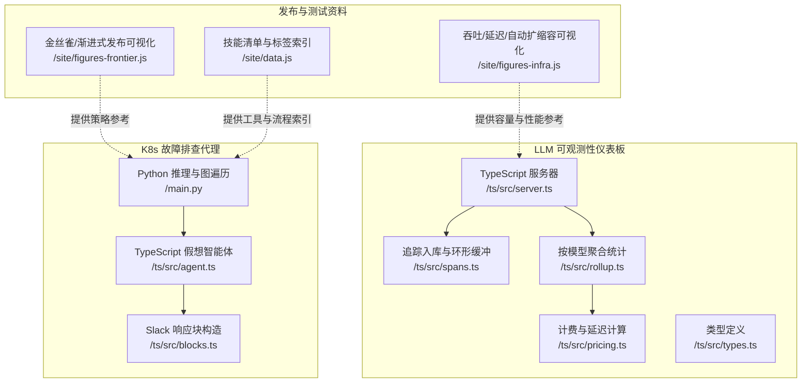
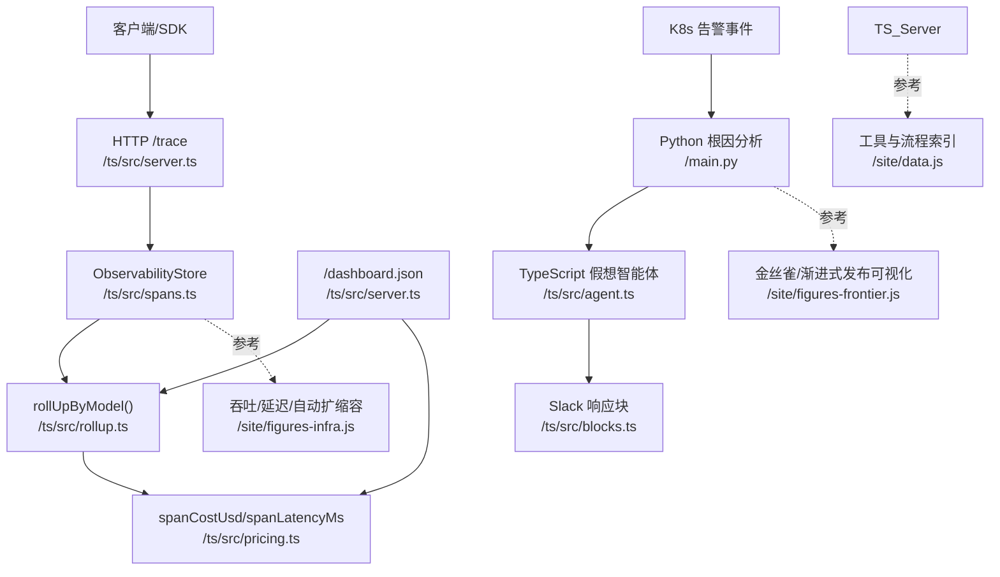
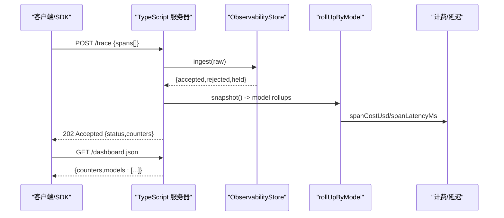
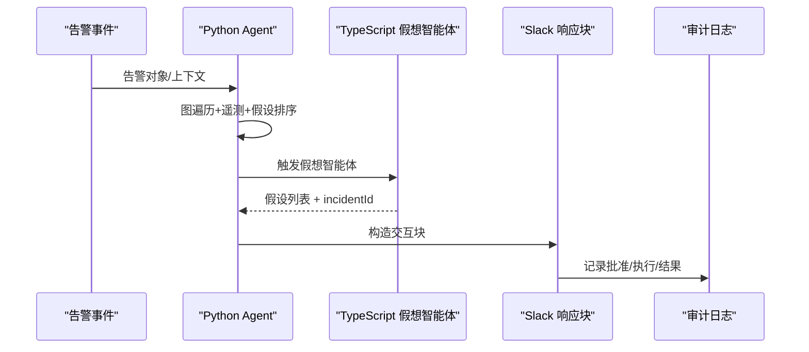
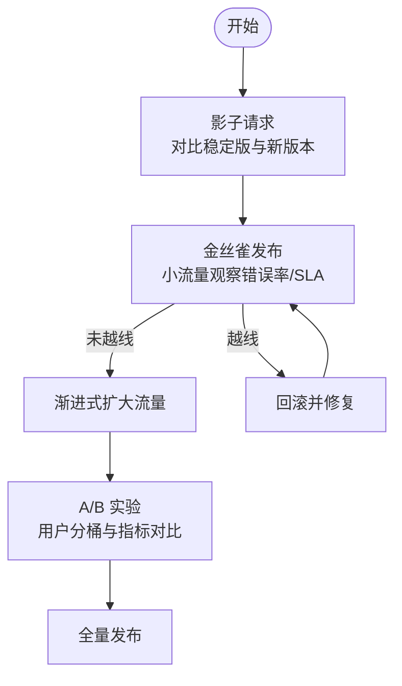
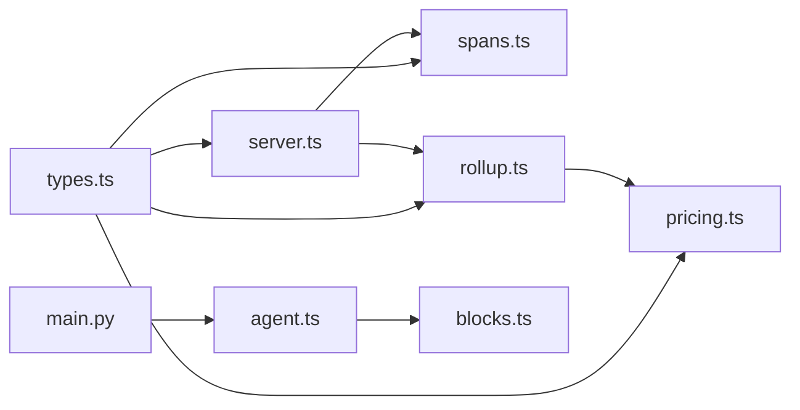

# 生产环境可观测性

<cite>
**本文引用的文件**
- [phases/19-capstone-projects/11-llm-observability-dashboard/code/ts/src/server.ts](file://phases/19-capstone-projects/11-llm-observability-dashboard/code/ts/src/server.ts)
- [phases/19-capstone-projects/11-llm-observability-dashboard/code/ts/src/spans.ts](file://phases/19-capstone-projects/11-llm-observability-dashboard/code/ts/src/spans.ts)
- [phases/19-capstone-projects/11-llm-observability-dashboard/code/ts/src/rollup.ts](file://phases/19-capstone-projects/11-llm-observability-dashboard/code/ts/src/rollup.ts)
- [phases/19-capstone-projects/11-llm-observability-dashboard/code/ts/src/pricing.ts](file://phases/19-capstone-projects/11-llm-observability-dashboard/code/ts/src/pricing.ts)
- [phases/19-capstone-projects/11-llm-observability-dashboard/code/ts/src/types.ts](file://phases/19-capstone-projects/11-llm-observability-dashboard/code/ts/src/types.ts)
- [phases/19-capstone-projects/11-llm-observability-dashboard/code/ts/src/server.ts](file://phases/19-capstone-projects/11-llm-observability-dashboard/code/ts/src/server.ts)
- [phases/19-capstone-projects/06-devops-troubleshooting-agent/code/main.py](file://phases/19-capstone-projects/06-devops-troubleshooting-agent/code/main.py)
- [phases/19-capstone-projects/06-devops-troubleshooting-agent/code/ts/src/agent.ts](file://phases/19-capstone-projects/06-devops-troubleshooting-agent/code/ts/src/agent.ts)
- [phases/19-capstone-projects/06-devops-troubleshooting-agent/code/ts/src/blocks.ts](file://phases/19-capstone-projects/06-devops-troubleshooting-agent/code/ts/src/blocks.ts)
- [site/figures-frontier.js](file://site/figures-frontier.js)
- [site/figures-infra.js](file://site/figures-infra.js)
- [site/data.js](file://site/data.js)
</cite>

## 目录
1. [引言](#引言)
2. [项目结构](#项目结构)
3. [核心组件](#核心组件)
4. [架构总览](#架构总览)
5. [详细组件分析](#详细组件分析)
6. [依赖关系分析](#依赖关系分析)
7. [性能考量](#性能考量)
8. [故障排查指南](#故障排查指南)
9. [结论](#结论)
10. [附录](#附录)

## 引言
本文件面向生产环境可观测性与质量保障，围绕大模型（LLM）服务的可观测性架构展开，涵盖分布式追踪、指标采集、日志管理、告警系统的设计与实现；同时系统讲解新功能上线策略（影子请求、金丝雀发布、渐进式发布）与 A/B 测试框架，并结合负载测试方法与工具，给出监控仪表板配置与告警规则设计建议，帮助团队建立完善的生产质量保障体系。

## 项目结构
本仓库中与“生产可观测性”直接相关的核心模块包括：
- LLM 可观测性仪表板（TypeScript 后端 + 前端渲染）
- Kubernetes 故障排查代理（Python 核心推理 + TypeScript Slack 集成）
- 发布与测试相关资料（站点脚本与技能清单）

图表来源
- [phases/19-capstone-projects/11-llm-observability-dashboard/code/ts/src/server.ts:14-42](file://phases/19-capstone-projects/11-llm-observability-dashboard/code/ts/src/server.ts#L14-L42)
- [phases/19-capstone-projects/11-llm-observability-dashboard/code/ts/src/spans.ts:101-136](file://phases/19-capstone-projects/11-llm-observability-dashboard/code/ts/src/spans.ts#L101-L136)
- [phases/19-capstone-projects/11-llm-observability-dashboard/code/ts/src/rollup.ts:14-49](file://phases/19-capstone-projects/11-llm-observability-dashboard/code/ts/src/rollup.ts#L14-L49)
- [phases/19-capstone-projects/11-llm-observability-dashboard/code/ts/src/pricing.ts:21-32](file://phases/19-capstone-projects/11-llm-observability-dashboard/code/ts/src/pricing.ts#L21-L32)
- [phases/19-capstone-projects/11-llm-observability-dashboard/code/ts/src/types.ts:3-22](file://phases/19-capstone-projects/11-llm-observability-dashboard/code/ts/src/types.ts#L3-L22)
- [phases/19-capstone-projects/06-devops-troubleshooting-agent/code/main.py:52-142](file://phases/19-capstone-projects/06-devops-troubleshooting-agent/code/main.py#L52-L142)
- [phases/19-capstone-projects/06-devops-troubleshooting-agent/code/ts/src/agent.ts:5-59](file://phases/19-capstone-projects/06-devops-troubleshooting-agent/code/ts/src/agent.ts#L5-L59)
- [phases/19-capstone-projects/06-devops-troubleshooting-agent/code/ts/src/blocks.ts:3-60](file://phases/19-capstone-projects/06-devops-troubleshooting-agent/code/ts/src/blocks.ts#L3-L60)
- [site/figures-frontier.js:332-364](file://site/figures-frontier.js#L332-L364)
- [site/figures-infra.js:267-358](file://site/figures-infra.js#L267-L358)
- [site/data.js:17449-17563](file://site/data.js#L17449-L17563)

章节来源
- [phases/19-capstone-projects/11-llm-observability-dashboard/code/ts/src/server.ts:14-42](file://phases/19-capstone-projects/11-llm-observability-dashboard/code/ts/src/server.ts#L14-L42)
- [phases/19-capstone-projects/06-devops-troubleshooting-agent/code/main.py:52-142](file://phases/19-capstone-projects/06-devops-troubleshooting-agent/code/main.py#L52-L142)
- [site/figures-frontier.js:332-364](file://site/figures-frontier.js#L332-L364)
- [site/figures-infra.js:267-358](file://site/figures-infra.js#L267-L358)
- [site/data.js:17449-17563](file://site/data.js#L17449-L17563)

## 核心组件
- 追踪与指标采集
  - 通过 HTTP 接口接收 GenAI 追踪（span）数据，进行规范化与环形缓冲存储，支持按模型维度聚合统计与成本估算。
- 日志与告警
  - 结合 Kubernetes 知识图谱与遥测，对告警进行根因分析与假设排序；通过 Slack 块响应与审批门禁，确保可审计的修复动作。
- 发布与测试
  - 以可视化方式演示金丝雀/渐进式发布策略；提供负载测试工具与模式索引，支撑 SLA 门控与容量规划。

章节来源
- [phases/19-capstone-projects/11-llm-observability-dashboard/code/ts/src/server.ts:17-25](file://phases/19-capstone-projects/11-llm-observability-dashboard/code/ts/src/server.ts#L17-L25)
- [phases/19-capstone-projects/11-llm-observability-dashboard/code/ts/src/spans.ts:101-136](file://phases/19-capstone-projects/11-llm-observability-dashboard/code/ts/src/spans.ts#L101-L136)
- [phases/19-capstone-projects/11-llm-observability-dashboard/code/ts/src/rollup.ts:14-49](file://phases/19-capstone-projects/11-llm-observability-dashboard/code/ts/src/rollup.ts#L14-L49)
- [phases/19-capstone-projects/06-devops-troubleshooting-agent/code/main.py:160-184](file://phases/19-capstone-projects/06-devops-troubleshooting-agent/code/main.py#L160-L184)
- [phases/19-capstone-projects/06-devops-troubleshooting-agent/code/ts/src/blocks.ts:3-60](file://phases/19-capstone-projects/06-devops-troubleshooting-agent/code/ts/src/blocks.ts#L3-L60)
- [site/figures-frontier.js:332-364](file://site/figures-frontier.js#L332-L364)
- [site/data.js:17449-17563](file://site/data.js#L17449-L17563)

## 架构总览
下图展示 LLM 可观测性与发布/测试资料在生产质量保障中的协同关系：

图表来源
- [phases/19-capstone-projects/11-llm-observability-dashboard/code/ts/src/server.ts:17-39](file://phases/19-capstone-projects/11-llm-observability-dashboard/code/ts/src/server.ts#L17-L39)
- [phases/19-capstone-projects/11-llm-observability-dashboard/code/ts/src/spans.ts:101-136](file://phases/19-capstone-projects/11-llm-observability-dashboard/code/ts/src/spans.ts#L101-L136)
- [phases/19-capstone-projects/11-llm-observability-dashboard/code/ts/src/rollup.ts:14-49](file://phases/19-capstone-projects/11-llm-observability-dashboard/code/ts/src/rollup.ts#L14-L49)
- [phases/19-capstone-projects/11-llm-observability-dashboard/code/ts/src/pricing.ts:21-32](file://phases/19-capstone-projects/11-llm-observability-dashboard/code/ts/src/pricing.ts#L21-L32)
- [phases/19-capstone-projects/06-devops-troubleshooting-agent/code/main.py:190-229](file://phases/19-capstone-projects/06-devops-troubleshooting-agent/code/main.py#L190-L229)
- [phases/19-capstone-projects/06-devops-troubleshooting-agent/code/ts/src/agent.ts:5-59](file://phases/19-capstone-projects/06-devops-troubleshooting-agent/code/ts/src/agent.ts#L5-L59)
- [phases/19-capstone-projects/06-devops-troubleshooting-agent/code/ts/src/blocks.ts:3-60](file://phases/19-capstone-projects/06-devops-troubleshooting-agent/code/ts/src/blocks.ts#L3-L60)
- [site/figures-frontier.js:332-364](file://site/figures-frontier.js#L332-L364)
- [site/figures-infra.js:267-358](file://site/figures-infra.js#L267-L358)
- [site/data.js:17449-17563](file://site/data.js#L17449-L17563)

## 详细组件分析

### 组件一：LLM 可观测性仪表板（TypeScript）
- 数据入口与处理
  - HTTP POST /trace 接收追踪数组，逐条规范化并写入环形缓冲；返回计数器（已接受/已拒绝/当前持有）。
- 聚合与统计
  - 按模型分组，计算请求数、错误数、输入/输出 token 总量、成本与延迟分位数（p50/p95/p99）。
- 计费与延迟
  - 使用模型单价（每百万 token 输入/输出）计算成本；基于起止时间计算延迟（毫秒）。
- 前端仪表板
  - /dashboard.json 返回聚合结果；HTML 页面渲染汇总与表格。

图表来源
- [phases/19-capstone-projects/11-llm-observability-dashboard/code/ts/src/server.ts:17-39](file://phases/19-capstone-projects/11-llm-observability-dashboard/code/ts/src/server.ts#L17-L39)
- [phases/19-capstone-projects/11-llm-observability-dashboard/code/ts/src/spans.ts:110-122](file://phases/19-capstone-projects/11-llm-observability-dashboard/code/ts/src/spans.ts#L110-L122)
- [phases/19-capstone-projects/11-llm-observability-dashboard/code/ts/src/rollup.ts:14-49](file://phases/19-capstone-projects/11-llm-observability-dashboard/code/ts/src/rollup.ts#L14-L49)
- [phases/19-capstone-projects/11-llm-observability-dashboard/code/ts/src/pricing.ts:21-32](file://phases/19-capstone-projects/11-llm-observability-dashboard/code/ts/src/pricing.ts#L21-L32)

章节来源
- [phases/19-capstone-projects/11-llm-observability-dashboard/code/ts/src/server.ts:14-42](file://phases/19-capstone-projects/11-llm-observability-dashboard/code/ts/src/server.ts#L14-L42)
- [phases/19-capstone-projects/11-llm-observability-dashboard/code/ts/src/spans.ts:101-136](file://phases/19-capstone-projects/11-llm-observability-dashboard/code/ts/src/spans.ts#L101-L136)
- [phases/19-capstone-projects/11-llm-observability-dashboard/code/ts/src/rollup.ts:14-49](file://phases/19-capstone-projects/11-llm-observability-dashboard/code/ts/src/rollup.ts#L14-L49)
- [phases/19-capstone-projects/11-llm-observability-dashboard/code/ts/src/pricing.ts:3-32](file://phases/19-capstone-projects/11-llm-observability-dashboard/code/ts/src/pricing.ts#L3-L32)
- [phases/19-capstone-projects/11-llm-observability-dashboard/code/ts/src/types.ts:1-37](file://phases/19-capstone-projects/11-llm-observability-dashboard/code/ts/src/types.ts#L1-L37)

### 组件二：Kubernetes 故障排查代理（Python + TypeScript）
- Python 核心
  - 构建 K8s 知识图谱（节点/边），从告警对象出发遍历邻居，结合遥测生成假设并排序；提供只读/破坏性工具调用与审计日志。
- TypeScript 假想智能体
  - 基于关键词匹配生成故障假设与建议修复；生成唯一 incidentId；用于 Slack 响应块构造。
- Slack 集成
  - 将报告转换为交互式块，支持批准/升级/忽略操作；记录审计事件。

图表来源
- [phases/19-capstone-projects/06-devops-troubleshooting-agent/code/main.py:52-142](file://phases/19-capstone-projects/06-devops-troubleshooting-agent/code/main.py#L52-L142)
- [phases/19-capstone-projects/06-devops-troubleshooting-agent/code/ts/src/agent.ts:5-59](file://phases/19-capstone-projects/06-devops-troubleshooting-agent/code/ts/src/agent.ts#L5-L59)
- [phases/19-capstone-projects/06-devops-troubleshooting-agent/code/ts/src/blocks.ts:3-60](file://phases/19-capstone-projects/06-devops-troubleshooting-agent/code/ts/src/blocks.ts#L3-L60)

章节来源
- [phases/19-capstone-projects/06-devops-troubleshooting-agent/code/main.py:160-184](file://phases/19-capstone-projects/06-devops-troubleshooting-agent/code/main.py#L160-L184)
- [phases/19-capstone-projects/06-devops-troubleshooting-agent/code/ts/src/agent.ts:5-59](file://phases/19-capstone-projects/06-devops-troubleshooting-agent/code/ts/src/agent.ts#L5-L59)
- [phases/19-capstone-projects/06-devops-troubleshooting-agent/code/ts/src/blocks.ts:3-60](file://phases/19-capstone-projects/06-devops-troubleshooting-agent/code/ts/src/blocks.ts#L3-L60)

### 组件三：发布与测试策略（可视化与索引）
- 金丝雀/渐进式发布
  - 可视化展示流量切分、错误率与 SLA 回滚触发机制，强调“先影子、再金丝雀、后 A/B、最后 100%”的发布路径。
- 容量与性能
  - 吞吐/延迟曲线、自动扩缩容示意图，帮助理解批大小、副本容量与延迟的关系。
- 工具与流程索引
  - 提供 A/B 测试与负载测试的技能清单与标签，便于选型与落地。

图表来源
- [site/figures-frontier.js:332-364](file://site/figures-frontier.js#L332-L364)
- [site/figures-infra.js:267-358](file://site/figures-infra.js#L267-L358)
- [site/data.js:17449-17563](file://site/data.js#L17449-L17563)

章节来源
- [site/figures-frontier.js:332-364](file://site/figures-frontier.js#L332-L364)
- [site/figures-infra.js:267-358](file://site/figures-infra.js#L267-L358)
- [site/data.js:17449-17563](file://site/data.js#L17449-L17563)

## 依赖关系分析
- 组件耦合
  - TypeScript 服务器依赖 spans/rollup/pricing/types；Python 代理依赖 Kubernetes 知识图谱与遥测；Slack 块依赖假想智能体输出。
- 外部集成点
  - Prometheus/Loki 作为遥测来源；Slack 作为人机交互与审批门禁；HTTP 接口作为观测数据入口。
- 潜在循环依赖
  - 当前模块间为单向依赖，无明显循环；类型定义独立于实现，降低耦合。

图表来源
- [phases/19-capstone-projects/11-llm-observability-dashboard/code/ts/src/types.ts:1-37](file://phases/19-capstone-projects/11-llm-observability-dashboard/code/ts/src/types.ts#L1-L37)
- [phases/19-capstone-projects/11-llm-observability-dashboard/code/ts/src/spans.ts:101-136](file://phases/19-capstone-projects/11-llm-observability-dashboard/code/ts/src/spans.ts#L101-L136)
- [phases/19-capstone-projects/11-llm-observability-dashboard/code/ts/src/rollup.ts:14-49](file://phases/19-capstone-projects/11-llm-observability-dashboard/code/ts/src/rollup.ts#L14-L49)
- [phases/19-capstone-projects/11-llm-observability-dashboard/code/ts/src/pricing.ts:21-32](file://phases/19-capstone-projects/11-llm-observability-dashboard/code/ts/src/pricing.ts#L21-L32)
- [phases/19-capstone-projects/11-llm-observability-dashboard/code/ts/src/server.ts:14-42](file://phases/19-capstone-projects/11-llm-observability-dashboard/code/ts/src/server.ts#L14-L42)
- [phases/19-capstone-projects/06-devops-troubleshooting-agent/code/main.py:52-142](file://phases/19-capstone-projects/06-devops-troubleshooting-agent/code/main.py#L52-L142)
- [phases/19-capstone-projects/06-devops-troubleshooting-agent/code/ts/src/agent.ts:5-59](file://phases/19-capstone-projects/06-devops-troubleshooting-agent/code/ts/src/agent.ts#L5-L59)
- [phases/19-capstone-projects/06-devops-troubleshooting-agent/code/ts/src/blocks.ts:3-60](file://phases/19-capstone-projects/06-devops-troubleshooting-agent/code/ts/src/blocks.ts#L3-L60)

章节来源
- [phases/19-capstone-projects/11-llm-observability-dashboard/code/ts/src/server.ts:14-42](file://phases/19-capstone-projects/11-llm-observability-dashboard/code/ts/src/server.ts#L14-L42)
- [phases/19-capstone-projects/06-devops-troubleshooting-agent/code/main.py:160-184](file://phases/19-capstone-projects/06-devops-troubleshooting-agent/code/main.py#L160-L184)

## 性能考量
- 追踪入库
  - 环形缓冲容量限制内存占用；规范化过程严格校验字段类型与格式，避免无效数据进入统计。
- 聚合与计算
  - 按模型分组聚合，延迟分位数采用插值法；成本计算按百万 token 为单位，避免浮点误差累积。
- 可扩展性
  - 服务器仅负责接收与聚合，不持久化；可通过水平扩展与缓存优化前端渲染性能。

章节来源
- [phases/19-capstone-projects/11-llm-observability-dashboard/code/ts/src/spans.ts:37-70](file://phases/19-capstone-projects/11-llm-observability-dashboard/code/ts/src/spans.ts#L37-L70)
- [phases/19-capstone-projects/11-llm-observability-dashboard/code/ts/src/rollup.ts:4-12](file://phases/19-capstone-projects/11-llm-observability-dashboard/code/ts/src/rollup.ts#L4-L12)
- [phases/19-capstone-projects/11-llm-observability-dashboard/code/ts/src/pricing.ts:21-28](file://phases/19-capstone-projects/11-llm-observability-dashboard/code/ts/src/pricing.ts#L21-L28)

## 故障排查指南
- 告警到修复
  - 使用 Python 推理与 Kubernetes 知识图谱定位根因；通过 TypeScript 假想智能体生成修复建议；经 Slack 审批后执行。
- 审计与回溯
  - 所有工具调用均记录审计事件，支持事后复盘与合规审查。
- 常见场景
  - OOM/重启类告警：优先检查资源配额与健康检查路径；必要时回滚至稳定版本。

章节来源
- [phases/19-capstone-projects/06-devops-troubleshooting-agent/code/main.py:160-184](file://phases/19-capstone-projects/06-devops-troubleshooting-agent/code/main.py#L160-L184)
- [phases/19-capstone-projects/06-devops-troubleshooting-agent/code/ts/src/blocks.ts:3-60](file://phases/19-capstone-projects/06-devops-troubleshooting-agent/code/ts/src/blocks.ts#L3-L60)
- [phases/19-capstone-projects/06-devops-troubleshooting-agent/code/ts/src/agent.ts:5-59](file://phases/19-capstone-projects/06-devops-troubleshooting-agent/code/ts/src/agent.ts#L5-L59)

## 结论
本项目提供了从“数据采集—聚合统计—根因分析—审批执行—可视化监控”的完整闭环，既可用于 LLM 服务的生产可观测性建设，也可作为新功能上线与质量保障的实践范式。配合可视化发布的策略与工具索引，能够有效降低变更风险、提升交付效率与稳定性。

## 附录
- 监控仪表板配置建议
  - 指标：吞吐、延迟（p50/p95/p99）、错误率、成本（USD/MToken）、token 使用量。
  - 告警：错误率超阈、延迟分位数上升、成本异常、PSI 偏移。
- 新功能上线策略
  - 影子请求：先期对比稳定版与新版本的指标差异。
  - 金丝雀：设定 SLA 门限，错误率越线即回滚。
  - 渐进式：根据错误率与 SLA 动态扩大流量。
  - A/B：选择合适平台与指标，考虑 LLM 噪声与多重比较校正。
- 负载测试
  - 工具：k6、LLMPerf、GenAI-Perf、guidellm 等；模式：稳态、斜坡、尖峰、浸泡；CI 门控：SLA 与成功率阈值。

章节来源
- [site/figures-frontier.js:332-364](file://site/figures-frontier.js#L332-L364)
- [site/data.js:17449-17563](file://site/data.js#L17449-L17563)