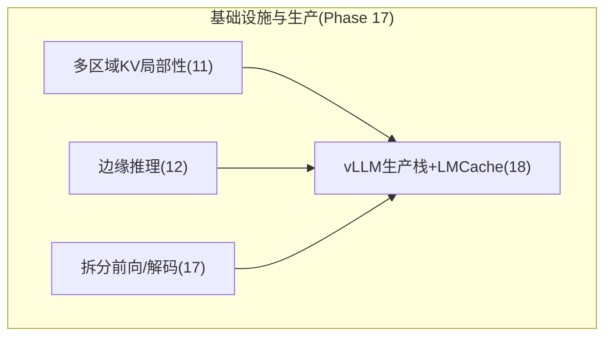
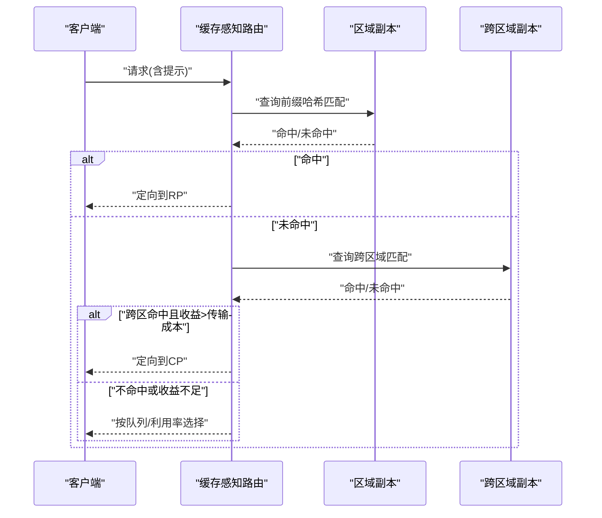
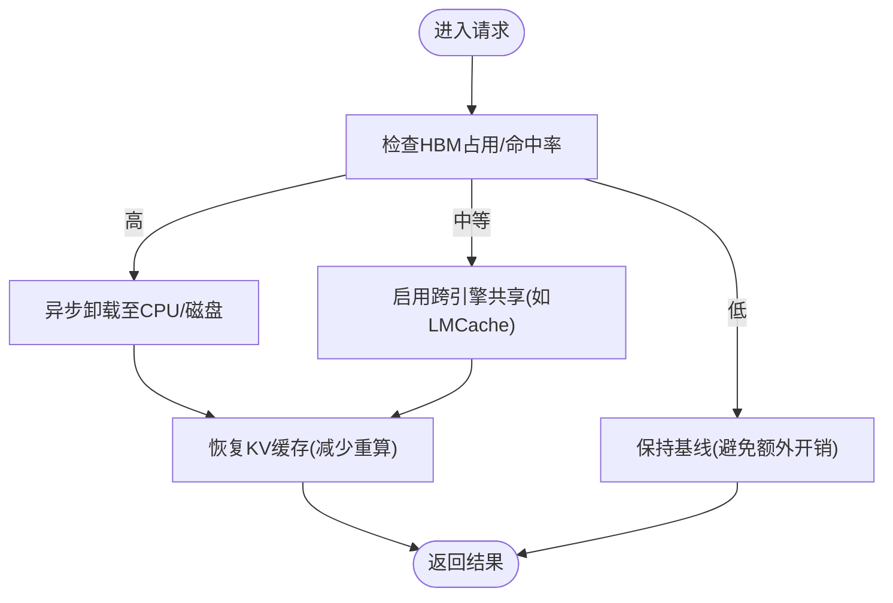
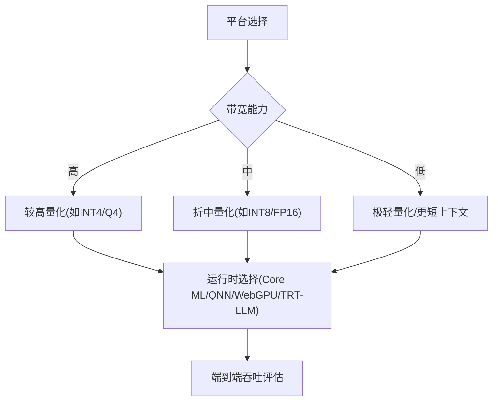
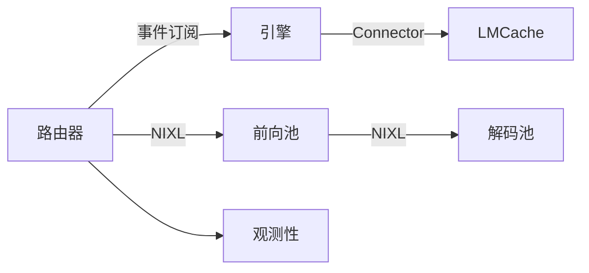

# 边缘推理与多区域部署

<cite>
**本文引用的文件**
- [README.md](file://README.md)
- [ROADMAP.md](file://ROADMAP.md)
- [phases/17-infrastructure-and-production/11-multi-region-kv-locality/docs/en.md](file://phases/17-infrastructure-and-production/11-multi-region-kv-locality/docs/en.md)
- [phases/17-infrastructure-and-production/12-edge-inference/docs/en.md](file://phases/17-infrastructure-and-production/12-edge-inference/docs/en.md)
- [phases/17-infrastructure-and-production/17-disaggregated-prefill-decode/docs/en.md](file://phases/17-infrastructure-and-production/17-disaggregated-prefill-decode/docs/en.md)
- [phases/17-infrastructure-and-production/18-vllm-production-stack-lmcache/docs/en.md](file://phases/17-infrastructure-and-production/18-vllm-production-stack-lmcache/docs/en.md)
- [site/figures-infra.js](file://site/figures-infra.js)
- [site/figures-llms2.js](file://site/figures-llms2.js)
</cite>

## 目录
1. [引言](#引言)
2. [项目结构](#项目结构)
3. [核心组件](#核心组件)
4. [架构总览](#架构总览)
5. [详细组件分析](#详细组件分析)
6. [依赖关系分析](#依赖关系分析)
7. [性能考量](#性能考量)
8. [故障排查指南](#故障排查指南)
9. [结论](#结论)
10. [附录](#附录)

## 引言
本课程围绕“边缘推理与多区域部署”展开，目标是帮助开发者在复杂网络与资源约束下，构建低时延、高可用、可扩展的分布式大模型服务。重点覆盖以下主题：
- 多区域部署的架构设计：数据一致性、网络延迟、跨区域路由与灾难恢复
- KV缓存本地化与共享：缓存分片、跨引擎复用、异步卸载与一致性
- 边缘推理模式：设备选择、带宽瓶颈、推理优化与端到端体验
- 生产级部署：路由器、观测性、拆分前向/解码、批处理与网关
- 性能测试与故障排查：指标体系、压测工具、排障流程

## 项目结构
本仓库为“从零开始的大模型工程”系列课程，第17阶段聚焦基础设施与生产，其中与本课程直接相关的内容分布在如下路径：
- 多区域KV缓存局部性：11-multi-region-kv-locality
- 边缘推理：12-edge-inference
- 拆分前向/解码：17-disaggregated-prefill-decode
- vLLM生产栈与LMCache：18-vllm-production-stack-lmcache
- 公共图表与演示脚本：site/figures-infra.js、site/figures-llms2.js



**章节来源**
- [README.md:764-793](file://README.md#L764-L793)
- [ROADMAP.md:454-485](file://ROADMAP.md#L454-L485)

## 核心组件
- 多区域缓存感知路由：以“前缀哈希”匹配KV缓存持有节点，避免轮询导致的全量前向开销；结合跨区域网络时延进行联合优化。
- KV缓存卸载与共享：将KV缓存从GPU HBM卸载至CPU DRAM与磁盘，支持跨引擎共享与异步后台卸载，降低重复前向与抢占成本。
- 拆分前向/解码：将计算密集型前向与内存带宽敏感的解码分别置于独立池，通过高速互联传输KV，提升资源利用率与吞吐。
- 边缘推理栈：针对不同终端（ANE、Hexagon、WebGPU、Jetson）选择合适的量化格式与运行时，突破带宽瓶颈，实现端侧低时延推理。

**章节来源**
- [phases/17-infrastructure-and-production/11-multi-region-kv-locality/docs/en.md:10-16](file://phases/17-infrastructure-and-production/11-multi-region-kv-locality/docs/en.md#L10-L16)
- [phases/17-infrastructure-and-production/18-vllm-production-stack-lmcache/docs/en.md:10-16](file://phases/17-infrastructure-and-production/18-vllm-production-stack-lmcache/docs/en.md#L10-L16)
- [phases/17-infrastructure-and-production/17-disaggregated-prefill-decode/docs/en.md:10-16](file://phases/17-infrastructure-and-production/17-disaggregated-prefill-decode/docs/en.md#L10-L16)
- [phases/17-infrastructure-and-production/12-edge-inference/docs/en.md:10-16](file://phases/17-infrastructure-and-production/12-edge-inference/docs/en.md#L10-L16)

## 架构总览
下图展示了多区域、边缘与数据中心协同的推理架构，强调缓存感知路由、KV卸载与拆分前向/解码的关键交互。

```mermaid
graph TB
subgraph "客户端"
U["用户/应用"]
end
subgraph "多区域入口"
R["缓存感知路由(Regional/GLOBAL)"]
BR["跨区域路由(考虑RTT)"]
end
subgraph "数据中心"
subgraph "vLLM生产栈"
ROU["路由器"]
ENG["引擎(Worker)"]
OFF["KV卸载(Connector/LMCache)"]
OBS["观测性(Prom/Grafana/OTel)"]
end
subgraph "拆分前向/解码"
PF["前向池(Prefill)"]
DC["解码池(Decode)"]
NIXL["NIXL传输(KV)"]
end
end
subgraph "边缘"
EDGE["边缘设备(ANE/Hexagon/WebGPU/Jetson)"]
end
U --> R --> BR
BR --> ROU
ROU --> ENG
ENG --> OFF
ENG --> OBS
ROU --> PF
PF < --> NIXL
NIXL --> DC
DC --> ENG
ENG --> EDGE
```

**图示来源**
- [phases/17-infrastructure-and-production/11-multi-region-kv-locality/docs/en.md:27-46](file://phases/17-infrastructure-and-production/11-multi-region-kv-locality/docs/en.md#L27-L46)
- [phases/17-infrastructure-and-production/18-vllm-production-stack-lmcache/docs/en.md:27-37](file://phases/17-infrastructure-and-production/18-vllm-production-stack-lmcache/docs/en.md#L27-L37)
- [phases/17-infrastructure-and-production/17-disaggregated-prefill-decode/docs/en.md:35-52](file://phases/17-infrastructure-and-production/17-disaggregated-prefill-decode/docs/en.md#L35-L52)
- [phases/17-infrastructure-and-production/12-edge-inference/docs/en.md:23-76](file://phases/17-infrastructure-and-production/12-edge-inference/docs/en.md#L23-L76)

## 详细组件分析

### 组件A：多区域KV缓存局部性与路由
- 关键挑战
  - 轮询LB在缓存推理中会命中冷页，导致TTFT显著上升（例如2K提示词从~800ms降到~80ms）
  - 跨区域网络时延成为路由决策的新约束项
  - 灾难恢复中的“缺失文件”问题（分词器、量化配置、模型特定配置、引擎配置）
- 设计要点
  - 前缀哈希匹配：基于首N个token的哈希定位持有缓存的副本
  - 事件驱动：副本发布KV缓存块增删事件，路由表维护前缀→副本映射
  - 负载均衡退避：无匹配时按GPU队列深度或利用率选择
  - 合规与驻留：在数据主权边界内优先路由，避免跨境传输
- 实施建议
  - 使用vLLM Router或llm-d Router作为应用层路由
  - 配置跨区域路由目标函数：min(prefill_time + network_latency)
  - 制定DR清单：权重、配置、分词器、引擎配置、部署清单三件套



**图示来源**
- [phases/17-infrastructure-and-production/11-multi-region-kv-locality/docs/en.md:29-46](file://phases/17-infrastructure-and-production/11-multi-region-kv-locality/docs/en.md#L29-L46)

**章节来源**
- [phases/17-infrastructure-and-production/11-multi-region-kv-locality/docs/en.md:17-88](file://phases/17-infrastructure-and-production/11-multi-region-kv-locality/docs/en.md#L17-L88)

### 组件B：KV缓存卸载与共享（LMCache）
- 问题背景
  - GPU HBM压力导致频繁抢占与重复前向，好吞吐远低于峰值
  - 单机多引擎场景下，重复前向与跨引擎共享缺失造成浪费
- 解决方案
  - Connector API：vLLM 0.9.0引入插件化KV后端接口
  - 异步卸载：vLLM 0.11.0后台卸载隐藏延迟，但需权衡低命中率与推测解码的交互
  - LMCache：跨引擎共享KV缓存（CPU DRAM + 磁盘），在KV超HBM时显著提升吞吐
- 选型建议
  - 单引擎HBM压力：优先原生CPU卸载
  - 多引擎共享前缀：优先LMCache
  - 小KV占用/短上下文：避免开启，以免增加开销



**图示来源**
- [phases/17-infrastructure-and-production/18-vllm-production-stack-lmcache/docs/en.md:39-76](file://phases/17-infrastructure-and-production/18-vllm-production-stack-lmcache/docs/en.md#L39-L76)

**章节来源**
- [phases/17-infrastructure-and-production/18-vllm-production-stack-lmcache/docs/en.md:17-84](file://phases/17-infrastructure-and-production/18-vllm-production-stack-lmcache/docs/en.md#L17-L84)

### 组件C：拆分前向/解码（Dynamo与llm-d）
- 核心矛盾
  - 前向计算密集，解码内存带宽受限；同GPU上两者共存造成资源错配
- 架构要点
  - 前向池（计算）与解码池（内存）分离，通过NIXL（RDMA/TCP）传输KV
  - Dynamo（堆叠之上）：自动测量工作负载并按SLA规划前向/解码比例
  - llm-d（Kubernetes原生）：独立服务、HPA、拓扑约束、层级KV卸载与UCCL
- 成本与收益
  - 在长提示+短输出场景下，吞吐显著提升；短提示场景不划算
  - 内部复合案例显示在相同SLA下节省30–40%


**图示来源**
- [phases/17-infrastructure-and-production/17-disaggregated-prefill-decode/docs/en.md:35-68](file://phases/17-infrastructure-and-production/17-disaggregated-prefill-decode/docs/en.md#L35-L68)

**章节来源**
- [phases/17-infrastructure-and-production/17-disaggregated-prefill-decode/docs/en.md:17-107](file://phases/17-infrastructure-and-production/17-disaggregated-prefill-decode/docs/en.md#L17-L107)

### 组件D：边缘推理与带宽瓶颈
- 带宽是真实天花板
  - 数据中心HBM3可达~3TB/s，移动端~50–90GB/s；解码每token均需读取全量权重，带宽决定理论上限
- 平台与量化适配
  - Apple ANE：统一内存、Core ML INT4+FP16
  - Qualcomm Hexagon：QNN INT8/INT4
  - WebGPU/WebLLM：浏览器端OpenAI兼容API，覆盖率约70–75%
  - NVIDIA Jetson：Thor/AGX支持NVFP4、EAGLE-3、分块前向
- 长上下文陷阱
  - 128K上下文为数据中心特性；移动端通常控制在4K–8K以内，否则易OOM



**图示来源**
- [phases/17-infrastructure-and-production/12-edge-inference/docs/en.md:23-88](file://phases/17-infrastructure-and-production/12-edge-inference/docs/en.md#L23-L88)

**章节来源**
- [phases/17-infrastructure-and-production/12-edge-inference/docs/en.md:17-88](file://phases/17-infrastructure-and-production/12-edge-inference/docs/en.md#L17-L88)

### 概念总览
- 自动扩缩容：根据QPS与单副本容量动态调整副本数，维持目标延迟与成本平衡
- 专家容量：MoE专家路由下的容量分配与槽位利用，避免部分专家过载


**图示来源**
- [site/figures-infra.js:310-358](file://site/figures-infra.js#L310-L358)
- [site/figures-llms2.js:281-306](file://site/figures-llms2.js#L281-L306)

## 依赖关系分析
- 组件耦合
  - 路由器依赖KV事件发布/订阅机制，与引擎解耦
  - LMCache与vLLM通过Connector API集成，异步路径降低用户面延迟
  - 拆分前向/解码依赖NIXL高速互联，对网络拓扑有要求
- 外部依赖
  - vLLM生产栈（Helm/Operator）、观测性栈（Prom/Grafana/OTel）
  - NVIDIA生态（Dynamo、NIXL、TensorRT-LLM）
  - WebGPU生态（浏览器兼容性）



**图示来源**
- [phases/17-infrastructure-and-production/18-vllm-production-stack-lmcache/docs/en.md:39-43](file://phases/17-infrastructure-and-production/18-vllm-production-stack-lmcache/docs/en.md#L39-L43)
- [phases/17-infrastructure-and-production/17-disaggregated-prefill-decode/docs/en.md:52-53](file://phases/17-infrastructure-and-production/17-disaggregated-prefill-decode/docs/en.md#L52-L53)

**章节来源**
- [phases/17-infrastructure-and-production/18-vllm-production-stack-lmcache/docs/en.md:27-43](file://phases/17-infrastructure-and-production/18-vllm-production-stack-lmcache/docs/en.md#L27-L43)
- [phases/17-infrastructure-and-production/17-disaggregated-prefill-decode/docs/en.md:54-68](file://phases/17-infrastructure-and-production/17-disaggregated-prefill-decode/docs/en.md#L54-L68)

## 性能考量
- 指标体系
  - TTFT、TPOT、ITL、P99、Goodput等用于衡量端到端与有效吞吐
  - 成本维度：GPU小时单价与每秒生成token数决定每Token成本
- 优化手段
  - KV缓存局部性与跨引擎共享：显著降低重复前向与抢占
  - 拆分前向/解码：在长提示场景下提升整体吞吐
  - 边缘带宽优化：选择合适量化与运行时，避免带宽瓶颈
- 参考数值
  - 多区域TTFT：缓存命中~80ms，未命中~800ms
  - 跨区域RTT：US-EU约75ms，US-APAC约220ms
  - 拆分阈值：提示>512token且输出>200token时拆分更优

**章节来源**
- [phases/17-infrastructure-and-production/11-multi-region-kv-locality/docs/en.md:39-88](file://phases/17-infrastructure-and-production/11-multi-region-kv-locality/docs/en.md#L39-L88)
- [phases/17-infrastructure-and-production/17-disaggregated-prefill-decode/docs/en.md:83-106](file://phases/17-infrastructure-and-production/17-disaggregated-prefill-decode/docs/en.md#L83-L106)
- [site/figures-infra.js:380-389](file://site/figures-infra.js#L380-L389)

## 故障排查指南
- 路由与缓存
  - 症状：命中率低、TTFT异常升高
  - 排查：确认前缀哈希策略、事件订阅是否正常、跨区域路由收益是否覆盖传输成本
- KV卸载
  - 症状：HBM压力大、频繁抢占、吞吐波动
  - 排查：检查命中率、异步卸载是否生效、LMCache可用性与回填延迟
- 拆分前向/解码
  - 症状：跨池传输延迟影响SLA
  - 排查：网络拓扑（RDMA/TCP）、NIXL带宽、提示长度与输出长度是否超过拆分阈值
- 边缘推理
  - 症状：端侧吞吐低、兼容性差
  - 排查：平台带宽、量化格式、运行时版本与浏览器兼容性

**章节来源**
- [phases/17-infrastructure-and-production/11-multi-region-kv-locality/docs/en.md:100-104](file://phases/17-infrastructure-and-production/11-multi-region-kv-locality/docs/en.md#L100-L104)
- [phases/17-infrastructure-and-production/18-vllm-production-stack-lmcache/docs/en.md:97-103](file://phases/17-infrastructure-and-production/18-vllm-production-stack-lmcache/docs/en.md#L97-L103)
- [phases/17-infrastructure-and-production/17-disaggregated-prefill-decode/docs/en.md:83-89](file://phases/17-infrastructure-and-production/17-disaggregated-prefill-decode/docs/en.md#L83-L89)
- [phases/17-infrastructure-and-production/12-edge-inference/docs/en.md:100-104](file://phases/17-infrastructure-and-production/12-edge-inference/docs/en.md#L100-L104)

## 结论
- 多区域部署的核心在于“缓存即路由”，通过前缀哈希与事件驱动实现就近命中，同时将跨区域网络时延纳入路由目标
- KV缓存卸载与共享是应对HBM压力与重复计算的关键，LMCache在跨引擎共享场景尤为有效
- 拆分前向/解码通过资源错配治理，显著提升混合工作负载下的吞吐
- 边缘推理必须以带宽为纲，结合平台能力与量化策略，确保端到端低时延
- 生产实践应配套观测性、灾难恢复清单与定期演练，保障高可用与合规

## 附录
- 相关图表与演示脚本可用于理解自动扩缩容与专家容量等概念
  - 自动扩缩容：副本数=ceil(总QPS/单副本容量)，维持目标延迟
  - 专家容量：按固定份额路由到专家，计算每专家容量槽位与溢出

**章节来源**
- [site/figures-infra.js:310-358](file://site/figures-infra.js#L310-L358)
- [site/figures-llms2.js:281-306](file://site/figures-llms2.js#L281-L306)