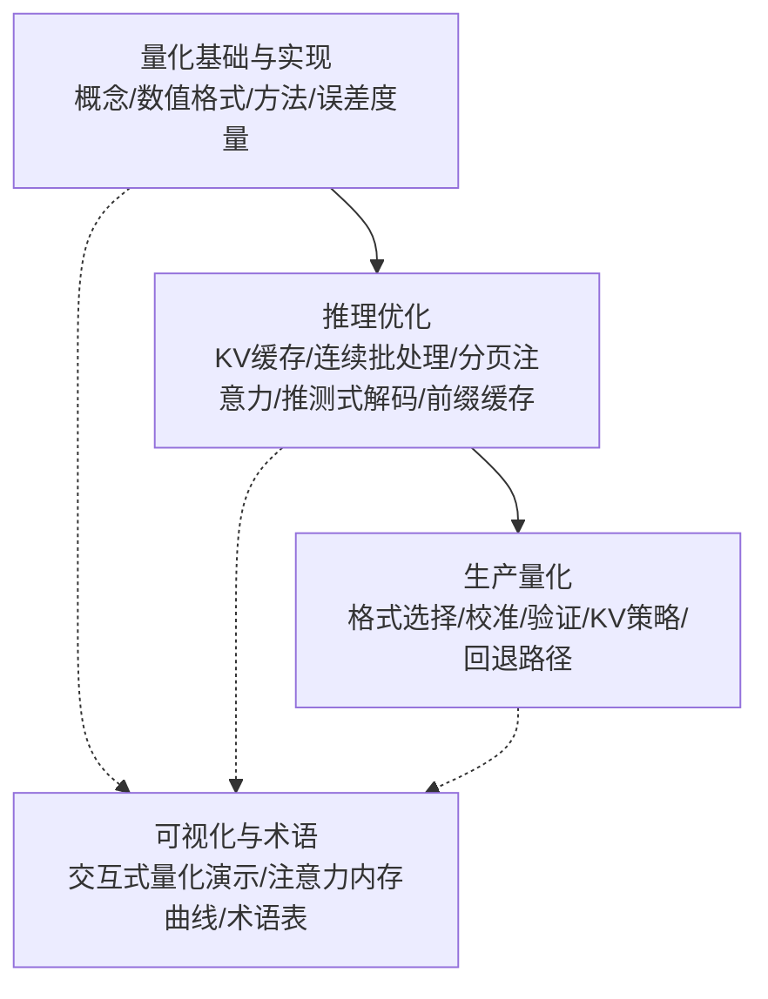
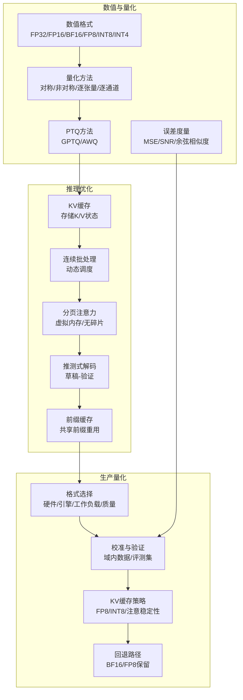
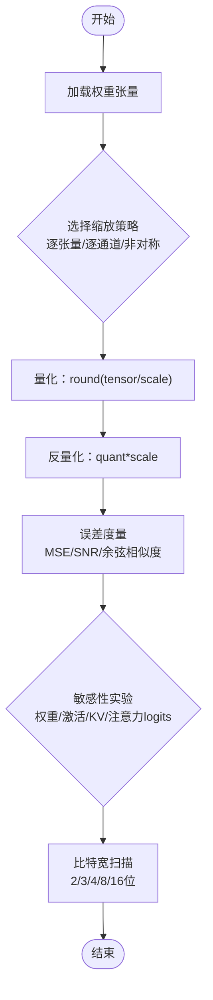
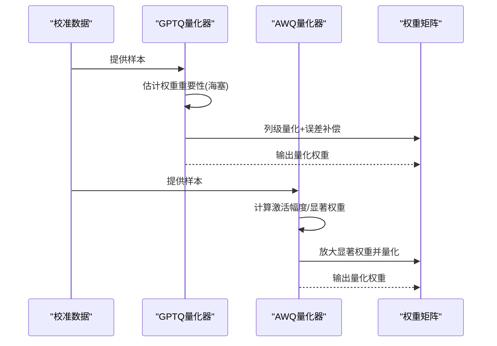
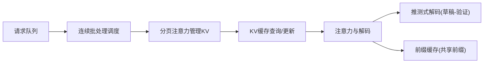
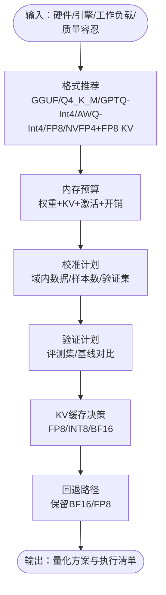
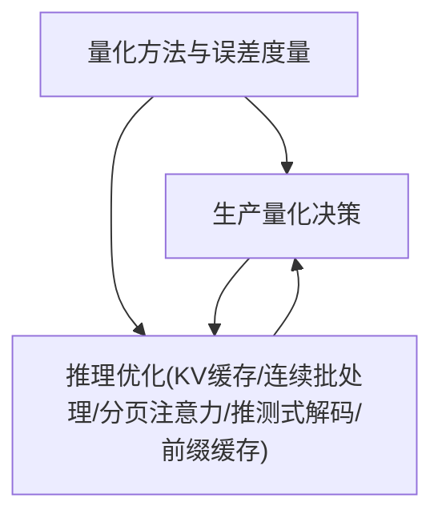

# 量化技术与冷启动缓解

<cite>
**本文引用的文件**
- [量化：让模型更小](file://phases/10-llms-from-scratch/11-quantization/docs/en.md)
- [量化技能清单](file://phases/10-llms-from-scratch/11-quantization/outputs/skill-quantization.md)
- [main.py](file://phases/10-llms-from-scratch/11-quantization/code/main.py)
- [推理优化](file://phases/10-llms-from-scratch/12-inference-optimization/docs/en.md)
- [生产量化选择器](file://phases/17-infrastructure-and-production/09-production-quantization/outputs/skill-quantization-picker.md)
- [lesson-figures.js](file://site/lesson-figures.js)
- [figures-transformers.js](file://site/figures-transformers.js)
- [data.js](file://site/data.js)
- [glossary/terms.md](file://glossary/terms.md)
</cite>

## 目录
1. [引言](#引言)
2. [项目结构](#项目结构)
3. [核心组件](#核心组件)
4. [架构总览](#架构总览)
5. [详细组件分析](#详细组件分析)
6. [依赖关系分析](#依赖关系分析)
7. [性能考量](#性能考量)
8. [故障排查指南](#故障排查指南)
9. [结论](#结论)
10. [附录](#附录)

## 引言
本文件面向“量化技术与冷启动缓解”课程，系统化梳理从理论到实践的性能优化路径，覆盖LLM量化原理与实现（INT4/INT8/FP4等）、量化感知训练与后训练量化的权衡、以及冷启动问题的成因与缓解策略（模型加载、权重初始化、KV缓存预热）。文档结合仓库中的量化教学脚本、推理优化教程与生产量化决策模板，给出可落地的部署流程、性能评估方法与配置建议，帮助开发者在生产环境中安全高效地应用量化与冷启动缓解技术。

## 项目结构
本课程相关资源主要分布在以下模块：
- 量化基础与实现：量化概念、数值格式、对称/非对称量化、感知度量、比特宽扫描、敏感性实验、GPTQ/AWQ模拟、内存估算与实战脚本
- 推理优化：KV缓存、连续批处理、分页注意力、推测式解码、前缀缓存、引擎对比与实操
- 生产量化：格式选择、校准与验证、KV缓存策略、回退路径与预算计算
- 可视化与术语：交互式量化演示、注意力内存曲线、术语表

**章节来源**
- [量化：让模型更小:1-800](file://phases/10-llms-from-scratch/11-quantization/docs/en.md#L1-L800)
- [推理优化:1-784](file://phases/10-llms-from-scratch/12-inference-optimization/docs/en.md#L1-L784)
- [生产量化选择器:1-33](file://phases/17-infrastructure-and-production/09-production-quantization/outputs/skill-quantization-picker.md#L1-L33)
- [lesson-figures.js:421-457](file://site/lesson-figures.js#L421-L457)
- [figures-transformers.js:406-458](file://site/figures-transformers.js#L406-L458)
- [glossary/terms.md:291-297](file://glossary/terms.md#L291-L297)

## 核心组件
- 数值格式与精度权衡：FP32/FP16/BF16/FP8/INT8/INT4等格式的位宽、动态范围与精度差异，以及在训练/推理中的适用性
- 量化方法与误差度量：对称/非对称、逐张量/逐通道缩放；感知度量指标（MSE/SNR/余弦相似度）；比特宽扫描与敏感性实验
- 先进PTQ方法：GPTQ（基于海塞矩阵重要性的列级优化）、AWQ（激活感知的显著权重保护）
- 内存与吞吐估算：参数量与位宽的关系、KV缓存内存公式、端到端输出误差评估
- 推理优化：KV缓存、连续批处理、分页注意力、推测式解码、前缀缓存
- 生产量化决策：硬件/引擎/工作负载/质量容忍度下的格式选择、校准与验证计划、KV缓存决策与回退路径

**章节来源**
- [量化：让模型更小:29-225](file://phases/10-llms-from-scratch/11-quantization/docs/en.md#L29-L225)
- [main.py:82-178](file://phases/10-llms-from-scratch/11-quantization/code/main.py#L82-L178)
- [main.py:275-365](file://phases/10-llms-from-scratch/11-quantization/code/main.py#L275-L365)
- [main.py:419-438](file://phases/10-llms-from-scratch/11-quantization/code/main.py#L419-L438)
- [推理优化:62-98](file://phases/10-llms-from-scratch/12-inference-optimization/docs/en.md#L62-L98)
- [推理优化:157-187](file://phases/10-llms-from-scratch/12-inference-optimization/docs/en.md#L157-L187)
- [生产量化选择器:10-33](file://phases/17-infrastructure-and-production/09-production-quantization/outputs/skill-quantization-picker.md#L10-L33)

## 架构总览
下图展示了从“数值格式与量化方法”到“推理优化与生产量化”的整体架构，强调量化在训练/推理阶段的定位、KV缓存作为内存瓶颈的关键角色，以及生产量化决策如何平衡硬件、引擎、工作负载与质量目标。

**图表来源**
- [量化：让模型更小:29-225](file://phases/10-llms-from-scratch/11-quantization/docs/en.md#L29-L225)
- [推理优化:62-187](file://phases/10-llms-from-scratch/12-inference-optimization/docs/en.md#L62-L187)
- [生产量化选择器:10-33](file://phases/17-infrastructure-and-production/09-production-quantization/outputs/skill-quantization-picker.md#L10-L33)

## 详细组件分析

### 组件A：量化方法与误差度量
- 对称/非对称量化：通过缩放因子将浮点权重映射到整数区间，再在推理时反量化恢复
- 逐张量/逐通道缩放：逐通道能显著提升质量，是生产量化标准做法
- 误差度量：MSE、SNR、余弦相似度用于衡量重建误差与方向一致性
- 敏感性实验：权重/激活/KV缓存/注意力logits的敏感度排序，指导混合精度策略
- 比特宽扫描：观察不同位宽下的误差与压缩比拐点，确定可用的最低精度

**图表来源**
- [main.py:82-178](file://phases/10-llms-from-scratch/11-quantization/code/main.py#L82-L178)
- [main.py:158-197](file://phases/10-llms-from-scratch/11-quantization/code/main.py#L158-L197)
- [main.py:217-272](file://phases/10-llms-from-scratch/11-quantization/code/main.py#L217-L272)

**章节来源**
- [量化：让模型更小:83-141](file://phases/10-llms-from-scratch/11-quantization/docs/en.md#L83-L141)
- [main.py:82-178](file://phases/10-llms-from-scratch/11-quantization/code/main.py#L82-L178)
- [main.py:158-197](file://phases/10-llms-from-scratch/11-quantization/code/main.py#L158-L197)
- [main.py:217-272](file://phases/10-llms-from-scratch/11-quantization/code/main.py#L217-L272)

### 组件B：先进PTQ方法（GPTQ/AWQ）
- GPTQ：利用校准数据估计权重重要性（海塞矩阵），按重要性分配量化误差，逐列优化
- AWQ：识别显著权重（与大激活相乘的权重），在量化前放大这些权重，随后降低对应激活，保持重要信息

**图表来源**
- [main.py:275-327](file://phases/10-llms-from-scratch/11-quantization/code/main.py#L275-L327)
- [main.py:330-365](file://phases/10-llms-from-scratch/11-quantization/code/main.py#L330-L365)

**章节来源**
- [量化：让模型更小:142-186](file://phases/10-llms-from-scratch/11-quantization/docs/en.md#L142-L186)
- [main.py:275-327](file://phases/10-llms-from-scratch/11-quantization/code/main.py#L275-L327)
- [main.py:330-365](file://phases/10-llms-from-scratch/11-quantization/code/main.py#L330-L365)

### 组件C：推理优化与KV缓存
- KV缓存：存储历史键值向量，避免重复计算，KV内存与层数、头数、维度、序列长度线性相关
- 连续批处理：请求到达即插入活跃批次，减少空闲槽位，提高GPU利用率
- 分页注意力：固定页大小管理KV缓存，消除碎片，支持共享前缀的写时复制
- 推测式解码：草稿模型预测候选，目标模型一次性验证，数学等价且2-3倍加速
- 前缀缓存：Radix树索引公共前缀，跨请求复用KV，显著节省预填时间

**图表来源**
- [推理优化:62-187](file://phases/10-llms-from-scratch/12-inference-optimization/docs/en.md#L62-L187)

**章节来源**
- [推理优化:62-98](file://phases/10-llms-from-scratch/12-inference-optimization/docs/en.md#L62-L98)
- [推理优化:99-156](file://phases/10-llms-from-scratch/12-inference-optimization/docs/en.md#L99-L156)
- [推理优化:157-187](file://phases/10-llms-from-scratch/12-inference-optimization/docs/en.md#L157-L187)
- [推理优化:188-197](file://phases/10-llms-from-scratch/12-inference-optimization/docs/en.md#L188-L197)

### 组件D：生产量化决策与部署
- 格式选择：依据硬件（CPU/GPU/Blackwell）、引擎（vLLM/SGLang/TRT-LLM/llama.cpp）、任务类型（聊天/推理/代码/多LoRA）与质量容忍度
- 内存预算：权重+KV缓存+激活+开销，确认单卡或多卡需求
- 校准与验证：域内数据、校准集/验证集划分、评测集（HumanEval/MATH/MMLU/MT-Bench）
- KV缓存决策：推理场景优先FP8；注意力精度边际时考虑BF16；仅经验证后采用INT8
- 回退路径：保留BF16/FP8权重，出现质量下降时快速切回

**图表来源**
- [生产量化选择器:10-33](file://phases/17-infrastructure-and-production/09-production-quantization/outputs/skill-quantization-picker.md#L10-L33)

**章节来源**
- [生产量化选择器:10-33](file://phases/17-infrastructure-and-production/09-production-quantization/outputs/skill-quantization-picker.md#L10-L33)

### 组件E：可视化与术语
- 量化演示：交互式比特宽与模型规模/精度关系，直观展示压缩比与误差趋势
- 注意力内存曲线：标准注意力O(N^2)与FlashAttention O(N)内存对比，解释长上下文优势
- 术语：量化、QLoRA、GPTQ/AWQ、GGUF等关键概念定义与要点

**章节来源**
- [lesson-figures.js:421-457](file://site/lesson-figures.js#L421-L457)
- [figures-transformers.js:406-458](file://site/figures-transformers.js#L406-L458)
- [glossary/terms.md:274-297](file://glossary/terms.md#L274-L297)

## 依赖关系分析
- 量化方法依赖于数值格式与误差度量，进而指导生产量化选择
- 推理优化围绕KV缓存展开，KV缓存的内存与精度直接影响解码阶段的内存带宽瓶颈
- 生产量化决策依赖于推理优化的KV策略与误差度量结果，形成闭环

**图表来源**
- [main.py:137-156](file://phases/10-llms-from-scratch/11-quantization/code/main.py#L137-L156)
- [推理优化:62-187](file://phases/10-llms-from-scratch/12-inference-optimization/docs/en.md#L62-L187)
- [生产量化选择器:10-33](file://phases/17-infrastructure-and-production/09-production-quantization/outputs/skill-quantization-picker.md#L10-L33)

**章节来源**
- [main.py:137-156](file://phases/10-llms-from-scratch/11-quantization/code/main.py#L137-L156)
- [推理优化:62-187](file://phases/10-llms-from-scratch/12-inference-optimization/docs/en.md#L62-L187)
- [生产量化选择器:10-33](file://phases/17-infrastructure-and-production/09-production-quantization/outputs/skill-quantization-picker.md#L10-L33)

## 性能考量
- 量化收益与代价：每减半位宽约减半内存与提升吞吐，但精度损失随位宽下降而增大；INT8近无损，INT4需精心方案（GPTQ/AWQ）
- KV缓存压力：KV内存与序列长度线性增长，长上下文下KV主导显存；FP8 KV可显著降低压力
- 解码阶段瓶颈：解码是内存带宽受限，连续批处理与分页注意力可提升GPU利用率；推测式解码在高接受率下获得2-3倍加速
- 实际收益：H100上FP16→FP8可获30-50%吞吐提升且质量损失极小；INT4在良好方案下仍可保持较高质量

**章节来源**
- [量化：让模型更小:200-221](file://phases/10-llms-from-scratch/11-quantization/docs/en.md#L200-L221)
- [推理优化:29-61](file://phases/10-llms-from-scratch/12-inference-optimization/docs/en.md#L29-L61)
- [推理优化:157-187](file://phases/10-llms-from-scratch/12-inference-optimization/docs/en.md#L157-L187)

## 故障排查指南
- 常见错误与修复
  - 将嵌入层量化至INT4：首层误差会被放大传播，应保留FP16或INT8
  - 使用逐张量缩放进行INT4：易受异常值影响，应使用逐通道或分组缩放
  - 未校准GPTQ/AWQ：尺度错误导致严重退化，需使用域内样本进行校准
  - 所有层统一位宽：首尾层更敏感，应采用混合精度
  - 长上下文KV缓存量化至INT4：误差随长度平方增长，应采用FP8
  - 忽略质量验证：在边界条件下可能表现不佳，务必运行困惑度与任务评测
- 回退策略：保留BF16/FP8权重，出现质量下降时快速切回

**章节来源**
- [量化技能清单:112-122](file://phases/10-llms-from-scratch/11-quantization/outputs/skill-quantization.md#L112-L122)
- [生产量化选择器:21-30](file://phases/17-infrastructure-and-production/09-production-quantization/outputs/skill-quantization-picker.md#L21-L30)

## 结论
量化与推理优化是LLM部署的两大支柱。通过合理的数值格式选择、误差度量与先进PTQ方法，可在保证质量的前提下大幅降低内存与提升吞吐；配合KV缓存管理、连续批处理、分页注意力、推测式解码与前缀缓存，可有效缓解解码阶段的内存带宽瓶颈；最终以生产量化决策模板为抓手，将硬件、引擎、工作负载与质量目标系统化落地，形成可验证、可回退的工程化方案。

## 附录
- 术语速查：量化、QLoRA、GPTQ、AWQ、GGUF等
- 交互式演示：量化比特宽与模型规模/精度关系、注意力内存曲线
- 代码参考：量化方法实现、误差度量、敏感性实验、GPTQ/AWQ模拟、内存估算

**章节来源**
- [glossary/terms.md:274-297](file://glossary/terms.md#L274-L297)
- [lesson-figures.js:421-457](file://site/lesson-figures.js#L421-L457)
- [figures-transformers.js:406-458](file://site/figures-transformers.js#L406-L458)
- [main.py:82-178](file://phases/10-llms-from-scratch/11-quantization/code/main.py#L82-L178)
- [main.py:275-365](file://phases/10-llms-from-scratch/11-quantization/code/main.py#L275-L365)
- [main.py:419-438](file://phases/10-llms-from-scratch/11-quantization/code/main.py#L419-L438)