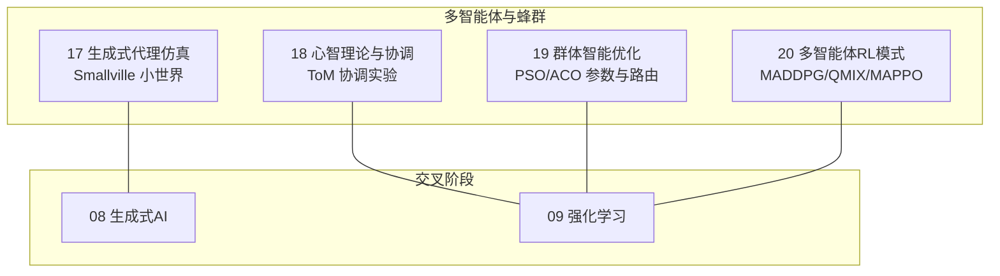
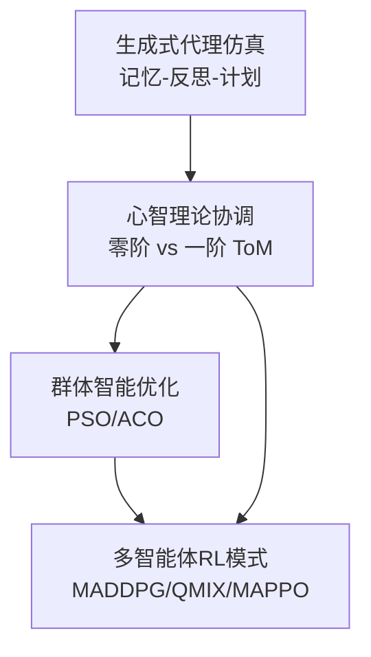
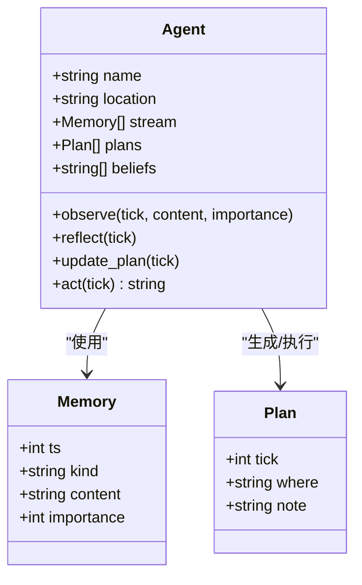
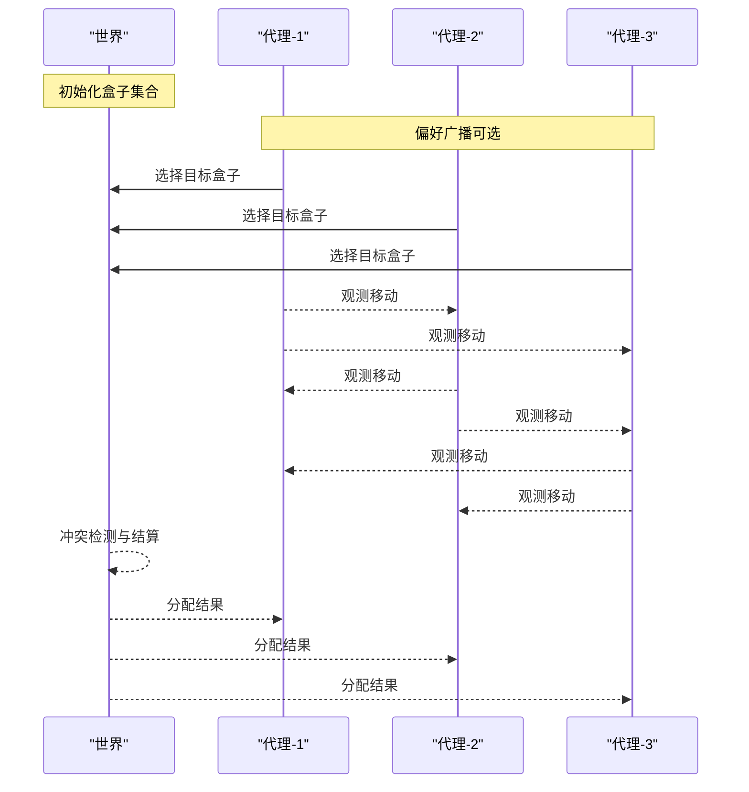
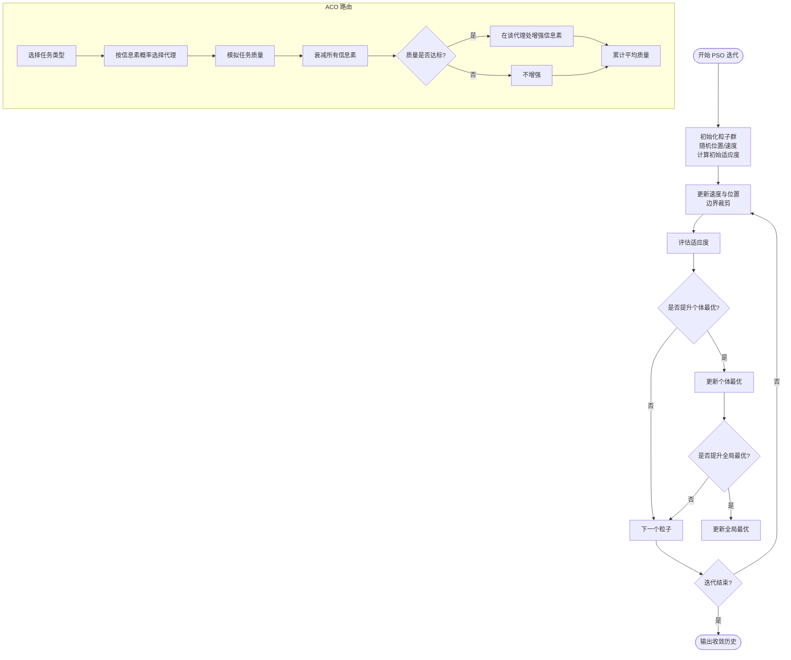
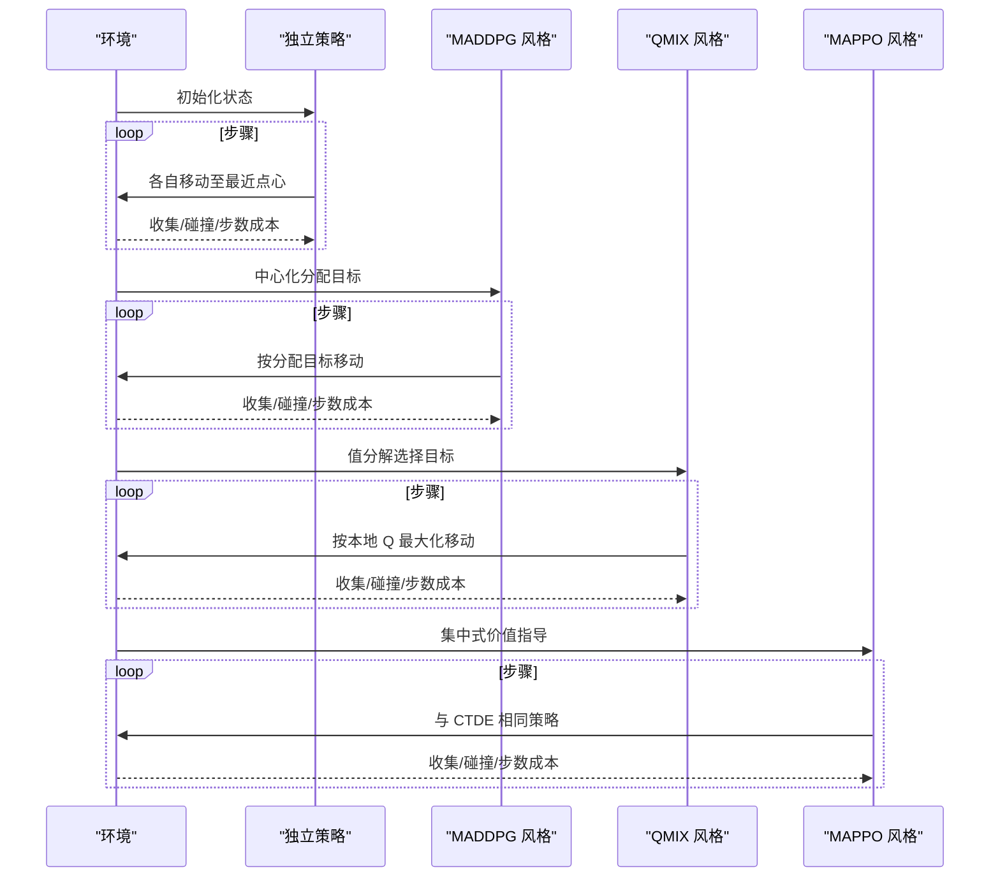
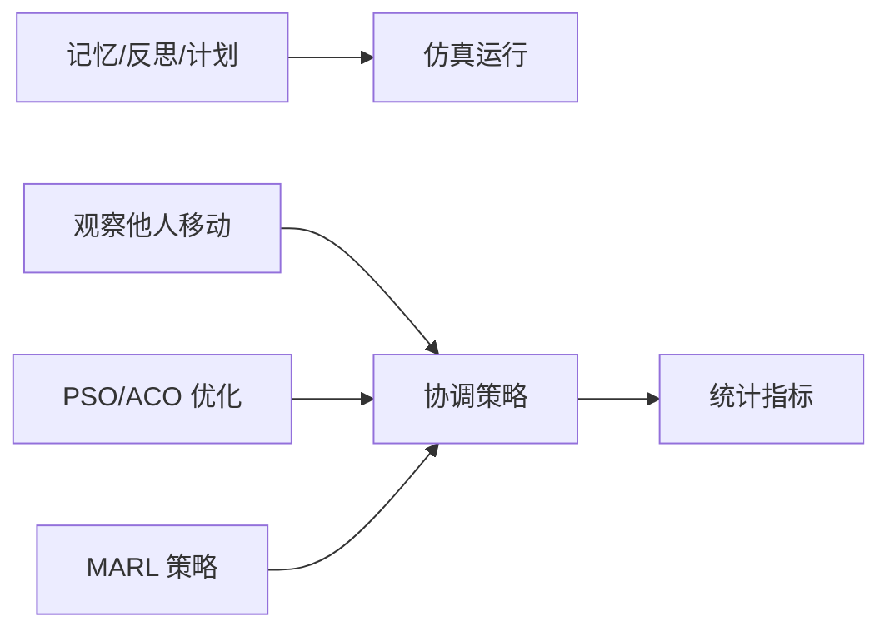

# 仿真与应用

<cite>
**本文引用的文件**
- [phases/16-multi-agent-and-swarms/README.md](file://phases/16-multi-agent-and-swarms/README.md)
- [phases/16-multi-agent-and-swarms/17-generative-agents-simulation/code/main.py](file://phases/16-multi-agent-and-swarms/17-generative-agents-simulation/code/main.py)
- [phases/16-multi-agent-and-swarms/18-theory-of-mind-coordination/code/main.py](file://phases/16-multi-agent-and-swarms/18-theory-of-mind-coordination/code/main.py)
- [phases/16-multi-agent-and-swarms/19-swarm-optimization-pso-aco/code/main.py](file://phases/16-multi-agent-and-swarms/19-swarm-optimization-pso-aco/code/main.py)
- [phases/16-multi-agent-and-swarms/20-marl-maddpg-qmix-mappo/code/main.py](file://phases/16-multi-agent-and-swarms/20-marl-maddpg-qmix-mappo/code/main.py)
- [site/data.js](file://site/data.js)
- [ROADMAP.md](file://ROADMAP.md)
- [phases/09-reinforcement-learning/README.md](file://phases/09-reinforcement-learning/README.md)
- [phases/08-generative-ai/README.md](file://phases/08-generative-ai/README.md)
</cite>

## 目录
1. 引言
2. 项目结构
3. 核心组件
4. 架构总览
5. 组件详解
6. 依赖关系分析
7. 性能考量
8. 故障排查指南
9. 结论
10. 附录

## 引言
本文件面向“仿真与应用”主题，围绕生成式代理仿真系统、心智理论（ToM）在多智能体协调中的作用、群体智能优化算法（PSO、ACO）、以及多智能体强化学习（MARL，含 MADDPG、QMIX、MAPPO）展开系统化文档。内容既覆盖从基础到进阶的原理与实现，也包含可直接运行的最小化示例代码路径，帮助读者快速搭建仿真环境、设计代理行为并进行性能评估。

## 项目结构
本仓库第16阶段聚焦“多智能体与蜂群”，包含从通信协议、角色分工、协调模式到仿真与评估的完整链条；同时与第9阶段“强化学习”、第8阶段“生成式AI”形成跨阶段知识衔接。下图给出与仿真与应用直接相关的模块视图：

图表来源
- [phases/16-multi-agent-and-swarms/README.md:1-6](file://phases/16-multi-agent-and-swarms/README.md#L1-L6)
- [ROADMAP.md:424-452](file://ROADMAP.md#L424-L452)
- [phases/08-generative-ai/README.md:1-25](file://phases/08-generative-ai/README.md#L1-L25)
- [phases/09-reinforcement-learning/README.md:1-6](file://phases/09-reinforcement-learning/README.md#L1-L6)

章节来源
- [phases/16-multi-agent-and-swarms/README.md:1-6](file://phases/16-multi-agent-and-swarms/README.md#L1-L6)
- [ROADMAP.md:424-452](file://ROADMAP.md#L424-L452)

## 核心组件
- 生成式代理仿真（Smallville 小世界）
  - 基于内存流、反思与计划的三段式认知循环，实现无需中央编排的自发协调。
  - 关键实现路径：[phases/16-multi-agent-and-swarms/17-generative-agents-simulation/code/main.py:1-147](file://phases/16-multi-agent-and-swarms/17-generative-agents-simulation/code/main.py#L1-L147)
- 心智理论（ToM）与协调实验
  - 零阶 vs 一阶 ToM 代理在共享资源分配任务上的对比，引入“偏好广播”作为廉价通信通道，验证可测量的协调效应。
  - 关键实现路径：[phases/16-multi-agent-and-swarms/18-theory-of-mind-coordination/code/main.py:1-157](file://phases/16-multi-agent-and-swarms/18-theory-of-mind-coordination/code/main.py#L1-L157)
- 群体智能优化（PSO/ACO）
  - LMPSO 在参数空间上进行无梯度搜索；AMRO-S 使用蚁群算法进行任务路由，基于质量阈值强化路径。
  - 关键实现路径：[phases/16-multi-agent-and-swarms/19-swarm-optimization-pso-aco/code/main.py:1-179](file://phases/16-multi-agent-and-swarms/19-swarm-optimization-pso-aco/code/main.py#L1-L179)
- 多智能体强化学习（MARL）模式
  - 在 4×4 网格上演示独立策略、MADDPG 风格（中心化训练去中心化执行，CTDE）、QMIX（值分解）与 MAPPO（集中式价值）的行为差异与收敛特性。
  - 关键实现路径：[phases/16-multi-agent-and-swarms/20-marl-maddpg-qmix-mappo/code/main.py:1-160](file://phases/16-multi-agent-and-swarms/20-marl-maddpg-qmix-mappo/code/main.py#L1-L160)

章节来源
- [site/data.js:16466-16560](file://site/data.js#L16466-L16560)

## 架构总览
下图展示从“生成式代理仿真”到“心智理论协调”再到“群体智能优化”和“多智能体强化学习”的知识与实践闭环，体现从行为建模到环境交互、从推理机制到优化调度的演进路径。

图表来源
- [phases/16-multi-agent-and-swarms/17-generative-agents-simulation/code/main.py:1-147](file://phases/16-multi-agent-and-swarms/17-generative-agents-simulation/code/main.py#L1-L147)
- [phases/16-multi-agent-and-swarms/18-theory-of-mind-coordination/code/main.py:1-157](file://phases/16-multi-agent-and-swarms/18-theory-of-mind-coordination/code/main.py#L1-L157)
- [phases/16-multi-agent-and-swarms/19-swarm-optimization-pso-aco/code/main.py:1-179](file://phases/16-multi-agent-and-swarms/19-swarm-optimization-pso-aco/code/main.py#L1-L179)
- [phases/16-multi-agent-and-swarms/20-marl-maddpg-qmix-mappo/code/main.py:1-160](file://phases/16-multi-agent-and-swarms/20-marl-maddpg-qmix-mappo/code/main.py#L1-L160)

## 组件详解

### 生成式代理仿真（Smallville 小世界）
- 设计要点
  - 记忆模块：按时间戳、类型、重要度记录观察与反思。
  - 反思模块：对近期高重要度事件进行归纳，形成信念。
  - 计划模块：根据信念更新行动计划；行动时驱动位置转移。
  - 检索模块：综合“时效性、重要度、相关性”打分，选取 top-k 记忆。
- 行为建模
  - 通过邀请传播与共同目标，代理在无中央编排的情况下自发汇聚。
  - 移除反思会阻断信念形成，从而影响计划与最终协调效果。
- 环境交互
  - 代理仅在计划触发时改变位置，最终达成一致地点。
- 代码路径
  - [phases/16-multi-agent-and-swarms/17-generative-agents-simulation/code/main.py:1-147](file://phases/16-multi-agent-and-swarms/17-generative-agents-simulation/code/main.py#L1-L147)

图表来源
- [phases/16-multi-agent-and-swarms/17-generative-agents-simulation/code/main.py:18-64](file://phases/16-multi-agent-and-swarms/17-generative-agents-simulation/code/main.py#L18-L64)

章节来源
- [phases/16-multi-agent-and-swarms/17-generative-agents-simulation/code/main.py:1-147](file://phases/16-multi-agent-and-swarms/17-generative-agents-simulation/code/main.py#L1-L147)

### 心智理论（ToM）与协调实验
- 实验设置
  - 三个代理收集三个盒子中的令牌，不可直接通信，只能观测彼此移动。
  - 零阶代理随机选择未被占用的盒子；一阶 ToM 代理基于上一轮观测推断他人目标并避开冲突盒子。
  - 引入“偏好广播”作为廉价通信通道，使 ToM 代理在初始轮次即具备对他人偏好的先验。
- 测量指标
  - 完成试验数、每试验碰撞次数、平均回合数。
- 关键结论
  - ToM 代理在引入偏好广播后显著减少碰撞并更快完成任务。
  - 移除偏好广播会使效果消失，说明 ToM 提示并非“装饰性”，而是“可承载”的协调机制。
- 代码路径
  - [phases/16-multi-agent-and-swarms/18-theory-of-mind-coordination/code/main.py:1-157](file://phases/16-multi-agent-and-swarms/18-theory-of-mind-coordination/code/main.py#L1-L157)

图表来源
- [phases/16-multi-agent-and-swarms/18-theory-of-mind-coordination/code/main.py:51-117](file://phases/16-multi-agent-and-swarms/18-theory-of-mind-coordination/code/main.py#L51-L117)

章节来源
- [phases/16-multi-agent-and-swarms/18-theory-of-mind-coordination/code/main.py:1-157](file://phases/16-multi-agent-and-swarms/18-theory-of-mind-coordination/code/main.py#L1-L157)

### 群体智能优化（PSO/ACO）
- PSO（LMPSO）
  - 在二维参数空间（如温度、top_k 权重）上进行无梯度搜索，以脚本化的适应度函数引导收敛。
  - 通过粒子速度与个体/全局最优更新实现局部搜索与全局探索的平衡。
- ACO（AMRO-S）
  - 针对 3 个代理与 4 类任务的路由问题，使用信息素矩阵记录历史质量反馈。
  - 质量阈值门控防止低质量代理过早锁定，衰减项避免长期记忆主导。
- 代码路径
  - [phases/16-multi-agent-and-swarms/19-swarm-optimization-pso-aco/code/main.py:1-179](file://phases/16-multi-agent-and-swarms/19-swarm-optimization-pso-aco/code/main.py#L1-L179)

图表来源
- [phases/16-multi-agent-and-swarms/19-swarm-optimization-pso-aco/code/main.py:34-71](file://phases/16-multi-agent-and-swarms/19-swarm-optimization-pso-aco/code/main.py#L34-L71)
- [phases/16-multi-agent-and-swarms/19-swarm-optimization-pso-aco/code/main.py:75-140](file://phases/16-multi-agent-and-swarms/19-swarm-optimization-pso-aco/code/main.py#L75-L140)

章节来源
- [phases/16-multi-agent-and-swarms/19-swarm-optimization-pso-aco/code/main.py:1-179](file://phases/16-multi-agent-and-swarms/19-swarm-optimization-pso-aco/code/main.py#L1-L179)

### 多智能体强化学习（MARL）模式
- 环境设定
  - 4×4 网格，两个代理与两个点心，步数成本与碰撞惩罚共同构成奖励结构。
- 策略对比
  - 独立策略：各自寻找最近点心，易发生重复努力与碰撞。
  - MADDPG 风格（CTDE）：中心化分配最优目标，去中心化执行，减少重复努力。
  - QMIX 风格（值分解）：基于本地 Q 值的单调混合，等价于中心化分配的 argmax。
  - MAPPO 风格（集中式价值）：脚本化版本在此任务上与 MADDPG 收敛至相似策略。
- 代码路径
  - [phases/16-multi-agent-and-swarms/20-marl-maddpg-qmix-mappo/code/main.py:1-160](file://phases/16-multi-agent-and-swarms/20-marl-maddpg-qmix-mappo/code/main.py#L1-L160)

图表来源
- [phases/16-multi-agent-and-swarms/20-marl-maddpg-qmix-mappo/code/main.py:69-129](file://phases/16-multi-agent-and-swarms/20-marl-maddpg-qmix-mappo/code/main.py#L69-L129)

章节来源
- [phases/16-multi-agent-and-swarms/20-marl-maddpg-qmix-mappo/code/main.py:1-160](file://phases/16-multi-agent-and-swarms/20-marl-maddpg-qmix-mappo/code/main.py#L1-L160)

## 依赖关系分析
- 模块内聚与耦合
  - 生成式代理仿真内部以 Agent/World/Memory/Plan 为核心数据结构，耦合度低，便于扩展与替换。
  - ToM 协调实验以“观察-决策-冲突检测-结算”为主线，逻辑清晰，易于注入不同推理策略。
  - PSO/ACO 两套算法分别对应连续参数优化与离散任务路由，彼此独立但均可用于代理参数与路由的优化。
  - MARL 模式以统一环境抽象为基座，策略差异体现在“中心化/分解/集中式价值”等训练范式。
- 外部依赖
  - 示例均采用标准库实现，无外部依赖，便于移植与教学演示。
- 循环依赖
  - 各模块均为单向流程，不存在循环依赖风险。

图表来源
- [phases/16-multi-agent-and-swarms/17-generative-agents-simulation/code/main.py:41-63](file://phases/16-multi-agent-and-swarms/17-generative-agents-simulation/code/main.py#L41-L63)
- [phases/16-multi-agent-and-swarms/18-theory-of-mind-coordination/code/main.py:47-49](file://phases/16-multi-agent-and-swarms/18-theory-of-mind-coordination/code/main.py#L47-L49)
- [phases/16-multi-agent-and-swarms/19-swarm-optimization-pso-aco/code/main.py:75-102](file://phases/16-multi-agent-and-swarms/19-swarm-optimization-pso-aco/code/main.py#L75-L102)
- [phases/16-multi-agent-and-swarms/20-marl-maddpg-qmix-mappo/code/main.py:94-104](file://phases/16-multi-agent-and-swarms/20-marl-maddpg-qmix-mappo/code/main.py#L94-L104)

## 性能考量
- 生成式代理仿真
  - 记忆检索的打分权重需结合任务规模与噪声水平调整；过高的时效性权重可能导致短期记忆主导。
  - 反思频率与窗口大小影响信念形成速度与稳定性，应与仿真步长匹配。
- ToM 协调
  - 偏好广播的注入时机与范围直接影响协调效率；广播粒度过细可能增加通信开销，过粗则削弱 ToM 效果。
  - 冲突检测与结算规则需避免“赢家通吃”，保证公平性与收敛性。
- PSO/ACO
  - PSO 的惯性权重与学习因子需随迭代动态调整以平衡探索与收敛；边界裁剪防止越界。
  - ACO 的信息素衰减与质量阈值需与任务难度匹配，避免过早收敛或震荡。
- MARL
  - CTDE 在小规模任务上更易收敛且鲁棒；QMIX 的值分解要求局部 Q 的单调性；MAPPO 的集中式价值有助于稳定策略学习。
  - 碰撞惩罚与步数成本需与奖励结构相容，避免策略退化。

## 故障排查指南
- 生成式代理不协调
  - 检查反思是否启用、信念是否形成、计划是否更新；若缺失任一环节，协调将失败。
  - 调整记忆重要度阈值与检索窗口，确保关键事件被及时纳入反思。
- ToM 无效
  - 确认是否注入了“偏好广播”；移除广播会导致协调效果消失。
  - 检查观察窗口长度是否足以捕捉他人目标；过短会降低 ToM 推断准确性。
- PSO 不收敛
  - 检查边界裁剪与速度更新公式；适当降低惯性权重或增大学习因子。
  - 评估适应度函数是否过于平坦，必要时引入更高频的波动项。
- ACO 锁定错误代理
  - 提升质量阈值或增大衰减系数，避免低质量代理过早主导信息素。
  - 扩展任务类型与代理能力矩阵，提高多样性。
- MARL 收敛慢
  - 对于 QMIX，确认局部 Q 的单调性假设是否满足；对于 MAPPO，检查集中式价值的稳定性。
  - 减少步数上限或增加奖励强度，加速稀疏奖励任务的学习。

章节来源
- [phases/16-multi-agent-and-swarms/17-generative-agents-simulation/code/main.py:44-63](file://phases/16-multi-agent-and-swarms/17-generative-agents-simulation/code/main.py#L44-L63)
- [phases/16-multi-agent-and-swarms/18-theory-of-mind-coordination/code/main.py:66-71](file://phases/16-multi-agent-and-swarms/18-theory-of-mind-coordination/code/main.py#L66-L71)
- [phases/16-multi-agent-and-swarms/19-swarm-optimization-pso-aco/code/main.py:36-48](file://phases/16-multi-agent-and-swarms/19-swarm-optimization-pso-aco/code/main.py#L36-L48)
- [phases/16-multi-agent-and-swarms/20-marl-maddpg-qmix-mappo/code/main.py:94-104](file://phases/16-multi-agent-and-swarms/20-marl-maddpg-qmix-mappo/code/main.py#L94-L104)

## 结论
本文件将生成式代理仿真、心智理论协调、群体智能优化与多智能体强化学习串联为一套可操作的仿真与应用框架。通过最小化示例与明确的评估指标，读者可以快速搭建自己的仿真环境、设计代理行为，并在复杂场景中进行参数调优与收敛分析。建议在实践中优先验证“可承载”的协调机制（如 ToM 的偏好广播），再引入更复杂的优化与学习策略，以获得稳健的协同效果。

## 附录
- 相关技能与课程概览
  - site 数据中列出的技能标签与课程链接可用于进一步深化：生成式代理仿真设计、ToM 审计、群优化器选择、MARL 策略挑选等。
- 学习路线参考
  - 第16阶段课程清单与估计时长可参考路线图，结合第8阶段“生成式AI”与第9阶段“强化学习”的前置知识，形成完整的知识体系。

章节来源
- [site/data.js:16466-16560](file://site/data.js#L16466-L16560)
- [ROADMAP.md:424-452](file://ROADMAP.md#L424-L452)