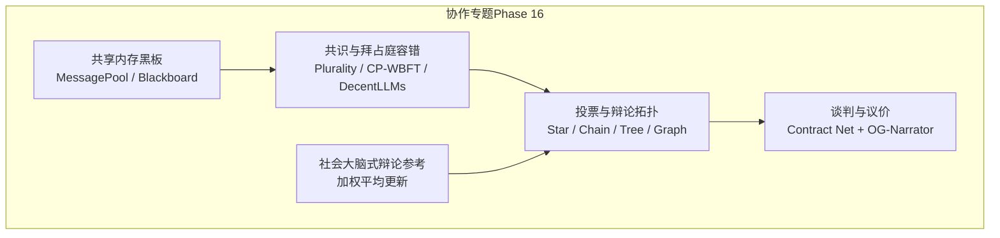
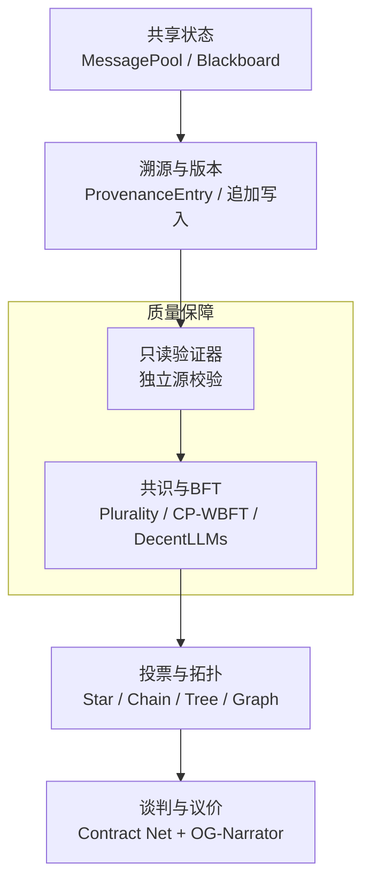
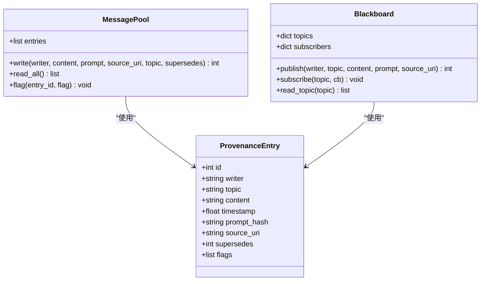
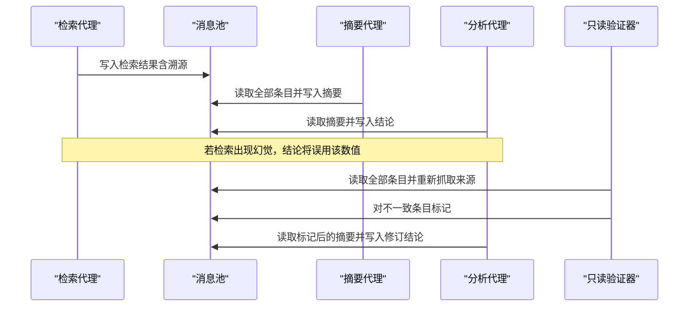
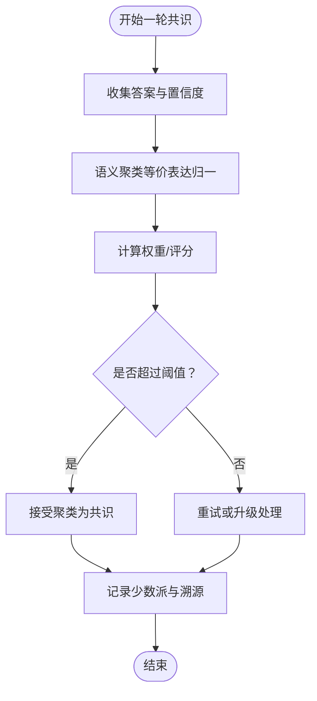
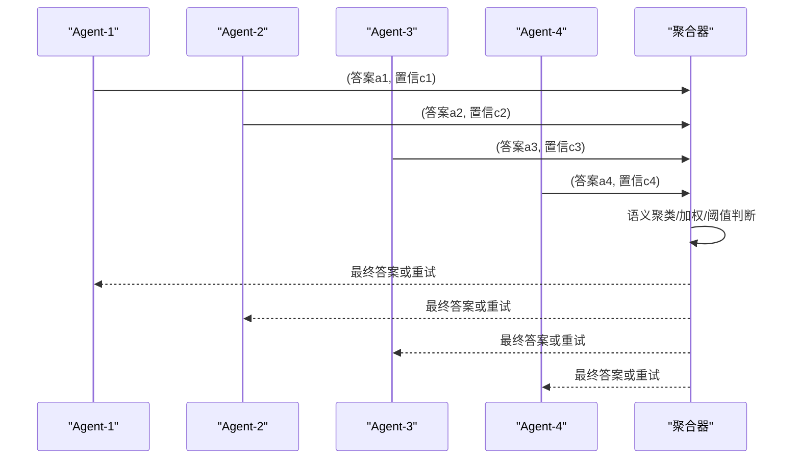
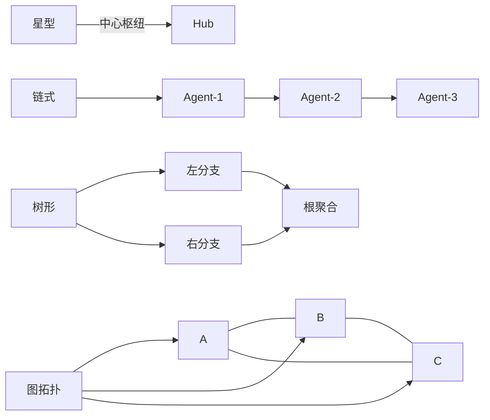
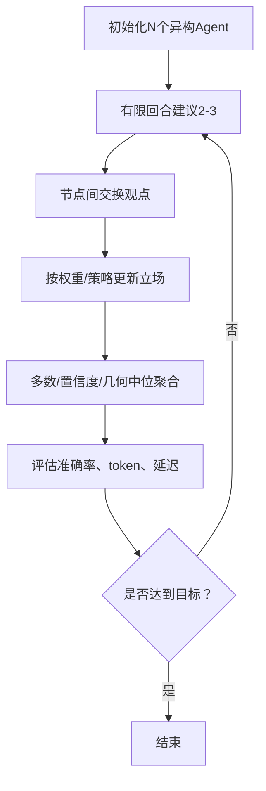
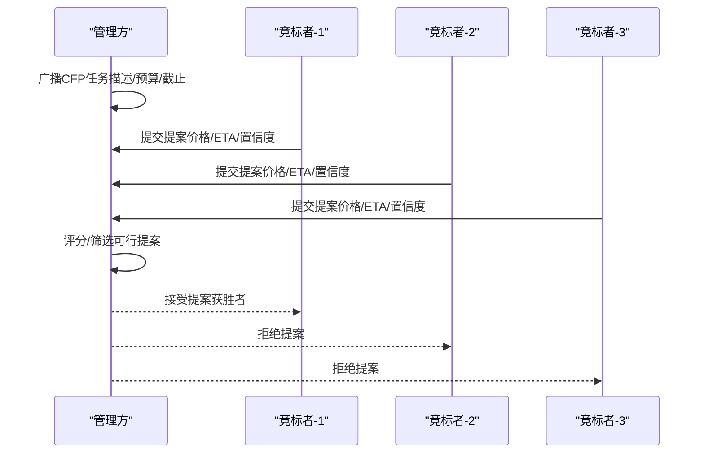
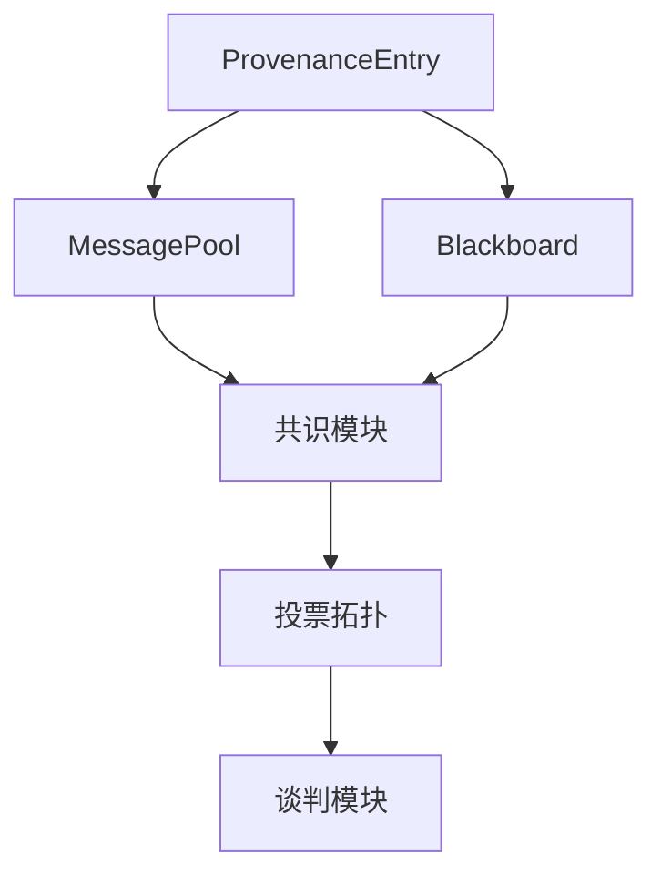

# 协作技术与机制

<cite>
**本文引用的文件**
- [phases/16-multi-agent-and-swarms/13-shared-memory-blackboard/docs/en.md](file://phases/16-multi-agent-and-swarms/13-shared-memory-blackboard/docs/en.md)
- [phases/16-multi-agent-and-swarms/13-shared-memory-blackboard/code/main.py](file://phases/16-multi-agent-and-swarms/13-shared-memory-blackboard/code/main.py)
- [phases/16-multi-agent-and-swarms/14-consensus-and-bft/docs/en.md](file://phases/16-multi-agent-and-swarms/14-consensus-and-bft/docs/en.md)
- [phases/16-multi-agent-and-swarms/14-consensus-and-bft/code/main.py](file://phases/16-multi-agent-and-swarms/14-consensus-and-bft/code/main.py)
- [phases/16-multi-agent-and-swarms/15-voting-debate-topology/docs/en.md](file://phases/16-multi-agent-and-swarms/15-voting-debate-topology/docs/en.md)
- [phases/16-multi-agent-and-swarms/15-voting-debate-topology/code/main.py](file://phases/16-multi-agent-and-swarms/15-voting-debate-topology/code/main.py)
- [phases/16-multi-agent-and-swarms/16-negotiation-bargaining/docs/en.md](file://phases/16-multi-agent-and-swarms/16-negotiation-bargaining/docs/en.md)
- [phases/16-multi-agent-and-swarms/16-negotiation-bargaining/code/main.py](file://phases/16-multi-agent-and-swarms/16-negotiation-bargaining/code/main.py)
- [phases/16-multi-agent-and-swarms/07-society-of-mind-debate/code/main.py](file://phases/16-multi-agent-and-swarms/07-society-of-mind-debate/code/main.py)
- [phases/16-multi-agent-and-swarms/13-shared-memory-blackboard/outputs/skill-memory-auditor.md](file://phases/16-multi-agent-and-swarms/13-shared-memory-blackboard/outputs/skill-memory-auditor.md)
- [phases/16-multi-agent-and-swarms/14-consensus-and-bft/outputs/skill-consensus-designer.md](file://phases/16-multi-agent-and-swarms/14-consensus-and-bft/outputs/skill-consensus-designer.md)
- [phases/16-multi-agent-and-swarms/15-voting-debate-topology/outputs/skill-topology-picker.md](file://phases/16-multi-agent-and-swarms/15-voting-debate-topology/outputs/skill-topology-picker.md)
</cite>

## 目录
1. [引言](#引言)
2. [项目结构](#项目结构)
3. [核心组件](#核心组件)
4. [架构总览](#架构总览)
5. [详细组件分析](#详细组件分析)
6. [依赖关系分析](#依赖关系分析)
7. [性能考量](#性能考量)
8. [故障排查指南](#故障排查指南)
9. [结论](#结论)
10. [附录](#附录)

## 引言
本文件系统化梳理协作技术与机制在多智能体系统中的工程化实现，围绕以下主题展开：共享内存黑板的数据同步与访问控制、共识与拜占庭容错的适配方案、投票与辩论拓扑的组织与收敛性、谈判博弈的策略与协议、以及面向真实任务的协作效率评估与冲突检测。文档以仓库中“多智能体与蜂群”阶段的课程资料与示例代码为基础，结合概念说明、流程图与序列图，帮助读者从原理到实现再到工程落地形成完整认知。

## 项目结构
本专题位于“多智能体与蜂群”阶段，包含四个核心模块（共享内存黑板、共识与BFT、投票与辩论拓扑、谈判与议价），每个模块均提供英文讲义文档与最小可运行示例代码，并配套技能型输出文件用于工程审计与设计。

**图表来源**
- [phases/16-multi-agent-and-swarms/13-shared-memory-blackboard/docs/en.md:1-166](file://phases/16-multi-agent-and-swarms/13-shared-memory-blackboard/docs/en.md#L1-L166)
- [phases/16-multi-agent-and-swarms/14-consensus-and-bft/docs/en.md:1-152](file://phases/16-multi-agent-and-swarms/14-consensus-and-bft/docs/en.md#L1-L152)
- [phases/16-multi-agent-and-swarms/15-voting-debate-topology/docs/en.md:1-163](file://phases/16-multi-agent-and-swarms/15-voting-debate-topology/docs/en.md#L1-L163)
- [phases/16-multi-agent-and-swarms/16-negotiation-bargaining/docs/en.md:1-166](file://phases/16-multi-agent-and-swarms/16-negotiation-bargaining/docs/en.md#L1-L166)

**章节来源**
- [phases/16-multi-agent-and-swarms/13-shared-memory-blackboard/docs/en.md:1-166](file://phases/16-multi-agent-and-swarms/13-shared-memory-blackboard/docs/en.md#L1-L166)
- [phases/16-multi-agent-and-swarms/14-consensus-and-bft/docs/en.md:1-152](file://phases/16-multi-agent-and-swarms/14-consensus-and-bft/docs/en.md#L1-L152)
- [phases/16-multi-agent-and-swarms/15-voting-debate-topology/docs/en.md:1-163](file://phases/16-multi-agent-and-swarms/15-voting-debate-topology/docs/en.md#L1-L163)
- [phases/16-multi-agent-and-swarms/16-negotiation-bargaining/docs/en.md:1-166](file://phases/16-multi-agent-and-swarms/16-negotiation-bargaining/docs/en.md#L1-L166)

## 核心组件
- 共享内存黑板：提供全量消息池与主题订阅式黑板两种拓扑；通过溯源条目、追加写入与只读验证器缓解“记忆中毒”。
- 共识与拜占庭容错：在经典PBFT思想基础上，针对LLM的随机性与模型相关性，提出置信度加权、几何中位聚合等变体。
- 投票与辩论拓扑：系统比较星型、链式、树形、全连通图四种信息流结构，给出协调成本与收益曲线。
- 谈判与议价：基于合同网协议与OG-Narrator分解，分离报价生成与叙述，显著提升成交率并降低推理泄露风险。
- 社会大脑式辩论（参考实现）：展示加权平均更新与收敛行为，体现多智能体交流对误差修正的作用。

**章节来源**
- [phases/16-multi-agent-and-swarms/13-shared-memory-blackboard/code/main.py:1-227](file://phases/16-multi-agent-and-swarms/13-shared-memory-blackboard/code/main.py#L1-L227)
- [phases/16-multi-agent-and-swarms/14-consensus-and-bft/code/main.py:1-160](file://phases/16-multi-agent-and-swarms/14-consensus-and-bft/code/main.py#L1-L160)
- [phases/16-multi-agent-and-swarms/15-voting-debate-topology/code/main.py:1-151](file://phases/16-multi-agent-and-swarms/15-voting-debate-topology/code/main.py#L1-L151)
- [phases/16-multi-agent-and-swarms/16-negotiation-bargaining/code/main.py:1-181](file://phases/16-multi-agent-and-swarms/16-negotiation-bargaining/code/main.py#L1-L181)
- [phases/16-multi-agent-and-swarms/07-society-of-mind-debate/code/main.py:1-111](file://phases/16-multi-agent-and-swarms/07-society-of-mind-debate/code/main.py#L1-L111)

## 架构总览
下图展示了从共享状态到共识再到投票与谈判的整体协作路径，强调“可观测性（溯源）—一致性（共识）—组织性（拓扑）—协议化（谈判）”的四层协同。

**图表来源**
- [phases/16-multi-agent-and-swarms/13-shared-memory-blackboard/code/main.py:17-67](file://phases/16-multi-agent-and-swarms/13-shared-memory-blackboard/code/main.py#L17-L67)
- [phases/16-multi-agent-and-swarms/14-consensus-and-bft/code/main.py:14-70](file://phases/16-multi-agent-and-swarms/14-consensus-and-bft/code/main.py#L14-L70)
- [phases/16-multi-agent-and-swarms/15-voting-debate-topology/code/main.py:38-95](file://phases/16-multi-agent-and-swarms/15-voting-debate-topology/code/main.py#L38-L95)
- [phases/16-multi-agent-and-swarms/16-negotiation-bargaining/code/main.py:115-140](file://phases/16-multi-agent-and-swarms/16-negotiation-bargaining/code/main.py#L115-L140)

## 详细组件分析

### 组件A：共享内存与黑板模式
- 设计要点
  - 全量消息池：线程安全的追加日志，适合小规模、短对话与全透明调试。
  - 主题订阅黑板：按主题路由，仅订阅者可见相关事件，适合大规模长时对话与低上下文污染。
  - 溯源条目：记录作者、时间戳、提示哈希、来源URI、覆盖关系与标记列表。
  - 写入竞争：顺序写入、乐观并发（版本）与主题分区三种模式。
  - 只读验证器：独立获取来源，标注不一致，输出经由独立通道，避免二次污染。
- 关键流程
  - 研究任务三阶段：检索（可能幻觉）→摘要→分析；无验证器时幻觉传播至最终报告；有验证器时标注并抑制错误结论。
  - 黑板演示：价格与告警两类主题分别路由给订阅者，订阅者互不可见对方主题，体现“投影视图”。

**图表来源**
- [phases/16-multi-agent-and-swarms/13-shared-memory-blackboard/code/main.py:17-104](file://phases/16-multi-agent-and-swarms/13-shared-memory-blackboard/code/main.py#L17-L104)

**图表来源**
- [phases/16-multi-agent-and-swarms/13-shared-memory-blackboard/code/main.py:112-188](file://phases/16-multi-agent-and-swarms/13-shared-memory-blackboard/code/main.py#L112-L188)

**章节来源**
- [phases/16-multi-agent-and-swarms/13-shared-memory-blackboard/docs/en.md:1-166](file://phases/16-multi-agent-and-swarms/13-shared-memory-blackboard/docs/en.md#L1-L166)
- [phases/16-multi-agent-and-swarms/13-shared-memory-blackboard/code/main.py:1-227](file://phases/16-multi-agent-and-swarms/13-shared-memory-blackboard/code/main.py#L1-L227)

### 组件B：共识与拜占庭容错
- 问题背景
  - 经典PBFT假设节点独立且诚实可靠；LLM存在随机性、相关性与相互影响，导致多数规则失效。
  - 三种典型攻击：恶意谎言、随大流附和、模型同源的系统性偏差。
- 适配方案
  - CP-WBFT：以置信度为权重进行投票，缓解“随大流”附和。
  - DecentLLMs：评分后采用几何中位聚合，对抗异常值与同质集群。
  - WBFT（概念）：核心/边缘分层聚类，先核心达成再扩散，兼顾可扩展性。
- 关键流程
  - 原子步骤：各智能体产出答案与置信度 → 聚合语义聚类 → 计算权重或评分 → 判定阈值 → 少数派记录以便事后审计。

**图表来源**
- [phases/16-multi-agent-and-swarms/14-consensus-and-bft/code/main.py:25-70](file://phases/16-multi-agent-and-swarms/14-consensus-and-bft/code/main.py#L25-L70)

**图表来源**
- [phases/16-multi-agent-and-swarms/14-consensus-and-bft/code/main.py:72-92](file://phases/16-multi-agent-and-swarms/14-consensus-and-bft/code/main.py#L72-L92)

**章节来源**
- [phases/16-multi-agent-and-swarms/14-consensus-and-bft/docs/en.md:1-152](file://phases/16-multi-agent-and-swarms/14-consensus-and-bft/docs/en.md#L1-L152)
- [phases/16-multi-agent-and-swarms/14-consensus-and-bft/code/main.py:1-160](file://phases/16-multi-agent-and-swarms/14-consensus-and-bft/code/main.py#L1-L160)

### 组件C：投票、自洽与辩论拓扑
- 自洽基线：单模型多次采样多数投票；受限于同一模型的系统性偏差。
- 异构扩展：不同基础模型、不同提示、不同工具访问，打破“模型同源”的相关性。
- 四种拓扑
  - 星型：中心枢纽聚合，快速但易受枢纽噪声影响。
  - 链式：流水线式逐步精炼，易放大单一偏见。
  - 树形：分层聚合，适合层级化系统。
  - 图（全连通/任意DAG）：任意节点间通信，研究类任务表现最佳，但超过约4-5个节点后“协调税”上升。
- 关键指标：准确率、总token消耗、模拟延迟；建议在N=3-5、回合≤3的前提下评估性价比。

**图表来源**
- [phases/16-multi-agent-and-swarms/15-voting-debate-topology/docs/en.md:35-51](file://phases/16-multi-agent-and-swarms/15-voting-debate-topology/docs/en.md#L35-L51)

**图表来源**
- [phases/16-multi-agent-and-swarms/15-voting-debate-topology/code/main.py:79-95](file://phases/16-multi-agent-and-swarms/15-voting-debate-topology/code/main.py#L79-L95)

**章节来源**
- [phases/16-multi-agent-and-swarms/15-voting-debate-topology/docs/en.md:1-163](file://phases/16-multi-agent-and-swarms/15-voting-debate-topology/docs/en.md#L1-L163)
- [phases/16-multi-agent-and-swarms/15-voting-debate-topology/code/main.py:1-151](file://phases/16-multi-agent-and-swarms/15-voting-debate-topology/code/main.py#L1-L151)

### 组件D：谈判与议价
- 合同网协议（Contract Net）：管理方广播任务请求，竞标者提交提案，管理方择优授予并拒绝其余。
- OG-Narrator分解：确定性报价生成器 + LLM叙述，显著提升成交率；隐藏推理痕迹，避免对手推断保留价格。
- 关键工程原则
  - 分离私有草稿与公开消息；报价生成器必须确定性；对所有报价进行模式校验；回合上限3-5；持续监控成交率与收益方差；记录被拒提案及理由。
- 性能与效果
  - 在紧致参数化博弈中，OG-Narrator相较纯LLM策略可提升约15-25个百分点的成交率；合同网可扩展至百级工作者而无需同步聊天。

**图表来源**
- [phases/16-multi-agent-and-swarms/16-negotiation-bargaining/code/main.py:115-140](file://phases/16-multi-agent-and-swarms/16-negotiation-bargaining/code/main.py#L115-L140)

**章节来源**
- [phases/16-multi-agent-and-swarms/16-negotiation-bargaining/docs/en.md:1-166](file://phases/16-multi-agent-and-swarms/16-negotiation-bargaining/docs/en.md#L1-L166)
- [phases/16-multi-agent-and-swarms/16-negotiation-bargaining/code/main.py:1-181](file://phases/16-multi-agent-and-swarms/16-negotiation-bargaining/code/main.py#L1-L181)

### 组件E：社会大脑式辩论（参考）
- 行为特征：智能体根据他人观点与自身置信度进行加权平均更新，置信度随迭代适度增长；单轮交流降误差最显著，后续边际收益递减。
- 工程启示：在有限回合内（2-3轮）进行多智能体交流，可获得较好的误差收敛；超过阈值后需引入外部验证或人类介入。

**章节来源**
- [phases/16-multi-agent-and-swarms/07-society-of-mind-debate/code/main.py:1-111](file://phases/16-multi-agent-and-swarms/07-society-of-mind-debate/code/main.py#L1-L111)

## 依赖关系分析
- 数据结构依赖
  - 共享状态依赖溯源条目；消息池与黑板均使用该条目承载元数据。
  - 共识模块依赖投票对象（答案+置信度）与语义聚类方法。
  - 投票拓扑模块依赖模拟智能体与随机种子，用于基准对比。
  - 谈判模块依赖合同网管理器与竞标者提案结构。
- 控制流耦合
  - 共享状态→共识：共识依赖共享状态中的条目集合与溯源信息。
  - 共识→投票拓扑：拓扑选择与N大小影响共识的阈值与多样性要求。
  - 投票拓扑→谈判：当需要资源分配或任务市场时，采用合同网协议。

**图表来源**
- [phases/16-multi-agent-and-swarms/13-shared-memory-blackboard/code/main.py:17-104](file://phases/16-multi-agent-and-swarms/13-shared-memory-blackboard/code/main.py#L17-L104)
- [phases/16-multi-agent-and-swarms/14-consensus-and-bft/code/main.py:14-70](file://phases/16-multi-agent-and-swarms/14-consensus-and-bft/code/main.py#L14-L70)
- [phases/16-multi-agent-and-swarms/15-voting-debate-topology/code/main.py:14-95](file://phases/16-multi-agent-and-swarms/15-voting-debate-topology/code/main.py#L14-L95)
- [phases/16-multi-agent-and-swarms/16-negotiation-bargaining/code/main.py:99-140](file://phases/16-multi-agent-and-swarms/16-negotiation-bargaining/code/main.py#L99-L140)

**章节来源**
- [phases/16-multi-agent-and-swarms/13-shared-memory-blackboard/code/main.py:1-227](file://phases/16-multi-agent-and-swarms/13-shared-memory-blackboard/code/main.py#L1-L227)
- [phases/16-multi-agent-and-swarms/14-consensus-and-bft/code/main.py:1-160](file://phases/16-multi-agent-and-swarms/14-consensus-and-bft/code/main.py#L1-L160)
- [phases/16-multi-agent-and-swarms/15-voting-debate-topology/code/main.py:1-151](file://phases/16-multi-agent-and-swarms/15-voting-debate-topology/code/main.py#L1-L151)
- [phases/16-multi-agent-and-swarms/16-negotiation-bargaining/code/main.py:1-181](file://phases/16-multi-agent-and-swarms/16-negotiation-bargaining/code/main.py#L1-L181)

## 性能考量
- 共享状态
  - 全量消息池适合小团队与短对话，透明度高但上下文膨胀快；黑板按主题路由，减少无关上下文，适合大规模长对话。
  - 追加写入与版本控制可避免回溯修改带来的并发问题；只读验证器独立校验，避免“毒化-验证器-再毒化”的闭环。
- 共识
  - 置信度加权与几何中位聚合可缓解“随大流”与“模型同源”偏差；阈值设置需结合样本规模与任务难度。
- 投票拓扑
  - 图拓扑在研究类任务上优势明显，但N>5后协调成本显著上升；建议在N=3-5、回合≤3的范围内评估性价比。
- 谈判
  - OG-Narrator分解显著提升成交率；合同网广播-响应模式可扩展至百级工作者，避免同步聊天的高延迟。

[本节为通用指导，不直接分析具体文件]

## 故障排查指南
- 记忆中毒（Memory Poisoning）
  - 症状：下游智能体采纳了上游的错误事实，最终报告呈现虚假数字。
  - 根因：共享状态缺乏溯源与独立验证器，或允许验证器回写主池。
  - 处理：部署只读验证器，独立抓取来源；对错误条目标注并抑制其影响；记录替代条目而非原地修改。
- 共识失败
  - 症状：多数规则失效，模型同源导致“正确但被少数”的情况被多数掩盖。
  - 根因：仅使用单一模型或未引入置信度/几何中位等鲁棒聚合。
  - 处理：引入异构模型与置信度；限制回合数；必要时引入独立验证器。
- 协调税过高
  - 症状：随着N增加，延迟与token消耗增长超过准确率提升。
  - 根因：图拓扑在N较大时上下文拥挤与通信开销上升。
  - 处理：在N=3-5、回合≤3前提下评估；优先星型/链式在快速事实类任务上的应用。
- 谈判失败
  - 症状：成交率低、收益方差大、推理泄露导致对手推断保留价格。
  - 根因：报价生成与叙述混在一起；未分离私有草稿与公开消息。
  - 处理：采用OG-Narrator分解；严格限制回合；记录被拒提案原因。

**章节来源**
- [phases/16-multi-agent-and-swarms/13-shared-memory-blackboard/outputs/skill-memory-auditor.md:1-34](file://phases/16-multi-agent-and-swarms/13-shared-memory-blackboard/outputs/skill-memory-auditor.md#L1-L34)
- [phases/16-multi-agent-and-swarms/14-consensus-and-bft/outputs/skill-consensus-designer.md:1-36](file://phases/16-multi-agent-and-swarms/14-consensus-and-bft/outputs/skill-consensus-designer.md#L1-L36)
- [phases/16-multi-agent-and-swarms/15-voting-debate-topology/outputs/skill-topology-picker.md:1-40](file://phases/16-multi-agent-and-swarms/15-voting-debate-topology/outputs/skill-topology-picker.md#L1-L40)

## 结论
本专题以最小实现贯穿“共享状态—共识—拓扑—协议”四层协作机制，强调工程化落地的关键在于：可观测性（溯源与版本）、一致性（置信度/几何中位）、组织性（拓扑与回合边界）与协议化（报价生成与叙述分离）。通过只读验证器、异构模型、有限回合与合同网广播等手段，可在复杂协作场景中提升鲁棒性与可扩展性。

[本节为总结性内容，不直接分析具体文件]

## 附录
- 工程技能清单
  - 记忆审计：在上线前完成共享状态的溯源、版本与验证器分离审计。
  - 共识设计：明确聚类策略、权重策略、阈值与独立验证器，进行三类攻击场景的压力测试。
  - 拓扑选型：依据任务类型与预算，推荐星型/链式/树形/图拓扑与N与回合数。
  - 谈判协议：采用OG-Narrator分解，严格分离报价生成与叙述，设定回合上限并记录被拒提案。
- 实现与测试
  - 使用各模块的示例脚本运行基准场景，观察在“记忆中毒”“模型同源”“随大流”等情形下的表现差异。
  - 在投票拓扑模块中切换异构配置，评估协调税曲线与性价比拐点。

**章节来源**
- [phases/16-multi-agent-and-swarms/13-shared-memory-blackboard/code/main.py:215-227](file://phases/16-multi-agent-and-swarms/13-shared-memory-blackboard/code/main.py#L215-L227)
- [phases/16-multi-agent-and-swarms/14-consensus-and-bft/code/main.py:94-156](file://phases/16-multi-agent-and-swarms/14-consensus-and-bft/code/main.py#L94-L156)
- [phases/16-multi-agent-and-swarms/15-voting-debate-topology/code/main.py:139-147](file://phases/16-multi-agent-and-swarms/15-voting-debate-topology/code/main.py#L139-L147)
- [phases/16-multi-agent-and-swarms/16-negotiation-bargaining/code/main.py:160-177](file://phases/16-multi-agent-and-swarms/16-negotiation-bargaining/code/main.py#L160-L177)