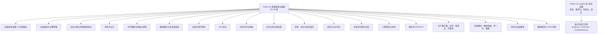
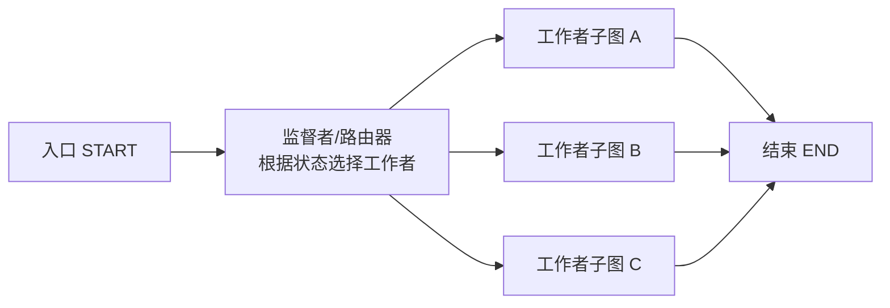
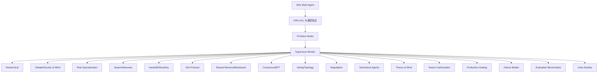

# 协调模式与架构

<cite>
**本文引用的文件**
- [README.md](file://README.md)
- [ROADMAP.md](file://ROADMAP.md)
- [site/data.js](file://site/data.js)
- [phases/16-multi-agent-and-swarms/05-supervisor-orchestrator-pattern/docs/zh.md](file://phases/16-multi-agent-and-swarms/05-supervisor-orchestrator-pattern/docs/zh.md)
- [phases/16-multi-agent-and-swarms/05-supervisor-orchestrator-pattern/code/main.py](file://phases/16-multi-agent-and-swarms/05-supervisor-orchestrator-pattern/code/main.py)
- [phases/16-multi-agent-and-swarms/06-hierarchical-architecture/docs/zh.md](file://phases/16-multi-agent-and-swarms/06-hierarchical-architecture/docs/zh.md)
- [phases/16-multi-agent-and-swarms/07-society-of-mind-debate/docs/zh.md](file://phases/16-multi-agent-and-swarms/07-society-of-mind-debate/docs/zh.md)
- [phases/16-multi-agent-and-swarms/08-role-specialization/docs/zh.md](file://phases/16-multi-agent-and-swarms/08-role-specialization/docs/zh.md)
- [phases/16-multi-agent-and-swarms/08-role-specialization/code/main.py](file://phases/16-multi-agent-and-swarms/08-role-specialization/code/main.py)
- [phases/16-multi-agent-and-swarms/09-parallel-swarm-networks/docs/zh.md](file://phases/16-multi-agent-and-swarms/09-parallel-swarm-networks/docs/zh.md)
- [phases/16-multi-agent-and-swarms/10-group-chat-speaker-selection/docs/zh.md](file://phases/16-multi-agent-and-swarms/10-group-chat-speaker-selection/docs/zh.md)
- [phases/16-multi-agent-and-swarms/11-handoffs-and-routines/docs/zh.md](file://phases/16-multi-agent-and-swarms/11-handoffs-and-routines/docs/zh.md)
- [phases/16-multi-agent-and-swarms/12-a2a-protocol/docs/zh.md](file://phases/16-multi-agent-and-swarms/12-a2a-protocol/docs/zh.md)
- [phases/16-multi-agent-and-swarms/13-shared-memory-blackboard/docs/zh.md](file://phases/16-multi-agent-and-swarms/13-shared-memory-blackboard/docs/zh.md)
- [phases/16-multi-agent-and-swarms/14-consensus-and-bft/docs/zh.md](file://phases/16-multi-agent-and-swarms/14-consensus-and-bft/docs/zh.md)
- [phases/16-multi-agent-and-swarms/15-voting-debate-topology/docs/zh.md](file://phases/16-multi-agent-and-swarms/15-voting-debate-topology/docs/zh.md)
- [phases/16-multi-agent-and-swarms/16-negotiation-bargaining/docs/zh.md](file://phases/16-multi-agent-and-swarms/16-negotiation-bargaining/docs/zh.md)
- [phases/16-multi-agent-and-swarms/17-generative-agents-simulation/docs/zh.md](file://phases/16-multi-agent-and-swarms/17-generative-agents-simulation/docs/zh.md)
- [phases/16-multi-agent-and-swarms/18-theory-of-mind-coordination/docs/zh.md](file://phases/16-multi-agent-and-swarms/18-theory-of-mind-coordination/docs/zh.md)
- [phases/16-multi-agent-and-swarms/19-swarm-optimization-pso-aco/docs/zh.md](file://phases/16-multi-agent-and-swarms/19-swarm-optimization-pso-aco/docs/zh.md)
- [phases/16-multi-agent-and-swarms/22-production-scaling-queues-checkpoints/docs/zh.md](file://phases/16-multi-agent-and-swarms/22-production-scaling-queues-checkpoints/docs/zh.md)
- [phases/16-multi-agent-and-swarms/23-failure-modes-mast-groupthink/docs/zh.md](file://phases/16-multi-agent-and-swarms/23-failure-modes-mast-groupthink/docs/zh.md)
- [phases/16-multi-agent-and-swarms/24-evaluation-coordination-benchmarks/docs/zh.md](file://phases/16-multi-agent-and-swarms/24-evaluation-coordination-benchmarks/docs/zh.md)
- [phases/16-multi-agent-and-swarms/25-case-studies-2026-sota/docs/zh.md](file://phases/16-multi-agent-and-swarms/25-case-studies-2026-sota/docs/zh.md)
- [phases/14-agent-engineering/13-langgraph-stateful-graphs/outputs/skill-demo/README.md](file://phases/14-agent-engineering/13-langgraph-stateful-graphs/outputs/skill-demo/README.md)
- [phases/14-agent-engineering/13-langgraph-stateful-graphs/outputs/skill-demo/graph.py](file://phases/14-agent-engineering/13-langgraph-stateful-graphs/outputs/skill-demo/graph.py)
- [phases/14-agent-engineering/13-langgraph-stateful-graphs/outputs/skill-demo/runner.py](file://phases/14-agent-engineering/13-langgraph-stateful-graphs/outputs/skill-demo/runner.py)
- [phases/14-agent-engineering/13-langgraph-stateful-graphs/outputs/skill-state-graph.md](file://phases/14-agent-engineering/13-langgraph-stateful-graphs/outputs/skill-state-graph.md)
- [phases/14-agent-engineering/13-langgraph-stateful-graphs/quiz.json](file://phases/14-agent-engineering/13-langgraph-stateful-graphs/quiz.json)
- [phases/19-capstone-projects/10-multi-agent-software-team/code/main.py](file://phases/19-capstone-projects/10-multi-agent-software-team/code/main.py)
</cite>

## 目录
1. [引言](#引言)
2. [项目结构](#项目结构)
3. [核心组件](#核心组件)
4. [架构总览](#架构总览)
5. [详细组件分析](#详细组件分析)
6. [依赖分析](#依赖分析)
7. [性能考虑](#性能考虑)
8. [故障排查指南](#故障排查指南)
9. [结论](#结论)
10. [附录](#附录)

## 引言
本文件围绕“协调模式与架构”主题，系统梳理监督者/协调者-工作者模式、分层架构、社会大脑理论与辩论协调机制、角色专业化与协作模式，并结合仓库中的课程与示例，给出实现路径、可视化图解、性能与扩展性建议以及复杂场景下的策略与最佳实践。目标是帮助读者在真实工程中快速选择与落地合适的协调模式。

## 项目结构
本仓库将“多智能体与集群”作为独立阶段（Phase 16），包含从基础概念到工程实现的完整教学与练习体系。同时，第14课“LangGraph 有状态图与持久化执行”提供了可直接运行的最小实现，便于理解状态图、检查点与恢复语义。



图表来源
- [README.md:730-756](file://README.md#L730-L756)
- [ROADMAP.md:424-452](file://ROADMAP.md#L424-L452)

章节来源
- [README.md:730-756](file://README.md#L730-L756)
- [ROADMAP.md:424-452](file://ROADMAP.md#L424-L452)

## 核心组件
- 监督者/协调者-工作者模式：以一个“主导者”进行规划与委派，多个“工作者”并行执行并在完成后回传结果，典型用于研究型任务与长尾推理。
- 分层架构：管理者-子管理者-工作者的嵌套监督链路，强调流水线与阶段性审批。
- 社会大脑与辩论：模拟人类社会的多视角讨论、投票与共识形成，强调去中心化的协同与质量提升。
- 角色专业化：将 Planner/Critic/Executor/Verifier 等职责分离，提升模块内聚与可维护性。
- 群体与网络化：对等代理通过交接协议协作，适合工具共享与动态路由。
- 有状态图与持久化：以 TypedDict 状态、条件边、每节点检查点与恢复为核心的可调试、可重启的执行模型。

章节来源
- [phases/16-multi-agent-and-swarms/05-supervisor-orchestrator-pattern/docs/zh.md](file://phases/16-multi-agent-and-swarms/05-supervisor-orchestrator-pattern/docs/zh.md)
- [phases/16-multi-agent-and-swarms/06-hierarchical-architecture/docs/zh.md](file://phases/16-multi-agent-and-swarms/06-hierarchical-architecture/docs/zh.md)
- [phases/16-multi-agent-and-swarms/07-society-of-mind-debate/docs/zh.md](file://phases/16-multi-agent-and-swarms/07-society-of-mind-debate/docs/zh.md)
- [phases/16-multi-agent-and-swarms/08-role-specialization/docs/zh.md](file://phases/16-multi-agent-and-swarms/08-role-specialization/docs/zh.md)
- [phases/16-multi-agent-and-swarms/09-parallel-swarm-networks/docs/zh.md](file://phases/16-multi-agent-and-swarms/09-parallel-swarm-networks/docs/zh.md)
- [phases/14-agent-engineering/13-langgraph-stateful-graphs/outputs/skill-demo/README.md:1-152](file://phases/14-agent-engineering/13-langgraph-stateful-graphs/outputs/skill-demo/README.md#L1-L152)

## 架构总览
下图展示了“监督者-工作者”在 LangGraph 风格状态图中的典型拓扑：从入口节点开始，监督者根据状态选择对应工作者子图，工作者完成后再统一汇聚至结束。



图表来源
- [phases/14-agent-engineering/13-langgraph-stateful-graphs/outputs/skill-demo/README.md:101-107](file://phases/14-agent-engineering/13-langgraph-stateful-graphs/outputs/skill-demo/README.md#L101-L107)
- [phases/14-agent-engineering/13-langgraph-stateful-graphs/outputs/skill-demo/graph.py:254-279](file://phases/14-agent-engineering/13-langgraph-stateful-graphs/outputs/skill-demo/graph.py#L254-L279)

## 详细组件分析

### 监督者/协调者-工作者模式
- 设计要点
  - 主导者负责任务分解、路由与合成，工作者专注于特定子域的执行。
  - 使用条件边将任务分派到不同工作者子图，结束后统一收敛。
- 实现参考
  - 课程文档与代码：[监督者-工作者模式文档](file://phases/16-multi-agent-and-swarms/05-supervisor-orchestrator-pattern/docs/zh.md)，[示例代码](file://phases/16-multi-agent-and-swarms/05-supervisor-orchestrator-pattern/code/main.py)
  - LangGraph 风格拓扑与辅助函数：[README:101-107](file://phases/14-agent-engineering/13-langgraph-stateful-graphs/outputs/skill-demo/README.md#L101-L107)，[graph.py:254-279](file://phases/14-agent-engineering/13-langgraph-stateful-graphs/outputs/skill-demo/graph.py#L254-L279)
- 序列流程
  - 入口 → 监督者路由器 → 选择工作者 → 工作者执行 → 回传中间态/结果 → 统一合成 → 结束

```mermaid
sequenceDiagram
participant Entr as "入口 START"
participant Sup as "监督者/路由器"
participant Wkr as "工作者子图"
participant End as "结束 END"
Entr->>Sup : "进入并读取状态"
Sup->>Sup : "根据状态选择工作者"
Sup->>Wkr : "路由到对应工作者"
Wkr-->>Sup : "返回中间/最终结果"
Sup->>End : "汇聚并结束"
```

图表来源
- [phases/14-agent-engineering/13-langgraph-stateful-graphs/outputs/skill-demo/graph.py:254-279](file://phases/14-agent-engineering/13-langgraph-stateful-graphs/outputs/skill-demo/graph.py#L254-L279)

章节来源
- [phases/16-multi-agent-and-swarms/05-supervisor-orchestrator-pattern/docs/zh.md](file://phases/16-multi-agent-and-swarms/05-supervisor-orchestrator-pattern/docs/zh.md)
- [phases/16-multi-agent-and-swarms/05-supervisor-orchestrator-pattern/code/main.py](file://phases/16-multi-agent-and-swarms/05-supervisor-orchestrator-pattern/code/main.py)
- [phases/14-agent-engineering/13-langgraph-stateful-graphs/outputs/skill-demo/README.md:101-107](file://phases/14-agent-engineering/13-langgraph-stateful-graphs/outputs/skill-demo/README.md#L101-L107)
- [phases/14-agent-engineering/13-langgraph-stateful-graphs/outputs/skill-demo/graph.py:254-279](file://phases/14-agent-engineering/13-langgraph-stateful-graphs/outputs/skill-demo/graph.py#L254-L279)

### 分层架构与分解漂移
- 设计要点
  - 管理者-子管理者-工作者的嵌套监督链路，强调阶段性审批与责任下沉。
  - 关注“分解漂移”：越往下越难保持一致的目标与约束，需要清晰的边界与反馈。
- 实现参考
  - 课程文档：[分层架构文档](file://phases/16-multi-agent-and-swarms/06-hierarchical-architecture/docs/zh.md)

章节来源
- [phases/16-multi-agent-and-swarms/06-hierarchical-architecture/docs/zh.md](file://phases/16-multi-agent-and-swarms/06-hierarchical-architecture/docs/zh.md)

### 社会大脑与多智能体辩论
- 设计要点
  - 模拟人类社会的多视角讨论、投票与共识形成，强调去中心化与质量提升。
  - 可结合投票拓扑、自洽机制与辩论网络结构。
- 实现参考
  - 课程文档：[社会大脑与辩论文档](file://phases/16-multi-agent-and-swarms/07-society-of-mind-debate/docs/zh.md)
  - 投票与拓扑：[投票与拓扑文档](file://phases/16-multi-agent-and-swarms/15-voting-debate-topology/docs/zh.md)
  - 心智理论与协同：[心智理论文档](file://phases/16-multi-agent-and-swarms/18-theory-of-mind-coordination/docs/zh.md)

章节来源
- [phases/16-multi-agent-and-swarms/07-society-of-mind-debate/docs/zh.md](file://phases/16-multi-agent-and-swarms/07-society-of-mind-debate/docs/zh.md)
- [phases/16-multi-agent-and-swarms/15-voting-debate-topology/docs/zh.md](file://phases/16-multi-agent-and-swarms/15-voting-debate-topology/docs/zh.md)
- [phases/16-multi-agent-and-swarms/18-theory-of-mind-coordination/docs/zh.md](file://phases/16-multi-agent-and-swarms/18-theory-of-mind-coordination/docs/zh.md)

### 角色专业化：Planner/Critic/Executor/Verifier
- 设计要点
  - 将规划、批评、执行、验证等职责分离，提升模块内聚与可维护性。
  - 明确角色边界与输入输出契约，减少耦合。
- 实现参考
  - 课程文档与代码：[角色专业化文档](file://phases/16-multi-agent-and-swarms/08-role-specialization/docs/zh.md)，[示例代码](file://phases/16-multi-agent-and-swarms/08-role-specialization/code/main.py)

章节来源
- [phases/16-multi-agent-and-swarms/08-role-specialization/docs/zh.md](file://phases/16-multi-agent-and-swarms/08-role-specialization/docs/zh.md)
- [phases/16-multi-agent-and-swarms/08-role-specialization/code/main.py](file://phases/16-multi-agent-and-swarms/08-role-specialization/code/main.py)

### 并行集群与网络化架构
- 设计要点
  - 对等代理通过交接协议协作，适合工具共享与动态路由。
  - 关注消息传播与路由成本，避免广播带来的二次方复杂度。
- 实现参考
  - 课程文档：[并行集群与网络化文档](file://phases/16-multi-agent-and-swarms/09-parallel-swarm-networks/docs/zh.md)

章节来源
- [phases/16-multi-agent-and-swarms/09-parallel-swarm-networks/docs/zh.md](file://phases/16-multi-agent-and-swarms/09-parallel-swarm-networks/docs/zh.md)

### 群组聊天与发言者选择
- 设计要点
  - 在开放讨论中选择合适发言者，平衡信息传播与噪声控制。
- 实现参考
  - 课程文档：[群组聊天与发言者选择文档](file://phases/16-multi-agent-and-swarms/10-group-chat-speaker-selection/docs/zh.md)

章节来源
- [phases/16-multi-agent-and-swarms/10-group-chat-speaker-selection/docs/zh.md](file://phases/16-multi-agent-and-swarms/10-group-chat-speaker-selection/docs/zh.md)

### 交接与例行程序（无状态编排）
- 设计要点
  - 无状态编排强调“动作即协议”，通过明确的交接协议实现可重复的流程。
- 实现参考
  - 课程文档：[交接与例行程序文档](file://phases/16-multi-agent-and-swarms/11-handoffs-and-routines/docs/zh.md)

章节来源
- [phases/16-multi-agent-and-swarms/11-handoffs-and-routines/docs/zh.md](file://phases/16-multi-agent-and-swarms/11-handoffs-and-routines/docs/zh.md)

### A2A 协议
- 设计要点
  - Agent-to-Agent 的通信协议，强调消息格式、语义与交互契约。
- 实现参考
  - 课程文档：[A2A 协议文档](file://phases/16-multi-agent-and-swarms/12-a2a-protocol/docs/zh.md)

章节来源
- [phases/16-multi-agent-and-swarms/12-a2a-protocol/docs/zh.md](file://phases/16-multi-agent-and-swarms/12-a2a-protocol/docs/zh.md)

### 共享内存与黑板模式
- 设计要点
  - 多代理共享状态空间，通过“写屏障/读屏障”与版本控制避免竞争。
- 实现参考
  - 课程文档：[共享内存与黑板文档](file://phases/16-multi-agent-and-swarms/13-shared-memory-blackboard/docs/zh.md)

章节来源
- [phases/16-multi-agent-and-swarms/13-shared-memory-blackboard/docs/zh.md](file://phases/16-multi-agent-and-swarms/13-shared-memory-blackboard/docs/zh.md)

### 共识与拜占庭容错
- 设计要点
  - 在存在恶意/故障节点的情况下达成一致，强调鲁棒性与可验证性。
- 实现参考
  - 课程文档：[共识与拜占庭容错文档](file://phases/16-multi-agent-and-swarms/14-consensus-and-bft/docs/zh.md)

章节来源
- [phases/16-multi-agent-and-swarms/14-consensus-and-bft/docs/zh.md](file://phases/16-multi-agent-and-swarms/14-consensus-and-bft/docs/zh.md)

### 投票、自洽与辩论拓扑
- 设计要点
  - 通过多轮投票与自洽校验提升答案质量，拓扑结构影响收敛速度与稳定性。
- 实现参考
  - 课程文档：[投票与拓扑文档](file://phases/16-multi-agent-and-swarms/15-voting-debate-topology/docs/zh.md)

章节来源
- [phases/16-multi-agent-and-swarms/15-voting-debate-topology/docs/zh.md](file://phases/16-multi-agent-and-swarms/15-voting-debate-topology/docs/zh.md)

### 谈判与讨价还价
- 设计要点
  - 在资源有限与目标冲突下，通过协议与策略达成帕累托改进。
- 实现参考
  - 课程文档：[谈判与讨价还价文档](file://phases/16-multi-agent-and-swarms/16-negotiation-bargaining/docs/zh.md)

章节来源
- [phases/16-multi-agent-and-swarms/16-negotiation-bargaining/docs/zh.md](file://phases/16-multi-agent-and-swarms/16-negotiation-bargaining/docs/zh.md)

### 生成式代理与仿真
- 设计要点
  - 通过生成式代理模拟复杂社会行为，强调环境建模与交互规则。
- 实现参考
  - 课程文档：[生成式代理与仿真文档](file://phases/16-multi-agent-and-swarms/17-generative-agents-simulation/docs/zh.md)

章节来源
- [phases/16-multi-agent-and-swarms/17-generative-agents-simulation/docs/zh.md](file://phases/16-multi-agent-and-swarms/17-generative-agents-simulation/docs/zh.md)

### 群优化（PSO/ACO）与 MARL
- 设计要点
  - 生物启发优化在 LLM 场景的回归，强调粒子/蚂蚁的“提示”作为速度/信息素。
- 实现参考
  - 课程文档：[群优化文档](file://phases/16-multi-agent-and-swarms/19-swarm-optimization-pso-aco/docs/zh.md)
  - 多智能体强化学习：[MARL 文档](file://phases/16-multi-agent-and-swarms/20-marl-maddpg-qmix-mappo/docs/zh.md)

章节来源
- [phases/16-multi-agent-and-swarms/19-swarm-optimization-pso-aco/docs/zh.md](file://phases/16-multi-agent-and-swarms/19-swarm-optimization-pso-aco/docs/zh.md)
- [phases/16-multi-agent-and-swarms/20-marl-maddpg-qmix-mappo/docs/zh.md](file://phases/16-multi-agent-and-swarms/20-marl-maddpg-qmix-mappo/docs/zh.md)

### 生产级扩展：队列、检查点、可靠性
- 设计要点
  - 通过队列与检查点保障高吞吐与可恢复性，结合护栏层与可观测性。
- 实现参考
  - 课程文档：[生产扩展文档](file://phases/16-multi-agent-and-swarms/22-production-scaling-queues-checkpoints/docs/zh.md)

章节来源
- [phases/16-multi-agent-and-swarms/22-production-scaling-queues-checkpoints/docs/zh.md](file://phases/16-multi-agent-and-swarms/22-production-scaling-queues-checkpoints/docs/zh.md)

### 失败模式：群体思维、单一化、级联
- 设计要点
  - 识别并缓解群体思维、单一化与级联故障，提升系统的韧性。
- 实现参考
  - 课程文档：[失败模式文档](file://phases/16-multi-agent-and-swarms/23-failure-modes-mast-groupthink/docs/zh.md)

章节来源
- [phases/16-multi-agent-and-swarms/23-failure-modes-mast-groupthink/docs/zh.md](file://phases/16-multi-agent-and-swarms/23-failure-modes-mast-groupthink/docs/zh.md)

### 评估与协调基准
- 设计要点
  - 建立可复现的评估指标与基准，衡量协调效果与鲁棒性。
- 实现参考
  - 课程文档：[评估与基准文档](file://phases/16-multi-agent-and-swarms/24-evaluation-coordination-benchmarks/docs/zh.md)

章节来源
- [phases/16-multi-agent-and-swarms/24-evaluation-coordination-benchmarks/docs/zh.md](file://phases/16-multi-agent-and-swarms/24-evaluation-coordination-benchmarks/docs/zh.md)

### 案例研究与 2026 现状
- 设计要点
  - 总结行业现状与前沿案例，提炼可迁移的工程经验。
- 实现参考
  - 课程文档：[案例研究文档](file://phases/16-multi-agent-and-swarms/25-case-studies-2026-sota/docs/zh.md)

章节来源
- [phases/16-multi-agent-and-swarms/25-case-studies-2026-sota/docs/zh.md](file://phases/16-multi-agent-and-swarms/25-case-studies-2026-sota/docs/zh.md)

## 依赖分析
- 课程依赖关系
  - Phase 16 的各课之间存在递进关系：从基础概念（Why Multi-Agent、FIPA-ACL、通信协议）到工程实现（监督者、分层、辩论、角色专业化、A2A、黑板、共识、投票、谈判、仿真、群优化、生产扩展、失败模式、评估、案例研究）。
  - 第14课“LangGraph 有状态图”为 Phase 16 的工程实现提供通用范式与最小可运行示例。
- 数据与可视化
  - site/data.js 中列出 Phase 16 的课程清单与标签，体现“多智能体、架构、工程实践”的主题脉络。



图表来源
- [site/data.js:3167-16109](file://site/data.js#L3167-L16109)

章节来源
- [site/data.js:3167-16109](file://site/data.js#L3167-L16109)

## 性能考虑
- 路由与消息传播
  - 若采用全连接广播，消息数量随 N(N−1) 增长；集中式监督可将边数降至线性，利于大规模系统。
- 分层与并行
  - 分层可降低耦合，但需注意“分解漂移”；并行工作者应具备独立的输入/输出契约与错误隔离。
- 检查点与恢复
  - LangGraph 风格的“每节点检查点+完整状态序列化”确保可恢复性与可调试性，避免仅保存摘要导致的不可恢复问题。
- 可观测性与护栏
  - 结合 OpenTelemetry 跨度与护栏层，实现端到端可观测与安全边界。

章节来源
- [phases/14-agent-engineering/13-langgraph-stateful-graphs/outputs/skill-demo/README.md:55-96](file://phases/14-agent-engineering/13-langgraph-stateful-graphs/outputs/skill-demo/README.md#L55-L96)
- [phases/14-agent-engineering/13-langgraph-stateful-graphs/outputs/skill-state-graph.md:20-31](file://phases/14-agent-engineering/13-langgraph-stateful-graphs/outputs/skill-state-graph.md#L20-L31)

## 故障排查指南
- 恢复语义
  - 使用会话 ID 加载最近检查点，注入人工决策后从暂停节点恢复执行。
- 常见问题
  - 未设置入口节点：执行前必须设置入口，否则抛出运行时错误。
  - 会话无检查点：恢复时若无最近检查点，需从头执行或检查会话 ID。
- 节点函数非确定性
  - 恢复假设节点输出可复现，若节点依赖随机或时间，需显式捕获或固定种子。

章节来源
- [phases/14-agent-engineering/13-langgraph-stateful-graphs/outputs/skill-demo/runner.py:77-121](file://phases/14-agent-engineering/13-langgraph-stateful-graphs/outputs/skill-demo/runner.py#L77-L121)
- [phases/14-agent-engineering/13-langgraph-stateful-graphs/quiz.json:1-38](file://phases/14-agent-engineering/13-langgraph-stateful-graphs/quiz.json#L1-L38)

## 结论
本仓库以“多智能体与集群”为主线，系统覆盖从理论到工程的完整路径。监督者/协调者-工作者模式、分层架构、社会大脑与辩论、角色专业化等模式在不同场景下各有优势；LangGraph 风格的有状态图与检查点恢复为工程落地提供了可复用的范式。结合生产扩展、失败模式与评估基准，可在复杂场景中稳健推进。

## 附录
- 课程索引与链接
  - Phase 16 课程清单与链接：[README 课程表:730-756](file://README.md#L730-L756)，[Roadmap:424-452](file://ROADMAP.md#L424-L452)
- 示例与最小实现
  - LangGraph 示例：[README:1-152](file://phases/14-agent-engineering/13-langgraph-stateful-graphs/outputs/skill-demo/README.md#L1-L152)，[graph.py:1-34](file://phases/14-agent-engineering/13-langgraph-stateful-graphs/outputs/skill-demo/graph.py#L1-L34)，[runner.py:1-121](file://phases/14-agent-engineering/13-langgraph-stateful-graphs/outputs/skill-demo/runner.py#L1-L121)
- 实战案例
  - 多智能体软件团队：[示例代码](file://phases/19-capstone-projects/10-multi-agent-software-team/code/main.py)