# 多智能体与群体智能

<cite>
**本文引用的文件**
- [ROADMAP.md](file://ROADMAP.md)
- [01-why-multi-agent 文档（英文）](file://phases/16-multi-agent-and-swarms/01-why-multi-agent/docs/en.md)
- [02-fipa-acl-heritage 文档（英文）](file://phases/16-multi-agent-and-swarms/02-fipa-acl-heritage/docs/en.md)
- [03-communication-protocols 文档（英文）](file://phases/16-multi-agent-and-swarms/03-communication-protocols/docs/en.md)
- [04-primitive-model 文档（英文）](file://phases/16-multi-agent-and-swarms/04-primitive-model/docs/en.md)
- [05-supervisor-orchestrator-pattern 文档（英文）](file://phases/16-multi-agent-and-swarms/05-supervisor-orchestrator-pattern/docs/en.md)
- [06-hierarchical-architecture 文档（英文）](file://phases/16-multi-agent-and-swarms/06-hierarchical-architecture/docs/en.md)
- [07-society-of-mind-debate 文档（英文）](file://phases/16-multi-agent-and-swarms/07-society-of-mind-debate/docs/en.md)
- [08-role-specialization 文档（英文）](file://phases/16-multi-agent-and-swarms/08-role-specialization/docs/en.md)
- [09-parallel-swarm-networks 文档（英文）](file://phases/16-multi-agent-and-swarms/09-parallel-swarm-networks/docs/en.md)
- [10-group-chat-speaker-selection 文档（英文）](file://phases/16-multi-agent-and-swarms/10-group-chat-speaker-selection/docs/en.md)
</cite>

## 目录
1. [引言](#引言)
2. [项目结构](#项目结构)
3. [核心组件](#核心组件)
4. [架构总览](#架构总览)
5. [详细组件分析](#详细组件分析)
6. [依赖关系分析](#依赖关系分析)
7. [性能考量](#性能考量)
8. [故障排查指南](#故障排查指南)
9. [结论](#结论)
10. [附录](#附录)

## 引言
本课程围绕“多智能体与群体智能”的核心主题，系统讲解协调机制、群体智能、集体智慧等多智能体系统的关键技术。我们将从为何需要多智能体开始，逐步深入到通信协议（如 FIPA-ACL 的思想谱系）、组织模式（监督者/协调者-工作者、分层架构）、协调技术（黑板模式、共识算法、拜占庭容错）、高级主题（投票机制、谈判博弈、生成式代理），并结合群体优化与多智能体强化学习的实际应用案例，最后讨论生产级扩展、失败模式与评估基准等工程实践。

## 项目结构
该仓库以阶段化的方式组织教学内容，第 16 阶段“多智能体与群体智能”覆盖了从基础概念到工程落地的完整知识体系。每个小节包含：
- 学习目标与先修要求
- 概念讲解与图示
- 可运行的代码示例
- 关键术语与进一步阅读

下图展示了该阶段在整体路线图中的位置与关联：

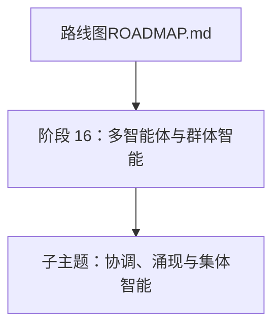

图表来源
- [ROADMAP.md](file://ROADMAP.md)

章节来源
- [ROADMAP.md](file://ROADMAP.md)

## 核心组件
本阶段围绕四个“原语”构建多智能体系统的设计空间，所有主流框架都可以映射到这四个轴心：
- 智能体（Agent）：系统提示词 + 工具集；无状态
- 转交（Handoff）：从一个智能体到另一个的结构化控制转移
- 共享状态（Shared State）：可被多个智能体读取（有时写入）的数据结构
- 协调器（Orchestrator）：决定下一个说话者或执行者的策略（静态图、LLM 选择、转交驱动、队列驱动）

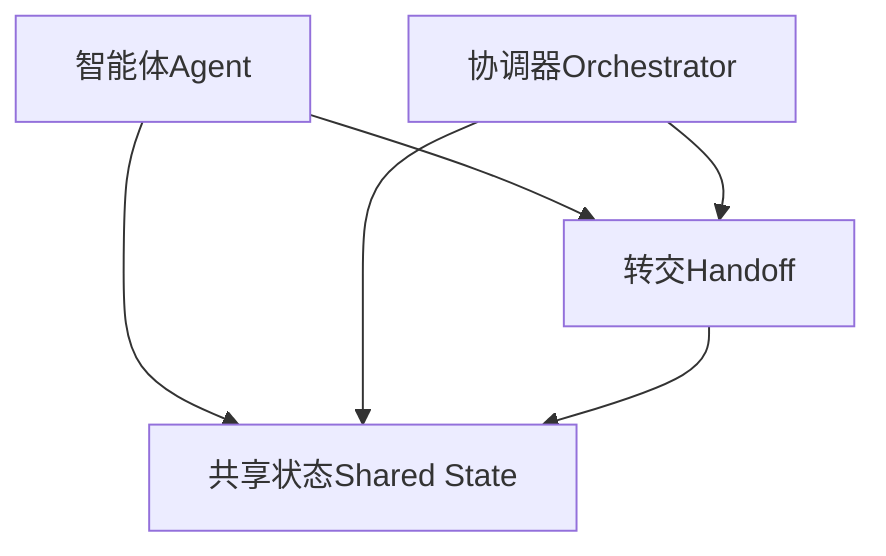

图表来源
- [04-primitive-model 文档（英文）](file://phases/16-multi-agent-and-swarms/04-primitive-model/docs/en.md)

章节来源
- [04-primitive-model 文档（英文）](file://phases/16-multi-agent-and-swarms/04-primitive-model/docs/en.md)

## 架构总览
多智能体系统的典型架构由以下层次组成：
- 通信层：MCP（工具访问）、A2A（智能体对智能体）、ACP（审计轨迹）、ANP（去中心化身份）
- 协调层：监督者-工作者模式、分层架构、群组对话、蜂群架构
- 状态层：共享内存/黑板、任务生命周期、事件总线
- 应用层：研究、编码、评审、测试等角色化流水线

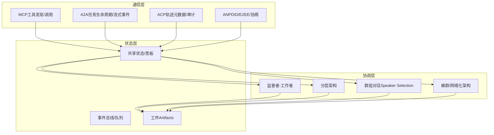

图表来源
- [03-communication-protocols 文档（英文）](file://phases/16-multi-agent-and-swarms/03-communication-protocols/docs/en.md)
- [05-supervisor-orchestrator-pattern 文档（英文）](file://phases/16-multi-agent-and-swarms/05-supervisor-orchestrator-pattern/docs/en.md)
- [06-hierarchical-architecture 文档（英文）](file://phases/16-multi-agent-and-swarms/06-hierarchical-architecture/docs/en.md)
- [07-society-of-mind-debate 文档（英文）](file://phases/16-multi-agent-and-swarms/07-society-of-mind-debate/docs/en.md)
- [09-parallel-swarm-networks 文档（英文）](file://phases/16-multi-agent-and-swarms/09-parallel-swarm-networks/docs/en.md)
- [10-group-chat-speaker-selection 文档（英文）](file://phases/16-multi-agent-and-swarms/10-group-chat-speaker-selection/docs/en.md)

章节来源
- [03-communication-protocols 文档（英文）](file://phases/16-multi-agent-and-swarms/03-communication-protocols/docs/en.md)
- [05-supervisor-orchestrator-pattern 文档（英文）](file://phases/16-multi-agent-and-swarms/05-supervisor-orchestrator-pattern/docs/en.md)
- [06-hierarchical-architecture 文档（英文）](file://phases/16-multi-agent-and-swarms/06-hierarchical-architecture/docs/en.md)
- [07-society-of-mind-debate 文档（英文）](file://phases/16-multi-agent-and-swarms/07-society-of-mind-debate/docs/en.md)
- [09-parallel-swarm-networks 文档（英文）](file://phases/16-multi-agent-and-swarms/09-parallel-swarm-networks/docs/en.md)
- [10-group-chat-speaker-selection 文档（英文）](file://phases/16-multi-agent-and-swarms/10-group-chat-speaker-selection/docs/en.md)

## 详细组件分析

### 为何需要多智能体
- 单智能体天花板：上下文饱和、角色混淆、串行瓶颈
- 多智能体方案：拆分工作、聚焦角色、并行执行、各自独立上下文窗口
- 实际系统：Claude Code 子智能体、Devin、SWE-bench 团队、ChatGPT Deep Research

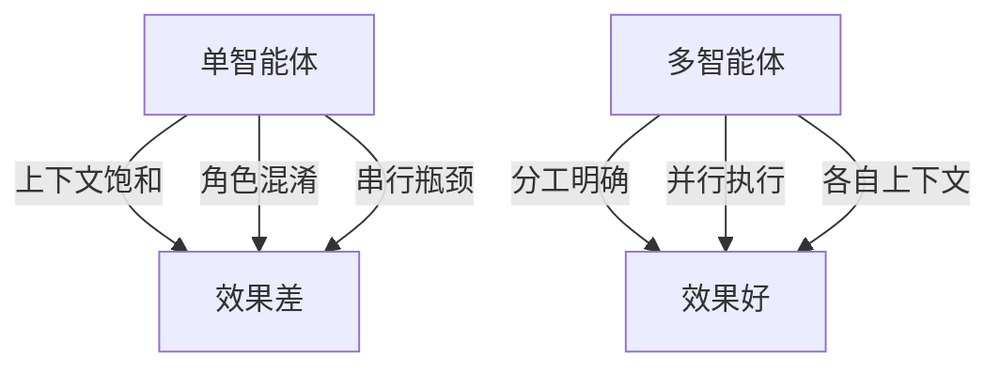

图表来源
- [01-why-multi-agent 文档（英文）](file://phases/16-multi-agent-and-swarms/01-why-multi-agent/docs/en.md)

章节来源
- [01-why-multi-agent 文档（英文）](file://phases/16-multi-agent-and-swarms/01-why-multi-agent/docs/en.md)

### FIPA-ACL 思想谱系与现代协议对照
- 语音行为理论：Austin（1962）与 Searle（1969）奠定“言语即行动”
- KQML → FIPA-ACL：二十种言语行为、内容语言、交互协议（合同网、订阅/通知、请求-当…时）
- 现代协议（MCP/A2A/ACP/ANP）是 FIPA 的 JSON 化、弱语义版本，保留结构化意图与相关性标识

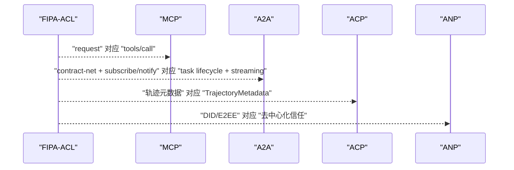

图表来源
- [02-fipa-acl-heritage 文档（英文）](file://phases/16-multi-agent-and-swarms/02-fipa-acl-heritage/docs/en.md)

章节来源
- [02-fipa-acl-heritage 文档（英文）](file://phases/16-multi-agent-and-swarms/02-fipa-acl-heritage/docs/en.md)

### 通信协议：MCP、A2A、ACP、ANP
- MCP：智能体与工具通信，客户端-服务器模型
- A2A：智能体对智能体协作，Agent Card + 任务生命周期 + 流式事件
- ACP：企业级审计，TrajectoryMetadata 记录推理与工具调用
- ANP：去中心化身份与端到端加密，DID 文档 + 动态协议协商

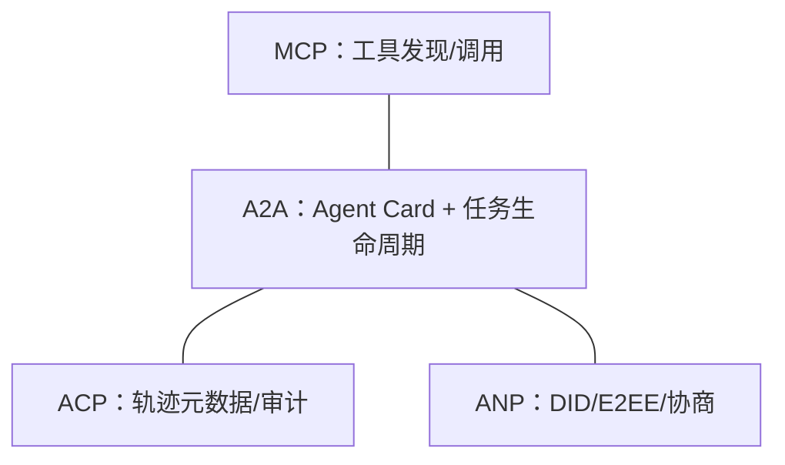

图表来源
- [03-communication-protocols 文档（英文）](file://phases/16-multi-agent-and-swarms/03-communication-protocols/docs/en.md)

章节来源
- [03-communication-protocols 文档（英文）](file://phases/16-multi-agent-and-swarms/03-communication-protocols/docs/en.md)

### 原语模型：四维设计空间
- 四个原语：Agent、Handoff、Shared State、Orchestrator
- 不同框架在四个轴上的默认取值不同，但本质一致
- 状态性仅存在于共享状态，其他均为无状态

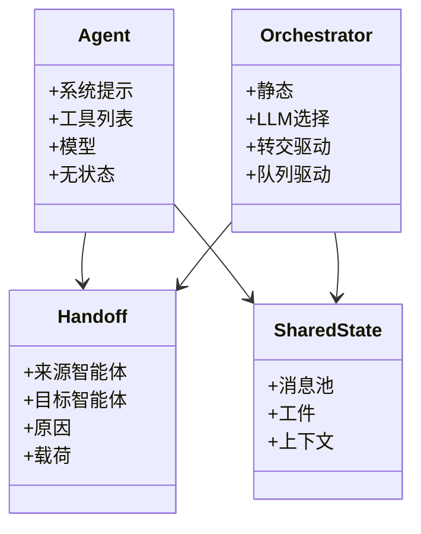

图表来源
- [04-primitive-model 文档（英文）](file://phases/16-multi-agent-and-swarms/04-primitive-model/docs/en.md)

章节来源
- [04-primitive-model 文档（英文）](file://phases/16-multi-agent-and-swarms/04-primitive-model/docs/en.md)

### 监督者-工作者模式
- 结构：领导智能体规划、委派、合成；工作者并行执行、独立上下文
- 工程要点：模型搭配、超时与令牌上限、可观测性、彩虹发布
- 失败模式：计划幻觉、工作者过度探索、合成冲突

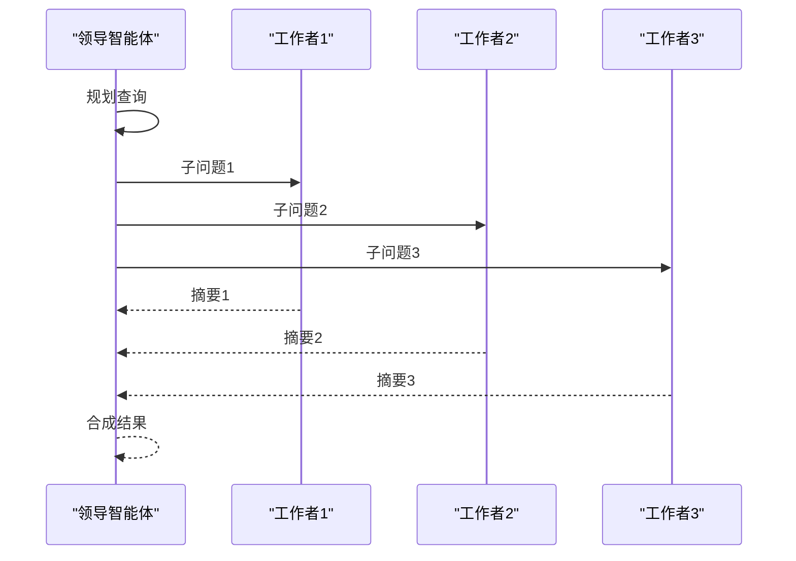

图表来源
- [05-supervisor-orchestrator-pattern 文档（英文）](file://phases/16-multi-agent-and-swarms/05-supervisor-orchestrator-pattern/docs/en.md)

章节来源
- [05-supervisor-orchestrator-pattern 文档（英文）](file://phases/16-multi-agent-and-swarms/05-supervisor-orchestrator-pattern/docs/en.md)

### 分层架构及其失败模式
- 形状：管理智能体 → 子管理智能体 → 工作者
- 成功场景：清晰的组织映射、局部合成
- 失败模式：任务分配错误、输出误读、共识循环
- 决策问题：顺序 vs 分层？若后者，需预算化的协调规则

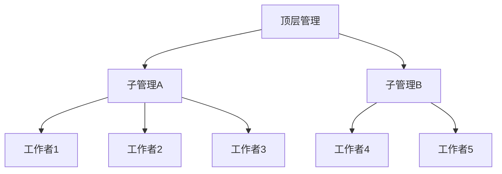

图表来源
- [06-hierarchical-architecture 文档（英文）](file://phases/16-multi-agent-and-swarms/06-hierarchical-architecture/docs/en.md)

章节来源
- [06-hierarchical-architecture 文档（英文）](file://phases/16-multi-agent-and-swarms/06-hierarchical-architecture/docs/en.md)

### 社会大脑与多智能体辩论
- 算法：N 个智能体首轮提案，随后每轮相互审阅并更新，最终多数投票
- 两个独立增益：多智能体 + 多轮次
- 机制：暴露分歧、降低相关误差
- 失败模式：顺从级联、话题漂移、计算膨胀

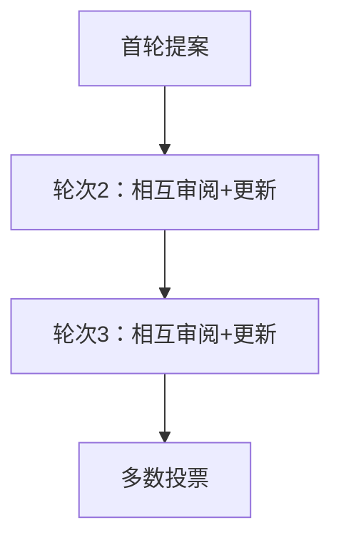

图表来源
- [07-society-of-mind-debate 文档（英文）](file://phases/16-multi-agent-and-swarms/07-society-of-mind-debate/docs/en.md)

章节来源
- [07-society-of-mind-debate 文档（英文）](file://phases/16-multi-agent-and-swarms/07-society-of-mind-debate/docs/en.md)

### 角色专业化：规划师、执行者、批评者、验证者
- 四类角色：规划、执行、批评、验证
- MetaGPT SOP 模式：严格输入/输出模式
- ChatDev 交流消幻觉：执行者在缺失细节时显式请求
- 验证至关重要：Cemri 研究显示 21.3% 的失败源于验证缺口

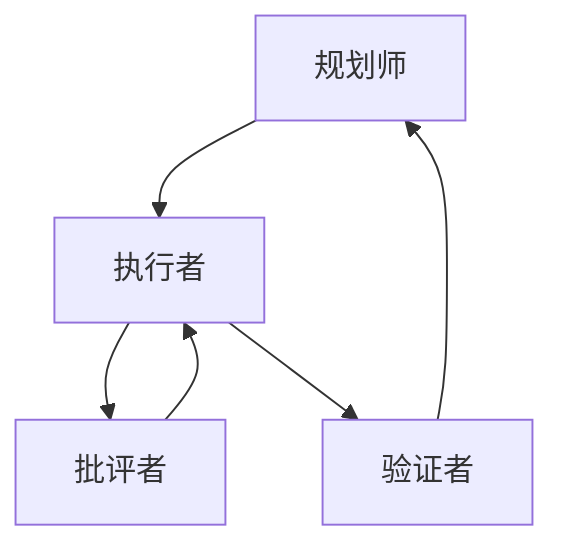

图表来源
- [08-role-specialization 文档（英文）](file://phases/16-multi-agent-and-swarms/08-role-specialization/docs/en.md)

章节来源
- [08-role-specialization 文档（英文）](file://phases/16-multi-agent-and-swarms/08-role-specialization/docs/en.md)

### 并行/蜂群/网络化架构
- 结构：共享事件总线/队列，工作者异步拉取任务
- 适用：大量独立子问题、可变时长、吞吐优先
- 不适用：有序流程、全局计划型任务、强可追溯性
- 失败模式：饥饿与热点；缓解：优先队列、专用工作者、背压

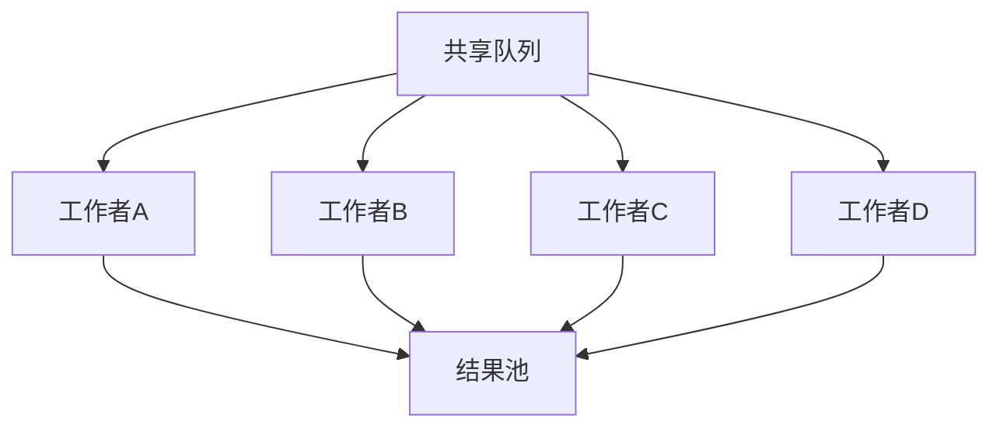

图表来源
- [09-parallel-swarm-networks 文档（英文）](file://phases/16-multi-agent-and-swarms/09-parallel-swarm-networks/docs/en.md)

章节来源
- [09-parallel-swarm-networks 文档（英文）](file://phases/16-multi-agent-and-swarms/09-parallel-swarm-networks/docs/en.md)

### 群组对话与发言选择
- 结构：N 个智能体共享消息池，选择函数决定下一个说话者
- 三种选择器：轮转、LLM 选择、自定义
- AutoGen v0.2 的 GroupChat 语义在 AG2 中得到保留，v0.4 重写为事件驱动的演员模型；微软将其合并进 Microsoft Agent Framework

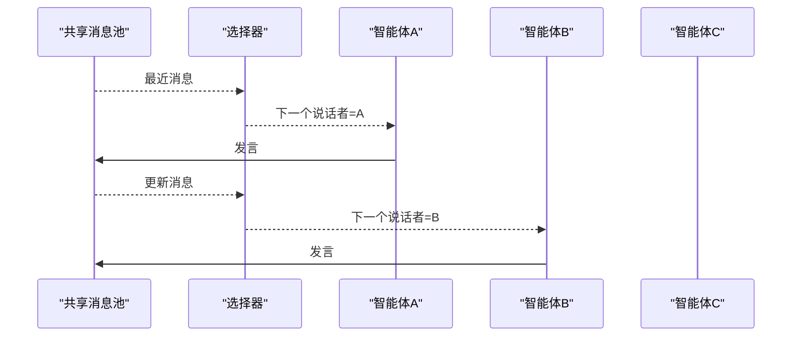

图表来源
- [10-group-chat-speaker-selection 文档（英文）](file://phases/16-multi-agent-and-swarms/10-group-chat-speaker-selection/docs/en.md)

章节来源
- [10-group-chat-speaker-selection 文档（英文）](file://phases/16-multi-agent-and-swarms/10-group-chat-speaker-selection/docs/en.md)

## 依赖关系分析
- 概念依赖：先理解“为何需要多智能体”，再学“原语模型”，然后进入具体模式（监督者-工作者、分层、群组对话、蜂群）
- 协议依赖：通信层（MCP/A2A/ACP/ANP）支撑所有模式的跨智能体协作
- 工程依赖：失败模式与生产实践贯穿各模式，如令牌上限、可观测性、彩虹发布等

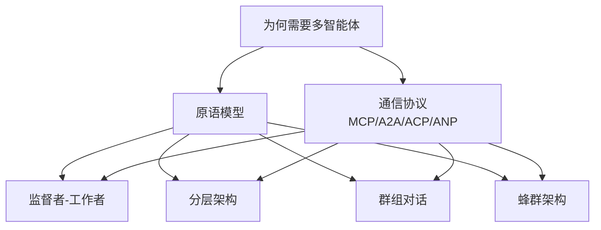

图表来源
- [01-why-multi-agent 文档（英文）](file://phases/16-multi-agent-and-swarms/01-why-multi-agent/docs/en.md)
- [03-communication-protocols 文档（英文）](file://phases/16-multi-agent-and-swarms/03-communication-protocols/docs/en.md)
- [04-primitive-model 文档（英文）](file://phases/16-multi-agent-and-swarms/04-primitive-model/docs/en.md)
- [05-supervisor-orchestrator-pattern 文档（英文）](file://phases/16-multi-agent-and-swarms/05-supervisor-orchestrator-pattern/docs/en.md)
- [06-hierarchical-architecture 文档（英文）](file://phases/16-multi-agent-and-swarms/06-hierarchical-architecture/docs/en.md)
- [07-society-of-mind-debate 文档（英文）](file://phases/16-multi-agent-and-swarms/07-society-of-mind-debate/docs/en.md)
- [08-role-specialization 文档（英文）](file://phases/16-multi-agent-and-swarms/08-role-specialization/docs/en.md)
- [09-parallel-swarm-networks 文档（英文）](file://phases/16-multi-agent-and-swarms/09-parallel-swarm-networks/docs/en.md)
- [10-group-chat-speaker-selection 文档（英文）](file://phases/16-multi-agent-and-swarms/10-group-chat-speaker-selection/docs/en.md)

章节来源
- [01-why-multi-agent 文档（英文）](file://phases/16-multi-agent-and-swarms/01-why-multi-agent/docs/en.md)
- [03-communication-protocols 文档（英文）](file://phases/16-multi-agent-and-swarms/03-communication-protocols/docs/en.md)
- [04-primitive-model 文档（英文）](file://phases/16-multi-agent-and-swarms/04-primitive-model/docs/en.md)
- [05-supervisor-orchestrator-pattern 文档（英文）](file://phases/16-multi-agent-and-swarms/05-supervisor-orchestrator-pattern/docs/en.md)
- [06-hierarchical-architecture 文档（英文）](file://phases/16-multi-agent-and-swarms/06-hierarchical-architecture/docs/en.md)
- [07-society-of-mind-debate 文档（英文）](file://phases/16-multi-agent-and-swarms/07-society-of-mind-debate/docs/en.md)
- [08-role-specialization 文档（英文）](file://phases/16-multi-agent-and-swarms/08-role-specialization/docs/en.md)
- [09-parallel-swarm-networks 文档（英文）](file://phases/16-multi-agent-and-swarms/09-parallel-swarm-networks/docs/en.md)
- [10-group-chat-speaker-selection 文档（英文）](file://phases/16-multi-agent-and-swarms/10-group-chat-speaker-selection/docs/en.md)

## 性能考量
- 上下文与令牌：多智能体系统的主要方差来源是令牌使用量（例如研究评测中 80% 的方差由令牌主导）
- 并行收益：蜂群/监督者模式显著缩短墙钟时间，但需权衡开销与成本
- 可观测性：全程追踪计划、工具调用与合成过程，便于事后调试与审计
- 扩展性：优先采用事件总线/队列，避免中心化协调瓶颈；引入优先级、背压与幂等处理

## 故障排查指南
- 验证缺口：21.3% 的多智能体失败源于未进行确定性验证
- 分解漂移：顶层管理的分解不再覆盖原始问题
- 顺从级联：所有智能体都听从最自信的发言者
- 饥饿与热点：快速工作者持续占用队列，长任务无法调度
- 话题漂移：多轮辩论偏离初始问题
- 令牌滥用：N 个智能体 × R 轮次导致成本飙升

章节来源
- [07-society-of-mind-debate 文档（英文）](file://phases/16-multi-agent-and-swarms/07-society-of-mind-debate/docs/en.md)
- [08-role-specialization 文档（英文）](file://phases/16-multi-agent-and-swarms/08-role-specialization/docs/en.md)
- [09-parallel-swarm-networks 文档（英文）](file://phases/16-multi-agent-and-swarms/09-parallel-swarm-networks/docs/en.md)
- [06-hierarchical-architecture 文档（英文）](file://phases/16-multi-agent-and-swarms/06-hierarchical-architecture/docs/en.md)

## 结论
多智能体系统通过“原语模型”统一了框架差异，借助通信协议实现跨智能体协作，并以监督者-工作者、分层、群组对话、蜂群等组织模式适配不同任务形态。在工程实践中，令牌成本、可验证性与可观测性是关键约束；通过合理的失败治理与生产级扩展策略，多智能体能在复杂问题求解中取得显著优势。

## 附录
- 进一步阅读与参考文献见各小节末尾“进一步阅读”。