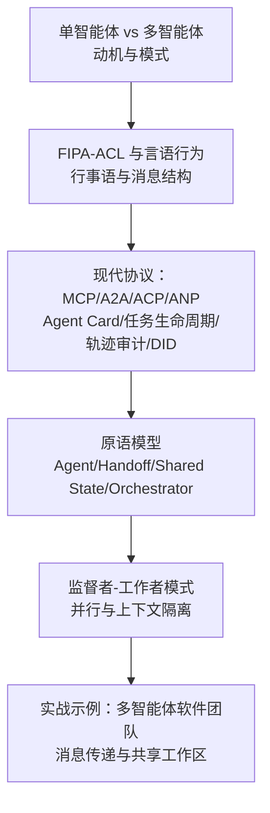
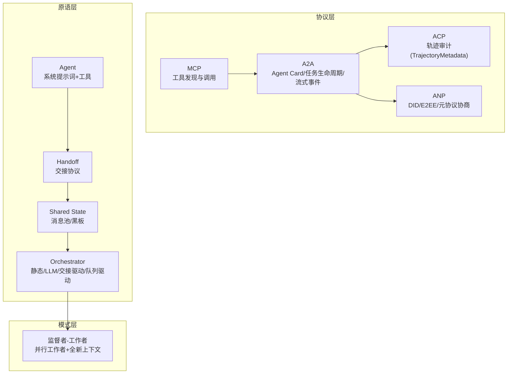
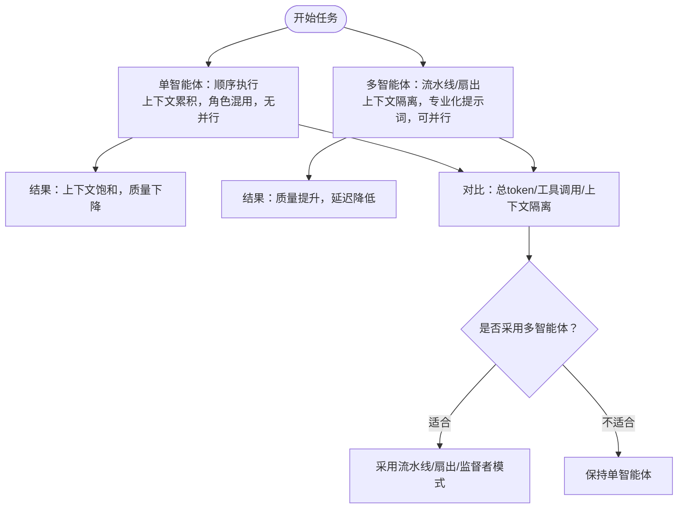
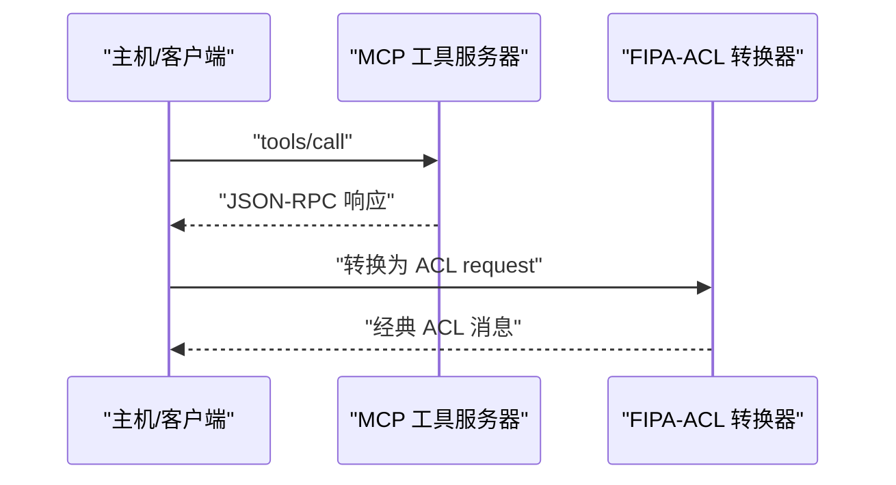
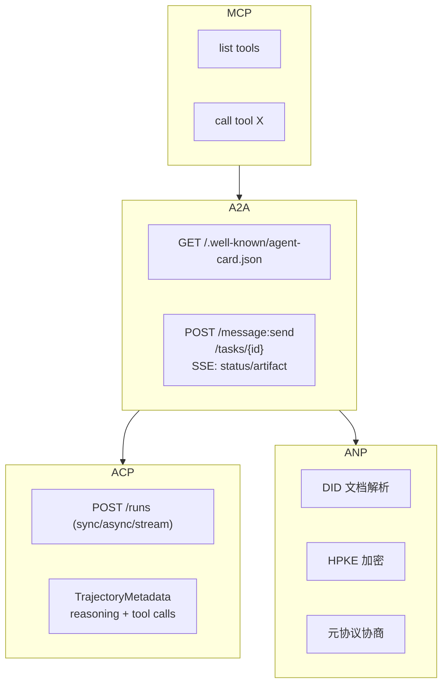
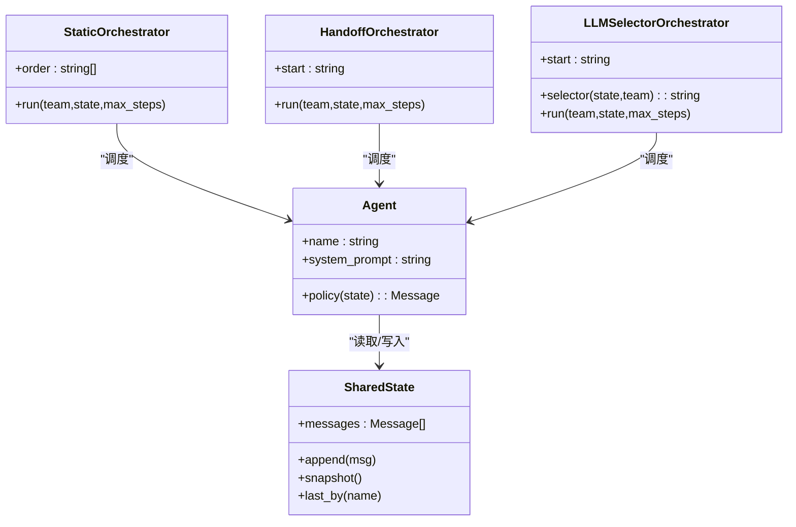
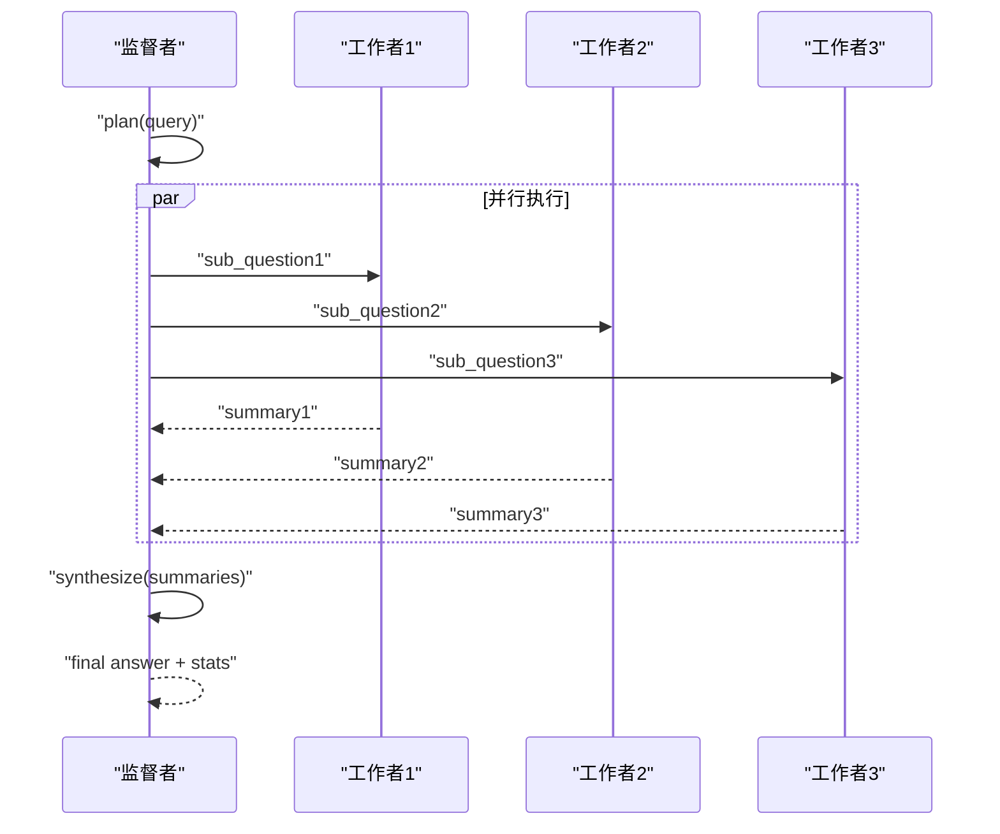
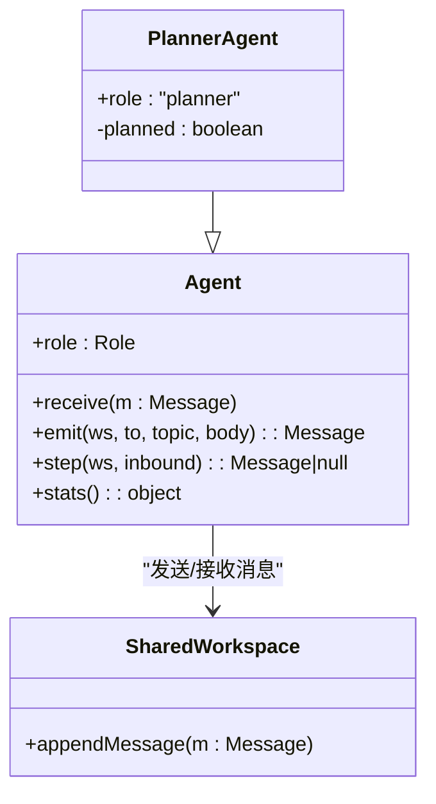
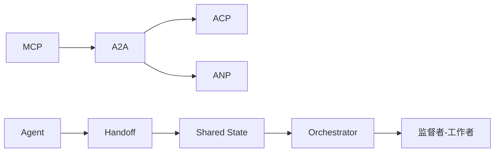

# 多智能体系统基础

<cite>
**本文引用的文件**
- [单智能体 vs 多智能体：为什么需要多智能体？](file://phases/16-multi-agent-and-swarms/01-why-multi-agent/docs/zh.md)
- [单智能体 vs 多智能体：性能对比示例代码](file://phases/16-multi-agent-and-swarms/01-why-multi-agent/code/single_vs_multi.ts)
- [FIPA-ACL 与言语行为的传承](file://phases/16-multi-agent-and-swarms/02-fipa-acl-heritage/docs/zh.md)
- [FIPA-ACL 转换器与合同网演示](file://phases/16-multi-agent-and-swarms/02-fipa-acl-heritage/code/main.py)
- [多智能体通信协议：MCP/A2A/ACP/ANP](file://phases/16-multi-agent-and-swarms/03-communication-protocols/docs/en.md)
- [多智能体原语模型：Agent/Handoff/Shared State/Orchestrator](file://phases/16-multi-agent-and-swarms/04-primitive-model/docs/zh.md)
- [原语实现：四原语标准库演示](file://phases/16-multi-agent-and-swarms/04-primitive-model/code/main.py)
- [监督者/编排器-工作者模式](file://phases/16-multi-agent-and-swarms/05-supervisor-orchestrator-pattern/docs/zh.md)
- [监督者模式实现：并行工作者演示](file://phases/16-multi-agent-and-swarms/05-supervisor-orchestrator-pattern/code/main.py)
- [多智能体软件团队示例：Agent 抽象与消息传递](file://phases/19-capstone-projects/10-multi-agent-software-team/code/ts/src/agent.ts)
</cite>

## 目录
1. [引言](#引言)
2. [项目结构](#项目结构)
3. [核心组件](#核心组件)
4. [架构总览](#架构总览)
5. [详细组件分析](#详细组件分析)
6. [依赖关系分析](#依赖关系分析)
7. [性能考量](#性能考量)
8. [故障排查指南](#故障排查指南)
9. [结论](#结论)
10. [附录](#附录)

## 引言
本课程面向多智能体系统的基础学习与实践，围绕“为何需要多智能体”“多智能体相较单智能体的优势与适用场景”“FIPA-ACL 通信协议的历史与思想传承”“现代多智能体通信协议的分类与特点”“原语模型与编排器模式”“协议选择策略与设计原则”展开。通过仓库中的文档与代码示例，读者可以理解多智能体系统的设计空间、实现路径与工程化要点，并掌握在真实项目中落地的思路与方法。

## 项目结构
本课程位于“多智能体与蜂群”阶段，配套有：
- 01-why-multi-agent：单智能体天花板与多智能体动机、流水线/扇出/编排器-工作者/对等群等模式
- 02-fipa-acl-heritage：FIPA-ACL 的言语行为理论、二十个行事语、经典消息结构与现代协议映射
- 03-communication-protocols：MCP/A2A/ACP/ANP 的协议对比、Agent Card、任务生命周期、轨迹审计、DID 与身份验证
- 04-primitive-model：四原语（Agent/Handoff/Shared State/Orchestrator）与框架映射
- 05-supervisor-orchestrator-pattern：监督者-工作者模式、并行收益与工程实践
- capstone 项目：多智能体软件团队示例，展示消息传递与共享工作区

**章节来源**
- [单智能体 vs 多智能体：为什么需要多智能体？:1-436](file://phases/16-multi-agent-and-swarms/01-why-multi-agent/docs/zh.md#L1-L436)
- [FIPA-ACL 与言语行为的传承:1-208](file://phases/16-multi-agent-and-swarms/02-fipa-acl-heritage/docs/zh.md#L1-L208)
- [多智能体通信协议：MCP/A2A/ACP/ANP:1-1511](file://phases/16-multi-agent-and-swarms/03-communication-protocols/docs/en.md#L1-L1511)
- [多智能体原语模型：Agent/Handoff/Shared State/Orchestrator:1-173](file://phases/16-multi-agent-and-swarms/04-primitive-model/docs/zh.md#L1-L173)
- [监督者/编排器-工作者模式:1-132](file://phases/16-multi-agent-and-swarms/05-supervisor-orchestrator-pattern/docs/zh.md#L1-L132)
- [多智能体软件团队示例：Agent 抽象与消息传递:1-40](file://phases/19-capstone-projects/10-multi-agent-software-team/code/ts/src/agent.ts#L1-L40)

## 核心组件
- 单智能体的天花板与多智能体动机：上下文饱和、角色混淆、顺序瓶颈
- 多智能体模式：流水线、扇出/扇入、编排器-工作者、对等群
- FIPA-ACL 的言语行为理论与二十个行事语，现代协议映射
- 现代协议族：MCP（工具访问）、A2A（智能体对等协作）、ACP（企业审计）、ANP（去中心化身份）
- 原语模型：Agent、Handoff、Shared State、Orchestrator
- 监督者-工作者模式：并行工作者、全新上下文、综合冲突与工程实践
- 实战示例：消息传递、共享工作区、任务生命周期与轨迹审计

**章节来源**
- [单智能体 vs 多智能体：为什么需要多智能体？:10-217](file://phases/16-multi-agent-and-swarms/01-why-multi-agent/docs/zh.md#L10-L217)
- [FIPA-ACL 与言语行为的传承:18-178](file://phases/16-multi-agent-and-swarms/02-fipa-acl-heritage/docs/zh.md#L18-L178)
- [多智能体通信协议：MCP/A2A/ACP/ANP:34-601](file://phases/16-multi-agent-and-swarms/03-communication-protocols/docs/en.md#L34-L601)
- [多智能体原语模型：Agent/Handoff/Shared State/Orchestrator:18-144](file://phases/16-multi-agent-and-swarms/04-primitive-model/docs/zh.md#L18-L144)
- [监督者/编排器-工作者模式:18-104](file://phases/16-multi-agent-and-swarms/05-supervisor-orchestrator-pattern/docs/zh.md#L18-L104)
- [多智能体软件团队示例：Agent 抽象与消息传递:1-40](file://phases/19-capstone-projects/10-multi-agent-software-team/code/ts/src/agent.ts#L1-L40)

## 架构总览
多智能体系统的核心在于“结构化通信 + 可组合原语 + 可扩展编排”。现代协议族在传输与发现层面互补：MCP 提供工具访问，A2A 提供智能体协作，ACP 提供审计轨迹，ANP 提供去中心化身份。原语模型将复杂系统映射到四个轴，监督者-工作者模式体现并行与上下文隔离的价值。

**图表来源**
- [多智能体通信协议：MCP/A2A/ACP/ANP:34-601](file://phases/16-multi-agent-and-swarms/03-communication-protocols/docs/en.md#L34-L601)
- [多智能体原语模型：Agent/Handoff/Shared State/Orchestrator:18-102](file://phases/16-multi-agent-and-swarms/04-primitive-model/docs/zh.md#L18-L102)
- [监督者/编排器-工作者模式:18-72](file://phases/16-multi-agent-and-swarms/05-supervisor-orchestrator-pattern/docs/zh.md#L18-L72)

## 详细组件分析

### 单智能体 vs 多智能体：性能与复杂度权衡
- 单智能体的三大问题：上下文饱和、角色混淆、顺序瓶颈
- 多智能体的优势：上下文隔离、专业化提示词、并行执行
- 示例代码展示了单智能体与多智能体流水线/扇出模式在 token 使用与工具调用上的差异

**图表来源**
- [单智能体 vs 多智能体：性能对比示例代码:225-259](file://phases/16-multi-agent-and-swarms/01-why-multi-agent/code/single_vs_multi.ts#L225-L259)
- [单智能体 vs 多智能体：为什么需要多智能体？:218-407](file://phases/16-multi-agent-and-swarms/01-why-multi-agent/docs/zh.md#L218-L407)

**章节来源**
- [单智能体 vs 多智能体：为什么需要多智能体？:10-217](file://phases/16-multi-agent-and-swarms/01-why-multi-agent/docs/zh.md#L10-L217)
- [单智能体 vs 多智能体：性能对比示例代码:1-259](file://phases/16-multi-agent-and-swarms/01-why-multi-agent/code/single_vs_multi.ts#L1-L259)

### FIPA-ACL 与言语行为的传承
- 言语行为理论：Austin 的“言语即行动”与 Searle 的五大类别
- FIPA-ACL 的二十个行事语与经典消息结构（sender/receiver/content/language/ontology/protocol/conversation-id/reply-with）
- 现代协议映射：MCP 的 tools/call ↔ request；A2A 的任务创建 ↔ request；订阅/通知 ↔ subscribe/inform
- 合同网协议（CNP）：cfp/propose/accept-proposal/reject-proposal 的任务市场模式

**图表来源**
- [FIPA-ACL 转换器与合同网演示:56-98](file://phases/16-multi-agent-and-swarms/02-fipa-acl-heritage/code/main.py#L56-L98)
- [FIPA-ACL 与言语行为的传承:47-162](file://phases/16-multi-agent-and-swarms/02-fipa-acl-heritage/docs/zh.md#L47-L162)

**章节来源**
- [FIPA-ACL 与言语行为的传承:18-178](file://phases/16-multi-agent-and-swarms/02-fipa-acl-heritage/docs/zh.md#L18-L178)
- [FIPA-ACL 转换器与合同网演示:1-252](file://phases/16-multi-agent-and-swarms/02-fipa-acl-heritage/code/main.py#L1-L252)

### 多智能体通信协议：MCP/A2A/ACP/ANP
- MCP：工具发现与调用，Agent-to-Tool
- A2A：Agent Card、任务生命周期（9状态）、SSE 流式事件
- ACP：Run 生命周期（同步/异步/流式）、TrajectoryMetadata（工具调用与推理链）
- ANP：DID 文档、E2EE（HPKE）、元协议协商（动态格式约定）

**图表来源**
- [多智能体通信协议：MCP/A2A/ACP/ANP:55-601](file://phases/16-multi-agent-and-swarms/03-communication-protocols/docs/en.md#L55-L601)

**章节来源**
- [多智能体通信协议：MCP/A2A/ACP/ANP:17-601](file://phases/16-multi-agent-and-swarms/03-communication-protocols/docs/en.md#L17-L601)

### 原语模型：Agent/Handoff/Shared State/Orchestrator
- Agent：系统提示词 + 工具集合（无状态）
- Handoff：结构化交接（函数返回、图边、发言者选择）
- Shared State：消息池/黑板（系统中唯一有状态的部分）
- Orchestrator：静态图、LLM 选择、交接驱动、队列驱动

**图表来源**
- [原语实现：四原语标准库演示:23-140](file://phases/16-multi-agent-and-swarms/04-primitive-model/code/main.py#L23-L140)
- [多智能体原语模型：Agent/Handoff/Shared State/Orchestrator:58-144](file://phases/16-multi-agent-and-swarms/04-primitive-model/docs/zh.md#L58-L144)

**章节来源**
- [多智能体原语模型：Agent/Handoff/Shared State/Orchestrator:18-144](file://phases/16-multi-agent-and-swarms/04-primitive-model/docs/zh.md#L18-L144)
- [原语实现：四原语标准库演示:1-174](file://phases/16-multi-agent-and-swarms/04-primitive-model/code/main.py#L1-L174)

### 监督者-工作者模式：并行与全新上下文
- 模式：主导者规划、工作者并行、综合
- 工程经验：彩虹部署、token 主导、先宽后窄、超时与冲突检测
- 示例：并行工作者的挂钟时间优势、轨迹记录与统计

**图表来源**
- [监督者模式实现：并行工作者演示:68-112](file://phases/16-multi-agent-and-swarms/05-supervisor-orchestrator-pattern/code/main.py#L68-L112)
- [监督者/编排器-工作者模式:18-104](file://phases/16-multi-agent-and-swarms/05-supervisor-orchestrator-pattern/docs/zh.md#L18-L104)

**章节来源**
- [监督者/编排器-工作者模式:18-132](file://phases/16-multi-agent-and-swarms/05-supervisor-orchestrator-pattern/docs/zh.md#L18-L132)
- [监督者模式实现：并行工作者演示:1-147](file://phases/16-multi-agent-and-swarms/05-supervisor-orchestrator-pattern/code/main.py#L1-L147)

### 实战示例：多智能体软件团队
- Agent 抽象：角色、消息收发、统计
- SharedWorkspace：消息池与广播
- 演示：PlannerAgent 等角色通过消息总线协作

**图表来源**
- [多智能体软件团队示例：Agent 抽象与消息传递:1-40](file://phases/19-capstone-projects/10-multi-agent-software-team/code/ts/src/agent.ts#L1-L40)

**章节来源**
- [多智能体软件团队示例：Agent 抽象与消息传递:1-40](file://phases/19-capstone-projects/10-multi-agent-software-team/code/ts/src/agent.ts#L1-L40)

## 依赖关系分析
- 协议依赖：MCP 作为工具层，A2A 作为协作层，ACP 作为审计层，ANP 作为身份层
- 原语依赖：Agent 依赖 Shared State；Handoff 依赖 Orchestrator；Orchestrator 决定 Agent 的执行序列
- 模式依赖：监督者-工作者模式依赖 A2A 的任务生命周期与流式事件能力

**图表来源**
- [多智能体通信协议：MCP/A2A/ACP/ANP:55-601](file://phases/16-multi-agent-and-swarms/03-communication-protocols/docs/en.md#L55-L601)
- [多智能体原语模型：Agent/Handoff/Shared State/Orchestrator:18-102](file://phases/16-multi-agent-and-swarms/04-primitive-model/docs/zh.md#L18-L102)
- [监督者/编排器-工作者模式:18-72](file://phases/16-multi-agent-and-swarms/05-supervisor-orchestrator-pattern/docs/zh.md#L18-L72)

**章节来源**
- [多智能体通信协议：MCP/A2A/ACP/ANP:556-601](file://phases/16-multi-agent-and-swarms/03-communication-protocols/docs/en.md#L556-L601)
- [多智能体原语模型：Agent/Handoff/Shared State/Orchestrator:18-102](file://phases/16-multi-agent-and-swarms/04-primitive-model/docs/zh.md#L18-L102)
- [监督者/编排器-工作者模式:18-72](file://phases/16-multi-agent-and-swarms/05-supervisor-orchestrator-pattern/docs/zh.md#L18-L72)

## 性能考量
- 单智能体：顺序执行，上下文累积导致质量下降；工具调用与 token 使用线性增长
- 多智能体：上下文隔离带来质量提升；并行执行显著降低挂钟时间；总 token 增长但可控制
- 工程优化：彩虹部署、token 预算、超时与冲突检测、可观测性（轨迹审计）

**章节来源**
- [单智能体 vs 多智能体：性能对比示例代码:225-259](file://phases/16-multi-agent-and-swarms/01-why-multi-agent/code/single_vs_multi.ts#L225-L259)
- [监督者/编排器-工作者模式:48-104](file://phases/16-multi-agent-and-swarms/05-supervisor-orchestrator-pattern/docs/zh.md#L48-L104)
- [多智能体通信协议：MCP/A2A/ACP/ANP:1421-1434](file://phases/16-multi-agent-and-swarms/03-communication-protocols/docs/en.md#L1421-L1434)

## 故障排查指南
- 模式问题：上下文污染、角色混淆、顺序瓶颈（单智能体）
- 协议问题：Schema drift（Agent Card 版本不一致）、状态机违规（终端状态后仍产出事件）、信任解析失败（DID 文档不可达）、轨迹膨胀（工具调用过多）
- 原语问题：共享状态竞争、消息排序、版本控制、交接协议不一致
- 模式问题：主导者幻觉计划、工作者过度探索、综合冲突（静默选择一边）

**章节来源**
- [多智能体通信协议：MCP/A2A/ACP/ANP:1421-1487](file://phases/16-multi-agent-and-swarms/03-communication-protocols/docs/en.md#L1421-L1487)
- [监督者/编排器-工作者模式:61-104](file://phases/16-multi-agent-and-swarms/05-supervisor-orchestrator-pattern/docs/zh.md#L61-L104)

## 结论
多智能体系统通过“结构化通信 + 可组合原语 + 可扩展编排”实现从单智能体的顺序瓶颈与上下文饱和中突破。FIPA-ACL 的言语行为理论为现代协议提供了思想根基；MCP/A2A/ACP/ANP 在工具访问、智能体协作、审计轨迹与去中心化身份方面形成互补；原语模型与监督者-工作者模式则提供了工程化落地的抓手。在实际项目中，应结合任务复杂度、合规要求与团队能力，选择合适的协议与编排策略，并建立可观测性与治理机制。

## 附录
- 协议选择策略（概览）
  - 是否需要工具访问：MCP
  - 是否需要智能体协作：A2A（Agent Card/任务生命周期/流式事件）
  - 是否需要审计轨迹：ACP（TrajectoryMetadata）
  - 是否需要跨组织信任：ANP（DID/E2EE/元协议协商）
- 原语映射与框架比较：将任意多智能体框架映射到四原语坐标轴，快速理解其设计取舍
- 实战清单：在采用新框架/协议前，先做原语映射与协议选择检查

**章节来源**
- [多智能体通信协议：MCP/A2A/ACP/ANP:1447-1468](file://phases/16-multi-agent-and-swarms/03-communication-protocols/docs/en.md#L1447-L1468)
- [多智能体原语模型：Agent/Handoff/Shared State/Orchestrator:135-144](file://phases/16-multi-agent-and-swarms/04-primitive-model/docs/zh.md#L135-L144)