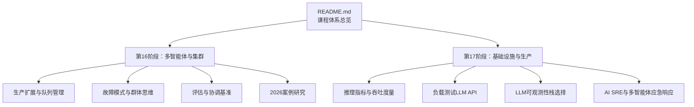
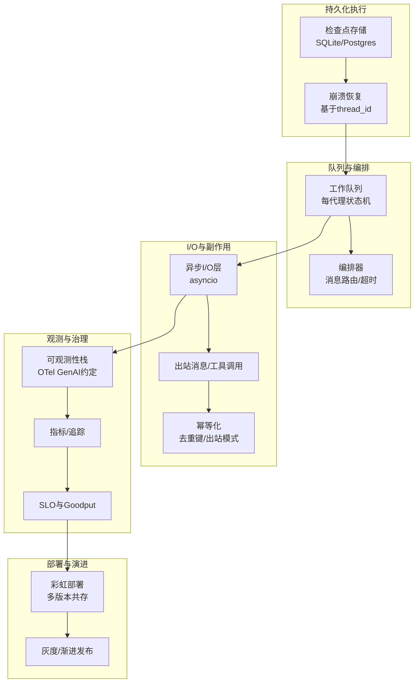
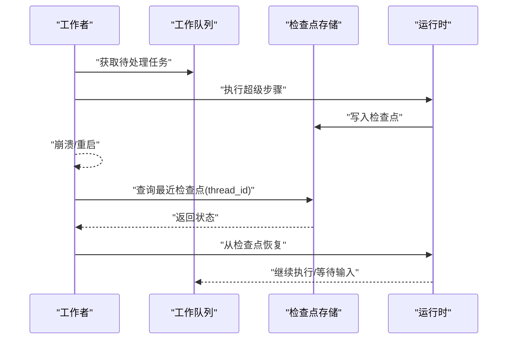
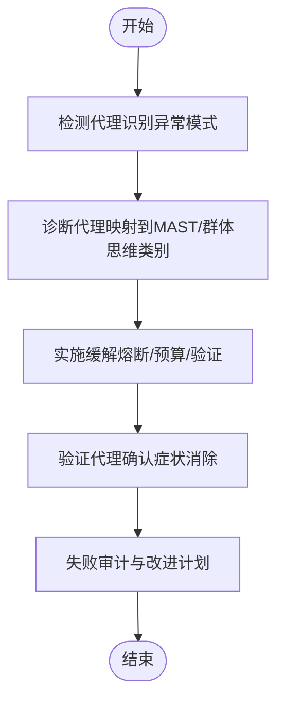
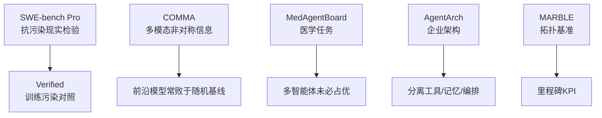
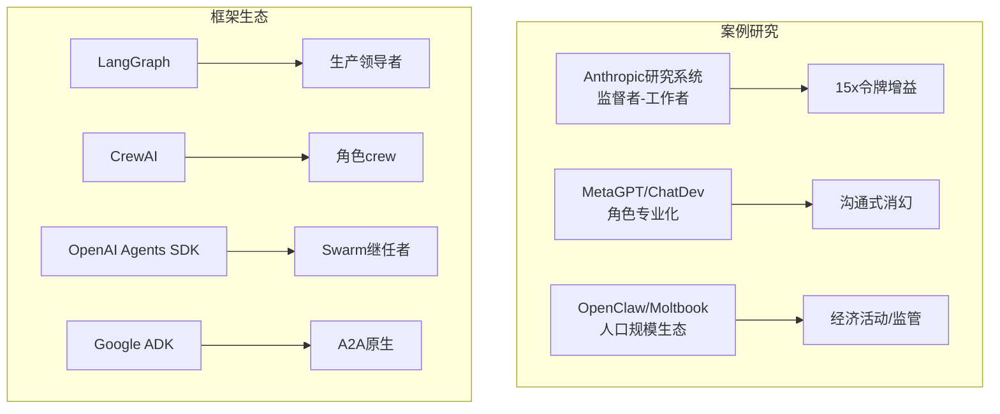
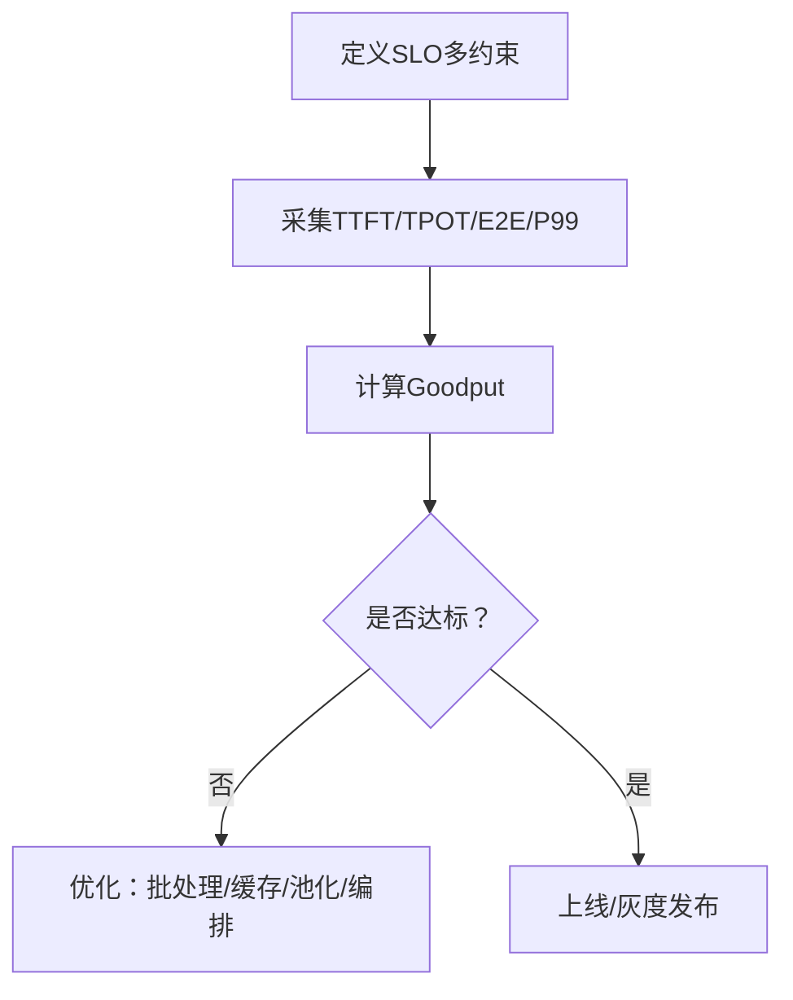
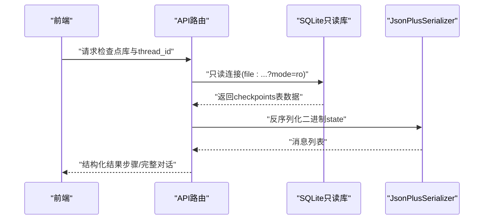
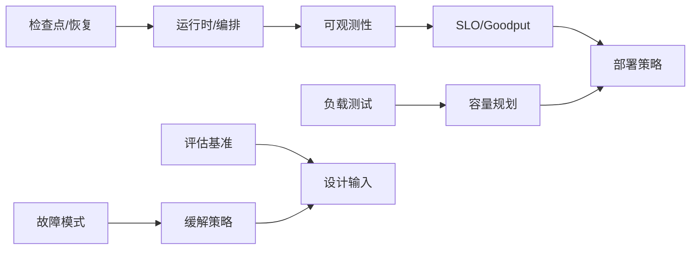

# 生产部署与扩展

<cite>
**本文引用的文件**
- [README.md](file://README.md)
- [生产扩展与队列管理（英文）](file://phases/16-multi-agent-and-swarms/22-production-scaling-queues-checkpoints/docs/en.md)
- [故障模式与群体思维（英文）](file://phases/16-multi-agent-and-swarms/23-failure-modes-mast-groupthink/docs/en.md)
- [评估与协调基准（英文）](file://phases/16-multi-agent-and-swarms/24-evaluation-coordination-benchmarks/docs/en.md)
- [2026案例研究（英文）](file://phases/16-multi-agent-and-swarms/25-case-studies-2026-sota/docs/en.md)
- [推理指标与吞吐度量（英文）](file://phases/17-infrastructure-and-production/08-inference-metrics-goodput/docs/en.md)
- [负载测试LLM API（英文）](file://phases/17-infrastructure-and-production/22-load-testing-llm-apis/code/main.py)
- [LLM可观测性栈选择（英文）](file://phases/17-infrastructure-and-production/13-llm-observability/docs/en.md)
- [AI SRE与多智能体应急响应（英文）](file://phases/17-infrastructure-and-production/23-sre-for-ai/docs/en.md)
- [LangGraph检查点数据库（中文）](file://guardrails-sandbox/backend/playground/checkpoint_db.py)
- [LangGraph检查点查看器（中文）](file://guardrails-sandbox/backend/playground/modules/checkpoint_viewer.py)
</cite>

## 目录
1. [引言](#引言)
2. [项目结构](#项目结构)
3. [核心组件](#核心组件)
4. [架构总览](#架构总览)
5. [详细组件分析](#详细组件分析)
6. [依赖关系分析](#依赖关系分析)
7. [性能考虑](#性能考虑)
8. [故障排查指南](#故障排查指南)
9. [结论](#结论)
10. [附录](#附录)

## 引言
本文件面向生产级多智能体系统的部署与扩展，围绕以下目标展开：  
- 深入讲解智能体经济系统的市场机制、交易模型与资源配置策略  
- 分析生产级扩展的关键技术、队列管理与检查点恢复机制  
- 全面介绍多智能体系统的故障模式、群体思维陷阱与风险控制措施  
- 探讨协调评估基准的设计原理、测试方法与性能指标  
- 总结2026年最新多智能体技术案例研究、成功经验与失败教训  
- 提供生产环境部署指南、监控告警与运维最佳实践  
- 包含性能瓶颈分析、容量规划与成本优化策略  

## 项目结构
本仓库以“阶段-课程”组织方式呈现完整的AI工程知识体系，涵盖数学基础、机器学习、深度学习、大模型工程、工具协议、代理工程、自治系统、多智能体与集群、基础设施与生产等20个阶段。  
- 多智能体与生产相关的核心内容集中在第16阶段“多智能体与集群”与第17阶段“基础设施与生产”。  
- 第16阶段包含“生产扩展与队列管理”“故障模式与群体思维”“评估与协调基准”“2026案例研究”等关键主题。  
- 第17阶段覆盖“推理指标与吞吐度量”“负载测试LLM API”“LLM可观测性栈选择”“AI SRE与多智能体应急响应”等生产落地主题。

**图表来源**
- [README.md:57-81](file://README.md#L57-L81)

**章节来源**
- [README.md:243-795](file://README.md#L243-L795)

## 核心组件
- 多智能体系统生产扩展层：持久化执行、工作队列、异步I/O、幂等副作用、彩虹部署、可观测性与SLO治理。  
- 基础设施与运行时：推理指标定义与度量、负载测试方法、可观测性栈选择、AI SRE应急响应与预测性检测。  
- 检查点与恢复：LangGraph风格的检查点序列化与数据库读取，支持崩溃恢复与跨进程/跨版本迁移。  
- 评估与基准：多拓扑协调基准、抗污染评测、企业架构基准、SWE-bench Pro现实检验与WMAC社区焦点。  

**章节来源**
- [生产扩展与队列管理（英文）:1-180](file://phases/16-multi-agent-and-swarms/22-production-scaling-queues-checkpoints/docs/en.md#L1-L180)
- [推理指标与吞吐度量（英文）:1-145](file://phases/17-infrastructure-and-production/08-inference-metrics-goodput/docs/en.md#L1-L145)
- [LangGraph检查点数据库（中文）:1-148](file://guardrails-sandbox/backend/playground/checkpoint_db.py#L1-L148)

## 架构总览
多智能体生产系统以“持久化执行 + 队列编排 + 异步I/O + 幂等副作用 + 观测与SLO + 彩虹部署”为核心架构支柱，结合LangGraph风格的检查点恢复能力，实现长周期、高并发、可恢复的代理运行。

**图表来源**
- [生产扩展与队列管理（英文）:30-118](file://phases/16-multi-agent-and-swarms/22-production-scaling-queues-checkpoints/docs/en.md#L30-L118)
- [LLM可观测性栈选择（英文）:78-86](file://phases/17-infrastructure-and-production/13-llm-observability/docs/en.md#L78-L86)

## 详细组件分析

### 组件A：生产扩展与队列管理
- 持久化执行与崩溃恢复：LangGraph风格的检查点按“超级步骤”写入，崩溃释放租约后其他工作者可基于thread_id恢复，确保无重复副作用。  
- 每代理工作队列：三态机（空闲/处理/响应），配合两层编排（组内聊天+跨组管理员聊天），在数千并发下保持线性成本增长。  
- 异步I/O与线程对比：LLM调用I/O密集，协程在内存与延迟上显著优于线程；CPU密集后处理仍可采用线程/进程分离。  
- 幂等副作用与“至少一次投递 + 去重”：通过去重键与出站模式实现有效一次性语义；补偿事务用于跟踪写失败场景。  
- 彩虹部署：多版本运行时并存，新旧版本同时服务长生命周期代理，降低部署中断风险。  
- 实践建议：从简单架构起步（FastAPI+Postgres），在测量失败后再引入持久化执行框架；优先实现可观测性与SLO治理。

**图表来源**
- [生产扩展与队列管理（英文）:30-54](file://phases/16-multi-agent-and-swarms/22-production-scaling-queues-checkpoints/docs/en.md#L30-L54)

**章节来源**
- [生产扩展与队列管理（英文）:1-180](file://phases/16-multi-agent-and-swarms/22-production-scaling-queues-checkpoints/docs/en.md#L1-L180)

### 组件B：故障模式与群体思维
- MAST分类体系：规范问题（41.77%）、协调失败（36.94%）、验证缺口（21.30%）。  
- 群体思维家族：单一文化崩溃、从众偏差、理论心智缺陷、混合动机动态、级联可靠性失效。  
- 级联示例：支付失败触发订单重试，进而引发库存重试放大，最终导致下游服务雪崩；需引入熔断器与请求预算上限。  
- 记忆污染：一个代理的虚构信息进入共享内存，下游代理将其视为事实，准确率缓慢下降，诊断困难；应采用只写日志、溯源与不可变校验。  
- STRATUS：专用检测/诊断/验证代理，分别负责症状匹配、根因推断与效果验证，提升缓解成功率。  
- 失败审计：收集真实执行轨迹，映射至MAST+群体思维类别，计算失败率并排序，选取2-3项改进措施，季度复审。

**图表来源**
- [故障模式与群体思维（英文）:103-138](file://phases/16-multi-agent-and-swarms/23-failure-modes-mast-groupthink/docs/en.md#L103-L138)

**章节来源**
- [故障模式与群体思维（英文）:1-204](file://phases/16-multi-agent-and-swarms/23-failure-modes-mast-groupthink/docs/en.md#L1-L204)

### 组件C：评估与协调基准
- MARBLE（ACL 2025）：四类拓扑（星/链/树/图）与里程碑KPI，图拓扑在研究场景最优，链拓扑在逐步细化编码中最优，星拓扑在快速事实整合中最优。  
- COMMA：多模态非对称信息协作，前沿模型在代理协作中难以超越随机基线，提示多模态协调训练不足。  
- MedAgentBoard：四个医学任务类别，多智能体并不总优于单LLM，优势有限且受分解收益与协调开销影响。  
- AgentArch：企业代理架构，分离工具使用、记忆与编排，隔离各层贡献，避免盲目购买功能。  
- SWE-bench Pro：1865题、41库、抗污染设计，作为当前“现实检验”基准；Claude Opus 4.7在Pro上报告64.3%，Verdent在Verified上76.1%。  
- WMAC 2026：AAAI 2026多智能体协调研讨会，社区焦点；优先采纳WMAC收录论文而非arXiv预印。

**图表来源**
- [评估与协调基准（英文）:20-87](file://phases/16-multi-agent-and-swarms/24-evaluation-coordination-benchmarks/docs/en.md#L20-L87)

**章节来源**
- [评估与协调基准（英文）:1-150](file://phases/16-multi-agent-and-swarms/24-evaluation-coordination-benchmarks/docs/en.md#L1-L150)

### 组件D：2026案例研究与框架生态
- Anthropic研究系统：监督者-工作者拓扑，子代理获得全新上下文窗口，15倍令牌增益，单次Opus 4相比单代理+90.2%；采用彩虹部署。  
- MetaGPT/ChatDev：软件工程SOP编码的角色专业化，ChatDev提出“沟通式消幻”，MacNet通过DAG扩展至>1000代理；强调手稿契约与结构化流转。  
- OpenClaw/Moltbook：本地ReAct循环代理，Moltbook社交网络上线即达230万账户，Meta收购；出现人口规模下的经济活动、提示注入风险与国家监管响应。  
- 框架生态（2026年4月）：LangGraph/CrewAI为生产领导者；AG2为社区维护；Microsoft AutoGen进入维护模式；OpenAI Agents SDK为Swarm继任者；Google ADK为A2A原生新入局者；主流框架均支持MCP+A2A。

**图表来源**
- [2026案例研究（英文）:16-121](file://phases/16-multi-agent-and-swarms/25-case-studies-2026-sota/docs/en.md#L16-L121)

**章节来源**
- [2026案例研究（英文）:1-169](file://phases/16-multi-agent-and-swarms/25-case-studies-2026-sota/docs/en.md#L1-L169)

### 组件E：基础设施与生产（推理指标、负载测试、可观测性、AI SRE）
- 推理指标：TTFT（首token时间）、TPOT/ITL（每token间隔）、E2E（端到端）、吞吐、Goodput（SLO全满足比例）。强调P50/P90/P99与工具差异（如GenAI-Perf与LLMPerf对ITL定义不同）。  
- 负载测试：统一提示会人为夸大吞吐（前缀缓存与请求合并效应），真实分布才能揭示真实天花板；使用LLMPerf指定均值与标准差参数。  
- 可观测性栈：开发平台（LangSmith/Langfuse/Opik）与网关/遥测（Helicone/SigNoz/OpenLLMetry/Phoenix）区分；推荐OTel+GenAI约定组合；Arize AX零拷贝冰川/Parquet方案在规模上具备百倍成本优势。  
- AI SRE：监督者+专用代理（日志/指标/手册）+人工审批；自动修复范围严格限制；对抗评估（两模型独立分析）提高可信度；MIT研究显示89%提前10-15分钟预测故障；2026年多数企业LLM具备自动化故障切换能力。

**图表来源**
- [推理指标与吞吐度量（英文）:51-94](file://phases/17-infrastructure-and-production/08-inference-metrics-goodput/docs/en.md#L51-L94)

**章节来源**
- [推理指标与吞吐度量（英文）:1-145](file://phases/17-infrastructure-and-production/08-inference-metrics-goodput/docs/en.md#L1-L145)
- [负载测试LLM API（英文）:1-90](file://phases/17-infrastructure-and-production/22-load-testing-llm-apis/code/main.py#L1-L90)
- [LLM可观测性栈选择（英文）:1-142](file://phases/17-infrastructure-and-production/13-llm-observability/docs/en.md#L1-L142)
- [AI SRE与多智能体应急响应（英文）:1-131](file://phases/17-infrastructure-and-production/23-sre-for-ai/docs/en.md#L1-L131)

### 组件F：检查点与恢复（LangGraph风格）
- 数据库层：只读打开（mode=ro），限定DATA_DIR，防止目录穿越；仅允许预置库，确保安全读取。  
- 解码流程：JsonPlusSerializer反序列化二进制state，提取messages通道，转换为前端友好结构；支持按thread_id过滤与全量浏览。  
- 展示能力：列出所有thread、统计检查点数量、回放完整对话、标注每步消息数与最后消息摘要。

**图表来源**
- [LangGraph检查点数据库（中文）:86-147](file://guardrails-sandbox/backend/playground/checkpoint_db.py#L86-L147)

**章节来源**
- [LangGraph检查点数据库（中文）:1-148](file://guardrails-sandbox/backend/playground/checkpoint_db.py#L1-L148)
- [LangGraph检查点查看器（中文）:1-206](file://guardrails-sandbox/backend/playground/modules/checkpoint_viewer.py#L1-L206)

## 依赖关系分析
- 多智能体生产层依赖LangGraph风格的检查点序列化与数据库读取，确保崩溃恢复与跨版本迁移。  
- 观测与治理依赖OpenTelemetry GenAI约定，形成“网关+评估平台”的双轨观测模式。  
- 负载测试与推理指标共同决定容量规划与成本优化方向；SLO与Goodput成为部署门禁。  
- 故障模式与评估基准为系统设计提供输入，指导验证与缓解策略的优先级。

**图表来源**
- [生产扩展与队列管理（英文）:110-118](file://phases/16-multi-agent-and-swarms/22-production-scaling-queues-checkpoints/docs/en.md#L110-L118)
- [LLM可观测性栈选择（英文）:78-86](file://phases/17-infrastructure-and-production/13-llm-observability/docs/en.md#L78-L86)
- [推理指标与吞吐度量（英文）:85-94](file://phases/17-infrastructure-and-production/08-inference-metrics-goodput/docs/en.md#L85-L94)

**章节来源**
- [生产扩展与队列管理（英文）:110-118](file://phases/16-multi-agent-and-swarms/22-production-scaling-queues-checkpoints/docs/en.md#L110-L118)
- [LLM可观测性栈选择（英文）:78-86](file://phases/17-infrastructure-and-production/13-llm-observability/docs/en.md#L78-L86)
- [推理指标与吞吐度量（英文）:85-94](file://phases/17-infrastructure-and-production/08-inference-metrics-goodput/docs/en.md#L85-L94)

## 性能考虑
- 指标优先：以P99为准绳，关注TTFT主导的长提示与TPOT主导的长输出场景；Goodput作为产品健康度唯一指标。  
- 负载测试：使用LLMPerf指定真实分布（均值/标准差/输出长度），避免统一提示带来的吞吐“陷阱”。  
- 缓存与批处理：利用前缀缓存与批处理效率，但需注意真实分布下的性能真相；批处理可能减少有效槽位数。  
- 成本与容量：令牌成本、等待时间、彩虹部署开销与验证成本共同决定性价比；以SLO驱动的容量规划更稳健。  

**章节来源**
- [推理指标与吞吐度量（英文）:17-102](file://phases/17-infrastructure-and-production/08-inference-metrics-goodput/docs/en.md#L17-L102)
- [负载测试LLM API（英文）:1-90](file://phases/17-infrastructure-and-production/22-load-testing-llm-apis/code/main.py#L1-L90)

## 故障排查指南
- 快速定位：使用STRATUS三元组（检测/诊断/验证）识别症状、推断根因、验证缓解；对慢故障采用代理指标（一致性、重试率、输出分布漂移）。  
- 级联与熔断：针对支付失败引发的重试风暴，设置错误率阈值与预算上限，启用熔断器与默认响应；对下游依赖建立短路保护。  
- 记忆污染：对共享内存采用只写日志、溯源与不可变校验；对验证缺口配置独立验证代理或手稿契约。  
- 运维自动化：AI SRE以监督者协调日志/指标/手册代理，人类审批后执行窄范围自动修复；预测性检测在10-15分钟前提前预警，制定预处置策略。  

**章节来源**
- [故障模式与群体思维（英文）:103-138](file://phases/16-multi-agent-and-swarms/23-failure-modes-mast-groupthink/docs/en.md#L103-L138)
- [AI SRE与多智能体应急响应（英文）:27-91](file://phases/17-infrastructure-and-production/23-sre-for-ai/docs/en.md#L27-L91)

## 结论
- 多智能体生产系统需要以“持久化执行+队列编排+异步I/O+幂等副作用+可观测+SLO”为基建底座，并以LangGraph风格检查点实现崩溃恢复与跨版本演进。  
- 评估与基准为设计提供客观依据，SWE-bench Pro与MARBLE等基准应成为门禁；WMAC社区成果指引方向。  
- 案例研究显示：监督者-工作者、角色专业化与人口规模生态是三大成熟路径；框架生态已趋于MCP/A2A协议兼容。  
- 基础设施侧以TTFT/TPOT/E2E/Goodput为核心度量，结合真实分布的负载测试与可观测性栈，实现稳健的成本与性能平衡。  

## 附录
- 术语速览：  
  - 持久化执行：在每个超级步骤后写入状态，崩溃可恢复。  
  - 超级步骤：检查点之间的事务边界。  
  - thread_id：代理运行标识符。  
  - 幂等：可重复执行产生相同结果。  
  - 出站模式：意图先写表，再由独立执行器消费。  
  - 至少一次投递：消息队列语义；结合去重键实现有效一次性。  
  - 彩虹部署：多版本并存，保障长生命周期代理不被中断。  
  - Goodput：满足所有SLO约束的请求比例。  
  - MAST：多智能体失败分类体系。  
  - 群体思维：单一文化、从众偏差、理论心智缺陷、混合动机、级联失效。  
  - STRATUS：检测/诊断/验证代理三元组。  
  - AI SRE：以代理协调的SRE自动化与预测性检测。  

**章节来源**
- [生产扩展与队列管理（英文）:159-171](file://phases/16-multi-agent-and-swarms/22-production-scaling-queues-checkpoints/docs/en.md#L159-L171)
- [故障模式与群体思维（英文）:182-196](file://phases/16-multi-agent-and-swarms/23-failure-modes-mast-groupthink/docs/en.md#L182-L196)
- [评估与协调基准（英文）:129-140](file://phases/16-multi-agent-and-swarms/24-evaluation-coordination-benchmarks/docs/en.md#L129-L140)
- [2026案例研究（英文）:145-158](file://phases/16-multi-agent-and-swarms/25-case-studies-2026-sota/docs/en.md#L145-L158)
- [推理指标与吞吐度量（英文）:123-136](file://phases/17-infrastructure-and-production/08-inference-metrics-goodput/docs/en.md#L123-L136)
- [AI SRE与多智能体应急响应（英文）:109-122](file://phases/17-infrastructure-and-production/23-sre-for-ai/docs/en.md#L109-L122)