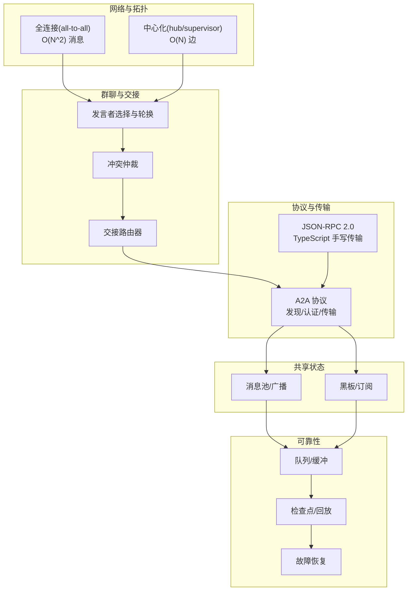
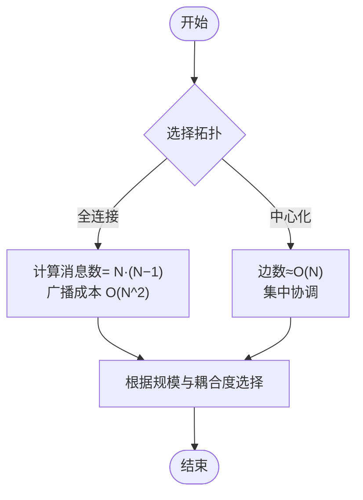
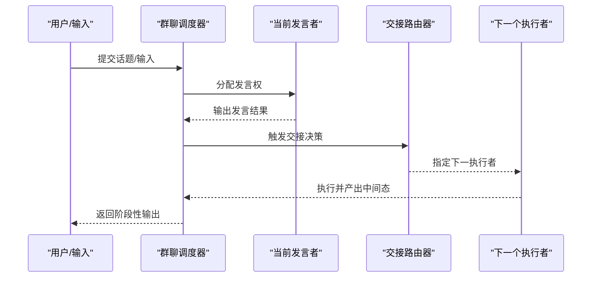
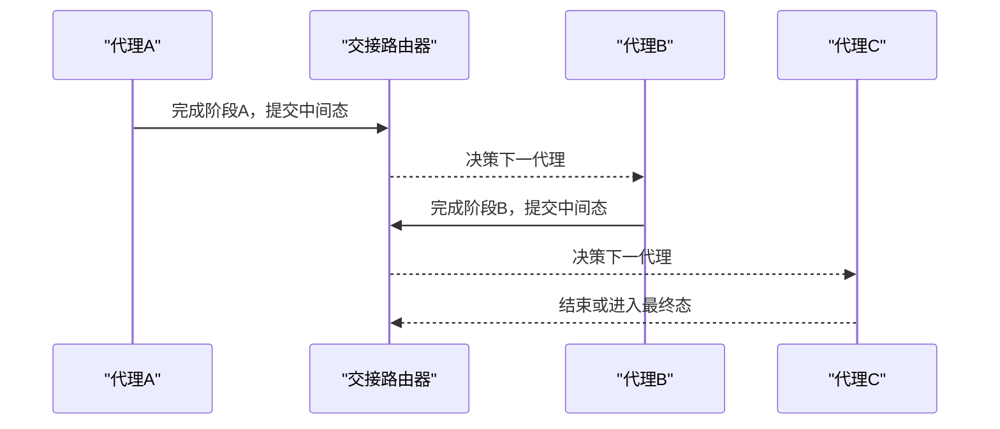
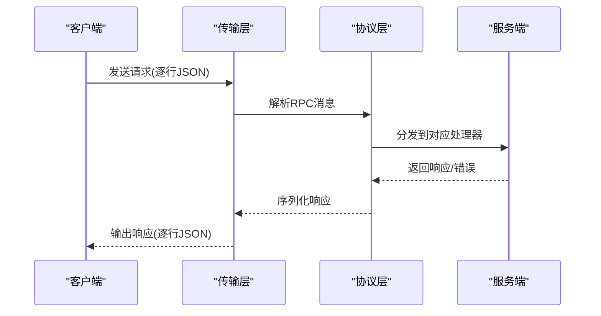

# 通信机制与网络

<cite>
**本文引用的文件**
- [README.md](file://README.md)
- [ROADMAP.md](file://ROADMAP.md)
- [site/figures-agents-alignment.js](file://site/figures-agents-alignment.js)
- [phases/16-multi-agent-and-swarms/09-parallel-swarm-networks/docs/en.md](file://phases/16-multi-agent-and-swarms/09-parallel-swarm-networks/docs/en.md)
- [phases/16-multi-agent-and-swarms/10-group-chat-speaker-selection/docs/en.md](file://phases/16-multi-agent-and-swarms/10-group-chat-speaker-selection/docs/en.md)
- [phases/16-multi-agent-and-swarms/12-a2a-protocol/docs/en.md](file://phases/16-multi-agent-and-swarms/12-a2a-protocol/docs/en.md)
- [phases/16-multi-agent-and-swarms/13-shared-memory-blackboard/docs/en.md](file://phases/16-multi-agent-and-swarms/13-shared-memory-blackboard/docs/en.md)
- [phases/16-multi-agent-and-swarms/14-consensus-and-bft/docs/en.md](file://phases/16-multi-agent-and-swarms/14-consensus-and-bft/docs/en.md)
- [phases/16-multi-agent-and-swarms/15-voting-debate-topology/docs/en.md](file://phases/16-multi-agent-and-swarms/15-voting-debate-topology/docs/en.md)
- [phases/16-multi-agent-and-swarms/16-negotiation-bargaining/docs/en.md](file://phases/16-multi-agent-and-swarms/16-negotiation-bargaining/docs/en.md)
- [phases/16-multi-agent-and-swarms/22-production-scaling-queues-checkpoints/docs/en.md](file://phases/16-multi-agent-and-swarms/22-production-scaling-queues-checkpoints/docs/en.md)
- [phases/16-multi-agent-and-swarms/23-failure-modes-mast-groupthink/docs/en.md](file://phases/16-multi-agent-and-swarms/23-failure-modes-mast-groupthink/docs/en.md)
- [phases/16-multi-agent-and-swarms/24-evaluation-coordination-benchmarks/docs/en.md](file://phases/16-multi-agent-and-swarms/24-evaluation-coordination-benchmarks/docs/en.md)
- [phases/16-multi-agent-and-swarms/25-case-studies-2026-sota/docs/en.md](file://phases/16-multi-agent-and-swarms/25-case-studies-2026-sota/docs/en.md)
- [phases/14-agent-engineering/13-langgraph-stateful-graphs/outputs/skill-demo/graph.py](file://phases/14-agent-engineering/13-langgraph-stateful-graphs/outputs/skill-demo/graph.py)
- [phases/14-agent-engineering/13-langgraph-stateful-graphs/outputs/skill-demo/README.md](file://phases/14-agent-engineering/13-langgraph-stateful-graphs/outputs/skill-demo/README.md)
- [site/data.js](file://site/data.js)
- [phases/19-capstone-projects/13-mcp-server-with-registry/code/ts/src/index.ts](file://phases/19-capstone-projects/13-mcp-server-with-registry/code/ts/src/index.ts)
- [phases/19-capstone-projects/13-mcp-server-with-registry/code/ts/src/transport.ts](file://phases/19-capstone-projects/13-mcp-server-with-registry/code/ts/src/transport.ts)
- [phases/19-capstone-projects/13-mcp-server-with-registry/code/ts/src/protocol.ts](file://phases/19-capstone-projects/13-mcp-server-with-registry/code/ts/src/protocol.ts)
- [phases/19-capstone-projects/13-mcp-server-with-registry/code/ts/tests/protocol.test.ts](file://phases/19-capstone-projects/13-mcp-server-with-registry/code/ts/tests/protocol.test.ts)
</cite>

## 目录
1. [引言](#引言)
2. [项目结构](#项目结构)
3. [核心组件](#核心组件)
4. [架构总览](#架构总览)
5. [详细组件分析](#详细组件分析)
6. [依赖关系分析](#依赖关系分析)
7. [性能考量](#性能考量)
8. [故障排查指南](#故障排查指南)
9. [结论](#结论)
10. [附录](#附录)

## 引言
本文件围绕“通信机制与网络”主题，系统梳理并深化以下关键能力：
- 并行蜂群网络的拓扑结构与通信策略
- 同步与一致性保障机制
- 群聊中的发言者选择算法、轮换策略与冲突解决
- 智能体间交接程序、任务传递与状态保持
- A2A 协议的设计原理、消息格式与传输优化
- 网络拓扑设计、通信开销分析与性能优化
- 故障恢复、消息丢失处理与网络分区应对
- 大规模部署下的通信效率与可靠性保障

## 项目结构
本仓库将“多智能体与蜂群”作为独立 Phase 16 进行系统化教学与实践，配套有：
- 文档与课件：各章节英文版文档
- 可视化脚本：用于展示消息广播复杂度与层级结构
- 工程化示例：基于 LangGraph 的群集图拓扑构建
- 协议实现：MCP/JSON-RPC 2.0 的手写传输与协议处理，可类比到 A2A 的消息通道设计

```mermaid
graph TB
subgraph "多智能体与蜂群(Phase 16)"
A["并行蜂群网络<br/>09-parallel-swarm-networks"]
B["群聊与发言者选择<br/>10-group-chat-speaker-selection"]
C["A2A 协议<br/>12-a2a-protocol"]
D["共享内存/黑板<br/>13-shared-memory-blackboard"]
E["共识与拜占庭容错<br/>14-consensus-and-bft"]
F["投票/辩论拓扑<br/>15-voting-debate-topology"]
G["谈判/议价<br/>16-negotiation-bargaining"]
H["生产扩展与队列/检查点<br/>22-production-scaling-queues-checkpoints"]
I["失败模式与群体思维<br/>23-failure-modes-mast-groupthink"]
J["评估与协调基准<br/>24-evaluation-coordination-benchmarks"]
K["2026 现状案例研究<br/>25-case-studies-2026-sota"]
end
A --- B
B --- C
C --- D
D --- E
E --- F
F --- G
G --- H
H --- I
I --- J
J --- K
```

图表来源
- [ROADMAP.md:424-452](file://ROADMAP.md#L424-L452)

章节来源
- [ROADMAP.md:424-452](file://ROADMAP.md#L424-L452)
- [README.md:730-756](file://README.md#L730-L756)

## 核心组件
- 并行蜂群网络与消息广播复杂度：直观对比全连接(all-to-all O(N^2))与中心化(hub/supervisor O(N))两种拓扑的通信成本增长趋势。
- 群聊与发言者选择：在多智能体讨论中，如何进行发言者轮换与冲突仲裁，确保有序推进。
- A2A 协议：横向互补于 MCP 的 Agent-to-Agent 通信规范，强调发现流程、认证与跨组织协作。
- 共享内存/黑板：两类共享状态模式的权衡与对抗写入问题。
- 投票/辩论拓扑：在多智能体决策中，如何通过拓扑结构提升一致性与鲁棒性。
- 生产扩展：队列、检查点、持久化与回放以保障高吞吐与可恢复性。
- 故障模式：识别 MAST、群体思维、同质化等风险，并给出缓解策略。

章节来源
- [site/figures-agents-alignment.js:153-200](file://site/figures-agents-alignment.js#L153-L200)
- [phases/16-multi-agent-and-swarms/09-parallel-swarm-networks/docs/en.md](file://phases/16-multi-agent-and-swarms/09-parallel-swarm-networks/docs/en.md)
- [phases/16-multi-agent-and-swarms/10-group-chat-speaker-selection/docs/en.md](file://phases/16-multi-agent-and-swarms/10-group-chat-speaker-selection/docs/en.md)
- [phases/16-multi-agent-and-swarms/12-a2a-protocol/docs/en.md](file://phases/16-multi-agent-and-swarms/12-a2a-protocol/docs/en.md)
- [phases/16-multi-agent-and-swarms/13-shared-memory-blackboard/docs/en.md](file://phases/16-multi-agent-and-swarms/13-shared-memory-blackboard/docs/en.md)
- [phases/16-multi-agent-and-swarms/14-consensus-and-bft/docs/en.md](file://phases/16-multi-agent-and-swarms/14-consensus-and-bft/docs/en.md)
- [phases/16-multi-agent-and-swarms/15-voting-debate-topology/docs/en.md](file://phases/16-multi-agent-and-swarms/15-voting-debate-topology/docs/en.md)
- [phases/16-multi-agent-and-swarms/22-production-scaling-queues-checkpoints/docs/en.md](file://phases/16-multi-agent-and-swarms/22-production-scaling-queues-checkpoints/docs/en.md)
- [phases/16-multi-agent-and-swarms/23-failure-modes-mast-groupthink/docs/en.md](file://phases/16-multi-agent-and-swarms/23-failure-modes-mast-groupthink/docs/en.md)

## 架构总览
下图展示了从“蜂群拓扑”到“群聊/交接/共识”的端到端通信路径，以及在生产环境中如何通过队列与检查点增强可靠性。

图表来源
- [site/figures-agents-alignment.js:153-200](file://site/figures-agents-alignment.js#L153-L200)
- [phases/16-multi-agent-and-swarms/10-group-chat-speaker-selection/docs/en.md](file://phases/16-multi-agent-and-swarms/10-group-chat-speaker-selection/docs/en.md)
- [phases/16-multi-agent-and-swarms/12-a2a-protocol/docs/en.md](file://phases/16-multi-agent-and-swarms/12-a2a-protocol/docs/en.md)
- [phases/16-multi-agent-and-swarms/13-shared-memory-blackboard/docs/en.md](file://phases/16-multi-agent-and-swarms/13-shared-memory-blackboard/docs/en.md)
- [phases/16-multi-agent-and-swarms/22-production-scaling-queues-checkpoints/docs/en.md](file://phases/16-multi-agent-and-swarms/22-production-scaling-queues-checkpoints/docs/en.md)

## 详细组件分析

### 组件A：并行蜂群网络与消息广播复杂度
- 设计要点
  - 全连接拓扑：任意两智能体直接通信，消息数为 N·(N−1)，广播成本随 N 平方增长。
  - 中心化拓扑：所有流量经由单一枢纽节点，边数为 O(N)，适合大规模集中协调。
- 性能影响
  - 随 N 增长，全连接的带宽与延迟压力呈二次级增长；中心化在可扩展性上更优。
- 实践建议
  - 在小规模、强耦合场景优先全连接；在大规模、弱耦合场景采用分层中心化或混合拓扑。

图表来源
- [site/figures-agents-alignment.js:153-200](file://site/figures-agents-alignment.js#L153-L200)

章节来源
- [site/figures-agents-alignment.js:153-200](file://site/figures-agents-alignment.js#L153-L200)

### 组件B：群聊中的发言者选择、轮换与冲突解决
- 发言者选择
  - 基于角色/能力/负载/历史贡献的评分机制，动态选择下一个发言者。
  - 轮换策略：固定轮换、随机轮换或基于状态的自适应轮换。
- 冲突解决
  - 当多个智能体同时请求发言时，采用优先级队列或投票机制裁决。
  - 对于分歧较大的议题，引入“评审者”或“仲裁者”角色进行裁决。
- 与交接的关系
  - 发言结束后，交接路由器根据下一阶段目标决定下一个执行者，形成“发言→交接→执行”的闭环。

图表来源
- [phases/16-multi-agent-and-swarms/10-group-chat-speaker-selection/docs/en.md](file://phases/16-multi-agent-and-swarms/10-group-chat-speaker-selection/docs/en.md)
- [phases/14-agent-engineering/13-langgraph-stateful-graphs/outputs/skill-demo/graph.py:282-302](file://phases/14-agent-engineering/13-langgraph-stateful-graphs/outputs/skill-demo/graph.py#L282-L302)

章节来源
- [phases/16-multi-agent-and-swarms/10-group-chat-speaker-selection/docs/en.md](file://phases/16-multi-agent-and-swarms/10-group-chat-speaker-selection/docs/en.md)
- [phases/14-agent-engineering/13-langgraph-stateful-graphs/outputs/skill-demo/graph.py:282-302](file://phases/14-agent-engineering/13-langgraph-stateful-graphs/outputs/skill-demo/graph.py#L282-L302)

### 组件C：智能体间交接程序、任务传递与状态保持
- 交接程序
  - 交接路由器接收上一执行者的输出，结合全局状态与下一阶段目标，选择下一个代理。
  - 支持“显式结束”和“继续流转”，形成环形或线性链路。
- 任务传递
  - 将上下文、中间态与元数据打包传递，避免重复计算与信息丢失。
- 状态保持
  - 使用检查点/快照机制在关键节点保存状态，便于中断后的恢复与重试。
- LangGraph 示例
  - 通过条件边与入口设置，实现“群集模式”的接力式执行。

图表来源
- [phases/14-agent-engineering/13-langgraph-stateful-graphs/outputs/skill-demo/graph.py:282-302](file://phases/14-agent-engineering/13-langgraph-stateful-graphs/outputs/skill-demo/graph.py#L282-L302)
- [phases/14-agent-engineering/13-langgraph-stateful-graphs/outputs/skill-demo/README.md:88-140](file://phases/14-agent-engineering/13-langgraph-stateful-graphs/outputs/skill-demo/README.md#L88-L140)

章节来源
- [phases/14-agent-engineering/13-langgraph-stateful-graphs/outputs/skill-demo/graph.py:282-302](file://phases/14-agent-engineering/13-langgraph-stateful-graphs/outputs/skill-demo/graph.py#L282-L302)
- [phases/14-agent-engineering/13-langgraph-stateful-graphs/outputs/skill-demo/README.md:88-140](file://phases/14-agent-engineering/13-langgraph-stateful-graphs/outputs/skill-demo/README.md#L88-L140)

### 组件D：A2A 协议的设计原理、消息格式与传输优化
- 设计原则
  - 四要素：发现、认证、消息编解码、传输通道抽象。
  - 与 MCP 的关系：A2A 是横向补充，强调跨组织协作与去中心化发现。
- 消息格式
  - 类似 JSON-RPC 2.0 的请求/响应模型，包含方法名、参数与错误码。
  - 支持通知与流式响应，便于大模型生成的增量输出。
- 传输优化
  - 基于 newline-delimited JSON-RPC over stdio 的手写实现，便于调试与最小化依赖。
  - 通过解析器与分发器分离，降低耦合度，提升可维护性。

图表来源
- [phases/19-capstone-projects/13-mcp-server-with-registry/code/ts/src/index.ts:1-58](file://phases/19-capstone-projects/13-mcp-server-with-registry/code/ts/src/index.ts#L1-L58)
- [phases/19-capstone-projects/13-mcp-server-with-registry/code/ts/src/transport.ts:1-45](file://phases/19-capstone-projects/13-mcp-server-with-registry/code/ts/src/transport.ts#L1-L45)
- [phases/19-capstone-projects/13-mcp-server-with-registry/code/ts/src/protocol.ts:1-54](file://phases/19-capstone-projects/13-mcp-server-with-registry/code/ts/src/protocol.ts#L1-L54)

章节来源
- [phases/16-multi-agent-and-swarms/12-a2a-protocol/docs/en.md](file://phases/16-multi-agent-and-swarms/12-a2a-protocol/docs/en.md)
- [phases/19-capstone-projects/13-mcp-server-with-registry/code/ts/src/index.ts:1-58](file://phases/19-capstone-projects/13-mcp-server-with-registry/code/ts/src/index.ts#L1-L58)
- [phases/19-capstone-projects/13-mcp-server-with-registry/code/ts/src/transport.ts:1-45](file://phases/19-capstone-projects/13-mcp-server-with-registry/code/ts/src/transport.ts#L1-L45)
- [phases/19-capstone-projects/13-mcp-server-with-registry/code/ts/src/protocol.ts:1-54](file://phases/19-capstone-projects/13-mcp-server-with-registry/code/ts/src/protocol.ts#L1-L54)

### 组件E：共享内存与黑板模式
- 模式对比
  - 消息池：所有智能体可见所有消息，适合开放协作但易产生写入竞争。
  - 黑板：按订阅/发布传播，写入冲突可控，适合模块化与解耦。
- 写入竞争与防护
  - 版本化/来源追踪、验证者分离、不可写校验器等手段降低“记忆中毒”风险。
- 适用场景
  - 消息池在 AutoGen GroupChat/MetaGPT 等场景常见；黑板在需要严格边界与并发控制的系统中更优。

章节来源
- [phases/16-multi-agent-and-swarms/13-shared-memory-blackboard/docs/en.md](file://phases/16-multi-agent-and-swarms/13-shared-memory-blackboard/docs/en.md)

### 组件F：共识与拜占庭容错
- 经典 BFT 与 LLM 的融合
  - 通过置信度探针、加权投票与阈值策略，缓解随机性带来的不一致。
- 设计关注点
  - 聚类策略、权重分配、升级与回退机制；对拜占庭、谄媚与同质化的攻击测试。
- 实践建议
  - 在高风险决策中启用 BFT；在低风险场景使用轻量共识或多数裁决。

章节来源
- [phases/16-multi-agent-and-swarms/14-consensus-and-bft/docs/en.md](file://phases/16-multi-agent-and-swarms/14-consensus-and-bft/docs/en.md)

### 组件G：投票/辩论拓扑与谈判/议价
- 投票/辩论拓扑
  - 通过拓扑结构引导一致性，减少来回往返；结合自洽性与多数裁决。
- 谈判/议价
  - 在存在利益冲突时，通过多轮报价与让步达成帕累托改进；需防止循环与死锁。
- 与 A2A 的关系
  - A2A 提供统一的通信通道，使不同组织/节点在谈判中可互操作。

章节来源
- [phases/16-multi-agent-and-swarms/15-voting-debate-topology/docs/en.md](file://phases/16-multi-agent-and-swarms/15-voting-debate-topology/docs/en.md)
- [phases/16-multi-agent-and-swarms/16-negotiation-bargaining/docs/en.md](file://phases/16-multi-agent-and-swarms/16-negotiation-bargaining/docs/en.md)

### 组件H：生产扩展、队列与检查点
- 队列与缓冲
  - 异步化处理，削峰填谷，提升吞吐与稳定性。
- 检查点与回放
  - 在关键节点保存状态，支持中断恢复、重试与审计。
- 与 LangGraph 的衔接
  - 通过 resume 接口从最近检查点继续执行，实现人机协同与人工干预。

章节来源
- [phases/16-multi-agent-and-swarms/22-production-scaling-queues-checkpoints/docs/en.md](file://phases/16-multi-agent-and-swarms/22-production-scaling-queues-checkpoints/docs/en.md)
- [phases/14-agent-engineering/13-langgraph-stateful-graphs/outputs/skill-demo/README.md:88-140](file://phases/14-agent-engineering/13-langgraph-stateful-graphs/outputs/skill-demo/README.md#L88-L140)

## 依赖关系分析
- 拓扑选择依赖于系统规模与耦合度；中心化更适合大规模。
- 群聊与交接依赖于明确的路由策略与状态管理。
- A2A 协议为跨组织互操作提供基础，传输层与协议层解耦。
- 共享内存/黑板与共识共同决定一致性与安全性。
- 生产扩展通过队列与检查点增强韧性。

图表来源
- [site/figures-agents-alignment.js:153-200](file://site/figures-agents-alignment.js#L153-L200)
- [phases/16-multi-agent-and-swarms/12-a2a-protocol/docs/en.md](file://phases/16-multi-agent-and-swarms/12-a2a-protocol/docs/en.md)
- [phases/16-multi-agent-and-swarms/13-shared-memory-blackboard/docs/en.md](file://phases/16-multi-agent-and-swarms/13-shared-memory-blackboard/docs/en.md)
- [phases/16-multi-agent-and-swarms/14-consensus-and-bft/docs/en.md](file://phases/16-multi-agent-and-swarms/14-consensus-and-bft/docs/en.md)
- [phases/16-multi-agent-and-swarms/22-production-scaling-queues-checkpoints/docs/en.md](file://phases/16-multi-agent-and-swarms/22-production-scaling-queues-checkpoints/docs/en.md)

## 性能考量
- 通信开销
  - 全连接 O(N^2) 在 N 较大时带来显著带宽与延迟压力；中心化 O(N) 更利于扩展。
- 吞吐与延迟
  - 通过异步队列与批处理提升吞吐；通过优先级与背压控制延迟。
- 传输优化
  - 使用紧凑的消息格式与增量响应；在 A2A 中采用最小依赖的传输通道。
- 计算与内存平衡
  - 结合 Roofline 模型判断是否内存受限或计算受限，指导缓存与并行策略。

章节来源
- [site/figures-agents-alignment.js:153-200](file://site/figures-agents-alignment.js#L153-L200)
- [site/figures-infra.js:391-428](file://site/figures-infra.js#L391-L428)

## 故障排查指南
- 消息丢失
  - 启用确认与重传；在 A2A 传输层增加错误码与重试策略。
- 网络分区
  - 采用最终一致性与版本化；在共识层引入超时与多数裁决。
- 写入竞争
  - 使用黑板模式与不可写校验器；在共享内存中实施来源追踪与验证者分离。
- 中断恢复
  - 利用检查点与 resume 接口快速回放；记录关键状态以便审计。
- 协议一致性
  - 通过单元测试覆盖初始化、工具列表与调用等关键路径，确保协议行为稳定。

章节来源
- [phases/16-multi-agent-and-swarms/23-failure-modes-mast-groupthink/docs/en.md](file://phases/16-multi-agent-and-swarms/23-failure-modes-mast-groupthink/docs/en.md)
- [phases/16-multi-agent-and-swarms/13-shared-memory-blackboard/docs/en.md](file://phases/16-multi-agent-and-swarms/13-shared-memory-blackboard/docs/en.md)
- [phases/19-capstone-projects/13-mcp-server-with-registry/code/ts/tests/protocol.test.ts:1-32](file://phases/19-capstone-projects/13-mcp-server-with-registry/code/ts/tests/protocol.test.ts#L1-L32)

## 结论
- 拓扑选择是通信效率与可扩展性的关键：小而强耦合选全连接，大而弱耦合选中心化。
- 群聊与交接需配合明确的路由与状态管理，确保有序演进。
- A2A 协议提供跨组织互操作的通用通道，传输层与协议层解耦便于演进。
- 共享内存/黑板与共识共同决定一致性与安全性，应按场景权衡。
- 生产扩展通过队列与检查点提升韧性，配合评估与基准持续优化。

## 附录
- 相关课程与资料索引
  - 多智能体与蜂群课程体系与进度安排
  - A2A 协议与 MCP 的关系与定位
  - LangGraph 群集图拓扑与状态恢复示例
  - MCP/JSON-RPC 2.0 手写传输与协议实现

章节来源
- [site/data.js:3242-3262](file://site/data.js#L3242-L3262)
- [phases/16-multi-agent-and-swarms/12-a2a-protocol/docs/en.md](file://phases/16-multi-agent-and-swarms/12-a2a-protocol/docs/en.md)
- [phases/14-agent-engineering/13-langgraph-stateful-graphs/outputs/skill-demo/graph.py:282-302](file://phases/14-agent-engineering/13-langgraph-stateful-graphs/outputs/skill-demo/graph.py#L282-L302)
- [phases/19-capstone-projects/13-mcp-server-with-registry/code/ts/src/index.ts:1-58](file://phases/19-capstone-projects/13-mcp-server-with-registry/code/ts/src/index.ts#L1-L58)