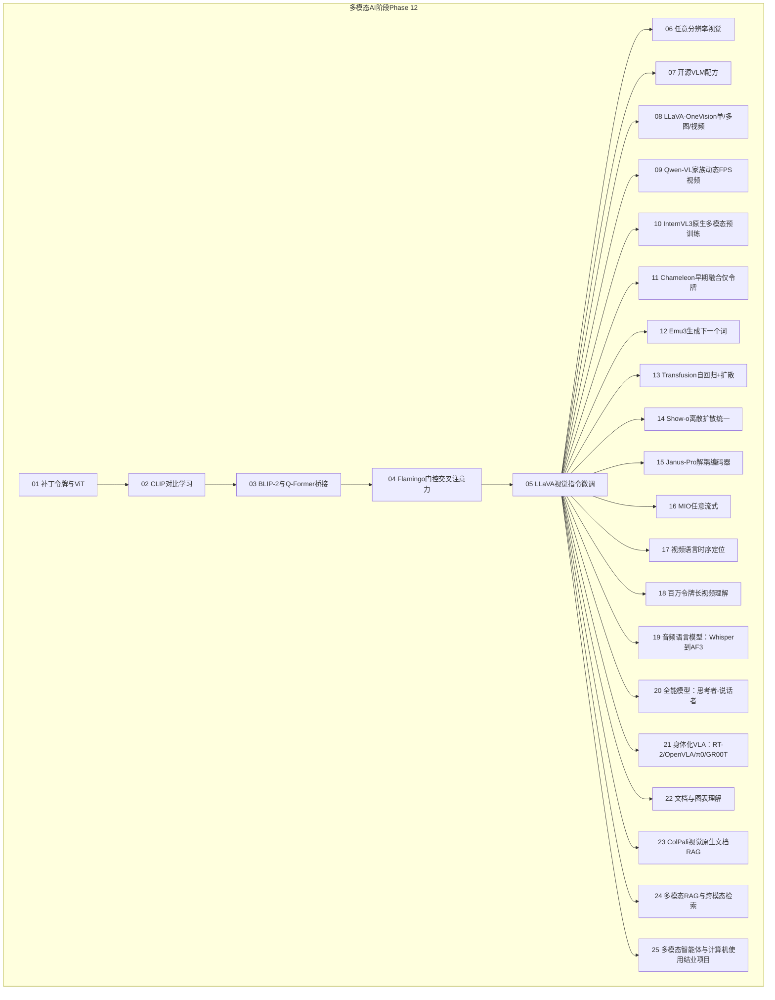
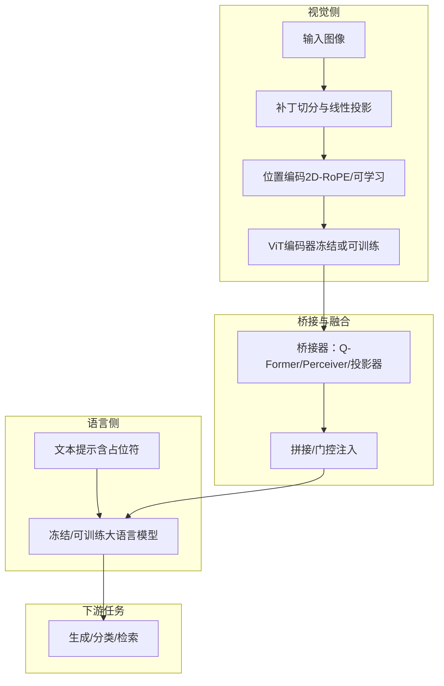
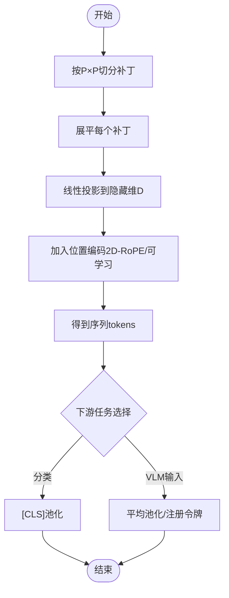
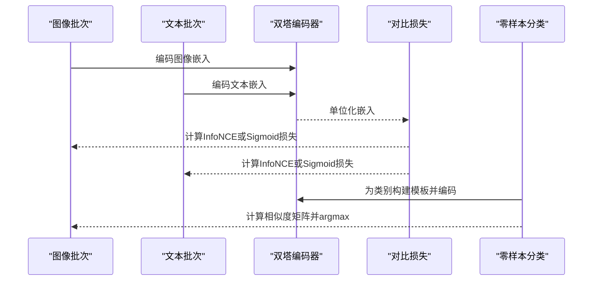
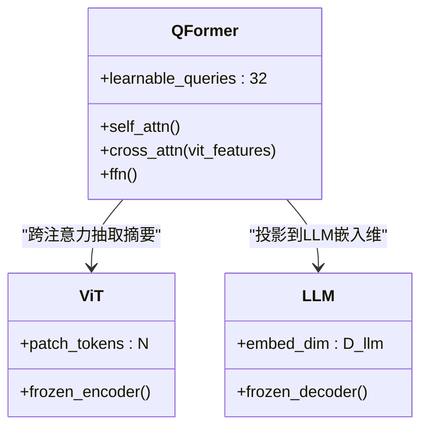
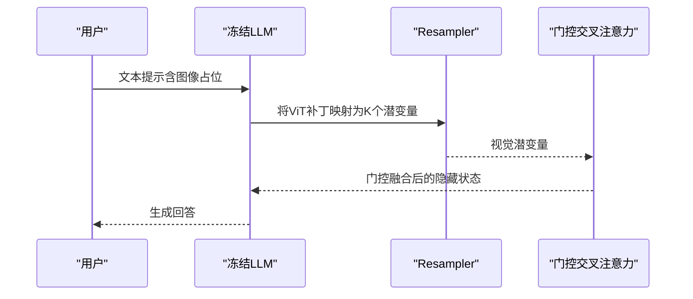
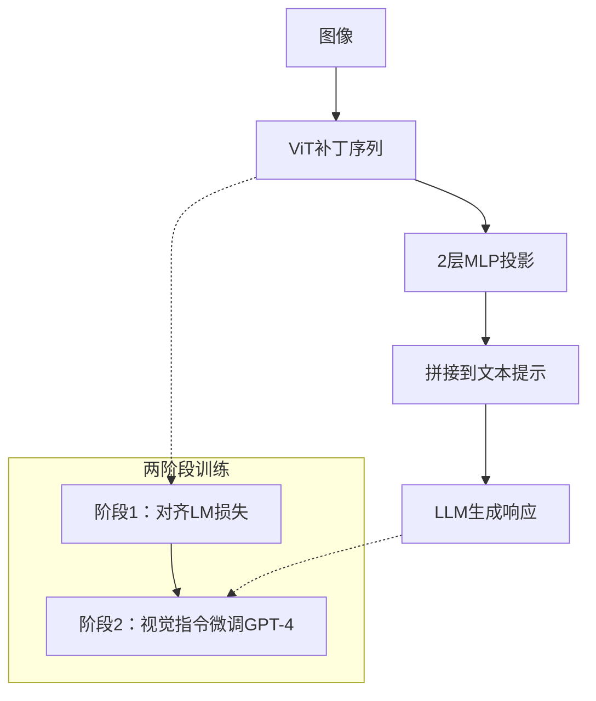
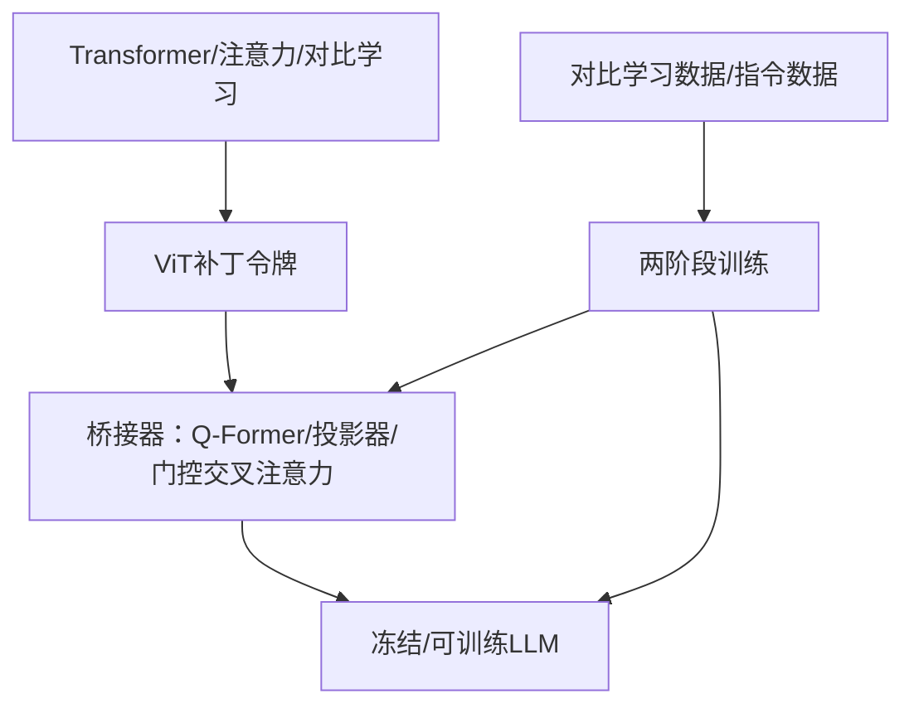

# 多模态AI

<cite>
**本文引用的文件**
- [README.md](file://README.md)
- [ROADMAP.md](file://ROADMAP.md)
- [01-vision-transformer-patch-tokens/docs/en.md](file://phases/12-multimodal-ai/01-vision-transformer-patch-tokens/docs/en.md)
- [02-clip-contrastive-pretraining/docs/en.md](file://phases/12-multimodal-ai/02-clip-contrastive-pretraining/docs/en.md)
- [03-blip2-qformer-bridge/docs/en.md](file://phases/12-multimodal-ai/03-blip2-qformer-bridge/docs/en.md)
- [04-flamingo-gated-cross-attention/docs/en.md](file://phases/12-multimodal-ai/04-flamingo-gated-cross-attention/docs/en.md)
- [05-llava-visual-instruction-tuning/docs/en.md](file://phases/12-multimodal-ai/05-llava-visual-instruction-tuning/docs/en.md)
</cite>

## 目录
1. [引言](#引言)
2. [项目结构](#项目结构)
3. [核心组件](#核心组件)
4. [架构总览](#架构总览)
5. [详细组件分析](#详细组件分析)
6. [依赖关系分析](#依赖关系分析)
7. [性能考量](#性能考量)
8. [故障排查指南](#故障排查指南)
9. [结论](#结论)
10. [附录](#附录)

## 引言
本课程面向“多模态AI”阶段，系统讲解从图像补丁令牌（ViT）到跨模态对齐（CLIP），再到视觉语言模型（VLM）的完整技术脉络。课程覆盖：
- 视觉语言模型（VLM）与多模态融合
- 跨模态理解与对比学习预训练
- ViT补丁令牌原语与位置编码
- CLIP对比学习与零样本泛化
- BLIP-2/Q-Former作为模态桥接器
- Flamingo的门控交叉注意力与交错输入
- LLaVA的视觉指令微调与投影器
- 任意分辨率视觉处理、视频理解、音频语言模型等前沿方向
- 多模态RAG、文档理解、计算机使用代理等实践案例
- Emu3、Janus-Pro等最新多模态模型的技术特点
- 多模态AI在构建通用人工智能中的关键作用与未来方向

## 项目结构
多模态AI课程位于第12阶段，包含25个子课，每个子课均提供英文讲义、可运行代码与可复用技能输出。课程以“先原理后实现”的方式组织，先建立ViT补丁令牌的数学与工程直觉，再逐步引入CLIP对齐、Q-Former桥接、Flamingo门控交叉注意力、LLaVA投影器与指令微调，最终扩展到视频、音频、文档理解、RAG与智能体。

图表来源
- [ROADMAP.md](file://ROADMAP.md)

章节来源
- [ROADMAP.md](file://ROADMAP.md)

## 核心组件
本阶段的核心知识由以下五大支柱构成：
- ViT补丁令牌原语：将图像切分为固定大小的补丁，线性投影到隐藏维，加入位置信息，形成序列供Transformer处理。
- 对比学习预训练（CLIP）：通过图像-文本匹配任务，在无标签数据上对齐视觉与语言嵌入空间。
- 模态桥接器（Q-Former）：以少量可学习查询向量跨注意力聚合冻结视觉特征，作为冻结大语言模型的输入。
- 门控交叉注意力（Flamingo）：在冻结大语言模型层间插入门控交叉注意力，实现交错输入与少样本泛化。
- 投影器（LLaVA）：直接将视觉补丁映射至语言模型嵌入维度，拼接到文本上下文中进行指令微调。

章节来源
- [01-vision-transformer-patch-tokens/docs/en.md](file://phases/12-multimodal-ai/01-vision-transformer-patch-tokens/docs/en.md)
- [02-clip-contrastive-pretraining/docs/en.md](file://phases/12-multimodal-ai/02-clip-contrastive-pretraining/docs/en.md)
- [03-blip2-qformer-bridge/docs/en.md](file://phases/12-multimodal-ai/03-blip2-qformer-bridge/docs/en.md)
- [04-flamingo-gated-cross-attention/docs/en.md](file://phases/12-multimodal-ai/04-flamingo-gated-cross-attention/docs/en.md)
- [05-llava-visual-instruction-tuning/docs/en.md](file://phases/12-multimodal-ai/05-llava-visual-instruction-tuning/docs/en.md)

## 架构总览
下图展示了从视觉编码到语言生成的端到端流程，以及不同VLM路线的关键差异点。

图表来源
- [01-vision-transformer-patch-tokens/docs/en.md](file://phases/12-multimodal-ai/01-vision-transformer-patch-tokens/docs/en.md)
- [02-clip-contrastive-pretraining/docs/en.md](file://phases/12-multimodal-ai/02-clip-contrastive-pretraining/docs/en.md)
- [03-blip2-qformer-bridge/docs/en.md](file://phases/12-multimodal-ai/03-blip2-qformer-bridge/docs/en.md)
- [04-flamingo-gated-cross-attention/docs/en.md](file://phases/12-multimodal-ai/04-flamingo-gated-cross-attention/docs/en.md)
- [05-llava-visual-instruction-tuning/docs/en.md](file://phases/12-multimodal-ai/05-llava-visual-instruction-tuning/docs/en.md)

## 详细组件分析

### 组件A：ViT补丁令牌原语
- 目标：将H×W×3图像转换为序列补丁令牌，并计算参数量与FLOPs。
- 关键点：
  - 补丁大小P决定网格尺寸(H/P × W/P)，序列长度近似为(H/P)×(W/P)+1([CLS])。
  - 线性投影等价于步幅为P的卷积；位置编码可采用2D-RoPE或可学习表。
  - 输出池化策略：CLS池化、平均池化、注册令牌（register tokens）。
  - 预训练范式：监督分类→对比学习（CLIP/SigLIP）→自监督（MAE/DINOv2）→自蒸馏。
- 实践建议：
  - 在选择ViT配置时，优先考虑分辨率与补丁大小的权衡，以满足OCR与密集任务需求。
  - 使用“补丁几何阅读器”技能快速估算参数与VRAM预算。

图表来源
- [01-vision-transformer-patch-tokens/docs/en.md](file://phases/12-multimodal-ai/01-vision-transformer-patch-tokens/docs/en.md)

章节来源
- [01-vision-transformer-patch-tokens/docs/en.md](file://phases/12-multimodal-ai/01-vision-transformer-patch-tokens/docs/en.md)

### 组件B：CLIP对比学习与零样本
- 目标：理解InfoNCE与sigmoid成对损失的数学推导，掌握零样本分类流程。
- 关键点：
  - 双塔编码器：图像编码器f与文本编码器g，输出单位向量。
  - InfoNCE：对行与列分别做softmax归一化，鼓励正样本对相似度最大化。
  - 温度参数τ控制分布锐度；CLIP初始τ≈0.07，SigLIP改用sigmoid并引入偏置b。
  - 零样本：构造类别模板（如“a photo of a {class}”），计算余弦相似度，取argmax。
- 实践建议：
  - 提示模板数量与多样性影响零样本精度；可结合多模板集成提升鲁棒性。
  - 分布式训练中，sigmoid损失避免全收集通信瓶颈，适合大规模批量。

图表来源
- [02-clip-contrastive-pretraining/docs/en.md](file://phases/12-multimodal-ai/02-clip-contrastive-pretraining/docs/en.md)

章节来源
- [02-clip-contrastive-pretraining/docs/en.md](file://phases/12-multimodal-ai/02-clip-contrastive-pretraining/docs/en.md)

### 组件C：BLIP-2与Q-Former桥接
- 目标：理解Q-Former如何以32个可学习查询向量跨注意力聚合冻结ViT特征，作为冻结LLM的输入。
- 关键点：
  - 查询向量Q在跨注意力中从ViT特征提取压缩表示；推理时仅输出32个视觉令牌。
  - 两阶段训练：表示学习（ITC/ITM/ITG）→生成学习（与冻结LLM联合LM损失）。
  - 参数经济：仅约188M参数训练，远小于端到端微调成本。
- 实践建议：
  - 当需要严格控制令牌预算或处理长视频/多图场景时，优先选择Q-Former。
  - 若追求每令牌质量与自然上下文扩展能力，可考虑LLaVA投影器方案。

图表来源
- [03-blip2-qformer-bridge/docs/en.md](file://phases/12-multimodal-ai/03-blip2-qformer-bridge/docs/en.md)

章节来源
- [03-blip2-qformer-bridge/docs/en.md](file://phases/12-multimodal-ai/03-blip2-qformer-bridge/docs/en.md)

### 组件D：Flamingo门控交叉注意力与交错输入
- 目标：理解在冻结LLM层间插入门控交叉注意力，实现交错图像-文本序列与少样本泛化。
- 关键点：
  - Perceiver Resampler：将可变数量的补丁映射为固定数量的视觉潜变量（如64个）。
  - 门控交叉注意力：tanh(α)按需混合视觉信息，初始化α=0保证文本能力不被破坏。
  - 交错掩码：文本token仅能看到其之前的图像，支持“最近图像”或“全部先前图像”两种策略。
- 实践建议：
  - 需要强少样本泛化与交错输入能力时，优先采用Flamingo风格的门控机制。
  - 参数规模较大，适合资源充足的场景。

图表来源
- [04-flamingo-gated-cross-attention/docs/en.md](file://phases/12-multimodal-ai/04-flamingo-gated-cross-attention/docs/en.md)

章节来源
- [04-flamingo-gated-cross-attention/docs/en.md](file://phases/12-multimodal-ai/04-flamingo-gated-cross-attention/docs/en.md)

### 组件E：LLaVA投影器与视觉指令微调
- 目标：理解LLaVA以简单2层MLP将ViT补丁映射至LLM嵌入维，并通过GPT-4生成的指令数据进行微调。
- 关键点：
  - 投影器：1024→4096→4096（GELU激活），直接将576个补丁投喂LLM。
  - 两阶段：阶段1对齐（LM损失，冻结ViT与LLM，仅训练投影器）→阶段2视觉指令微调（158k GPT-4生成对话）。
  - AnyRes：高分辨率图像分块拼接，显著提升OCR与图表理解。
- 实践建议：
  - LLaVA路线以“简单即高效”取胜，适合快速迭代与低成本部署。
  - 若需要更强的令牌预算控制，可结合Q-Former或注册令牌策略。

图表来源
- [05-llava-visual-instruction-tuning/docs/en.md](file://phases/12-multimodal-ai/05-llava-visual-instruction-tuning/docs/en.md)

章节来源
- [05-llava-visual-instruction-tuning/docs/en.md](file://phases/12-multimodal-ai/05-llava-visual-instruction-tuning/docs/en.md)

### 概念总览
- 多模态融合的两条主线：
  - 低令牌预算：Q-Former/Perceiver Resampler，适合长视频与多图场景。
  - 高质量每令牌：LLaVA投影器，适合自然上下文扩展与复杂推理。
- 预训练范式演进：
  - 从监督分类到对比学习（CLIP/SigLIP），再到自监督（MAE/DINOv2）与自蒸馏（DINOv2），奠定现代VLM基础。
- 应用拓展：
  - 视频理解（时序定位、百万令牌长视频）、音频语言模型（Whisper到AF3）、文档理解（图表理解、ColPali视觉原生RAG）、多模态RAG与智能体（计算机使用代理）。

## 依赖关系分析
- 数学与工程基础：Transformer、注意力、位置编码、对比学习。
- 视觉侧：ViT补丁令牌→位置编码→视觉编码器（冻结/可训练）。
- 语言侧：冻结LLM或可训练LLM，嵌入维度需与视觉投影一致。
- 桥接器：Q-Former（32查询）或投影器（576补丁）或门控交叉注意力（Perceiver Resampler）。
- 数据与训练：对比学习（CLIP/SigLIP）→两阶段（对齐+指令微调）→大规模指令数据（GPT-4生成）。

图表来源
- [01-vision-transformer-patch-tokens/docs/en.md](file://phases/12-multimodal-ai/01-vision-transformer-patch-tokens/docs/en.md)
- [02-clip-contrastive-pretraining/docs/en.md](file://phases/12-multimodal-ai/02-clip-contrastive-pretraining/docs/en.md)
- [03-blip2-qformer-bridge/docs/en.md](file://phases/12-multimodal-ai/03-blip2-qformer-bridge/docs/en.md)
- [04-flamingo-gated-cross-attention/docs/en.md](file://phases/12-multimodal-ai/04-flamingo-gated-cross-attention/docs/en.md)
- [05-llava-visual-instruction-tuning/docs/en.md](file://phases/12-multimodal-ai/05-llava-visual-instruction-tuning/docs/en.md)

章节来源
- [01-vision-transformer-patch-tokens/docs/en.md](file://phases/12-multimodal-ai/01-vision-transformer-patch-tokens/docs/en.md)
- [02-clip-contrastive-pretraining/docs/en.md](file://phases/12-multimodal-ai/02-clip-contrastive-pretraining/docs/en.md)
- [03-blip2-qformer-bridge/docs/en.md](file://phases/12-multimodal-ai/03-blip2-qformer-bridge/docs/en.md)
- [04-flamingo-gated-cross-attention/docs/en.md](file://phases/12-multimodal-ai/04-flamingo-gated-cross-attention/docs/en.md)
- [05-llava-visual-instruction-tuning/docs/en.md](file://phases/12-multimodal-ai/05-llava-visual-instruction-tuning/docs/en.md)

## 性能考量
- 计算与内存：
  - ViT序列长度与分辨率呈二次增长，FLOPs随分辨率平方增长；补丁越细，令牌越多，速度越慢但细节更好。
  - Q-Former将576→32，显著降低令牌预算；投影器则保持更高令牌密度。
- 分布式与通信：
  - InfoNCE softmax需要全收集通信，限制了大规模分布式；sigmoid成对损失避免全收集，更适合超大规模批量。
- 训练效率：
  - Q-Former两阶段训练（表示→生成）；LLaVA仅阶段2（LM损失）即可快速上线。
- 上下游适配：
  - 注册令牌（registers）吸收高范数注意力伪影，改善稠密预测任务（分割、深度估计）。
  - 2D-RoPE无需位置表，支持任意分辨率与纵横比（NaFlex）。

## 故障排查指南
- 零样本效果差
  - 检查提示模板是否合理且多样化；确认温度参数与偏置设置是否合适。
  - 参考课程关于CLIP/SigLIP的零样本实现与评估流程。
- 令牌爆炸导致上下文不足
  - 使用Q-Former压缩令牌；或采用AnyRes分块策略；或减少分辨率/补丁大小。
  - 结合“补丁几何阅读器”技能估算令牌预算与VRAM占用。
- 门控交叉注意力导致文本能力退化
  - 检查门控系数α的初始化与调度；确保α从0开始缓慢打开，避免过早覆盖LLM文本表征。
- 投影器对齐失败
  - 确认阶段1已充分收敛；检查投影器维度与LLM嵌入维度一致；确保冻结策略正确。
- 多图/视频输入交错错误
  - 检查交错注意力掩码是否仅允许看到之前图像；验证Resampler输出固定长度以适配LLM。

章节来源
- [02-clip-contrastive-pretraining/docs/en.md](file://phases/12-multimodal-ai/02-clip-contrastive-pretraining/docs/en.md)
- [03-blip2-qformer-bridge/docs/en.md](file://phases/12-multimodal-ai/03-blip2-qformer-bridge/docs/en.md)
- [04-flamingo-gated-cross-attention/docs/en.md](file://phases/12-multimodal-ai/04-flamingo-gated-cross-attention/docs/en.md)
- [05-llava-visual-instruction-tuning/docs/en.md](file://phases/12-multimodal-ai/05-llava-visual-instruction-tuning/docs/en.md)

## 结论
多模态AI的核心在于“如何让语言模型理解视觉世界”。本课程以ViT补丁令牌为起点，系统梳理了CLIP对齐、Q-Former桥接、Flamingo门控交叉注意力与LLaVA投影器四条主流路径，并延展到视频、音频、文档理解、RAG与智能体等前沿应用。随着模型规模与上下文窗口的增长，令牌预算不再是唯一约束，而“质量每令牌”与“自然上下文扩展”成为新的竞争焦点。Emu3、Janus-Pro等新模型继续探索解耦编码器、生成与扩散的融合，为构建通用人工智能提供了坚实基础。

## 附录
- 术语速查
  - 补丁令牌：将图像切分为P×P像素块，线性投影为向量序列。
  - 对比学习：通过图像-文本匹配对齐嵌入空间。
  - Q-Former：32个可学习查询向量跨注意力聚合视觉特征。
  - 门控交叉注意力：在冻结LLM层间插入，tanh(α)按需融合视觉信息。
  - 投影器：将ViT补丁映射至LLM嵌入维，拼接到文本上下文。
  - 注册令牌：吸收注意力伪影，改善稠密预测任务。
  - 2D-RoPE：基于坐标旋转的位置编码，支持任意分辨率。
  - NaFlex：SigLIP 2特性，单模型支持多种纵横比与分辨率。
- 进一步阅读
  - Dosovitskiy等：原始ViT论文。
  - He等：MAE自监督预训练。
  - Oquab等：DINOv2自蒸馏。
  - Darcet等：ViT注册令牌与伪影分析。
  - Tschannen等：SigLIP 2多语言与NaFlex。
  - Zhai等：ViT缩放定律。
  - Radford等：CLIP对比学习。
  - Zhai等：SigLIP Sigmoid损失。
  - Li等：BLIP-2两阶段训练与Q-Former。
  - Alayrac等：Flamingo门控交叉注意力与交错输入。
  - Liu等：LLaVA视觉指令微调与投影器。