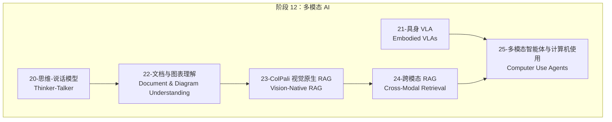
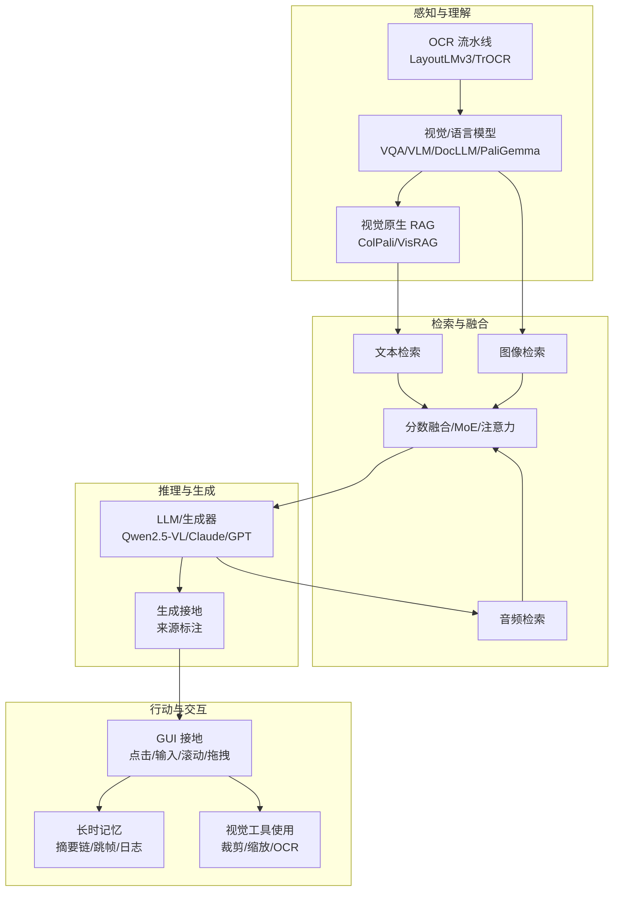
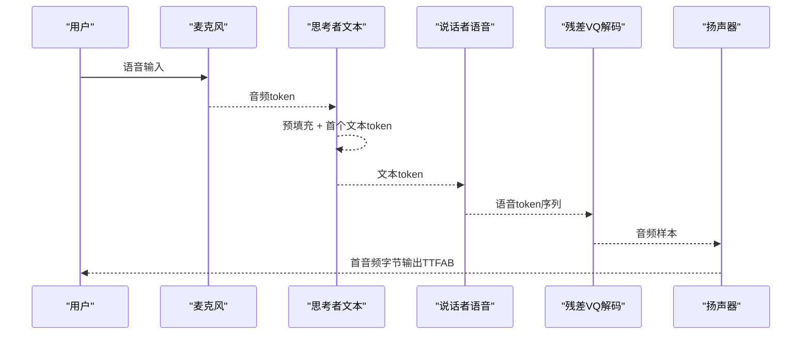
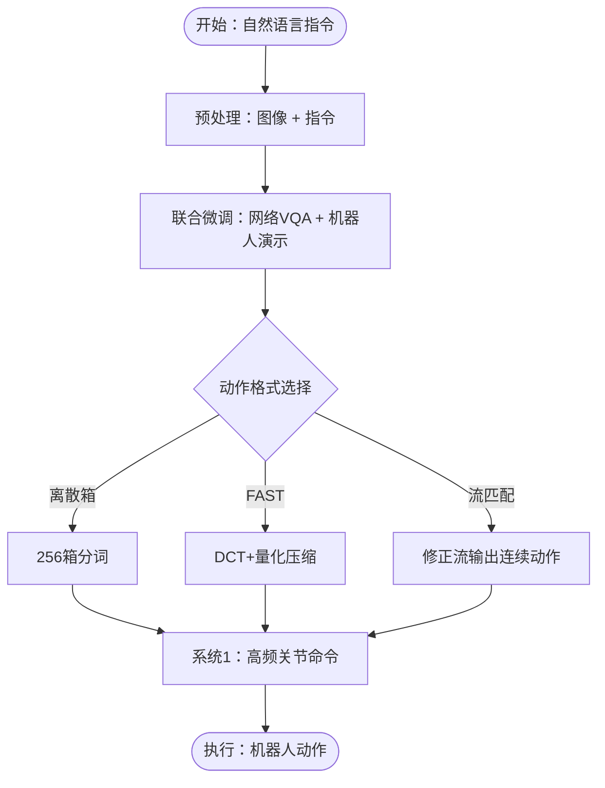
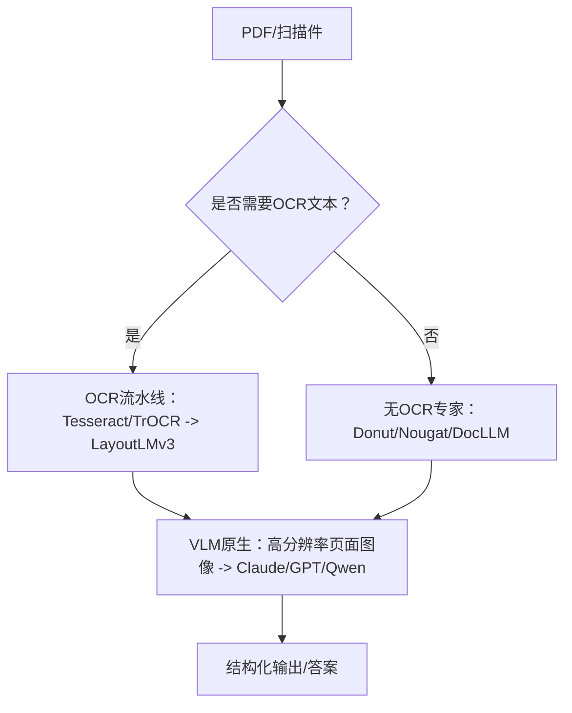
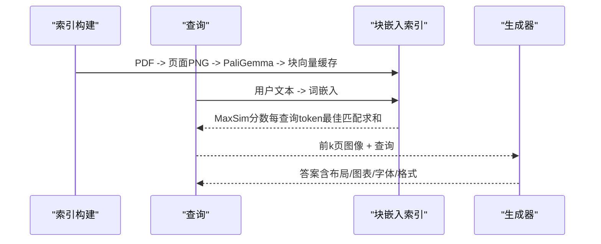
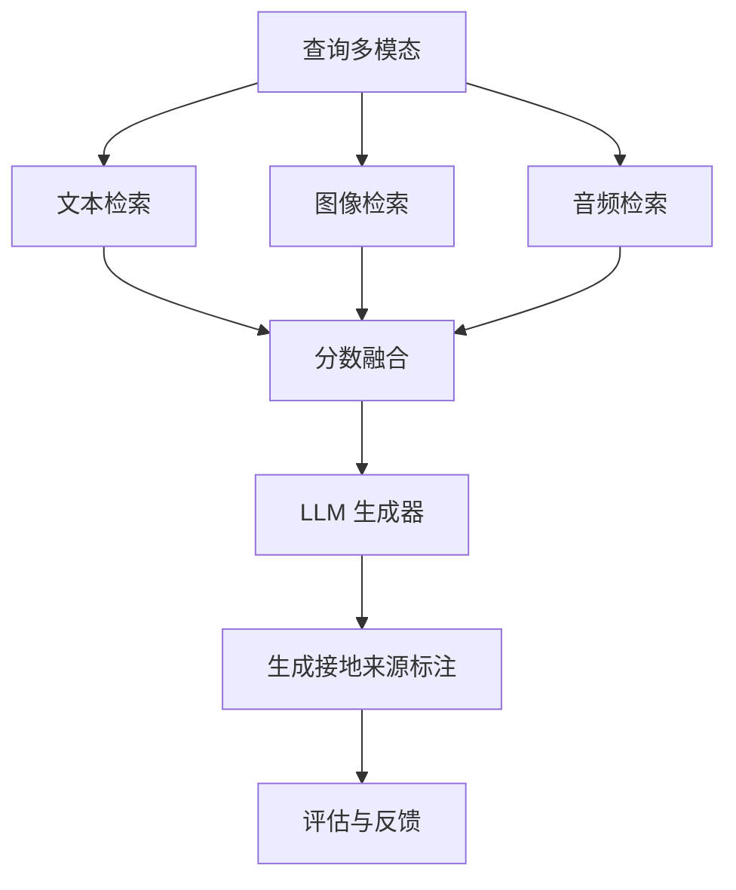
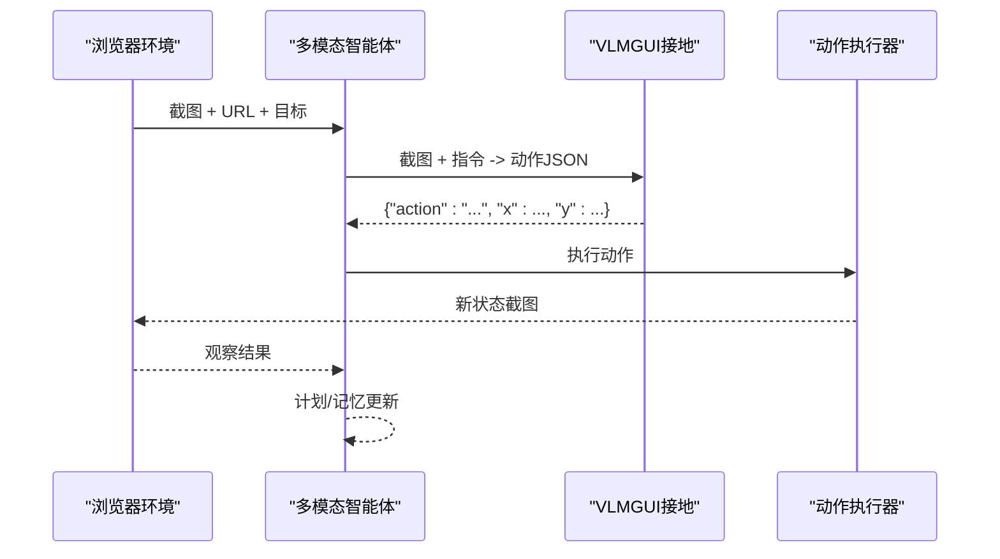
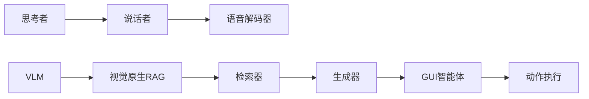

# 多模态应用实践

<cite>
**本文引用的文件**
- [思维-说话模型（Omni Models）文档](file://phases/12-multimodal-ai/20-omni-models-thinker-talker/docs/zh.md)
- [具身视觉语言模型（Embodied VLAs）文档](file://phases/12-multimodal-ai/21-embodied-vlas-openvla-pi0-groot/docs/zh.md)
- [文档与图表理解文档](file://phases/12-multimodal-ai/22-document-diagram-understanding/docs/zh.md)
- [ColPali 视觉原生 RAG 文档](file://phases/12-multimodal-ai/23-colpali-vision-native-rag/docs/zh.md)
- [跨模态 RAG 与多模态检索文档](file://phases/12-multimodal-ai/24-multimodal-rag-cross-modal/docs/zh.md)
- [多模态智能体与计算机使用文档](file://phases/12-multimodal-ai/25-multimodal-agents-computer-use/docs/zh.md)
- [思维-说话模型（Omni Models）代码](file://phases/12-multimodal-ai/20-omni-models-thinker-talker/code/main.py)
- [具身视觉语言模型（Embodied VLAs）代码](file://phases/12-multimodal-ai/21-embodied-vlas-openvla-pi0-groot/code/main.py)
- [ColPali 视觉原生 RAG 代码](file://phases/12-multimodal-ai/23-colpali-vision-native-rag/code/main.py)
- [文档与图表理解代码](file://phases/12-multimodal-ai/22-document-diagram-understanding/code/main.py)
- [跨模态 RAG 与多模态检索代码](file://phases/12-multimodal-ai/24-multimodal-rag-cross-modal/code/main.py)
- [RAG 综合测试示例](file://test_rag.py)
- [阶段 12 多模态 AI 总览](file://phases/12-multimodal-ai/README.md)
- [2026 年多模态文档问答测验](file://phases/19-capstone-projects/04-multimodal-document-qa/quiz.json)
- [2026 年多模态文档问答测验（中文）](file://phases/19-capstone-projects/04-multimodal-document-qa/quiz.zh.json)
</cite>

## 目录
1. [引言](#引言)
2. [项目结构](#项目结构)
3. [核心组件](#核心组件)
4. [架构总览](#架构总览)
5. [详细组件分析](#详细组件分析)
6. [依赖关系分析](#依赖关系分析)
7. [性能考量](#性能考量)
8. [故障排查指南](#故障排查指南)
9. [结论](#结论)
10. [附录](#附录)

## 引言
本课程围绕“多模态应用实践”展开，系统讲解从感知到推理再到行动的统一框架。重点包括：
- 思维-说话模型（Omni Models）：思考者与说话者分离、TMRoPE 时间对齐、流式语音合成与实时延迟预算。
- 具身视觉语言模型（Embodied VLAs）：动作分词（离散箱、FAST、流匹配）、联合微调、系统 1/系统 2 控制。
- 文档与图表理解：OCR 流水线、无 OCR 专家、VLM 原生三阶段演进与端到端流程。
- ColPali 视觉原生 RAG：后期交互（Late Interaction）与 MaxSim、块嵌入索引与存储权衡。
- 跨模态 RAG：文本-图像-音频-视频的跨模态检索、分数融合、生成接地与智能体多跳。
- 多模态智能体与计算机使用：GUI 接地、动作模式、混合智能体、长时记忆与基准评估。

## 项目结构
多模态 AI 课程以“阶段 12”为主线，围绕六大主题模块组织教学与实践，配套代码与作业，形成从理论到工程的闭环。

**图表来源**
- [阶段 12 多模态 AI 总览:1-6](file://phases/12-multimodal-ai/README.md#L1-L6)

**章节来源**
- [阶段 12 多模态 AI 总览:1-6](file://phases/12-multimodal-ai/README.md#L1-L6)

## 核心组件
- 思维-说话模型（Omni Models）
  - 思考者：文本生成 Transformer，消费交错的文本/图像/音频 token，输出要说什么的文本 token。
  - 说话者：小型语音生成 Transformer，消费思考者文本输出与最近语音上下文，输出离散语音 token。
  - TMRoPE：跨视觉、音频、文本的绝对时间戳位置编码，确保注意力对齐。
  - 流式语音合成：思考者与说话者交错输出，消除批处理边界。
- 具身视觉语言模型（Embodied VLAs）
  - 动作分词：离散箱（RT-2/OpenVLA）、FAST（DCT+量化）、流匹配（Pi0）。
  - 联合微调：网络 VQA 数据 + 机器人演示，保留通用知识迁移。
  - 系统 1/系统 2：慢速规划 + 快速执行，映射快思考/慢思考。
- 文档与图表理解
  - 三阶段演进：OCR 流水线 → 无 OCR 专家 → VLM 原生。
  - 布局感知（LayoutLMv3）、无 OCR（Donut/Nougat/DocLLM）、VLM 原生（Claude/GPT/Qwen）。
- ColPali 视觉原生 RAG
  - 后期交互（Late Interaction）：每页面块嵌入，查询词嵌入上的 MaxSim。
  - 存储与成本：块向量数量级增长，可通过 PQ/OPQ 压缩。
- 跨模态 RAG
  - 检索头：共享嵌入空间（CLIP/SigLIP/CLAP）、翻译模块、VLM 隐藏状态。
  - 融合策略：分数融合、MoE 融合、注意力融合。
  - 生成接地：文本/图像/音频来源标注。
- 多模态智能体与计算机使用
  - GUI 接地：点击坐标、输入文本、滚动、拖拽等动作模式。
  - 混合智能体：截图 + 无障碍树；长时记忆压缩策略；视觉工具使用（裁剪/缩放/OCR）。

**章节来源**
- [思维-说话模型（Omni Models）文档:32-75](file://phases/12-multimodal-ai/20-omni-models-thinker-talker/docs/zh.md#L32-L75)
- [具身视觉语言模型（Embodied VLAs）文档:30-97](file://phases/12-multimodal-ai/21-embodied-vlas-openvla-pi0-groot/docs/zh.md#L30-L97)
- [文档与图表理解文档:32-129](file://phases/12-multimodal-ai/22-document-diagram-understanding/docs/zh.md#L32-L129)
- [ColPali 视觉原生 RAG 文档:35-109](file://phases/12-multimodal-ai/23-colpali-vision-native-rag/docs/zh.md#L35-L109)
- [跨模态 RAG 与多模态检索文档:30-113](file://phases/12-multimodal-ai/24-multimodal-rag-cross-modal/docs/zh.md#L30-L113)
- [多模态智能体与计算机使用文档:34-122](file://phases/12-multimodal-ai/25-multimodal-agents-computer-use/docs/zh.md#L34-L122)

## 架构总览
下面给出多模态应用实践的整体架构，展示从感知、检索到生成与行动的端到端流程。

**图表来源**
- [文档与图表理解文档:79-129](file://phases/12-multimodal-ai/22-document-diagram-understanding/docs/zh.md#L79-L129)
- [ColPali 视觉原生 RAG 文档:84-93](file://phases/12-multimodal-ai/23-colpali-vision-native-rag/docs/zh.md#L84-L93)
- [跨模态 RAG 与多模态检索文档:78-113](file://phases/12-multimodal-ai/24-multimodal-rag-cross-modal/docs/zh.md#L78-L113)
- [多模态智能体与计算机使用文档:112-122](file://phases/12-multimodal-ai/25-multimodal-agents-computer-use/docs/zh.md#L112-L122)

## 详细组件分析

### 组件 A：思维-说话模型（Omni Models）
- 分离设计：思考者负责跨模态推理（文本/图像/音频），说话者负责语音 token 生成，二者并行流式工作。
- TMRoPE：为每个 token 分配绝对时间戳，RoPE 按时间旋转注意力，使视觉、音频、文本在时间轴上对齐。
- 流式语音合成：思考者与说话者交错输出，避免批处理边界，降低端到端延迟。
- 实时延迟预算：麦克风到首音频字节输出（TTFAB）需控制在 500ms 以内，前沿可达 250ms 级别。

**图表来源**
- [思维-说话模型（Omni Models）文档:76-95](file://phases/12-multimodal-ai/20-omni-models-thinker-talker/docs/zh.md#L76-L95)

**章节来源**
- [思维-说话模型（Omni Models）文档:32-95](file://phases/12-multimodal-ai/20-omni-models-thinker-talker/docs/zh.md#L32-L95)
- [思维-说话模型（Omni Models）代码:26-67](file://phases/12-multimodal-ai/20-omni-models-thinker-talker/code/main.py#L26-L67)

### 组件 B：具身视觉语言模型（Embodied VLAs）
- 动作分词演进：离散箱（RT-2/OpenVLA）、FAST（DCT+量化）、流匹配（Pi0）。
- 联合微调：网络 VQA 数据与机器人演示混合训练，保留通用知识迁移。
- 系统 1/系统 2：系统 2 以低频产生高层子目标，系统 1 以高频产生关节命令，实现规划与执行分离。

**图表来源**
- [具身视觉语言模型（Embodied VLAs）文档:90-108](file://phases/12-multimodal-ai/21-embodied-vlas-openvla-pi0-groot/docs/zh.md#L90-L108)

**章节来源**
- [具身视觉语言模型（Embodied VLAs）文档:30-108](file://phases/12-multimodal-ai/21-embodied-vlas-openvla-pi0-groot/docs/zh.md#L30-L108)
- [具身视觉语言模型（Embodied VLAs）代码:15-80](file://phases/12-multimodal-ai/21-embodied-vlas-openvla-pi0-groot/code/main.py#L15-L80)

### 组件 C：文档与图表理解
- 三阶段演进：OCR 流水线（Tesseract/TrOCR/LayoutLMv3）→ 无 OCR（Donut/Nougat/DocLLM）→ VLM 原生（Claude/GPT/Qwen）。
- VLM 原生优势：在复杂表格、嵌入文本的数学方程、带注释的图形上显著优于 OCR 流水线。
- Token 预算：不同栈的输入 token 数量差异巨大，VLM 原生在前沿分辨率下 token 数更多，但准确性更高。

**图表来源**
- [文档与图表理解文档:79-129](file://phases/12-multimodal-ai/22-document-diagram-understanding/docs/zh.md#L79-L129)

**章节来源**
- [文档与图表理解文档:32-129](file://phases/12-multimodal-ai/22-document-diagram-understanding/docs/zh.md#L32-L129)
- [文档与图表理解代码:65-94](file://phases/12-multimodal-ai/22-document-diagram-understanding/code/main.py#L65-L94)

### 组件 D：ColPali 视觉原生 RAG
- 后期交互（Late Interaction）：每页面嵌入为块向量集合，查询词嵌入在块上执行 MaxSim，跨查询求和。
- 端到端流程：页面图像嵌入（块向量）→ 查询词嵌入 → MaxSim → 前 k 页 → 生成器（Qwen2.5-VL/Claude）。
- 存储与成本：块向量数量级增长，可通过 PQ/OPQ 压缩，仍显著高于文本 RAG。

**图表来源**
- [ColPali 视觉原生 RAG 文档:84-93](file://phases/12-multimodal-ai/23-colpali-vision-native-rag/docs/zh.md#L84-L93)

**章节来源**
- [ColPali 视觉原生 RAG 文档:35-109](file://phases/12-multimodal-ai/23-colpali-vision-native-rag/docs/zh.md#L35-L109)
- [ColPali 视觉原生 RAG 代码:35-74](file://phases/12-multimodal-ai/23-colpali-vision-native-rag/code/main.py#L35-L74)

### 组件 E：跨模态 RAG 与多模态检索
- 跨模态检索：共享嵌入空间（CLIP/SigLIP/CLAP）、翻译模块、VLM 隐藏状态。
- 融合策略：分数融合（默认）、MoE 融合、注意力融合。
- 生成接地：文本来源标注、图像来源标注、音频来源标注（含时间戳）。
- 智能体多跳：低置信度时重新表述查询并再次检索，提升复杂查询的准确率。

**图表来源**
- [跨模态 RAG 与多模态检索文档:78-113](file://phases/12-multimodal-ai/24-multimodal-rag-cross-modal/docs/zh.md#L78-L113)

**章节来源**
- [跨模态 RAG 与多模态检索文档:30-113](file://phases/12-multimodal-ai/24-multimodal-rag-cross-modal/docs/zh.md#L30-L113)
- [跨模态 RAG 与多模态检索代码:36-117](file://phases/12-multimodal-ai/24-multimodal-rag-cross-modal/code/main.py#L36-L117)

### 组件 F：多模态智能体与计算机使用
- GUI 接地：将截图与自然语言指令映射为可解析的 JSON 动作（点击、输入、滚动、拖拽等）。
- 混合智能体：截图 + 无障碍树，树提供可靠定位，截图提供语义上下文。
- 长时记忆：摘要链、跳帧、日志记录，缓解上下文窗口压力。
- 基准评估：ScreenSpot-Pro、VisualWebArena、AgentVista 等。

**图表来源**
- [多模态智能体与计算机使用文档:112-122](file://phases/12-multimodal-ai/25-multimodal-agents-computer-use/docs/zh.md#L112-L122)

**章节来源**
- [多模态智能体与计算机使用文档:34-122](file://phases/12-multimodal-ai/25-multimodal-agents-computer-use/docs/zh.md#L34-L122)
- [多模态智能体与计算机使用代码](file://phases/12-multimodal-ai/25-multimodal-agents-computer-use/code/main.py)

## 依赖关系分析
- 模块耦合
  - 思维-说话模型与语音解码器耦合紧密，需严格流式与延迟预算控制。
  - 具身 VLA 与机器人控制环路耦合，动作分词与控制频率（30 Hz）密切相关。
  - 文档理解与 RAG 紧密耦合，视觉原生 RAG 依赖 VLM 编码器与 MaxSim 评分。
  - 跨模态 RAG 依赖多检索头与融合策略，生成器需具备“生成接地”能力。
  - 智能体与浏览器自动化耦合，动作模式与错误恢复机制需稳定。
- 外部依赖
  - VLM（Qwen2.5-VL、Claude、GPT）作为统一感知与生成器。
  - 向量库与检索系统（ColBERT MaxSim、PQ/OPQ 压缩）。
  - 浏览器自动化（Selenium/无障碍树）与截图采集。

**图表来源**
- [思维-说话模型（Omni Models）文档:42-47](file://phases/12-multimodal-ai/20-omni-models-thinker-talker/docs/zh.md#L42-L47)
- [ColPali 视觉原生 RAG 文档:84-93](file://phases/12-multimodal-ai/23-colpali-vision-native-rag/docs/zh.md#L84-L93)
- [多模态智能体与计算机使用文档:112-122](file://phases/12-multimodal-ai/25-multimodal-agents-computer-use/docs/zh.md#L112-L122)

**章节来源**
- [思维-说话模型（Omni Models）文档:42-47](file://phases/12-multimodal-ai/20-omni-models-thinker-talker/docs/zh.md#L42-L47)
- [具身视觉语言模型（Embodied VLAs）文档:69-78](file://phases/12-multimodal-ai/21-embodied-vlas-openvla-pi0-groot/docs/zh.md#L69-L78)
- [跨模态 RAG 与多模态检索文档:30-53](file://phases/12-multimodal-ai/24-multimodal-rag-cross-modal/docs/zh.md#L30-L53)

## 性能考量
- 思维-说话模型
  - TTFAB 预算：麦克风到首音频字节输出需控制在 500ms 以内；前沿可达 250ms 级别。
  - 吞吐量预算：说话者需 ≥50 tok/s 才能跟上 16kHz 语音的基础层 token 速率。
- 具身 VLA
  - 控制频率：30 Hz 控制循环，动作分词与解码速度直接影响实时性。
  - FAST 与流匹配：显著减少 token 数量，提升推理速度，保留动作平滑性。
- 文档与图表理解
  - Token 预算：VLM 原生在前沿分辨率下 token 数更多，但准确性更高。
  - OCR 流水线：在大规模纯扫描工作负载下更具成本效益。
- ColPali 视觉原生 RAG
  - 存储成本：块向量数量级增长，需 PQ/OPQ 压缩；每页约数百 KB 到数 MB。
  - 召回率：MaxSim 优于双编码器单向量检索，尤其在视觉丰富文档上。
- 跨模态 RAG
  - 融合策略：默认分数融合，MoE 融合在特定领域可带来收益。
  - 评估指标：Recall@k、融合后 top-k 准确率、人工评测与任务特定指标。
- 智能体与计算机使用
  - 基准：ScreenSpot-Pro、VisualWebArena、AgentVista；前沿模型在困难任务上仍有较大提升空间。

**章节来源**
- [思维-说话模型（Omni Models）文档:76-95](file://phases/12-multimodal-ai/20-omni-models-thinker-talker/docs/zh.md#L76-L95)
- [具身视觉语言模型（Embodied VLAs）文档:51-68](file://phases/12-multimodal-ai/21-embodied-vlas-openvla-pi0-groot/docs/zh.md#L51-L68)
- [文档与图表理解文档:121-129](file://phases/12-multimodal-ai/22-document-diagram-understanding/docs/zh.md#L121-L129)
- [ColPali 视觉原生 RAG 文档:94-109](file://phases/12-multimodal-ai/23-colpali-vision-native-rag/docs/zh.md#L94-L109)
- [跨模态 RAG 与多模态检索文档:103-113](file://phases/12-multimodal-ai/24-multimodal-rag-cross-modal/docs/zh.md#L103-L113)
- [多模态智能体与计算机使用文档:94-111](file://phases/12-multimodal-ai/25-multimodal-agents-computer-use/docs/zh.md#L94-L111)

## 故障排查指南
- 思维-说话模型
  - TTFAB 超时：检查麦克风到音频 token、预填充、首文本 token、说话者首语音 token、残差 VQ 解码与波形解码各环节延迟。
  - 全双工失败：确认训练数据包含副声道回应与打断场景。
- 具身 VLA
  - 动作解码慢：优先采用 FAST 或流匹配；离散箱分词在 30 Hz 下 token 速率不足。
  - 安全问题：硬关节限制、速度限制、工作空间边界与人机协同审批。
- 文档与图表理解
  - OCR 流水线幻觉：OCR 丢失布局与图形，建议引入 VLM 验证器进行交叉检查。
  - VLM 原生在手写场景表现不佳：可采用混合方案（OCR + VLM）。
- ColPali 视觉原生 RAG
  - 存储压力：启用 PQ/OPQ 压缩；在大规模语料库中评估延迟预算与检索质量。
  - 召回不足：调整 MaxSim 阈值或引入重排器。
- 跨模态 RAG
  - 融合效果差：尝试 MoE 融合；针对主导模态适度加权。
  - 生成不接地：训练目标中加入来源索引，推理时自然输出引用。
- 智能体与计算机使用
  - 细粒度定位失败：提升分辨率或采用混合智能体（截图 + 无障碍树）。
  - 长时规划偏差：引入显式重新规划与多模态验证（动作成功截图匹配）。

**章节来源**
- [思维-说话模型（Omni Models）文档:108-119](file://phases/12-multimodal-ai/20-omni-models-thinker-talker/docs/zh.md#L108-L119)
- [具身视觉语言模型（Embodied VLAs）文档:98-108](file://phases/12-multimodal-ai/21-embodied-vlas-openvla-pi0-groot/docs/zh.md#L98-L108)
- [文档与图表理解文档:117-129](file://phases/12-multimodal-ai/22-document-diagram-understanding/docs/zh.md#L117-L129)
- [ColPali 视觉原生 RAG 文档:103-113](file://phases/12-multimodal-ai/23-colpali-vision-native-rag/docs/zh.md#L103-L113)
- [跨模态 RAG 与多模态检索文档:114-138](file://phases/12-multimodal-ai/24-multimodal-rag-cross-modal/docs/zh.md#L114-L138)
- [多模态智能体与计算机使用文档:101-111](file://phases/12-multimodal-ai/25-multimodal-agents-computer-use/docs/zh.md#L101-L111)

## 结论
本课程通过“思维-说话模型、具身视觉语言模型、文档与图表理解、视觉原生 RAG、跨模态 RAG、多模态智能体与计算机使用”六个维度，构建了从感知到推理再到行动的统一多模态应用框架。实践中应重视实时延迟预算、动作解码效率、视觉原生检索的质量与成本权衡、跨模态检索的融合策略与生成接地、以及智能体的长时记忆与错误恢复。随着前沿模型在分辨率与规模上的持续提升，多模态应用在复杂文档理解、机器人控制与 GUI 自动化等领域展现出巨大潜力。

## 附录
- 实践案例与部署建议
  - 文档问答：优先采用视觉原生 RAG（ColPali/ColQwen2），在财务报告、科学论文、法律合同等视觉丰富文档上显著提升准确率。
  - 机器人控制：在高频控制场景采用 FAST 或流匹配动作分词；在通用场景采用联合微调的 OpenVLA。
  - 语音助手：采用思考者-说话者分离与 TMRoPE 时间对齐，严格控制 TTFAB 预算，支持半双工/全双工模式。
  - GUI 自动化：采用混合智能体（截图 + 无障碍树），设计动作模式 JSON，结合长时记忆与错误恢复钩子。
- 测验与练习
  - 2026 年多模态文档问答测验（英文/中文）涵盖视觉优先 Late Interaction、ColPali MaxSim、存储成本等问题，可用于检验学习成果。

**章节来源**
- [2026 年多模态文档问答测验:1-33](file://phases/19-capstone-projects/04-multimodal-document-qa/quiz.json#L1-L33)
- [2026 年多模态文档问答测验（中文）:1-35](file://phases/19-capstone-projects/04-multimodal-document-qa/quiz.zh.json#L1-L35)