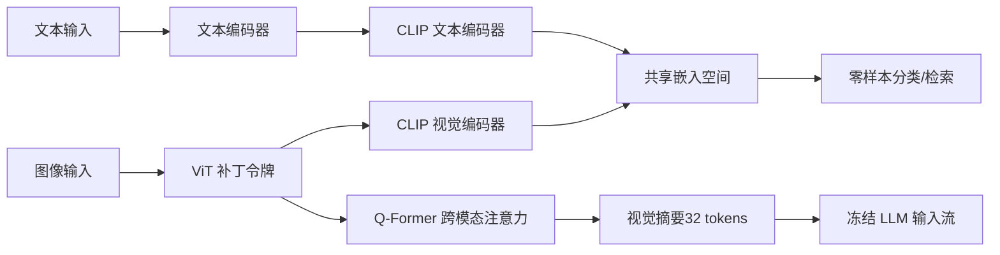
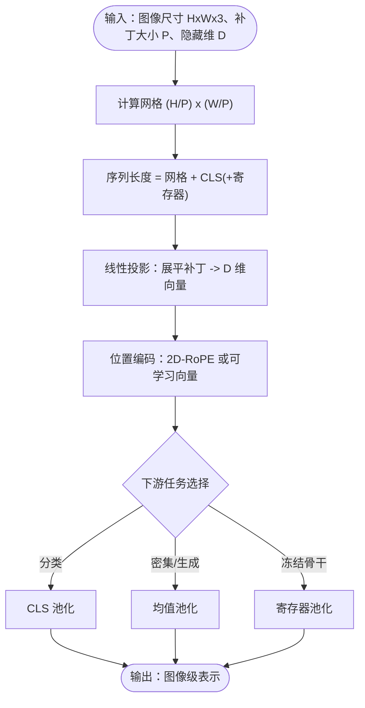
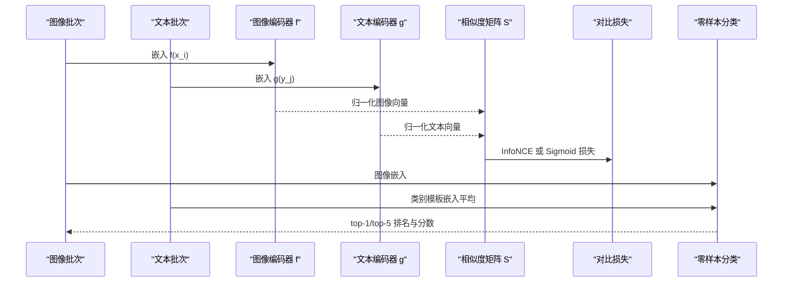
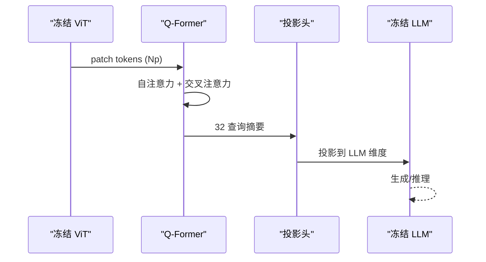
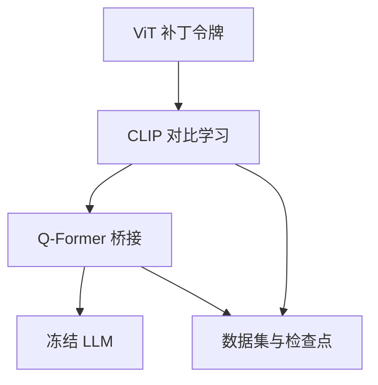

# 视觉语言基础

<cite>
**本文引用的文件**
- [phases/12-multimodal-ai/01-vision-transformer-patch-tokens/docs/zh.md](file://phases/12-multimodal-ai/01-vision-transformer-patch-tokens/docs/zh.md)
- [phases/12-multimodal-ai/01-vision-transformer-patch-tokens/code/main.py](file://phases/12-multimodal-ai/01-vision-transformer-patch-tokens/code/main.py)
- [phases/12-multimodal-ai/01-vision-transformer-patch-tokens/outputs/skill-patch-geometry-reader.md](file://phases/12-multimodal-ai/01-vision-transformer-patch-tokens/outputs/skill-patch-geometry-reader.md)
- [site/figures-llms-systems.js](file://site/figures-llms-systems.js)
- [phases/12-multimodal-ai/02-clip-contrastive-pretraining/docs/zh.md](file://phases/12-multimodal-ai/02-clip-contrastive-pretraining/docs/zh.md)
- [phases/12-multimodal-ai/02-clip-contrastive-pretraining/code/main.py](file://phases/12-multimodal-ai/02-clip-contrastive-pretraining/code/main.py)
- [phases/12-multimodal-ai/02-clip-contrastive-pretraining/outputs/skill-clip-zero-shot.md](file://phases/12-multimodal-ai/02-clip-contrastive-pretraining/outputs/skill-clip-zero-shot.md)
- [phases/12-multimodal-ai/03-blip2-qformer-bridge/docs/zh.md](file://phases/12-multimodal-ai/03-blip2-qformer-bridge/docs/zh.md)
- [phases/12-multimodal-ai/03-blip2-qformer-bridge/code/main.py](file://phases/12-multimodal-ai/03-blip2-qformer-bridge/code/main.py)
- [phases/12-multimodal-ai/03-blip2-qformer-bridge/outputs/skill-modality-bridge-picker.md](file://phases/12-multimodal-ai/03-blip2-qformer-bridge/outputs/skill-modality-bridge-picker.md)
- [phases/12-multimodal-ai/04-flamingo-gated-cross-attention/docs/zh.md](file://phases/12-multimodal-ai/04-flamingo-gated-cross-attention/docs/zh.md)
- [site/data.js](file://site/data.js)
</cite>

## 目录
1. [引言](#引言)
2. [项目结构](#项目结构)
3. [核心组件](#核心组件)
4. [架构总览](#架构总览)
5. [详细组件分析](#详细组件分析)
6. [依赖分析](#依赖分析)
7. [性能考虑](#性能考虑)
8. [故障排查指南](#故障排查指南)
9. [结论](#结论)
10. [附录](#附录)

## 引言
本课程围绕视觉语言基础的三大支柱展开：Vision Transformer 的补丁令牌机制、CLIP 对比学习预训练、以及 BLIP-2 的 Q-Former 桥接机制。通过对补丁几何读取器、CLIP 零样本分类器、Q-Former 桥接诊断工具的代码级解析，帮助读者建立从“像素到令牌”的完整思维模型，并理解这些基础技术如何为更复杂的视觉语言模型奠定根基。

## 项目结构
本课程位于“多模态 AI”阶段，配套有三门核心课与若干进阶主题：
- 01 补丁令牌：从图像分块到位置编码与视觉嵌入
- 02 CLIP 对比学习：图像-文本对齐、温度调节与零样本分类
- 03 Q-Former 桥接：跨模态注意力与视觉特征提取
- 04 Flamingo 门控交叉注意力：少样本与交错输入
- 05~25 多模态扩展主题：如 LLaVA、Qwen-VL、Idefics 系列等

章节来源
- [phases/12-multimodal-ai/README.md:1-6](file://phases/12-multimodal-ai/README.md#L1-L6)

## 核心组件
- 补丁令牌流水线：将图像切分为规则网格，线性投影为隐藏向量，添加位置编码，形成可输入 Transformer 的序列。
- CLIP 对比学习：通过 InfoNCE 或 sigmoid 逐对损失，将图像与文本映射到同一嵌入空间，实现零样本分类与检索。
- Q-Former 桥接：以可学习查询向量通过交叉注意力聚合视觉特征，压缩为少量视觉 token 输入冻结 LLM。

章节来源
- [phases/12-multimodal-ai/01-vision-transformer-patch-tokens/docs/zh.md:27-100](file://phases/12-multimodal-ai/01-vision-transformer-patch-tokens/docs/zh.md#L27-L100)
- [phases/12-multimodal-ai/02-clip-contrastive-pretraining/docs/zh.md:27-98](file://phases/12-multimodal-ai/02-clip-contrastive-pretraining/docs/zh.md#L27-L98)
- [phases/12-multimodal-ai/03-blip2-qformer-bridge/docs/zh.md:25-88](file://phases/12-multimodal-ai/03-blip2-qformer-bridge/docs/zh.md#L25-L88)

## 架构总览
下图展示了从图像到文本的多模态对齐路径：ViT 生成 patch token → CLIP 对齐到统一嵌入空间 → Q-Former 将视觉摘要注入冻结 LLM。

图示来源
- [site/figures-llms-systems.js:462-482](file://site/figures-llms-systems.js#L462-L482)
- [site/figures-llms-systems.js:482-486](file://site/figures-llms-systems.js#L482-L486)

## 详细组件分析

### 组件 A：ViT 补丁令牌与几何读取器
- 功能要点
  - 计算网格尺寸与序列长度：给定分辨率与补丁大小，得到二维网格与总 token 数（含 CLS 与寄存器）。
  - 参数与 FLOPs 估算：分别给出嵌入层、位置编码、Transformer 块与最终 LN 的参数量与前向 FLOPs。
  - 可视化与教学：内置一个 8x8 灰度图像的补丁-展平-投影示例，直观展示从像素到向量的过程。
- 关键流程
  - 图像分块：按 P×P 划分，展平为 3P^2 维向量。
  - 线性投影：共享权重矩阵将 3P^2 映射到隐藏维 D。
  - 位置编码：采用 2D-RoPE 或可学习位置向量，保证顺序敏感性。
  - 池化输出：支持 CLS、均值池化、寄存器池化等策略。
- 代码实现示例路径
  - 补丁几何计算器与参数估算：[phases/12-multimodal-ai/01-vision-transformer-patch-tokens/code/main.py](file://phases/12-multimodal-ai/01-vision-transformer-patch-tokens/code/main.py)
  - 教学输出技能文档（几何读取器）：[phases/12-multimodal-ai/01-vision-transformer-patch-tokens/outputs/skill-patch-geometry-reader.md](file://phases/12-multimodal-ai/01-vision-transformer-patch-tokens/outputs/skill-patch-geometry-reader.md)

图示来源
- [phases/12-multimodal-ai/01-vision-transformer-patch-tokens/docs/zh.md:29-54](file://phases/12-multimodal-ai/01-vision-transformer-patch-tokens/docs/zh.md#L29-L54)
- [phases/12-multimodal-ai/01-vision-transformer-patch-tokens/code/main.py:40-94](file://phases/12-multimodal-ai/01-vision-transformer-patch-tokens/code/main.py#L40-L94)

章节来源
- [phases/12-multimodal-ai/01-vision-transformer-patch-tokens/docs/zh.md:107-122](file://phases/12-multimodal-ai/01-vision-transformer-patch-tokens/docs/zh.md#L107-L122)
- [phases/12-multimodal-ai/01-vision-transformer-patch-tokens/code/main.py:106-143](file://phases/12-multimodal-ai/01-vision-transformer-patch-tokens/code/main.py#L106-L143)

### 组件 B：CLIP 对比学习与零样本分类
- 功能要点
  - InfoNCE 损失：对行与列分别计算交叉熵，强调正例（自身配对）与其他批次负例。
  - Sigmoid 逐对损失（SigLIP）：每对独立二元分类，避免 all-gather，便于大规模分布式训练。
  - 温度参数 τ：控制分布锐度，低 τ 增强难负例挖掘，高 τ 更平滑。
  - 零样本分类：构造文本模板，计算图像与类别原型的余弦相似度，取 argmax。
- 关键流程
  - 双编码器：图像编码器 f 与文本编码器 g，输出单位向量。
  - 相似度矩阵 S：cos(f(x_i), g(y_j))/τ。
  - 损失函数：InfoNCE 或 sigmoid 逐对 BCE。
  - 零样本：对类别集合计算原型，与图像向量相似度排序。
- 代码实现示例路径
  - 对比损失与零样本分类器：[phases/12-multimodal-ai/02-clip-contrastive-pretraining/code/main.py](file://phases/12-multimodal-ai/02-clip-contrastive-pretraining/code/main.py)
  - 教学输出技能文档（零样本分类）：[phases/12-multimodal-ai/02-clip-contrastive-pretraining/outputs/skill-clip-zero-shot.md](file://phases/12-multimodal-ai/02-clip-contrastive-pretraining/outputs/skill-clip-zero-shot.md)

图示来源
- [phases/12-multimodal-ai/02-clip-contrastive-pretraining/docs/zh.md:29-84](file://phases/12-multimodal-ai/02-clip-contrastive-pretraining/docs/zh.md#L29-L84)
- [phases/12-multimodal-ai/02-clip-contrastive-pretraining/code/main.py:25-90](file://phases/12-multimodal-ai/02-clip-contrastive-pretraining/code/main.py#L25-L90)

章节来源
- [phases/12-multimodal-ai/02-clip-contrastive-pretraining/docs/zh.md:112-126](file://phases/12-multimodal-ai/02-clip-contrastive-pretraining/docs/zh.md#L112-L126)
- [phases/12-multimodal-ai/02-clip-contrastive-pretraining/code/main.py:97-145](file://phases/12-multimodal-ai/02-clip-contrastive-pretraining/code/main.py#L97-L145)

### 组件 C：BLIP-2 Q-Former 桥接与跨模态注意力
- 功能要点
  - 可学习查询：32 个查询向量通过自注意力与交叉注意力聚合视觉特征。
  - 两阶段训练：阶段 1（ITC/ITM/ITG，仅桥接器）→ 阶段 2（附加冻结 LLM，桥接器+投影头联合训练）。
  - 参数经济：桥接器仅占整体参数的小部分，显著降低训练成本。
  - 与 MLP 投影器对比：Q-Former 压缩 token，适合长视频/多图；MLP 直接映射，保留原始 patch 质量。
- 关键流程
  - 输入：冻结 ViT 的 patch tokens（如 256 个）。
  - 交叉注意力：查询向量关注 patch，生成 32 个视觉摘要。
  - 线性投影：映射到 LLM 嵌入维度，拼接到文本提示前。
- 代码实现示例路径
  - Q-Former 交叉注意力与注意力可视化：[phases/12-multimodal-ai/03-blip2-qformer-bridge/code/main.py](file://phases/12-multimodal-ai/03-blip2-qformer-bridge/code/main.py)
  - 教学输出技能文档（桥接器选择）：[phases/12-multimodal-ai/03-blip2-qformer-bridge/outputs/skill-modality-bridge-picker.md](file://phases/12-multimodal-ai/03-blip2-qformer-bridge/outputs/skill-modality-bridge-picker.md)

图示来源
- [phases/12-multimodal-ai/03-blip2-qformer-bridge/docs/zh.md:33-56](file://phases/12-multimodal-ai/03-blip2-qformer-bridge/docs/zh.md#L33-L56)
- [phases/12-multimodal-ai/03-blip2-qformer-bridge/code/main.py:62-95](file://phases/12-multimodal-ai/03-blip2-qformer-bridge/code/main.py#L62-L95)

章节来源
- [phases/12-multimodal-ai/03-blip2-qformer-bridge/docs/zh.md:90-105](file://phases/12-multimodal-ai/03-blip2-qformer-bridge/docs/zh.md#L90-L105)
- [phases/12-multimodal-ai/03-blip2-qformer-bridge/code/main.py:121-135](file://phases/12-multimodal-ai/03-blip2-qformer-bridge/code/main.py#L121-L135)

### 组件 D：Flamingo 门控交叉注意力与交错输入
- 功能要点
  - Perceiver 重采样器：将可变数量的 patch 聚合成固定数量的视觉潜在 token。
  - 门控交叉注意力：在冻结 LLM 的每 M 层插入，tanh(α) 门控制视觉信息注入强度。
  - 交错输入掩码：文本 token 仅关注其最近前一张图像的重采样 token。
- 与 Q-Former 的对比
  - Q-Former：一次性将 32 个视觉 token 注入 LLM 输入层。
  - Flamingo：在 LLM 层间门控注入，支持交错输入与少样本上下文学习。

章节来源
- [phases/12-multimodal-ai/04-flamingo-gated-cross-attention/docs/zh.md:25-108](file://phases/12-multimodal-ai/04-flamingo-gated-cross-attention/docs/zh.md#L25-L108)

## 依赖分析
- 组件耦合
  - ViT 与 CLIP：ViT 生成 patch token，CLIP 将图像与文本映射到同一空间，零样本分类依赖 CLIP 的嵌入质量。
  - CLIP 与 Q-Former：CLIP 作为冻结骨干，Q-Former 将其输出压缩为少量视觉 token，注入冻结 LLM。
  - Q-Former 与 LLM：桥接器与投影头共同决定 token 数与上下文占用。
- 外部依赖
  - 检查点与数据：CLIP/SigLIP 的权重与 LAION/COCO 等数据集。
  - 可视化与教学资源：站点脚本与数据索引文件。

图示来源
- [site/data.js:12272-12355](file://site/data.js#L12272-L12355)

章节来源
- [site/data.js:4430-4452](file://site/data.js#L4430-L4452)
- [site/data.js:2130-2140](file://site/data.js#L2130-L2140)

## 性能考虑
- 计算复杂度
  - ViT 前向 FLOPs 主要由注意力与 MLP 决定，随序列长度 N 二次增长，高分辨率与细粒度补丁会显著增加成本。
  - CLIP 的 softmax 需要 all-gather，分布式扩展成本高；sigmoid 逐对损失避免全局同步，适合超大规模批。
- 内存与上下文
  - Q-Former 将 256 个 patch token 压缩为 32 个，显著降低 LLM 上下文占用；MLP 投影器则保留全部 token，适合追求原始质量的任务。
- 选择建议
  - 高分辨率与长视频：优先 Q-Former 或 Perceiver 重采样器。
  - 单图高精度与无限上下文：可考虑 MLP 投影器。

## 故障排查指南
- 常见问题与对策
  - 补丁大小与分辨率不整除：几何读取器会拒绝此类配置，需确保图像尺寸能被补丁整除或声明填充策略。
  - 零样本类别超出预训练分布：输出不可靠，应谨慎使用并关注置信度阈值。
  - 桥接器上下文溢出：评估每张图像的视觉 token 数，必要时降低图像数量或切换桥接器类型。
- 代码级定位
  - 补丁几何读取器：检查 grid_shape 与 seq_length 的边界条件与参数估算。
  - CLIP 零样本分类器：确认温度参数、归一化与提示模板集合。
  - Q-Former：关注注意力权重分布与熵，判断查询是否集中于关键 patch。

章节来源
- [phases/12-multimodal-ai/01-vision-transformer-patch-tokens/outputs/skill-patch-geometry-reader.md:20-29](file://phases/12-multimodal-ai/01-vision-transformer-patch-tokens/outputs/skill-patch-geometry-reader.md#L20-L29)
- [phases/12-multimodal-ai/02-clip-contrastive-pretraining/outputs/skill-clip-zero-shot.md:20-29](file://phases/12-multimodal-ai/02-clip-contrastive-pretraining/outputs/skill-clip-zero-shot.md#L20-L29)
- [phases/12-multimodal-ai/03-blip2-qformer-bridge/outputs/skill-modality-bridge-picker.md:20-29](file://phases/12-multimodal-ai/03-blip2-qformer-bridge/outputs/skill-modality-bridge-picker.md#L20-L29)

## 结论
本课程通过补丁令牌、对比学习与跨模态桥接三大基石，系统讲解了从像素到令牌、从对齐到生成的关键路径。掌握这些基础有助于在多模态系统中进行合理的骨干选择、桥接器设计与训练策略制定，为后续的视觉语言模型开发打下坚实基础。

## 附录
- 相关站点资源
  - 多模态融合与补丁令牌可视化脚本：[site/figures-llms-systems.js](file://site/figures-llms-systems.js)
  - 课程与技能索引：[site/data.js](file://site/data.js)