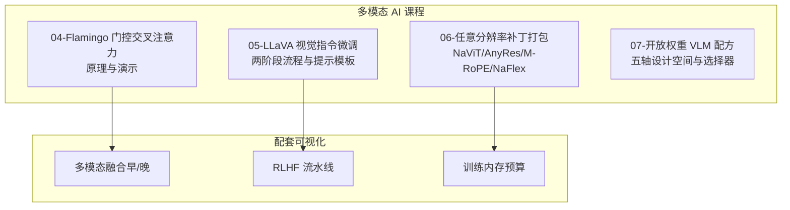
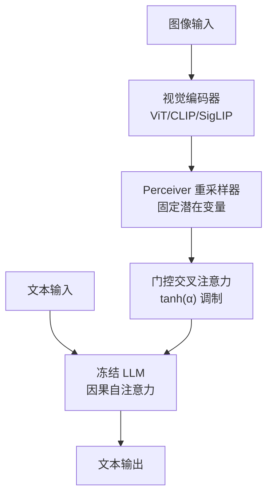
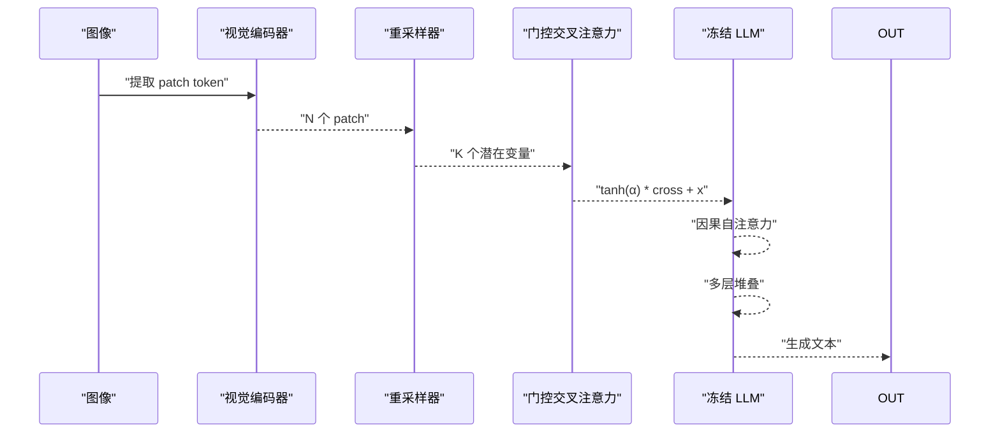
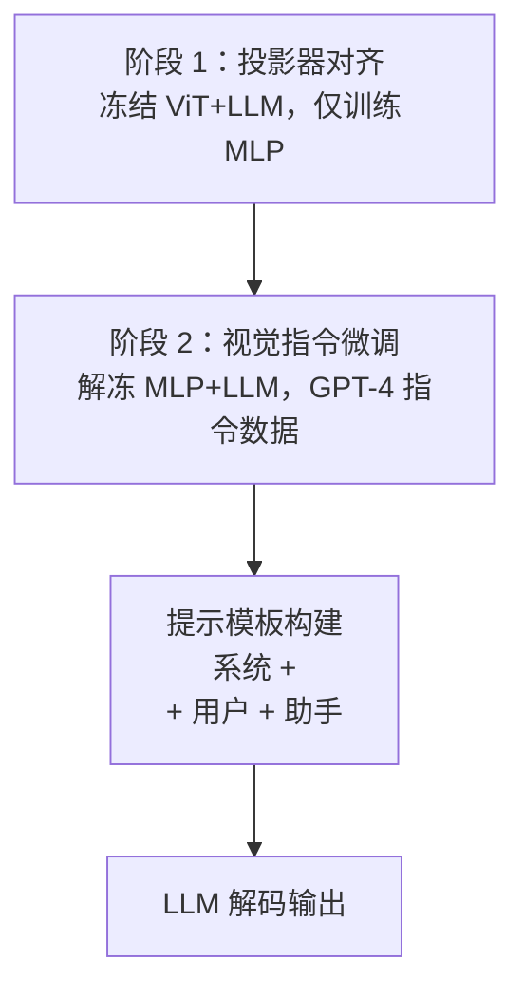
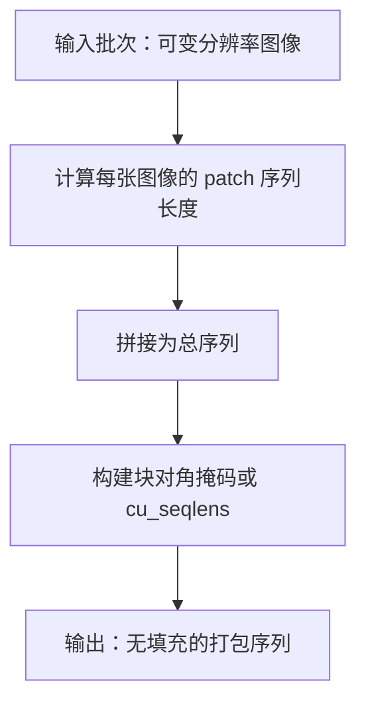
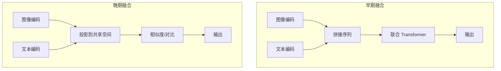
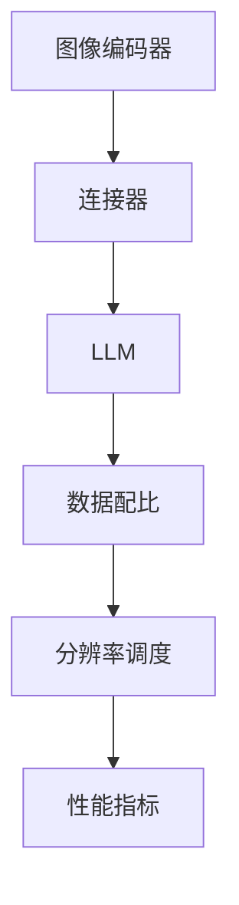
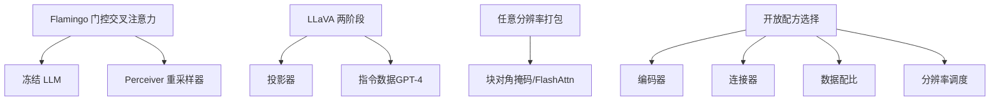

# 视觉语言模型架构

<cite>
**本文引用的文件**
- [flamingo-gated-cross-attention/docs/zh.md](file://phases/12-multimodal-ai/04-flamingo-gated-cross-attention/docs/zh.md)
- [flamingo-gated-cross-attention/code/main.py](file://phases/12-multimodal-ai/04-flamingo-gated-cross-attention/code/main.py)
- [llava-visual-instruction-tuning/docs/zh.md](file://phases/12-multimodal-ai/05-llava-visual-instruction-tuning/docs/zh.md)
- [llava-visual-instruction-tuning/code/main.py](file://phases/12-multimodal-ai/05-llava-visual-instruction-tuning/code/main.py)
- [any-resolution-patch-n-pack/docs/zh.md](file://phases/12-multimodal-ai/06-any-resolution-patch-n-pack/docs/zh.md)
- [any-resolution-patch-n-pack/code/main.py](file://phases/12-multimodal-ai/06-any-resolution-patch-n-pack/code/main.py)
- [open-weight-vlm-recipes/docs/zh.md](file://phases/12-multimodal-ai/07-open-weight-vlm-recipes/docs/zh.md)
- [rlhf-pipeline/figure](file://site/figures-llms2.js)
- [multimodal-fusion/figure](file://site/figures-llms-systems.js)
- [training-memory/figure](file://site/figures-infra.js)
</cite>

## 目录
1. [引言](#引言)
2. [项目结构](#项目结构)
3. [核心组件](#核心组件)
4. [架构总览](#架构总览)
5. [详细组件分析](#详细组件分析)
6. [依赖关系分析](#依赖关系分析)
7. [性能考量](#性能考量)
8. [故障排查指南](#故障排查指南)
9. [结论](#结论)
10. [附录](#附录)

## 引言
本课程围绕视觉语言模型（VLM）的三大主题展开：门控交叉注意力机制、视觉指令微调范式，以及任意分辨率补丁打包技术。我们将结合 Flamingo 的门控交叉注意力、LLaVA 的两阶段视觉指令微调流程，以及任意分辨率补丁打包（NaViT、AnyRes、M-RoPE、NaFlex）的实现与权衡，帮助开发者在不同任务与资源约束下选择合适的架构与配方。

## 项目结构
本仓库的“多模态 AI”阶段提供了从基础视觉编码、对比学习预训练、到门控交叉注意力、视觉指令微调、任意分辨率补丁打包与开放配方选择的完整教学路径。相关文件组织如下：
- 04-flamingo-gated-cross-attention：门控交叉注意力与 Perceiver 重采样器的原理与演示
- 05-llava-visual-instruction-tuning：两阶段视觉指令微调（投影器对齐 + 指令微调）与提示模板
- 06-any-resolution-patch-n-pack：可变分辨率图像的补丁打包、块对角掩码与策略选择
- 07-open-weight-vlm-recipes：开放权重 VLM 的五轴设计空间与配方选择
- site/figures-*：配套的可视化图示（多模态融合、RLHF 流水线、训练内存）

**章节来源**
- [flamingo-gated-cross-attention/docs/zh.md:1-158](file://phases/12-multimodal-ai/04-flamingo-gated-cross-attention/docs/zh.md#L1-L158)
- [llava-visual-instruction-tuning/docs/zh.md:1-175](file://phases/12-multimodal-ai/05-llava-visual-instruction-tuning/docs/zh.md#L1-L175)
- [any-resolution-patch-n-pack/docs/zh.md:1-145](file://phases/12-multimodal-ai/06-any-resolution-patch-n-pack/docs/zh.md#L1-L145)
- [open-weight-vlm-recipes/docs/zh.md:1-147](file://phases/12-multimodal-ai/07-open-weight-vlm-recipes/docs/zh.md#L1-L147)

## 核心组件
- 门控交叉注意力（Flamingo）：在冻结 LLM 的层间插入门控交叉注意力，通过 tanh(α) 门控制视觉信息注入，初始化时 α=0 保证文本能力不被破坏。
- Perceiver 重采样器：将可变数量的图像 patch 聚合成固定数量的“潜在”查询，使后续 LLM 的注意力输入形状一致。
- LLaVA 两阶段微调：阶段 1 冻结视觉编码器与 LLM，仅训练投影器；阶段 2 解冻并联合训练，使用 GPT-4 生成的指令数据。
- 任意分辨率补丁打包：NaViT 的块对角掩码、AnyRes 的平铺 + 缩略图、M-RoPE 的 3D 旋转位置编码、NaFlex 的原生灵活模式。
- 开放配方选择：五轴设计空间（编码器、连接器、LLM、数据配比、分辨率调度）与实证结论驱动的配方决策。

**章节来源**
- [flamingo-gated-cross-attention/docs/zh.md:27-58](file://phases/12-multimodal-ai/04-flamingo-gated-cross-attention/docs/zh.md#L27-L58)
- [llava-visual-instruction-tuning/docs/zh.md:33-61](file://phases/12-multimodal-ai/05-llava-visual-instruction-tuning/docs/zh.md#L33-L61)
- [any-resolution-patch-n-pack/docs/zh.md:33-73](file://phases/12-multimodal-ai/06-any-resolution-patch-n-pack/docs/zh.md#L33-L73)
- [open-weight-vlm-recipes/docs/zh.md:27-37](file://phases/12-multimodal-ai/07-open-weight-vlm-recipes/docs/zh.md#L27-L37)

## 架构总览
下面的架构图展示了从图像到文本生成的关键路径，强调“早/晚融合”的区别与门控交叉注意力的插入点。

**图示来源**
- [multimodal-fusion/figure:417-482](file://site/figures-llms-systems.js#L417-L482)
- [flamingo-gated-cross-attention/docs/zh.md:31-58](file://phases/12-multimodal-ai/04-flamingo-gated-cross-attention/docs/zh.md#L31-L58)

## 详细组件分析

### Flamingo 门控交叉注意力与 Perceiver 重采样器
- Perceiver 重采样器：将 N 个 patch token 聚合为固定 K 个潜在变量，通过交叉注意力与自注意力+FFN迭代，最终输出 K 个视觉 token，形状与图像数量无关。
- 门控交叉注意力：在冻结 LLM 的每 M 层插入，公式为 y = tanh(α) * cross + x，α 初始化为 0，确保初始化时视觉贡献为零，LLM 文本能力保持不变。
- 交错输入掩码：文本 token 仅能关注“最近的前一个”图像，避免跨图像信息泄露，同时保持上下文学习能力。

**图示来源**
- [flamingo-gated-cross-attention/code/main.py:68-86](file://phases/12-multimodal-ai/04-flamingo-gated-cross-attention/code/main.py#L68-L86)
- [flamingo-gated-cross-attention/docs/zh.md:42-58](file://phases/12-multimodal-ai/04-flamingo-gated-cross-attention/docs/zh.md#L42-L58)

**章节来源**
- [flamingo-gated-cross-attention/docs/zh.md:10-16](file://phases/12-multimodal-ai/04-flamingo-gated-cross-attention/docs/zh.md#L10-L16)
- [flamingo-gated-cross-attention/code/main.py:109-176](file://phases/12-multimodal-ai/04-flamingo-gated-cross-attention/code/main.py#L109-L176)

### LLaVA 视觉指令微调：监督微调与人类反馈强化学习
- 两阶段流程：
  - 阶段 1：冻结 ViT 与 LLM，仅训练投影器（两层 MLP），在标题对上做语言建模损失，快速对齐视觉-语言嵌入空间。
  - 阶段 2：解冻投影器与 LLM（通常全量或 LoRA），在 GPT-4 生成的视觉指令数据上进行指令微调。
- 提示模板：系统提示词 + “<image>” 占位符 + 用户轮次 + 助手占位符；推理时将占位符替换为投影后的视觉 token。
- 数据来源：COCO 标题 + GPT-4 生成的对话、描述与复杂推理问题，形成大规模指令数据集。

**图示来源**
- [rlhf-pipeline/figure:111-174](file://site/figures-llms2.js#L111-L174)
- [llava-visual-instruction-tuning/docs/zh.md:53-72](file://phases/12-multimodal-ai/05-llava-visual-instruction-tuning/docs/zh.md#L53-L72)

**章节来源**
- [llava-visual-instruction-tuning/docs/zh.md:10-16](file://phases/12-multimodal-ai/05-llava-visual-instruction-tuning/docs/zh.md#L10-L16)
- [llava-visual-instruction-tuning/code/main.py:94-165](file://phases/12-multimodal-ai/05-llava-visual-instruction-tuning/code/main.py#L94-L165)

### 任意分辨率补丁打包：动态分辨率与内存预算
- NaViT：将批次内各图像的 patch 序列直接拼接，构建块对角注意力掩码，避免填充，保持原生分辨率与布局信息。
- AnyRes（LLaVA-NeXT）：将高分辨率图像平铺为固定大小的网格（如 2x2、1x3 等），并附加一张缩略图，连接后送入冻结编码器；适合原生分辨率受限的编码器。
- M-RoPE（Qwen2-VL）：3D 旋转位置编码（时间、行、列），原生支持任意 H/W/T，无需位置表，推理时直接按原生分辨率编码。
- NaFlex（SigLIP 2）：单检查点原生灵活模式，推理时按任务选择不同 token 预算（如 256/729/1024），无需重新训练。
- 打包掩码：基于累积长度构造块对角掩码，或使用 FlashAttention 的变长路径 cu_seqlens 优化。

**图示来源**
- [any-resolution-patch-n-pack/code/main.py:42-62](file://phases/12-multimodal-ai/06-any-resolution-patch-n-pack/code/main.py#L42-L62)
- [any-resolution-patch-n-pack/docs/zh.md:74-84](file://phases/12-multimodal-ai/06-any-resolution-patch-n-pack/docs/zh.md#L74-L84)

**章节来源**
- [any-resolution-patch-n-pack/docs/zh.md:17-30](file://phases/12-multimodal-ai/06-any-resolution-patch-n-pack/docs/zh.md#L17-L30)
- [any-resolution-patch-n-pack/code/main.py:150-183](file://phases/12-multimodal-ai/06-any-resolution-patch-n-pack/code/main.py#L150-L183)

### 早/晚融合：概念与区别
- 早期融合（Early Fusion）：将图像 token 与文本 token 拼接为单一序列，由统一的 Transformer 同时建模，适合需要跨模态细粒度交互的任务。
- 晚期融合（Late Fusion）：图像与文本分别编码到共享空间后进行对比或相似度计算，典型如 CLIP，适合检索与对比学习。
- 课程配套可视化展示了两种融合点的差异与公式表达。

**图示来源**
- [multimodal-fusion/figure:417-482](file://site/figures-llms-systems.js#L417-L482)

**章节来源**
- [multimodal-fusion/figure:417-482](file://site/figures-llms-systems.js#L417-L482)

### 开放视觉语言模型配方：模型选择策略与性能权衡
- 五轴设计空间：图像编码器、连接器（MLP/Q-Former/Perceiver）、LLM、数据配比、分辨率调度。
- 实证结论：
  - 编码器 > 连接器：在相同 token 预算下，高质量编码器带来的增益远超连接器差异。
  - 数据质量 > 数量：详细人工描述显著优于蒸馏合成数据。
  - 分辨率调度：从低分辨率起步，逐步提升到动态分辨率，能更快收敛且提升 OCR 等任务性能。
- 2026 默认配方：编码器（SigLIP 2 SO400m/14 + DINOv2 拼接）、连接器（2 层 MLP）、LLM（7B/70B 可选）、数据（PixMo + ShareGPT4V + Cauldron + 任务指令）、动态分辨率（最小 256，最大 1280）。

**图示来源**
- [open-weight-vlm-recipes/docs/zh.md:27-37](file://phases/12-multimodal-ai/07-open-weight-vlm-recipes/docs/zh.md#L27-L37)

**章节来源**
- [open-weight-vlm-recipes/docs/zh.md:39-76](file://phases/12-multimodal-ai/07-open-weight-vlm-recipes/docs/zh.md#L39-L76)
- [open-weight-vlm-recipes/docs/zh.md:88-99](file://phases/12-multimodal-ai/07-open-weight-vlm-recipes/docs/zh.md#L88-L99)

## 依赖关系分析
- Flamingo 的门控交叉注意力依赖于冻结 LLM 的层结构与因果掩码，Perceiver 重采样器提供固定形状的视觉表示。
- LLaVA 的两阶段流程依赖于投影器将视觉嵌入映射到 LLM 维度，阶段 1 的对齐为阶段 2 的指令微调奠定基础。
- 任意分辨率补丁打包依赖于注意力掩码或 FlashAttention 的变长路径，以避免填充与跨图像干扰。
- 开放配方选择依赖于大量消融实验的统计结论，指导在编码器、连接器、数据与分辨率上的权衡。

**图示来源**
- [flamingo-gated-cross-attention/docs/zh.md:42-58](file://phases/12-multimodal-ai/04-flamingo-gated-cross-attention/docs/zh.md#L42-L58)
- [llava-visual-instruction-tuning/docs/zh.md:53-72](file://phases/12-multimodal-ai/05-llava-visual-instruction-tuning/docs/zh.md#L53-L72)
- [any-resolution-patch-n-pack/docs/zh.md:74-84](file://phases/12-multimodal-ai/06-any-resolution-patch-n-pack/docs/zh.md#L74-L84)
- [open-weight-vlm-recipes/docs/zh.md:27-37](file://phases/12-multimodal-ai/07-open-weight-vlm-recipes/docs/zh.md#L27-L37)

## 性能考量
- 计算与内存：训练内存随参数量与激活规模线性增长，优化器状态在训练时占主导；通过梯度累积、混合精度与分布式并行降低峰值内存。
- 注意力复杂度：序列长度平方级增长，任意分辨率打包通过块对角掩码或 cu_seqlens 减少无效注意力计算。
- 上下文预算：图像 token 占用 LLM 上下文，需在图像分辨率与文本长度之间平衡；阶段 1 对齐可提升阶段 2 的对齐效率。

**章节来源**
- [training-memory/figure:242-261](file://site/figures-infra.js#L242-L261)

## 故障排查指南
- 门控交叉注意力未生效：检查 α 是否初始化为 0，确认阶段 1 未更新视觉模块，确保门控残差正确实现。
- 投影器对齐失败：检查两阶段损失是否仅针对投影器，标题对数据是否充足，上下文窗口是否足够容纳图像 + 文本。
- 任意分辨率打包异常：核对块对角掩码的累积长度 cu_seqlens，确保每张图像的 token 仅在自身块内注意；必要时启用 FlashAttention 变长路径。
- 开放配方选择偏差：对照消融表，优先检查编码器与数据质量，其次再调整连接器与分辨率。

**章节来源**
- [flamingo-gated-cross-attention/code/main.py:79-86](file://phases/12-multimodal-ai/04-flamingo-gated-cross-attention/code/main.py#L79-L86)
- [llava-visual-instruction-tuning/code/main.py:94-108](file://phases/12-multimodal-ai/05-llava-visual-instruction-tuning/code/main.py#L94-L108)
- [any-resolution-patch-n-pack/code/main.py:42-62](file://phases/12-multimodal-ai/06-any-resolution-patch-n-pack/code/main.py#L42-L62)
- [open-weight-vlm-recipes/docs/zh.md:77-87](file://phases/12-multimodal-ai/07-open-weight-vlm-recipes/docs/zh.md#L77-L87)

## 结论
- 门控交叉注意力与 Perceiver 重采样器使冻结 LLM 在初始化时保持文本能力，同时可控地注入视觉信息，适用于少样本上下文学习与交错输入。
- LLaVA 的两阶段微调以“投影器对齐 + 指令微调”为核心，借助 GPT-4 生成的大规模指令数据，实现低成本、可扩展的视觉指令跟随。
- 任意分辨率补丁打包在不牺牲 OCR 与布局细节的前提下，最大化利用计算资源，AnyRes/NaFlex/M-RoPE 提供不同场景的折中方案。
- 开放配方选择强调“编码器 > 连接器 > 数据质量 > 分辨率调度”，以实证结论为依据，帮助在不同任务与预算下做出稳健决策。

## 附录
- 实现示例路径
  - 门控交叉注意力与重采样器演示：[flamingo-gated-cross-attention/code/main.py:1-176](file://phases/12-multimodal-ai/04-flamingo-gated-cross-attention/code/main.py#L1-L176)
  - LLaVA 投影器与提示模板：[llava-visual-instruction-tuning/code/main.py:1-165](file://phases/12-multimodal-ai/05-llava-visual-instruction-tuning/code/main.py#L1-L165)
  - 任意分辨率补丁打包与预算表：[any-resolution-patch-n-pack/code/main.py:1-183](file://phases/12-multimodal-ai/06-any-resolution-patch-n-pack/code/main.py#L1-L183)
- 可视化参考
  - 多模态融合（早/晚）：[multimodal-fusion/figure:417-482](file://site/figures-llms-systems.js#L417-L482)
  - RLHF 流水线：[rlhf-pipeline/figure:111-174](file://site/figures-llms2.js#L111-L174)
  - 训练内存预算：[training-memory/figure:242-261](file://site/figures-infra.js#L242-L261)