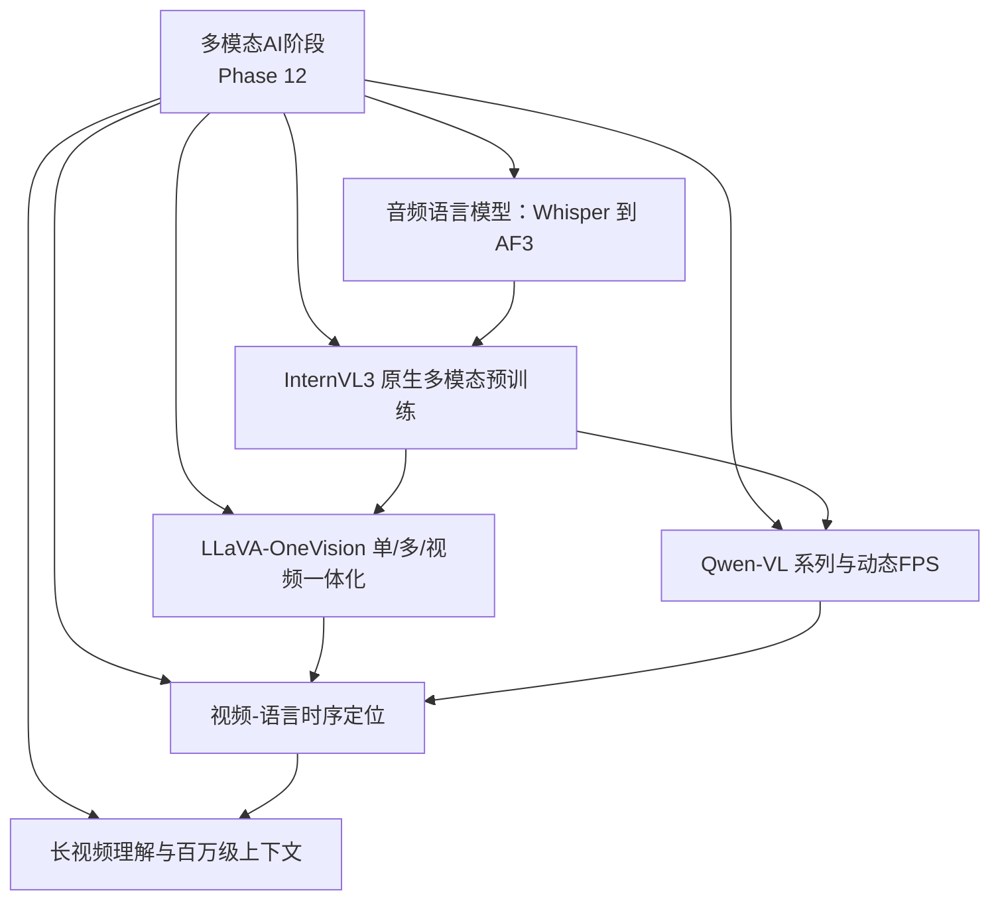
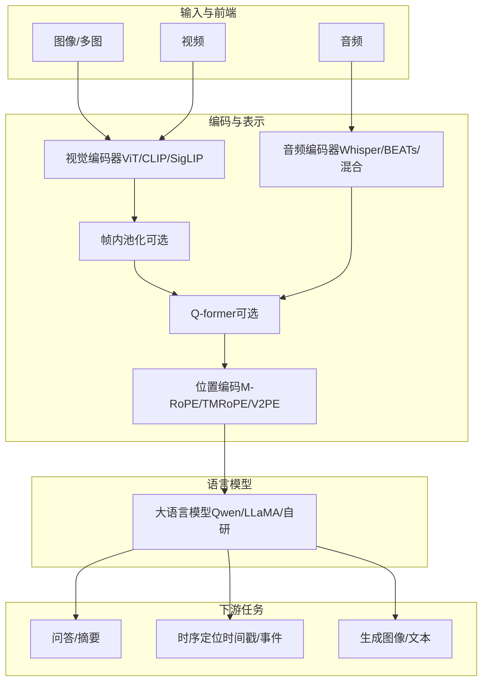
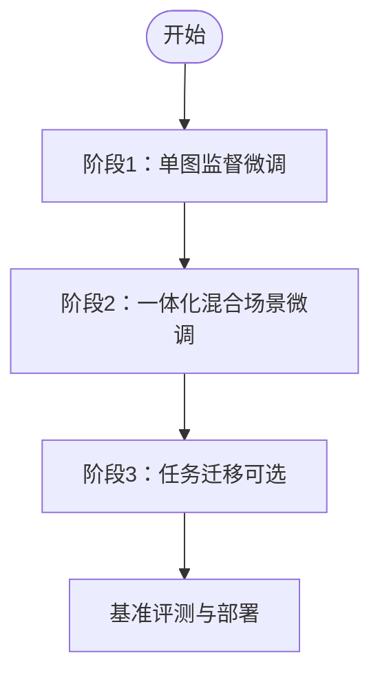
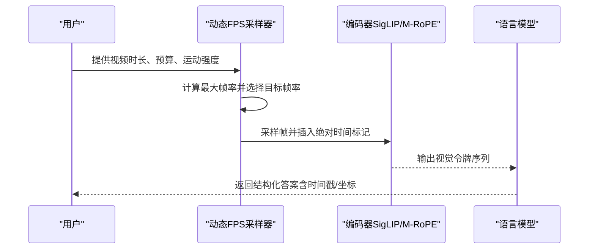
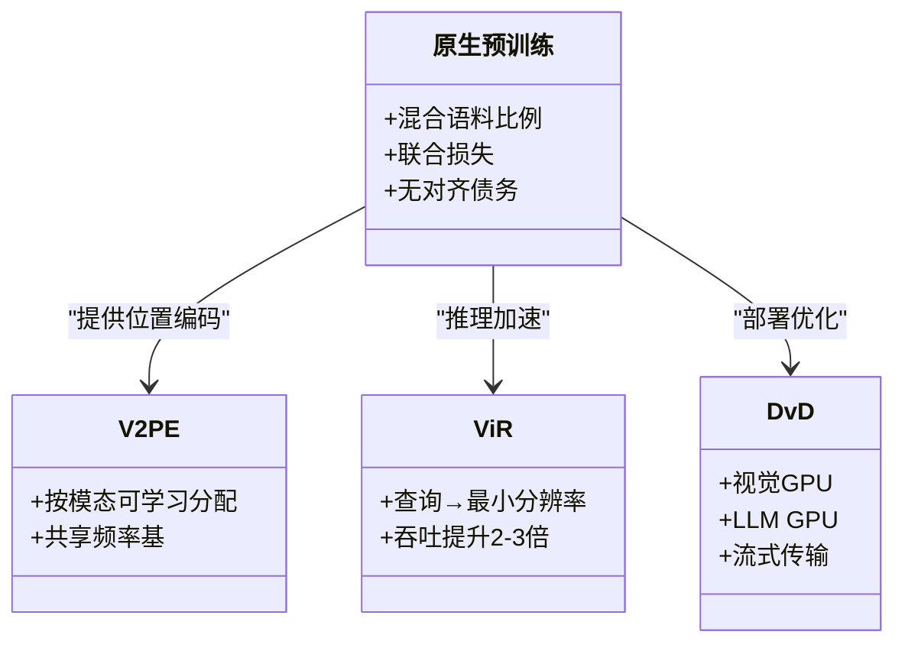
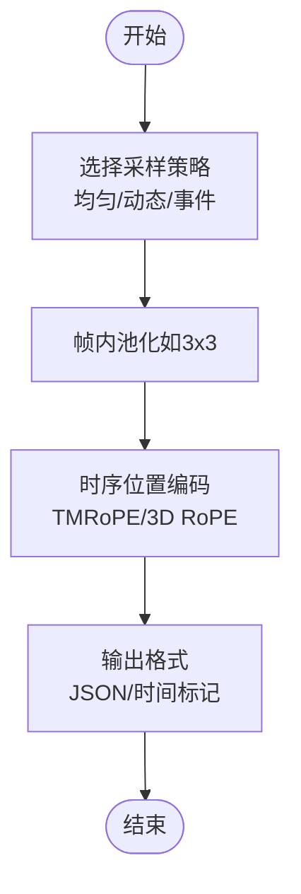
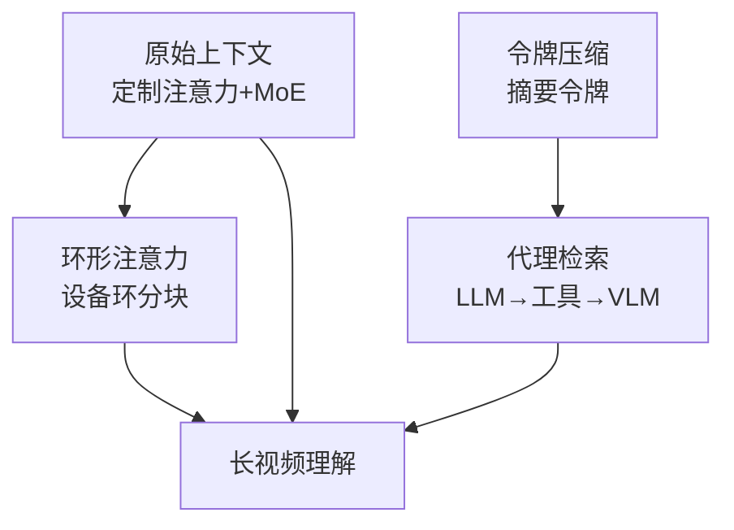
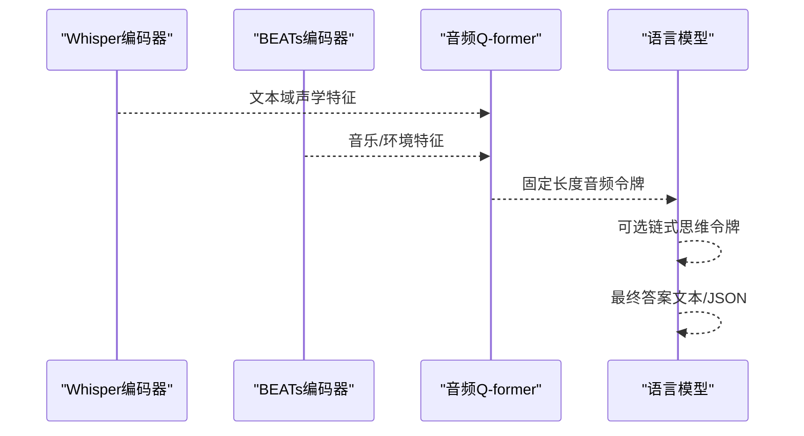
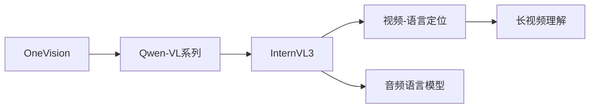

# 视频与音频多模态

<cite>
**本文引用的文件**
- [LLaVA-OneVision：单图、多图、视频一体化](file://phases/12-multimodal-ai/08-llava-onevision-single-multi-video/docs/en.md)
- [Qwen-VL 系列与动态帧率（Dynamic-FPS）](file://phases/12-multimodal-ai/09-qwen-vl-family-dynamic-fps/docs/en.md)
- [InternVL3：原生多模态预训练](file://phases/12-multimodal-ai/10-internvl3-native-multimodal/docs/en.md)
- [视频-语言时序定位](file://phases/12-multimodal-ai/17-video-language-temporal-grounding/docs/en.md)
- [长视频理解与百万级上下文](file://phases/12-multimodal-ai/18-long-video-million-token/docs/en.md)
- [音频语言模型：从 Whisper 到 AF3](file://phases/12-multimodal-ai/19-audio-language-whisper-to-af3/docs/en.md)
</cite>

## 目录
1. [引言](#引言)
2. [项目结构](#项目结构)
3. [核心组件](#核心组件)
4. [架构总览](#架构总览)
5. [详细组件分析](#详细组件分析)
6. [依赖关系分析](#依赖关系分析)
7. [性能考量](#性能考量)
8. [故障排查指南](#故障排查指南)
9. [结论](#结论)
10. [附录](#附录)

## 引言
本文件围绕视频与音频多模态课程，系统梳理并解读以下关键技术主题：
- LLaVA-OneVision 的单视频与多视频处理能力，解释其统一的视觉令牌预算与三阶段课程设计。
- Qwen-VL 系列的动态帧率（Dynamic-FPS）技术，包括自适应帧采样策略与绝对时间对齐。
- InternVL3 的原生多模态预训练架构，覆盖视觉、语言与视频的统一编码与部署优化。
- 视频语言时序定位，解释时间戳对齐与事件检测方法。
- 面向长视频的百万级令牌处理，涵盖滑动窗口与检索增强等策略。
- Whisper 到 AF3 的音频语言转换，实现从语音识别到语言模型的端到端处理。

## 项目结构
本课程位于“多模态AI”阶段，包含六个关键主题模块，分别聚焦于不同技术路径与工程实践。下图给出与本课程目标直接相关的模块关系与职责划分。

**图表来源**
- [LLaVA-OneVision：单图、多图、视频一体化](file://phases/12-multimodal-ai/08-llava-onevision-single-multi-video/docs/en.md)
- [Qwen-VL 系列与动态FPS](file://phases/12-multimodal-ai/09-qwen-vl-family-dynamic-fps/docs/en.md)
- [InternVL3：原生多模态预训练](file://phases/12-multimodal-ai/10-internvl3-native-multimodal/docs/en.md)
- [视频-语言时序定位](file://phases/12-multimodal-ai/17-video-language-temporal-grounding/docs/en.md)
- [长视频理解与百万级上下文](file://phases/12-multimodal-ai/18-long-video-million-token/docs/en.md)
- [音频语言模型：从 Whisper 到 AF3](file://phases/12-multimodal-ai/19-audio-language-whisper-to-af3/docs/en.md)

**章节来源**
- [LLaVA-OneVision：单图、多图、视频一体化](file://phases/12-multimodal-ai/08-llava-onevision-single-multi-video/docs/en.md)
- [Qwen-VL 系列与动态FPS](file://phases/12-multimodal-ai/09-qwen-vl-family-dynamic-fps/docs/en.md)
- [InternVL3：原生多模态预训练](file://phases/12-multimodal-ai/10-internvl3-native-multimodal/docs/en.md)
- [视频-语言时序定位](file://phases/12-multimodal-ai/17-video-language-temporal-grounding/docs/en.md)
- [长视频理解与百万级上下文](file://phases/12-multimodal-ai/18-long-video-million-token/docs/en.md)
- [音频语言模型：从 Whisper 到 AF3](file://phases/12-multimodal-ai/19-audio-language-whisper-to-af3/docs/en.md)

## 核心组件
- 统一视觉令牌预算与课程设计：通过固定预算在单图、多图与视频间分配分辨率、池化因子与帧数，确保上下文不溢出，并以“单图→多图→视频”的顺序进行三阶段训练，避免灾难性遗忘并促进跨场景迁移。
- 动态帧率（Dynamic-FPS）与绝对时间对齐：基于运动强度与预算约束选择帧率，使用绝对时间标记（如“<time>4.2</time>”）替代帧索引，使模型能输出精确的时间戳。
- 原生多模态预训练与位置编码：文本、图像与视频从预训练起即共同参与损失，采用可变视觉位置编码（V2PE）或 M-RoPE，减少后加式对齐债务。
- 时序定位与事件检测：对比 Q-former 每片段、帧内池化与每令牌 TMRoPE 的三种时序表示方案；结合统一/动态/事件驱动采样策略评估精度与吞吐。
- 百万级上下文与长视频处理：比较原始上下文、环形注意力、令牌压缩与代理检索四种扩展路径，结合预算表与针 haystack 测试评估召回与延迟。
- 音频语言端到端处理：从 log-Mel 谱特征出发，构建音频 Q-former，对比级联（Whisper→LLM）与端到端（音频→LLM）两种范式，支持音乐、情感与复杂推理任务。

**章节来源**
- [LLaVA-OneVision：单图、多图、视频一体化](file://phases/12-multimodal-ai/08-llava-onevision-single-multi-video/docs/en.md)
- [Qwen-VL 系列与动态FPS](file://phases/12-multimodal-ai/09-qwen-vl-family-dynamic-fps/docs/en.md)
- [InternVL3：原生多模态预训练](file://phases/12-multimodal-ai/10-internvl3-native-multimodal/docs/en.md)
- [视频-语言时序定位](file://phases/12-multimodal-ai/17-video-language-temporal-grounding/docs/en.md)
- [长视频理解与百万级上下文](file://phases/12-multimodal-ai/18-long-video-million-token/docs/en.md)
- [音频语言模型：从 Whisper 到 AF3](file://phases/12-multimodal-ai/19-audio-language-whisper-to-af3/docs/en.md)

## 架构总览
下图展示从输入到推理的关键路径：图像/视频/音频经编码器生成令牌，通过位置编码与可选的 Q-former 压缩，最终进入语言模型完成问答、时序定位或生成。

**图表来源**
- [LLaVA-OneVision：单图、多图、视频一体化](file://phases/12-multimodal-ai/08-llava-onevision-single-multi-video/docs/en.md)
- [Qwen-VL 系列与动态FPS](file://phases/12-multimodal-ai/09-qwen-vl-family-dynamic-fps/docs/en.md)
- [InternVL3：原生多模态预训练](file://phases/12-multimodal-ai/10-internvl3-native-multimodal/docs/en.md)
- [视频-语言时序定位](file://phases/12-multimodal-ai/17-video-language-temporal-grounding/docs/en.md)
- [长视频理解与百万级上下文](file://phases/12-multimodal-ai/18-long-video-million-token/docs/en.md)
- [音频语言模型：从 Whisper 到 AF3](file://phases/12-multimodal-ai/19-audio-language-whisper-to-af3/docs/en.md)

## 详细组件分析

### LLaVA-OneVision：单视频与多视频一体化
- 统一视觉令牌预算：在单图、多图与视频之间保持近似恒定的总令牌数，通过分辨率与池化因子的差异化分配，避免上下文溢出。
- 三阶段课程设计：先单图（高分辨率感知），再一体化（混合场景），最后任务迁移（面向产品）。顺序至关重要，否则会降低图像性能。
- 视觉令牌池化：在补丁网格空间进行双线性插值池化，保留局部性；池化因子是可调超参。
- 代表性能力：多相机推理、集合标记提示、iPhone 截图代理等跨场景涌现能力。

**图表来源**
- [LLaVA-OneVision：单图、多图、视频一体化](file://phases/12-multimodal-ai/08-llava-onevision-single-multi-video/docs/en.md)

**章节来源**
- [LLaVA-OneVision：单图、多图、视频一体化](file://phases/12-multimodal-ai/08-llava-onevision-single-multi-video/docs/en.md)

### Qwen-VL 系列与动态帧率（Dynamic-FPS）
- 三代演进：Qwen-VL（448×448，首次引入强定位）、Qwen2-VL（原生动态分辨率、M-RoPE、MLP 投影、动态 FPS）、Qwen2.5-VL（绝对时间标记、窗口注意力、结构化工具输出）、Qwen3-VL（更大 LLM、数据与 OCR 改进）。
- M-RoPE 数学：将隐藏维分为三段（时、高、宽），对每个令牌施加三维旋转，兼容文本/图像/视频。
- 动态 FPS 采样：根据时长与预算上限确定最大帧率，结合运动强度与用户偏好选择目标帧率，插入绝对时间标记。
- 结构化工具输出：显式训练 JSON 工具调用格式，便于解析与自动化。

**图表来源**
- [Qwen-VL 系列与动态FPS](file://phases/12-multimodal-ai/09-qwen-vl-family-dynamic-fps/docs/en.md)

**章节来源**
- [Qwen-VL 系列与动态FPS](file://phases/12-multimodal-ai/09-qwen-vl-family-dynamic-fps/docs/en.md)

### InternVL3：原生多模态预训练
- 原生预训练：从零开始在单一训练阶段混合文本、图文交错与配图文本，消除后加式对齐债务。
- V2PE：按模态类型（文本/图像/视频）学习性地分配位置编码带宽，优于固定 M-RoPE。
- 部署优化：视觉分辨率路由器（ViR）按需选择最低分辨率，解耦视觉-语言（DvD）在不同 GPU 上流式执行。
- 性能主张：在 78B 参数下匹配 Gemini 2.5 Pro 的 MMMU-Pro；在 8B 下领先开源 8B 排行榜。

**图表来源**
- [InternVL3：原生多模态预训练](file://phases/12-multimodal-ai/10-internvl3-native-multimodal/docs/en.md)

**章节来源**
- [InternVL3：原生多模态预训练](file://phases/12-multimodal-ai/10-internvl3-native-multimodal/docs/en.md)

### 视频-语言时序定位
- 代表性系统：Video-LLaMA（每片段 Q-former + 音频分支）、Video-LLaVA（冻结 CLIP + MLP + LLM）、Qwen2.5-VL（TMRoPE + 动态 FPS）。
- 采样策略：均匀采样（简单但丢失峰值）、动态 FPS（基于运动）、事件驱动（轻量检测器）、关键帧+上下文。
- 帧内池化：在 1 FPS 下，3×3 池化将每帧令牌降至约 64，适合大多数任务。
- 四大基准：VideoMME、TempCompass（精细时序）、EgoSchema（第一人称长视频）、Video-MMMU（多学科视频）。
- 输出格式：自由文本、结构化 JSON（事件+起止时间）、令牌级时间标记。

**图表来源**
- [视频-语言时序定位](file://phases/12-multimodal-ai/17-video-language-temporal-grounding/docs/en.md)

**章节来源**
- [视频-语言时序定位](file://phases/12-multimodal-ai/17-video-language-temporal-grounding/docs/en.md)

### 长视频理解与百万级上下文
- 规模挑战：1 小时 4K 视频在 24 FPS、原生分辨率下可达数千万令牌；需要百万级上下文。
- 四条扩展路径：
  - 原始上下文：如 Gemini 1.5/2.5 Pro，达百万令牌，工程上采用定制注意力与 MoE。
  - 环形注意力：LWM/LongVILA 在设备环中分块计算注意力，线性扩展。
  - 令牌压缩：Video-XL 使用“摘要令牌”，显著缩小上下文。
  - 代理检索：VideoAgent 将视频视为数据库，LLM 查询→工具返回→VLM 读取→回答。
- 针 haystack 测试：在百万令牌范围内验证召回率，开放模型在小时级视频上仍有差距。
- 生产建议：动态 FPS + 激进池化得到全局表示，再以代理检索满足局部细节。

**图表来源**
- [长视频理解与百万级上下文](file://phases/12-multimodal-ai/18-long-video-million-token/docs/en.md)

**章节来源**
- [长视频理解与百万级上下文](file://phases/12-multimodal-ai/18-long-video-million-token/docs/en.md)

### 音频语言模型：从 Whisper 到 AF3
- 输入特征：log-Mel 谱（窗长/步长/滤波器组/对数压缩），作为音频编码器输入。
- 编码器选项：Whisper（强语音）、BEATs（强音乐/环境）、AF-Whisper 混合（兼顾语言与声学）。
- 音频 Q-former：固定数量可学习查询，跨注意力聚合音频帧，形成音频令牌供 LLM 使用。
- 级联 vs 端到端：级联（Whisper→LLM）适合纯语音摘要；端到端（音频→LLM）保留音色、情感、环境信息，更适合音乐、情绪与复杂推理。
- AF3：Whisper+BEATs+64 查询 Q-former+8B LLM，在 MMAU 达 0.72，接近前沿水平。

**图表来源**
- [音频语言模型：从 Whisper 到 AF3](file://phases/12-multimodal-ai/19-audio-language-whisper-to-af3/docs/en.md)

**章节来源**
- [音频语言模型：从 Whisper 到 AF3](file://phases/12-multimodal-ai/19-audio-language-whisper-to-af3/docs/en.md)

## 依赖关系分析
- 技术依赖：
  - OneVision 依赖 AnyRes 分辨率与池化策略，支撑统一预算。
  - Qwen-VL 系列依赖 M-RoPE 与动态 FPS，支撑绝对时间对齐与高效采样。
  - InternVL3 依赖原生多模态预训练与 V2PE，支撑更强的跨模态一致性。
  - 视频-语言定位依赖 TMRoPE 与多种采样策略，支撑时序精确定位。
  - 长视频依赖上下文扩展路径（原始/环形/压缩/检索）与预算控制。
  - 音频语言依赖 log-Mel 特征、音频编码器与 Q-former，支撑端到端推理。
- 工程耦合：
  - 课程顺序（OneVision→Qwen-VL→InternVL3→视频定位→长视频→音频）体现知识递进。
  - 部署优化（ViR/DvD）与采样策略（Dynamic-FPS/池化）相互影响吞吐与质量。

**图表来源**
- [LLaVA-OneVision：单图、多图、视频一体化](file://phases/12-multimodal-ai/08-llava-onevision-single-multi-video/docs/en.md)
- [Qwen-VL 系列与动态FPS](file://phases/12-multimodal-ai/09-qwen-vl-family-dynamic-fps/docs/en.md)
- [InternVL3：原生多模态预训练](file://phases/12-multimodal-ai/10-internvl3-native-multimodal/docs/en.md)
- [视频-语言时序定位](file://phases/12-multimodal-ai/17-video-language-temporal-grounding/docs/en.md)
- [长视频理解与百万级上下文](file://phases/12-multimodal-ai/18-long-video-million-token/docs/en.md)
- [音频语言模型：从 Whisper 到 AF3](file://phases/12-multimodal-ai/19-audio-language-whisper-to-af3/docs/en.md)

**章节来源**
- [LLaVA-OneVision：单图、多图、视频一体化](file://phases/12-multimodal-ai/08-llava-onevision-single-multi-video/docs/en.md)
- [Qwen-VL 系列与动态FPS](file://phases/12-multimodal-ai/09-qwen-vl-family-dynamic-fps/docs/en.md)
- [InternVL3：原生多模态预训练](file://phases/12-multimodal-ai/10-internvl3-native-multimodal/docs/en.md)
- [视频-语言时序定位](file://phases/12-multimodal-ai/17-video-language-temporal-grounding/docs/en.md)
- [长视频理解与百万级上下文](file://phases/12-multimodal-ai/18-long-video-million-token/docs/en.md)
- [音频语言模型：从 Whisper 到 AF3](file://phases/12-multimodal-ai/19-audio-language-whisper-to-af3/docs/en.md)

## 性能考量
- 令牌预算与池化：在单图/多图/视频间平衡分辨率与池化因子，避免上下文溢出并控制计算成本。
- 动态 FPS：依据运动强度与预算上限自适应采样，兼顾吞吐与精度。
- 原生预训练：减少对齐债务，提升跨任务稳定性与泛化能力。
- 部署优化：ViR 按需降分辨率，DvD 解耦视觉与语言瓶颈，提升吞吐。
- 长视频扩展：根据时长与精度需求选择原始上下文、环形注意力、令牌压缩或代理检索。
- 音频端到端：保留音色与环境信息，适合音乐、情感与复杂推理，但需更丰富数据与更强算力。

## 故障排查指南
- 图像/视频过长导致上下文溢出：
  - 降低分辨率或增加池化因子；检查预算分配是否合理。
- 时序定位不准：
  - 使用绝对时间标记与 TMRoPE；提高动态 FPS 或采用事件驱动采样。
- 长视频召回下降：
  - 采用环形注意力或令牌压缩；或切换为代理检索模式。
- 音频理解偏差：
  - 优先端到端方案；选用 BEATs 或混合编码器；完善音频 Q-former 训练数据。
- 对齐债务症状（文本能力退化、答案漂移、视觉-文本不一致）：
  - 采用原生多模态预训练，避免后加式对齐。

**章节来源**
- [LLaVA-OneVision：单图、多图、视频一体化](file://phases/12-multimodal-ai/08-llava-onevision-single-multi-video/docs/en.md)
- [Qwen-VL 系列与动态FPS](file://phases/12-multimodal-ai/09-qwen-vl-family-dynamic-fps/docs/en.md)
- [InternVL3：原生多模态预训练](file://phases/12-multimodal-ai/10-internvl3-native-multimodal/docs/en.md)
- [视频-语言时序定位](file://phases/12-multimodal-ai/17-video-language-temporal-grounding/docs/en.md)
- [长视频理解与百万级上下文](file://phases/12-multimodal-ai/18-long-video-million-token/docs/en.md)
- [音频语言模型：从 Whisper 到 AF3](file://phases/12-multimodal-ai/19-audio-language-whisper-to-af3/docs/en.md)

## 结论
本课程系统呈现了视频与音频多模态的主流技术路线：统一预算与课程设计（OneVision）、动态帧率与绝对时间对齐（Qwen-VL）、原生多模态预训练（InternVL3）、时序定位与事件检测（视频-语言）、百万级上下文扩展（长视频）以及端到端音频语言（Whisper→AF3）。通过合理的采样、池化与部署优化，可在精度与效率之间取得良好平衡，并为复杂产品场景提供工程化支撑。

## 附录
- 关键术语速查：
  - OneVision 场景：单图/多图/视频三类输入形状，预算恒定。
  - M-RoPE：三维旋转位置编码，兼容文本/图像/视频。
  - 动态 FPS：按运动与预算自适应采样。
  - 绝对时间标记：以秒为单位的时间戳令牌。
  - 原生多模态预训练：文本/图像/视频从预训练起共同参与损失。
  - V2PE：按模态类型可学习的位置编码分配。
  - ViR：按需选择最低分辨率的路由。
  - DvD：视觉与语言解耦部署。
  - TMRoPE：Qwen2.5-VL 的时序-模态旋转位置编码。
  - 针 haystack：在长序列中召回特定标记的测试。
  - 级联 vs 端到端：先转写再推理 vs 直接音频→LLM。