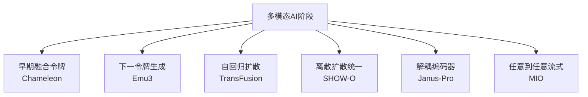
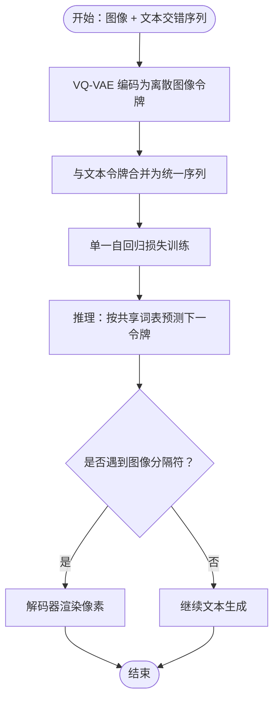
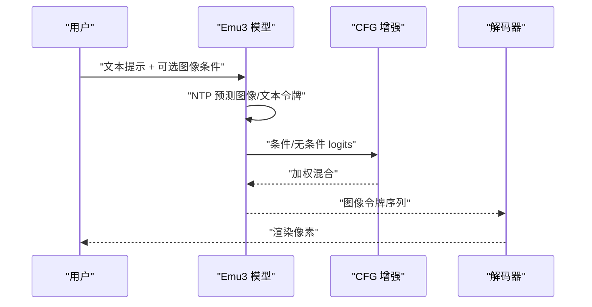
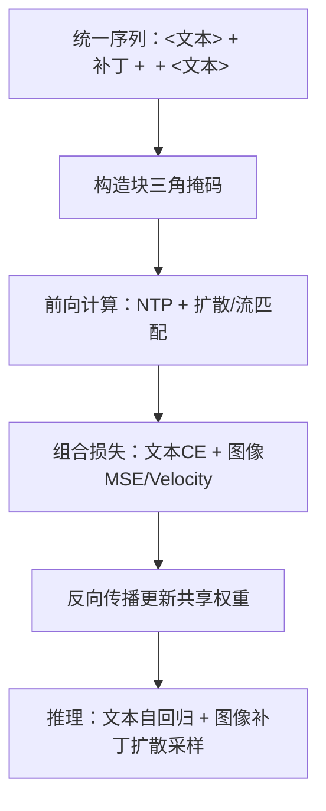
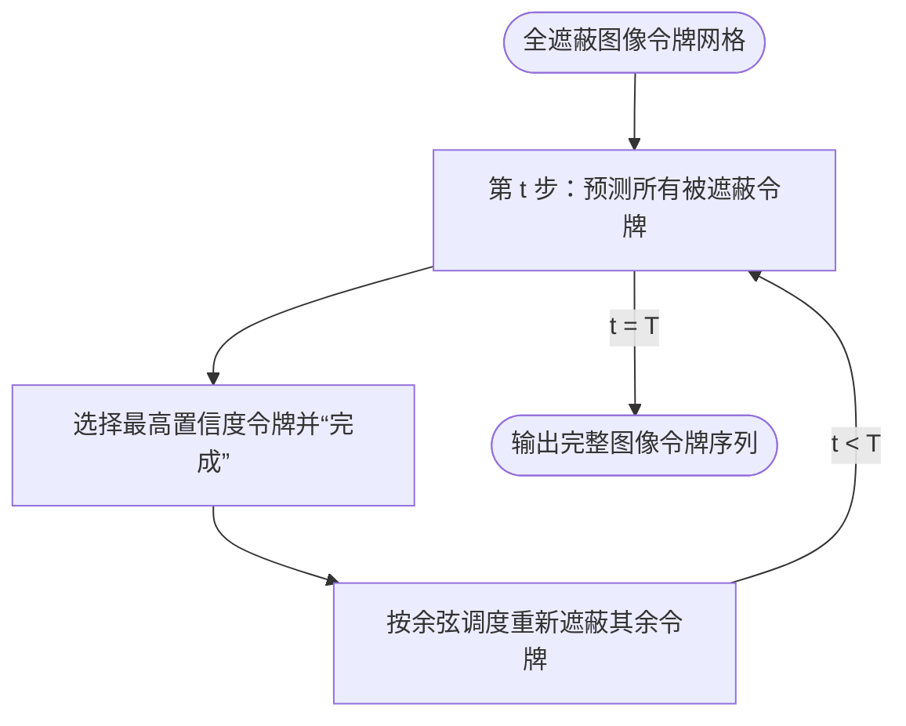
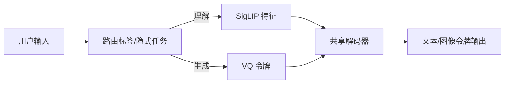
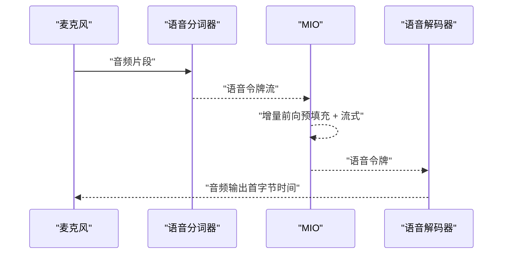
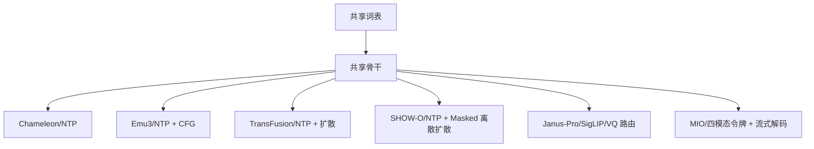

# 高级多模态模型

<cite>
**本文引用的文件**
- [phases/12-multimodal-ai/11-chameleon-early-fusion-tokens/docs/en.md](file://phases/12-multimodal-ai/11-chameleon-early-fusion-tokens/docs/en.md)
- [phases/12-multimodal-ai/12-emu3-next-token-for-generation/docs/en.md](file://phases/12-multimodal-ai/12-emu3-next-token-for-generation/docs/en.md)
- [phases/12-multimodal-ai/13-transfusion-autoregressive-diffusion/docs/en.md](file://phases/12-multimodal-ai/13-transfusion-autoregressive-diffusion/docs/en.md)
- [phases/12-multimodal-ai/14-show-o-discrete-diffusion-unified/docs/en.md](file://phases/12-multimodal-ai/14-show-o-discrete-diffusion-unified/docs/en.md)
- [phases/12-multimodal-ai/15-janus-pro-decoupled-encoders/docs/en.md](file://phases/12-multimodal-ai/15-janus-pro-decoupled-encoders/docs/en.md)
- [phases/12-multimodal-ai/16-mio-any-to-any-streaming/docs/en.md](file://phases/12-multimodal-ai/16-mio-any-to-any-streaming/docs/en.md)
</cite>

## 目录
1. [引言](#引言)
2. [项目结构](#项目结构)
3. [核心组件](#核心组件)
4. [架构总览](#架构总览)
5. [详细组件分析](#详细组件分析)
6. [依赖关系分析](#依赖关系分析)
7. [性能考量](#性能考量)
8. [故障排查指南](#故障排查指南)
9. [结论](#结论)
10. [附录](#附录)

## 引言
本课程围绕“高级多模态模型”的六大前沿范式展开：Chameleon 的早期融合令牌、Emu3 的下一令牌生成、TransFusion 的自回归扩散、SHOW-O 的离散扩散统一、Janus-Pro 的解耦编码器以及 MIO 的任意到任意流式处理。我们将从训练目标、数据流、推理掩码、质量权衡与工程实现等维度，系统梳理这些模型如何在“一个骨架、共享词表”的统一范式下，实现跨模态理解与生成，并给出可操作的工程建议与排错思路。

## 项目结构
本课程内容位于“多模态AI”阶段下的六个子主题，每个主题提供英文讲义与构建任务说明，覆盖从概念到实践的完整闭环。

**章节来源**
- [phases/12-multimodal-ai/11-chameleon-early-fusion-tokens/docs/en.md:1-147](file://phases/12-multimodal-ai/11-chameleon-early-fusion-tokens/docs/en.md#L1-L147)
- [phases/12-multimodal-ai/12-emu3-next-token-for-generation/docs/en.md:1-131](file://phases/12-multimodal-ai/12-emu3-next-token-for-generation/docs/en.md#L1-L131)
- [phases/12-multimodal-ai/13-transfusion-autoregressive-diffusion/docs/en.md:1-148](file://phases/12-multimodal-ai/13-transfusion-autoregressive-diffusion/docs/en.md#L1-L148)
- [phases/12-multimodal-ai/14-show-o-discrete-diffusion-unified/docs/en.md:1-138](file://phases/12-multimodal-ai/14-show-o-discrete-diffusion-unified/docs/en.md#L1-L138)
- [phases/12-multimodal-ai/15-janus-pro-decoupled-encoders/docs/en.md:1-137](file://phases/12-multimodal-ai/15-janus-pro-decoupled-encoders/docs/en.md#L1-L137)
- [phases/12-multimodal-ai/16-mio-any-to-any-streaming/docs/en.md:1-157](file://phases/12-multimodal-ai/16-mio-any-to-any-streaming/docs/en.md#L1-L157)

## 核心组件
- 早期融合令牌（Chameleon）：以共享词表与单一损失训练，图像经 VQ-VAE 离散化后与文本交错输入同一解码器，支持混合模态输出；强调训练稳定性技巧（QK-Norm、dropout 位置、LayerNorm 排序）。
- 下一令牌生成（Emu3）：单损失（NTP）+ 统一词表（文本+2D/3D 视频 VQ），通过 CFG 提升质量；强调“更好分词器 + 规模”即可匹敌扩散。
- 自回归扩散（TransFusion）：同一解码器同时处理文本（NTP）与图像补丁（扩散/流匹配），采用“因果文本 + 图像块内双向”的掩码；与 MMDiT 同源但更强调连续图像表示。
- 离散扩散统一（SHOW-O）：文本仍用 NTP，图像用 Masked 离散扩散（类似 MaskGIT），统一于同一掩码与损失；推理步数显著少于自回归。
- 解耦编码器（Janus-Pro）：理解用 SigLIP 语义特征，生成用 VQ 重建码，共享解码器主体；通过数据规模与路由标签实现“既懂又生”。
- 任意到任意流式（MIO）：四模态（文本/图像/语音/音乐）离散令牌，统一词表与训练课程，强调流式解码与端到端延迟预算。

**章节来源**
- [phases/12-multimodal-ai/11-chameleon-early-fusion-tokens/docs/en.md:17-94](file://phases/12-multimodal-ai/11-chameleon-early-fusion-tokens/docs/en.md#L17-L94)
- [phases/12-multimodal-ai/12-emu3-next-token-for-generation/docs/en.md:17-87](file://phases/12-multimodal-ai/12-emu3-next-token-for-generation/docs/en.md#L17-L87)
- [phases/12-multimodal-ai/13-transfusion-autoregressive-diffusion/docs/en.md:17-99](file://phases/12-multimodal-ai/13-transfusion-autoregressive-diffusion/docs/en.md#L17-L99)
- [phases/12-multimodal-ai/14-show-o-discrete-diffusion-unified/docs/en.md:17-92](file://phases/12-multimodal-ai/14-show-o-discrete-diffusion-unified/docs/en.md#L17-L92)
- [phases/12-multimodal-ai/15-janus-pro-decoupled-encoders/docs/en.md:17-91](file://phases/12-multimodal-ai/15-janus-pro-decoupled-encoders/docs/en.md#L17-L91)
- [phases/12-multimodal-ai/16-mio-any-to-any-streaming/docs/en.md:17-113](file://phases/12-multimodal-ai/16-mio-any-to-any-streaming/docs/en.md#L17-L113)

## 架构总览
下图展示六大范式的统一视图：共享词表与解码器骨干，不同训练目标与路由策略，以及各自的掩码与质量权衡。

```mermaid
graph TB
subgraph "共享骨干"
T["解码器Transformer"]
end
subgraph "Chameleon"
C1["VQ-VAE 分词器"]
C2["NTP 文本 + 图像"]
C3["混合模态输出"]
end
subgraph "Emu3"
E1["IBQ/SEED 分词器"]
E2["NTP 统一词表<br/>文本/图像/视频"]
E3["CFG 质量提升"]
end
subgraph "TransFusion"
TF1["连续图像补丁"]
TF2["NTP 文本 + 扩散/流匹配"]
TF3["因果文本 + 图像块内双向掩码"]
end
subgraph "SHOW-O"
S1["离散图像令牌"]
S2["NTP 文本 + Masked 离散扩散"]
S3["并行采样~16步"]
end
subgraph "Janus-Pro"
JP1["SigLIP 特征理解"]
JP2["VQ 令牌生成"]
JP3["共享骨干 + 路由标签"]
end
subgraph "MIO"
M1["四模态离散令牌"]
M2["统一词表 + 训练课程"]
M3["流式解码语音等"]
end
C1 --> T
E1 --> T
TF1 --> T
S1 --> T
JP1 --> T
JP2 --> T
M1 --> T
C2 --> T
E2 --> T
TF2 --> T
S2 --> T
JP3 --> T
M2 --> T
C3 --> T
E3 --> T
TF3 --> T
S3 --> T
JP3 --> T
M3 --> T
```

**图表来源**
- [phases/12-multimodal-ai/11-chameleon-early-fusion-tokens/docs/en.md:29-61](file://phases/12-multimodal-ai/11-chameleon-early-fusion-tokens/docs/en.md#L29-L61)
- [phases/12-multimodal-ai/12-emu3-next-token-for-generation/docs/en.md:27-64](file://phases/12-multimodal-ai/12-emu3-next-token-for-generation/docs/en.md#L27-L64)
- [phases/12-multimodal-ai/13-transfusion-autoregressive-diffusion/docs/en.md:29-74](file://phases/12-multimodal-ai/13-transfusion-autoregressive-diffusion/docs/en.md#L29-L74)
- [phases/12-multimodal-ai/14-show-o-discrete-diffusion-unified/docs/en.md:31-67](file://phases/12-multimodal-ai/14-show-o-discrete-diffusion-unified/docs/en.md#L31-L67)
- [phases/12-multimodal-ai/15-janus-pro-decoupled-encoders/docs/en.md:28-73](file://phases/12-multimodal-ai/15-janus-pro-decoupled-encoders/docs/en.md#L28-L73)
- [phases/12-multimodal-ai/16-mio-any-to-any-streaming/docs/en.md:30-74](file://phases/12-multimodal-ai/16-mio-any-to-any-streaming/docs/en.md#L30-L74)

## 详细组件分析

### Chameleon：早期融合令牌机制
- 视觉与语言早期整合：图像经 VQ-VAE 离散化为共享词表中的整数索引，与文本交错形成单一序列，使用单一自回归损失训练。
- 混合模态生成：推理时可自主决定输出顺序（图像-文本或文本-图像），下游软件根据分隔符识别并渲染像素。
- 训练稳定性：引入 QK-Norm、每残差加 dropout、末层额外 LN，避免深层注意力数值爆炸。
- 与 Adapter-VLM 对比：Chameleon 生成能力强但需分词器解码器；Adapter-VLM 理解成本低、无需生成瓶颈。

**图表来源**
- [phases/12-multimodal-ai/11-chameleon-early-fusion-tokens/docs/en.md:31-61](file://phases/12-multimodal-ai/11-chameleon-early-fusion-tokens/docs/en.md#L31-L61)

**章节来源**
- [phases/12-multimodal-ai/11-chameleon-early-fusion-tokens/docs/en.md:17-94](file://phases/12-multimodal-ai/11-chameleon-early-fusion-tokens/docs/en.md#L17-L94)

### Emu3：下一令牌生成技术
- 统一词表与单损失：文本、2D/3D 视频令牌共享同一词表，训练仅用 NTP，不使用 CLIP 或扩散调度。
- 3D 视频分词器：时空补丁（4x4x4）编码为整数，视频长度与分辨率决定 token 数量。
- 三角色一体：Emu3-Gen（图像生成）、Emu3-Chat（感知）、Emu3-Stage2（视频生成/问答）。
- 推理增强：使用 CFG（条件/无条件 logits 加权）与温度调优，平衡细节与多样性。

**图表来源**
- [phases/12-multimodal-ai/12-emu3-next-token-for-generation/docs/en.md:37-64](file://phases/12-multimodal-ai/12-emu3-next-token-for-generation/docs/en.md#L37-L64)

**章节来源**
- [phases/12-multimodal-ai/12-emu3-next-token-for-generation/docs/en.md:17-87](file://phases/12-multimodal-ai/12-emu3-next-token-for-generation/docs/en.md#L17-L87)

### TransFusion：自回归扩散的统一
- 双损失训练：文本走 NTP，图像补丁走扩散/流匹配，共享骨干权重；训练时交替两类损失。
- 注意力掩码：文本因果、图像块内双向、跨模态双向连接，确保信息流动合理。
- 与 MMDiT 关系：同属“一个Transformer处理文本与连续图像”的思想，MMDiT 更强调模态特定权重与矩形流匹配。

**图表来源**
- [phases/12-multimodal-ai/13-transfusion-autoregressive-diffusion/docs/en.md:44-74](file://phases/12-multimodal-ai/13-transfusion-autoregressive-diffusion/docs/en.md#L44-L74)

**章节来源**
- [phases/12-multimodal-ai/13-transfusion-autoregressive-diffusion/docs/en.md:17-99](file://phases/12-multimodal-ai/13-transfusion-autoregressive-diffusion/docs/en.md#L17-L99)

### SHOW-O：离散扩散统一框架
- 革命性点子：文本仍用 NTP，图像改用 Masked 离散扩散（类似 MaskGIT），统一于同一掩码与损失。
- 并行采样：每步并行预测所有被遮蔽令牌，保留最高置信度并重新遮蔽，约 16 步完成。
- 任务统一：T2I、VQA、图像修复（Inpainting）均可由同一检查点完成，且 inpainting 由训练目标免费获得。

**图表来源**
- [phases/12-multimodal-ai/14-show-o-discrete-diffusion-unified/docs/en.md:46-67](file://phases/12-multimodal-ai/14-show-o-discrete-diffusion-unified/docs/en.md#L46-L67)

**章节来源**
- [phases/12-multimodal-ai/14-show-o-discrete-diffusion-unified/docs/en.md:17-92](file://phases/12-multimodal-ai/14-show-o-discrete-diffusion-unified/docs/en.md#L17-L92)

### Janus-Pro：解耦编码器架构
- 核心思想：理解用 SigLIP 语义特征，生成用 VQ 重建码，共享解码器骨干；通过路由标签区分任务。
- 数据放大：Janus-Pro 在参数规模、对齐数据与指令微调数据上大幅扩展，从而在理解（如 MMMU）与生成（如 GenEval）上均取得竞争力。
- 与 InternVL-U 的关系：后者将解耦编码器纳入更大框架，统一理解、生成与编辑。

**图表来源**
- [phases/12-multimodal-ai/15-janus-pro-decoupled-encoders/docs/en.md:28-73](file://phases/12-multimodal-ai/15-janus-pro-decoupled-encoders/docs/en.md#L28-L73)

**章节来源**
- [phases/12-multimodal-ai/15-janus-pro-decoupled-encoders/docs/en.md:17-91](file://phases/12-multimodal-ai/15-janus-pro-decoupled-encoders/docs/en.md#L17-L91)

### MIO：任意到任意流式处理
- 四模态离散令牌：文本（BPE）、图像（SEED-Tokenizer）、语音（SpeechTokenizer 残差VQ）、音乐（残差VQ），统一词表分配 ID 区间。
- 流式解码：语音生成采用残差VQ并行解码，首字节时间在 300–500ms 级别；支持链式视觉思维（中间图像作为思维草稿）。
- 四阶段课程：对齐 → 交错 → 语音增强 → SFT，逐步构建跨模态上下文与能力。

**图表来源**
- [phases/12-multimodal-ai/16-mio-any-to-any-streaming/docs/en.md:51-63](file://phases/12-multimodal-ai/16-mio-any-to-any-streaming/docs/en.md#L51-L63)

**章节来源**
- [phases/12-multimodal-ai/16-mio-any-to-any-streaming/docs/en.md:17-113](file://phases/12-multimodal-ai/16-mio-any-to-any-streaming/docs/en.md#L17-L113)

## 依赖关系分析
- 共享词表与骨干：六大范式均依赖统一词表与解码器骨干，差异在于训练目标与路由。
- 训练目标耦合度：Chameleon/Emu3/SHOW-O 侧重 NTP；TransFusion/Janus-Pro/JanusFlow/InternVL-U 引入连续/离散扩散或语义特征。
- 掩码设计：文本因果、图像块内双向、跨模态双向连接，决定信息流与可训练性。
- 工程复杂度：双损失（TransFusion）、多分词器（MIO）、路由标签（Janus-Pro）带来额外实现成本。

**图表来源**
- [phases/12-multimodal-ai/11-chameleon-early-fusion-tokens/docs/en.md:44-61](file://phases/12-multimodal-ai/11-chameleon-early-fusion-tokens/docs/en.md#L44-L61)
- [phases/12-multimodal-ai/12-emu3-next-token-for-generation/docs/en.md:37-64](file://phases/12-multimodal-ai/12-emu3-next-token-for-generation/docs/en.md#L37-L64)
- [phases/12-multimodal-ai/13-transfusion-autoregressive-diffusion/docs/en.md:44-74](file://phases/12-multimodal-ai/13-transfusion-autoregressive-diffusion/docs/en.md#L44-L74)
- [phases/12-multimodal-ai/14-show-o-discrete-diffusion-unified/docs/en.md:31-67](file://phases/12-multimodal-ai/14-show-o-discrete-diffusion-unified/docs/en.md#L31-L67)
- [phases/12-multimodal-ai/15-janus-pro-decoupled-encoders/docs/en.md:28-73](file://phases/12-multimodal-ai/15-janus-pro-decoupled-encoders/docs/en.md#L28-L73)
- [phases/12-multimodal-ai/16-mio-any-to-any-streaming/docs/en.md:30-74](file://phases/12-multimodal-ai/16-mio-any-to-any-streaming/docs/en.md#L30-L74)

## 性能考量
- 质量天花板：分词器质量（PSNR）决定离散方案上限；连续空间扩散在细节上通常更优。
- 推理速度：SHOW-O 并行采样步数最少（~16步）；Chameleon/Emu3 自回归步数最多（~1024–4096步）；TransFusion 近似步数中等（~20步）。
- 计算成本：Emu3 训练预算与 Llama-2 预训练相当；TransFusion 需要两套损失与更复杂的掩码，工程开销更高。
- 实时性：MIO 的语音流式解码在 300–500ms 级别，接近 GPT-4o 的演示水平；仍落后于闭源模型。

[本节为通用指导，不直接分析具体文件]

## 故障排查指南
- 训练不稳定（Chameleon）：若出现数值爆炸或梯度异常，优先检查 QK-Norm 是否启用、dropout 是否在残差后、末层 LN 是否正确放置。
- 两损失不平衡（TransFusion）：若扩散损失主导导致 NTP 退化，调整损失权重或引入学习率调度；关注掩码形状与跨模态连接。
- 采样质量下降（Emu3/SHOW-O）：降低温度、提高 CFG 权重、检查掩码调度（SHOW-O 使用余弦）；确认分词器质量与 token 数量。
- 路由错误（Janus-Pro）：检查路由标签或隐式任务判定逻辑，确保理解与生成路径分离；验证数据阶段切换（对齐→指令微调）。
- 流式延迟过高（MIO）：优化预填充、减少并行解码延迟、评估硬件吞吐；关注首字节时间预算与端到端链路。

**章节来源**
- [phases/12-multimodal-ai/11-chameleon-early-fusion-tokens/docs/en.md:63-72](file://phases/12-multimodal-ai/11-chameleon-early-fusion-tokens/docs/en.md#L63-L72)
- [phases/12-multimodal-ai/13-transfusion-autoregressive-diffusion/docs/en.md:96-99](file://phases/12-multimodal-ai/13-transfusion-autoregressive-diffusion/docs/en.md#L96-L99)
- [phases/12-multimodal-ai/15-janus-pro-decoupled-encoders/docs/en.md:84-91](file://phases/12-multimodal-ai/15-janus-pro-decoupled-encoders/docs/en.md#L84-L91)
- [phases/12-multimodal-ai/16-mio-any-to-any-streaming/docs/en.md:94-104](file://phases/12-multimodal-ai/16-mio-any-to-any-streaming/docs/en.md#L94-L104)

## 结论
六大范式共同指向“统一骨干 + 多样路由”的工程方向：离散令牌擅长生成与推理效率（Chameleon/Emu3/SHOW-O），连续表示擅长细节还原（TransFusion/MMDiT），而解耦编码器则在理解与生成两端分别取最优（Janus-Pro）。面向产品时，应基于任务需求（理解/生成/流式）、质量预算与工程复杂度进行权衡选择。

[本节为总结性内容，不直接分析具体文件]

## 附录
- 术语速查：参见各主题“Key Terms”部分，涵盖“早期融合”“IBQ”“两损失训练”“Masked 离散扩散”“解耦编码器”“任意到任意”等关键概念。
- 进一步阅读：各主题“Further Reading”列出了代表性论文与后续工作，便于深入学习。

**章节来源**
- [phases/12-multimodal-ai/11-chameleon-early-fusion-tokens/docs/en.md:128-147](file://phases/12-multimodal-ai/11-chameleon-early-fusion-tokens/docs/en.md#L128-L147)
- [phases/12-multimodal-ai/12-emu3-next-token-for-generation/docs/en.md:113-131](file://phases/12-multimodal-ai/12-emu3-next-token-for-generation/docs/en.md#L113-L131)
- [phases/12-multimodal-ai/13-transfusion-autoregressive-diffusion/docs/en.md:130-148](file://phases/12-multimodal-ai/13-transfusion-autoregressive-diffusion/docs/en.md#L130-L148)
- [phases/12-multimodal-ai/14-show-o-discrete-diffusion-unified/docs/en.md:120-138](file://phases/12-multimodal-ai/14-show-o-discrete-diffusion-unified/docs/en.md#L120-L138)
- [phases/12-multimodal-ai/15-janus-pro-decoupled-encoders/docs/en.md:119-137](file://phases/12-multimodal-ai/15-janus-pro-decoupled-encoders/docs/en.md#L119-L137)
- [phases/12-multimodal-ai/16-mio-any-to-any-streaming/docs/en.md:139-157](file://phases/12-multimodal-ai/16-mio-any-to-any-streaming/docs/en.md#L139-L157)