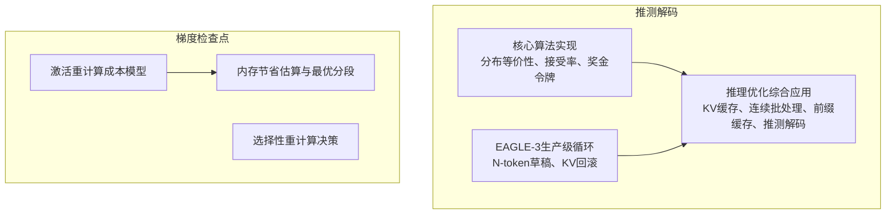
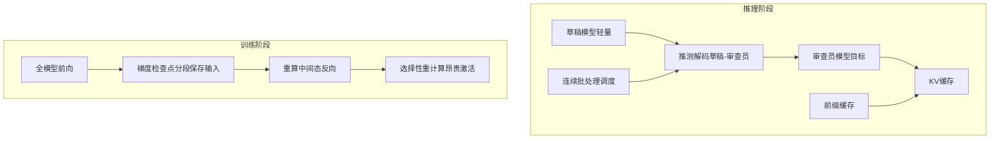
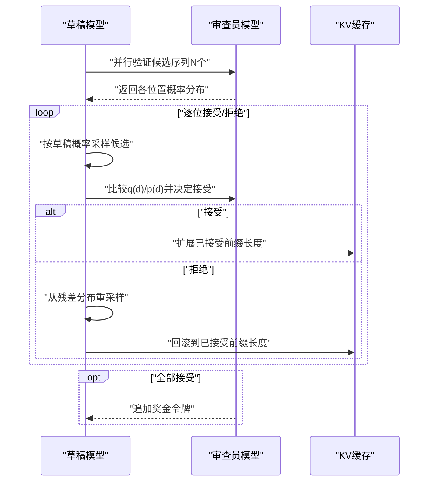
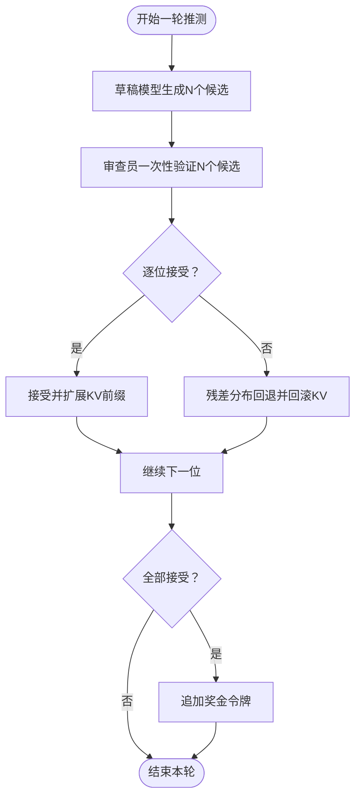
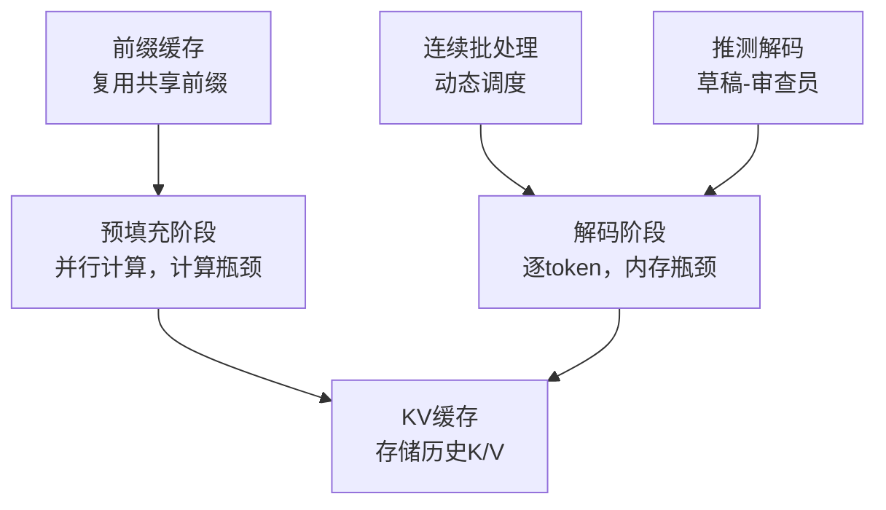
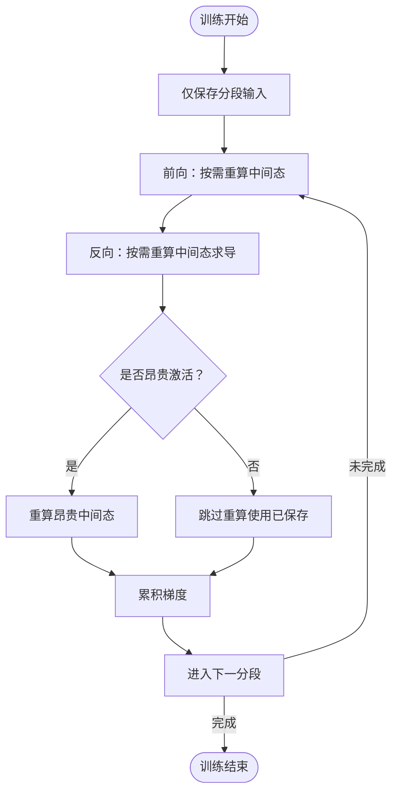
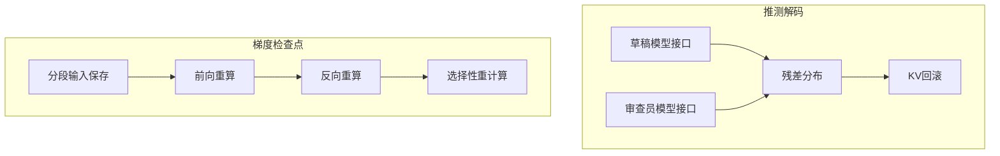

# 专项技术与实践

<cite>
**本文引用的文件列表**
- [推测解码核心算法与分布等价性](file://phases/07-transformers-deep-dive/16-speculative-decoding/code/main.py)
- [推测解码与EAGLE-3生产级实现](file://phases/10-llms-from-scratch/15-speculative-decoding-eagle3/code/main.py)
- [推理优化：KV缓存、连续批处理、前缀缓存与推测解码](file://phases/10-llms-from-scratch/12-inference-optimization/code/main.py)
- [梯度检查点与激活重计算](file://phases/10-llms-from-scratch/34-gradient-checkpointing/code/main.py)
- [推测解码概念与实现说明](file://phases/07-transformers-deep-dive/16-speculative-decoding/docs/en.md)
- [推理优化概念与实现说明](file://phases/10-llms-from-scratch/12-inference-optimization/docs/en.md)
- [梯度检查点概念与实现说明](file://phases/10-llms-from-scratch/34-gradient-checkpointing/docs/en.md)
- [自动微分与链式法则基础](file://phases/01-math-foundations/05-chain-rule-and-autodiff/docs/en.md)
</cite>

## 目录
1. [引言](#引言)
2. [项目结构](#项目结构)
3. [核心组件](#核心组件)
4. [架构总览](#架构总览)
5. [详细组件分析](#详细组件分析)
6. [依赖关系分析](#依赖关系分析)
7. [性能考量](#性能考量)
8. [故障排查指南](#故障排查指南)
9. [结论](#结论)
10. [附录](#附录)

## 引言
本文件聚焦两项在大模型训练与推理中具有关键瓶颈突破意义的专项技术：推测解码（Speculative Decoding）与梯度检查点（Gradient Checkpointing）。前者通过“草稿-审查员”架构显著降低解码阶段的延迟，后者通过“前向重算、反向优化”的策略大幅缓解训练阶段的内存压力。本文从系统架构、数据流、处理逻辑、集成点与错误处理等方面进行深入剖析，并结合仓库中的教学示例与文档，给出可操作的应用指南、性能评估方法、参数调优建议与常见问题排查路径，帮助高级开发者在真实项目中落地这些技术并获得稳定收益。

## 项目结构
围绕两项专项技术，仓库提供了从理论到实现再到工程化的完整教学路径：
- 推测解码：包含核心算法实现（伯努利接受/拒绝、残差分布、奖金令牌）、数学等价性验证、EAGLE-3生产级循环与KV回滚、以及在推理优化课程中的综合应用。
- 梯度检查点：包含激活重计算的成本模型、选择性重计算决策、内存节省估算与最优分段大小等。

图表来源
- [推测解码核心算法与分布等价性:1-160](file://phases/07-transformers-deep-dive/16-speculative-decoding/code/main.py#L1-L160)
- [推测解码与EAGLE-3生产级实现:1-261](file://phases/10-llms-from-scratch/15-speculative-decoding-eagle3/code/main.py#L1-L261)
- [推理优化：KV缓存、连续批处理、前缀缓存与推测解码:1-585](file://phases/10-llms-from-scratch/12-inference-optimization/code/main.py#L1-L585)
- [梯度检查点与激活重计算:1-163](file://phases/10-llms-from-scratch/34-gradient-checkpointing/code/main.py#L1-L163)

章节来源
- [推测解码核心算法与分布等价性:1-160](file://phases/07-transformers-deep-dive/16-speculative-decoding/code/main.py#L1-L160)
- [推测解码与EAGLE-3生产级实现:1-261](file://phases/10-llms-from-scratch/15-speculative-decoding-eagle3/code/main.py#L1-L261)
- [推理优化：KV缓存、连续批处理、前缀缓存与推测解码:1-585](file://phases/10-llms-from-scratch/12-inference-optimization/code/main.py#L1-L585)
- [梯度检查点与激活重计算:1-163](file://phases/10-llms-from-scratch/34-gradient-checkpointing/code/main.py#L1-L163)

## 核心组件
- 推测解码核心模块
  - 草稿-审查员接受/拒绝步骤与残差分布回退
  - N-token并行验证与奖金令牌机制
  - 数学等价性验证与接受率测量
- 生产级推测解码（EAGLE-3）
  - KV缓冲区回滚管理
  - 理论期望每轮令牌数与墙钟时间模型
- 推理优化综合实现
  - KV缓存、多头注意力、连续批处理、前缀缓存与推测解码的协同
- 梯度检查点
  - 分段保存输入、重算中间态、成本与内存模型、选择性重计算

章节来源
- [推测解码核心算法与分布等价性:41-99](file://phases/07-transformers-deep-dive/16-speculative-decoding/code/main.py#L41-L99)
- [推测解码与EAGLE-3生产级实现:61-98](file://phases/10-llms-from-scratch/15-speculative-decoding-eagle3/code/main.py#L61-L98)
- [推理优化：KV缓存、连续批处理、前缀缓存与推测解码:260-308](file://phases/10-llms-from-scratch/12-inference-optimization/code/main.py#L260-L308)
- [梯度检查点与激活重计算:49-72](file://phases/10-llms-from-scratch/34-gradient-checkpointing/code/main.py#L49-L72)

## 架构总览
推测解码与梯度检查点分别针对“推理延迟”和“训练内存”两大瓶颈，采用不同但同样高效的工程化手段。

图表来源
- [推测解码与EAGLE-3生产级实现:61-98](file://phases/10-llms-from-scratch/15-speculative-decoding-eagle3/code/main.py#L61-L98)
- [推理优化：KV缓存、连续批处理、前缀缓存与推测解码:260-308](file://phases/10-llms-from-scratch/12-inference-optimization/code/main.py#L260-L308)
- [梯度检查点与激活重计算:49-72](file://phases/10-llms-from-scratch/34-gradient-checkpointing/code/main.py#L49-L72)

## 详细组件分析

### 推测解码：草稿-审查员架构
- 核心思想
  - 草稿模型以较低成本生成候选序列，审查员一次性并行验证N个候选，按接受率决定接受或回退至残差分布；若全部接受则追加奖金令牌。
- 关键流程
  - 草稿生成：按草稿概率采样N个候选
  - 并行验证：审查员对候选序列做一次前向，得到各位置的概率分布
  - 接受/拒绝：逐位按最小值接受，首拒后回退至残差分布
  - 全收奖励：若全部接受，追加一个来自审查员下一位置分布的令牌
- 数学保证
  - 马尔可夫链上的分布等价性，确保输出分布与直接由审查员采样一致
- 性能影响因素
  - 接受率α越高、草稿质量越接近审查员、解码策略越确定（如贪心），速度提升越大
  - N越大，单次验证覆盖更多令牌，但草稿成本也线性增加

图表来源
- [推测解码核心算法与分布等价性:41-67](file://phases/07-transformers-deep-dive/16-speculative-decoding/code/main.py#L41-L67)
- [推测解码与EAGLE-3生产级实现:61-98](file://phases/10-llms-from-scratch/15-speculative-decoding-eagle3/code/main.py#L61-L98)

章节来源
- [推测解码核心算法与分布等价性:1-160](file://phases/07-transformers-deep-dive/16-speculative-decoding/code/main.py#L1-L160)
- [推测解码与EAGLE-3生产级实现:1-261](file://phases/10-llms-from-scratch/15-speculative-decoding-eagle3/code/main.py#L1-L261)
- [推测解码概念与实现说明:1-223](file://phases/07-transformers-deep-dive/16-speculative-decoding/docs/en.md#L1-L223)

### 推测解码：令牌生成策略与接受率优化
- 令牌生成策略
  - 草稿阶段：按草稿分布采样候选；审查阶段：按审查员分布验证
  - 残差分布用于拒绝回退，保持分布一致性
  - 全部接受时追加奖金令牌，提高每轮令牌产出
- 接受率优化
  - 提升草稿质量（同家族/相同语料训练、更接近审查员的特征表示）
  - 解码策略（贪心vs采样）对接受率有显著影响
  - 任务类型（结构化/代码vs自由写作）影响接受率
- 实践要点
  - N的选择需平衡草稿成本与验证收益
  - 在高接受率场景（α≈0.85）下，N=5可实现4-5令牌/验证轮的吞吐

图表来源
- [推测解码核心算法与分布等价性:52-67](file://phases/07-transformers-deep-dive/16-speculative-decoding/code/main.py#L52-L67)
- [推测解码与EAGLE-3生产级实现:61-98](file://phases/10-llms-from-scratch/15-speculative-decoding-eagle3/code/main.py#L61-L98)

章节来源
- [推测解码核心算法与分布等价性:108-114](file://phases/07-transformers-deep-dive/16-speculative-decoding/code/main.py#L108-L114)
- [推测解码与EAGLE-3生产级实现:148-163](file://phases/10-llms-from-scratch/15-speculative-decoding-eagle3/code/main.py#L148-L163)

### 推理优化：KV缓存、连续批处理与前缀缓存
- KV缓存
  - 存储历史Key/Value投影，避免重复计算，内存与计算的权衡
  - 内存公式与容量估算，指导硬件配置与并发用户上限
- 连续批处理
  - 动态插入新请求，减少空闲GPU槽位，显著提升吞吐
- 前缀缓存
  - 复用共享系统提示、上下文等公共前缀，减少冗余预填充
- 推测解码集成
  - 在连续批处理与KV回滚基础上，进一步降低端到端延迟

图表来源
- [推理优化：KV缓存、连续批处理、前缀缓存与推测解码:5-41](file://phases/10-llms-from-scratch/12-inference-optimization/code/main.py#L5-L41)
- [推理优化：KV缓存、连续批处理、前缀缓存与推测解码:122-161](file://phases/10-llms-from-scratch/12-inference-optimization/code/main.py#L122-L161)
- [推理优化：KV缓存、连续批处理、前缀缓存与推测解码:184-236](file://phases/10-llms-from-scratch/12-inference-optimization/code/main.py#L184-L236)
- [推理优化：KV缓存、连续批处理、前缀缓存与推测解码:260-308](file://phases/10-llms-from-scratch/12-inference-optimization/code/main.py#L260-L308)

章节来源
- [推理优化：KV缓存、连续批处理、前缀缓存与推测解码:1-585](file://phases/10-llms-from-scratch/12-inference-optimization/code/main.py#L1-L585)
- [推理优化概念与实现说明:1-784](file://phases/10-llms-from-scratch/12-inference-optimization/docs/en.md#L1-L784)

### 梯度检查点：内存节省与前向重算、反向优化
- 核心思想
  - 训练时保留输入，重算中间态；反向时按需重算，换取显著内存节省
- 成本模型
  - 分段大小k与重算FLOPs的关系，全重算约33%额外开销，选择性重算可降至5%
- 选择性重计算
  - 仅对昂贵激活（如注意力softmax）进行重算，保留线性投影等便宜项
- 最优分段
  - 对均匀层成本，经典规则为k≈√L；结合任务规模与通信/精度策略调整

图表来源
- [梯度检查点与激活重计算:49-72](file://phases/10-llms-from-scratch/34-gradient-checkpointing/code/main.py#L49-L72)
- [梯度检查点与激活重计算:75-93](file://phases/10-llms-from-scratch/34-gradient-checkpointing/code/main.py#L75-L93)
- [梯度检查点与激活重计算:109-118](file://phases/10-llms-from-scratch/34-gradient-checkpointing/code/main.py#L109-L118)

章节来源
- [梯度检查点与激活重计算:1-163](file://phases/10-llms-from-scratch/34-gradient-checkpointing/code/main.py#L1-L163)
- [梯度检查点概念与实现说明:1-303](file://phases/10-llms-from-scratch/34-gradient-checkpointing/docs/en.md#L1-L303)
- [自动微分与链式法则基础:1-239](file://phases/01-math-foundations/05-chain-rule-and-autodiff/docs/en.md#L1-L239)

## 依赖关系分析
- 推测解码
  - 依赖审查员与草稿模型的概率分布接口，以及残差分布计算
  - 与KV缓存协作，支持回滚与前缀复用
- 梯度检查点
  - 依赖前向图的可重算性与分段边界定义
  - 与分布式并行（TP/PP）及混合精度（FP8）存在交互约束

图表来源
- [推测解码核心算法与分布等价性:25-30](file://phases/07-transformers-deep-dive/16-speculative-decoding/code/main.py#L25-L30)
- [推测解码与EAGLE-3生产级实现:49-58](file://phases/10-llms-from-scratch/15-speculative-decoding-eagle3/code/main.py#L49-L58)
- [梯度检查点与激活重计算:49-72](file://phases/10-llms-from-scratch/34-gradient-checkpointing/code/main.py#L49-L72)

章节来源
- [推测解码核心算法与分布等价性:1-160](file://phases/07-transformers-deep-dive/16-speculative-decoding/code/main.py#L1-L160)
- [推测解码与EAGLE-3生产级实现:1-261](file://phases/10-llms-from-scratch/15-speculative-decoding-eagle3/code/main.py#L1-L261)
- [梯度检查点与激活重计算:1-163](file://phases/10-llms-from-scratch/34-gradient-checkpointing/code/main.py#L1-L163)

## 性能考量
- 推测解码
  - 速度提升主要取决于接受率α与草稿质量；N越大吞吐越高但草稿成本上升
  - 在高并发与长上下文场景，配合连续批处理与前缀缓存可进一步放大收益
- 梯度检查点
  - 选择性重计算在长序列注意力softmax主导内存时效果最佳
  - 与管道并行、张量并行、混合精度协同，可在不牺牲太多算力的前提下显著降低峰值内存

[本节为通用性能讨论，无需特定文件引用]

## 故障排查指南
- 推测解码
  - 分布等价性验证失败：检查草稿与审查员分布构造、残差归一化与随机种子
  - 接受率异常低：核对草稿质量、解码策略（温度采样会降低接受率）、任务类型
  - KV回滚不正确：确认回滚长度与提交时机，模拟短序列验证
- 梯度检查点
  - 梯度不匹配：确保重算路径与原前向一致，检查分段边界与重算顺序
  - 内存未降：评估是否选择了昂贵激活重算，或分段过大导致重算成本过高
  - 与分布式/混合精度冲突：关注缩放历史一致性与通信代价

章节来源
- [推测解码核心算法与分布等价性:70-99](file://phases/07-transformers-deep-dive/16-speculative-decoding/code/main.py#L70-L99)
- [推测解码与EAGLE-3生产级实现:105-132](file://phases/10-llms-from-scratch/15-speculative-decoding-eagle3/code/main.py#L105-L132)
- [梯度检查点与激活重计算:133-149](file://phases/10-llms-from-scratch/34-gradient-checkpointing/code/main.py#L133-L149)

## 结论
推测解码与梯度检查点分别从“推理延迟”和“训练内存”两个关键瓶颈切入，提供了工程上可直接落地的优化方案。前者通过草稿-审查员架构与N-token并行验证，在保证分布等价性的前提下实现2-4倍加速；后者通过分段保存输入与选择性重计算，将昂贵激活的内存占用降至可控范围。结合KV缓存、连续批处理、前缀缓存与分布式并行，可在真实生产环境中取得显著的吞吐与成本收益。

[本节为总结性内容，无需特定文件引用]

## 附录
- 实际应用建议
  - 推测解码：优先选择与审查员相近的草稿模型（如EAGLE-3），在高接受率场景（α≈0.85）下使用N=5；配合连续批处理与前缀缓存
  - 梯度检查点：对注意力softmax主导的长序列采用选择性重计算；根据任务规模与通信/精度策略调整分段大小
- 参考实现与文档
  - 推测解码：核心算法、EAGLE-3生产级循环、推理优化综合实现
  - 梯度检查点：成本模型、选择性重计算、内存估算与最优分段

章节来源
- [推测解码概念与实现说明:152-188](file://phases/07-transformers-deep-dive/16-speculative-decoding/docs/en.md#L152-L188)
- [推理优化概念与实现说明:198-222](file://phases/10-llms-from-scratch/12-inference-optimization/docs/en.md#L198-L222)
- [梯度检查点概念与实现说明:257-266](file://phases/10-llms-from-scratch/34-gradient-checkpointing/docs/en.md#L257-L266)