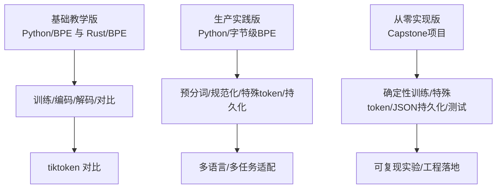
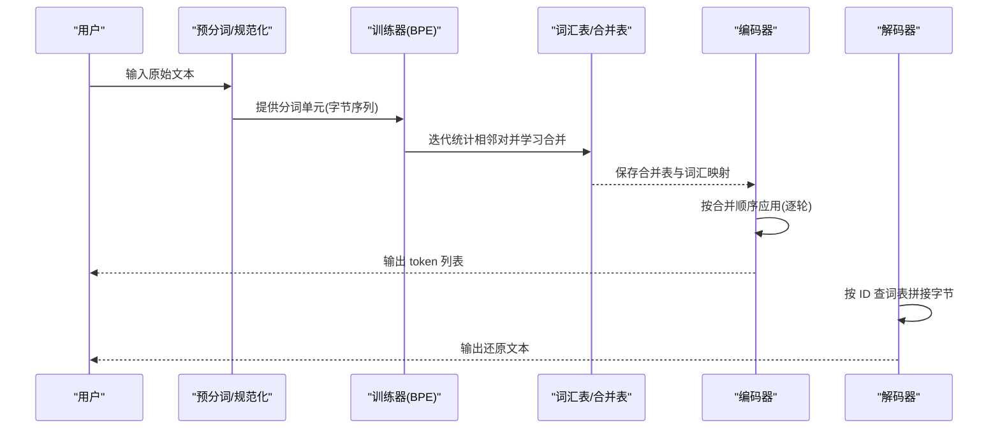
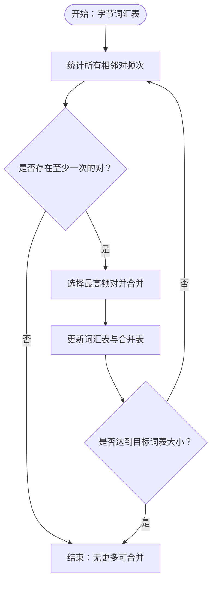
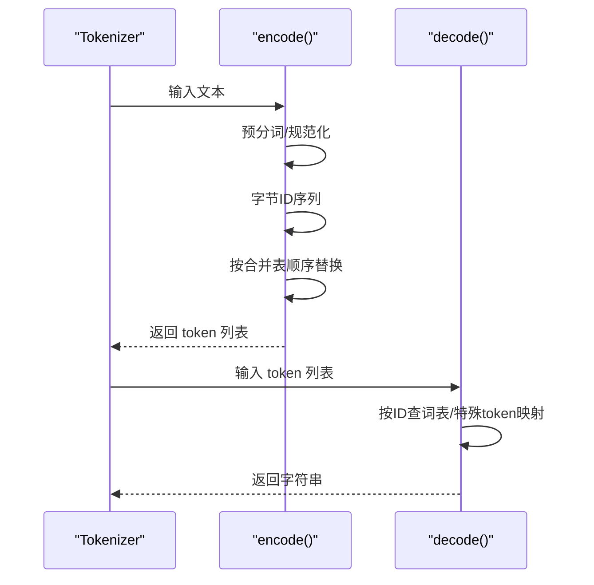
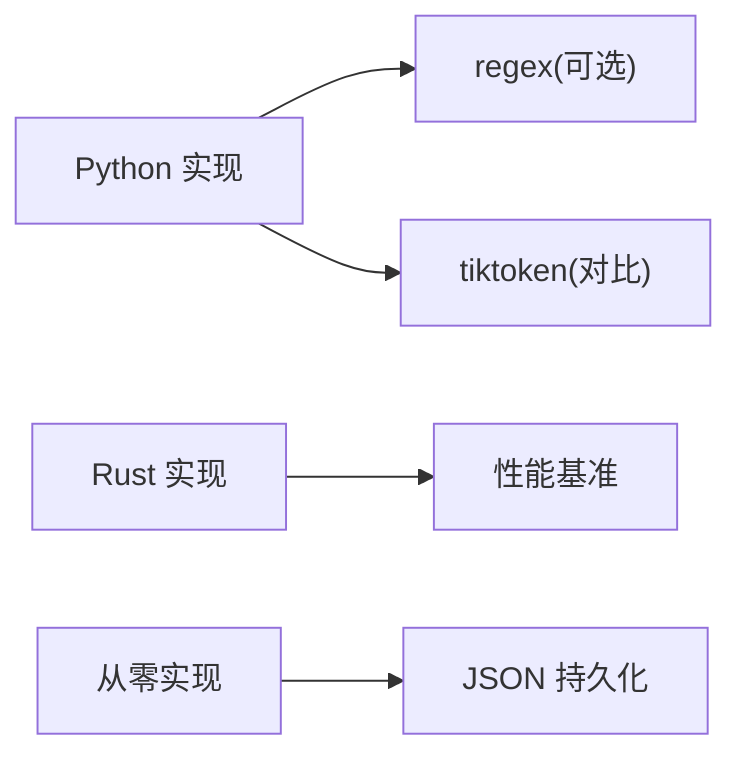

# 分词器基础与实现

<cite>
**本文引用的文件**
- [bpe.py](file://phases/10-llms-from-scratch/01-tokenizers/code/bpe.py)
- [bpe.rs](file://phases/10-llms-from-scratch/01-tokenizers/code/bpe.rs)
- [main.py（基础版）](file://phases/10-llms-from-scratch/01-tokenizers/code/main.py)
- [main.py（生产版）](file://phases/10-llms-from-scratch/02-building-a-tokenizer/code/main.py)
- [main.py（从零实现）](file://phases/19-capstone-projects/30-bpe-tokenizer-from-scratch/code/main.py)
- [test_bpe.py](file://phases/19-capstone-projects/30-bpe-tokenizer-from-scratch/code/tests/test_bpe.py)
- [en.md](file://phases/10-llms-from-scratch/01-tokenizers/docs/en.md)
- [zh.md](file://phases/10-llms-from-scratch/01-tokenizers/docs/zh.md)
- [context-budget-planner.js](file://site/vue-app/summary/src/data/modules/context-budget-planner.js)
- [lesson-figures.js](file://site/lesson-figures.js)
</cite>

## 目录
1. [简介](#简介)
2. [项目结构](#项目结构)
3. [核心组件](#核心组件)
4. [架构总览](#架构总览)
5. [详细组件分析](#详细组件分析)
6. [依赖分析](#依赖分析)
7. [性能考虑](#性能考虑)
8. [故障排查指南](#故障排查指南)
9. [结论](#结论)
10. [附录](#附录)

## 简介
本文件系统化梳理分词器（尤其是 BPE）的原理与实现，覆盖子词分割策略、词汇表构建、编码解码流程；对比 Rust 与 Python 的实现差异与适用场景；阐述分词器在大语言模型中的关键作用（上下文长度、词汇覆盖率、推理效率）；并提供从零构建分词器的完整指南（数据预处理、算法优化、内存管理与性能调优）。

## 项目结构
围绕分词器主题，本仓库包含三类实现与配套文档：
- 基础教学版：Python/BPE 与 Rust/BPE 的对照实现，演示训练、编码、解码与与 tiktoken 对比
- 生产实践版：在 Python 中加入预分词、规范化、特殊 token、持久化等工程要素
- 从零实现版：Capstone 项目，提供确定性训练、特殊 token、JSON 持久化与严格测试

图示来源
- [bpe.py:1-134](file://phases/10-llms-from-scratch/01-tokenizers/code/bpe.py#L1-L134)
- [bpe.rs:1-152](file://phases/10-llms-from-scratch/01-tokenizers/code/bpe.rs#L1-L152)
- [main.py（基础版）:1-228](file://phases/10-llms-from-scratch/01-tokenizers/code/main.py#L1-L228)
- [main.py（生产版）:1-259](file://phases/10-llms-from-scratch/02-building-a-tokenizer/code/main.py#L1-L259)
- [main.py（从零实现）:1-345](file://phases/19-capstone-projects/30-bpe-tokenizer-from-scratch/code/main.py#L1-L345)

章节来源
- [en.md:1-479](file://phases/10-llms-from-scratch/01-tokenizers/docs/en.md#L1-L479)
- [zh.md:1-479](file://phases/10-llms-from-scratch/01-tokenizers/docs/zh.md#L1-L479)

## 核心组件
- 字节级 BPE 训练器（Python/Rust）：以 0–255 字节为基底词汇，迭代合并最频繁相邻对，生成“合并表”即词典
- 编码器/解码器：编码按合并表顺序执行；解码将 token 映射回字节并解码为字符串
- 预分词与规范化：生产版引入正则预分词、Unicode 规范化，提升多语言与代码场景效果
- 特殊 token 管理：保留高位 ID 区间，支持 <eos>/<pad> 等控制符
- 持久化与加载：以 JSON 序列化合并表、词汇表与特殊 token 映射

章节来源
- [bpe.py:4-60](file://phases/10-llms-from-scratch/01-tokenizers/code/bpe.py#L4-L60)
- [bpe.rs:3-94](file://phases/10-llms-from-scratch/01-tokenizers/code/bpe.rs#L3-L94)
- [main.py（基础版）:12-66](file://phases/10-llms-from-scratch/01-tokenizers/code/main.py#L12-L66)
- [main.py（生产版）:59-124](file://phases/10-llms-from-scratch/02-building-a-tokenizer/code/main.py#L59-L124)
- [main.py（从零实现）:23-64](file://phases/19-capstone-projects/30-bpe-tokenizer-from-scratch/code/main.py#L23-L64)

## 架构总览
下图展示从文本到 token 的端到端流程，涵盖预处理、训练、编码与解码阶段：

图示来源
- [main.py（生产版）:66-124](file://phases/10-llms-from-scratch/02-building-a-tokenizer/code/main.py#L66-L124)
- [main.py（从零实现）:104-132](file://phases/19-capstone-projects/30-bpe-tokenizer-from-scratch/code/main.py#L104-L132)
- [main.py（从零实现）:182-231](file://phases/19-capstone-projects/30-bpe-tokenizer-from-scratch/code/main.py#L182-L231)

## 详细组件分析

### BPE 训练与合并策略
- 基础策略：以字节为基本单元，统计相邻对频次，贪心选取最高频对进行合并，直至达到目标词表规模
- 确定性训练：从零实现版通过“同频排序”打破 tie，确保多次运行结果一致
- 合并顺序的重要性：编码时必须按“学习顺序”应用合并，先形成中间 token 再组合为更高层 token

图示来源
- [bpe.py:27-43](file://phases/10-llms-from-scratch/01-tokenizers/code/bpe.py#L27-L43)
- [bpe.rs:43-73](file://phases/10-llms-from-scratch/01-tokenizers/code/bpe.rs#L43-L73)
- [main.py（从零实现）:104-132](file://phases/19-capstone-projects/30-bpe-tokenizer-from-scratch/code/main.py#L104-L132)

章节来源
- [bpe.py:9-42](file://phases/10-llms-from-scratch/01-tokenizers/code/bpe.py#L9-L42)
- [bpe.rs:20-72](file://phases/10-llms-from-scratch/01-tokenizers/code/bpe.rs#L20-L72)
- [main.py（从零实现）:80-132](file://phases/19-capstone-projects/30-bpe-tokenizer-from-scratch/code/main.py#L80-L132)

### 编码与解码流程
- 编码：将文本按预分词拆分为“词块”，每块转为字节 ID 序列，随后按合并表顺序反复替换相邻对为新 ID
- 解码：按 ID 查词表，拼接字节后整体解码为字符串；特殊 token 可直接映射为字节串

图示来源
- [main.py（生产版）:97-117](file://phases/10-llms-from-scratch/02-building-a-tokenizer/code/main.py#L97-L117)
- [main.py（从零实现）:182-231](file://phases/19-capstone-projects/30-bpe-tokenizer-from-scratch/code/main.py#L182-L231)

章节来源
- [bpe.py:45-59](file://phases/10-llms-from-scratch/01-tokenizers/code/bpe.py#L45-L59)
- [bpe.rs:75-89](file://phases/10-llms-from-scratch/01-tokenizers/code/bpe.rs#L75-L89)
- [main.py（基础版）:51-59](file://phases/10-llms-from-scratch/01-tokenizers/code/main.py#L51-L59)

### 预分词与规范化
- 正则预分词：GPT-2 风格的正则表达式，区分字母、数字、标点与空白，避免跨边界合并
- Unicode 规范化：NFKC 规范化减少形态变化带来的歧义
- 特殊 token：优先匹配最长字符串，避免误切

章节来源
- [main.py（生产版）:17-18](file://phases/10-llms-from-scratch/02-building-a-tokenizer/code/main.py#L17-L18)
- [main.py（生产版）:66-67](file://phases/10-llms-from-scratch/02-building-a-tokenizer/code/main.py#L66-L67)
- [main.py（生产版）:34-57](file://phases/10-llms-from-scratch/02-building-a-tokenizer/code/main.py#L34-L57)

### 特殊 token 与持久化
- 特殊 token：保留高位 ID 区间，支持 <eos>/<pad> 等；编码时可选择允许/禁止特殊 token
- 持久化：将词表、合并表与特殊 token 映射序列化为 JSON，便于部署与复用

章节来源
- [main.py（从零实现）:49-64](file://phases/19-capstone-projects/30-bpe-tokenizer-from-scratch/code/main.py#L49-L64)
- [main.py（从零实现）:233-266](file://phases/19-capstone-projects/30-bpe-tokenizer-from-scratch/code/main.py#L233-L266)

### Rust 与 Python 实现对比
- 性能：Rust 版本在 encode 循环中具备明确的性能基准输出，适合高吞吐场景
- 可读性：Python 版本更易理解训练与编码流程，适合教学与原型开发
- 工程化：生产版 Python 引入预分词、规范化、特殊 token 与持久化，贴近真实服务需求

章节来源
- [bpe.rs:136-151](file://phases/10-llms-from-scratch/01-tokenizers/code/bpe.rs#L136-L151)
- [main.py（基础版）:222-228](file://phases/10-llms-from-scratch/01-tokenizers/code/main.py#L222-L228)

## 依赖分析
- 数据结构依赖
  - Python：Counter/字典/列表；Rust：HashMap/Vec/元组
- 外部库
  - tiktoken：用于与工业级 BPE 实现对比
  - regex（可选）：正则预分词
- 文件依赖
  - 从零实现版通过 JSON 文件保存/加载词表与合并表

图示来源
- [main.py（生产版）:6-14](file://phases/10-llms-from-scratch/02-building-a-tokenizer/code/main.py#L6-L14)
- [main.py（基础版）:101-106](file://phases/10-llms-from-scratch/01-tokenizers/code/main.py#L101-L106)
- [main.py（从零实现）:233-266](file://phases/19-capstone-projects/30-bpe-tokenizer-from-scratch/code/main.py#L233-L266)

章节来源
- [main.py（生产版）:6-14](file://phases/10-llms-from-scratch/02-building-a-tokenizer/code/main.py#L6-L14)
- [main.py（基础版）:101-106](file://phases/10-llms-from-scratch/01-tokenizers/code/main.py#L101-L106)
- [main.py（从零实现）:233-266](file://phases/19-capstone-projects/30-bpe-tokenizer-from-scratch/code/main.py#L233-L266)

## 性能考虑
- 词汇表规模与序列长度
  - 更大的词表通常带来更低的 token 数量与更短序列，有利于降低注意力开销
  - 词表增大也会增加嵌入与输出层参数规模，需在“序列长度收益”与“参数规模成本”之间权衡
- 压缩比与推理速度
  - 压缩比越低（token/字节），推理越高效；但需结合下游任务的“多语言/代码”特性选择合适词表
- 上下文预算与利用率
  - 上下文长度限制直接影响可处理文本总量；通过优化分词器可提升有效信息密度
  - 评估与规划：利用上下文预算管理器估算各组件的 token 占用与剩余空间

章节来源
- [en.md:164-187](file://phases/10-llms-from-scratch/01-tokenizers/docs/en.md#L164-L187)
- [lesson-figures.js:626-653](file://site/lesson-figures.js#L626-L653)
- [context-budget-planner.js:60-96](file://site/vue-app/summary/src/data/modules/context-budget-planner.js#L60-L96)

## 故障排查指南
- 编码解码往返失败
  - 检查特殊 token 是否正确映射；确认 decode 时对未知 ID 的处理
- 未登录词与未知 token
  - 从零实现版在 decode 时对未知 ID 抛错；建议在工程版中采用容错策略（如替换为占位符）
- 训练不稳定或结果不可复现
  - 从零实现版通过“同频排序”打破 tie，确保训练确定性；若仍不稳定，检查输入语料与预分词规则
- 性能瓶颈
  - Rust 版本提供性能基准参考；Python 版本可通过缓存/向量化优化（视具体实现）

章节来源
- [main.py（从零实现）:220-231](file://phases/19-capstone-projects/30-bpe-tokenizer-from-scratch/code/main.py#L220-L231)
- [test_bpe.py:33-109](file://phases/19-capstone-projects/30-bpe-tokenizer-from-scratch/code/tests/test_bpe.py#L33-L109)
- [bpe.rs:136-151](file://phases/10-llms-from-scratch/01-tokenizers/code/bpe.rs#L136-L151)

## 结论
- BPE 是现代大模型分词的基石：以字节为基底、贪心合并高频相邻对，兼顾鲁棒性与压缩效率
- 工程化落地需关注：预分词、规范化、特殊 token、持久化与确定性训练
- Rust 与 Python 各有侧重：Rust 适合高性能推理，Python 适合教学与快速迭代
- 分词器直接影响上下文长度、词汇覆盖率与推理效率，应结合任务特性（多语言/代码）与预算约束进行权衡

## 附录

### 分词器构建指南（从零到可用）
- 数据预处理
  - 清洗与规范化：统一 Unicode 形态，去除异常空白
  - 预分词：使用正则将文本拆分为“词块”，避免跨边界合并
- 算法实现
  - 训练：统计相邻对频次，按贪心策略合并至目标词表大小；从零实现版确保确定性
  - 编码：按合并表顺序从左到右扫描替换，避免重复扫描
  - 解码：按 ID 查词表，拼接字节并解码；特殊 token 直接映射
- 工程优化
  - 内存管理：优先使用紧凑数据结构（Rust Vec/HashMap 或 Python dict/collections.Counter）
  - 并发与缓存：对常用文本可做编码缓存；批量处理时尽量减少重复统计
  - 持久化：以 JSON 保存词表、合并表与特殊 token 映射，便于部署与版本管理
- 性能调优
  - 词表规模：根据任务与预算选择 32K–128K+；结合“tokens/word”指标评估
  - 多语言与代码：优先提升非英语脚本与代码片段的压缩比，减少“多语言税”
  - 对比验证：与 tiktoken 等工业实现对比，定位差距并迭代

章节来源
- [main.py（生产版）:17-18](file://phases/10-llms-from-scratch/02-building-a-tokenizer/code/main.py#L17-L18)
- [main.py（从零实现）:104-132](file://phases/19-capstone-projects/30-bpe-tokenizer-from-scratch/code/main.py#L104-L132)
- [test_bpe.py:55-78](file://phases/19-capstone-projects/30-bpe-tokenizer-from-scratch/code/tests/test_bpe.py#L55-L78)