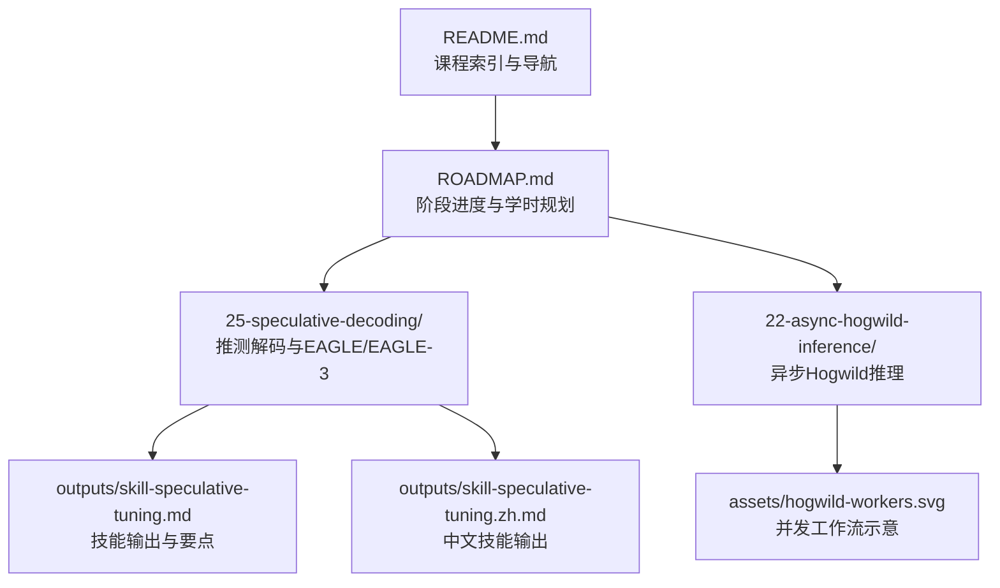
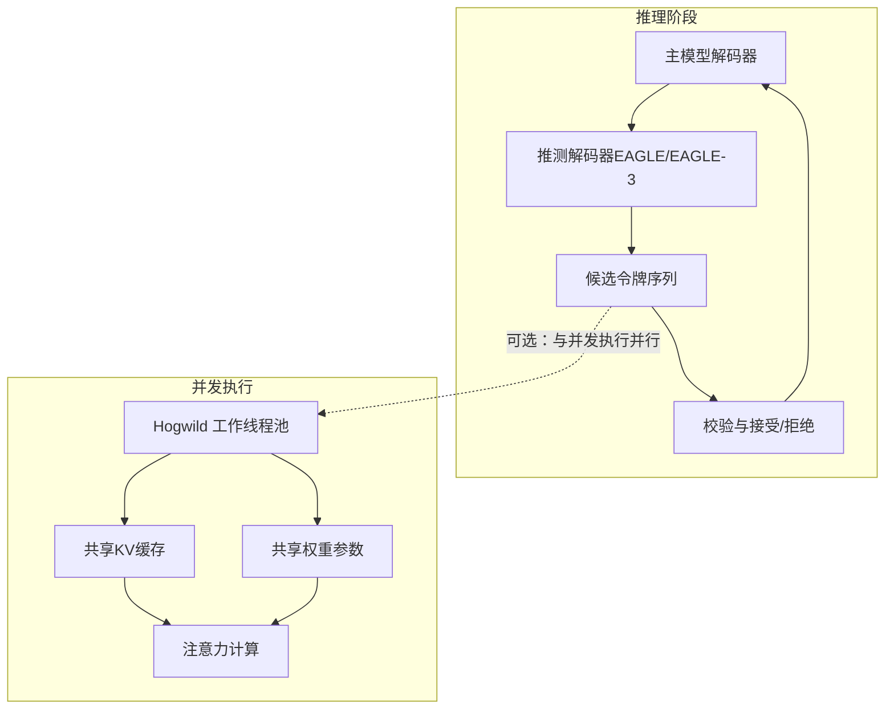
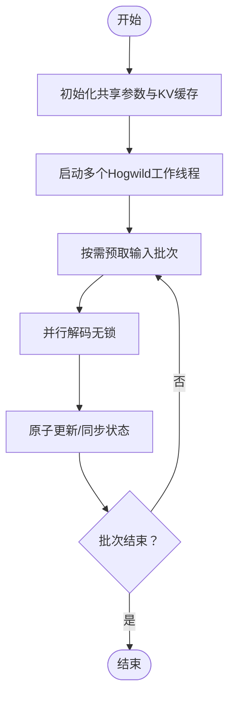
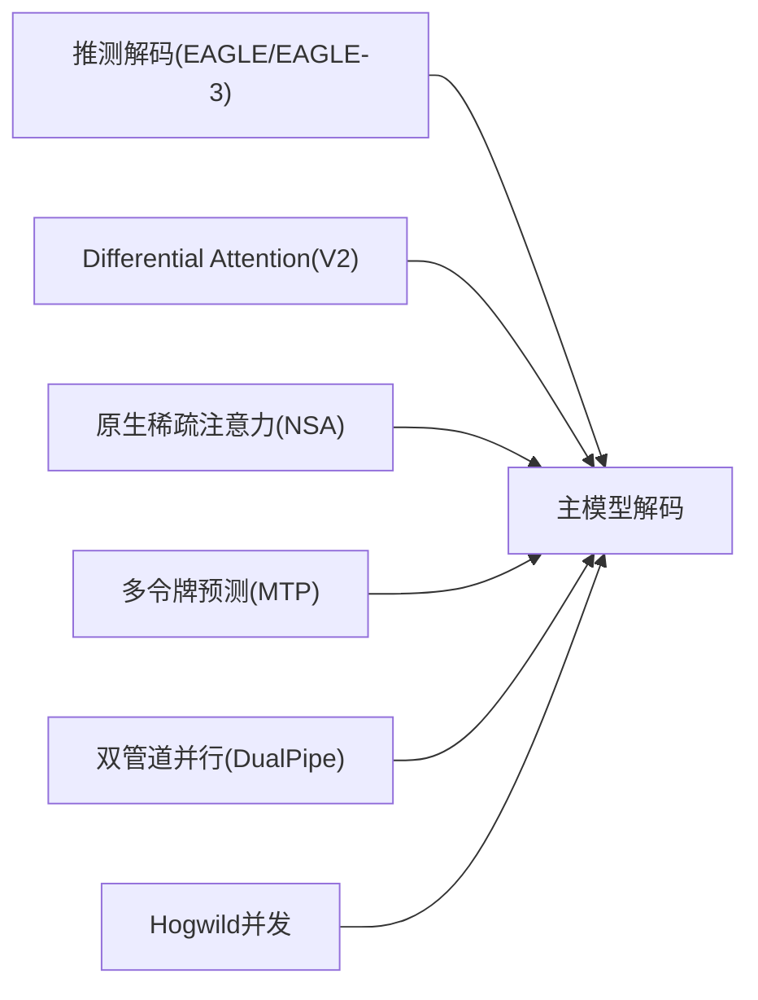

# 前沿技术探索

<cite>
**本文引用的文件**
- [README.md](file://README.md)
- [ROADMAP.md](file://ROADMAP.md)
- [25-speculative-decoding/outputs/skill-speculative-tuning.md](file://phases/10-llms-from-scratch/25-speculative-decoding/outputs/skill-speculative-tuning.md)
- [25-speculative-decoding/outputs/skill-speculative-tuning.zh.md](file://phases/10-llms-from-scratch/25-speculative-decoding/outputs/skill-speculative-tuning.zh.md)
- [22-async-hogwild-inference/assets/hogwild-workers.svg](file://phases/10-llms-from-scratch/22-async-hogwild-inference/assets/hogwild-workers.svg)
</cite>

## 目录
1. [引言](#引言)
2. [项目结构](#项目结构)
3. [核心组件](#核心组件)
4. [架构总览](#架构总览)
5. [详细组件分析](#详细组件分析)
6. [依赖关系分析](#依赖关系分析)
7. [性能考量](#性能考量)
8. [故障排查指南](#故障排查指南)
9. [结论](#结论)
10. [附录](#附录)

## 引言
本文件聚焦于“前沿技术探索”主题，系统梳理与实现仓库中关于高效推理与架构创新的相关内容，覆盖以下方向：
- 混合专家与混合架构：DeepSeek V3 的 MoE 设计、Jamba 的 SSM-Transformer 混合栈
- 推测解码：EAGLE/EAGLE-3 多步预测策略、Differential Attention 的注意力优化
- 稀疏注意力、多令牌预测、双管道并行等高效推理技术
- 异步 Hogwild 推理的并发控制、状态同步与性能优化

目标是帮助读者从原理到实践全面理解这些前沿技术如何在工程上落地，并评估其在提升模型效率、降低推理成本方面的潜力与适用场景。

## 项目结构
该仓库以“阶段化学习路径”组织内容，前沿技术主要分布在“LLMs from Scratch”阶段（Phase 10）下的多个子课程与输出材料中。下图给出与“前沿技术探索”直接相关的核心模块与对应文件位置概览。

图表来源
- [README.md:521-546](file://README.md#L521-L546)
- [ROADMAP.md:243-270](file://ROADMAP.md#L243-L270)
- [25-speculative-decoding/outputs/skill-speculative-tuning.md](file://phases/10-llms-from-scratch/25-speculative-decoding/outputs/skill-speculative-tuning.md)
- [25-speculative-decoding/outputs/skill-speculative-tuning.zh.md](file://phases/10-llms-from-scratch/25-speculative-decoding/outputs/skill-speculative-tuning.zh.md)
- [22-async-hogwild-inference/assets/hogwild-workers.svg](file://phases/10-llms-from-scratch/22-async-hogwild-inference/assets/hogwald-workers.svg)

章节来源
- [README.md:521-546](file://README.md#L521-L546)
- [ROADMAP.md:243-270](file://ROADMAP.md#L243-L270)

## 核心组件
围绕前沿技术探索，本仓库提供了如下核心组件与学习资源：
- 推测解码与 EAGLE/EAGLE-3：通过多步预测策略减少主模型解码开销，提高吞吐
- Differential Attention（V2）：注意力优化，降低计算冗余
- 原生稀疏注意力（DeepSeek NSA）：在长上下文下显著降低注意力复杂度
- 多令牌预测（MTP）：一次生成多个输出令牌，提升解码并行度
- 双管道并行（DualPipe）：预填充与解码阶段的流水线并行
- DeepSeek V3 架构通读：混合专家（MoE）设计与路由机制
- Jamba 混合 SSM-Transformer 架构：状态空间模型与 Transformer 的融合
- 异步 Hogwild 推理：无锁并发解码与状态同步策略

章节来源
- [README.md:521-546](file://README.md#L521-L546)
- [ROADMAP.md:243-270](file://ROADMAP.md#L243-L270)

## 架构总览
下图展示“推测解码”与“异步Hogwild推理”的高层交互关系与数据流，体现两种前沿技术在推理阶段的协同潜力：前者通过“先验模型”进行多步预测，后者通过“无锁并发”提升吞吐。

说明
- 推测解码通过“先验模型”快速生成候选序列，主模型仅对最终结果进行校验，从而降低主模型调用次数
- Hogwild 采用无锁共享状态，多线程/多进程并行解码，结合 KV 缓存复用提升吞吐

（本图为概念性架构示意，不直接映射具体源文件）

## 详细组件分析

### 推测解码与 EAGLE/EAGLE-3
- 技术要点
  - 多步预测策略：使用轻量“先验模型”一次性生成多个候选令牌，再由主模型逐个校验
  - 减少主模型调用次数，提升吞吐；同时保持输出质量
- 实践建议
  - 先验模型规模应小于主模型，但具备足够泛化能力
  - 候选序列长度与接受率需权衡：过长会增加校验负担，过短则收益有限
  - 结合 KV 缓存与流水线并行，进一步降低延迟
- 适用场景
  - 高吞吐对话/生成服务
  - 批量推理任务（如日志生成、代码补全）

章节来源
- [README.md:521-546](file://README.md#L521-L546)
- [ROADMAP.md:243-270](file://ROADMAP.md#L243-L270)
- [25-speculative-decoding/outputs/skill-speculative-tuning.md](file://phases/10-llms-from-scratch/25-speculative-decoding/outputs/skill-speculative-tuning.md)
- [25-speculative-decoding/outputs/skill-speculative-tuning.zh.md](file://phases/10-llms-from-scratch/25-speculative-decoding/outputs/skill-speculative-tuning.zh.md)

### Differential Attention（V2）
- 技术要点
  - 通过注意力优化减少重复计算，提升解码效率
  - 在保持精度的同时降低注意力层的算力消耗
- 实践建议
  - 与 KV 缓存配合使用，避免重复计算历史键值
  - 在多头注意力中识别冗余头或低贡献头，进行裁剪或稀疏化
- 适用场景
  - 长上下文对话与检索增强生成
  - 对延迟敏感的在线服务

章节来源
- [README.md:521-546](file://README.md#L521-L546)
- [ROADMAP.md:243-270](file://ROADMAP.md#L243-L270)

### 原生稀疏注意力（DeepSeek NSA）
- 技术要点
  - 在注意力计算中引入稀疏连接，显著降低复杂度
  - 适合长序列与高分辨率输入（如视觉/音频）
- 实践建议
  - 合理设置稀疏模式（块状、锥形、随机），平衡准确率与速度
  - 与分块/流水线并行结合，最大化硬件利用率
- 适用场景
  - 超长上下文（数万令牌级）的阅读理解与摘要
  - 视频/语音等多模态序列建模

章节来源
- [README.md:521-546](file://README.md#L521-L546)
- [ROADMAP.md:243-270](file://ROADMAP.md#L243-L270)

### 多令牌预测（MTP）
- 技术要点
  - 单次前向同时预测多个输出令牌，减少主模型调用频率
  - 与滑动窗口/重叠窗口结合，缓解长依赖问题
- 实践建议
  - 将 MTP 与推测解码结合：先验模型负责多步预测，主模型进行最终校验
  - 控制预测长度，避免过多回滚与重算
- 适用场景
  - 交互式对话（降低首 token 延迟）
  - 文本生成流水线中的并行化阶段

章节来源
- [README.md:521-546](file://README.md#L521-L546)
- [ROADMAP.md:243-270](file://ROADMAP.md#L243-L270)

### 双管道并行（DualPipe）
- 技术要点
  - 将“预填充（prefill）”与“解码（decode）”阶段分离，分别在不同管道/设备上运行
  - 提升整体吞吐，缩短端到端延迟
- 实践建议
  - 预填充阶段尽量批量化，解码阶段尽量流水线化
  - 注意跨阶段的数据传输与同步开销
- 适用场景
  - 多 GPU/多节点分布式推理
  - 云原生弹性扩缩容环境

章节来源
- [README.md:521-546](file://README.md#L521-L546)
- [ROADMAP.md:243-270](file://ROADMAP.md#L243-L270)

### DeepSeek V3 架构通读（混合专家 MoE）
- 技术要点
  - 使用 MoE 降低参数与计算开销，同时保持表达能力
  - 关注专家选择（路由）策略与负载均衡
- 实践建议
  - 路由器设计需兼顾稀疏性与准确性
  - 训练与推理的专家激活一致性
- 适用场景
  - 超大规模语言模型部署
  - 多任务/多领域统一模型

章节来源
- [README.md:521-546](file://README.md#L521-L546)
- [ROADMAP.md:243-270](file://ROADMAP.md#L243-L270)

### Jamba 混合 SSM-Transformer 架构
- 技术要点
  - 将状态空间模型（SSM）与 Transformer 结合，兼顾长期依赖与局部建模
  - SSM 在线性复杂度下建模长程依赖，Transformer 捕捉局部相关性
- 实践建议
  - 根据任务特性调整 SSM 与 Transformer 的比例
  - 注意数值稳定性与内存占用
- 适用场景
  - 长序列时间序列/文本建模
  - 多模态融合（视觉/语音）中的时序建模

章节来源
- [README.md:521-546](file://README.md#L521-L546)
- [ROADMAP.md:243-270](file://ROADMAP.md#L243-L270)

### 异步 Hogwild 推理
- 技术要点
  - 无锁并发：多个工作线程共享权重与 KV 缓存，避免锁竞争
  - 状态同步：通过原子操作与内存屏障保证一致性
  - 性能优化：合理划分任务粒度、减少缓存抖动
- 实践建议
  - 为不同请求分配独立的 KV 缓存副本，降低冲突
  - 控制并发度，避免过度竞争导致吞吐下降
- 适用场景
  - 高并发在线服务
  - 流水线化批量推理

图表来源
- [22-async-hogwild-inference/assets/hogwild-workers.svg](file://phases/10-llms-from-scratch/22-async-hogwild-inference/assets/hogwild-workers.svg)

章节来源
- [README.md:521-546](file://README.md#L521-L546)
- [ROADMAP.md:243-270](file://ROADMAP.md#L243-L270)
- [22-async-hogwild-inference/assets/hogwild-workers.svg](file://phases/10-llms-from-scratch/22-async-hogwild-inference/assets/hogwild-workers.svg)

## 依赖关系分析
- 推测解码与异步Hogwild推理存在互补关系：前者通过“先验模型+校验”减少主模型调用，后者通过“无锁并发+共享状态”提升吞吐
- 与注意力优化（Differential Attention、NSA）结合，可在长上下文与高并发场景下进一步降低延迟与提升吞吐
- DualPipe 并行与推测解码可叠加：预填充阶段并行化，解码阶段采用推测与并发

（本图为概念性依赖示意，不直接映射具体源文件）

## 性能考量
- 吞吐与延迟权衡：推测解码与 MTP 通过减少主模型调用次数提升吞吐，但需控制候选长度与校验开销
- 内存与带宽：稀疏注意力与并行策略需关注显存占用与通信带宽
- 并发一致性：Hogwild 无锁并发需谨慎处理共享状态更新，避免数据竞争
- 扩展性：MoE 与 DualPipe 在多 GPU/多节点环境下具有更好扩展性

（本节为通用性能讨论，不直接分析具体文件）

## 故障排查指南
- 推测解码效果不佳
  - 检查先验模型质量与候选长度设置
  - 校验接受率是否过低导致回滚频繁
- 注意力计算异常或显存溢出
  - 调整稀疏模式与注意力头数
  - 分块/流水线并行，降低单次峰值显存
- 并发冲突与吞吐下降
  - 降低并发度或拆分 KV 缓存副本
  - 检查原子操作与内存屏障使用是否正确
- 长上下文性能不达预期
  - 结合 NSA 与 Differential Attention
  - 评估 DualPipe 的预填充/解码比例

（本节为通用排查建议，不直接分析具体文件）

## 结论
本仓库围绕“前沿技术探索”提供了从理论到实践的完整学习路径。通过将推测解码、注意力优化、稀疏化、多令牌预测、双管道并行与异步 Hogwild 推理相结合，可以在保证输出质量的前提下显著提升推理效率、降低延迟与成本。建议在实际工程中根据任务特性与资源约束，选择合适的组合策略并持续进行性能调优。

（本节为总结性内容，不直接分析具体文件）

## 附录
- 相关课程与输出材料可参考 README 与 ROADMAP 中的 Phase 10 课程索引
- 推测解码技能输出（英文与中文）位于对应 outputs 目录

章节来源
- [README.md:521-546](file://README.md#L521-L546)
- [ROADMAP.md:243-270](file://ROADMAP.md#L243-L270)