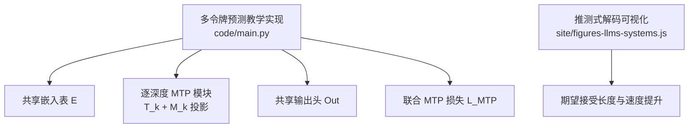
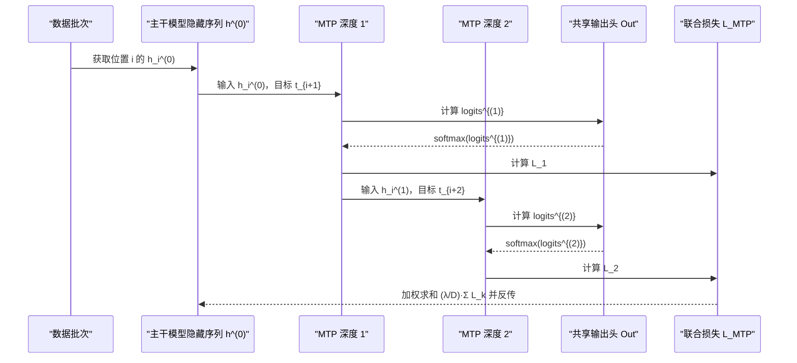
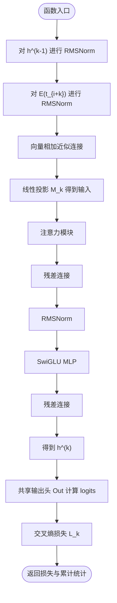
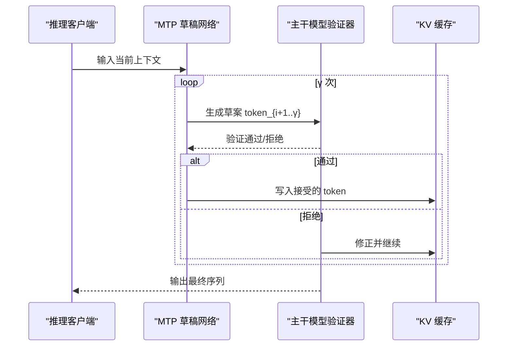
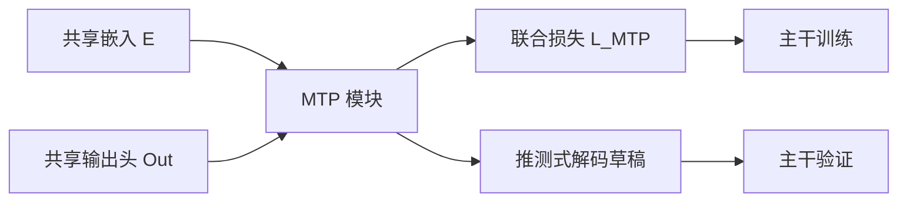

# 多令牌预测

<cite>
**本文引用的文件**   
- [phases/10-llms-from-scratch/18-multi-token-prediction/code/main.py](file://phases/10-llms-from-scratch/18-multi-token-prediction/code/main.py)
- [phases/10-llms-from-scratch/18-multi-token-prediction/docs/en.md](file://phases/10-llms-from-scratch/18-multi-token-prediction/docs/en.md)
- [site/figures-llms-systems.js](file://site/figures-llms-systems.js)
</cite>

## 目录
1. [引言](#引言)
2. [项目结构](#项目结构)
3. [核心组件](#核心组件)
4. [架构总览](#架构总览)
5. [详细组件分析](#详细组件分析)
6. [依赖分析](#依赖分析)
7. [性能考量](#性能考量)
8. [故障排查指南](#故障排查指南)
9. [结论](#结论)
10. [附录](#附录)

## 引言
本技术文档围绕“多令牌预测（Multi-Token Prediction, MTP）”展开，系统阐述其在深度学习语言模型训练与推理中的关键思想与实现要点。MTP 在传统“逐令牌”监督的基础上，引入“多深度”预测目标，使每个隐藏状态同时被监督以预测未来多个令牌，从而获得更密集的训练信号，并在推理阶段可直接复用为“推测式解码（Speculative Decoding）”的草稿网络，带来吞吐量显著提升。本文结合仓库中的教学实现与文档，给出算法流程、数据与处理逻辑、内存与参数开销、以及与现有推理优化技术（如推测式解码、EAGLE）的对比分析。

## 项目结构
本次文档聚焦于“多令牌预测”教学实现与说明文档，核心文件如下：
- 教学实现：phases/10-llms-from-scratch/18-multi-token-prediction/code/main.py
- 教学文档：phases/10-llms-from-scratch/18-multi-token-prediction/docs/en.md
- 推测式解码可视化：site/figures-llms-systems.js（用于理解推测式解码的吞吐量收益）

图表来源
- [phases/10-llms-from-scratch/18-multi-token-prediction/code/main.py:1-279](file://phases/10-llms-from-scratch/18-multi-token-prediction/code/main.py#L1-L279)
- [site/figures-llms-systems.js:73-116](file://site/figures-llms-systems.js#L73-L116)

章节来源
- [phases/10-llms-from-scratch/18-multi-token-prediction/code/main.py:1-279](file://phases/10-llms-from-scratch/18-multi-token-prediction/code/main.py#L1-L279)
- [phases/10-llms-from-scratch/18-multi-token-prediction/docs/en.md:1-201](file://phases/10-llms-from-scratch/18-multi-token-prediction/docs/en.md#L1-L201)

## 核心组件
- 共享嵌入表 E：主干模型与所有 MTP 深度共享同一份词嵌入矩阵，避免重复参数。
- 逐深度 MTP 模块 T_k：每个深度 k 包含一个小型 Transformer 块（注意力 + MLP），用于预测第 k 层的目标令牌。
- 投影矩阵 M_k：将前一层隐藏状态与目标令牌嵌入进行融合（本教学实现采用向量加法近似连接），得到该深度的输入。
- 共享输出头 Out：直接复用主干模型的输出投影，计算各候选令牌的对数几率。
- 联合 MTP 损失 L_MTP：对每个深度分别计算交叉熵损失，再按深度平均并乘以权重因子 λ/D，作为额外损失加入主干训练目标。

章节来源
- [phases/10-llms-from-scratch/18-multi-token-prediction/docs/en.md:27-66](file://phases/10-llms-from-scratch/18-multi-token-prediction/docs/en.md#L27-L66)
- [phases/10-llms-from-scratch/18-multi-token-prediction/code/main.py:63-93](file://phases/10-llms-from-scratch/18-multi-token-prediction/code/main.py#L63-L93)
- [phases/10-llms-from-scratch/18-multi-token-prediction/code/main.py:137-161](file://phases/10-llms-from-scratch/18-multi-token-prediction/code/main.py#L137-L161)

## 架构总览
MTP 的训练阶段在主干模型之外增加 D 个逐深度模块，每个模块以“前一层隐藏状态 + 目标令牌嵌入”的融合表示作为输入，经注意力与 MLP 后得到当前深度的隐藏状态，并通过共享输出头进行预测。联合损失对所有深度的预测误差进行加权聚合，作为额外监督信号。

图表来源
- [phases/10-llms-from-scratch/18-multi-token-prediction/docs/en.md:40-63](file://phases/10-llms-from-scratch/18-multi-token-prediction/docs/en.md#L40-L63)
- [phases/10-llms-from-scratch/18-multi-token-prediction/code/main.py:110-123](file://phases/10-llms-from-scratch/18-multi-token-prediction/code/main.py#L110-L123)
- [phases/10-llms-from-scratch/18-multi-token-prediction/code/main.py:137-161](file://phases/10-llms-from-scratch/18-multi-token-prediction/code/main.py#L137-L161)

## 详细组件分析

### 逐深度预测与因果链
- 设计要点：每个深度 k 的隐藏状态 h_i^(k) 由前一层 h_i^(k-1) 与目标令牌嵌入 E(t_{i+k}) 组合而成，从而在预测层面保持“从 i 到 i+k”的因果链，使得深度 k 的预测可受益于深度 k-1 的输出。
- 与并行 MTP 的区别：并行 MTP 对同一 h_i^(0) 使用 D 个独立头部预测不同偏移，彼此无条件依赖，无法形成因果链，因而不适合作为推测式解码的草稿网络。

章节来源
- [phases/10-llms-from-scratch/18-multi-token-prediction/docs/en.md:67-74](file://phases/10-llms-from-scratch/18-multi-token-prediction/docs/en.md#L67-L74)

### 数值实现与数据流
- 嵌入与归一化：对隐藏状态与目标嵌入分别进行 RMSNorm 归一化，随后以向量加法近似连接（教学实现为简化，实际论文采用矩阵连接 + 投影）。
- 注意力与 MLP：教学实现采用单层线性注意力与 SwiGLU MLP，突出结构而非数值精度。
- 损失计算：对每个深度计算交叉熵，再按深度平均并乘以权重因子，得到联合损失。

图表来源
- [phases/10-llms-from-scratch/18-multi-token-prediction/code/main.py:110-123](file://phases/10-llms-from-scratch/18-multi-token-prediction/code/main.py#L110-L123)
- [phases/10-llms-from-scratch/18-multi-token-prediction/code/main.py:137-161](file://phases/10-llms-from-scratch/18-multi-token-prediction/code/main.py#L137-L161)

章节来源
- [phases/10-llms-from-scratch/18-multi-token-prediction/code/main.py:27-61](file://phases/10-llms-from-scratch/18-multi-token-prediction/code/main.py#L27-L61)
- [phases/10-llms-from-scratch/18-multi-token-prediction/code/main.py:96-108](file://phases/10-llms-from-scratch/18-multi-token-prediction/code/main.py#L96-L108)
- [phases/10-llms-from-scratch/18-multi-token-prediction/code/main.py:126-135](file://phases/10-llms-from-scratch/18-multi-token-prediction/code/main.py#L126-L135)

### 参数与内存开销
- 主干模型：包含嵌入表、若干层注意力与 MLP，参数规模由模型大小决定。
- 共享头与嵌入：与主干复用，不增加额外参数。
- 每个 MTP 模块：包含投影矩阵 M_k 与小型 Transformer 块，参数约 14h^2（h 为隐藏维度）。在 DeepSeek-V3 中，D=1，h≈7168，额外参数约 720M；论文报告约 14B，主要来自 MoE 结构在 MTP 模块内的放大。

章节来源
- [phases/10-llms-from-scratch/18-multi-token-prediction/docs/en.md:75-87](file://phases/10-llms-from-scratch/18-multi-token-prediction/docs/en.md#L75-L87)
- [phases/10-llms-from-scratch/18-multi-token-prediction/code/main.py:176-189](file://phases/10-llms-from-scratch/18-multi-token-prediction/code/main.py#L176-L189)

### 推测式解码的吞吐量收益
- 推测式解码的基本原理：以草稿网络（此处为 MTP 模块）连续生成 γ 个候选令牌，验证器（主干模型）在首个不一致处进行纠正，整体相当于用更少的主干调用完成更多令牌生成。
- 速度提升：可视化脚本展示了在不同接受率 α 与草稿长度 γ 下的“每次验证调用等效生成的令牌数”，即速度提升近似等于该数值。

图表来源
- [site/figures-llms-systems.js:73-116](file://site/figures-llms-systems.js#L73-L116)

章节来源
- [site/figures-llms-systems.js:73-116](file://site/figures-llms-systems.js#L73-L116)

## 依赖分析
- 模块内依赖：MTP 模块依赖共享嵌入表与共享输出头；每个深度内部包含注意力与 MLP；损失函数依赖 softmax 与交叉熵。
- 训练耦合：联合损失 L_MTP 与主干损失共同反传，使 MTP 模块参数与主干参数协同更新。
- 推理耦合：MTP 模块在推理阶段作为草稿网络，与验证器（主干模型）配合，共享 KV 缓存以减少重复计算。

图表来源
- [phases/10-llms-from-scratch/18-multi-token-prediction/code/main.py:63-93](file://phases/10-llms-from-scratch/18-multi-token-prediction/code/main.py#L63-L93)
- [phases/10-llms-from-scratch/18-multi-token-prediction/code/main.py:137-161](file://phases/10-llms-from-scratch/18-multi-token-prediction/code/main.py#L137-L161)

章节来源
- [phases/10-llms-from-scratch/18-multi-token-prediction/code/main.py:137-161](file://phases/10-llms-from-scratch/18-multi-token-prediction/code/main.py#L137-L161)

## 性能考量
- 训练阶段：MTP 增加约 10% 的前向计算（因多深度前向与额外损失），但带来更密集的监督信号，通常在多项评测上取得小幅提升。
- 推理阶段：MTP 模块可直接作为推测式解码草稿网络，典型接受率 80%+，在草稿长度 γ=3 或更高时，可实现 1.8× 左右的吞吐量提升。
- 内存与带宽：由于共享嵌入与输出头，MTP 的参数开销可控；KV 缓存与注意力计算仍是主要热点，需结合具体实现优化。

章节来源
- [phases/10-llms-from-scratch/18-multi-token-prediction/docs/en.md:88-95](file://phases/10-llms-from-scratch/18-multi-token-prediction/docs/en.md#L88-L95)

## 故障排查指南
- 损失不下降或异常：检查 softmax 数值稳定性与交叉熵边界处理；确认目标索引合法且与嵌入表维度一致。
- 深度间一致性：若深度 k 的损失不随信号增强而下降，检查 h^(k-1) 的生成是否正确传递至深度 k。
- 参数计数核对：对照参数公式（嵌入、注意力、MLP、投影）逐项核对，确保共享头与嵌入未重复计入。
- 推测式解码效果不佳：检查草稿接受率与草稿长度设置；过低的接受率会导致频繁回退，抵消收益。

章节来源
- [phases/10-llms-from-scratch/18-multi-token-prediction/code/main.py:132-135](file://phases/10-llms-from-scratch/18-multi-token-prediction/code/main.py#L132-L135)
- [phases/10-llms-from-scratch/18-multi-token-prediction/code/main.py:176-189](file://phases/10-llms-from-scratch/18-multi-token-prediction/code/main.py#L176-L189)

## 结论
多令牌预测通过在每个位置同时监督多个未来令牌，提供了更密集的训练信号，并将训练好的模块直接复用为推测式解码草稿网络，在实践中实现了显著的吞吐量提升。其关键在于“逐深度因果链”的设计，既保证了预测的一致性，又避免了并行 MTP 的结构缺陷。对于具备规模化推理需求的模型，MTP 是一项低成本、高回报的训练与推理优化路径。

## 附录
- 与其他推理优化技术的对比（摘自文档）
  - 与 EAGLE 的差异：EAGLE 在预训练后单独训练草稿模型；MTP 在预训练期间直接集成，无需重新训练主干权重，但训练时略有额外开销。
  - 速度提升：两者在高接受率下接近，MTP 的优势还体现在更密集的训练信号与更低的部署复杂度。

章节来源
- [phases/10-llms-from-scratch/18-multi-token-prediction/docs/en.md:96-107](file://phases/10-llms-from-scratch/18-multi-token-prediction/docs/en.md#L96-L107)