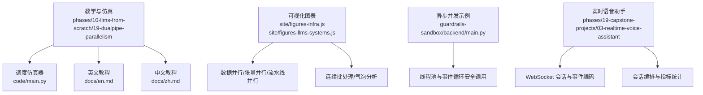
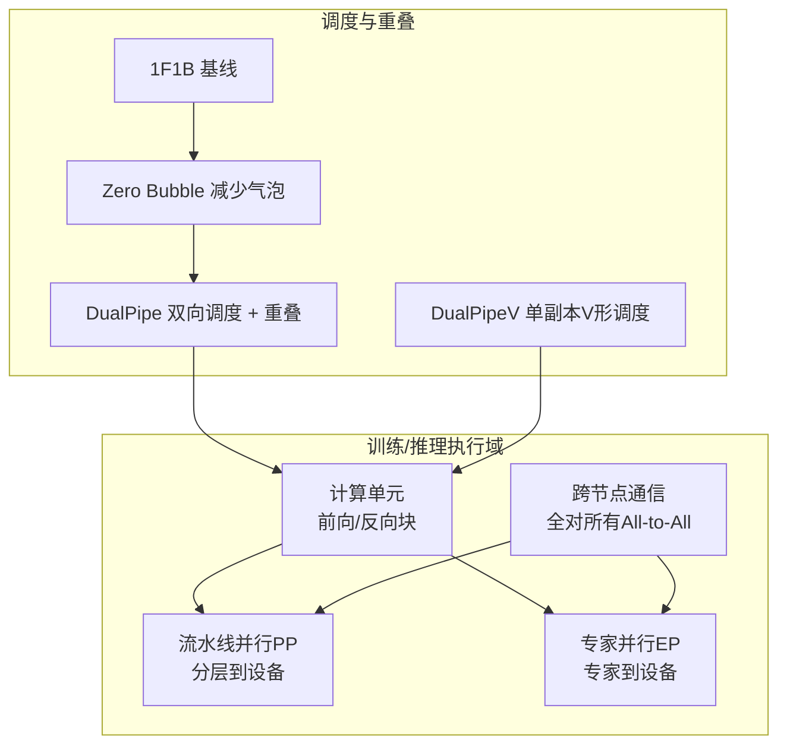
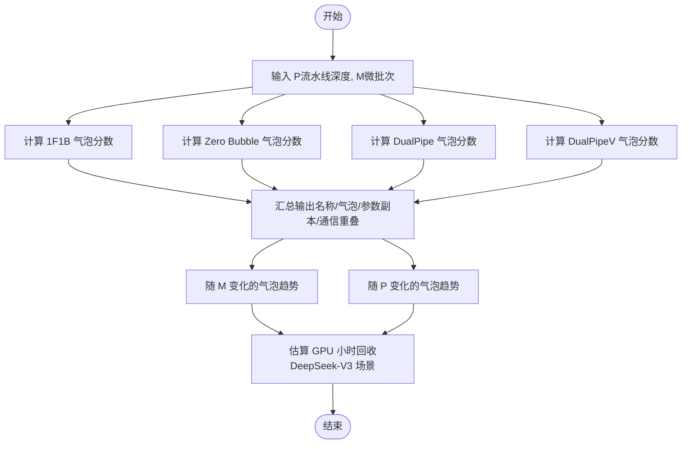
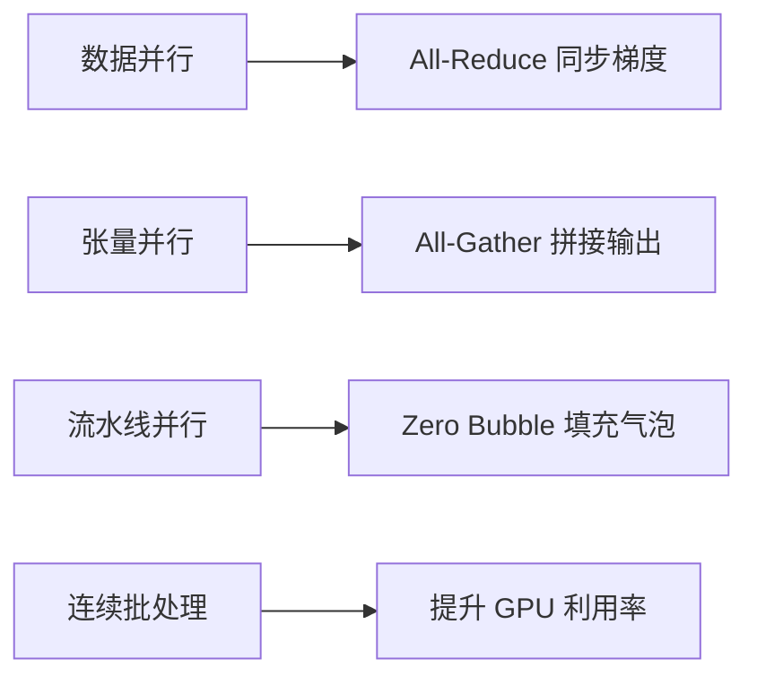
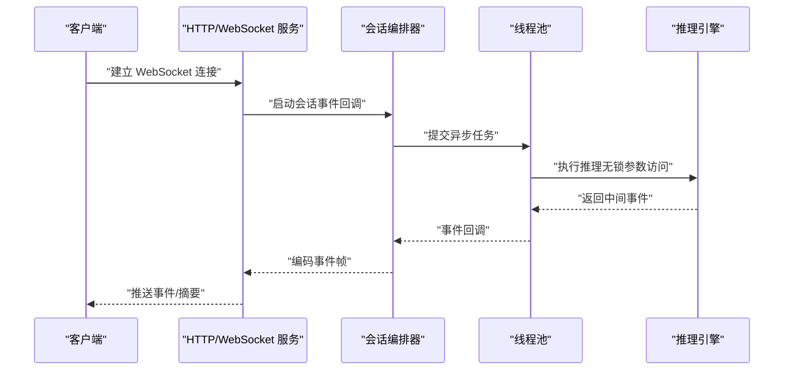
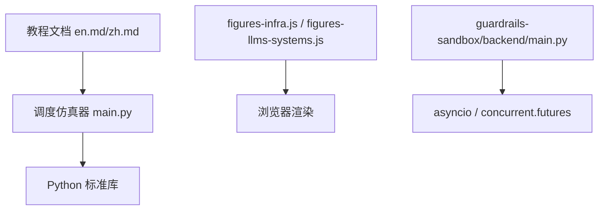

# 并行推理架构

<cite>
**本文引用的文件**
- [phases/10-llms-from-scratch/19-dualpipe-parallelism/code/main.py](file://phases/10-llms-from-scratch/19-dualpipe-parallelism/code/main.py)
- [phases/10-llms-from-scratch/19-dualpipe-parallelism/docs/en.md](file://phases/10-llms-from-scratch/19-dualpipe-parallelism/docs/en.md)
- [phases/10-llms-from-scratch/19-dualpipe-parallelism/docs/zh.md](file://phases/10-llms-from-scratch/19-dualpipe-parallelism/docs/zh.md)
- [site/figures-infra.js](file://site/figures-infra.js)
- [site/figures-llms-systems.js](file://site/figures-llms-systems.js)
- [guardrails-sandbox/backend/main.py](file://guardrails-sandbox/backend/main.py)
- [phases/19-capstone-projects/03-realtime-voice-assistant/code/ts/src/server.ts](file://phases/19-capstone-projects/03-realtime-voice-assistant/code/ts/src/server.ts)
- [phases/19-capstone-projects/03-realtime-voice-assistant/code/ts/src/orchestrator.ts](file://phases/19-capstone-projects/03-realtime-voice-assistant/code/ts/src/orchestrator.ts)
</cite>

## 目录
1. [引言](#引言)
2. [项目结构](#项目结构)
3. [核心组件](#核心组件)
4. [架构总览](#架构总览)
5. [详细组件分析](#详细组件分析)
6. [依赖分析](#依赖分析)
7. [性能考量](#性能考量)
8. [故障排查指南](#故障排查指南)
9. [结论](#结论)
10. [附录](#附录)

## 引言
本文件面向“并行推理架构”的设计与实现，聚焦双管道并行（DualPipe）与异步Hogwild推理两大主题。文档基于仓库中的教学材料与示例代码，系统阐述：
- 双管道并行（DualPipe）的流水线并行与双向调度思想，以及与传统1F1B、Zero Bubble的对比；
- 异步Hogwild推理的无锁并发思路与在多核CPU上的应用潜力；
- 并行推理的调度策略、状态同步机制与负载均衡方案；
- 结合可视化图表与代码路径，给出可操作的优化建议与基准评估方法。

## 项目结构
围绕并行推理主题，仓库中与之直接相关的模块主要分布在以下位置：
- 教学与仿真：phases/10-llms-from-scratch/19-dualpipe-parallelism（包含调度仿真器与教程文档）
- 可视化：site/figures-infra.js 与 site/figures-llms-systems.js（基础设施与LLM系统相关图表）
- 异步与并发示例：guardrails-sandbox/backend/main.py（线程池与事件循环安全调用）
- 实时语音助手（端到端推理场景）：phases/19-capstone-projects/03-realtime-voice-assistant（WebSocket会话、事件驱动）

**章节来源**
- [phases/10-llms-from-scratch/19-dualpipe-parallelism/code/main.py:1-146](file://phases/10-llms-from-scratch/19-dualpipe-parallelism/code/main.py#L1-L146)
- [site/figures-infra.js:13-214](file://site/figures-infra.js#L13-L214)
- [site/figures-llms-systems.js:278-308](file://site/figures-llms-systems.js#L278-L308)
- [guardrails-sandbox/backend/main.py:291-321](file://guardrails-sandbox/backend/main.py#L291-L321)
- [phases/19-capstone-projects/03-realtime-voice-assistant/code/ts/src/server.ts:1-47](file://phases/19-capstone-projects/03-realtime-voice-assistant/code/ts/src/server.ts#L1-L47)
- [phases/19-capstone-projects/03-realtime-voice-assistant/code/ts/src/orchestrator.ts:1-56](file://phases/19-capstone-projects/03-realtime-voice-assistant/code/ts/src/orchestrator.ts#L1-L56)

## 核心组件
- 双管道并行调度仿真器：提供1F1B、Zero Bubble、DualPipe、DualPipeV四种调度的气泡分数计算与扩展分析，用于教学与策略选型。
- 可视化图表：覆盖数据并行、张量并行、流水线并行、连续批处理等，辅助理解并行范式与资源占用。
- 异步并发示例：演示在已有事件循环线程中安全运行协程的方法，体现无锁并发与线程隔离的思路。
- 实时语音助手：展示端到端推理的事件驱动流程，包含会话编排、指标统计与WebSocket事件推送。

**章节来源**
- [phases/10-llms-from-scratch/19-dualpipe-parallelism/code/main.py:18-82](file://phases/10-llms-from-scratch/19-dualpipe-parallelism/code/main.py#L18-L82)
- [site/figures-infra.js:13-143](file://site/figures-infra.js#L13-L143)
- [site/figures-llms-systems.js:278-308](file://site/figures-llms-systems.js#L278-L308)
- [guardrails-sandbox/backend/main.py:291-321](file://guardrails-sandbox/backend/main.py#L291-L321)
- [phases/19-capstone-projects/03-realtime-voice-assistant/code/ts/src/server.ts:38-47](file://phases/19-capstone-projects/03-realtime-voice-assistant/code/ts/src/server.ts#L38-L47)

## 架构总览
下图展示了并行推理在训练/推理场景中的关键抽象：流水线并行（PP）与专家并行（EP）的协同、计算与通信的重叠窗口、以及在多核CPU上的异步Hogwild访问。

**图表来源**
- [phases/10-llms-from-scratch/19-dualpipe-parallelism/docs/en.md:29-103](file://phases/10-llms-from-scratch/19-dualpipe-parallelism/docs/en.md#L29-L103)
- [site/figures-infra.js:116-143](file://site/figures-infra.js#L116-L143)

**章节来源**
- [phases/10-llms-from-scratch/19-dualpipe-parallelism/docs/en.md:29-103](file://phases/10-llms-from-scratch/19-dualpipe-parallelism/docs/en.md#L29-L103)
- [site/figures-infra.js:116-143](file://site/figures-infra.js#L116-L143)

## 详细组件分析

### 双管道并行（DualPipe）调度仿真器
- 功能概述
  - 提供四种调度策略的气泡分数计算：1F1B、Zero Bubble、DualPipe、DualPipeV。
  - 输出稳定阶段利用率、气泡随微批次变化趋势、以及在大规模训练场景下的GPU小时回收估算。
- 关键接口与数据结构
  - 数据类：记录调度名称、稳定气泡分数、是否随微批次增长、参数副本数、通信重叠程度。
  - 计算函数：分别实现四种调度的气泡分数公式与扩展逻辑。
  - 总结与评估：批量汇总并打印对比表格，支持不同P（流水线深度）与M（微批次）组合。
- 设计要点
  - 通过数学建模将“预热/冷却”与“稳定阶段”的气泡区分开，突出DualPipe在稳定阶段的零气泡特性。
  - 通过“GPU小时回收”量化DualPipe在超大规模训练中的价值。

**图表来源**
- [phases/10-llms-from-scratch/19-dualpipe-parallelism/code/main.py:27-82](file://phases/10-llms-from-scratch/19-dualpipe-parallelism/code/main.py#L27-L82)

**章节来源**
- [phases/10-llms-from-scratch/19-dualpipe-parallelism/code/main.py:18-82](file://phases/10-llms-from-scratch/19-dualpipe-parallelism/code/main.py#L18-L82)
- [phases/10-llms-from-scratch/19-dualpipe-parallelism/docs/en.md:74-103](file://phases/10-llms-from-scratch/19-dualpipe-parallelism/docs/en.md#L74-L103)

### 可视化与并行范式
- 数据并行（Data Parallelism）
  - 将全局批切分为每GPU分片，每设备持有完整模型副本，反向后通过All-Reduce同步梯度。
- 张量并行（Tensor Parallelism）
  - 将矩阵乘的权重按列切分到多GPU，各自计算局部输出，再All-Gather拼接。
- 流水线并行（Pipeline Parallelism）
  - 将模型层分摊到P个设备，微批次在设备间流动，1F1B通过前后交错减少气泡，Zero Bubble进一步细分反向以填满空隙。
- 连续批处理（Continuous Batching）
  - 通过GPU槽位的连续填充与队列调度，提升GPU利用率，减少空闲。

**图表来源**
- [site/figures-infra.js:13-143](file://site/figures-infra.js#L13-L143)
- [site/figures-infra.js:69-113](file://site/figures-infra.js#L69-L113)
- [site/figures-infra.js:116-143](file://site/figures-infra.js#L116-L143)
- [site/figures-llms-systems.js:278-308](file://site/figures-llms-systems.js#L278-L308)

**章节来源**
- [site/figures-infra.js:13-143](file://site/figures-infra.js#L13-L143)
- [site/figures-infra.js:69-113](file://site/figures-infra.js#L69-L113)
- [site/figures-infra.js:116-143](file://site/figures-infra.js#L116-L143)
- [site/figures-llms-systems.js:278-308](file://site/figures-llms-systems.js#L278-L308)

### 异步Hogwild推理（无锁并发访问）
- 思想概述
  - Hogwild风格的无锁访问允许多个推理线程在共享参数上并行读取，避免锁带来的串行化开销，从而提升多核CPU的吞吐。
  - 在仓库中，通过“在线程池中安全运行协程”的方式，体现了在已有事件循环上下文中进行异步调用的无阻塞思路。
- 实践要点
  - 使用线程池隔离协程执行，避免阻塞主事件循环；
  - 在共享资源访问处采用无锁数据结构或原子操作（仓库示例未直接展示，但思路相通）；
  - 通过事件驱动（如WebSocket）将推理结果异步回传，降低I/O阻塞。

**图表来源**
- [phases/19-capstone-projects/03-realtime-voice-assistant/code/ts/src/server.ts:38-47](file://phases/19-capstone-projects/03-realtime-voice-assistant/code/ts/src/server.ts#L38-L47)
- [phases/19-capstone-projects/03-realtime-voice-assistant/code/ts/src/orchestrator.ts:42-56](file://phases/19-capstone-projects/03-realtime-voice-assistant/code/ts/src/orchestrator.ts#L42-L56)
- [guardrails-sandbox/backend/main.py:291-321](file://guardrails-sandbox/backend/main.py#L291-L321)

**章节来源**
- [guardrails-sandbox/backend/main.py:291-321](file://guardrails-sandbox/backend/main.py#L291-L321)
- [phases/19-capstone-projects/03-realtime-voice-assistant/code/ts/src/server.ts:15-47](file://phases/19-capstone-projects/03-realtime-voice-assistant/code/ts/src/server.ts#L15-L47)
- [phases/19-capstone-projects/03-realtime-voice-assistant/code/ts/src/orchestrator.ts:17-56](file://phases/19-capstone-projects/03-realtime-voice-assistant/code/ts/src/orchestrator.ts#L17-L56)

### 调度策略、状态同步与负载均衡
- 调度策略
  - 1F1B：单向流水线，气泡随微批次线性增长；
  - Zero Bubble：将反向拆分为B/W两段，显著降低气泡；
  - DualPipe：双向注入微批次，稳定阶段零气泡，适合EP密集场景；
  - DualPipeV：单副本V形调度，内存节省但气泡略增，适合EP非瓶颈场景。
- 状态同步
  - 在EP场景下，通过定制的全对所有内核与调度重叠，将通信隐藏在计算窗口中；
  - 在CPU侧，采用无锁共享参数与事件回调，避免阻塞主线程。
- 负载均衡
  - 通过连续批处理与GPU槽位动态填充，减少空闲；
  - 在PP中，选择能被微批次整除的流水线深度，确保稳定阶段利用率最大化。

**章节来源**
- [phases/10-llms-from-scratch/19-dualpipe-parallelism/docs/en.md:74-103](file://phases/10-llms-from-scratch/19-dualpipe-parallelism/docs/en.md#L74-L103)
- [site/figures-llms-systems.js:278-308](file://site/figures-llms-systems.js#L278-L308)

## 依赖分析
- 内部依赖
  - 调度仿真器依赖Python标准库（dataclasses、typing）进行数据建模与类型提示；
  - 教学文档与仿真器形成“理论—实践”闭环，便于策略选型与验证。
- 外部依赖
  - 可视化图表依赖浏览器SVG渲染与交互控件；
  - 异步示例依赖Python的asyncio与concurrent.futures，确保在既有事件循环中安全运行协程。

**图表来源**
- [phases/10-llms-from-scratch/19-dualpipe-parallelism/code/main.py:12-16](file://phases/10-llms-from-scratch/19-dualpipe-parallelism/code/main.py#L12-L16)
- [site/figures-infra.js:13-143](file://site/figures-infra.js#L13-L143)
- [guardrails-sandbox/backend/main.py:291-321](file://guardrails-sandbox/backend/main.py#L291-L321)

**章节来源**
- [phases/10-llms-from-scratch/19-dualpipe-parallelism/code/main.py:12-16](file://phases/10-llms-from-scratch/19-dualpipe-parallelism/code/main.py#L12-L16)
- [site/figures-infra.js:13-143](file://site/figures-infra.js#L13-L143)
- [guardrails-sandbox/backend/main.py:291-321](file://guardrails-sandbox/backend/main.py#L291-L321)

## 性能考量
- 气泡与吞吐
  - DualPipe在稳定阶段实现零气泡，显著提升GPU利用率，尤其在EP密集场景下收益明显；
  - 通过增大微批次与合理选择流水线深度，可进一步降低气泡分数。
- 内存与通信
  - DualPipeV在内存受限场景下提供折中方案，虽然气泡略增，但参数复制减半；
  - EP场景下的全对所有通信需定制内核以匹配集群拓扑。
- CPU侧并发
  - 采用无锁共享参数与事件驱动回调，减少锁竞争与阻塞，提升多核CPU的吞吐；
  - 在线程池中执行耗时任务，避免阻塞主事件循环。

[本节为通用指导，无需具体文件引用]

## 故障排查指南
- 调度调试
  - 若出现气泡持续增长，检查流水线深度是否能被微批次整除，或切换至Zero Bubble/DualPipeV；
  - 在EP密集场景下，确认全对所有内核已正确配置并与拓扑匹配。
- 异步并发
  - 在已有事件循环线程中运行协程时，优先使用线程池封装，避免阻塞主循环；
  - 如遇回调丢失或事件乱序，检查事件回调注册与WebSocket消息编码逻辑。
- 实时推理
  - 关注会话指标（首token时间、音频输出时间、打断次数），定位延迟瓶颈；
  - 通过事件日志回放与摘要统计，快速定位异常阶段。

**章节来源**
- [phases/10-llms-from-scratch/19-dualpipe-parallelism/docs/en.md:121-127](file://phases/10-llms-from-scratch/19-dualpipe-parallelism/docs/en.md#L121-L127)
- [guardrails-sandbox/backend/main.py:291-321](file://guardrails-sandbox/backend/main.py#L291-L321)
- [phases/19-capstone-projects/03-realtime-voice-assistant/code/ts/src/orchestrator.ts:17-56](file://phases/19-capstone-projects/03-realtime-voice-assistant/code/ts/src/orchestrator.ts#L17-L56)

## 结论
- DualPipe通过双向调度与计算-通信重叠，有效消除流水线气泡，特别适用于EP密集的大模型训练/推理；
- 在CPU侧，异步Hogwild风格的无锁并发与事件驱动可显著提升多核利用率；
- 结合连续批处理、合理的调度与通信内核，可在大规模部署中获得更高的吞吐与更低的延迟。

[本节为总结，无需具体文件引用]

## 附录
- 参考实现与扩展
  - 双管道并行仿真器可用于不同P/M组合的基准评估，辅助制定训练/推理策略；
  - 可视化图表有助于直观理解数据并行、张量并行与流水线并行的资源占用与瓶颈；
  - 异步并发示例展示了在现有事件循环中安全运行协程的实践方法。

**章节来源**
- [phases/10-llms-from-scratch/19-dualpipe-parallelism/code/main.py:84-146](file://phases/10-llms-from-scratch/19-dualpipe-parallelism/code/main.py#L84-L146)
- [site/figures-infra.js:13-143](file://site/figures-infra.js#L13-L143)
- [site/figures-llms-systems.js:278-308](file://site/figures-llms-systems.js#L278-L308)
- [guardrails-sandbox/backend/main.py:291-321](file://guardrails-sandbox/backend/main.py#L291-L321)