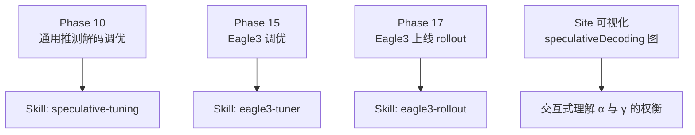
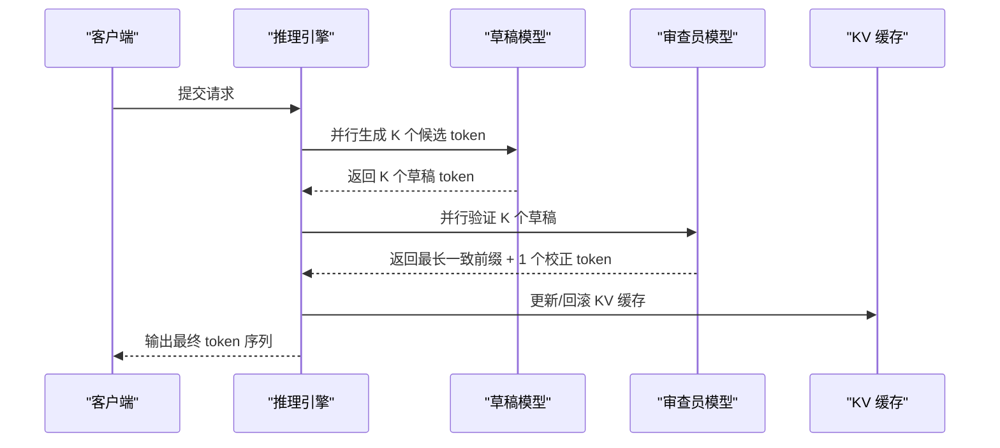
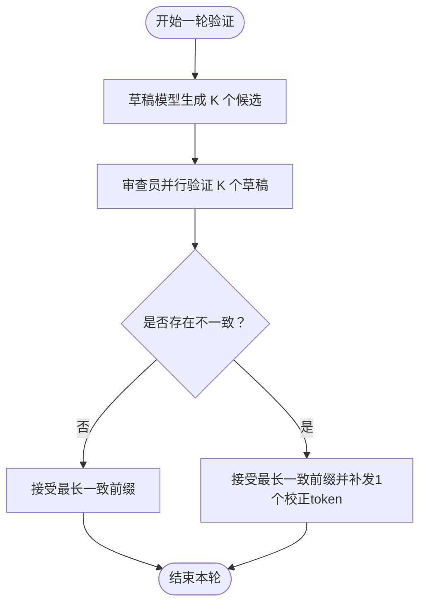
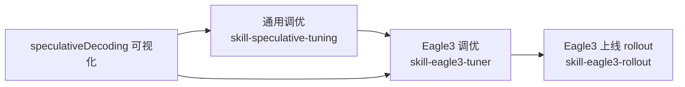

# 推测解码技术

<cite>
**本文引用的文件**   
- [skill-eagle3-tuner.md](file://phases/10-llms-from-scratch/15-speculative-decoding-eagle3/outputs/skill-eagle3-tuner.md)
- [skill-eagle3-rollout.md](file://phases/17-infrastructure-and-production/05-eagle3-speculative-decoding/outputs/skill-eagle3-rollout.md)
- [skill-speculative-tuning.md](file://phases/10-llms-from-scratch/25-speculative-decoding/outputs/skill-speculative-tuning.md)
- [speculativeDecoding 函数（可视化）](file://site/figures-llms-systems.js)
- [data.js（技能索引）](file://site/data.js)
</cite>

## 目录
1. [简介](#简介)
2. [项目结构](#项目结构)
3. [核心组件](#核心组件)
4. [架构总览](#架构总览)
5. [详细组件分析](#详细组件分析)
6. [依赖关系分析](#依赖关系分析)
7. [性能考量](#性能考量)
8. [故障排查指南](#故障排查指南)
9. [结论](#结论)
10. [附录](#附录)

## 简介
本文件系统化阐述推测解码（Speculative Decoding）的核心原理与工程实践，重点聚焦 Eagle3 的生产级实现与落地流程。内容覆盖：
- 多步预测策略与草稿-审查员（Draft-Verifier）机制
- 接受率优化与期望吞吐提升模型
- 并行生成与批内并行验证以降低端到端延迟
- 配置参数建议、上线 rollout 流程与监控指标
- 与传统自回归解码的对比与适用场景

目标读者：工程师、系统架构师、推理服务运维与平台研发人员。

## 项目结构
该仓库将“推测解码”知识以“技能”形式组织在不同 phase 中：
- Phase 10：面向推理调优与策略选择的通用指南
- Phase 15：Eagle3 调优技能（Draft 家族、树搜索、温度门限、KV 回滚）
- Phase 17：Eagle3 生产 rollout 技能（基线测量、Alpha 门限、尾延迟观测、盈亏平衡）
- Site 可视化：提供“推测解码”交互式教学图，直观展示接受率与草稿长度对吞吐的影响

图表来源
- [data.js（技能索引）:3423-3427](file://site/data.js#L3423-L3427)
- [skill-eagle3-tuner.md:1-32](file://phases/10-llms-from-scratch/15-speculative-decoding-eagle3/outputs/skill-eagle3-tuner.md#L1-L32)
- [skill-eagle3-rollout.md:1-33](file://phases/17-infrastructure-and-production/05-eagle3-speculative-decoding/outputs/skill-eagle3-rollout.md#L1-L33)
- [speculativeDecoding 函数（可视化）:73-116](file://site/figures-llms-systems.js#L73-L116)

章节来源
- [data.js（技能索引）:3423-3427](file://site/data.js#L3423-L3427)
- [skill-eagle3-tuner.md:1-32](file://phases/10-llms-from-scratch/15-speculative-decoding-eagle3/outputs/skill-eagle3-tuner.md#L1-L32)
- [skill-eagle3-rollout.md:1-33](file://phases/17-infrastructure-and-production/05-eagle3-speculative-decoding/outputs/skill-eagle3-rollout.md#L1-L33)
- [speculativeDecoding 函数（可视化）:73-116](file://site/figures-llms-systems.js#L73-L116)

## 核心组件
- 草稿模型（Draft Model）
  - 低成本、快速的轻量模型，负责一次性提出 K 个候选 token
  - 建议与目标模型同家族或经领域微调，确保输出分布接近
- 审查员模型（Verifier Model）
  - 目标大模型，对草稿提出的 K 个 token 进行一次性并行验证
  - 接受最长一致前缀，并额外生成一个校正 token
- 接受率 α（Acceptance Rate）
  - 表征连续草稿与审查员一致的概率；α 越高，吞吐增益越大
- 草稿长度 K（Draft Length）
  - 在给定 α 与草稿/审查员成本比下，通过最小化单位时间代价确定最优 K
- 树搜索（Tree Search，Eagle2/3）
  - 在草稿阶段引入树形扩展，控制深度与分支以满足内存预算
- KV 缓存回滚（KV Rollback）
  - 支持批量拒绝后的缓存回滚，避免后续 token 被静默污染

章节来源
- [skill-eagle3-tuner.md:10-31](file://phases/10-llms-from-scratch/15-speculative-decoding-eagle3/outputs/skill-eagle3-tuner.md#L10-L31)
- [skill-speculative-tuning.md:10-28](file://phases/10-llms-from-scratch/25-speculative-decoding/outputs/skill-speculative-tuning.md#L10-L28)

## 架构总览
Eagle3 的核心是“草稿-审查员”的两阶段并行解码：草稿模型在前 K 步快速生成候选序列，审查员在同一迭代中并行验证，接受最长一致前缀并补发一个 token。整体吞吐由以下因素决定：
- 草稿长度 K
- 接受率 α
- 草稿与审查员的计算成本比 c

图表来源
- [speculativeDecoding 函数（可视化）:73-116](file://site/figures-llms-systems.js#L73-L116)
- [skill-eagle3-tuner.md:10-31](file://phases/10-llms-from-scratch/15-speculative-decoding-eagle3/outputs/skill-eagle3-tuner.md#L10-L31)

## 详细组件分析

### 组件一：草稿-审查员并行验证
- 设计要点
  - 将审查员的单步验证扩展为对 K 个草稿的并行验证，显著减少目标模型调用次数
  - 采用“最长一致前缀 + 校正 token”的策略，保证输出分布与纯自回归一致
- 性能影响
  - 吞吐提升近似等于每轮验证产生的有效 token 数（期望接受长度 + 1）
  - α 越高，收益越明显；K 过大则验证开销上升，需结合成本比 c 优化

图表来源
- [speculativeDecoding 函数（可视化）:73-116](file://site/figures-llms-systems.js#L73-L116)

章节来源
- [speculativeDecoding 函数（可视化）:73-116](file://site/figures-llms-systems.js#L73-L116)

### 组件二：接受率 α 的建模与优化
- 模型化
  - 期望每轮验证产生 tokensPerPass = E[接受长度] + 1
  - E[接受长度] = Σ(i=1..γ) a^i ≈ α/(1-α)（当 γ 较大时）
  - 吞吐增益与 α 和 K 密切相关
- 优化策略
  - 在固定成本比 c 下，寻找使 (1 + K·c) / tokensPerPass 最小的 K
  - 温度门限：当采样温度较高时，α 显著下降，应禁用或放宽树搜索

章节来源
- [skill-eagle3-tuner.md:14-17](file://phases/10-llms-from-scratch/15-speculative-decoding-eagle3/outputs/skill-eagle3-tuner.md#L14-L17)
- [skill-speculative-tuning.md:12-16](file://phases/10-llms-from-scratch/25-speculative-decoding/outputs/skill-speculative-tuning.md#L12-L16)

### 组件三：Eagle3 调优（Draft 家族、树搜索、KV 回滚）
- Draft 家族选择
  - 同家族小模型、蒸馏草稿、Medusa 头、Lookahead 等；优先选择与审查员字节级匹配的预训练草稿
- 草稿长度 N
  - 基于 α 与草稿/审查员成本比 c，对几个候选 N 计算期望耗时并择优
- 树搜索参数
  - 内存预算约束下的深度与分支组合；不同 batch 规模采用不同默认树形
- KV 回滚
  - 明确使用的 KV 实现（如 vLLM 的 scratch buffer 或 TensorRT-LLM 的逻辑长度），并确认支持批量拒绝

章节来源
- [skill-eagle3-tuner.md:12-31](file://phases/10-llms-from-scratch/15-speculative-decoding-eagle3/outputs/skill-eagle3-tuner.md#L12-L31)

### 组件四：生产 rollout（Alpha 门限、尾延迟观测、盈亏平衡）
- 基线测量
  - 选择合适的评测集与并发点，记录 TTFT、ITL、吞吐、并发等指标
- Alpha 门限
  - 生产并发下要求 α ≥ 0.55；若任意 1 小时窗口内 α ≤ 0.45 则触发紧急停机
- 尾延迟观测
  - 关注 ITL 的 P99 差异；若为正值，说明拒绝带来的二次验证拖累，应下调 K 或禁用
- 盈亏平衡
  - 在当前并发与验证开销下计算 break-even α，仅当实测 α 超过该阈值至少 0.1 才可上线

章节来源
- [skill-eagle3-rollout.md:10-33](file://phases/17-infrastructure-and-production/05-eagle3-speculative-decoding/outputs/skill-eagle3-rollout.md#L10-L33)

### 组件五：与传统自回归解码的对比
- 自回归解码
  - 逐 token 串行生成，延迟低但吞吐受限
- 推测解码
  - 通过并行验证大幅减少审查员调用次数，提升吞吐；但需要稳定的 α 与合适的 K
- 适用性
  - 高并发、长对话、代码生成等场景更受益；短输出或极低温度创意写作可能不划算

章节来源
- [speculativeDecoding 函数（可视化）:73-116](file://site/figures-llms-systems.js#L73-L116)

## 依赖关系分析
- 技能依赖
  - Phase 10 的通用调优为 Phase 15/Eagle3 调优提供基础方法论
  - Phase 17 的 rollout 技能建立在 Phase 15 的参数基础上，强调生产可用性与可观测性
- 可视化依赖
  - Site 的“speculativeDecoding”图用于直观解释 α 与 γ 对吞吐的影响，辅助调参决策

图表来源
- [data.js（技能索引）:3423-3427](file://site/data.js#L3423-L3427)
- [skill-speculative-tuning.md:1-28](file://phases/10-llms-from-scratch/25-speculative-decoding/outputs/skill-speculative-tuning.md#L1-L28)
- [skill-eagle3-tuner.md:1-32](file://phases/10-llms-from-scratch/15-speculative-decoding-eagle3/outputs/skill-eagle3-tuner.md#L1-L32)
- [skill-eagle3-rollout.md:1-33](file://phases/17-infrastructure-and-production/05-eagle3-speculative-decoding/outputs/skill-eagle3-rollout.md#L1-L33)
- [speculativeDecoding 函数（可视化）:73-116](file://site/figures-llms-systems.js#L73-L116)

章节来源
- [data.js（技能索引）:3423-3427](file://site/data.js#L3423-L3427)
- [speculativeDecoding 函数（可视化）:73-116](file://site/figures-llms-systems.js#L73-L116)

## 性能考量
- 吞吐与延迟权衡
  - α 越高、K 越合适，吞吐增益越大；但过大 K 会增加验证开销，导致 ITL 增加
- 成本比 c 的影响
  - c = 草稿成本/审查员成本；在固定 α 下，K 的最优值随 c 变化
- 温度门限
  - 高温采样会显著降低 α，应在调优阶段识别并设置合理的温度门限
- KV 回滚与内存
  - 必须启用支持批量拒绝的 KV 回滚方案，避免后续 token 被污染；同时评估内存占用与碎片化

章节来源
- [skill-eagle3-tuner.md:14-18](file://phases/10-llms-from-scratch/15-speculative-decoding-eagle3/outputs/skill-eagle3-tuner.md#L14-L18)
- [skill-speculative-tuning.md:12-16](file://phases/10-llms-from-scratch/25-speculative-decoding/outputs/skill-speculative-tuning.md#L12-L16)

## 故障排查指南
- 禁止事项
  - 不改变审查员输出分布的近似推测解码
  - 在草稿成本高于审查员节省的情况下启用推测解码
  - 使用与审查员 tokenizer 不一致的草稿 checkpoint
  - 在不支持 KV 回滚的环境下启用推测解码
- 常见问题与对策
  - α 过低：检查草稿质量、是否启用温度门限、是否需要更低的 K
  - ITL P99 上升：可能是拒绝带来的二次验证开销，下调 K 或禁用
  - 内存不足：调整树搜索深度/分支，或降低 batch

章节来源
- [skill-eagle3-tuner.md:20-30](file://phases/10-llms-from-scratch/15-speculative-decoding-eagle3/outputs/skill-eagle3-tuner.md#L20-L30)
- [skill-eagle3-rollout.md:21-30](file://phases/17-infrastructure-and-production/05-eagle3-speculative-decoding/outputs/skill-eagle3-rollout.md#L21-L30)

## 结论
Eagle3 通过“草稿-审查员”的并行验证，将审查员的多次调用压缩为一次并行验证，显著提升吞吐。其成功落地依赖于：
- 精准的 α 测量与 K 优化
- 与审查员匹配的草稿与稳定的 KV 回滚
- 生产级 rollout 的 Alpha 门限、尾延迟观测与盈亏平衡校验

在合适的任务与硬件条件下，推测解码可带来数倍吞吐增益，同时保持与自回归解码一致的输出质量。

## 附录

### A. 参数与配置清单（参考）
- 草稿家族与 checkpoint
  - 同家族小模型、蒸馏草稿、Medusa 头、Lookahead
  - 字节级 tokenizer 匹配
- 草稿长度 N
  - 基于 α 与成本比 c 的候选 N 比较与选择
- 树搜索（Eagle2/3）
  - 深度与分支组合，满足内存预算
- 温度门限
  - 高温场景下禁用或放宽树搜索
- KV 回滚
  - 明确 vLLM/TensorRT-LLM 的实现与批量拒绝能力

章节来源
- [skill-eagle3-tuner.md:12-18](file://phases/10-llms-from-scratch/15-speculative-decoding-eagle3/outputs/skill-eagle3-tuner.md#L12-L18)

### B. 生产 rollout 流程（参考）
- 基线测量：评测集、并发点、指标采集
- 草稿头选择：通用/领域/训练新草稿
- 配置：speculative_config（方法、模型、num_speculative_tokens）
- Alpha 门限：α ≥ 0.55，异常即停
- 尾延迟观测：P99 ITL 差异
- 盈亏平衡：break-even α 之上至少 0.1

章节来源
- [skill-eagle3-rollout.md:10-33](file://phases/17-infrastructure-and-production/05-eagle3-speculative-decoding/outputs/skill-eagle3-rollout.md#L10-L33)