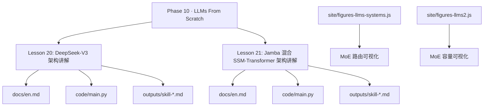
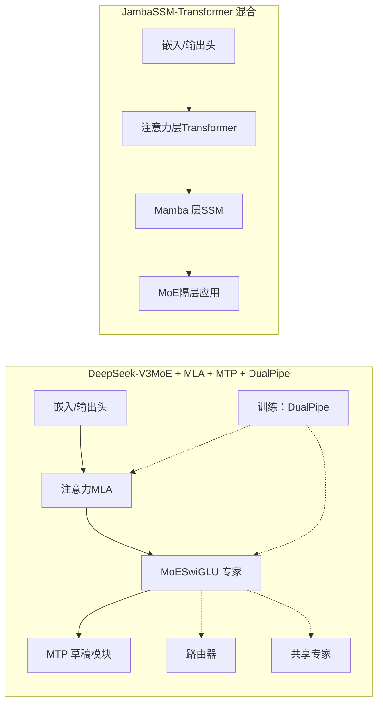
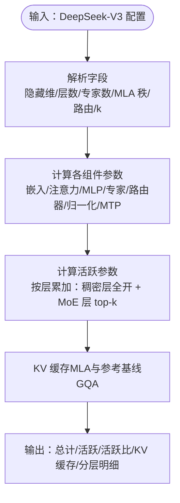
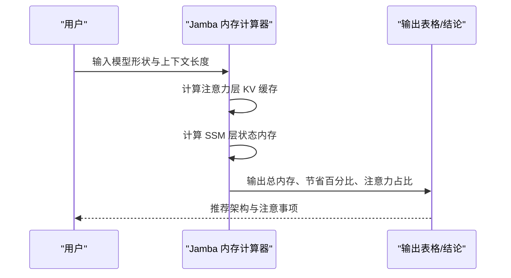
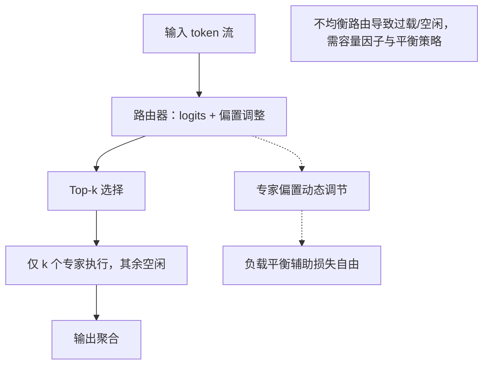
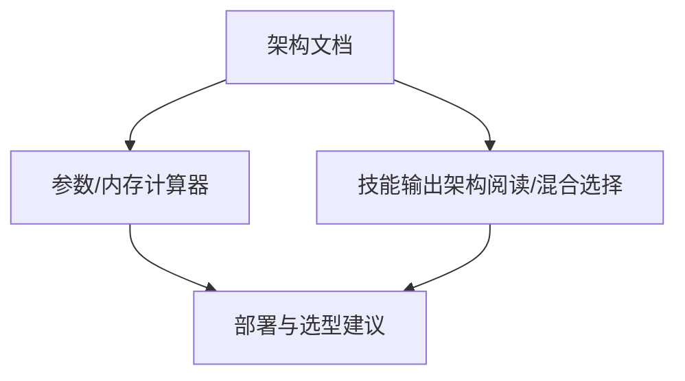

# 模型架构探索

<cite>
**本文引用的文件**
- [DeepSeek-V3 架构讲解（英文）](file://phases/10-llms-from-scratch/20-deepseek-v3-walkthrough/docs/en.md)
- [DeepSeek-V3 参数计算器（Python 实现）](file://phases/10-llms-from-scratch/20-deepseek-v3-walkthrough/code/main.py)
- [DeepSeek-V3 技能输出（架构阅读器）](file://phases/10-llms-from-scratch/20-deepseek-v3-walkthrough/outputs/skill-deepseek-v3-reader.md)
- [Jamba 混合 SSM-Transformer 架构讲解（英文）](file://phases/10-llms-from-scratch/21-jamba-hybrid-ssm-transformer/docs/en.md)
- [Jamba 混合架构内存计算器（Python 实现）](file://phases/10-llms-from-scratch/21-jamba-hybrid-ssm-transformer/code/main.py)
- [Jamba 技能输出（混合架构选择器）](file://phases/10-llms-from-scratch/21-jamba-hybrid-ssm-transformer/outputs/skill-hybrid-picker.md)
- [MoE 路由可视化脚本（前端图形）](file://site/figures-llms-systems.js)
- [MoE 容量可视化脚本（前端图形）](file://site/figures-llms2.js)
</cite>

## 目录
1. [引言](#引言)
2. [项目结构](#项目结构)
3. [核心组件](#核心组件)
4. [架构总览](#架构总览)
5. [详细组件分析](#详细组件分析)
6. [依赖关系分析](#依赖关系分析)
7. [性能考量](#性能考量)
8. [故障排查指南](#故障排查指南)
9. [结论](#结论)
10. [附录](#附录)

## 引言
本文件面向希望系统理解现代大语言模型前沿架构的工程师与研究者，围绕两类代表性设计展开：DeepSeek V3 的 MoE（Mixture of Experts）混合专家架构与 Jamba 的 SSM-Transformer 混合架构。我们将从架构原理、组件设计、优势特点、适用场景出发，结合仓库中的参数计算器与内存计算器，帮助读者建立“配置→参数预算→推理成本”的完整认知闭环，并提供可复现实验与性能对比方法。

## 项目结构
本专题位于“LLMs From Scratch”阶段，配套有：
- 文档：逐层拆解架构细节与参数来源
- 代码：参数/内存计算器，支持“基准 vs 变体”的快速对比
- 技能输出：面向工程实践的“架构阅读器/混合选择器”，用于指导部署与选型

图表来源
- [DeepSeek-V3 架构讲解（英文）](file://phases/10-llms-from-scratch/20-deepseek-v3-walkthrough/docs/en.md)
- [Jamba 混合 SSM-Transformer 架构讲解（英文）](file://phases/10-llms-from-scratch/21-jamba-hybrid-ssm-transformer/docs/en.md)
- [MoE 路由可视化脚本（前端图形）](file://site/figures-llms-systems.js)
- [MoE 容量可视化脚本（前端图形）](file://site/figures-llms2.js)

章节来源
- [DeepSeek-V3 架构讲解（英文）](file://phases/10-llms-from-scratch/20-deepseek-v3-walkthrough/docs/en.md)
- [Jamba 混合 SSM-Transformer 架构讲解（英文）](file://phases/10-llms-from-scratch/21-jamba-hybrid-ssm-transformer/docs/en.md)

## 核心组件
- DeepSeek-V3（MoE + MLA + MTP + DualPipe）
  - 关键点：MLA 将 KV 压缩到共享低秩潜变量；MoE 使用辅助损失自由的路由；MTP 在训练期提供更稠密信号并在推理期充当草稿；DualPipe 训练调度提升流水线利用率。
  - 工程价值：在 671B 总参数下，仅 37B 活跃参数，长上下文 KV 缓存显著降低，适合高性价比的前沿开放模型。
- Jamba（SSM-Transformer 混合）
  - 关键点：以 1:7 的比例交替堆叠 Transformer 与 Mamba 层，MoE 隔层应用；在 256k 上单卡 80GB GPU 可容纳；Mamba-3 提供更强状态追踪能力。
  - 工程价值：在长上下文与多任务混合场景下，兼顾线性推理与常量内存，同时保留注意力的精确回忆能力。

章节来源
- [DeepSeek-V3 架构讲解（英文）](file://phases/10-llms-from-scratch/20-deepseek-v3-walkthrough/docs/en.md)
- [Jamba 混合 SSM-Transformer 架构讲解（英文）](file://phases/10-llms-from-scratch/21-jamba-hybrid-ssm-transformer/docs/en.md)

## 架构总览
下图展示了两类架构的核心组成与关键差异：DeepSeek-V3 以 MoE 为主、MLA 降 KV、MTP/MoE 辅助训练；Jamba 以混合为主、通过 SSM 替代注意力层的 KV 状态，从而实现线性时间/常量内存。

图表来源
- [DeepSeek-V3 架构讲解（英文）](file://phases/10-llms-from-scratch/20-deepseek-v3-walkthrough/docs/en.md)
- [Jamba 混合 SSM-Transformer 架构讲解（英文）](file://phases/10-llms-from-scratch/21-jamba-hybrid-ssm-transformer/docs/en.md)

## 详细组件分析

### DeepSeek-V3：MoE + MLA + MTP + DualPipe
- 架构要点
  - 注意力采用 MLA（多头潜变量注意力），将 K/V 压缩到共享低秩潜变量，推理时按需解压，KV 缓存显著下降。
  - MoE 使用“辅助损失自由”的路由策略：通过专家级偏置动态平衡负载，无需额外损失项。
  - MTP（多步预测）在训练期监督两个位置的目标，提供更稠密信号；推理期作为草稿模块，接受度高。
  - DualPipe 训练调度在大规模集群中重叠前向/反向块，减少管道气泡。
- 参数与活跃度
  - 总参数约 671B，活跃参数约 37B，活跃比约 5.5%；早期层仍使用稠密 MLP 保证稳定性。
- 推理成本
  - 在 128k 上，MLA 的 KV 缓存约为 7.6GB，相较 GQA 基线（约 30.5GB）节省约 4 倍。
- 工程落地
  - 可通过参数计算器对 MLA 秩、专家数量、top-k 进行变体实验，评估活跃参数与 KV 缓存变化。

图表来源
- [DeepSeek-V3 参数计算器（Python 实现）](file://phases/10-llms-from-scratch/20-deepseek-v3-walkthrough/code/main.py)

章节来源
- [DeepSeek-V3 架构讲解（英文）](file://phases/10-llms-from-scratch/20-deepseek-v3-walkthrough/docs/en.md)
- [DeepSeek-V3 参数计算器（Python 实现）](file://phases/10-llms-from-scratch/20-deepseek-v3-walkthrough/code/main.py)
- [DeepSeek-V3 技能输出（架构阅读器）](file://phases/10-llms-from-scratch/20-deepseek-v3-walkthrough/outputs/skill-deepseek-v3-reader.md)

### Jamba：SSM-Transformer 混合
- 架构要点
  - 以 1:7 的比例交替堆叠 Transformer 与 Mamba 层，MoE 隔层应用；Mamba 层以递归状态替代注意力的 KV 缓存，实现线性时间/常量内存。
  - 在 256k 上，纯 Transformer 的 KV 缓存约为 128GB，而 Jamba（1:7）仅约 16GB（KV 缓存 8.4GB + SSM 状态 3.7MB），在单张 80GB GPU 上可放下权重、激活与 KV。
  - Mamba-3 引入指数梯形离散化、复值状态更新与 MIMO 投影，进一步提升状态追踪与建模能力。
- 内存预算
  - 计算器支持多种混合比例与上下文长度，直观展示“注意力层占比 vs 总内存占比”的关系，验证为何 1:7 是折中之选。
- 工程落地
  - 可据此选择“纯 Transformer（含 MLA/GQA）、Jamba 混合、纯 SSM（Mamba/Mamba-3）”三类方案，并结合推理栈兼容性与质量代价做决策。

图表来源
- [Jamba 混合架构内存计算器（Python 实现）](file://phases/10-llms-from-scratch/21-jamba-hybrid-ssm-transformer/code/main.py)

章节来源
- [Jamba 混合 SSM-Transformer 架构讲解（英文）](file://phases/10-llms-from-scratch/21-jamba-hybrid-ssm-transformer/docs/en.md)
- [Jamba 混合架构内存计算器（Python 实现）](file://phases/10-llms-from-scratch/21-jamba-hybrid-ssm-transformer/code/main.py)
- [Jamba 技能输出（混合选择器）](file://phases/10-llms-from-scratch/21-jamba-hybrid-ssm-transformer/outputs/skill-hybrid-picker.md)

### MoE 组件的可视化与理解
- 路由可视化：展示每个 token 被分配到 top-k 专家，强调“活跃计算比例 k/E，参数总量不变”的权衡。
- 容量可视化：展示专家容量因子对溢出与空闲的影响，帮助选择合适的容量以平衡吞吐与资源利用。

图表来源
- [MoE 路由可视化脚本（前端图形）](file://site/figures-llms-systems.js)
- [MoE 容量可视化脚本（前端图形）](file://site/figures-llms2.js)

章节来源
- [MoE 路由可视化脚本（前端图形）](file://site/figures-llms-systems.js)
- [MoE 容量可视化脚本（前端图形）](file://site/figures-llms2.js)

## 依赖关系分析
- 概念耦合
  - DeepSeek-V3：MoE 与 MLA 的组合在“参数效率”与“KV 缓存”之间取得平衡；MTP 与 DualPipe 提升训练密度与吞吐。
  - Jamba：注意力与 SSM 的互补在“长上下文”与“内存预算”之间取得平衡；MoE 隔层应用在质量与稀疏性间折中。
- 工具链依赖
  - 参数/内存计算器作为“配置→预算→部署”的桥梁，支持快速 A/B 对比与工程决策。
  - 技能输出文件提供“可交付物”模板，便于团队在实际项目中复用。

图表来源
- [DeepSeek-V3 架构讲解（英文）](file://phases/10-llms-from-scratch/20-deepseek-v3-walkthrough/docs/en.md)
- [Jamba 混合 SSM-Transformer 架构讲解（英文）](file://phases/10-llms-from-scratch/21-jamba-hybrid-ssm-transformer/docs/en.md)
- [DeepSeek-V3 参数计算器（Python 实现）](file://phases/10-llms-from-scratch/20-deepseek-v3-walkthrough/code/main.py)
- [Jamba 混合架构内存计算器（Python 实现）](file://phases/10-llms-from-scratch/21-jamba-hybrid-ssm-transformer/code/main.py)

章节来源
- [DeepSeek-V3 架构讲解（英文）](file://phases/10-llms-from-scratch/20-deepseek-v3-walkthrough/docs/en.md)
- [Jamba 混合 SSM-Transformer 架构讲解（英文）](file://phases/10-llms-from-scratch/21-jamba-hybrid-ssm-transformer/docs/en.md)

## 性能考量
- 参数效率与活跃度
  - DeepSeek-V3 通过 MoE 与 MLA 将活跃参数控制在约 5.5%，在长上下文与高参数规模下仍具备高性价比。
  - Jamba 通过 SSM 替代注意力的 KV 状态，使 KV 缓存不随序列长度增长，适合超长上下文部署。
- 训练与推理权衡
  - DeepSeek-V3 的 MTP 在训练期提供更稠密信号，在推理期充当草稿，提升吞吐与接受率。
  - Jamba 的混合比例（如 1:7）在质量与内存之间取得平衡；Mamba-3 的改进进一步增强状态追踪能力。
- 工具链与硬件适配
  - 计算器输出可用于评估不同上下文长度下的内存占用，指导硬件选择与量化策略（如 BF16/FP8）。

章节来源
- [DeepSeek-V3 架构讲解（英文）](file://phases/10-llms-from-scratch/20-deepseek-v3-walkthrough/docs/en.md)
- [Jamba 混合 SSM-Transformer 架构讲解（英文）](file://phases/10-llms-from-scratch/21-jamba-hybrid-ssm-transformer/docs/en.md)

## 故障排查指南
- 配置与参数不一致
  - 若缺少关键字段（如 kv_lora_rank、num_experts、first_k_dense_layers），请确认模型家族与配置来源，避免将非 DeepSeek 家族模型套用 V3 分析流程。
- 上下文与内存预算不符
  - 当目标上下文远超单卡显存承载能力时，优先考虑量化（BF16/FP8）、混合架构或分片部署；Jamba 的计算器可直接评估不同比例的内存占用。
- 路由与负载不均衡
  - MoE 路由不均会导致少数专家过载、多数空闲；可通过容量因子与辅助损失自由的偏置调节策略缓解，必要时增加专家数量或降低 top-k。

章节来源
- [DeepSeek-V3 技能输出（架构阅读器）](file://phases/10-llms-from-scratch/20-deepseek-v3-walkthrough/outputs/skill-deepseek-v3-reader.md)
- [Jamba 技能输出（混合选择器）](file://phases/10-llms-from-scratch/21-jamba-hybrid-ssm-transformer/outputs/skill-hybrid-picker.md)

## 结论
- DeepSeek-V3 代表了 MoE + MLA + MTP + DualPipe 的前沿组合：在高参数规模下以较低活跃度换取长上下文推理能力，适合追求“参数效率”的前沿开放模型。
- Jamba 代表了注意力与 SSM 的互补：在长上下文与内存预算受限场景下，通过混合架构实现线性推理与常量内存，适合多任务混合与超长上下文部署。
- 两者均可通过仓库提供的计算器与技能输出进行快速评估与落地，建议结合任务类型、上下文长度、硬件预算与推理栈兼容性做出最终选择。

## 附录
- 快速开始
  - DeepSeek-V3：运行参数计算器，修改 MLA 秩、专家数、top-k，观察活跃参数与 KV 缓存变化。
  - Jamba：运行内存计算器，切换混合比例与上下文长度，评估总内存与节省百分比。
- 进一步阅读
  - DeepSeek-V3 技术报告与模型卡片
  - Jamba 与 Mamba-3 论文与扩展

章节来源
- [DeepSeek-V3 参数计算器（Python 实现）](file://phases/10-llms-from-scratch/20-deepseek-v3-walkthrough/code/main.py)
- [Jamba 混合架构内存计算器（Python 实现）](file://phases/10-llms-from-scratch/21-jamba-hybrid-ssm-transformer/code/main.py)
- [DeepSeek-V3 架构讲解（英文）](file://phases/10-llms-from-scratch/20-deepseek-v3-walkthrough/docs/en.md)
- [Jamba 混合 SSM-Transformer 架构讲解（英文）](file://phases/10-llms-from-scratch/21-jamba-hybrid-ssm-transformer/docs/en.md)