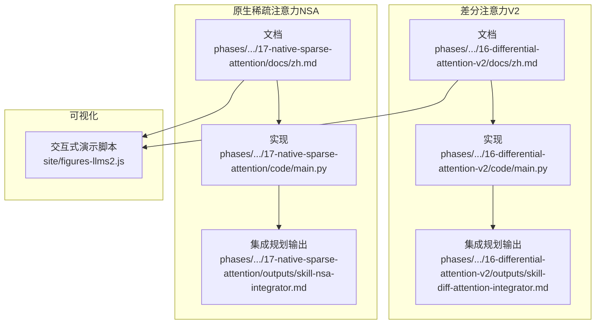
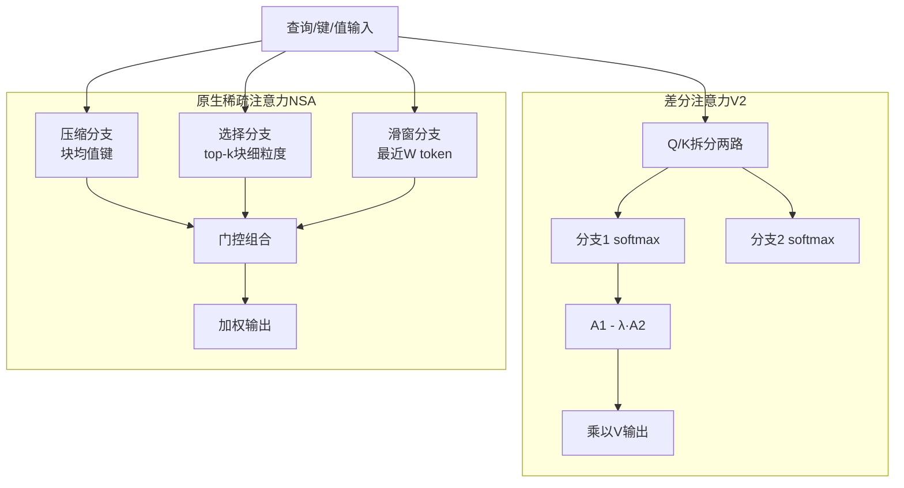
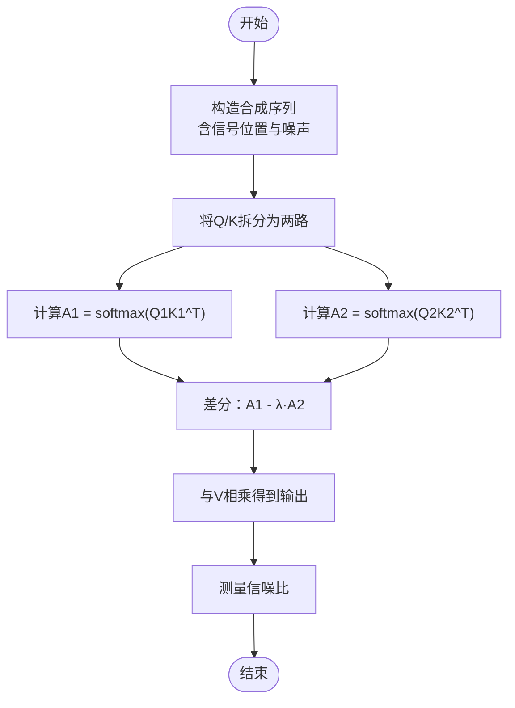
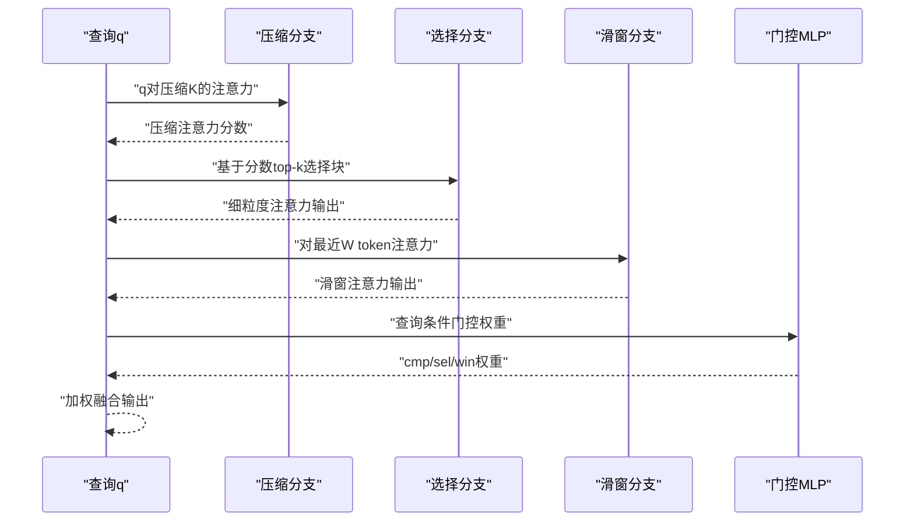
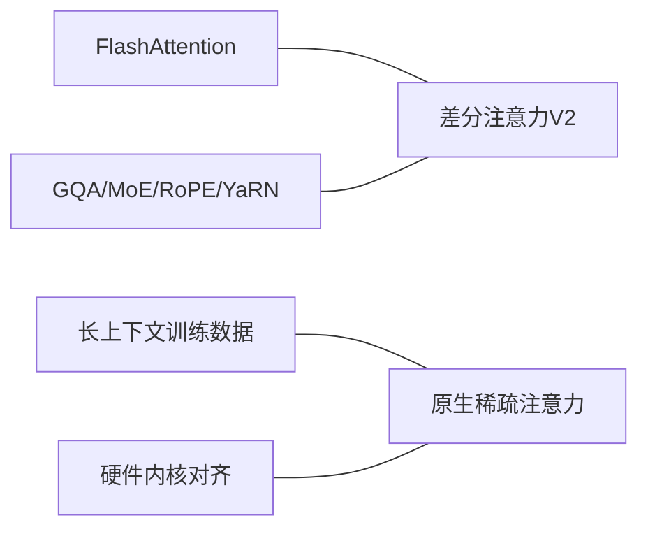

# 注意力优化技术

<cite>
**本文档引用的文件**
- [phases/10-llms-from-scratch/16-differential-attention-v2/docs/zh.md](file://phases/10-llms-from-scratch/16-differential-attention-v2/docs/zh.md)
- [phases/10-llms-from-scratch/16-differential-attention-v2/code/main.py](file://phases/10-llms-from-scratch/16-differential-attention-v2/code/main.py)
- [phases/10-llms-from-scratch/16-differential-attention-v2/outputs/skill-diff-attention-integrator.md](file://phases/10-llms-from-scratch/16-differential-attention-v2/outputs/skill-diff-attention-integrator.md)
- [site/figures-llms2.js](file://site/figures-llms2.js)
- [phases/10-llms-from-scratch/17-native-sparse-attention/docs/zh.md](file://phases/10-llms-from-scratch/17-native-sparse-attention/docs/zh.md)
- [phases/10-llms-from-scratch/17-native-sparse-attention/code/main.py](file://phases/10-llms-from-scratch/17-native-sparse-attention/code/main.py)
- [phases/10-llms-from-scratch/17-native-sparse-attention/outputs/skill-nsa-integrator.md](file://phases/10-llms-from-scratch/17-native-sparse-attention/outputs/skill-nsa-integrator.md)
</cite>

## 目录
1. [简介](#简介)
2. [项目结构](#项目结构)
3. [核心组件](#核心组件)
4. [架构概览](#架构概览)
5. [详细组件分析](#详细组件分析)
6. [依赖关系分析](#依赖关系分析)
7. [性能考量](#性能考量)
8. [故障排查指南](#故障排查指南)
9. [结论](#结论)
10. [附录](#附录)

## 简介
本文件系统性梳理两类现代注意力优化技术：Differential Attention v2（差分注意力V2）与原生稀疏注意力（DeepSeek NSA）。前者通过“双softmax相减”消除共享噪声底噪，提升长上下文下的信号信噪比，同时在生产栈中保持与FlashAttention兼容与解码速度匹配；后者以“压缩-选择-滑窗”三分支并行结构，实现端到端可训练的稀疏注意力，显著降低解码时的计算与内存压力。文档覆盖理论推导、算法实现、性能收益与适用场景，并提供可运行的Python实现与集成规划模板，帮助开发者在真实工程中落地。

## 项目结构
本仓库将注意力优化技术置于“大模型从零开始”阶段的“长上下文与注意力变体”专题中，分别提供：
- 差分注意力V2：文档、纯Python实现与集成规划输出
- 原生稀疏注意力（NSA）：文档、纯Python实现与集成规划输出
- 可视化脚本：包含差分注意力的交互式演示

**图表来源**
- [phases/10-llms-from-scratch/16-differential-attention-v2/docs/zh.md](file://phases/10-llms-from-scratch/16-differential-attention-v2/docs/zh.md)
- [phases/10-llms-from-scratch/16-differential-attention-v2/code/main.py](file://phases/10-llms-from-scratch/16-differential-attention-v2/code/main.py)
- [phases/10-llms-from-scratch/16-differential-attention-v2/outputs/skill-diff-attention-integrator.md](file://phases/10-llms-from-scratch/16-differential-attention-v2/outputs/skill-diff-attention-integrator.md)
- [phases/10-llms-from-scratch/17-native-sparse-attention/docs/zh.md](file://phases/10-llms-from-scratch/17-native-sparse-attention/docs/zh.md)
- [phases/10-llms-from-scratch/17-native-sparse-attention/code/main.py](file://phases/10-llms-from-scratch/17-native-sparse-attention/code/main.py)
- [phases/10-llms-from-scratch/17-native-sparse-attention/outputs/skill-nsa-integrator.md](file://phases/10-llms-from-scratch/17-native-sparse-attention/outputs/skill-nsa-integrator.md)
- [site/figures-llms2.js](file://site/figures-llms2.js)

**章节来源**
- [phases/10-llms-from-scratch/16-differential-attention-v2/docs/zh.md](file://phases/10-llms-from-scratch/16-differential-attention-v2/docs/zh.md)
- [phases/10-llms-from-scratch/17-native-sparse-attention/docs/zh.md](file://phases/10-llms-from-scratch/17-native-sparse-attention/docs/zh.md)

## 核心组件
- 差分注意力V2（Differential Attention v2）
  - 通过将Q/K拆分为两路，分别计算softmax注意力图A1与A2，再以可学习标量λ对A2进行缩放相减，得到更干净的注意力权重，从而抑制随上下文增长的噪声底噪。
  - V2版本在解码速度、内核兼容性与训练稳定性方面相较V1有显著改进：Q头数加倍、KV头数不变、取消每头RMSNorm、与FlashAttention兼容。
  - 提供纯Python实现，包含噪声抵消测量与参数量对比，便于教学与快速验证。
- 原生稀疏注意力（Native Sparse Attention, NSA）
  - 三并行分支：压缩分支（粗粒度）、选择分支（细粒度top-k块）、滑动窗口分支（局部上下文），并通过门控组合。
  - 通过“压缩分支分数驱动选择”的方式，使top-k选择在前向图中为无操作，仅控制KV加载，而梯度经由压缩分支分数流至选择逻辑，实现端到端可训练的稀疏模式。
  - 在64k解码时相比FlashAttention可实现9倍加速，且随序列长度增长收益更大。

**章节来源**
- [phases/10-llms-from-scratch/16-differential-attention-v2/docs/zh.md](file://phases/10-llms-from-scratch/16-differential-attention-v2/docs/zh.md)
- [phases/10-llms-from-scratch/17-native-sparse-attention/docs/zh.md](file://phases/10-llms-from-scratch/17-native-sparse-attention/docs/zh.md)

## 架构概览
下图展示两类注意力优化在系统中的定位与关系：二者均面向长上下文与解码效率，但路径不同：前者通过“差分”消除噪声，后者通过“稀疏化”重构注意力计算图。

**图表来源**
- [phases/10-llms-from-scratch/16-differential-attention-v2/docs/zh.md](file://phases/10-llms-from-scratch/16-differential-attention-v2/docs/zh.md)
- [phases/10-llms-from-scratch/17-native-sparse-attention/docs/zh.md](file://phases/10-llms-from-scratch/17-native-sparse-attention/docs/zh.md)

## 详细组件分析

### 差分注意力V2（Differential Attention v2）
- 理论基础
  - 标准softmax在每个无关token上分配非零权重，随上下文长度增长，噪声底噪累计可达常数级，影响长上下文任务的准确性与幻觉控制。
  - 差分思想：将Q/K拆分为两路，各自计算softmax注意力图A1与A2；若两图共享同一背景噪声，则相减可抵消该噪声，保留真实信号峰值。
  - λ为每头可学习标量，参数化形式允许其为负值，用于调节抵消强度。
- V1与V2差异
  - V1：头维度减半以维持参数量，需自定义内核，解码速度较基线慢，且每头RMSNorm在大模型训练后期易导致不稳定。
  - V2：Q头数加倍、KV头数不变、头维度与基线一致；与FlashAttention兼容、解码速度匹配基线；移除每头RMSNorm，以更简化的初始化保持训练稳定。
- 算法实现要点
  - 标准softmax注意力：逐行计算q·K/sqrt(d)，再softmax归一化，最后与V相乘得到输出。
  - 差分注意力：分别计算A1与A2，按行做逐元素差分并乘以V；权重可为负，后续O_W投影会吸收符号。
  - 参数核算：对比基线、V1、V2的参数量差异，明确新增项（如额外Q头、λ参数、O_W投影维度）。
- 性能与适用场景
  - 在64k+长上下文RAG、大海捞针等基准上显著降低幻觉与召回下降；在4k以下收益有限。
  - 与GQA、MoE、RoPE、YaRN/长上下文扩展等特性兼容；与FlashAttention在V2中兼容。
- 可运行实现与实验
  - 提供纯Python实现，包含噪声幅度扫描、信噪比测量、参数量对比等实验步骤，便于快速验证与教学。

**图表来源**
- [phases/10-llms-from-scratch/16-differential-attention-v2/code/main.py](file://phases/10-llms-from-scratch/16-differential-attention-v2/code/main.py)

**章节来源**
- [phases/10-llms-from-scratch/16-differential-attention-v2/docs/zh.md](file://phases/10-llms-from-scratch/16-differential-attention-v2/docs/zh.md)
- [phases/10-llms-from-scratch/16-differential-attention-v2/code/main.py](file://phases/10-llms-from-scratch/16-differential-attention-v2/code/main.py)
- [site/figures-llms2.js](file://site/figures-llms2.js)

### 原生稀疏注意力（NSA）
- 三分支结构
  - 压缩分支：将K按块大小l聚合为均值摘要，查询在压缩键上进行注意力，获得全局粗粒度视图。
  - 选择分支：以压缩分支注意力分数为路由信号，选择top-k块，加载对应细粒度token并计算注意力。
  - 滑动窗口分支：对最近W个token进行注意力，捕获局部结构模式。
  - 门控组合：以查询为条件的小型MLP输出三权重，对三个分支输出加权融合。
- 原生可训练性
  - top-k选择在前向图中为无操作（仅控制KV加载），梯度经由压缩分支分数与选择逻辑流至最终输出，保证端到端可训练。
- 计算复杂度
  - 每查询关注键数：N/l（压缩）+ k*l（选择）+ W（滑窗），总计O(N*(N/l + k*l + W))，在64k-128k上下文下相较全注意力可减少25-36倍。
- 硬件对齐内核
  - 内核按GQA组加载查询，复用相同选定块，SRAM内执行注意力，算术强度高，适合现代GPU内存层次。
- 可运行实现与实验
  - 提供纯Python实现，包含压缩、top-k选择、滑窗、门控与计算量统计，便于在短序列上验证门控权重行为与成本估算。

**图表来源**
- [phases/10-llms-from-scratch/17-native-sparse-attention/code/main.py](file://phases/10-llms-from-scratch/17-native-sparse-attention/code/main.py)

**章节来源**
- [phases/10-llms-from-scratch/17-native-sparse-attention/docs/zh.md](file://phases/10-llms-from-scratch/17-native-sparse-attention/docs/zh.md)
- [phases/10-llms-from-scratch/17-native-sparse-attention/code/main.py](file://phases/10-llms-from-scratch/17-native-sparse-attention/code/main.py)

## 依赖关系分析
两类技术在工程中的依赖与耦合关系如下：
- 差分注意力V2
  - 与FlashAttention兼容（V2），无需自定义内核；解码速度匹配基线；与GQA、MoE、RoPE、YaRN等特性兼容。
  - 参数量与训练稳定性：V2移除每头RMSNorm，降低后期训练风险；新增Q头与λ参数带来额外计算与存储。
- 原生稀疏注意力（NSA）
  - 依赖硬件内核对齐（Triton/CUDA），在A100以上加速器上优势明显；推理时真正实现稀疏加速。
  - 与长上下文训练数据强相关，需在预训练阶段学习稀疏模式，否则无法在推理时获得加速。

**图表来源**
- [phases/10-llms-from-scratch/16-differential-attention-v2/docs/zh.md](file://phases/10-llms-from-scratch/16-differential-attention-v2/docs/zh.md)
- [phases/10-llms-from-scratch/17-native-sparse-attention/docs/zh.md](file://phases/10-llms-from-scratch/17-native-sparse-attention/docs/zh.md)

**章节来源**
- [phases/10-llms-from-scratch/16-differential-attention-v2/docs/zh.md](file://phases/10-llms-from-scratch/16-differential-attention-v2/docs/zh.md)
- [phases/10-llms-from-scratch/17-native-sparse-attention/docs/zh.md](file://phases/10-llms-from-scratch/17-native-sparse-attention/docs/zh.md)

## 性能考量
- 差分注意力V2
  - 解码延迟：与基线匹配，避免重复加载KV缓存。
  - 计算复杂度：仍为O(N^2)但显著降低噪声底噪带来的无效激活，提升有效信息集中度。
  - 训练稳定性：移除每头RMSNorm，简化初始化，有利于70B级长程训练。
- 原生稀疏注意力（NSA）
  - 计算复杂度：O(N*(N/l + k*l + W))，在64k-128k上下文下相较全注意力减少25-36倍。
  - 内存与带宽：压缩分支与选择分支KV加载按组复用，算术强度高，适合现代GPU。
  - 稀疏性学习：在预训练阶段学习稀疏模式，推理时真正实现加速，避免“仅推理时稀疏”的局限。

[本节为通用性能讨论，不直接分析具体文件]

## 故障排查指南
- 差分注意力V2
  - λ初始化不当：若λ初始为负值可能导致训练崩溃，应遵循建议的正向初始化与逐层调度。
  - 训练不稳定征兆：监控每层λ漂移、每头注意力熵、Q投影梯度方差；若出现发散迹象，回滚至基线注意力。
  - 集成拒绝情形：在16k以下上下文、无长上下文评估数据、或旧版FlashAttention栈上拒绝集成。
- 原生稀疏注意力（NSA）
  - 门控权重塌缩：若某一分支权重长期为0或1，提示l/k/W设置不当，需重新校准。
  - 推理加速缺失：若仅存在前向内核而无反向内核，不得用于预训练；推理栈需具备NSA内核支持。
  - 硬件不匹配：在A100以下加速器上NSA优势有限，需确认内存层次与内核可用性。

**章节来源**
- [phases/10-llms-from-scratch/16-differential-attention-v2/outputs/skill-diff-attention-integrator.md](file://phases/10-llms-from-scratch/16-differential-attention-v2/outputs/skill-diff-attention-integrator.md)
- [phases/10-llms-from-scratch/17-native-sparse-attention/outputs/skill-nsa-integrator.md](file://phases/10-llms-from-scratch/17-native-sparse-attention/outputs/skill-nsa-integrator.md)

## 结论
- 差分注意力V2通过“双softmax相减”有效抑制噪声底噪，提升长上下文下的信号集中度，同时在生产栈中保持与FlashAttention兼容与解码速度匹配，适合64k+长上下文场景与需要稳定训练的大模型。
- 原生稀疏注意力（NSA）以压缩-选择-滑窗三分支并行，实现端到端可训练的稀疏模式，在64k-128k上下文下相较全注意力可减少25-36倍计算，且硬件对齐内核进一步放大收益。
- 两类技术互补：前者强调“信号增强”，后者强调“计算稀疏化”。工程实践中可根据目标上下文、硬件与训练预算选择合适方案，或在混合架构中协同使用。

[本节为总结性内容，不直接分析具体文件]

## 附录
- 可运行实现与实验
  - 差分注意力V2：运行纯Python实现，完成噪声抵消测量、λ扫描与参数量对比。
  - 原生稀疏注意力（NSA）：运行纯Python实现，完成三分支组合、门控权重验证与计算量统计。
- 集成规划模板
  - 差分注意力V2：提供从头预训练、中途架构切换或LoRA微调的集成计划模板，包含参数增量、KV缓存影响、内核选择与监控指标。
  - 原生稀疏注意力（NSA）：提供压缩块大小、top-k、滑窗宽度、门控MLP配置与内核路径的集成计划模板，包含预期计算节省与成功标准。

**章节来源**
- [phases/10-llms-from-scratch/16-differential-attention-v2/code/main.py](file://phases/10-llms-from-scratch/16-differential-attention-v2/code/main.py)
- [phases/10-llms-from-scratch/17-native-sparse-attention/code/main.py](file://phases/10-llms-from-scratch/17-native-sparse-attention/code/main.py)
- [phases/10-llms-from-scratch/16-differential-attention-v2/outputs/skill-diff-attention-integrator.md](file://phases/10-llms-from-scratch/16-differential-attention-v2/outputs/skill-diff-attention-integrator.md)
- [phases/10-llms-from-scratch/17-native-sparse-attention/outputs/skill-nsa-integrator.md](file://phases/10-llms-from-scratch/17-native-sparse-attention/outputs/skill-nsa-integrator.md)