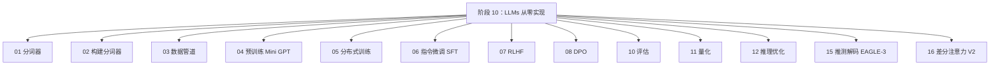
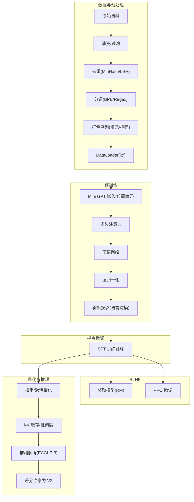
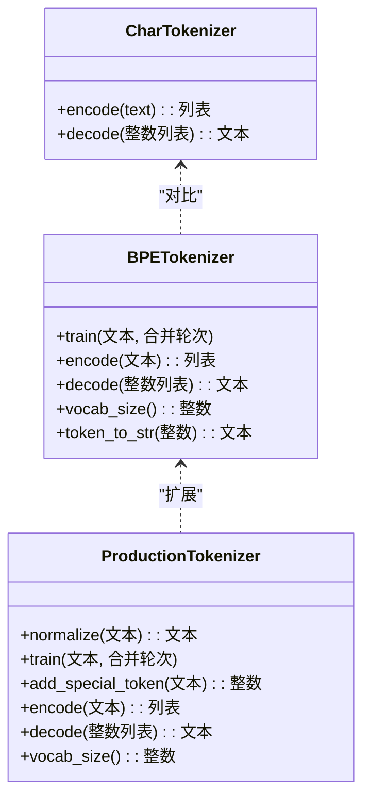
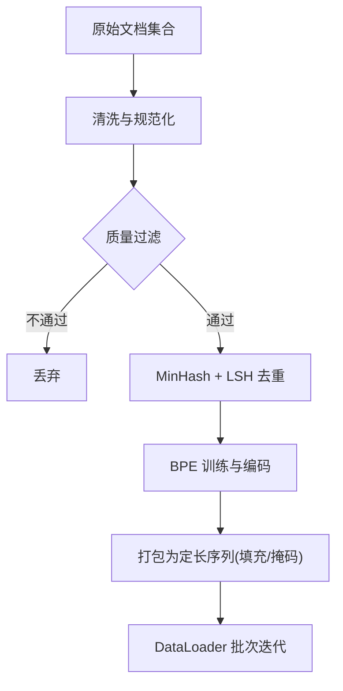
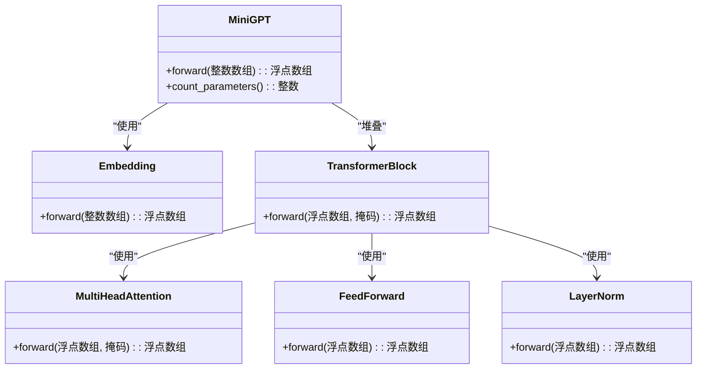
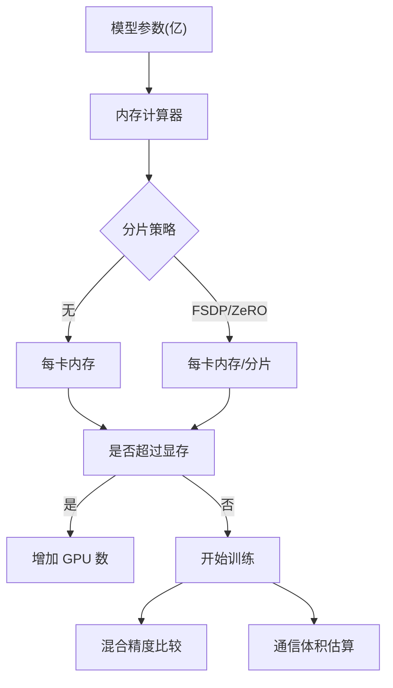
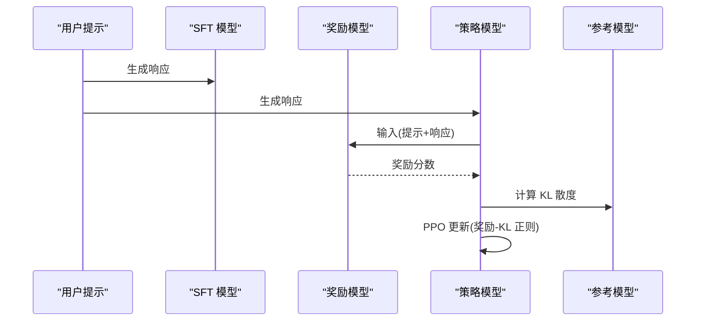
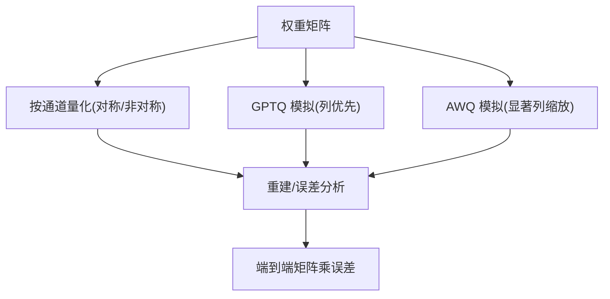
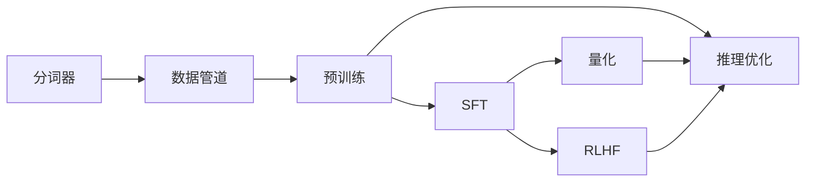

# 大语言模型从零实现

<cite>
**本文档引用的文件**
- [README.md](file://README.md)
- [main.py（分词器）](file://phases/10-llms-from-scratch/01-tokenizers/code/main.py)
- [main.py（构建分词器）](file://phases/10-llms-from-scratch/02-building-a-tokenizer/code/main.py)
- [main.py（数据管道）](file://phases/10-llms-from-scratch/03-data-pipelines/code/main.py)
- [main.py（Mini GPT 预训练）](file://phases/10-llms-from-scratch/04-pre-training-mini-gpt/code/main.py)
- [main.py（分布式训练）](file://phases/10-llms-from-scratch/05-scaling-distributed/code/main.py)
- [main.py（指令微调 SFT）](file://phases/10-llms-from-scratch/06-instruction-tuning-sft/code/main.py)
- [main.py（RLHF）](file://phases/10-llms-from-scratch/07-rlhf/code/main.py)
- [main.py（量化）](file://phases/10-llms-from-scratch/11-quantization/code/main.py)
- [main.py（推理优化）](file://phases/10-llms-from-scratch/12-inference-optimization/code/main.py)
- [main.py（EAGLE-3 推测解码）](file://phases/10-llms-from-scratch/15-speculative-decoding-eagle3/code/main.py)
- [main.py（差分注意力 V2）](file://phases/10-llms-from-scratch/16-differential-attention-v2/code/main.py)
</cite>

## 目录
1. [引言](#引言)
2. [项目结构](#项目结构)
3. [核心组件](#核心组件)
4. [架构总览](#架构总览)
5. [详细组件分析](#详细组件分析)
6. [依赖关系分析](#依赖关系分析)
7. [性能考量](#性能考量)
8. [故障排查指南](#故障排查指南)
9. [结论](#结论)
10. [附录](#附录)

## 引言
本项目以“从零实现”为核心目标，系统性覆盖大语言模型的完整开发流程：分词器实现、数据管道、预训练、指令微调（SFT）、奖励建模与强化学习人类反馈（RLHF）、直接偏好优化（DPO）、以及生产级推理优化与前沿技术（如推测解码、差分注意力）。通过纯 Python 实现，帮助读者深入理解每个模块的工作机制，建立可迁移的工程能力。

## 项目结构
- 课程采用“阶段-课时”的组织方式，每个课时包含：
  - code/：可运行的最小实现
  - docs/：中文讲解文档
  - outputs/：可复用的提示词、技能、代理或 MCP 服务器
- 本课程第 10 阶段“从零实现 LLM”共 22 课，覆盖从分词到生产的全链路。



图示来源
- [README.md:517-548](file://README.md#L517-L548)

章节来源
- [README.md:1-120](file://README.md#L1-L120)

## 核心组件
- 分词器：字符级与字节对编码（BPE），支持子词合并、特殊符号、与 tiktoken 对比
- 数据管道：文本清洗、质量过滤、去重（MinHash + LSH）、分词、打包序列、DataLoader
- 预训练：Mini GPT（嵌入、位置编码、多头注意力、前馈网络、层归一化）
- 分布式训练：数据并行、张量并行、流水线并行模拟，混合精度与通信体积估算
- 指令微调：监督微调（SFT）框架
- RLHF：奖励模型（BR）+ PPO 微调
- 量化：数值格式对比、称重法、感知度实验、GPTQ/AWQ 模拟
- 推理优化：KV 缓存、静态/连续批调度、前缀缓存、推测解码、带宽/算力权衡
- 前沿技术：EAGLE-3 推测解码、差分注意力 V2

章节来源
- [main.py（分词器）:1-228](file://phases/10-llms-from-scratch/01-tokenizers/code/main.py#L1-L228)
- [main.py（构建分词器）:1-259](file://phases/10-llms-from-scratch/02-building-a-tokenizer/code/main.py#L1-L259)
- [main.py（数据管道）:1-418](file://phases/10-llms-from-scratch/03-data-pipelines/code/main.py#L1-L418)
- [main.py（Mini GPT 预训练）:1-359](file://phases/10-llms-from-scratch/04-pre-training-mini-gpt/code/main.py#L1-L359)
- [main.py（分布式训练）:1-348](file://phases/10-llms-from-scratch/05-scaling-distributed/code/main.py#L1-L348)
- [main.py（RLHF）:1-452](file://phases/10-llms-from-scratch/07-rlhf/code/main.py#L1-L452)
- [main.py（量化）:1-505](file://phases/10-llms-from-scratch/11-quantization/code/main.py#L1-L505)
- [main.py（推理优化）:1-585](file://phases/10-llms-from-scratch/12-inference-optimization/code/main.py#L1-L585)
- [main.py（EAGLE-3 推测解码）:1-261](file://phases/10-llms-from-scratch/15-speculative-decoding-eagle3/code/main.py#L1-L261)
- [main.py（差分注意力 V2）:1-257](file://phases/10-llms-from-scratch/16-differential-attention-v2/code/main.py#L1-L257)

## 架构总览
以下图展示了从数据到模型训练与推理的关键路径，以及与生产优化的关系。



图示来源
- [main.py（数据管道）:158-201](file://phases/10-llms-from-scratch/03-data-pipelines/code/main.py#L158-L201)
- [main.py（Mini GPT 预训练）:81-104](file://phases/10-llms-from-scratch/04-pre-training-mini-gpt/code/main.py#L81-L104)
- [main.py（RLHF）:48-78](file://phases/10-llms-from-scratch/07-rlhf/code/main.py#L48-L78)
- [main.py（量化）:200-273](file://phases/10-llms-from-scratch/11-quantization/code/main.py#L200-L273)
- [main.py（推理优化）:5-82](file://phases/10-llms-from-scratch/12-inference-optimization/code/main.py#L5-L82)

## 详细组件分析

### 分词器实现
- 字符级分词器：基于 ASCII 码点，保证可逆
- BPE 分词器：基于字符级输入，迭代合并最高频相邻对；支持统计分析与与 tiktoken 对比
- 生产分词器：正则预分词（GPT-2 风格）、特殊符号处理、合并规则可视化



图示来源
- [main.py（分词器）:4-66](file://phases/10-llms-from-scratch/01-tokenizers/code/main.py#L4-L66)
- [main.py（构建分词器）:59-124](file://phases/10-llms-from-scratch/02-building-a-tokenizer/code/main.py#L59-L124)

章节来源
- [main.py（分词器）:1-228](file://phases/10-llms-from-scratch/01-tokenizers/code/main.py#L1-L228)
- [main.py（构建分词器）:1-259](file://phases/10-llms-from-scratch/02-building-a-tokenizer/code/main.py#L1-L259)

### 数据管道与预处理
- 清洗：去除 HTML、URL、控制字符，规范化空白
- 质量过滤：最低词数、大写比例、特殊字符比例
- 去重：MinHash + LSH，桶化 + Jaccard 过滤
- 分词：BPE 训练与编码
- 序列打包：固定长度、填充、注意力掩码
- DataLoader：随机打乱、批次生成



图示来源
- [main.py（数据管道）:8-94](file://phases/10-llms-from-scratch/03-data-pipelines/code/main.py#L8-L94)
- [main.py（数据管道）:158-201](file://phases/10-llms-from-scratch/03-data-pipelines/code/main.py#L158-L201)

章节来源
- [main.py（数据管道）:1-418](file://phases/10-llms-from-scratch/03-data-pipelines/code/main.py#L1-L418)

### 预训练：Mini GPT
- 模型组件：嵌入（词嵌入+位置嵌入）、多头注意力、前馈网络、层归一化
- 前向：因果掩码、残差连接、输出投影
- 训练：随机滑窗采样、交叉熵损失、手动反向传播（逐层梯度更新）
- 生成：温度采样、截断上下文



图示来源
- [main.py（Mini GPT 预训练）:4-118](file://phases/10-llms-from-scratch/04-pre-training-mini-gpt/code/main.py#L4-L118)

章节来源
- [main.py（Mini GPT 预训练）:1-359](file://phases/10-llms-from-scratch/04-pre-training-mini-gpt/code/main.py#L1-L359)

### 分布式训练
- 数据并行：按 GPU 数均分样本，平均损失与梯度
- 张量并行：按输出维度切分权重矩阵，拼接结果
- 流水线并行：按层数分阶段，微批调度与气泡时间分析
- 内存估算：权重/优化器/梯度/激活内存，不同分片策略
- 混合精度：FP32/FP16/BF16/Mixed 的节省率
- 通信体积：Ring AllReduce、FSDP、张量并行的通信开销
- 成本估算：FLOPs、GPU 小时、总成本



图示来源
- [main.py（分布式训练）:85-140](file://phases/10-llms-from-scratch/05-scaling-distributed/code/main.py#L85-L140)
- [main.py（分布式训练）:143-167](file://phases/10-llms-from-scratch/05-scaling-distributed/code/main.py#L143-L167)
- [main.py（分布式训练）:170-196](file://phases/10-llms-from-scratch/05-scaling-distributed/code/main.py#L170-L196)
- [main.py（分布式训练）:199-243](file://phases/10-llms-from-scratch/05-scaling-distributed/code/main.py#L199-L243)

章节来源
- [main.py（分布式训练）:1-348](file://phases/10-llms-from-scratch/05-scaling-distributed/code/main.py#L1-L348)

### 指令微调（SFT）
- 使用预训练模型作为初始化，针对指令-响应对进行监督微调
- 可作为 RLHF 的起点，提供更稳定的基线

章节来源
- [main.py（指令微调 SFT）:1-200](file://phases/10-llms-from-scratch/06-instruction-tuning-sft/code/main.py#L1-L200)

### RLHF：奖励模型 + PPO
- 奖励模型：基于 Transformer 的最后一层隐藏态回归/分类奖励
- Bradley-Terry 损失：偏好对排序损失
- PPO：策略梯度 + KL 正则，参考模型约束



图示来源
- [main.py（RLHF）:48-160](file://phases/10-llms-from-scratch/07-rlhf/code/main.py#L48-L160)
- [main.py（RLHF）:220-277](file://phases/10-llms-from-scratch/07-rlhf/code/main.py#L220-L277)

章节来源
- [main.py（RLHF）:1-452](file://phases/10-llms-from-scratch/07-rlhf/code/main.py#L1-L452)

### 量化：数值格式与方法
- 数值格式：FP32/FP16/BF16/FP8e4m3 位布局与误差
- 称重法：对称/非对称、按张量/按通道量化
- 感知度实验：权重/激活/KV 缓存/注意力 logit 的敏感性
- GPTQ/AWQ 模拟：基于 Hessian/重要性权重的列优先量化



图示来源
- [main.py（量化）:82-135](file://phases/10-llms-from-scratch/11-quantization/code/main.py#L82-L135)
- [main.py（量化）:275-327](file://phases/10-llms-from-scratch/11-quantization/code/main.py#L275-L327)
- [main.py（量化）:330-364](file://phases/10-llms-from-scratch/11-quantization/code/main.py#L330-L364)
- [main.py（量化）:419-438](file://phases/10-llms-from-scratch/11-quantization/code/main.py#L419-L438)

章节来源
- [main.py（量化）:1-505](file://phases/10-llms-from-scratch/11-quantization/code/main.py#L1-L505)

### 推理优化：KV 缓存、批调度、推测解码、差分注意力
- KV 缓存：记录每层每步的 K/V，支持增量解码
- 批调度：静态批与连续批，统计延迟/吞吐
- 前缀缓存：共享系统提示的 KV 复用
- 推测解码（EAGLE-3）：N-token 草稿 + 并行验证 + 拒绝采样 + 奖励令牌
- Ops:Byte 分析：确定计算/内存瓶颈与最优批大小
- 差分注意力 V2：双分支 softmax 减去噪声底座，提升长上下文信号信噪比

```mermaid
sequenceDiagram
participant Q as "草稿模型 q"
participant KVC as "KV 缓存"
participant VER as "验证模型 p"
participant KVBUF as "逻辑 KV 长度"
Q->>Q : 生成 N 个候选 token
Q->>VER : 并行验证前 N 位
VER-->>Q : 返回各 token 的 q 概率
loop 验证过程
Q->>Q : 计算 q(d)/p(d)
alt 接受
Q->>KVC : 追加 K/V
Q->>KVBUF : 长度+1
else 拒绝
Q->>Q : 残差校正 (q-p)_+
Q->>KVBUF : 回滚到接受前长度
break
end
end
Q->>Q : 全部接受时追加奖励 token
```

图示来源
- [main.py（EAGLE-3 推测解码）:61-98](file://phases/10-llms-from-scratch/15-speculative-decoding-eagle3/code/main.py#L61-L98)
- [main.py（推理优化）:5-82](file://phases/10-llms-from-scratch/12-inference-optimization/code/main.py#L5-L82)

章节来源
- [main.py（推理优化）:1-585](file://phases/10-llms-from-scratch/12-inference-optimization/code/main.py#L1-L585)
- [main.py（EAGLE-3 推测解码）:1-261](file://phases/10-llms-from-scratch/15-speculative-decoding-eagle3/code/main.py#L1-L261)
- [main.py（差分注意力 V2）:1-257](file://phases/10-llms-from-scratch/16-differential-attention-v2/code/main.py#L1-L257)

## 依赖关系分析
- 模块内依赖
  - 数据管道依赖分词器（BPE）
  - 预训练依赖分词器与数据管道
  - RLHF 依赖预训练模型（MiniGPT）
  - 推理优化与量化在训练完成后用于部署
- 外部依赖
  - 仅使用标准库（numpy 仅用于演示，核心实现不含外部依赖）



图示来源
- [main.py（数据管道）:158-201](file://phases/10-llms-from-scratch/03-data-pipelines/code/main.py#L158-L201)
- [main.py（Mini GPT 预训练）:81-104](file://phases/10-llms-from-scratch/04-pre-training-mini-gpt/code/main.py#L81-L104)
- [main.py（RLHF）:338-421](file://phases/10-llms-from-scratch/07-rlhf/code/main.py#L338-L421)
- [main.py（量化）:200-273](file://phases/10-llms-from-scratch/11-quantization/code/main.py#L200-L273)
- [main.py（推理优化）:5-82](file://phases/10-llms-from-scratch/12-inference-optimization/code/main.py#L5-L82)

章节来源
- [main.py（数据管道）:1-418](file://phases/10-llms-from-scratch/03-data-pipelines/code/main.py#L1-L418)
- [main.py（Mini GPT 预训练）:1-359](file://phases/10-llms-from-scratch/04-pre-training-mini-gpt/code/main.py#L1-L359)
- [main.py（RLHF）:1-452](file://phases/10-llms-from-scratch/07-rlhf/code/main.py#L1-L452)
- [main.py（量化）:1-505](file://phases/10-llms-from-scratch/11-quantization/code/main.py#L1-L505)
- [main.py（推理优化）:1-585](file://phases/10-llms-from-scratch/12-inference-optimization/code/main.py#L1-L585)

## 性能考量
- 计算与内存权衡
  - Ops:Byte 比率决定计算/内存瓶颈，连续批解码在高吞吐场景下更优
- KV 缓存
  - Llama-3 70B 每 token 约 320KB KV，需结合显存预算规划上下文长度
- 推测解码
  - EAGLE-3 类草稿质量（α≈0.9）在 N=5 时约 4–5 token/验证前向，配合树搜索与 TTL 可达更高加速
- 差分注意力
  - 在长上下文查询中显著提升信号信噪比，V2 参数量接近基线且保持解码速度

## 故障排查指南
- 分词异常
  - 检查特殊符号添加顺序与正则预分词一致性
  - 对照 tiktoken 结果，定位合并规则差异
- 数据质量
  - 调整质量过滤阈值（最低词数、大写比例、特殊字符比例）
  - MinHash 去重阈值过高会导致误删，过低会漏删
- 训练不稳定
  - 降低学习率、检查梯度裁剪、确认掩码正确
  - 分布式训练注意梯度同步与显存上限
- 推理性能
  - 关注 KV 缓存大小与批大小，避免碎片化
  - 选择合适的推测解码 N 与草稿质量

章节来源
- [main.py（构建分词器）:163-213](file://phases/10-llms-from-scratch/02-building-a-tokenizer/code/main.py#L163-L213)
- [main.py（数据管道）:17-27](file://phases/10-llms-from-scratch/03-data-pipelines/code/main.py#L17-L27)
- [main.py（Mini GPT 预训练）:190-270](file://phases/10-llms-from-scratch/04-pre-training-mini-gpt/code/main.py#L190-L270)
- [main.py（推理优化）:427-467](file://phases/10-llms-from-scratch/12-inference-optimization/code/main.py#L427-L467)

## 结论
本课程以“从零实现”为主线，将分词、数据、预训练、SFT、RLHF、量化与推理优化串联为完整闭环。通过纯 Python 实现，读者可以深入理解每个组件的内部机制与工程权衡，为后续在真实框架（如 PyTorch/DeepSpeed/vLLM）上的工程实践打下坚实基础。

## 附录
- 术语与概念
  - BPE：字节对编码，子词分词的经典方法
  - MinHash/LSH：大规模去重的高效近似算法
  - FSDP/ZeRO：参数/梯度/优化器状态分片的分布式策略
  - 推测解码：以低成本草稿模型预测多个 token，减少昂贵验证次数
  - 差分注意力：通过双分支 softmax 的差分抑制噪声，增强长程信号