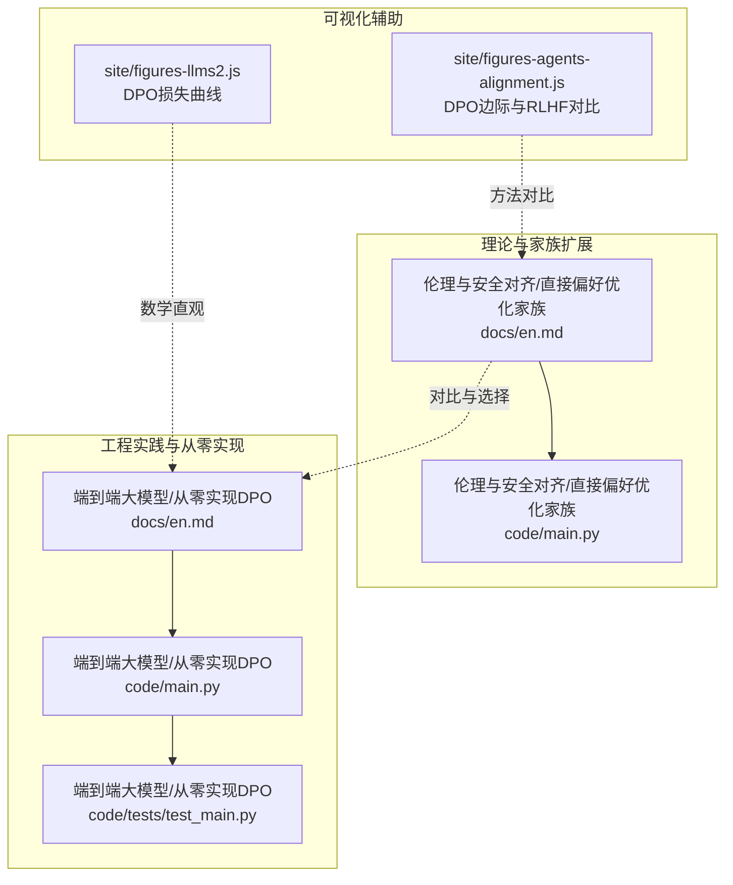
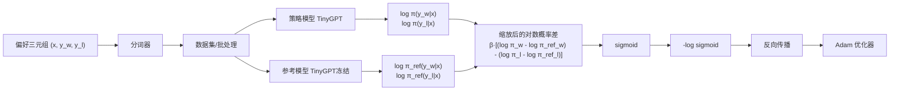
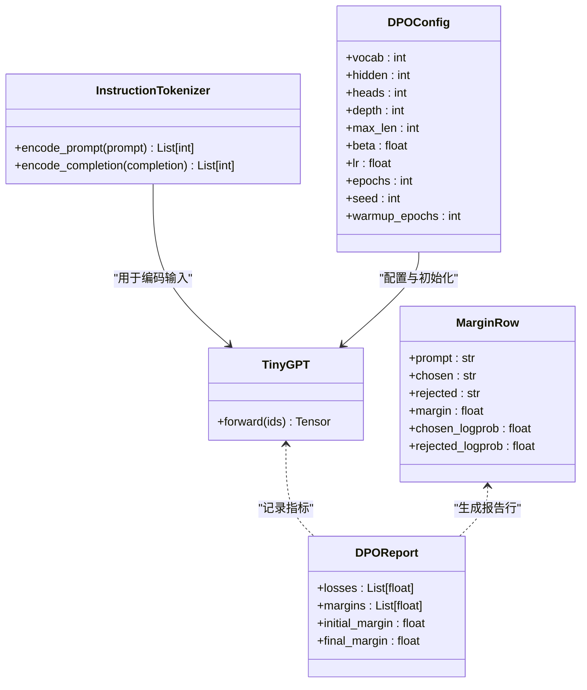
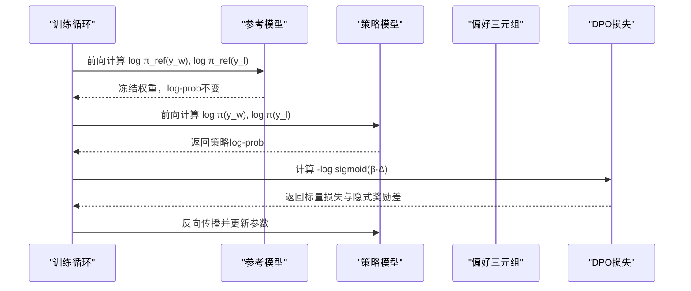
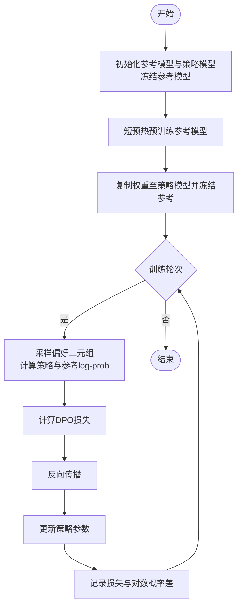

# DPO直接优化方法

<cite>
**本文引用的文件**
- [phases/18-ethics-safety-alignment/03-direct-preference-optimization-family/docs/en.md](file://phases/18-ethics-safety-alignment/03-direct-preference-optimization-family/docs/en.md)
- [phases/18-ethics-safety-alignment/03-direct-preference-optimization-family/code/main.py](file://phases/18-ethics-safety-alignment/03-direct-preference-optimization-family/code/main.py)
- [phases/19-capstone-projects/40-dpo-from-scratch/docs/en.md](file://phases/19-capstone-projects/40-dpo-from-scratch/docs/en.md)
- [phases/19-capstone-projects/40-dpo-from-scratch/code/main.py](file://phases/19-capstone-projects/40-dpo-from-scratch/code/main.py)
- [phases/19-capstone-projects/40-dpo-from-scratch/code/tests/test_main.py](file://phases/19-capstone-projects/40-dpo-from-scratch/code/tests/test_main.py)
- [site/figures-llms2.js](file://site/figures-llms2.js)
- [site/figures-agents-alignment.js](file://site/figures-agents-alignment.js)
</cite>

## 目录
1. [引言](#引言)
2. [项目结构](#项目结构)
3. [核心组件](#核心组件)
4. [架构总览](#架构总览)
5. [详细组件分析](#详细组件分析)
6. [依赖关系分析](#依赖关系分析)
7. [性能考量](#性能考量)
8. [故障排查指南](#故障排查指南)
9. [结论](#结论)
10. [附录](#附录)

## 引言
本文件系统化梳理DPO（直接偏好优化）方法的理论、实现与工程实践，面向希望在实际项目中落地DPO的工程师与研究者。内容覆盖：
- DPO的核心思想与数学推导：从RLHF的闭式最优解出发，得到无需显式奖励模型的偏好对直接训练目标
- 损失函数与梯度更新策略：明确每项贡献的来源与符号方向
- 实现与使用示例：提供可运行的最小实现与测试用例路径
- 与RLHF的对比：在效率、稳定性、性能上的差异与权衡
- 参数调优建议与常见问题处理

## 项目结构
本仓库中与DPO相关的内容主要分布在两个层面：
- 理论与家族扩展：在伦理与安全对齐课程中，系统讲解DPO及其衍生方法（IPO、KTO、SimPO、ORPO、BPO），并给出对比与选择建议
- 工程实践与从零实现：在端到端大模型课程的“从零实现DPO”项目中，构建了可运行的参考模型、策略模型、日志概率计算、DPO损失与训练循环，并配有单元测试

图示来源
- [phases/18-ethics-safety-alignment/03-direct-preference-optimization-family/docs/en.md:1-170](file://phases/18-ethics-safety-alignment/03-direct-preference-optimization-family/docs/en.md#L1-L170)
- [phases/18-ethics-safety-alignment/03-direct-preference-optimization-family/code/main.py:1-231](file://phases/18-ethics-safety-alignment/03-direct-preference-optimization-family/code/main.py#L1-L231)
- [phases/19-capstone-projects/40-dpo-from-scratch/docs/en.md:1-160](file://phases/19-capstone-projects/40-dpo-from-scratch/docs/en.md#L1-L160)
- [phases/19-capstone-projects/40-dpo-from-scratch/code/main.py:1-564](file://phases/19-capstone-projects/40-dpo-from-scratch/code/main.py#L1-L564)
- [site/figures-llms2.js:176-215](file://site/figures-llms2.js#L176-L215)
- [site/figures-agents-alignment.js:297-331](file://site/figures-agents-alignment.js#L297-L331)

章节来源
- [phases/18-ethics-safety-alignment/03-direct-preference-optimization-family/docs/en.md:1-170](file://phases/18-ethics-safety-alignment/03-direct-preference-optimization-family/docs/en.md#L1-L170)
- [phases/19-capstone-projects/40-dpo-from-scratch/docs/en.md:1-160](file://phases/19-capstone-projects/40-dpo-from-scratch/docs/en.md#L1-L160)

## 核心组件
- 参考模型与策略模型：参考模型权重冻结，策略模型在训练中可更新；二者共享架构，初始化时权重一致
- 分词器：指令与响应分隔符，字节级编码
- 序列日志概率：对完成序列的逐token对数概率求和，掩蔽提示部分
- DPO损失：基于偏好对的隐式奖励差（缩放后的对数概率差）经sigmoid后取负对数
- 训练循环：每轮遍历偏好三元组，前向计算策略与参考模型的log-prob，计算损失并反向更新

章节来源
- [phases/19-capstone-projects/40-dpo-from-scratch/docs/en.md:116-160](file://phases/19-capstone-projects/40-dpo-from-scratch/docs/en.md#L116-L160)
- [phases/19-capstone-projects/40-dpo-from-scratch/code/main.py:364-377](file://phases/19-capstone-projects/40-dpo-from-scratch/code/main.py#L364-L377)
- [phases/19-capstone-projects/40-dpo-from-scratch/code/main.py:195-234](file://phases/19-capstone-projects/40-dpo-from-scratch/code/main.py#L195-L234)
- [phases/19-capstone-projects/40-dpo-from-scratch/code/main.py:236-257](file://phases/19-capstone-projects/40-dpo-from-scratch/code/main.py#L236-L257)
- [phases/19-capstone-projects/40-dpo-from-scratch/code/main.py:452-493](file://phases/19-capstone-projects/40-dpo-from-scratch/code/main.py#L452-L493)

## 架构总览
下图展示了从偏好三元组到损失与优化的关键数据流。

图示来源
- [phases/19-capstone-projects/40-dpo-from-scratch/docs/en.md:70-84](file://phases/19-capstone-projects/40-dpo-from-scratch/docs/en.md#L70-L84)
- [phases/19-capstone-projects/40-dpo-from-scratch/code/main.py:236-257](file://phases/19-capstone-projects/40-dpo-from-scratch/code/main.py#L236-L257)
- [phases/19-capstone-projects/40-dpo-from-scratch/code/main.py:452-493](file://phases/19-capstone-projects/40-dpo-from-scratch/code/main.py#L452-L493)

## 详细组件分析

### 数学原理与损失函数
- 推导起点：Bradley-Terry偏好模型与RLHF带KL锚的最优策略闭式解
- 隐式奖励：r(x, y) = β·(log π(y|x) − log π_ref(y|x))，其中π_ref为参考策略
- 偏好对损失：L_DPO = −log sigmoid(β·[(log π(y_w|x) − log π_ref(y_w|x)) − (log π(y_l|x) − log π_ref(y_l|x))])
- 关键性质：
  - 当chosen与rejected的log-prob差为0时，损失为log(2)
  - 正差降低损失，负差提高损失
  - 参考模型的相同偏移在差分中抵消，保证参考无关性

章节来源
- [phases/18-ethics-safety-alignment/03-direct-preference-optimization-family/docs/en.md:19-68](file://phases/18-ethics-safety-alignment/03-direct-preference-optimization-family/docs/en.md#L19-L68)
- [phases/19-capstone-projects/40-dpo-from-scratch/docs/en.md:26-68](file://phases/19-capstone-projects/40-dpo-from-scratch/docs/en.md#L26-L68)

### 梯度更新策略
- 对chosen log-prob的梯度为负，推动其上升
- 对rejected log-prob的梯度为正，推动其下降
- 参考模型参数不更新，log-prob不变，确保KL约束以隐式方式生效

章节来源
- [phases/19-capstone-projects/40-dpo-from-scratch/docs/en.md:86-94](file://phases/19-capstone-projects/40-dpo-from-scratch/docs/en.md#L86-L94)

### DPO家族扩展（IPO、KTO、SimPO、ORPO、BPO）
- IPO：将log-sigmoid替换为平方误差，目标边界的对数概率差为1/(2β)，避免饱和
- KTO：单标签前景理论效用，支持未配对反馈，引入损失规避权重
- SimPO：去除参考模型，长度归一化的对数似然+边界，缓解长度偏差
- ORPO：在标准NLL基础上加入几率比偏好项，单阶段训练
- BPO：在DPO基础上增加对“被选中响应绝对对数概率下降”的惩罚，解决“被选中响应退化”现象

章节来源
- [phases/18-ethics-safety-alignment/03-direct-preference-optimization-family/docs/en.md:43-120](file://phases/18-ethics-safety-alignment/03-direct-preference-optimization-family/docs/en.md#L43-L120)

### 从零实现（TinyGPT + DPO）
- 模型：TinyGPT（因果自注意力块 + 前馈层 + LayerNorm + 线性输出头）
- 数据：12个简单任务的偏好三元组
- 训练：短预热预训练提升参考模型对任务的对数概率，随后冻结参考模型，训练策略模型
- 指标：记录每步损失与chosen-rejected对数概率差，验证训练有效

章节来源
- [phases/19-capstone-projects/40-dpo-from-scratch/docs/en.md:116-160](file://phases/19-capstone-projects/40-dpo-from-scratch/docs/en.md#L116-L160)
- [phases/19-capstone-projects/40-dpo-from-scratch/code/main.py:100-117](file://phases/19-capstone-projects/40-dpo-from-scratch/code/main.py#L100-L117)
- [phases/19-capstone-projects/40-dpo-from-scratch/code/main.py:124-187](file://phases/19-capstone-projects/40-dpo-from-scratch/code/main.py#L124-L187)
- [phases/19-capstone-projects/40-dpo-from-scratch/code/main.py:364-377](file://phases/19-capstone-projects/40-dpo-from-scratch/code/main.py#L364-L377)
- [phases/19-capstone-projects/40-dpo-from-scratch/code/main.py:452-493](file://phases/19-capstone-projects/40-dpo-from-scratch/code/main.py#L452-L493)
- [phases/19-capstone-projects/40-dpo-from-scratch/code/main.py:501-559](file://phases/19-capstone-projects/40-dpo-from-scratch/code/main.py#L501-L559)

### 类与模块关系（代码级）

图示来源
- [phases/19-capstone-projects/40-dpo-from-scratch/code/main.py:40-54](file://phases/19-capstone-projects/40-dpo-from-scratch/code/main.py#L40-L54)
- [phases/19-capstone-projects/40-dpo-from-scratch/code/main.py:100-117](file://phases/19-capstone-projects/40-dpo-from-scratch/code/main.py#L100-L117)
- [phases/19-capstone-projects/40-dpo-from-scratch/code/main.py:350-362](file://phases/19-capstone-projects/40-dpo-from-scratch/code/main.py#L350-L362)
- [phases/19-capstone-projects/40-dpo-from-scratch/code/main.py:422-428](file://phases/19-capstone-projects/40-dpo-from-scratch/code/main.py#L422-L428)
- [phases/19-capstone-projects/40-dpo-from-scratch/code/main.py:299-307](file://phases/19-capstone-projects/40-dpo-from-scratch/code/main.py#L299-L307)

### 训练流程（序列图）

图示来源
- [phases/19-capstone-projects/40-dpo-from-scratch/code/main.py:452-493](file://phases/19-capstone-projects/40-dpo-from-scratch/code/main.py#L452-L493)

### 算法流程（决策与收敛）

图示来源
- [phases/19-capstone-projects/40-dpo-from-scratch/code/main.py:501-559](file://phases/19-capstone-projects/40-dpo-from-scratch/code/main.py#L501-L559)

## 依赖关系分析
- 组件耦合
  - 分词器与模型：分词器负责构造输入序列，模型负责预测分布
  - 参考模型与策略模型：通过冻结与权重复制建立强约束关系，确保KL锚定
  - 损失模块：仅依赖log-prob差值，不依赖外部奖励模型
- 外部依赖
  - PyTorch：张量运算、自动微分、优化器
  - NumPy：数值统计与平均值计算
  - 标准库：随机种子、数据类、类型注解

章节来源
- [phases/19-capstone-projects/40-dpo-from-scratch/code/main.py:21-33](file://phases/19-capstone-projects/40-dpo-from-scratch/code/main.py#L21-L33)
- [phases/19-capstone-projects/40-dpo-from-scratch/code/main.py:364-377](file://phases/19-capstone-projects/40-dpo-from-scratch/code/main.py#L364-L377)
- [phases/19-capstone-projects/40-dpo-from-scratch/code/main.py:452-493](file://phases/19-capstone-projects/40-dpo-from-scratch/code/main.py#L452-L493)

## 性能考量
- 计算复杂度
  - 单样本DPO损失涉及两次模型前向（策略与参考），以及一次标量损失计算
  - 训练开销主要由模型前向/反向与优化器更新构成
- 收敛特性
  - 在小样本偏好数据上，chosen-rejected对数概率差应随训练上升
  - 损耗应随训练下降，且最终应显著低于无偏好时的log(2)
- 可视化辅助
  - DPO损失与边际曲线帮助理解β与边际对损失的影响
  - RLHF与DPO对比图有助于把握两者在目标与约束上的差异

章节来源
- [site/figures-llms2.js:176-215](file://site/figures-llms2.js#L176-L215)
- [site/figures-agents-alignment.js:297-331](file://site/figures-agents-alignment.js#L297-L331)
- [phases/19-capstone-projects/40-dpo-from-scratch/docs/en.md:148-151](file://phases/19-capstone-projects/40-dpo-from-scratch/docs/en.md#L148-L151)

## 故障排查指南
- 参考模型权重未冻结
  - 现象：参考模型在训练中参数变化，log-prob波动
  - 处理：确保构建参考模型后设置requires_grad=False，并在前向时禁用梯度
- 策略模型初始与参考不一致
  - 现象：训练初期指标不稳定或不收敛
  - 处理：通过load_state_dict复制参考权重，确保初始化一致
- 损失不降或边际不升
  - 现象：最终损失不小于初始，chosen-rejected边际不升
  - 处理：检查梯度方向（对chosen应负，对rejected应正），确认β合理，核对数据标签一致性
- 长度偏差导致误判
  - 现象：更长的完成序列可能因绝对对数概率更高而被偏好
  - 处理：采用长度归一化或SimPO等变体

章节来源
- [phases/19-capstone-projects/40-dpo-from-scratch/code/main.py:364-377](file://phases/19-capstone-projects/40-dpo-from-scratch/code/main.py#L364-L377)
- [phases/19-capstone-projects/40-dpo-from-scratch/code/tests/test_main.py:140-171](file://phases/19-capstone-projects/40-dpo-from-scratch/code/tests/test_main.py#L140-L171)
- [phases/19-capstone-projects/40-dpo-from-scratch/docs/en.md:152-157](file://phases/19-capstone-projects/40-dpo-from-scratch/docs/en.md#L152-L157)

## 结论
DPO以闭式最优解为基础，将RLHF的两阶段（奖励模型+强化学习）简化为单阶段的偏好对直接监督训练，显著降低工程复杂度与资源占用。其隐式KL约束通过sigmoid饱和与对数概率差的结构实现，无需显式KL项。在实践中，需重视参考模型的冻结与初始化一致性、损失与梯度的方向性、以及长度偏差等挑战。对于不同场景，可结合IPO、KTO、SimPO、ORPO、BPO等家族成员进行针对性改进与选择。

## 附录

### 使用示例与运行指引
- 运行从零实现演示
  - 路径：[phases/19-capstone-projects/40-dpo-from-scratch/code/main.py:501-559](file://phases/19-capstone-projects/40-dpo-from-scratch/code/main.py#L501-L559)
  - 行为：构建参考与策略模型，短预热后冻结参考，训练30轮，打印每步损失与边际，最终校验边际上升与损失下降
- 运行单元测试
  - 路径：[phases/19-capstone-projects/40-dpo-from-scratch/code/tests/test_main.py:217-271](file://phases/19-capstone-projects/40-dpo-from-scratch/code/tests/test_main.py#L217-L271)
  - 行为：验证损失数学正确性、梯度方向、参考不变性、长度归一化与训练收敛等

章节来源
- [phases/19-capstone-projects/40-dpo-from-scratch/code/main.py:501-559](file://phases/19-capstone-projects/40-dpo-from-scratch/code/main.py#L501-L559)
- [phases/19-capstone-projects/40-dpo-from-scratch/code/tests/test_main.py:217-271](file://phases/19-capstone-projects/40-dpo-from-scratch/code/tests/test_main.py#L217-L271)

### DPO与RLHF对比要点
- 目标函数
  - RLHF：最大化期望奖励减去KL散度
  - DPO：直接对偏好对建模，损失为负对数sigmoid的缩放差
- 稳定性
  - RLHF：依赖奖励模型质量与KL控制，易出现奖励黑客
  - DPO：隐式KL约束，无需单独奖励模型，但需注意偏好强度与分布
- 效率
  - RLHF：两阶段，内存与计算开销较大
  - DPO：单阶段，部署与训练更简洁

章节来源
- [site/figures-agents-alignment.js:111-174](file://site/figures-agents-alignment.js#L111-L174)
- [site/figures-agents-alignment.js:253-295](file://site/figures-agents-alignment.js#L253-L295)
- [phases/18-ethics-safety-alignment/03-direct-preference-optimization-family/docs/en.md:17-39](file://phases/18-ethics-safety-alignment/03-direct-preference-optimization-family/docs/en.md#L17-L39)