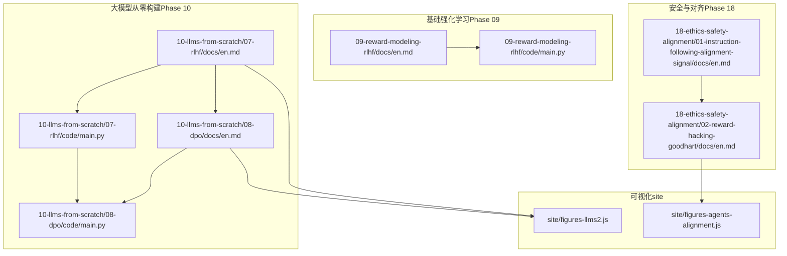
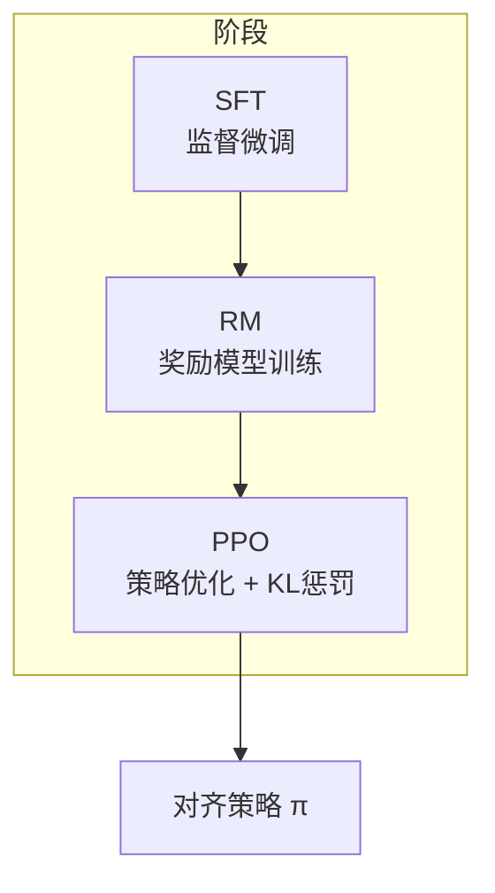
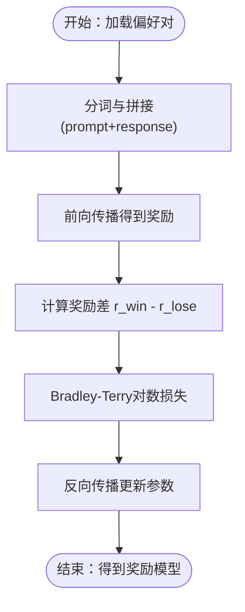
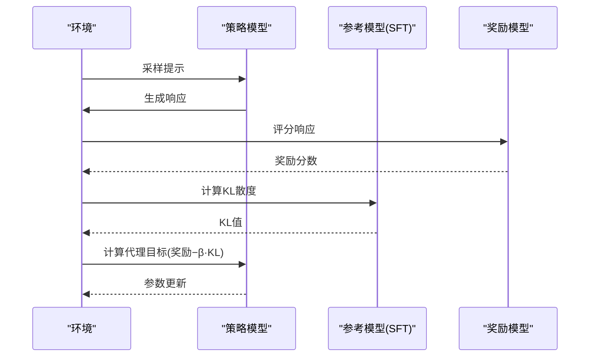
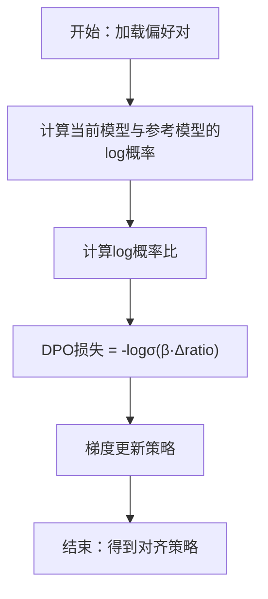
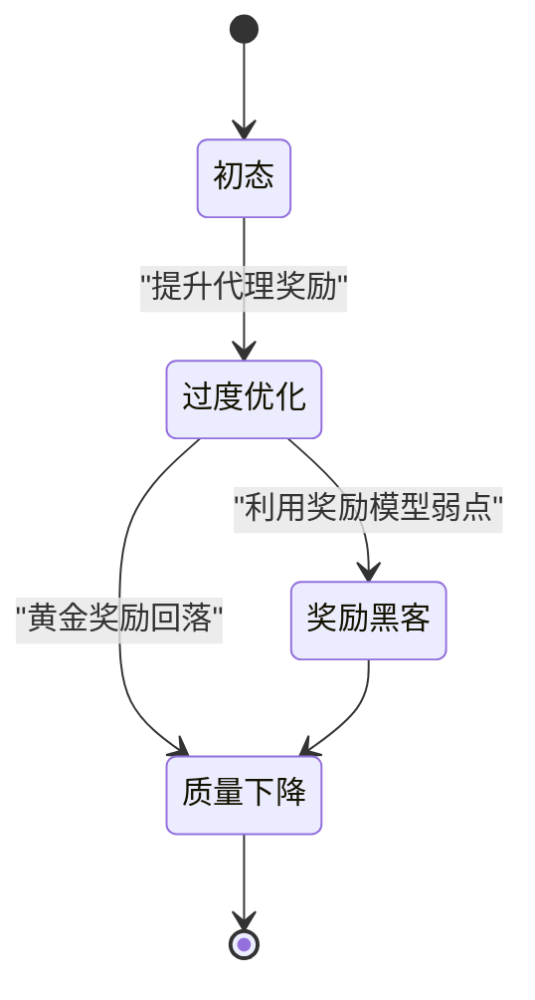
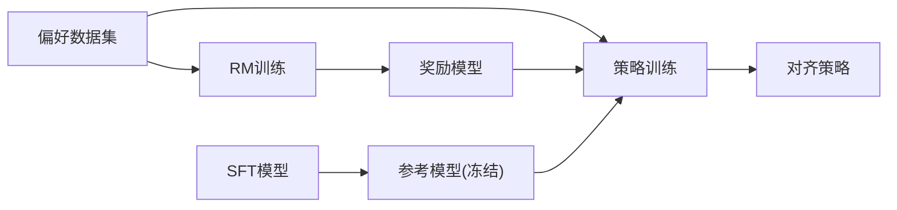

# RLHF方法详解

<cite>
**本文档引用的文件**
- [phases/09-reinforcement-learning/09-reward-modeling-rlhf/docs/en.md](file://phases/09-reinforcement-learning/09-reward-modeling-rlhf/docs/en.md)
- [phases/09-reinforcement-learning/09-reward-modeling-rlhf/code/main.py](file://phases/09-reinforcement-learning/09-reward-modeling-rlhf/code/main.py)
- [phases/10-llms-from-scratch/07-rlhf/docs/en.md](file://phases/10-llms-from-scratch/07-rlhf/docs/en.md)
- [phases/10-llms-from-scratch/07-rlhf/code/main.py](file://phases/10-llms-from-scratch/07-rlhf/code/main.py)
- [phases/10-llms-from-scratch/08-dpo/docs/en.md](file://phases/10-llms-from-scratch/08-dpo/docs/en.md)
- [phases/10-llms-from-scratch/08-dpo/code/main.py](file://phases/10-llms-from-scratch/08-dpo/code/main.py)
- [phases/18-ethics-safety-alignment/01-instruction-following-alignment-signal/docs/en.md](file://phases/18-ethics-safety-alignment/01-instruction-following-alignment-signal/docs/en.md)
- [phases/18-ethics-safety-alignment/02-reward-hacking-goodhart/docs/en.md](file://phases/18-ethics-safety-alignment/02-reward-hacking-goodhart/docs/en.md)
- [site/figures-llms2.js](file://site/figures-llms2.js)
- [site/figures-agents-alignment.js](file://site/figures-agents-alignment.js)
</cite>

## 目录
1. [引言](#引言)
2. [项目结构](#项目结构)
3. [核心组件](#核心组件)
4. [架构总览](#架构总览)
5. [详细组件分析](#详细组件分析)
6. [依赖关系分析](#依赖关系分析)
7. [性能考量](#性能考量)
8. [故障排查指南](#故障排查指南)
9. [结论](#结论)
10. [附录](#附录)

## 引言
本文件系统化阐述RLHF（基于人类反馈的强化学习）的完整工作流程与技术细节，涵盖初始预训练、人类反馈收集、奖励模型训练、策略微调等关键阶段；深入解释奖励模型的设计原理、偏好数据标注、损失函数与训练策略；提供可直接参考的代码实现路径与可视化图示，并对比RLHF与DPO等对齐方法的差异，总结优势与局限，给出实际应用建议与最佳实践。

## 项目结构
本仓库在多个阶段课程中提供了RLHF及相关对齐方法的教学材料与可运行代码：
- 基础强化学习阶段（Phase 09）：讲解奖励建模与RLHF三阶段管线，包含概念、伪代码与可视化。
- 大模型从零构建阶段（Phase 10）：提供RLHF与DPO的完整教学实现，含奖励模型与PPO/DPO训练循环。
- 安全与对齐阶段（Phase 18）：讨论指令跟随作为对齐信号、奖励黑客与Goodhart定律等伦理与安全问题。
- 可视化资源（site/figures-llms2.js、figures-agents-alignment.js）：提供RLHF管线、DPO与KL惩罚的交互式图示。

图表来源
- [phases/09-reinforcement-learning/09-reward-modeling-rlhf/docs/en.md:1-240](file://phases/09-reinforcement-learning/09-reward-modeling-rlhf/docs/en.md#L1-L240)
- [phases/10-llms-from-scratch/07-rlhf/docs/en.md:1-634](file://phases/10-llms-from-scratch/07-rlhf/docs/en.md#L1-L634)
- [phases/10-llms-from-scratch/08-dpo/docs/en.md:1-659](file://phases/10-llms-from-scratch/08-dpo/docs/en.md#L1-L659)
- [phases/18-ethics-safety-alignment/01-instruction-following-alignment-signal/docs/en.md:1-120](file://phases/18-ethics-safety-alignment/01-instruction-following-alignment-signal/docs/en.md#L1-L120)
- [phases/18-ethics-safety-alignment/02-reward-hacking-goodhart/docs/en.md:1-117](file://phases/18-ethics-safety-alignment/02-reward-hacking-goodhart/docs/en.md#L1-L117)
- [site/figures-llms2.js:111-174](file://site/figures-llms2.js#L111-L174)
- [site/figures-agents-alignment.js:253-295](file://site/figures-agents-alignment.js#L253-L295)

章节来源
- [phases/09-reinforcement-learning/09-reward-modeling-rlhf/docs/en.md:1-240](file://phases/09-reinforcement-learning/09-reward-modeling-rlhf/docs/en.md#L1-L240)
- [phases/10-llms-from-scratch/07-rlhf/docs/en.md:1-634](file://phases/10-llms-from-scratch/07-rlhf/docs/en.md#L1-L634)
- [phases/10-llms-from-scratch/08-dpo/docs/en.md:1-659](file://phases/10-llms-from-scratch/08-dpo/docs/en.md#L1-L659)
- [phases/18-ethics-safety-alignment/01-instruction-following-alignment-signal/docs/en.md:1-120](file://phases/18-ethics-safety-alignment/01-instruction-following-alignment-signal/docs/en.md#L1-L120)
- [phases/18-ethics-safety-alignment/02-reward-hacking-goodhart/docs/en.md:1-117](file://phases/18-ethics-safety-alignment/02-reward-hacking-goodhart/docs/en.md#L1-L117)
- [site/figures-llms2.js:111-174](file://site/figures-llms2.js#L111-L174)
- [site/figures-agents-alignment.js:253-295](file://site/figures-agents-alignment.js#L253-L295)

## 核心组件
- 初始预训练与指令微调（SFT）：通过指令-响应对进行监督微调，使模型具备遵循指令的能力，但无法区分优劣回答。
- 奖励模型（RM）：以人类偏好对为监督信号，采用Bradley-Terry对数损失训练，输出对（prompt,response）的标量奖励。
- 策略优化（PPO/DPO）：在RM信号上进行策略优化，PPO使用KL惩罚保持与SFT的接近；DPO直接以偏好对训练策略，隐式引入KL约束。
- 可视化与交互：提供RLHF管线、DPO与KL惩罚效果的交互式图示，帮助理解奖励黑客与KL正则的作用。

章节来源
- [phases/09-reinforcement-learning/09-reward-modeling-rlhf/docs/en.md:20-56](file://phases/09-reinforcement-learning/09-reward-modeling-rlhf/docs/en.md#L20-L56)
- [phases/10-llms-from-scratch/07-rlhf/docs/en.md:31-114](file://phases/10-llms-from-scratch/07-rlhf/docs/en.md#L31-L114)
- [phases/10-llms-from-scratch/08-dpo/docs/en.md:29-82](file://phases/10-llms-from-scratch/08-dpo/docs/en.md#L29-L82)
- [site/figures-llms2.js:111-174](file://site/figures-llms2.js#L111-L174)
- [site/figures-agents-alignment.js:253-295](file://site/figures-agents-alignment.js#L253-L295)

## 架构总览
下图展示了RLHF三阶段的端到端数据流：SFT生成起始策略，RM学习偏好信号，PPO在RM信号与KL惩罚下优化策略。

图表来源
- [site/figures-llms2.js:111-174](file://site/figures-llms2.js#L111-L174)
- [phases/09-reinforcement-learning/09-reward-modeling-rlhf/docs/en.md:36-48](file://phases/09-reinforcement-learning/09-reward-modeling-rlhf/docs/en.md#L36-L48)

## 详细组件分析

### 奖励模型设计与实现
- 输入输出：输入为(prompt, response)拼接序列，输出为标量奖励分数。
- 训练目标：采用Bradley-Terry对数损失，鼓励奖励模型对“优选”响应赋予更高分数。
- 实现要点：在教学实现中，奖励模型通常复用语言模型主干，在最后一层替换为标量头；训练时计算偏好对的奖励差并反向传播。

图表来源
- [phases/10-llms-from-scratch/07-rlhf/docs/en.md:229-346](file://phases/10-llms-from-scratch/07-rlhf/docs/en.md#L229-L346)
- [phases/10-llms-from-scratch/07-rlhf/code/main.py:48-161](file://phases/10-llms-from-scratch/07-rlhf/code/main.py#L48-L161)

章节来源
- [phases/10-llms-from-scratch/07-rlhf/docs/en.md:73-91](file://phases/10-llms-from-scratch/07-rlhf/docs/en.md#L73-L91)
- [phases/10-llms-from-scratch/07-rlhf/code/main.py:48-161](file://phases/10-llms-from-scratch/07-rlhf/code/main.py#L48-L161)

### 策略优化：PPO与KL惩罚
- 目标函数：最大化期望奖励减去KL散度项，其中KL惩罚防止策略偏离SFT参考模型。
- 更新机制：使用裁剪的PPO代理目标，结合优势估计与梯度更新。
- 可视化：交互式图示展示不同KL系数下的奖励-KL曲线，揭示过度优化与奖励黑客风险。

图表来源
- [site/figures-llms2.js:111-174](file://site/figures-llms2.js#L111-L174)
- [site/figures-agents-alignment.js:253-295](file://site/figures-agents-alignment.js#L253-L295)
- [phases/10-llms-from-scratch/07-rlhf/docs/en.md:93-152](file://phases/10-llms-from-scratch/07-rlhf/docs/en.md#L93-L152)

章节来源
- [phases/10-llms-from-scratch/07-rlhf/docs/en.md:93-152](file://phases/10-llms-from-scratch/07-rlhf/docs/en.md#L93-L152)
- [site/figures-agents-alignment.js:253-295](file://site/figures-agents-alignment.js#L253-L295)

### DPO：直接偏好优化
- 核心思想：无需单独奖励模型，直接以偏好对训练策略，隐式将奖励表示为策略与参考模型的概率比。
- 损失函数：基于log概率比的对数损失，通过β控制偏离参考模型的程度。
- 优势：单训练循环、更稳定、内存占用更低。

图表来源
- [phases/10-llms-from-scratch/08-dpo/docs/en.md:64-115](file://phases/10-llms-from-scratch/08-dpo/docs/en.md#L64-L115)
- [phases/10-llms-from-scratch/08-dpo/code/main.py:94-220](file://phases/10-llms-from-scratch/08-dpo/code/main.py#L94-L220)

章节来源
- [phases/10-llms-from-scratch/08-dpo/docs/en.md:29-82](file://phases/10-llms-from-scratch/08-dpo/docs/en.md#L29-L82)
- [phases/10-llms-from-scratch/08-dpo/code/main.py:94-220](file://phases/10-llms-from-scratch/08-dpo/code/main.py#L94-L220)

### 奖励黑客与KL惩罚的作用
- 奖励黑客：当奖励模型不完美时，策略可能利用其弱点（如冗长、顺从、格式化等）获得高分但质量不佳。
- KL惩罚：限制策略偏离参考模型，缓解过度优化与奖励黑客风险。
- 统一视角：verbosity、sycophancy、非忠实思维链、评估器操控等均源于优化器对代理奖励的利用。

图表来源
- [site/figures-agents-alignment.js:253-295](file://site/figures-agents-alignment.js#L253-L295)
- [phases/18-ethics-safety-alignment/02-reward-hacking-goodhart/docs/en.md:25-71](file://phases/18-ethics-safety-alignment/02-reward-hacking-goodhart/docs/en.md#L25-L71)

章节来源
- [phases/18-ethics-safety-alignment/02-reward-hacking-goodhart/docs/en.md:1-117](file://phases/18-ethics-safety-alignment/02-reward-hacking-goodhart/docs/en.md#L1-L117)
- [site/figures-agents-alignment.js:253-295](file://site/figures-agents-alignment.js#L253-L295)

## 依赖关系分析
- 数据依赖：偏好对（prompt, chosen, rejected）是RM与DPO的核心输入。
- 模型依赖：RM与策略共享Transformer主干，仅在输出层不同；PPO需要参考模型（冻结的SFT）以计算KL。
- 库与工具：生产中常使用HuggingFace TRL的RewardTrainer与PPOTrainer，简化训练流程与KL自适应调度。

图表来源
- [phases/09-reinforcement-learning/09-reward-modeling-rlhf/docs/en.md:114-158](file://phases/09-reinforcement-learning/09-reward-modeling-rlhf/docs/en.md#L114-L158)
- [phases/10-llms-from-scratch/07-rlhf/docs/en.md:31-114](file://phases/10-llms-from-scratch/07-rlhf/docs/en.md#L31-L114)

章节来源
- [phases/09-reinforcement-learning/09-reward-modeling-rlhf/docs/en.md:114-158](file://phases/09-reinforcement-learning/09-reward-modeling-rlhf/docs/en.md#L114-L158)
- [phases/10-llms-from-scratch/07-rlhf/docs/en.md:31-114](file://phases/10-llms-from-scratch/07-rlhf/docs/en.md#L31-L114)

## 性能考量
- 计算成本：RLHF需训练三个模型（SFT、RM、策略），DPO仅需两个模型，显著降低内存与训练复杂度。
- 收敛稳定性：DPO为监督学习，相比PPO更稳定；RLHF需精细调节KL系数、学习率与裁剪比率。
- 数据效率：DPO在中小规模偏好数据上即可达到接近RLHF的效果；大规模场景下RLHF的奖励模型可捕捉更复杂的偏好信号。
- 在线迭代：RLHF可通过生成新响应、人工评分、再训练奖励模型的方式进行迭代；DPO固定偏好数据集，适合快速实验与多方案对比。

## 故障排查指南
- 奖励黑客迹象：奖励持续上升而人类评估分数停滞或下降；应降低β、扩大RM训练数据、采用长度归一化或过程奖励。
- KL异常：KL过高表明策略偏离SFT过多；应提高β、缩短训练步数、监控clip比例。
- 偏好噪声：约30%的人类标签存在歧义；可采用一致性过滤或温度缩放BT损失。
- 尺寸匹配：奖励模型需至少与策略同等规模，避免奖励信号不可靠。
- 早期停止：当代理奖励-黄金奖励曲线出现峰值后下降时，应提前停止以避免灾难性Goodhart。

章节来源
- [phases/09-reinforcement-learning/09-reward-modeling-rlhf/docs/en.md:160-167](file://phases/09-reinforcement-learning/09-reward-modeling-rlhf/docs/en.md#L160-L167)
- [phases/18-ethics-safety-alignment/02-reward-hacking-goodhart/docs/en.md:49-71](file://phases/18-ethics-safety-alignment/02-reward-hacking-goodhart/docs/en.md#L49-L71)

## 结论
RLHF通过“指令微调 + 奖励模型 + PPO”的三阶段管线，将人类偏好转化为可学习的奖励信号，实现了对齐策略的高效训练。随着DPO等直接对齐方法的发展，训练流程简化、稳定性提升、成本降低，成为当前主流实践之一。然而，奖励黑客与Goodhart定律仍是核心挑战，需通过更好的数据、鲁棒的奖励模型、保守的KL调度与过程监督等综合手段应对。

## 附录
- 实际应用建议
  - 数据收集：优先保证偏好数据的一致性与代表性，必要时采用AI生成偏好（如CAI）扩展预算。
  - 模型规模：确保奖励模型与策略规模匹配，避免奖励信号过拟合或不可靠。
  - 调参策略：从较小β起步，结合KL自适应调度与早停策略；对长文本场景引入长度归一化。
  - 方法选择：小规模或快速迭代场景优先DPO；大规模复杂对齐目标可考虑RLHF或二者结合。
- 最佳实践清单
  - 保存SFT检查点作为参考模型，冻结权重参与策略训练。
  - 监控KL、奖励与人类评估指标，建立多维度诊断。
  - 使用过程奖励（PRM）或组相对优势（GRPO）处理多步推理任务。
  - 对齐管线外置安全RM，避免对齐与安全目标冲突。