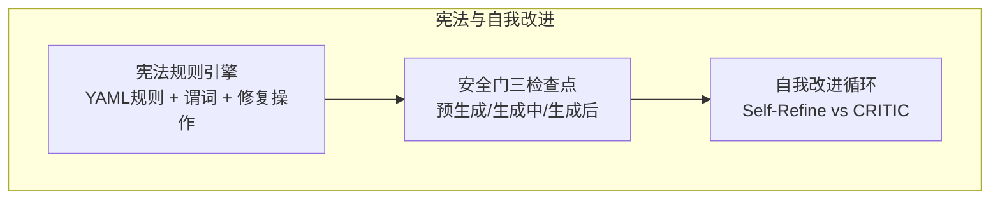
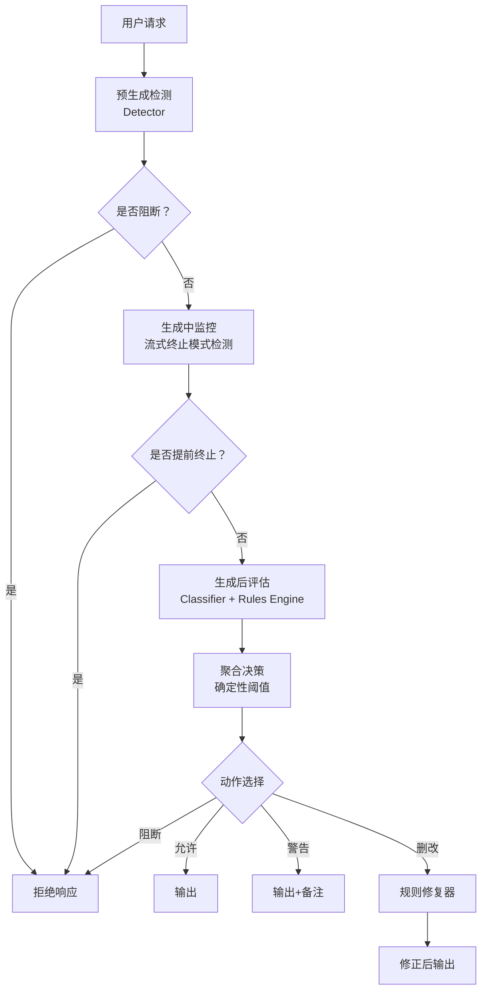
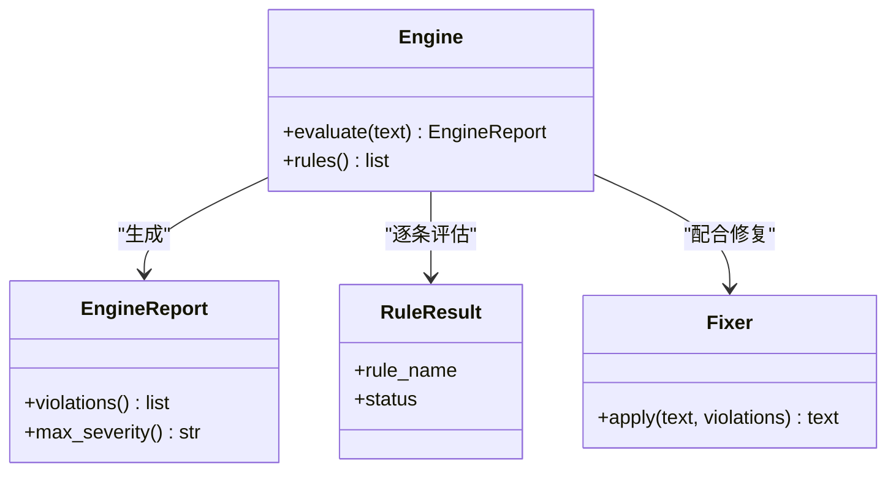
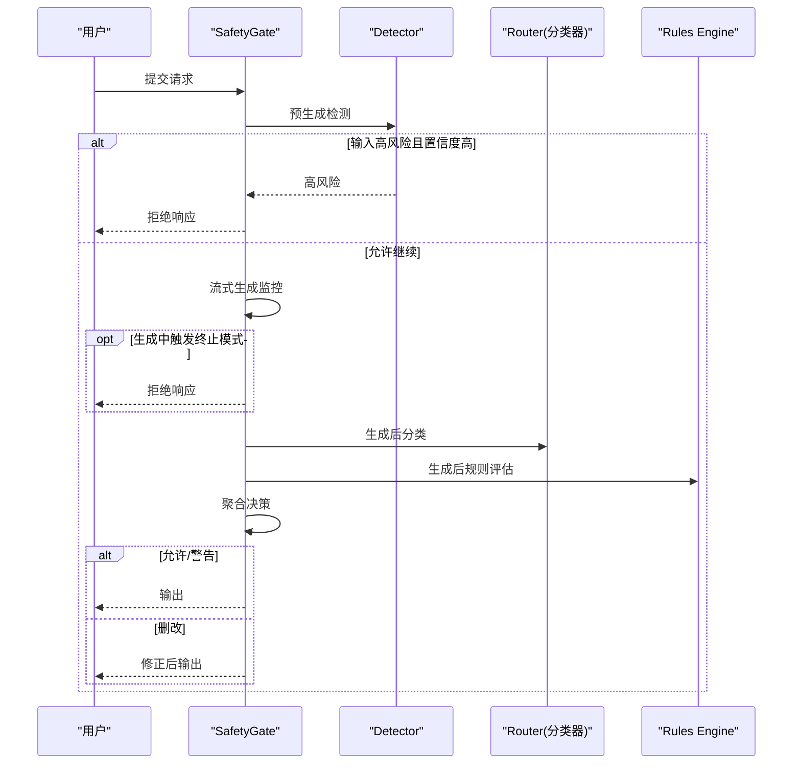
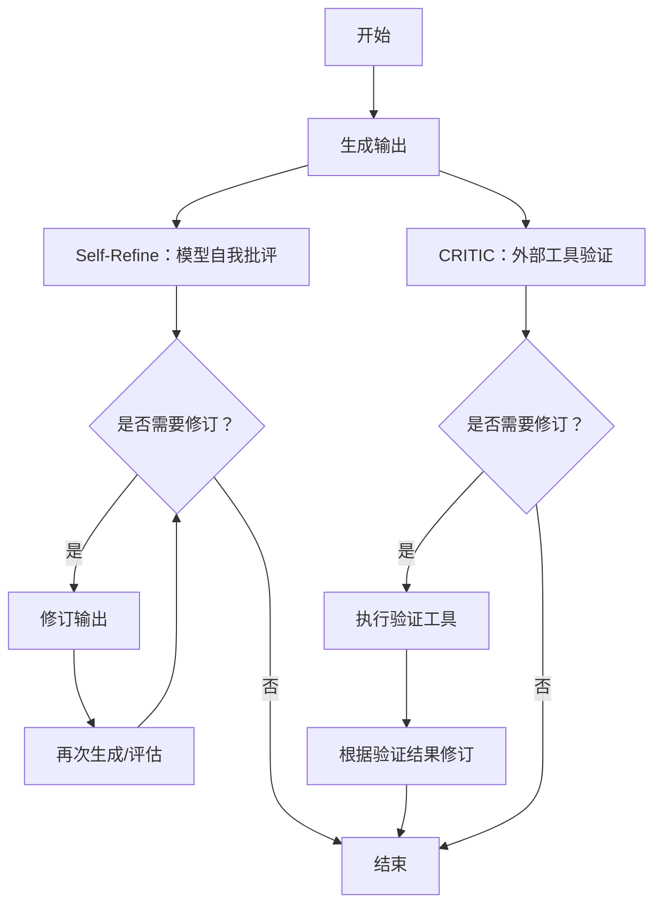
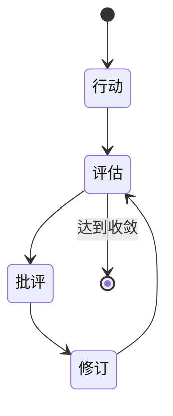
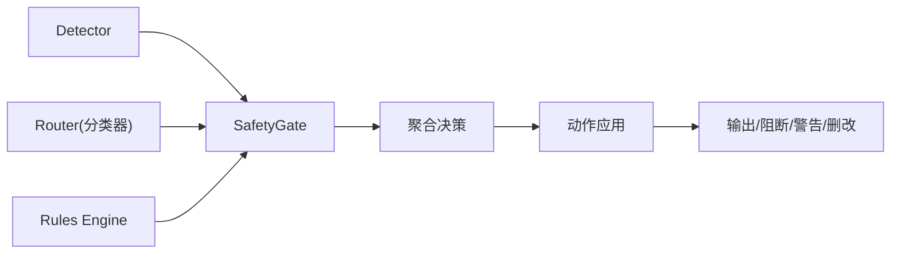

# 宪法AI自我改进机制

<cite>
**本文引用的文件**
- [phases/19-capstone-projects/86-constitutional-rules-engine/outputs/skill-constitutional-rules-engine.md](file://phases/19-capstone-projects/86-constitutional-rules-engine/outputs/skill-constitutional-rules-engine.md)
- [phases/19-capstone-projects/87-end-to-end-safety-gate/code/safety_gate.py](file://phases/19-capstone-projects/87-end-to-end-safety-gate/code/safety_gate.py)
- [site/data.js](file://site/data.js)
- [site/vue-app/summary/src/data/modules/self-refine-critic.js](file://site/vue-app/summary/src/data/modules/self-refine-critic.js)
- [site/vue-app/summary/src/data/content.js](file://site/vue-app/summary/src/data/content.js)
- [site/figures-frontier.js](file://site/figures-frontier.js)
</cite>

## 目录
1. [引言](#引言)
2. [项目结构](#项目结构)
3. [核心组件](#核心组件)
4. [架构总览](#架构总览)
5. [详细组件分析](#详细组件分析)
6. [依赖关系分析](#依赖关系分析)
7. [性能考量](#性能考量)
8. [故障排查指南](#故障排查指南)
9. [结论](#结论)
10. [附录](#附录)

## 引言
本文件围绕“宪法AI的自我改进机制”展开，系统阐述其核心理念（原则制定、自我约束、持续改进）、架构设计（原则编码、自我审查机制、反馈循环）以及实践路径（规则引擎、安全门、外部验证器）。文档以仓库中的课程与实战项目为依据，结合可视化图示，帮助读者从概念到实现全面理解如何构建具备自我改进能力的AI系统。

## 项目结构
本仓库以“阶段-课程-项目”的方式组织知识与实践，宪法AI相关的能力主要体现在以下模块：
- 规则引擎与宪法规则：以可声明的YAML规则表达原则，支持谓词组合与自动修复操作。
- 安全门（Safety Gate）：将输入检测、流式过滤、输出分类与规则引擎组合为端到端的三检查点安全门。
- 自我改进范式：通过Self-Refine与CRITIC（外部验证器）的对比，展示“生成→批评→修订”的反馈循环。

**图表来源**
- [phases/19-capstone-projects/86-constitutional-rules-engine/outputs/skill-constitutional-rules-engine.md:10-41](file://phases/19-capstone-projects/86-constitutional-rules-engine/outputs/skill-constitutional-rules-engine.md#L10-L41)
- [phases/19-capstone-projects/87-end-to-end-safety-gate/code/safety_gate.py:104-233](file://phases/19-capstone-projects/87-end-to-end-safety-gate/code/safety_gate.py#L104-L233)
- [site/vue-app/summary/src/data/modules/self-refine-critic.js:87-126](file://site/vue-app/summary/src/data/modules/self-refine-critic.js#L87-L126)

**章节来源**
- [site/data.js:1800-1808](file://site/data.js#L1800-L1808)
- [site/data.js:4703-4718](file://site/data.js#L4703-L4718)
- [site/data.js:15456-15496](file://site/data.js#L15456-L15496)

## 核心组件
- 宪法规则引擎
  - 规则以YAML定义，包含名称、严重度、适用条件（谓词）、必须满足项、解释说明及可选修复操作。
  - 支持原子与复合谓词组合，输出每条规则的评估状态（通过/违规/不适用），并汇总最高严重度。
- 端到端安全门
  - 预生成（输入检测）、生成中（流式终止模式检测）、生成后（分类器+规则引擎）三阶段判定。
  - 采用确定性聚合表，按严重度阈值选择允许/警告/删改/阻断。
- 自我改进循环
  - Self-Refine：模型自生成、自批评、自修订，保留完整历史以避免回退与重复错误。
  - CRITIC：将“批评”替换为外部工具验证（测试/静态检查/类型检查），能发现模型自我批评遗漏的崩溃型缺陷。

**章节来源**
- [phases/19-capstone-projects/86-constitutional-rules-engine/outputs/skill-constitutional-rules-engine.md:10-41](file://phases/19-capstone-projects/86-constitutional-rules-engine/outputs/skill-constitutional-rules-engine.md#L10-L41)
- [phases/19-capstone-projects/87-end-to-end-safety-gate/code/safety_gate.py:104-233](file://phases/19-capstone-projects/87-end-to-end-safety-gate/code/safety_gate.py#L104-L233)
- [site/vue-app/summary/src/data/modules/self-refine-critic.js:87-126](file://site/vue-app/summary/src/data/modules/self-refine-critic.js#L87-L126)

## 架构总览
下图展示了宪法AI自我改进的整体架构：以宪法规则为原则基座，通过安全门在生成前/中/后进行约束与修正，同时引入Self-Refine或CRITIC形成闭环反馈，持续提升输出质量与合规性。

**图表来源**
- [phases/19-capstone-projects/87-end-to-end-safety-gate/code/safety_gate.py:117-233](file://phases/19-capstone-projects/87-end-to-end-safety-gate/code/safety_gate.py#L117-L233)

## 详细组件分析

### 组件A：宪法规则引擎
- 数据模型与谓词
  - 原子谓词：包含/不包含正则、起止匹配、字数上下界。
  - 复合谓词：全满足/任一满足/非运算。
  - 修复操作：追加缺失、前置缺失、正则替换。
- 输出与制品
  - 评估返回每条规则的状态与最高严重度；制品包含草稿、修订稿与结构化差异。

**图表来源**
- [phases/19-capstone-projects/86-constitutional-rules-engine/outputs/skill-constitutional-rules-engine.md:14-41](file://phases/19-capstone-projects/86-constitutional-rules-engine/outputs/skill-constitutional-rules-engine.md#L14-L41)

**章节来源**
- [phases/19-capstone-projects/86-constitutional-rules-engine/outputs/skill-constitutional-rules-engine.md:10-41](file://phases/19-capstone-projects/86-constitutional-rules-engine/outputs/skill-constitutional-rules-engine.md#L10-L41)

### 组件B：端到端安全门（Safety Gate）
- 组件职责
  - 预生成：检测输入风险类别与置信度。
  - 生成中：基于滑动窗口识别终止类提示词，尽早截断高风险生成。
  - 生成后：分类器动作与规则引擎评估，汇总最高严重度。
- 决策聚合
  - 依据严重度阈值映射为允许/警告/删改/阻断。
- 动作应用
  - 阻断：返回固定拒绝文本。
  - 删改：先经分类器清洗，再由规则修复器对违规进行修复。
  - 警告：附加低严重度提示。
- 可观测性
  - 每请求生成跟踪对象，记录各阶段结果与最终动作与输出。

**图表来源**
- [phases/19-capstone-projects/87-end-to-end-safety-gate/code/safety_gate.py:117-233](file://phases/19-capstone-projects/87-end-to-end-safety-gate/code/safety_gate.py#L117-L233)

**章节来源**
- [phases/19-capstone-projects/87-end-to-end-safety-gate/code/safety_gate.py:104-233](file://phases/19-capstone-projects/87-end-to-end-safety-gate/code/safety_gate.py#L104-L233)

### 组件C：自我改进循环（Self-Refine vs CRITIC）
- Self-Refine
  - 单次输出内的生成→批评→修订微循环，保留完整历史以避免回退与重复错误。
- CRITIC
  - 将“批评”替换为外部工具验证（测试/静态检查/类型检查），能捕获模型自我批评遗漏的崩溃型缺陷。
- 关键差异
  - Self-Refine：纯模型自我批评，无需工具。
  - CRITIC：外部验证器落地真实信号，显著降低“自信幻觉”漏网率。

**图表来源**
- [site/vue-app/summary/src/data/modules/self-refine-critic.js:87-126](file://site/vue-app/summary/src/data/modules/self-refine-critic.js#L87-L126)
- [site/vue-app/summary/src/data/content.js:1461-1507](file://site/vue-app/summary/src/data/content.js#L1461-L1507)

**章节来源**
- [site/vue-app/summary/src/data/modules/self-refine-critic.js:87-126](file://site/vue-app/summary/src/data/modules/self-refine-critic.js#L87-L126)
- [site/vue-app/summary/src/data/content.js:1461-1507](file://site/vue-app/summary/src/data/content.js#L1461-L1507)

### 概念总览
- 反思循环（Reflection Loop）：行动→评估→批评→修订，质量随迭代上升。
- 与ToT（思维树）的区别：前者是单条输出的纵向反复修订，后者是多分支横向搜索。
- 工程化要点：工具调用需使用JSON Schema声明，模型按描述生成结构化调用；执行失败应返回结构化错误字符串，避免异常冒泡。

**图表来源**
- [site/figures-frontier.js:79-102](file://site/figures-frontier.js#L79-L102)

## 依赖关系分析
- 规则引擎依赖
  - 与安全门组合，形成“生成后规则评估”环节。
  - 与修复器协同，对违规进行自动化修复。
- 安全门内部依赖
  - 检测器（输入风险）→ 分类器路由（生成后）→ 规则引擎（生成后）→ 决策聚合→ 动作应用。
- 自我改进循环依赖
  - Self-Refine：模型自身生成与修订。
  - CRITIC：外部工具验证（测试/静态检查/类型检查）。

**图表来源**
- [phases/19-capstone-projects/87-end-to-end-safety-gate/code/safety_gate.py:104-233](file://phases/19-capstone-projects/87-end-to-end-safety-gate/code/safety_gate.py#L104-L233)

**章节来源**
- [phases/19-capstone-projects/87-end-to-end-safety-gate/code/safety_gate.py:27-53](file://phases/19-capstone-projects/87-end-to-end-safety-gate/code/safety_gate.py#L27-L53)

## 性能考量
- 三检查点开销
  - 预生成检测、生成中流式监控、生成后分类与规则评估均带来额外延迟与Token消耗。
- 迭代轮数控制
  - Self-Refine/CRITIC循环的迭代次数直接影响延迟与成本，应在预算范围内合理设置上限。
- 早期终止
  - 生成中阶段的终止模式检测可有效缩短高风险输出的生成时间。
- 聚合阈值
  - 通过调整阻断/警告/删改的置信度阈值，平衡安全性与可用性。

## 故障排查指南
- 规则引擎
  - 若规则未生效，检查谓词组合与适用条件是否正确；确认规则名称与修复操作配置。
  - 使用制品中的结构化差异定位草稿与修订稿的差异。
- 安全门
  - 若误判阻断，检查预生成检测的置信度阈值；若漏判，提高阈值或增强规则严重度。
  - 若生成中误杀，检查终止模式正则是否过于宽泛。
  - 若删改后为空，确认修复器是否正确应用，必要时回退至拒绝响应。
- 自我改进循环
  - 若Self-Refine无法发现崩溃型缺陷，切换为CRITIC并接入外部验证工具。
  - 控制迭代轮数，避免过度延迟与Token消耗。

**章节来源**
- [phases/19-capstone-projects/86-constitutional-rules-engine/outputs/skill-constitutional-rules-engine.md:34-41](file://phases/19-capstone-projects/86-constitutional-rules-engine/outputs/skill-constitutional-rules-engine.md#L34-L41)
- [phases/19-capstone-projects/87-end-to-end-safety-gate/code/safety_gate.py:158-197](file://phases/19-capstone-projects/87-end-to-end-safety-gate/code/safety_gate.py#L158-L197)
- [site/vue-app/summary/src/data/modules/self-refine-critic.js:87-126](file://site/vue-app/summary/src/data/modules/self-refine-critic.js#L87-L126)

## 结论
宪法AI的自我改进机制以“原则—约束—反馈”为核心闭环：宪法规则提供不可逾越的原则边界，安全门在生成前/中/后实施动态约束与修正，Self-Refine/CRITIC形成高质量输出的持续优化路径。通过规则引擎与安全门的工程化组合，以及外部验证器的引入，系统能够在保证安全性的同时，逐步提升输出质量与一致性。

## 附录
- 实施建议
  - 优先建立清晰的宪法规则集，覆盖高风险场景与敏感领域。
  - 在生产环境中部署三检查点安全门，确保端到端可观测与可审计。
  - 在关键任务中引入CRITIC外部验证器，减少模型自我批评的盲区。
  - 对自我改进循环设定预算上限，结合阈值策略平衡质量与成本。
- 实际应用案例
  - 规则引擎用于输出约束与合规检查，支持结构化差异与修复操作。
  - 安全门用于端到端的输入/输出/中间态治理，提供统一的聚合决策与动作应用。
  - 自我改进循环用于代码助手与复杂推理任务，提升输出稳定性与正确性。