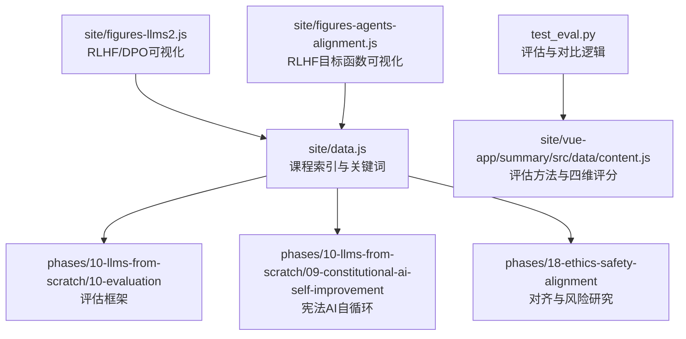
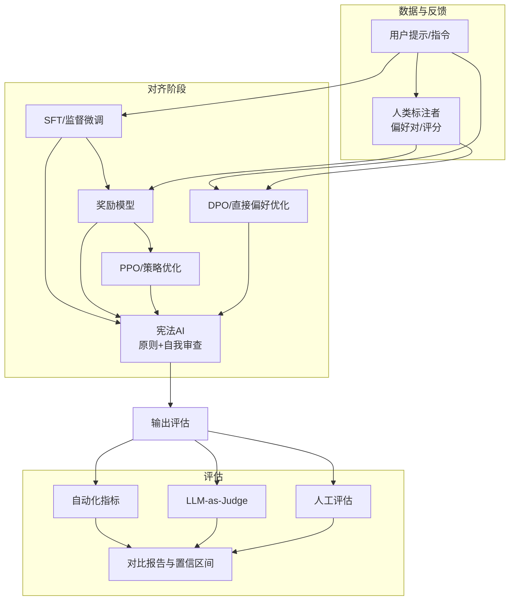
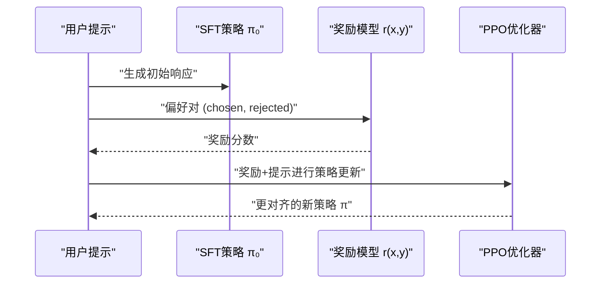
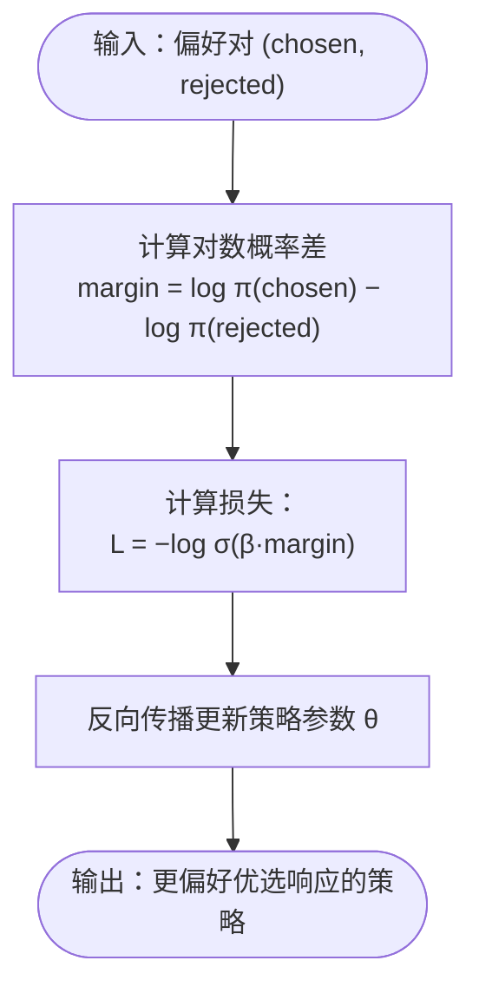
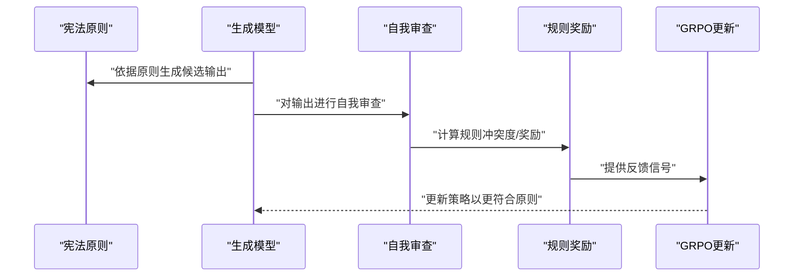
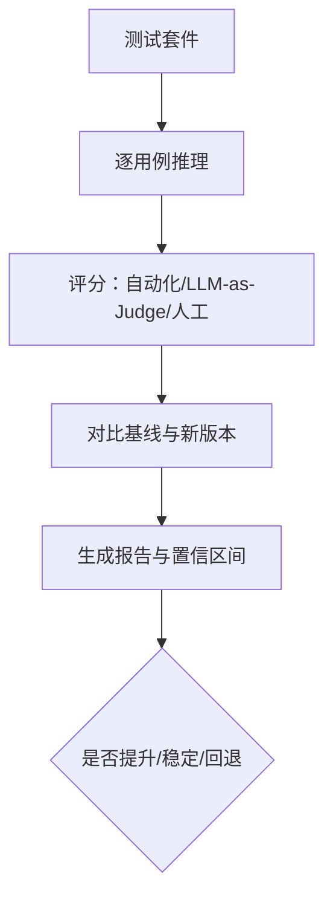
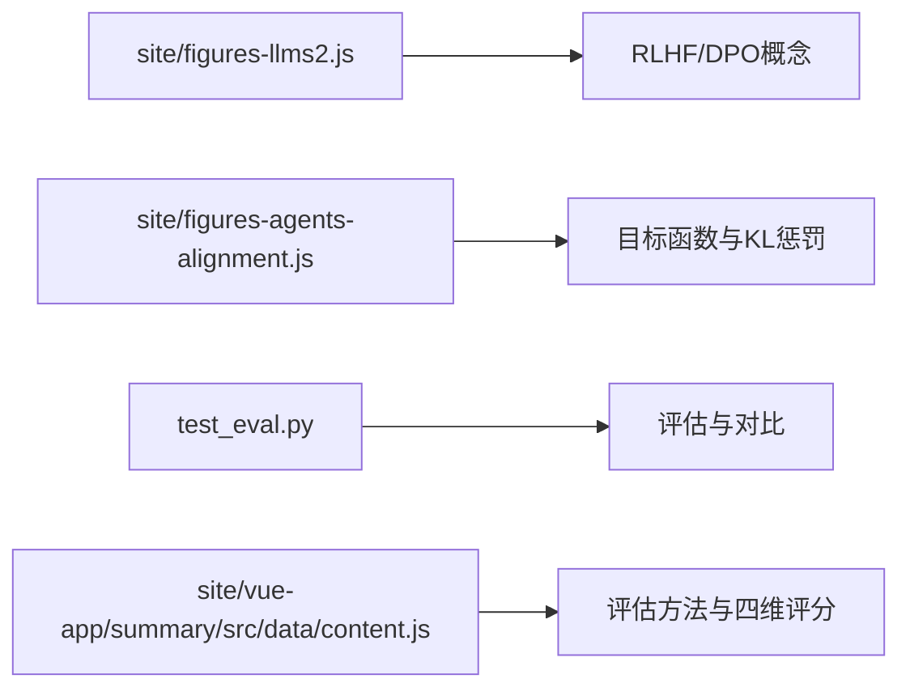

# 对齐方法与评估

<cite>
**本文引用的文件**   
- [site/figures-llms2.js](file://site/figures-llms2.js)
- [site/figures-agents-alignment.js](file://site/figures-agents-alignment.js)
- [site/data.js](file://site/data.js)
- [test_eval.py](file://test_eval.py)
- [site/vue-app/summary/src/data/content.js](file://site/vue-app/summary/src/data/content.js)
</cite>

## 目录
1. [引言](#引言)
2. [项目结构](#项目结构)
3. [核心组件](#核心组件)
4. [架构总览](#架构总览)
5. [详细组件分析](#详细组件分析)
6. [依赖分析](#依赖分析)
7. [性能考虑](#性能考虑)
8. [故障排查指南](#故障排查指南)
9. [结论](#结论)
10. [附录](#附录)

## 引言
本文件围绕“对齐方法与评估”主题，系统梳理并可视化RLHF（基于人类反馈的强化学习）、DPO（直接偏好优化）以及宪法AI的自我改进机制，并给出可操作的模型评估框架与最佳实践。目标是帮助读者在理解原理的同时，掌握如何在工程实践中构建安全、可控且有用的对齐流水线。

## 项目结构
该仓库以“阶段式课程+实战工坊”的方式组织内容，与对齐相关的关键模块主要分布在以下路径：
- RLHF与DPO的可视化与教学材料：site/figures-*.js
- 安全与对齐主题的课程与资料：phases/18-ethics-safety-alignment、phases/10-llms-from-scratch/09-constitutional-ai-self-improvement、phases/10-llms-from-scratch/10-evaluation
- 评估脚本与前端展示数据：test_eval.py、site/vue-app/summary/src/data/content.js、site/data.js

图示来源
- [site/figures-llms2.js:111-215](file://site/figures-llms2.js#L111-L215)
- [site/figures-agents-alignment.js:253-331](file://site/figures-agents-alignment.js#L253-L331)
- [site/data.js:1800-1808](file://site/data.js#L1800-L1808)

章节来源
- [site/figures-llms2.js:111-215](file://site/figures-llms2.js#L111-L215)
- [site/figures-agents-alignment.js:253-331](file://site/figures-agents-alignment.js#L253-L331)
- [site/data.js:1800-1808](file://site/data.js#L1800-L1808)

## 核心组件
- RLHF三阶段流水线：SFT → 奖励模型 → PPO；通过可视化组件呈现数据流与目标函数。
- DPO直接偏好优化：跳过奖励模型，直接以偏好对训练策略，损失函数与隐式KL约束。
- 宪法AI自我改进：以“原则”为约束，模型自我审查与迭代更新，形成闭环。
- 评估框架：自动化指标、LLM-as-Judge、人工评估；四维评分体系与置信区间。

章节来源
- [site/figures-llms2.js:111-215](file://site/figures-llms2.js#L111-L215)
- [site/figures-agents-alignment.js:253-331](file://site/figures-agents-alignment.js#L253-L331)
- [site/data.js:1800-1808](file://site/data.js#L1800-L1808)
- [test_eval.py:175-216](file://test_eval.py#L175-L216)
- [site/vue-app/summary/src/data/content.js:469-499](file://site/vue-app/summary/src/data/content.js#L469-L499)

## 架构总览
下图展示了从数据到对齐再到评估的整体架构：人类反馈驱动策略优化，奖励模型或直接偏好信号作为监督信号，评估体系贯穿训练与部署。

图示来源
- [site/figures-llms2.js:111-215](file://site/figures-llms2.js#L111-L215)
- [site/figures-agents-alignment.js:253-331](file://site/figures-agents-alignment.js#L253-L331)
- [site/data.js:1800-1808](file://site/data.js#L1800-L1808)

## 详细组件分析

### RLHF流水线与目标函数
- 三阶段流程：SFT（演示数据）→ 奖励模型（偏好对）→ PPO（最大化奖励减去KL惩罚，靠近参考策略）。
- 目标函数可视化：展示奖励曲线、KL曲线与合成目标曲线，突出β（KL强度）对策略漂移的影响。

图示来源
- [site/figures-llms2.js:111-174](file://site/figures-llms2.js#L111-L174)
- [site/figures-agents-alignment.js:253-295](file://site/figures-agents-alignment.js#L253-L295)

章节来源
- [site/figures-llms2.js:111-174](file://site/figures-llms2.js#L111-L174)
- [site/figures-agents-alignment.js:253-295](file://site/figures-agents-alignment.js#L253-L295)

### DPO直接偏好优化
- 核心思想：不显式训练奖励模型，直接以偏好对训练策略，使“优选响应”相对“被拒响应”的对数概率差更大。
- 损失函数与隐式KL：损失为−log sigmoid(β·margin)，margin越大，损失越小；β控制隐式KL约束强度。
- 与RLHF对比：DPO省去奖励模型训练环节，简化流程但需高质量偏好对。

图示来源
- [site/figures-llms2.js:176-215](file://site/figures-llms2.js#L176-L215)
- [site/figures-agents-alignment.js:297-331](file://site/figures-agents-alignment.js#L297-L331)

章节来源
- [site/figures-llms2.js:176-215](file://site/figures-llms2.js#L176-L215)
- [site/figures-agents-alignment.js:297-331](file://site/figures-agents-alignment.js#L297-L331)

### 宪法AI的自我改进机制
- 原则制定：建立“宪法”层级规则（如硬性禁止、软性默认、可调整边界），用于约束与裁决。
- 自我审查：模型对自身输出进行审阅，识别潜在违规或不当内容。
- 持续优化：基于审查结果与规则冲突度，采用组相对优势（GRPO）等方法进行策略更新。
- 与RLHF/DPO的关系：以规则替代部分人类标注，降低对外部反馈的依赖，同时保留对齐信号。

图示来源
- [site/data.js:1800-1808](file://site/data.js#L1800-L1808)

章节来源
- [site/data.js:1800-1808](file://site/data.js#L1800-L1808)

### 评估框架与方法
- 自动化指标：BLEU、ROUGE-L、F1、准确率等，适用于有标准答案的任务。
- LLM-as-Judge：以更强模型对输出进行评分，适合开放问答、客服等场景。
- 人工评估：上线前最终验收，覆盖安全、合规、可用性等维度。
- 四维评分体系：相关性、准确性、有用性、安全性；并使用置信区间进行统计显著性判断。
- 对比与报告：对新旧版本进行均值差异与趋势判定，辅助决策。

图示来源
- [test_eval.py:175-216](file://test_eval.py#L175-L216)
- [site/vue-app/summary/src/data/content.js:469-499](file://site/vue-app/summary/src/data/content.js#L469-L499)

章节来源
- [test_eval.py:175-216](file://test_eval.py#L175-L216)
- [site/vue-app/summary/src/data/content.js:469-499](file://site/vue-app/summary/src/data/content.js#L469-L499)

## 依赖分析
- 可视化组件依赖于站点脚本中的交互状态与渲染函数，用于演示RLHF与DPO的核心思想。
- 评估脚本依赖于模型推理与评分函数，输出统一的评估结果结构，便于后续对比与报告生成。
- 前端数据模块定义了评估方法与评分维度，指导实际评测实践。

图示来源
- [site/figures-llms2.js:111-215](file://site/figures-llms2.js#L111-L215)
- [site/figures-agents-alignment.js:253-331](file://site/figures-agents-alignment.js#L253-L331)
- [test_eval.py:175-216](file://test_eval.py#L175-L216)
- [site/vue-app/summary/src/data/content.js:469-499](file://site/vue-app/summary/src/data/content.js#L469-L499)

章节来源
- [site/figures-llms2.js:111-215](file://site/figures-llms2.js#L111-L215)
- [site/figures-agents-alignment.js:253-331](file://site/figures-agents-alignment.js#L253-L331)
- [test_eval.py:175-216](file://test_eval.py#L175-L216)
- [site/vue-app/summary/src/data/content.js:469-499](file://site/vue-app/summary/src/data/content.js#L469-L499)

## 性能考虑
- 训练效率：DPO避免奖励模型训练，减少一轮额外建模开销；但在偏好对质量与规模上要求更高。
- 推理成本：RLHF的PPO阶段需要在线策略优化，需权衡延迟与对齐收益。
- 评估吞吐：自动化指标与LLM-as-Judge可快速筛选与排序，人工评估应聚焦关键场景与边界案例。
- 统计稳健性：使用置信区间与多维度评分，避免单一指标误导。

## 故障排查指南
- 奖励漂移与奖励黑客：当KL惩罚过弱时，策略可能过度拟合代理奖励而偏离参考策略。应增大β或引入更鲁棒的奖励信号。
- 偏好对偏差：DPO依赖高质量偏好对；若存在标注噪声或分布偏移，需清洗数据或采用重加权策略。
- 评估不一致：自动化指标与人工评估差异较大时，应检查测试套件代表性与评分一致性，必要时引入双盲评审。
- 规则冲突与误杀：宪法AI的规则过于严格可能导致误伤；应定期审计规则优先级与边界条件，结合GRPO进行微调。

章节来源
- [site/figures-agents-alignment.js:253-295](file://site/figures-agents-alignment.js#L253-L295)
- [site/figures-llms2.js:176-215](file://site/figures-llms2.js#L176-L215)
- [site/vue-app/summary/src/data/content.js:469-499](file://site/vue-app/summary/src/data/content.js#L469-L499)

## 结论
- RLHF与DPO分别代表“先奖励再优化”和“直接偏好优化”的两条路径，各有权衡；在资源与数据条件下选择合适方法。
- 宪法AI以规则为核心，结合自我审查与GRPO，形成可持续的自我改进闭环，有助于降低对外部反馈的依赖并增强可控性。
- 评估体系应覆盖自动化、LLM判官与人工评估三个层次，采用四维评分与统计显著性，确保对齐效果可验证、可复现、可回归。

## 附录
- 关键术语与课程索引可参考站点数据中的课程卡片与关键词，便于进一步学习与检索。

章节来源
- [site/data.js:1800-1808](file://site/data.js#L1800-L1808)