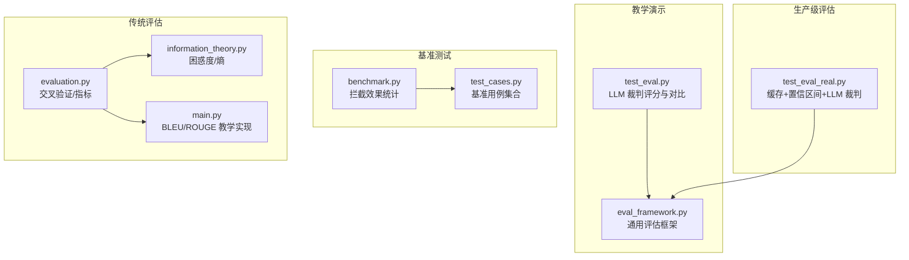
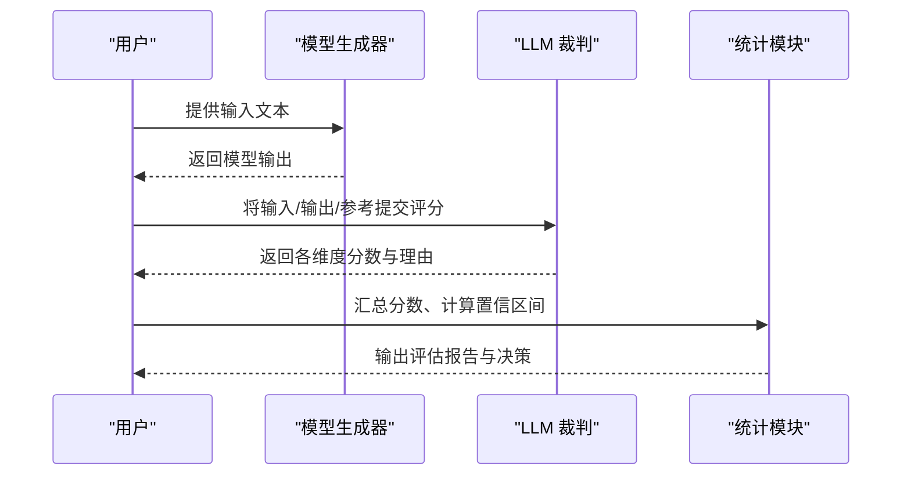
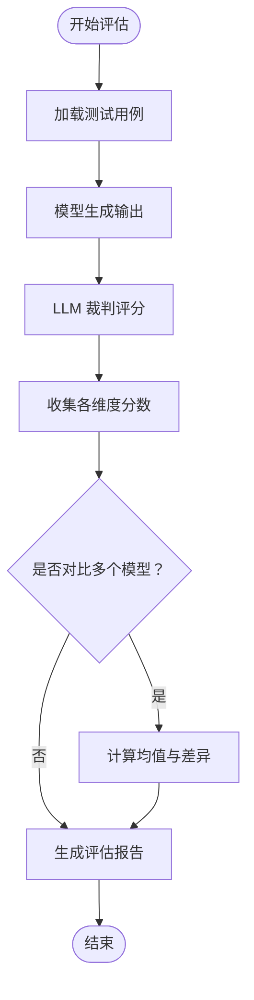
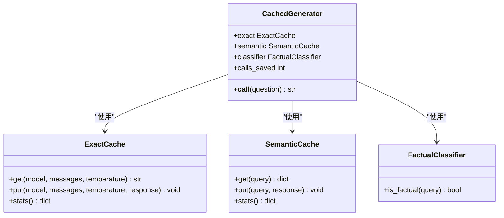
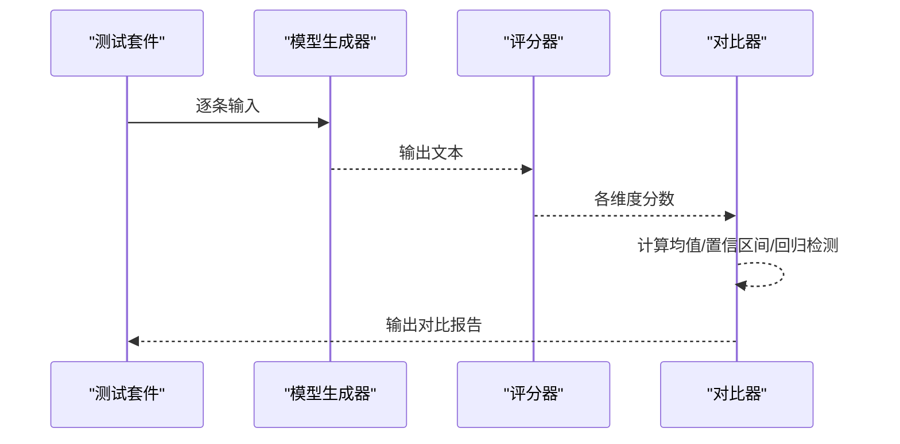
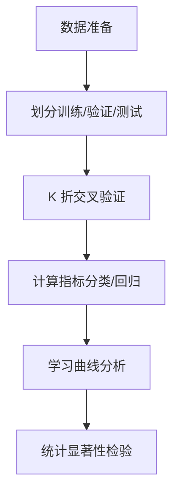
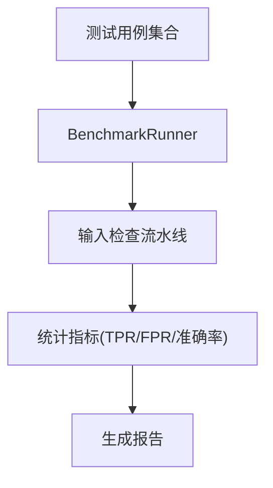
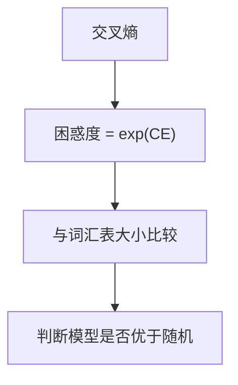
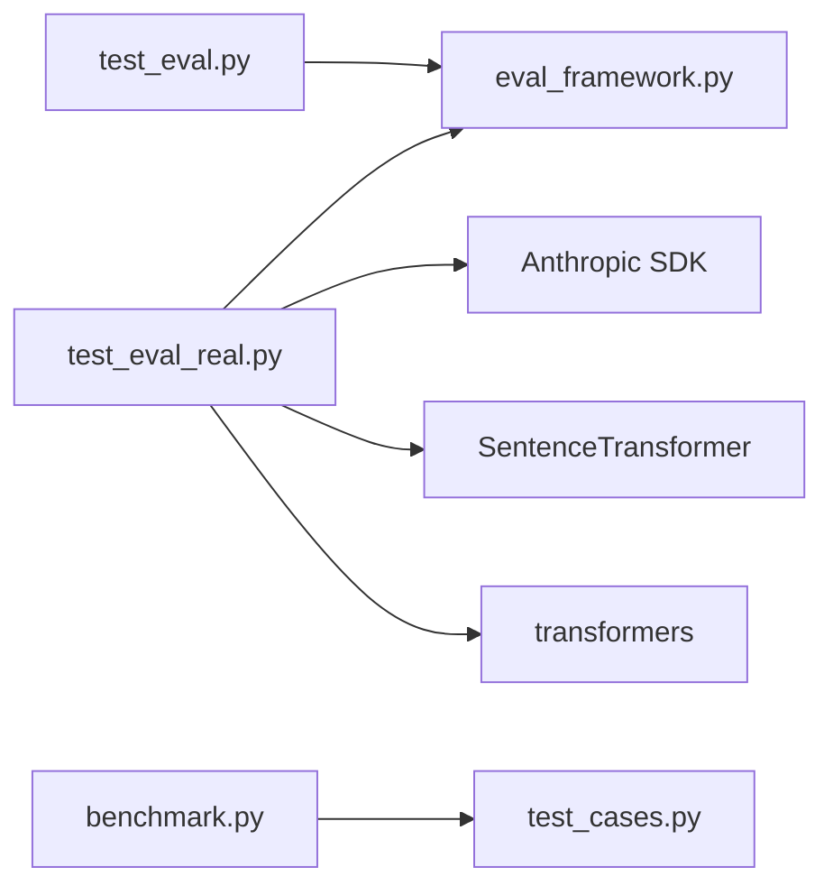

# 模型评估与测试

<cite>
**本文引用的文件**
- [test_eval.py](file://test_eval.py)
- [test_eval_real.py](file://test_eval_real.py)
- [eval_framework.py](file://phases/11-llm-engineering/10-evaluation/code/eval_framework.py)
- [evaluation.py](file://phases/02-ml-fundamentals/09-model-evaluation/code/evaluation.py)
- [benchmark.py](file://guardrails-sandbox/backend/benchmark.py)
- [test_cases.py](file://guardrails-sandbox/backend/test_cases.py)
- [information_theory.py](file://phases/01-math-foundations/09-information-theory/code/information_theory.py)
- [main.py](file://phases/05-nlp-foundations-to-advanced/11-machine-translation/code/main.py)
</cite>

## 目录
1. [简介](#简介)
2. [项目结构](#项目结构)
3. [核心组件](#核心组件)
4. [架构概览](#架构概览)
5. [详细组件分析](#详细组件分析)
6. [依赖分析](#依赖分析)
7. [性能考虑](#性能考虑)
8. [故障排除指南](#故障排除指南)
9. [结论](#结论)
10. [附录](#附录)

## 简介
本文件面向大语言模型评估与测试，系统化梳理仓库中的评估框架与实践案例，涵盖自动化评估指标、人工评估标准、基准测试与生产级缓存优化等多维评估体系。文档重点说明困惑度、BLEU、ROUGE、BERTScore等指标的含义与计算思路，并提供完整的评估代码实现路径与可视化流程图，帮助读者快速构建自动化评估流水线。同时分析不同评估方法的适用场景与局限性，给出评估结果解读与改进建议，并讨论评估在模型对齐过程中的关键作用。

## 项目结构
该项目围绕“评估”主题提供了多套示例与工具：
- 教学演示型评估：test_eval.py 展示了基于 LLM 裁判的评分流程与对比逻辑
- 生产级评估：test_eval_real.py 引入精确缓存、语义缓存与置信区间统计
- 通用评估框架：eval_framework.py 提供 LLM-as-Judge、ROUGE-L、置信区间等通用能力
- 传统机器学习评估：evaluation.py 提供交叉验证、混淆矩阵、AUC 等经典指标
- 安全与对齐基准：guardrails-sandbox 提供对抗样本与拦截效果的基准测试
- 数学基础：information_theory.py 提供困惑度与熵的基础实现
- 传统 NLP 指标：main.py 提供 BLEU 与 ROUGE 的教学实现

**图表来源**
- [test_eval.py:1-249](file://test_eval.py#L1-L249)
- [test_eval_real.py:1-447](file://test_eval_real.py#L1-L447)
- [eval_framework.py:1-476](file://phases/11-llm-engineering/10-evaluation/code/eval_framework.py#L1-L476)
- [benchmark.py:1-169](file://guardrails-sandbox/backend/benchmark.py#L1-L169)
- [test_cases.py:1-155](file://guardrails-sandbox/backend/test_cases.py#L1-L155)
- [evaluation.py:1-462](file://phases/02-ml-fundamentals/09-model-evaluation/code/evaluation.py#L1-L462)
- [information_theory.py:314-346](file://phases/01-math-foundations/09-information-theory/code/information_theory.py#L314-L346)
- [main.py:33-93](file://phases/05-nlp-foundations-to-advanced/11-machine-translation/code/main.py#L33-L93)

**章节来源**
- [test_eval.py:1-249](file://test_eval.py#L1-L249)
- [test_eval_real.py:1-447](file://test_eval_real.py#L1-L447)
- [eval_framework.py:1-476](file://phases/11-llm-engineering/10-evaluation/code/eval_framework.py#L1-L476)
- [benchmark.py:1-169](file://guardrails-sandbox/backend/benchmark.py#L1-L169)
- [test_cases.py:1-155](file://guardrails-sandbox/backend/test_cases.py#L1-L155)
- [evaluation.py:1-462](file://phases/02-ml-fundamentals/09-model-evaluation/code/evaluation.py#L1-L462)
- [information_theory.py:314-346](file://phases/01-math-foundations/09-information-theory/code/information_theory.py#L314-L346)
- [main.py:33-93](file://phases/05-nlp-foundations-to-advanced/11-machine-translation/code/main.py#L33-L93)

## 核心组件
- 数据结构与评分单元
  - TestCase：封装输入文本、参考输出、分类标签与唯一 ID
  - EvalScore：封装评分维度、得分与理由
  - EvalResult：封装测试用例 ID、模型输出、评分列表与时间戳
- LLM 裁判与评分
  - 教学版：基于规则与关键词匹配的模拟评分
  - 生产版：调用 LLM 生成评分与理由，并进行 JSON 解析与容错
- 缓存与性能优化
  - 精确缓存：相同输入直出，支持 TTL 与访问统计
  - 语义缓存：基于句子向量相似度的语义命中
  - 事实性分类器：区分事实性与创意性问题，指导缓存策略
- 统计与置信区间
  - Wilson 置信区间：用于比例估计的稳健区间
  - Bootstrap 置信区间：非参数估计，适用于小样本
- 基准测试
  - BenchmarkRunner：对输入检查流水线进行全量/分类评估，计算 TPR/FPR/Precision/F1 等指标

**章节来源**
- [test_eval.py:10-49](file://test_eval.py#L10-L49)
- [test_eval_real.py:119-256](file://test_eval_real.py#L119-L256)
- [eval_framework.py:10-48](file://phases/11-llm-engineering/10-evaluation/code/eval_framework.py#L10-L48)
- [benchmark.py:10-169](file://guardrails-sandbox/backend/benchmark.py#L10-L169)

## 架构概览
整体评估架构分为三层：
- 输入层：测试用例与模型生成器
- 评分层：LLM-as-Judge 或规则模拟评分
- 统计层：汇总、对比、置信区间与决策

**图表来源**
- [test_eval.py:175-249](file://test_eval.py#L175-L249)
- [test_eval_real.py:318-446](file://test_eval_real.py#L318-L446)
- [eval_framework.py:82-368](file://phases/11-llm-engineering/10-evaluation/code/eval_framework.py#L82-L368)

## 详细组件分析

### 教学演示评估（test_eval.py）
- 数据结构与评分
  - 使用 TestCase/EvalScore/EvalResult 三元组组织评估数据
  - llm_judge 采用中文字符集交集与关键词启发式规则进行评分
- 评分维度
  - relevance/correctness/helpfulness/safety 四维评分
- 对比与决策
  - compare 计算每维均值差异，标记回归/提升/稳定
- 适用场景
  - 快速验证模型回答质量，便于教学与原型迭代

**图表来源**
- [test_eval.py:175-249](file://test_eval.py#L175-L249)

**章节来源**
- [test_eval.py:10-141](file://test_eval.py#L10-L141)
- [test_eval.py:175-249](file://test_eval.py#L175-L249)

### 生产级评估（test_eval_real.py）
- 缓存层
  - ExactCache：精确命中，温度>0 不缓存，TTL 控制
  - SemanticCache：语义相似度检索，SentenceTransformer 向量化
  - FactualClassifier：事实性判断，决定是否进入语义缓存
- 评分与统计
  - LLM 裁判生成 JSON 分数与理由，失败时回退默认分
  - wilson_ci 计算总体与维度的置信区间
  - 按分类统计平均分与低分用例
- 适用场景
  - 高吞吐、低成本的生产环境评估，兼顾准确性与性能

**图表来源**
- [test_eval_real.py:220-256](file://test_eval_real.py#L220-L256)
- [test_eval_real.py:119-218](file://test_eval_real.py#L119-L218)

**章节来源**
- [test_eval_real.py:60-256](file://test_eval_real.py#L60-L256)
- [test_eval_real.py:318-446](file://test_eval_real.py#L318-L446)

### 通用评估框架（eval_framework.py）
- LLM-as-Judge
  - score_with_llm_judge：模拟评分 + 生成理由
  - simulate_judge_score：基于长度、关键词重叠与安全模式的启发式评分
- 指标与统计
  - ROUGE-L：最长公共子序列的 F1
  - 置信区间：Wilson 与 Bootstrap
  - compare_eval_runs：跨版本对比与回归检测
- 适用场景
  - 多模型对比、标准化评估流程与可复现实验

**图表来源**
- [eval_framework.py:284-368](file://phases/11-llm-engineering/10-evaluation/code/eval_framework.py#L284-L368)
- [eval_framework.py:146-193](file://phases/11-llm-engineering/10-evaluation/code/eval_framework.py#L146-L193)

**章节来源**
- [eval_framework.py:82-368](file://phases/11-llm-engineering/10-evaluation/code/eval_framework.py#L82-L368)

### 传统机器学习评估（evaluation.py）
- 分割与交叉验证
  - train_val_test_split：随机划分
  - kfold_split / stratified_kfold_split：K 折与分层 K 折
  - cross_validate：统一的交叉验证接口
- 分类指标
  - 混淆矩阵、准确率、精确率、召回率、F1、AUC-ROC
- 回归指标
  - MSE、RMSE、MAE、R-squared
- 学习曲线与模型比较
  - learning_curve：训练集大小与性能关系
  - 统计显著性检验：配对 t 检验

**图表来源**
- [evaluation.py:5-96](file://phases/02-ml-fundamentals/09-model-evaluation/code/evaluation.py#L5-L96)
- [evaluation.py:107-188](file://phases/02-ml-fundamentals/09-model-evaluation/code/evaluation.py#L107-L188)
- [evaluation.py:190-224](file://phases/02-ml-fundamentals/09-model-evaluation/code/evaluation.py#L190-L224)

**章节来源**
- [evaluation.py:5-462](file://phases/02-ml-fundamentals/09-model-evaluation/code/evaluation.py#L5-L462)

### 基准测试（guardrails-sandbox）
- 用例设计
  - normal、injection、semantic、pii、toxicity、edge 六类用例
- 基准运行
  - BenchmarkRunner：对每个用例执行输入检查，统计准确率、TPR、FPR、Precision、F1
  - 支持按类别与拦截层统计
- 适用场景
  - 安全与对齐评估，衡量防护系统的有效性

**图表来源**
- [benchmark.py:14-169](file://guardrails-sandbox/backend/benchmark.py#L14-L169)
- [test_cases.py:18-155](file://guardrails-sandbox/backend/test_cases.py#L18-L155)

**章节来源**
- [benchmark.py:10-169](file://guardrails-sandbox/backend/benchmark.py#L10-L169)
- [test_cases.py:10-155](file://guardrails-sandbox/backend/test_cases.py#L10-L155)

### 数学基础与传统指标
- 困惑度（Perplexity）
  - 基于交叉熵的困惑度定义，与词汇表大小比较判断模型优劣
- BLEU 与 ROUGE
  - BLEU：n-gram 重叠平滑（教学版未使用平滑，强调概念）
  - ROUGE：基于最长公共子序列的 F1

**图表来源**
- [information_theory.py:314-346](file://phases/01-math-foundations/09-information-theory/code/information_theory.py#L314-L346)
- [main.py:33-93](file://phases/05-nlp-foundations-to-advanced/11-machine-translation/code/main.py#L33-L93)

**章节来源**
- [information_theory.py:314-346](file://phases/01-math-foundations/09-information-theory/code/information_theory.py#L314-L346)
- [main.py:33-93](file://phases/05-nlp-foundations-to-advanced/11-machine-translation/code/main.py#L33-L93)

## 依赖分析
- 组件耦合
  - test_eval.py 与 eval_framework.py 在数据结构与评分流程上保持一致，便于迁移
  - test_eval_real.py 与 eval_framework.py 共享置信区间与对比逻辑
  - guardrails-sandbox 的基准测试独立于评估脚本，但可作为对齐评估的补充
- 外部依赖
  - test_eval_real.py 依赖 Anthropic SDK、SentenceTransformer、transformers 等
  - evaluation.py 为纯数学实现，无外部依赖

**图表来源**
- [test_eval.py:1-249](file://test_eval.py#L1-L249)
- [test_eval_real.py:1-16](file://test_eval_real.py#L1-L16)
- [eval_framework.py:1-476](file://phases/11-llm-engineering/10-evaluation/code/eval_framework.py#L1-L476)
- [benchmark.py:1-169](file://guardrails-sandbox/backend/benchmark.py#L1-L169)
- [test_cases.py:1-155](file://guardrails-sandbox/backend/test_cases.py#L1-L155)

**章节来源**
- [test_eval.py:1-249](file://test_eval.py#L1-L249)
- [test_eval_real.py:1-16](file://test_eval_real.py#L1-L16)
- [eval_framework.py:1-476](file://phases/11-llm-engineering/10-evaluation/code/eval_framework.py#L1-L476)
- [benchmark.py:1-169](file://guardrails-sandbox/backend/benchmark.py#L1-L169)
- [test_cases.py:1-155](file://guardrails-sandbox/backend/test_cases.py#L1-L155)

## 性能考虑
- 缓存策略
  - 精确缓存适合确定性输出，避免重复 API 调用
  - 语义缓存适合事实性问题，需权衡向量检索成本
- 指标选择
  - 困惑度适合语言建模，BLEU/ROUGE 适合生成任务，但需注意平滑与领域适配
  - 置信区间有助于判断评估稳定性，Bootstrap 更稳健但计算开销更大
- 实践建议
  - 在生产环境优先引入缓存层，结合事实性分类器减少无效调用
  - 对小样本场景优先使用 Wilson 置信区间，大样本可用 Bootstrap
  - 对齐评估建议结合基准测试与人工抽样，确保覆盖率与代表性

## 故障排除指南
- LLM 裁判评分解析失败
  - 现象：返回 JSON 不完整或格式异常
  - 处理：捕获异常并回退至默认分，同时记录理由片段以便人工复核
- 缓存未命中
  - 现象：命中率低或 TTL 导致过期
  - 处理：检查温度参数（>0 不缓存）、阈值设置与最大容量
- 指标不稳定
  - 现象：均值波动较大
  - 处理：扩大样本量、使用置信区间、检查数据分布与异常值

**章节来源**
- [test_eval_real.py:338-361](file://test_eval_real.py#L338-L361)
- [test_eval_real.py:157-159](file://test_eval_real.py#L157-L159)
- [eval_framework.py:183-215](file://phases/11-llm-engineering/10-evaluation/code/eval_framework.py#L183-L215)

## 结论
本仓库提供了从教学演示到生产级评估的完整评估体系：以 LLM-as-Judge 为核心，结合缓存优化、置信区间与对比分析，形成可扩展、可复现的评估流水线；同时通过基准测试强化对齐与安全维度的评估。建议在实际落地中根据场景选择合适的指标与缓存策略，并持续以置信区间与对比报告驱动模型迭代与发布决策。

## 附录
- 评估指标速查
  - 困惑度：衡量语言模型不确定性，越低越好
  - BLEU：n-gram 重叠度量，适合抽取式任务
  - ROUGE：基于最长公共子序列的召回/精度/F1，适合摘要与生成
  - BERTScore：基于词嵌入相似度的语义匹配，适合细粒度一致性评估
- 评估代码实现路径
  - 教学演示：[test_eval.py:175-249](file://test_eval.py#L175-L249)
  - 生产级评估：[test_eval_real.py:318-446](file://test_eval_real.py#L318-L446)
  - 通用框架：[eval_framework.py:82-368](file://phases/11-llm-engineering/10-evaluation/code/eval_framework.py#L82-L368)
  - 传统评估：[evaluation.py:107-224](file://phases/02-ml-fundamentals/09-model-evaluation/code/evaluation.py#L107-L224)
  - 基准测试：[benchmark.py:14-169](file://guardrails-sandbox/backend/benchmark.py#L14-L169)